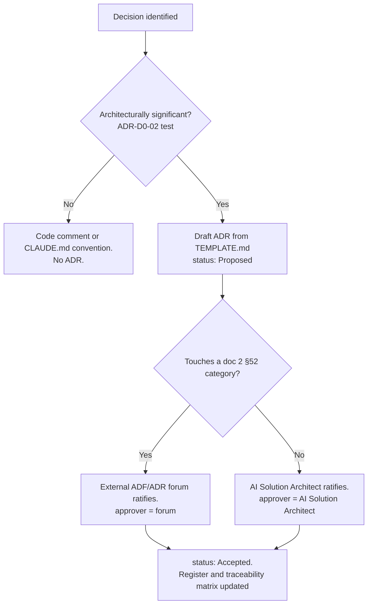

# ADR-D0-01 — Adopt an in-repository ADR library with a CMMI DAR-aligned template

## 1. Summary

PFF AI will maintain its architecture decisions as an in-repository ADR library at
`docs/architecture/adr/`, written to a template aligned with CMMI-DEV **Decision Analysis
and Resolution**. This is a deliberate, recorded departure from `MD files/2 §52`, which
states that the application repository does not require an ADR folder — that guidance
assumed decision records would live entirely in an external ADF/ADR process, which leaves
the codebase without the traceable evidence that doc 20 §29, §30 and §115 require.

## 2. Context and Problem Statement

The specification set is unusually complete. Twenty-nine documents in `MD files/` — roughly
82,000 lines — describe the platform's architecture in section-by-section detail. What they
do not contain is the reasoning behind any of it. They state that LangGraph is the
orchestration engine, that agents are logical capabilities rather than microservices, that
RAG must never carry operational truth. They do not record what else was considered, what
criteria the choice was made against, what it costs, or under what conditions it should be
revisited.

That gap has four concrete consequences:

- **Re-litigation.** A choice with no recorded rationale gets reopened by every new
  engineer who finds it surprising. `MD files/2 §48` lists twelve architectural
  anti-patterns as bare prohibitions ("LLM as business-rule engine — Never"). Without the
  reasoning, a prohibition reads as dogma and invites challenge at the worst moment.
- **Missing compliance evidence.** Doc 20 §29 (Traceability) and §30 (Auditability)
  require that AI decisions be traceable and auditable, and §115 mandates a traceability
  chain from requirement through architecture, implementation, test, evaluation, release
  and evidence. Architecture rationale is the "architecture" link in that chain. It cannot
  be produced retrospectively for an audit.
- **Silent drift.** `CLAUDE.md` records several choices as still open — vector store, IaC
  tool, Kubernetes manifest tool — with the explicit instruction to "resolve via ADR, don't
  silently pick one." Without somewhere to put the resolution, the practical outcome is
  that whoever writes the code first decides, and nobody knows a decision was made.
- **No revisit discipline.** Decisions made under 2026 conditions — a hosted Hugging Face
  inference API, a particular Azure service mix — will not all survive contact with 2027.
  Nothing currently records what would have to change for any of them to be reconsidered.

Doc 2 §52 addresses architecture governance directly and says the opposite of what this
ADR concludes:

> Architecture decisions are maintained through the project's external ADF/ADR governance
> process. The application repository does not require an ADR folder.

That guidance is not unreasonable — it keeps one decision system rather than two. But it
was written about an enterprise architecture forum operating above this repository, and it
leaves the repository itself without the local decision evidence that a CMMI-assessed
programme and the governance doc's own traceability requirements demand. This ADR resolves
the conflict explicitly rather than quietly ignoring it.

A partial ADR practice already exists: four Nygard-format records in `docs/adr/`. They are
short-form, cover four decisions out of well over a hundred, and carry no alternatives
analysis, no evaluation criteria, no quantitative targets and no revisit triggers.

## 3. Decision Drivers

### 3.1 Functional drivers

| ID | Driver | Source |
|---|---|---|
| DR-F-01 | Every architecturally significant decision must be discoverable by an engineer working in the repository | doc 20 §113 (AI Documentation Governance) |
| DR-F-02 | Decisions must record alternatives and rationale, not only outcomes | CMMI-DEV DAR SP 1.2–1.5 |
| DR-F-03 | Open decisions must have a defined home so they are visibly unresolved rather than silently defaulted | `CLAUDE.md` §Confirmed Tech Stack; `DEVELOPMENT-GUIDE.md` §2 |
| DR-F-04 | The decision record must support supersession, so architecture can evolve without losing history | doc 20 §73 (Version Governance), doc 3 §73 (Change Control) |
| DR-F-05 | Decisions must be traceable to requirements, implementation, tests and evidence | doc 20 §115 |

### 3.2 Non-functional drivers

| ID | Driver | Target | Source |
|---|---|---|---|
| DR-N-01 | Auditability — an assessor can retrieve the rationale for any decision without interviewing the author | 100% of Accepted ADRs carry a completed §4–§7 | doc 20 §30 |
| DR-N-02 | Currency — records reflect the system as built, not as first imagined | No Accepted ADR past its `review_due` by more than one quarter | doc 20 §114 |
| DR-N-03 | Authoring cost stays proportionate — governance that is too heavy is not followed | Median authoring effort ≤ half a day per decision | Programme experience |
| DR-N-04 | Reviewability — a reviewer can assess a decision in a single sitting | ≤ 450 lines per ADR | Programme convention |

### 3.3 Constraints

| ID | Constraint | Type | Source |
|---|---|---|---|
| DR-C-01 | An external ADF/ADR governance process exists above this repository and retains authority over cross-programme architecture | Organisational | doc 2 §52 |
| DR-C-02 | `MD files/` is the specification source of truth and must not be modified by this programme | Organisational | `CLAUDE.md`, `DEVELOPMENT-GUIDE.md` preamble |
| DR-C-03 | Changes affecting system boundaries, data ownership, agent architecture, LangGraph, ERC, SLM, security, tools/MCP, eventing, state, AI evaluation or deployment boundaries must pass the agreed architecture governance process | Organisational | doc 2 §52 |
| DR-C-04 | The programme is assessed against CMMI maturity expectations, making DAR conformance a stated requirement rather than a stylistic preference | Contractual | Programme mandate |

### 3.4 Assumptions

| ID | Assumption | If false | Validation |
|---|---|---|---|
| DR-A-01 | The external ADF/ADR forum will accept in-repository ADRs as inputs rather than treating them as a competing authority | Two decision systems diverge; this ADR is amended to make the repository library advisory only | Confirm at the next architecture forum; recorded in ADR-D0-03 |
| DR-A-02 | Engineers will read decisions kept alongside code more reliably than decisions kept in a document management system | Adoption fails and the library becomes stale documentation | Measured by QM-03 below |
| DR-A-03 | The full template's overhead is acceptable for architecturally significant decisions and would not be for routine ones | The template is diluted or ignored | ADR-D0-02 defines the significance test that keeps routine choices out |

## 4. Evaluation Criteria and Weights

| ID | Criterion | Weight | Rationale | Measurement |
|---|---|---|---|---|
| EC-01 | Auditability and compliance evidence | 25 | Doc 20 §29, §30 and §115 make traceable, auditable decisions a governance obligation, not a nicety; this is the single largest driver | Can an assessor retrieve criteria, alternatives, rationale and approver for an arbitrary decision without interviewing anyone? |
| EC-02 | Proximity to the code the decision governs | 20 | Determines whether decisions are actually read at the moment they matter | Distance in steps from an engineer editing `src/pf_ft_ai/` to the governing rationale |
| EC-03 | Rigour of the decision method | 20 | CMMI DAR conformance requires criteria established before alternatives are scored | Does the mechanism enforce criteria-then-alternatives-then-matrix? |
| EC-04 | Change and supersession support | 15 | Architecture evolves; history must survive that evolution | Are supersession, versioning and diff-level history native? |
| EC-05 | Authoring and maintenance cost | 12 | Governance nobody follows produces worse evidence than lighter governance that is followed | Median effort per decision; observed staleness |
| EC-06 | Alignment with existing organisational process | 8 | Doc 2 §52 places authority in an external forum; friction there has real cost | Degree of conflict with DR-C-01 and DR-C-03 |
| | **Total** | **100** | | |

Scoring scale: **1** unacceptable · **2** poor · **3** adequate · **4** good · **5** excellent.

EC-01 at 25 is the only weight above 20 and is defensible on its face: three separate
sections of the governance specification make auditable decision traceability mandatory,
and no other criterion is backed by an explicit specification requirement.

## 5. Alternatives Considered

### 5.1 Option A — External ADF/ADR process only, as doc 2 §52 directs

**Description.** No decision records in the repository. All architecture decisions are
raised, debated and recorded in the enterprise architecture forum's own document store.
The repository contains only code and specifications.

**Strengths.**
- Exactly what doc 2 §52 specifies; zero conflict with organisational process.
- One decision system, so no possibility of two records disagreeing.
- Decisions get cross-programme visibility automatically.
- Zero authoring burden inside the delivery team.

**Weaknesses.**
- An engineer changing `src/pf_ft_ai/orchestration/` has no local signal that a decision
  governs what they are about to change. This is the failure mode that produced the
  twelve anti-patterns in doc 2 §48 in the first place.
- Decisions and code drift independently; nothing ties a decision to the commit that
  implemented it.
- The external forum operates at cross-programme altitude and will not sensibly record
  decisions like "TypedDict for LangGraph internal state, Pydantic at boundaries."
- No mechanism for the open decisions in `CLAUDE.md` §Confirmed Tech Stack, which are
  explicitly delivery-team choices awaiting resolution.
- Produces no repository-local evidence for doc 20 §115's traceability chain.

**Cost / effort.** Nil to establish. Ongoing cost is borne as rework when decisions are
re-litigated or breached.

### 5.2 Option B — Continue the existing lightweight Nygard ADRs in `docs/adr/`

**Description.** Extend the four existing short-form records — Title, Date, Status,
Context, Decision, Consequences — to cover the remaining decisions.

**Strengths.**
- Already established in the repository; no new convention to learn.
- Very low authoring cost, typically 20–40 lines per decision.
- Proximity to code is as good as any in-repository option.
- Well-understood industry format with wide tooling support.

**Weaknesses.**
- No alternatives section, so CMMI DAR SP 1.2 is unmet — the format records *what* was
  decided and gestures at *why*, but never *what else* and *against what criteria*.
- No evaluation criteria and no scoring, so DAR SP 1.1, 1.3 and 1.4 are unmet.
- No quantitative targets, so there is no way to tell later whether a decision achieved
  what it was chosen for (CMMI ML4).
- No revisit triggers, so decisions decay silently (CMMI ML5 CAR).
- No security, privacy, cost or operational impact sections — for a platform handling
  children's data under FA safeguarding obligations, that omission is material.
- Global sequential numbering does not scale legibly past a few dozen records.

**Cost / effort.** Minimal. The cost surfaces later as insufficient evidence at assessment
and as decisions that cannot be audited.

### 5.3 Option C — In-repository ADR library with a CMMI DAR-aligned template

**Description.** A structured library at `docs/architecture/adr/`, organised by the eight
architecture domains, one file per decision, written to a fixed template that enforces the
DAR sequence — criteria, then alternatives, then evaluation method, then scored matrix,
then selection — and adds quantitative targets, risk, security/privacy, cost, operational
impact, revisit triggers and traceability.

**Strengths.**
- Satisfies every DAR specific practice by construction; the template makes skipping a
  step visible rather than silent.
- Produces exactly the evidence doc 20 §29, §30 and §115 require, in the repository, under
  version control, with commit-level history.
- Sits next to the code it governs and is reachable from `CLAUDE.md`.
- Supersession, versioning and review dates are native, so DR-F-04 and DR-N-02 are met.
- Gives the open decisions from `CLAUDE.md` a home that shows them as open.
- Domain-prefixed IDs scale to hundreds of records without renumbering.

**Weaknesses.**
- Materially higher authoring cost per decision than Option B.
- Conflicts with doc 2 §52 as written, requiring the exception this ADR constitutes.
- Creates a second decision surface alongside the external forum, with a real risk of
  divergence if the interface between them is not defined.
- A heavy template invites box-ticking — sections completed in form but not substance.

**Cost / effort.** Roughly half a day per significant decision. One-off cost to establish
the template and register.

### 5.4 Option D — Hybrid: in-repository library, external forum ratifies boundary decisions

**Description.** Option C's library and template, with an explicit interface to the
external process: decisions touching the categories doc 2 §52 enumerates are drafted in the
repository and ratified by the external forum, which is recorded in the ADR's `approver`
field. Decisions below that threshold are ratified by the delivery-team architect.

**Strengths.**
- All of Option C's strengths.
- Resolves the conflict with doc 2 §52 rather than overriding it: the external process
  keeps authority over exactly the categories §52 lists, while the repository holds the
  record.
- Removes the divergence risk in Option C, because there is one record and a defined
  ratifier for each class of decision.
- Keeps delivery-team decisions moving without forum latency.

**Weaknesses.**
- Requires the external forum to accept the arrangement (DR-A-01).
- Two ratification paths mean the significance test must be unambiguous, or decisions get
  routed wrongly.
- Slightly more process to explain than a single flat rule.

**Cost / effort.** As Option C, plus a one-off agreement with the architecture forum.

## 6. Evaluation Method and Decision Matrix

**Method.** Structured weighted scoring against the §4 criteria. Scores for EC-01, EC-03
and EC-04 are grounded in the specific requirements of doc 20 §29, §30, §115 and CMMI-DEV
DAR SP 1.1–1.5. EC-02 and EC-05 are assessed from the delivery team's experience with the
existing `docs/adr/` records. EC-06 is assessed against the literal text of doc 2 §52.

| Criterion | Weight | A: External only | B: Lightweight Nygard | C: CMMI library | D: Hybrid |
|---|---|---|---|---|---|
| EC-01 Auditability and compliance evidence | 25 | 2 | 2 | 5 | 5 |
| EC-02 Proximity to code | 20 | 1 | 5 | 5 | 5 |
| EC-03 Rigour of decision method | 20 | 3 | 1 | 5 | 5 |
| EC-04 Change and supersession support | 15 | 2 | 3 | 5 | 5 |
| EC-05 Authoring and maintenance cost | 12 | 5 | 5 | 2 | 2 |
| EC-06 Alignment with existing process | 8 | 5 | 4 | 2 | 4 |
| **Weighted total** | **100** | **250** | **300** | **445** | **461** |

Working for the two leading options:

- **Option C:** (25×5) + (20×5) + (20×5) + (15×5) + (12×2) + (8×2) = 125 + 100 + 100 + 75 + 24 + 16 = **445**
- **Option D:** (25×5) + (20×5) + (20×5) + (15×5) + (12×2) + (8×4) = 125 + 100 + 100 + 75 + 24 + 32 = **461**

**Sensitivity.** C and D separate only on EC-06, worth 16 points. D wins by 16 — the entire
margin. If the external forum declines the hybrid interface (DR-A-01 false), D's EC-06
score falls to C's and the two become identical, at which point the arrangement collapses
to Option C and this ADR must be amended to say so. B leads C on cost alone; even
tripling EC-05's weight to 36 (and rescaling) leaves C and D ahead, because B scores 1 on
EC-03 and 2 on EC-01, the two criteria carrying 45 points between them. A never becomes
competitive: it scores 1 on proximity, which is 20 points forfeited before rigour is
considered.

## 7. Decision

PFF AI will maintain an in-repository ADR library at `docs/architecture/adr/`, written to
the CMMI DAR-aligned template in `TEMPLATE.md`, under the **hybrid ratification model** of
Option D:

- The repository library is the **record** for every architecture decision in this
  programme.
- Decisions touching the categories enumerated in doc 2 §52 — system boundaries, data
  ownership, agent architecture, LangGraph architecture, ERC, SLM, security, tool/MCP,
  eventing, state, AI evaluation, deployment boundaries — are **ratified by the external
  ADF/ADR governance process**, and the ratifying body is named in the ADR's `approver`
  field.
- All other decisions are ratified by the AI Solution Architect per ADR-D0-03.

Option D wins on the criteria that carry the most weight and, more importantly, it is the
only option that resolves the conflict with doc 2 §52 rather than either ignoring it
(Option C) or accepting its consequences uncritically (Option A). Option B, the incumbent
practice, fails the two highest-weighted criteria: it cannot produce DAR-conformant
evidence because it has no place to put alternatives or criteria, and its 300-point total
is carried almost entirely by being cheap.

The departure from doc 2 §52 is recorded, deliberate and bounded. It is registered as a
governance exception per doc 20 §101–§102:

```yaml
exception:
  id: GOV-EX-ADR-001
  component: architecture-governance
  reason: >
    doc 2 §52 states the application repository does not require an ADR folder.
    An in-repository library is adopted because doc 20 §29, §30 and §115 require
    traceable, auditable decision evidence that an external-only process does not
    produce at repository level.
  risk: LOW
  compensating_controls:
    - External ADF/ADR forum retains ratification authority over all doc 2 §52 categories
    - Single record, so no divergence between the two systems
    - Interface with the external forum recorded in ADR-D0-03
  owner: AI Solution Architect
  approver: External ADF/ADR governance forum
  start_date: 2026-08-21
  review_date: 2027-02-21
```

Per doc 20 §103, this exception is not permanent by intent: if the external forum
subsequently extends its process to hold repository-level decisions natively, the correct
response is to update the policy — amend doc 2 §52 through its own change control — rather
than leave the exception open indefinitely.

**Status rationale.** Accepted. The decision is within the AI Solution Architect's
authority under ADR-D0-03 (it concerns how decisions are recorded, not any of the doc 2
§52 architecture categories). The exception it registers is subject to external forum
confirmation, tracked as DR-A-01 and RSK-01.

## 8. Architecture Detail

### 8.1 Library structure

```
docs/architecture/adr/
├── README.md                       # domain index and identification scheme
├── TEMPLATE.md                     # this template, versioned with the library
├── _register/
│   ├── decision-register.md        # authoritative status list
│   ├── traceability-matrix.md      # WS sheet / spec doc / implementation traceability
│   └── open-decisions.md           # Proposed-status decisions awaiting sign-off
├── 00-decision-programme/
├── 01-business-architecture/
├── 02-application-architecture/
├── 03-ai-architecture/
├── 04-information-architecture/
├── 05-technology-architecture/
├── 06-security-governance/
├── 07-operations/
└── 08-business-value/
```

Eight domains plus a programme domain, matching the architecture workshop pack (WS-01 …
WS-37) so that every workshop sheet has a home and every ADR traces back to one.

### 8.2 Template structure and its CMMI mapping

| Template section | CMMI practice | What it prevents |
|---|---|---|
| §3 Decision Drivers | DAR SP 1.1 (inputs) | Criteria invented after a preferred answer is chosen |
| §4 Evaluation Criteria and Weights | DAR SP 1.1 | Unweighted comparison where every factor appears equal |
| §5 Alternatives Considered | DAR SP 1.2 | Single-option "decisions" and straw-man comparisons |
| §6 Evaluation Method and Matrix | DAR SP 1.3–1.4 | Rationale that asserts a winner without showing the work |
| §7 Decision | DAR SP 1.5 | Ambiguity about what was actually decided |
| §11 Risks | RSKM | Decisions recorded as risk-free |
| §12 Quantitative Targets | ML4 QPM | Decisions that cannot be evaluated after the fact |
| §18 Revisit Triggers | ML5 CAR/OPM | Silent decay as conditions change |
| §19 Traceability | doc 20 §115 | Broken requirement-to-evidence chain |

### 8.3 Ratification routing



### 8.4 Relationship to `docs/adr/`

The four existing records remain in place, unmodified, as the historical record. Four ADRs
in this library supersede them and declare so in `supersedes`:

| Legacy record | Superseded by |
|---|---|
| `docs/adr/0001-record-architecture-decisions.md` | ADR-D0-01 (this record) |
| `docs/adr/0003-deferred-decisions-log.md` | ADR-D0-04 |
| `docs/adr/0002-python-version-and-type-checker.md` | ADR-D5-02 |
| `docs/adr/0004-memory-cache-store-azure-managed-redis.md` | ADR-D4-10 |

Superseding does not mean contradicting: in all four cases the substantive decision is
carried forward unchanged and given the fuller treatment the template requires.

## 9. Consequences

### 9.1 Positive

- Every architecturally significant decision acquires a rationale that survives the
  departure of the person who made it.
- Doc 20 §115's traceability chain gains its architecture link, in version control, with
  commit history as evidence of when each decision was taken.
- The open decisions in `CLAUDE.md` become visibly open rather than defaulted by
  whichever implementation lands first.
- The twelve anti-patterns in doc 2 §48 gain the reasoning that turns a prohibition into
  an argument a reviewer can use.
- New engineers can read the decisions governing a module before changing it.

### 9.2 Negative

- Authoring cost is real: roughly half a day per significant decision, against under an
  hour for the Nygard format.
- A heavy template invites box-ticking. Sections §4–§6 completed in form but not substance
  produce documents that look rigorous and are not — a worse outcome than Option B, which
  at least does not claim rigour it lacks.
- Two governance surfaces now exist. Mitigated by the hybrid model's single record, but
  the interface must be maintained.
- The library needs curation. An ADR library that nobody prunes becomes an archive of
  decisions that no longer hold.

### 9.3 Neutral

- The library is documentation only; no source code changes as a consequence of this ADR.
- Domain-prefixed IDs differ from the sequential numbering in `docs/adr/`, so
  cross-references between old and new records are explicit rather than implied.

### 9.4 Trade-offs explicitly accepted

| Given up | In exchange for | Accepted by |
|---|---|---|
| Roughly half a day of architect time per significant decision | DAR-conformant, auditable rationale that survives staff turnover | AI Solution Architect |
| Literal conformance with doc 2 §52 | Repository-level decision evidence required by doc 20 §29, §30, §115 | AI Solution Architect, pending external forum confirmation |
| A single governance surface | Decisions readable at the point of change | AI Platform Owner |

## 10. Golden-Rule and Precedence Conformance

| Constraint | Conformance |
|---|---|
| Enterprise systems decide and execute; the AI platform interprets, orchestrates, contextualises, explains and communicates | The template's §10 makes this check mandatory in every ADR, so no decision can erode the boundary without a reviewer seeing it stated. This ADR governs documentation only and takes no enterprise authority. |
| Authoritative-truth precedence | Not applicable — this decision concerns how decisions are recorded and touches no runtime data path. The precedence chain is itself recorded as a decision in ADR-D1-03. |
| Four-state separation | Not applicable — no runtime state is involved. |
| Versioned artefacts, never mutated in place in production | Directly upheld: ADRs are versioned, superseded rather than rewritten, and `review_due` forces periodic revalidation. Amendment rules are in ADR-D0-02. |
| Adam persona governs how, never what | Not applicable — no user-facing communication is involved. |

## 11. Risks and Mitigations

| ID | Risk | Likelihood | Impact | Exposure | Mitigation | Owner | Residual |
|---|---|---|---|---|---|---|---|
| RSK-01 | External ADF/ADR forum rejects the in-repository library, making the doc 2 §52 exception invalid | Low | High | Medium | Raise GOV-EX-ADR-001 at the next forum; the library is the record either way, so rejection changes ratification routing, not the artefacts | AI Solution Architect | Low |
| RSK-02 | Template overhead causes box-ticking: §4–§6 completed superficially | Medium | High | High | ADR-D0-03 makes §5–§6 an explicit review checkpoint; a reviewer rejects any ADR whose alternatives are straw men | AI Solution Architect | Medium |
| RSK-03 | Library goes stale as the platform is built and decisions are made in code instead | Medium | Medium | Medium | `review_due` on every record; QM-02 tracks overdue reviews; ADR-D0-02's significance test keeps the volume manageable | AI Engineering Lead | Low |
| RSK-04 | Divergence between an ADR and the specification doc it derives from, after a spec update | Medium | Medium | Medium | `source_docs` cites specific sections; a spec change to a cited section triggers RT-02 | AI Solution Architect | Medium |
| RSK-05 | Volume of records makes the library unnavigable | Low | Medium | Low | Domain organisation, README index, and the decision register as the single status list | AI Engineering Lead | Low |

## 12. Quantitative Targets and Measures

| ID | Measure | Target | Threshold (alert) | Source | Review cadence |
|---|---|---|---|---|---|
| QM-01 | Accepted ADRs with a completed alternatives section carrying ≥2 genuine options | 100% | <95% | Review of `docs/architecture/adr/` at each governance review | Quarterly |
| QM-02 | Accepted ADRs past `review_due` | 0 | >5 | `_register/decision-register.md` | Quarterly |
| QM-03 | Significant architecture changes landing without a corresponding ADR | 0 per quarter | ≥2 per quarter | Pull-request review sampling | Quarterly |
| QM-04 | Median authoring effort per ADR | ≤0.5 day | >1 day | Delivery-team timesheet sampling | Quarterly |
| QM-05 | Open decisions (`status: Proposed`) older than the build phase that needs them | 0 | ≥1 | `_register/open-decisions.md` against `DEVELOPMENT-GUIDE.md` §4 | Per phase |

## 13. Security, Privacy and Compliance Impact

| Dimension | Impact |
|---|---|
| Attack surface change | None. Documentation only; nothing is deployed or exposed. |
| Data classification touched | Internal. ADRs describe architecture, not data. |
| Personal data / PII | None. ADRs must not contain personal data, credentials, secrets, internal hostnames or connection strings — enforced by the repository's `detect-secrets` pre-commit hook and `.secrets.baseline`. |
| Children's data and safeguarding | Not directly. Indirectly material: the template's §13 forces every decision to state its safeguarding impact, which matters because FA football data includes minors. ADR-D6-16 carries the substantive decision. |
| UK GDPR lawful basis and rights impact | None from this decision. Template §13 ensures downstream decisions state theirs. |
| Audit and evidential requirements | Positive and substantial — this is the decision's primary purpose. Satisfies doc 20 §29 (Traceability), §30 (Auditability) and supplies the architecture link in the §115 chain. |
| Standards touched | ISO/IEC 42001 (AI management system — documented decisions and impact assessment); ISO/IEC 27001 A.5.37 (documented operating procedures); ISO 9001 §7.5 (documented information); CMMI-DEV DAR, RSKM, QPM, CAR. |

## 14. Implementation Impact

| Aspect | Detail |
|---|---|
| Build phases | Phase 0 (repo bootstrap) and Phase 21 (governance artefacts), per `DEVELOPMENT-GUIDE.md` §4 |
| Repository paths | `docs/architecture/adr/` created. `docs/adr/`, `MD files/` and `src/` unchanged. |
| Configuration | None |
| Contracts / schemas | ADR front matter is YAML with a fixed field set defined in `TEMPLATE.md` |
| Migration | The four `docs/adr/` records are superseded, not moved or edited. Their substantive decisions are carried forward unchanged. |
| Dependencies on other ADRs | None — this is the library's root decision. ADR-D0-02, D0-03 and D0-04 depend on it. |
| Effort estimate | Small to establish (template, structure, register). Ongoing effort is per-decision, tracked as QM-04. |

## 15. Validation and Verification

| ID | Acceptance criterion | Verification method |
|---|---|---|
| AC-01 | `docs/architecture/adr/` exists with `TEMPLATE.md`, `README.md`, `_register/` and nine domain directories | `find docs/architecture/adr -type d` |
| AC-02 | Every ADR file's front matter carries the full field set from `TEMPLATE.md` | Front-matter lint over `docs/architecture/adr/**/ADR-*.md` |
| AC-03 | Every Accepted ADR has §5 with ≥2 alternatives and §6 with a scored matrix | Governance review sampling; QM-01 |
| AC-04 | Every ADR's `source_docs` entries resolve to real paths under `MD files/` | Path-resolution grep over front matter |
| AC-05 | Every ADR's `supersedes` and `related_adrs` entries resolve to real files | Cross-reference grep pass |
| AC-06 | `docs/adr/0001-0004` are byte-identical to their state before this library was created | `git log --stat -- docs/adr/` shows no commits after 2026-08-19 |
| AC-07 | No ADR contains a secret, credential or internal hostname | `detect-secrets` pre-commit hook, already configured in `.pre-commit-config.yaml` |

## 16. Operational Impact

| Aspect | Detail |
|---|---|
| Monitoring | Not a runtime concern. Library health is monitored through QM-01 to QM-05 at governance reviews. |
| Alerting | None. |
| Runbook | None required. Authoring guidance lives in `TEMPLATE.md` and ADR-D0-02. |
| Failure mode and degradation | The failure mode is staleness, not outage: decisions made without records, or records that no longer describe the system. Detected by QM-02 and QM-03. |
| Rollback | Reversible by superseding this ADR with one selecting Option A. Existing records would be exported to the external process; no code is affected. |
| Support model impact | None. Adds a review agenda item, defined in ADR-D0-03. |

## 17. Cost Impact

| Cost element | One-off | Recurring | Basis |
|---|---|---|---|
| Template, structure and register | ~1 architect-day | — | Observed effort to create this library's scaffold |
| ADR authoring | — | ~0.5 architect-day per significant decision | QM-04 target; validated against the records in this batch |
| Governance review time | — | ~2 hours per quarter | One standing agenda item per ADR-D0-03 |
| Tooling | None | None | Plain Markdown in the existing repository; no new licence or service |

Set against the cost of the alternative: a single re-litigated boundary decision, or one
anti-pattern from doc 2 §48 reaching production and being unwound, exceeds a year of the
recurring cost above.

## 18. Revisit Triggers and Causal Analysis Hooks

| ID | Trigger | Detected by | Action on trigger |
|---|---|---|---|
| RT-01 | External ADF/ADR forum declines GOV-EX-ADR-001 or asserts exclusive authority | Forum minutes | Amend §7 to Option C or A; update ADR-D0-03 routing |
| RT-02 | Doc 2 §52 is amended through its own change control | Change notice on `MD files/` | Re-evaluate; if §52 now provides for repository decisions, retire the exception per doc 20 §103 |
| RT-03 | QM-01 falls below 95% for two consecutive quarters | Governance review | Causal analysis on why alternatives are not being recorded; simplify the template or strengthen review |
| RT-04 | QM-04 exceeds 1 day median for two consecutive quarters | Timesheet sampling | The template is too heavy for its benefit; propose a reduced form for lower-significance decisions |
| RT-05 | QM-03 shows ≥2 significant changes per quarter landing without an ADR | PR sampling | The library is being bypassed; causal analysis before adding enforcement |
| RT-06 | CMMI appraisal finds DAR evidence insufficient | Appraisal report | Causal analysis; amend the template against the specific finding |

**Scheduled review:** 2027-02-21. **Causal analysis:** if an incident is traced to a
decision recorded here, record it against that ADR's §18 and raise a superseding record
rather than editing its §7 in place.

## 19. Traceability

| Dimension | Reference |
|---|---|
| Workshop sheet | WS-36 Risks, Assumptions & Decision Register |
| Specification sections | doc 2 §52 (Architecture Governance — the conflict this ADR resolves), §48 (Anti-Patterns); doc 1 §40 (Architecture Governance); doc 20 §29 (Traceability), §30 (Auditability), §101–§103 (Exceptions), §113 (Documentation Governance), §114 (Documentation Version), §115 (Traceability Matrix); doc 3 §46 (Decision Authority Matrix), §73 (Change Control) |
| Requirement IDs | Assigned under the scheme in ADR-D1-12 |
| Build phases | 0, 21 |
| Code paths | None — documentation only |
| Configuration | None |
| Tests | AC-01 to AC-07 above; `detect-secrets` hook in `.pre-commit-config.yaml` |
| Upstream ADRs | None |
| Downstream ADRs | ADR-D0-02, ADR-D0-03, ADR-D0-04, ADR-D8-07; every ADR in this library inherits the template this decision fixes |
| Supersedes | `docs/adr/0001-record-architecture-decisions.md` |

## 20. Change Log

| Version | Date | Author | Change |
|---|---|---|---|
| 1.0.0 | 2026-08-21 | AI Solution Architect | Initial decision recorded. Adopts the in-repository library under the hybrid ratification model; registers exception GOV-EX-ADR-001 against doc 2 §52. |
