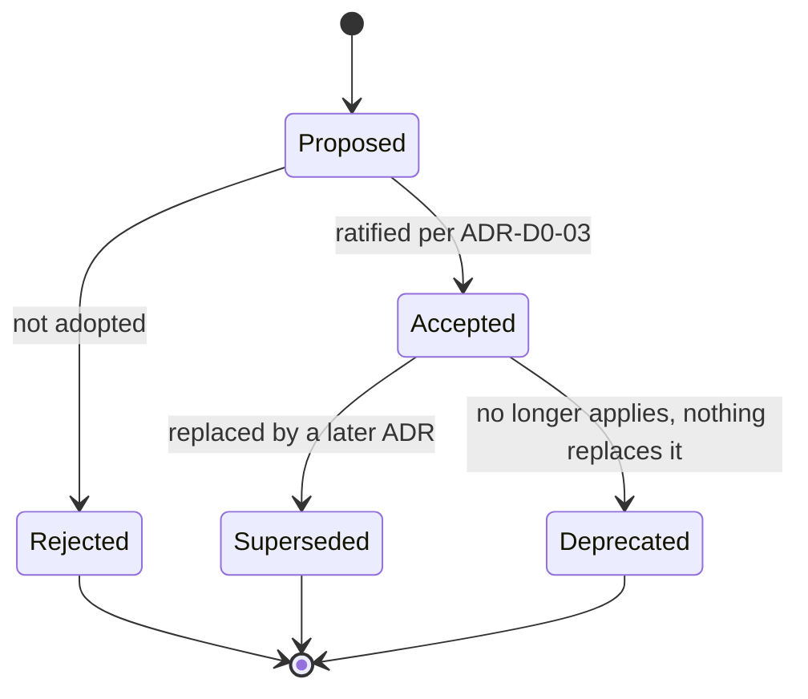

# ADR-D0-02 — ADR identification, status lifecycle, supersession and amendment policy

## 1. Summary

ADRs are identified as `ADR-D<domain>-<sequence>`, domain-prefixed rather than globally
sequential. Records move through a five-state lifecycle (Proposed → Accepted → Superseded
/ Deprecated / Rejected), are never edited in substance once Accepted, and are replaced by
a superseding record rather than rewritten — the same immutability rule 20.PFF-FA-AI-GOVERNANCE.md §73 applies
to every other versioned platform artefact.

## 2. Context and Problem Statement

ADR-D0-01 established the library. It did not fix how records are named, how their status
changes, or what happens when a decision is revised. Left unfixed, three specific failures
follow.

**Identity collisions.** With 136 records authored across eight domains, a globally
sequential scheme forces a central allocator. Two branches drafting decisions concurrently
either collide on a number or wait on each other.

**Silent rewriting.** The most damaging failure mode for a decision library is editing an
Accepted record to say something new. The record then describes the present but the commit
history is the only trace that it ever said otherwise, and any downstream document citing
it is silently wrong. 20.PFF-FA-AI-GOVERNANCE.md §73 states the general principle for platform artefacts:
versions are immutable and changes are released, not mutated. 2. PFF-FA-AI-ARCHITECTURE-DETAILED.md §43 applies it to
prompts, models, configuration and agent definitions. Decision records are the same class
of artefact and need the same rule made explicit.

**Ambiguous status.** Without a defined lifecycle, "we decided that" and "we are minded to"
look identical on the page. `CLAUDE.md` requires several stack choices to be resolved via
ADR and not silently picked — which only works if a reader can tell a resolved record from
an unresolved one at a glance.

There is also a scope question. Not every choice is an ADR. Without a significance test the
library either fills with trivia or omits real decisions because nobody was sure they
qualified.

## 3. Decision Drivers

### 3.1 Functional drivers

| ID | Driver | Source |
|---|---|---|
| DR-F-01 | IDs must be allocatable without central coordination, so concurrent authoring does not collide | Programme practice |
| DR-F-02 | A reader must be able to tell settled from unsettled decisions without opening the file | `CLAUDE.md` §Confirmed Tech Stack |
| DR-F-03 | Decision history must survive revision — what was decided, when, and what replaced it | 20.PFF-FA-AI-GOVERNANCE.md §73, §114; 3. PFF-FA-AI-RESPONSIBILITY-MATRIX.md §73 |
| DR-F-04 | A significance test must exist so the library's scope is decidable rather than argued | ADR-D0-01 DR-A-03 |
| DR-F-05 | Change classification must align with the platform's existing change-management model | 20.PFF-FA-AI-GOVERNANCE.md §76, §77 |

### 3.2 Non-functional drivers

| ID | Driver | Target | Source |
|---|---|---|---|
| DR-N-01 | Cross-reference legibility — an ID should convey its domain without a lookup | Domain identifiable from the ID alone | Programme convention |
| DR-N-02 | Scale — the scheme must hold to several hundred records | No renumbering required to add a decision | ADR-D0-01 §2 |
| DR-N-03 | Link stability — a cited ADR path must not move | 0 renames after Accepted | 20.PFF-FA-AI-GOVERNANCE.md §114 |

### 3.3 Constraints

| ID | Constraint | Type | Source |
|---|---|---|---|
| DR-C-01 | Records live in Git, so history is available but is not itself the decision record | Platform | ADR-D0-01 §8.1 |
| DR-C-02 | The eight architecture domains are fixed by the workshop pack (WS-01 … WS-37) | Organisational | Workshop pack |
| DR-C-03 | The four `docs/adr/` records use global sequential numbering and must not be renamed | Organisational | ADR-D0-01 §8.4 |

### 3.4 Assumptions

| ID | Assumption | If false | Validation |
|---|---|---|---|
| DR-A-01 | The eight domains are stable for the life of the programme | A new domain is added as `D9`; existing IDs are unaffected, which is the point of the scheme | Reviewed at each governance review |
| DR-A-02 | Decisions rarely need amendment rather than replacement | The editorial-amendment carve-out in §7 is used more than expected and needs tightening | QM-02 below |

## 4. Evaluation Criteria and Weights

| ID | Criterion | Weight | Rationale | Measurement |
|---|---|---|---|---|
| EC-01 | History integrity — can a superseded decision still be read as it stood? | 30 | The single failure this policy exists to prevent; 20.PFF-FA-AI-GOVERNANCE.md §73 makes immutability a platform-wide rule | Is the prior text recoverable without reading Git diffs? |
| EC-02 | Concurrent authorability without collision | 20 | 136 records across eight domains authored in parallel | Can two authors allocate IDs independently? |
| EC-03 | Cross-reference legibility | 20 | Every ADR cites others; opaque IDs make review slower | Is the domain readable from the ID? |
| EC-04 | Scale to several hundred records | 15 | The library grows for the platform's life | Does adding a record force renumbering? |
| EC-05 | Familiarity and tooling support | 15 | Sequential ADR numbering is the industry default; deviating has a cost | Does it match common practice and existing repo convention? |
| | **Total** | **100** | | |

Scoring scale: **1** unacceptable · **2** poor · **3** adequate · **4** good · **5** excellent.

## 5. Alternatives Considered

Two dimensions are decided here — identification and lifecycle — evaluated together
because the options interact.

### 5.1 Option A — Global sequential numbering, mutable records

**Description.** `ADR-0001` … `ADR-0136`, continuing from `docs/adr/`. Records are edited
in place as decisions change; Git history is the audit trail.

**Strengths.**
- Continuous with the four existing records; one scheme across the repository.
- The industry default, with the widest tooling support.
- Simplest possible mental model.

**Weaknesses.**
- Central number allocation; concurrent branches collide.
- Domain invisible in cross-references — `ADR-0087` conveys nothing.
- Mutable records fail DR-F-03 outright. A reader of a citation to `ADR-0087` has no way
  to know the text has changed since the citation was written.
- Relies on Git history as the decision record, which requires tooling and archaeology
  to read; an auditor asking "what was decided in March" gets a diff, not a document.

**Cost / effort.** Lowest.

### 5.2 Option B — Global sequential numbering, immutable with supersession

**Description.** As A, but Accepted records are frozen; changes are made by a new record
that declares `supersedes`.

**Strengths.**
- History integrity solved; both records readable as they stood.
- Continuous with `docs/adr/`.
- Familiar; matches Nygard's original supersession convention.

**Weaknesses.**
- Still requires central number allocation (EC-02).
- Domain still invisible (EC-03).
- Supersession chains scatter across a flat directory of 140 files.

**Cost / effort.** Low.

### 5.3 Option C — Domain-prefixed numbering, immutable with supersession

**Description.** `ADR-D<domain>-<sequence>`, sequence local to the domain. Directory per
domain. Accepted records frozen; changes by superseding record.

**Strengths.**
- Each domain allocates independently — no collisions, no central allocator (EC-02).
- The domain is legible in every citation: `ADR-D6-08` is self-evidently a security
  decision (EC-03).
- New decisions append within a domain; no renumbering ever (EC-04).
- History integrity as Option B (EC-01).
- Maps directly onto the eight-domain workshop pack, so WS traceability is structural.

**Weaknesses.**
- Diverges from `docs/adr/`'s sequential scheme, so the repository carries two conventions
  during the overlap.
- Slightly less familiar than plain sequential numbering.
- Domain assignment for a cross-cutting decision needs a tie-break rule.

**Cost / effort.** Low; one-off convention definition.

### 5.4 Option D — Content-addressed or date-based identifiers

**Description.** `ADR-2026-08-21-adopt-langgraph`, or a hash-derived ID.

**Strengths.**
- No allocation problem at all; identity is derived, never assigned.
- Chronology visible in the ID.

**Weaknesses.**
- Long and awkward to cite in prose and commit messages.
- Date conveys nothing about subject or domain (EC-03).
- Two decisions on one day need a disambiguator, reintroducing allocation.
- Unfamiliar; no tooling expects it.

**Cost / effort.** Low, but high friction in daily use.

## 6. Evaluation Method and Decision Matrix

**Method.** Weighted scoring against §4. EC-01 is assessed against the immutability
requirement in 20.PFF-FA-AI-GOVERNANCE.md §73 and §114. EC-02 to EC-04 are assessed against the library's known
end state of 136 records across eight domains.

| Criterion | Weight | A: Seq + mutable | B: Seq + immutable | C: Domain + immutable | D: Date-based |
|---|---|---|---|---|---|
| EC-01 History integrity | 30 | 1 | 5 | 5 | 4 |
| EC-02 Concurrent authorability | 20 | 2 | 2 | 5 | 5 |
| EC-03 Cross-reference legibility | 20 | 2 | 2 | 5 | 2 |
| EC-04 Scale | 15 | 3 | 3 | 5 | 4 |
| EC-05 Familiarity and tooling | 15 | 5 | 5 | 3 | 1 |
| **Weighted total** | **100** | **220** | **340** | **470** | **340** |

- **Option C:** (30×5) + (20×5) + (20×5) + (15×5) + (15×3) = 150 + 100 + 100 + 75 + 45 = **470**
- **Option B:** (30×5) + (20×2) + (20×2) + (15×3) + (15×5) = 150 + 40 + 40 + 45 + 75 = **340**

**Sensitivity.** C leads B by 130 points, and the gap is structural rather than marginal:
C wins EC-02, EC-03 and EC-04 by three points each, and loses EC-05 by two. EC-05's weight
would have to exceed 60 — four times its assigned value, and more than EC-01, the criterion
the policy exists for — before B overtakes C. The result is not sensitive to plausible
reweighting. Option A is eliminated on EC-01 regardless of weights: mutable records fail
the requirement this ADR exists to satisfy.

## 7. Decision

### 7.1 Identification

```
ADR-D<domain>-<sequence>
```

`<domain>` is 0–8 per ADR-D0-01 §8.1; `<sequence>` is two digits, allocated within the
domain, never reused. Filenames add a kebab-case slug naming the decision:

```
docs/architecture/adr/03-ai-architecture/ADR-D3-14-slm-provider-abstraction.md
```

A decision spanning domains is filed under the domain that **owns the consequence**, not
the one that raises the question. Example: retrieval-time ACL enforcement is a security
consequence and is filed as `ADR-D6-12`, though it originates in the RAG discussion. Where
ownership is genuinely ambiguous, the AI Solution Architect assigns it and the other
domain's ADRs cite it in `related_adrs`.

### 7.2 Status lifecycle



| Status | Meaning | Who may set it |
|---|---|---|
| `Proposed` | Analysis complete, recommendation stated, **not** ratified. Nothing downstream may rely on it. | Author |
| `Accepted` | Ratified and binding. Implementation must conform. | The `approver` per ADR-D0-03 |
| `Superseded` | Replaced by a named later ADR. Retained verbatim. | The superseding ADR's approver |
| `Deprecated` | No longer applies; nothing replaced it (the need disappeared). Retained verbatim. | Original approver or ADR-D0-03 escalation |
| `Rejected` | Analysed and not adopted. Retained — a recorded rejection prevents re-litigation. | The `approver` |

A `Proposed` record is not a weaker `Accepted`. It is a live question, and it appears in
`_register/open-decisions.md` until resolved, per ADR-D0-04.

### 7.3 Immutability, supersession and amendment

**An Accepted ADR is never edited in substance.** This mirrors 20.PFF-FA-AI-GOVERNANCE.md §73 and 2. PFF-FA-AI-ARCHITECTURE-DETAILED.md §43,
which forbid mutating a released version of any platform artefact.

Changes are classified as follows, aligning with 20.PFF-FA-AI-GOVERNANCE.md §77:

| Change class | Example | Mechanism | Version |
|---|---|---|---|
| **Editorial** | Typo, broken link, formatting, clarifying a sentence without changing meaning | Edit in place; add a §20 change-log row | Patch, `1.0.0` → `1.0.1` |
| **Additive** | New risk in §11, new revisit trigger, new measure in §12, updated `related_adrs` | Edit in place; add a §20 change-log row | Minor, `1.0.1` → `1.1.0` |
| **Substantive** | Anything altering §7 Decision, §4 criteria, §5 alternatives or §6 matrix | **New ADR.** Old record set to `Superseded` with `superseded_by` populated; new record declares `supersedes` | New ID at `1.0.0` |

The dividing line is deliberately bright: if the change would make a reader of the old
version wrong about what was decided, it is substantive and needs a new record. An author
uncertain which side a change falls on treats it as substantive — the cost of an extra ADR
is a page; the cost of a silently rewritten decision is an unauditable library.

Setting `status` and populating `superseded_by` on the old record is the sole exception to
immutability, and is itself an additive change.

### 7.4 Significance test — what warrants an ADR

A choice is recorded as an ADR when **any** of the following holds:

1. It touches one of the 2. PFF-FA-AI-ARCHITECTURE-DETAILED.md §52 categories — system boundaries, data ownership, agent
   architecture, LangGraph architecture, ERC, SLM, security, tool/MCP, eventing, state, AI
   evaluation, deployment boundaries.
2. It is costly to reverse — a schema, a persisted data shape, a public contract, a vendor
   commitment, or anything requiring migration.
3. It is cross-cutting — binding on code outside the module that made it.
4. It resolves something the specifications leave open, or departs from what they say.
5. It has a compliance, privacy, safeguarding or security consequence.
6. A competent engineer would reasonably ask "why is it done this way?" and the answer is
   not obvious from the code.

A choice meeting **none** of these is not an ADR. Local implementation choices, naming
within a module, and anything already fixed by `CLAUDE.md` §Coding Conventions belong in
code or in `CLAUDE.md`, not here.

**Status rationale.** Accepted. Concerns how decisions are recorded, not any 2. PFF-FA-AI-ARCHITECTURE-DETAILED.md §52
architecture category, so it sits with the AI Solution Architect under ADR-D0-03.

## 8. Architecture Detail

### 8.1 Front-matter fields governing lifecycle

| Field | Rule |
|---|---|
| `id` | Immutable once assigned, including after supersession |
| `status` | One of the five values in §7.2 |
| `version` | Semantic, per §7.3. A superseding record starts again at `1.0.0` |
| `supersedes` | Repository-relative paths, including `docs/adr/` legacy records |
| `superseded_by` | Populated on the old record when superseded; otherwise `[]` |
| `review_due` | Date; drives QM-02 in ADR-D0-01 |
| `approver` | The ratifying role per ADR-D0-03 |

### 8.2 Supersession chain

A superseded record stays in place, keeps its filename, and gains a banner directly beneath
its title:

```markdown
> **Superseded by [ADR-D5-21](ADR-D5-21-....md) on 2027-03-14.**
> Retained unmodified as the record of what was decided on 2026-08-21 and why.
```

The banner is the only content added. §7 is not edited to reflect the new decision — that
is the whole point.

### 8.3 Relationship to the legacy `docs/adr/` scheme

`docs/adr/0001-0004` keep their sequential IDs and are not renamed (DR-C-03). Records here
that supersede them cite them by full repository-relative path, so the two schemes coexist
without collision: no ID in one scheme can be mistaken for an ID in the other.

## 9. Consequences

### 9.1 Positive

- A citation to `ADR-D6-08` remains accurate indefinitely; the text it points to cannot
  change underneath the citation.
- Domains allocate IDs independently, so parallel authoring never blocks.
- Supersession chains make architectural evolution readable as a sequence of decisions.
- The significance test makes library scope decidable rather than a matter of taste.
- `Rejected` records prevent the same rejected option being reproposed each year.

### 9.2 Negative

- Supersession produces more files than in-place editing; the library grows monotonically.
- Two ID schemes coexist in the repository during the overlap with `docs/adr/`.
- The editorial/additive/substantive boundary requires judgement and will occasionally be
  called wrongly.
- Domain assignment for cross-cutting decisions needs a human tie-break.

### 9.3 Neutral

- Two-digit sequences allow 99 per domain. Domain 3 currently holds 25. If a domain
  approaches the limit, the sequence widens to three digits for new records only; existing
  IDs are unaffected.
- Git history remains available and useful, but is no longer *relied upon* as the decision
  record.

### 9.4 Trade-offs explicitly accepted

| Given up | In exchange for | Accepted by |
|---|---|---|
| A single repository-wide numbering scheme | Collision-free parallel authoring and legible cross-references | AI Solution Architect |
| Compact history (in-place edits) | Every decision readable as it stood when made | AI Solution Architect |
| Familiarity of plain sequential ADR numbering | Domain legibility and independent allocation | AI Engineering Lead |

## 10. Golden-Rule and Precedence Conformance

| Constraint | Conformance |
|---|---|
| Enterprise decides; AI orchestrates | Not applicable — governs document identity, not runtime behaviour. |
| Authoritative-truth precedence | Not applicable — no runtime data path. |
| Four-state separation | Not applicable — no runtime state. |
| Versioned artefacts, never mutated in place in production | This ADR *is* that rule applied to decision records. §7.3 mirrors 20.PFF-FA-AI-GOVERNANCE.md §73 and 2. PFF-FA-AI-ARCHITECTURE-DETAILED.md §43 exactly: immutable versions, changes released as new versions, prior versions retained. |
| Adam persona governs how, never what | Not applicable. |

## 11. Risks and Mitigations

| ID | Risk | Likelihood | Impact | Exposure | Mitigation | Owner | Residual |
|---|---|---|---|---|---|---|---|
| RSK-01 | An author edits an Accepted record substantively instead of superseding it | Medium | High | High | Bright-line rule in §7.3 with a stated default toward supersession; pull-request review checks for §7 edits on Accepted records | AI Solution Architect | Medium |
| RSK-02 | Supersession chains grow long enough to obscure the current decision | Low | Medium | Low | `_register/decision-register.md` lists only current status; superseded records carry the §8.2 banner | AI Engineering Lead | Low |
| RSK-03 | Cross-cutting decisions filed inconsistently across domains | Medium | Low | Low | §7.1 ownership rule plus architect tie-break; `related_adrs` cross-links from the other domain | AI Solution Architect | Low |
| RSK-04 | Significance test applied too loosely, filling the library with trivia | Medium | Medium | Medium | Six-part test in §7.4 with an explicit exclusion for `CLAUDE.md` conventions; QM-03 tracks volume | AI Solution Architect | Low |
| RSK-05 | Two ID schemes confuse a reader arriving at `docs/adr/` first | Low | Low | Low | `README.md` §Relationship to `docs/adr/`; every superseding record names its legacy path | AI Engineering Lead | Low |

## 12. Quantitative Targets and Measures

| ID | Measure | Target | Threshold (alert) | Source | Review cadence |
|---|---|---|---|---|---|
| QM-01 | Accepted ADRs whose §7 changed without supersession | 0 | ≥1 | `git log -p` over Accepted records at governance review | Quarterly |
| QM-02 | Ratio of editorial/additive amendments to substantive supersessions | ≤3:1 | >6:1 | Change-log rows across the library | Quarterly |
| QM-03 | ADRs recorded that meet none of the §7.4 significance criteria | 0 | ≥3 | Governance review sampling | Quarterly |
| QM-04 | ID collisions or renames after Accepted | 0 | ≥1 | `git log --diff-filter=R -- docs/architecture/adr/` | Quarterly |
| QM-05 | Superseded records lacking the §8.2 banner or `superseded_by` | 0 | ≥1 | Front-matter lint | Quarterly |

## 13. Security, Privacy and Compliance Impact

| Dimension | Impact |
|---|---|
| Attack surface change | None. |
| Data classification touched | Internal. |
| Personal data / PII | None. Author identity is recorded by role, not by name, so the library holds no personal data. |
| Children's data and safeguarding | Not applicable. |
| UK GDPR lawful basis and rights impact | None — recording roles rather than named individuals avoids creating a personal-data record. |
| Audit and evidential requirements | Substantial and positive. Immutability is what makes the library admissible as evidence: an auditor can be shown what was decided on a date, not a reconstruction. Supports 20.PFF-FA-AI-GOVERNANCE.md §30 (Auditability) and §99 (Compliance Evidence). |
| Standards touched | ISO 9001 §7.5.3 (control of documented information — identification, version control, preservation); ISO/IEC 27001 A.5.37; ISO/IEC 42001 (AI management system documentation); CMMI-DEV CM (Configuration Management). |

## 14. Implementation Impact

| Aspect | Detail |
|---|---|
| Build phases | 0, 21 |
| Repository paths | `docs/architecture/adr/` naming and directory conventions |
| Configuration | None |
| Contracts / schemas | Front-matter field rules in §8.1, enforced against `TEMPLATE.md` |
| Migration | None. `docs/adr/0001-0004` keep their scheme and are not renamed. |
| Dependencies on other ADRs | ADR-D0-01 (library exists), ADR-D0-03 (who ratifies, hence who may set `Accepted`) |
| Effort estimate | Small — convention only, no tooling required |

## 15. Validation and Verification

| ID | Acceptance criterion | Verification method |
|---|---|---|
| AC-01 | Every ADR filename matches `ADR-D[0-8]-[0-9]{2}-<slug>.md` and sits in its domain directory | `find docs/architecture/adr -name 'ADR-*.md'` against the pattern |
| AC-02 | Every `id` appears exactly once across the library | Sort-and-count over front-matter `id` fields |
| AC-03 | Every `status` is one of the five values in §7.2 | Front-matter lint |
| AC-04 | Every record with `status: Superseded` has a non-empty `superseded_by` and the §8.2 banner | Front-matter lint plus grep for the banner |
| AC-05 | Every `supersedes` and `superseded_by` path resolves to a real file | Path-resolution grep |
| AC-06 | No Accepted record's §7 has been modified since acceptance | `git log -p` review at governance review; QM-01 |
| AC-07 | No file under `docs/architecture/adr/` has been renamed after acceptance | `git log --diff-filter=R` |

## 16. Operational Impact

| Aspect | Detail |
|---|---|
| Monitoring | Not runtime. QM-01 to QM-05 checked at quarterly governance review. |
| Alerting | None. |
| Runbook | Authoring and supersession procedure is §7.3 and §8.2 of this record. |
| Failure mode and degradation | The failure is a silently rewritten decision, which degrades the library's evidential value without any visible symptom. QM-01 is the detection mechanism and is deliberately a history review, not a file check. |
| Rollback | Reversible by a superseding ADR selecting a different scheme. Existing IDs would be retained; only new records would use the replacement. |
| Support model impact | None. |

## 17. Cost Impact

| Cost element | One-off | Recurring | Basis |
|---|---|---|---|
| Convention definition | ~0.25 architect-day | — | This record |
| Supersession overhead | — | ~0.5 architect-day per substantive change | Same as authoring a new ADR, by design |
| Governance review checks | — | ~0.5 hour per quarter | QM-01 to QM-05 as one agenda item |
| Tooling | None | None | Convention only; front-matter lint is a grep, not a service |

## 18. Revisit Triggers and Causal Analysis Hooks

| ID | Trigger | Detected by | Action on trigger |
|---|---|---|---|
| RT-01 | A domain's sequence approaches 99 | Register review | Widen to three digits for new records only; existing IDs unchanged |
| RT-02 | A ninth architecture domain is introduced | Workshop pack change | Add `D9`; no existing ID is affected — verifying DR-A-01 |
| RT-03 | QM-01 records any substantive edit without supersession | Governance review | Causal analysis: was the rule unclear, or the cost of supersession too high? |
| RT-04 | QM-02 exceeds 6:1 | Change-log review | Amendments are absorbing substantive changes; tighten the §7.3 boundary |
| RT-05 | External ADF/ADR forum mandates a different identification scheme | Forum minutes | Supersede this ADR; retain existing IDs, apply the new scheme to new records |

**Scheduled review:** 2027-02-21.

## 19. Traceability

| Dimension | Reference |
|---|---|
| Workshop sheet | WS-36 Risks, Assumptions & Decision Register |
| Specification sections | 20.PFF-FA-AI-GOVERNANCE.md §73 (Version Governance), §74 (Version Compatibility), §76 (Change Management), §77 (Change Classification), §114 (Governance Documentation Version); 3. PFF-FA-AI-RESPONSIBILITY-MATRIX.md §73 (Change Control); 2. PFF-FA-AI-ARCHITECTURE-DETAILED.md §43 (Versioning Architecture), §52 (Architecture Governance) |
| Requirement IDs | Per ADR-D1-12 |
| Build phases | 0, 21 |
| Code paths | None |
| Configuration | None |
| Tests | AC-01 to AC-07 |
| Upstream ADRs | ADR-D0-01 |
| Downstream ADRs | ADR-D0-03, ADR-D0-04, ADR-D8-07; binding on every record in the library |

## 20. Change Log

| Version | Date | Author | Change |
|---|---|---|---|
| 1.0.0 | 2026-08-21 | AI Solution Architect | Initial decision recorded. Domain-prefixed IDs, five-state lifecycle, immutability with supersession, six-part significance test. |
