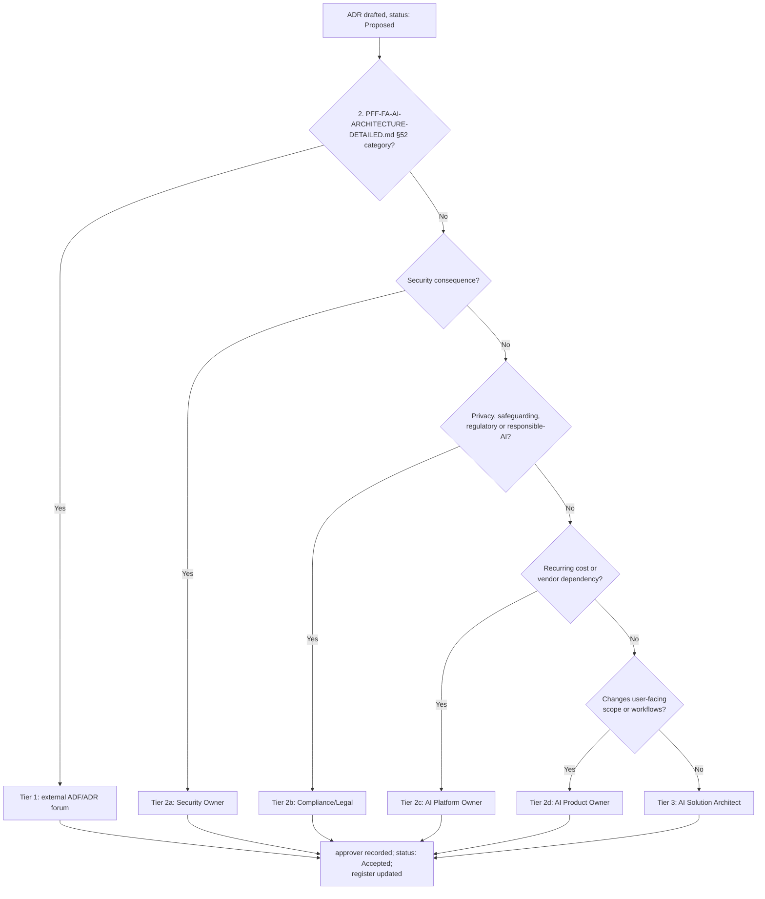

# ADR-D0-03 — Decision authority model and architecture review cadence

## 1. Summary

Ratification authority for an ADR is determined by what the decision touches, not by who
wrote it. Decisions in the 2. PFF-FA-AI-ARCHITECTURE-DETAILED.md §52 categories are ratified by the external ADF/ADR forum;
security, privacy and responsible-AI decisions require the Security Owner or Compliance
role as co-approver; everything else is ratified by the AI Solution Architect. Architecture
review runs monthly, with an out-of-band path for decisions blocking a build phase.

## 2. Context and Problem Statement

ADR-D0-02 defines a `Proposed → Accepted` transition and names the `approver` field as the
gate. It does not say who fills that field, and an unratified decision library is a
suggestion box.

The specifications provide most of the answer but leave it distributed. 20.PFF-FA-AI-GOVERNANCE.md §8 lists
fourteen governance roles. 20.PFF-FA-AI-GOVERNANCE.md §10 gives a RACI across eleven governance activities, of
which "Architecture" is one row: Business consulted, AI Platform accountable and
responsible, Security consulted, Data consulted, Governance consulted. 3. PFF-FA-AI-RESPONSIBILITY-MATRIX.md §61 gives a
different RACI across twenty-five delivery capabilities. 3. PFF-FA-AI-RESPONSIBILITY-MATRIX.md §46 gives a decision
authority matrix, but for *runtime* decisions — who decides whether a club is eligible —
not for architecture decisions. 2. PFF-FA-AI-ARCHITECTURE-DETAILED.md §52 names twelve categories requiring external
architecture governance review without saying what "review" concludes with.

Three specific gaps follow:

- **No mapping from decision content to approver.** 20.PFF-FA-AI-GOVERNANCE.md §10 makes AI Platform
  accountable for "Architecture" as a single undifferentiated row, which cannot be right
  for a decision that changes the external SLM data boundary — 20.PFF-FA-AI-GOVERNANCE.md §10's own Security
  row makes Security accountable there.
- **No cadence.** 20.PFF-FA-AI-GOVERNANCE.md §90 requires periodic AI governance review but does not set a
  frequency for architecture decisions, and `DEVELOPMENT-GUIDE.md` §4 sequences 24 build
  phases that will each surface decisions. A quarterly forum would stall the build.
- **No path for a decision that blocks work now.** 20.PFF-FA-AI-GOVERNANCE.md §79 provides for emergency
  changes; nothing equivalent exists for a decision needed before the next scheduled review.

20.PFF-FA-AI-GOVERNANCE.md §9 states the governing constraint plainly: no production AI component should be
ownerless. The same must hold for decisions.

## 3. Decision Drivers

### 3.1 Functional drivers

| ID | Driver | Source |
|---|---|---|
| DR-F-01 | Every ADR must have a determinable approver, derivable from its content | 20.PFF-FA-AI-GOVERNANCE.md §9 (Accountability Principle) |
| DR-F-02 | 2. PFF-FA-AI-ARCHITECTURE-DETAILED.md §52 categories must route to the external architecture governance process | 2. PFF-FA-AI-ARCHITECTURE-DETAILED.md §52 |
| DR-F-03 | Security, privacy and responsible-AI decisions must not be ratified by delivery alone | 20.PFF-FA-AI-GOVERNANCE.md §10 (Security row: Security accountable) |
| DR-F-04 | A decision blocking a build phase must be resolvable without waiting for the next scheduled review | `DEVELOPMENT-GUIDE.md` §4; 20.PFF-FA-AI-GOVERNANCE.md §79 |
| DR-F-05 | Ratification must leave evidence | 20.PFF-FA-AI-GOVERNANCE.md §81 (Approval Evidence) |

### 3.2 Non-functional drivers

| ID | Driver | Target | Source |
|---|---|---|---|
| DR-N-01 | Decision latency must not gate delivery | ≤10 working days from `Proposed` to ratified, routine path | `DEVELOPMENT-GUIDE.md` §4 phase cadence |
| DR-N-02 | Review load stays sustainable for a small architecture function | ≤2 hours per month standing commitment | Programme staffing |
| DR-N-03 | Routing must be unambiguous — an author can tell where their ADR goes | 0 misrouted ADRs per quarter | Programme practice |

### 3.3 Constraints

| ID | Constraint | Type | Source |
|---|---|---|---|
| DR-C-01 | An external ADF/ADR forum exists and holds authority over the 2. PFF-FA-AI-ARCHITECTURE-DETAILED.md §52 categories | Organisational | 2. PFF-FA-AI-ARCHITECTURE-DETAILED.md §52; ADR-D0-01 §7 |
| DR-C-02 | 20.PFF-FA-AI-GOVERNANCE.md §8's fourteen governance roles are the available role vocabulary | Organisational | 20.PFF-FA-AI-GOVERNANCE.md §8 |
| DR-C-03 | 20.PFF-FA-AI-GOVERNANCE.md §10 makes Security accountable for security and Governance accountable for compliance | Organisational | 20.PFF-FA-AI-GOVERNANCE.md §10 |
| DR-C-04 | Production release approval is Business-accountable, AI Platform-responsible | Organisational | 20.PFF-FA-AI-GOVERNANCE.md §10; 3. PFF-FA-AI-RESPONSIBILITY-MATRIX.md §70 |

### 3.4 Assumptions

| ID | Assumption | If false | Validation |
|---|---|---|---|
| DR-A-01 | The external forum meets at least monthly, or will accept asynchronous ratification | 2. PFF-FA-AI-ARCHITECTURE-DETAILED.md §52 decisions become the delivery bottleneck; §7.4's out-of-band path is used routinely rather than exceptionally | Confirm at first forum engagement; QM-02 |
| DR-A-02 | One named individual can hold the AI Solution Architect role for the programme's duration | Ratification stalls on absence; the deputising rule in §7.5 applies | Reviewed at each governance review |
| DR-A-03 | Most ADRs fall outside the 2. PFF-FA-AI-ARCHITECTURE-DETAILED.md §52 categories | The external forum is overloaded and the model needs rebalancing | QM-01 |

## 4. Evaluation Criteria and Weights

| ID | Criterion | Weight | Rationale | Measurement |
|---|---|---|---|---|
| EC-01 | Correct authority for the decision's risk | 30 | A security decision ratified by delivery alone is a governance failure, not a process inefficiency; 20.PFF-FA-AI-GOVERNANCE.md §10 makes this explicit | Does the model route each decision class to the role 20.PFF-FA-AI-GOVERNANCE.md §10 makes accountable? |
| EC-02 | Decision latency | 25 | 24 sequenced build phases; a model that stalls delivery will be bypassed, which is worse than a weaker model that is followed | Working days from `Proposed` to ratified |
| EC-03 | Unambiguous routing | 20 | Ambiguity produces both misrouting and forum-shopping | Can an author determine the approver from the ADR's content alone? |
| EC-04 | Review load sustainability | 15 | The architecture function is small; unsustainable load produces rubber-stamping | Standing hours per month |
| EC-05 | Evidence quality | 10 | 20.PFF-FA-AI-GOVERNANCE.md §81 requires approval evidence | Is ratification recorded durably and attributably? |
| | **Total** | **100** | | |

Scoring scale: **1** unacceptable · **2** poor · **3** adequate · **4** good · **5** excellent.

EC-01 at 30 is the highest weight in this record and is justified by DR-C-03: 20.PFF-FA-AI-GOVERNANCE.md §10
assigns accountability for security to Security and for compliance to Governance. A model
that gets this wrong is not suboptimal, it is non-conformant.

## 5. Alternatives Considered

### 5.1 Option A — Single approver: the AI Solution Architect ratifies everything

**Description.** One role signs every ADR. Other roles are consulted informally.

**Strengths.**
- Lowest possible latency; no scheduling dependency.
- Completely unambiguous routing.
- Minimal review load.

**Weaknesses.**
- Violates DR-C-03 directly: 20.PFF-FA-AI-GOVERNANCE.md §10 makes Security accountable for security decisions
  and Governance accountable for compliance. A single delivery-side approver cannot
  discharge either.
- Ignores 2. PFF-FA-AI-ARCHITECTURE-DETAILED.md §52's external review requirement entirely.
- Concentrates authority in one person with no structural check — the failure mode 20.PFF-FA-AI-GOVERNANCE.md
  §9's accountability principle exists to prevent.

**Cost / effort.** Nil.

### 5.2 Option B — Full board: every ADR ratified by a standing architecture review board

**Description.** A board comprising the roles in 20.PFF-FA-AI-GOVERNANCE.md §8 meets on a fixed cadence and
ratifies every ADR.

**Strengths.**
- Highest assurance; every decision seen by every relevant role.
- Uniform, unambiguous routing.
- Strong, consistent evidence trail.

**Weaknesses.**
- Latency is bounded below by the cadence. At 136 decisions, a monthly board handling ten
  per session takes over a year — `DEVELOPMENT-GUIDE.md` §4's phases would stall.
- Review load is unsustainable: 20.PFF-FA-AI-GOVERNANCE.md §8's fourteen roles, monthly, on decisions most of
  them have no stake in.
- Predictable outcome is rubber-stamping, which produces evidence of review without review.

**Cost / effort.** High and recurring.

### 5.3 Option C — Content-routed authority with a monthly review and an out-of-band path

**Description.** The approver is derived from what the decision touches. Three tiers:
external forum for 2. PFF-FA-AI-ARCHITECTURE-DETAILED.md §52 categories; co-approval by Security or Compliance for
decisions in their accountability; AI Solution Architect otherwise. A monthly review
handles the queue; a defined out-of-band path handles decisions blocking a phase.

**Strengths.**
- Routes each decision to the role 20.PFF-FA-AI-GOVERNANCE.md §10 makes accountable (EC-01).
- Most decisions take the fast path, so latency stays low where risk is low (EC-02).
- Routing derives from ADR content, which is already written down (EC-03).
- Review load proportionate to risk (EC-04).
- Ratification recorded in the `approver` field and the register (EC-05).

**Weaknesses.**
- Three tiers are more to explain than one rule.
- Tier boundaries need a tie-break for decisions that sit near them.
- Depends on the external forum's availability (DR-A-01).

**Cost / effort.** Moderate one-off; low recurring.

### 5.4 Option D — Consensus of the delivery team

**Description.** ADRs ratified by team agreement, no named approver.

**Strengths.**
- High buy-in; decisions are understood by those implementing them.
- No scheduling dependency.

**Weaknesses.**
- Fails 20.PFF-FA-AI-GOVERNANCE.md §9 outright — a consensus is not an owner, and "the team decided" names
  nobody accountable.
- No evidence of who approved what (EC-05 fails).
- Under-weights Security and Compliance, who are not on the delivery team.
- Consensus on architecture tends to resolve toward the least contentious option rather
  than the best one.

**Cost / effort.** Low, but produces no usable evidence.

## 6. Evaluation Method and Decision Matrix

**Method.** Weighted scoring against §4. EC-01 is assessed against 20.PFF-FA-AI-GOVERNANCE.md §10's
accountability assignments and 2. PFF-FA-AI-ARCHITECTURE-DETAILED.md §52's category list. EC-02 is estimated from the
library's known size (136 decisions) against `DEVELOPMENT-GUIDE.md` §4's 24 phases.

| Criterion | Weight | A: Single approver | B: Full board | C: Content-routed | D: Consensus |
|---|---|---|---|---|---|
| EC-01 Correct authority for risk | 30 | 1 | 5 | 5 | 1 |
| EC-02 Decision latency | 25 | 5 | 1 | 4 | 5 |
| EC-03 Unambiguous routing | 20 | 5 | 5 | 4 | 2 |
| EC-04 Review load sustainability | 15 | 5 | 1 | 4 | 4 |
| EC-05 Evidence quality | 10 | 3 | 5 | 4 | 1 |
| **Weighted total** | **100** | **310** | **330** | **436** | **265** |

- **Option C:** (30×5) + (25×4) + (20×4) + (15×4) + (10×4) = 150 + 100 + 80 + 60 + 40 = **436**
- **Option B:** (30×5) + (25×1) + (20×5) + (15×1) + (10×5) = 150 + 25 + 100 + 15 + 50 = **330**

**Sensitivity.** C leads B by 106 points, carried by EC-02 and EC-04 — precisely the
criteria where a full board's cost falls. For B to overtake C, EC-02 and EC-04's combined
weight would have to fall below about 12 (from 40), which would amount to asserting that
delivery latency does not matter across a 24-phase build. A and D are both eliminated on
EC-01 independent of weighting: neither can discharge the accountability 20.PFF-FA-AI-GOVERNANCE.md §10 assigns
to Security and Governance, and no reweighting repairs a non-conformance.

## 7. Decision

### 7.1 Routing rule

The approver is derived from the ADR's content, evaluated in order — the first matching
tier governs:

| Tier | Condition | Approver | Co-approver |
|---|---|---|---|
| **1** | Touches any 2. PFF-FA-AI-ARCHITECTURE-DETAILED.md §52 category: system boundaries, data ownership, agent architecture, LangGraph architecture, ERC, SLM, security, tool/MCP, eventing, state, AI evaluation, deployment boundaries | External ADF/ADR governance forum | AI Solution Architect records the outcome |
| **2a** | Material security consequence (attack surface, trust boundary, secret handling, data egress) | Security Owner | AI Solution Architect |
| **2b** | Material privacy, safeguarding, regulatory or responsible-AI consequence | Compliance/Legal | AI Solution Architect |
| **2c** | Commits recurring cost above the programme's delegated threshold, or a vendor dependency | AI Platform Owner | AI Solution Architect |
| **2d** | Changes what the platform does for users, or which workflows it supports | AI Product Owner | AI Solution Architect |
| **3** | Everything else | AI Solution Architect | — |

An ADR matching several tiers takes the **lowest-numbered** one and names the other roles
in `contributors`. Where an author cannot determine the tier, it goes to the monthly review
for routing, which is not a failure — an ambiguous decision is usually a significant one.

Tier 1 does not bypass the library. The ADR is drafted here, ratified externally, and the
`approver` field records the forum. This is the hybrid model ADR-D0-01 §7 adopted.

### 7.2 Roles

Drawn from 20.PFF-FA-AI-GOVERNANCE.md §8; no new roles are introduced.

| Role | Architecture-decision responsibility |
|---|---|
| AI Solution Architect | Owns the library. Ratifies tier 3, co-approves tiers 2a–2d, drafts and routes tier 1. |
| AI Platform Owner | Ratifies tier 2c. Accountable for the library's health per 20.PFF-FA-AI-GOVERNANCE.md §10's Architecture row. |
| AI Product Owner | Ratifies tier 2d. |
| Security Owner | Ratifies tier 2a per 20.PFF-FA-AI-GOVERNANCE.md §10's Security row. |
| Compliance/Legal | Ratifies tier 2b per 20.PFF-FA-AI-GOVERNANCE.md §10's Compliance row. |
| Business Owner | Consulted on tier 2d. Accountable for production release per 20.PFF-FA-AI-GOVERNANCE.md §10, which is a separate gate from architecture ratification. |
| AI Engineering Lead | Consulted throughout; responsible for implementation conformance. |
| Data Owner, Model Owner, Prompt Owner, Agent Owner, RAG/Data Owner, Operations/SRE, AI Evaluation Owner | Consulted within their domain. |

### 7.3 Cadence

| Forum | Frequency | Scope | Duration |
|---|---|---|---|
| **Architecture decision review** | Monthly | Ratify queued tier 2 and tier 3 ADRs; route ambiguous ones; review the open-decisions list per ADR-D0-04 | ≤2 hours |
| **Governance review** | Quarterly | Library health (QM-01 to QM-05 of ADR-D0-01 and ADR-D0-02); overdue `review_due`; supersession integrity. Aligns with 20.PFF-FA-AI-GOVERNANCE.md §90. | ≤2 hours |
| **External ADF/ADR forum** | Per its own schedule | Tier 1 ratification | — |

Tier 3 decisions do not wait for the monthly review. The AI Solution Architect ratifies
them as they arrive; the review notes them for visibility. Batching tier 3 would forfeit
Option C's latency advantage, which is the reason it was chosen.

### 7.4 Out-of-band path

Where a `Proposed` decision blocks a build phase and the responsible approver is
unavailable within DR-N-01's ten working days:

1. The AI Solution Architect may ratify provisionally, setting `status: Accepted` and
   recording in §20 that ratification was provisional, with the date and the reason.
2. The decision is tabled at the next scheduled review of the correct tier.
3. If the proper approver dissents, a superseding ADR is raised per ADR-D0-02 §7.3 — the
   provisional record is **not** rewritten.

This path is **not available for tier 2a or 2b.** A security, privacy or safeguarding
decision waits for its accountable role. 20.PFF-FA-AI-GOVERNANCE.md §79's emergency-change provision covers
genuine production emergencies; it is not a route around security review for a decision
that is merely inconvenient to delay.

### 7.5 Deputising and escalation

If an approver role is vacant or unavailable beyond ten working days, authority passes
upward: AI Solution Architect → AI Platform Owner → Business Owner. Security Owner and
Compliance/Legal do **not** deputise to delivery roles; their decisions wait, per §7.4.
Escalation beyond this follows 20.PFF-FA-AI-GOVERNANCE.md §104.

**Status rationale.** Accepted, approved by the AI Platform Owner rather than the AI
Solution Architect — this record defines the architect's own authority, and self-ratifying
that would be circular.

## 8. Architecture Detail

### 8.1 Routing in practice

### 8.2 Approval evidence

20.PFF-FA-AI-GOVERNANCE.md §81 requires approval evidence. Three artefacts constitute it, and no separate
approval system is introduced:

1. The `approver` front-matter field naming the ratifying role.
2. The `date` field and the §20 change-log row.
3. The Git commit that set `status: Accepted`, which is attributable and timestamped.

Where ratification happened in a forum, the §20 row cites the forum and meeting date.

### 8.3 Relationship to runtime decision authority

3. PFF-FA-AI-RESPONSIBILITY-MATRIX.md §46 defines who decides things *at runtime* — whether a club is eligible, whether a
user is authorised. That matrix is not affected by this record and is captured as a
decision in ADR-D1-03. The two are distinct: 3. PFF-FA-AI-RESPONSIBILITY-MATRIX.md §46 governs the platform's behaviour;
this record governs who may change the platform's architecture.

## 9. Consequences

### 9.1 Positive

- Every ADR has a determinable approver, satisfying 20.PFF-FA-AI-GOVERNANCE.md §9 for decisions as well as
  components.
- Security and compliance decisions reach their accountable role by routing, not by an
  author's judgement about whether to consult.
- Most decisions take the fast path, so the model does not gate a 24-phase build.
- 2. PFF-FA-AI-ARCHITECTURE-DETAILED.md §52's external review requirement is honoured through tier 1 rather than ignored.
- Approval evidence falls out of the existing artefacts; no approval tooling is needed.

### 9.2 Negative

- Three tiers are more to explain than a single rule, and tier boundaries will occasionally
  be misjudged.
- Tier 1 latency depends on a forum outside the programme's control (RSK-01).
- The provisional-ratification path in §7.4 can be misused to route around review; its
  exclusion of tiers 2a and 2b is the guard, and it depends on authors respecting it.
- Concentrates significant authority in the AI Solution Architect for tier 3, which is most
  decisions.

### 9.3 Neutral

- Introduces no new roles; uses 20.PFF-FA-AI-GOVERNANCE.md §8's vocabulary unchanged.
- Monthly cadence is a starting point, revisable through RT-03.

### 9.4 Trade-offs explicitly accepted

| Given up | In exchange for | Accepted by |
|---|---|---|
| Uniform review of every decision by every role | Delivery latency proportionate to risk | AI Platform Owner |
| Simplicity of a single approver | Conformance with 20.PFF-FA-AI-GOVERNANCE.md §10's accountability assignments | AI Platform Owner |
| Full control of decision latency | 2. PFF-FA-AI-ARCHITECTURE-DETAILED.md §52 conformance for boundary decisions | AI Solution Architect |

## 10. Golden-Rule and Precedence Conformance

| Constraint | Conformance |
|---|---|
| Enterprise decides; AI orchestrates | Upheld structurally: tier 1 routes every decision touching a system boundary or data ownership to the enterprise's own architecture forum, so the AI programme cannot unilaterally move the boundary it is subordinate to. |
| Authoritative-truth precedence | Not applicable — governs who ratifies decisions, not a runtime data path. Distinct from 3. PFF-FA-AI-RESPONSIBILITY-MATRIX.md §46's runtime authority matrix, as §8.3 notes. |
| Four-state separation | Not applicable. |
| Versioned artefacts, never mutated in place | Upheld: §7.4 requires a dissented provisional ratification to be resolved by a superseding ADR, never by rewriting the provisional record. |
| Adam persona governs how, never what | Not applicable. |

## 11. Risks and Mitigations

| ID | Risk | Likelihood | Impact | Exposure | Mitigation | Owner | Residual |
|---|---|---|---|---|---|---|---|
| RSK-01 | External forum cadence makes tier 1 the delivery bottleneck | Medium | High | High | §7.4 out-of-band path (excluded for 2a/2b); QM-02 tracks tier 1 latency; RT-01 rebalances tier boundaries if breached | AI Solution Architect | Medium |
| RSK-02 | Provisional ratification becomes routine, hollowing out review | Medium | High | High | §7.4 requires the reason recorded in §20 and tabling at the next review; QM-03 caps provisional ratifications at 10% | AI Platform Owner | Medium |
| RSK-03 | Tier 2a/2b decisions misclassified as tier 3 by authors who do not recognise the consequence | Medium | High | High | Template §13 forces every ADR to state its security, privacy and safeguarding impact — an author cannot complete it and still believe there is none; monthly review samples tier 3 records | Security Owner | Medium |
| RSK-04 | AI Solution Architect unavailable, stalling tier 3 | Low | Medium | Low | §7.5 deputising chain | AI Platform Owner | Low |
| RSK-05 | Monthly cadence too slow as phases accelerate | Medium | Medium | Medium | Tier 3 does not wait for the review by design; RT-03 raises cadence if QM-01 breaches | AI Solution Architect | Low |

## 12. Quantitative Targets and Measures

| ID | Measure | Target | Threshold (alert) | Source | Review cadence |
|---|---|---|---|---|---|
| QM-01 | Median working days from `Proposed` to ratified, tiers 2–3 | ≤10 | >15 | Register `date` fields against Git history | Monthly |
| QM-02 | Median working days to ratification, tier 1 | ≤20 | >40 | Register against forum minutes | Quarterly |
| QM-03 | Provisional ratifications as a share of all ratifications | ≤10% | >25% | §20 change-log rows | Quarterly |
| QM-04 | ADRs misrouted (tier corrected at review) | 0 per quarter | ≥3 per quarter | Monthly review minutes | Quarterly |
| QM-05 | Accepted ADRs with an empty or role-ambiguous `approver` | 0 | ≥1 | Front-matter lint | Quarterly |
| QM-06 | Tier 2a/2b decisions ratified without their accountable role | 0 | ≥1 | Governance review audit | Quarterly |

QM-06 has a zero threshold deliberately: a single occurrence is a governance
non-conformance under 20.PFF-FA-AI-GOVERNANCE.md §10, not a trend to watch.

## 13. Security, Privacy and Compliance Impact

| Dimension | Impact |
|---|---|
| Attack surface change | None directly. Materially reduces the risk of a security-relevant architecture change being made without security review — tier 2a exists for exactly that. |
| Data classification touched | Internal. |
| Personal data / PII | None. Approvers are recorded by role, not by named individual. |
| Children's data and safeguarding | Tier 2b routes safeguarding-relevant decisions to Compliance/Legal, and §7.4 explicitly denies them the out-of-band path. Given FA football data includes minors, this is a substantive control, not a formality. |
| UK GDPR lawful basis and rights impact | None from this record; tier 2b ensures downstream privacy decisions reach the accountable role. |
| Audit and evidential requirements | Satisfies 20.PFF-FA-AI-GOVERNANCE.md §81 (Approval Evidence) through the three artefacts in §8.2, with no separate approval system to maintain or audit. |
| Standards touched | ISO/IEC 42001 (AI management system — roles, responsibilities, authority); ISO/IEC 27001 A.5.2 (information security roles and responsibilities), A.5.4 (management responsibilities); ISO 9001 §5.3 (organisational roles, responsibilities and authorities); CMMI-DEV DAR, OPD, GP 2.4. |

## 14. Implementation Impact

| Aspect | Detail |
|---|---|
| Build phases | 0, 21 |
| Repository paths | `docs/architecture/adr/` — the `approver` field and register |
| Configuration | None |
| Contracts / schemas | `approver` and `contributors` front-matter fields draw from 20.PFF-FA-AI-GOVERNANCE.md §8's role vocabulary |
| Migration | None. The four `docs/adr/` records predate this model and are not retrospectively ratified. |
| Dependencies on other ADRs | ADR-D0-01 (hybrid ratification model), ADR-D0-02 (status lifecycle) |
| Effort estimate | Small one-off; ~4 hours per month recurring across all roles combined |

## 15. Validation and Verification

| ID | Acceptance criterion | Verification method |
|---|---|---|
| AC-01 | Every Accepted ADR names an approver drawn from 20.PFF-FA-AI-GOVERNANCE.md §8's roles | Front-matter lint against the role list |
| AC-02 | Every ADR touching a 2. PFF-FA-AI-ARCHITECTURE-DETAILED.md §52 category names the external forum as approver | Governance review audit of tier 1 records |
| AC-03 | Every ADR with a material security consequence in §13 names the Security Owner as approver or co-approver | Cross-check §13 against `approver`; QM-06 |
| AC-04 | Every ADR with a privacy or safeguarding consequence in §13 names Compliance/Legal | As AC-03 |
| AC-05 | Every provisional ratification is recorded in §20 with date and reason, and appears in a subsequent review's minutes | §20 grep against review minutes |
| AC-06 | No tier 2a or 2b decision was ratified through §7.4 | Governance review audit; QM-06 |
| AC-07 | Monthly and quarterly reviews have occurred and are minuted | Review minutes |

## 16. Operational Impact

| Aspect | Detail |
|---|---|
| Monitoring | Not runtime. QM-01 to QM-06 at the monthly and quarterly reviews. |
| Alerting | None. |
| Runbook | The routing procedure is §7.1 and §8.1 of this record. |
| Failure mode and degradation | Two failure modes: latency (decisions queue and delivery stalls — visible in QM-01/QM-02) and bypass (decisions made without ratification — visible in ADR-D0-01's QM-03). The second is the more dangerous because it is silent. |
| Rollback | Reversible by a superseding ADR. Already-ratified decisions retain their approver. |
| Support model impact | Adds two standing meetings, ≤4 hours per month combined across all roles. |

## 17. Cost Impact

| Cost element | One-off | Recurring | Basis |
|---|---|---|---|
| Model definition | ~0.5 architect-day | — | This record |
| Monthly architecture decision review | — | ~2 hours × 3 attendees | §7.3 |
| Quarterly governance review | — | ~2 hours × 5 attendees per quarter | §7.3, aligned to 20.PFF-FA-AI-GOVERNANCE.md §90 |
| External forum engagement | — | Absorbed by the existing forum | 2. PFF-FA-AI-ARCHITECTURE-DETAILED.md §52 process already exists |

## 18. Revisit Triggers and Causal Analysis Hooks

| ID | Trigger | Detected by | Action on trigger |
|---|---|---|---|
| RT-01 | QM-02 exceeds 40 working days for two consecutive quarters | Quarterly review | Renegotiate the tier 1 boundary with the external forum, or agree asynchronous ratification — testing DR-A-01 |
| RT-02 | QM-03 exceeds 25% | Quarterly review | Causal analysis: is the cadence too slow, or is the path being misused? |
| RT-03 | QM-01 exceeds 15 working days for two consecutive months | Monthly review | Increase cadence to fortnightly, or widen tier 3 |
| RT-04 | QM-06 records any occurrence | Governance review | Immediate causal analysis and governance incident per 20.PFF-FA-AI-GOVERNANCE.md §105 |
| RT-05 | 20.PFF-FA-AI-GOVERNANCE.md §8 or §10 is amended | Change notice on `MD files/` | Re-derive the role mapping in §7.2 |
| RT-06 | Programme scales beyond one architect | Staffing change | Re-evaluate tier 3 concentration; consider splitting by domain |

**Scheduled review:** 2027-02-21.

## 19. Traceability

| Dimension | Reference |
|---|---|
| Workshop sheet | WS-36 Risks, Assumptions & Decision Register |
| Specification sections | 20.PFF-FA-AI-GOVERNANCE.md §8 (Governance Roles), §9 (Accountability Principle), §10 (RACI Model), §76–§81 (Change Management, Classification, High-Risk, Emergency, Approval Workflow, Approval Evidence), §90 (AI Governance Review), §104 (Governance Escalation), §105 (Governance Incident); 3. PFF-FA-AI-RESPONSIBILITY-MATRIX.md §46 (Decision Authority Matrix), §61 (Responsibility RACI), §70 (Production Approval); 2. PFF-FA-AI-ARCHITECTURE-DETAILED.md §52 (Architecture Governance) |
| Requirement IDs | Per ADR-D1-12 |
| Build phases | 0, 21 |
| Code paths | None |
| Configuration | None |
| Tests | AC-01 to AC-07 |
| Upstream ADRs | ADR-D0-01, ADR-D0-02 |
| Downstream ADRs | ADR-D0-04, ADR-D6-15 (model/prompt change governance), ADR-D7-09 (CI quality gates); binding on every record in the library |

## 20. Change Log

| Version | Date | Author | Change |
|---|---|---|---|
| 1.0.0 | 2026-08-21 | AI Solution Architect | Initial decision recorded. Three-tier content-routed authority, monthly and quarterly cadence, out-of-band path excluded for security and privacy decisions. Approved by AI Platform Owner. |
