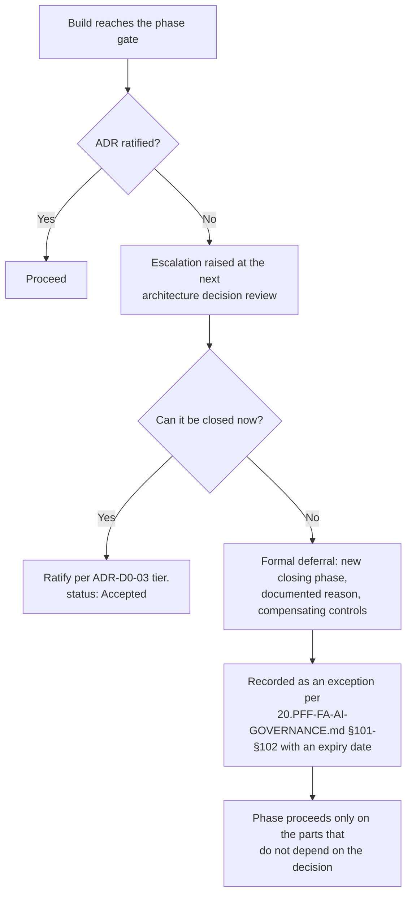

# ADR-D0-04 — Open and deferred decision register with a phase-gated escalation path

## 1. Summary

A decision that is not yet made is recorded as a `Proposed` ADR carrying its full
evaluation and a stated recommendation, listed in `_register/open-decisions.md` against the
build phase that forces it. Deferral is legitimate and is bounded: every open decision
names the phase it must close by, and reaching that phase without closure is an escalation,
not a default.

## 2. Context and Problem Statement

`CLAUDE.md` §Confirmed Tech Stack leaves four choices open — vector store, IaC tool,
Kubernetes manifest tool, and the self-hosted SLM serving stack — with an explicit
instruction: *resolve via ADR, don't silently pick one*. `DEVELOPMENT-GUIDE.md` §2 repeats
this and adds "**Before Phase 8 (RAG/Vector), stop and ask the user to decide** (or record
an ADR) rather than guessing."

That instruction is right and, as things stand, unenforceable. There are three ways an
open decision resolves itself badly:

- **Resolution by implementation.** The first engineer to need a vector store picks one,
  writes an adapter against it, and the choice is made — not by anyone with the authority
  to make it, and with no record that a decision occurred. By the time it is noticed, the
  cost of reversal is the cost of the code already written against it.
- **Resolution by omission.** The phase arrives, the decision has not been made, and the
  work proceeds around it — usually by building a placeholder that quietly becomes
  permanent.
- **Indefinite deferral.** The decision stays open past the point where deferral had value,
  because nothing forces the question.

Deferral itself is not the problem. Deferring a vector store choice until the retrieval
requirements are known is better engineering than picking one during architecture. The
problem is deferral without a closing condition — which 20.PFF-FA-AI-GOVERNANCE.md §103 identifies precisely,
in the context of governance exceptions: avoid permanent exceptions; if a control is
permanently unsuitable, update the policy or redesign, rather than leaving an indefinite
exception open.

An earlier attempt exists: `docs/adr/0003-deferred-decisions-log.md`, a table of open
choices with candidates and status. It is a genuine improvement over nothing, but it holds
no analysis, no recommendation, no closing date, and no escalation path, so a reader
reaching Phase 8 with the vector store still open learns only that it is still open.

## 3. Decision Drivers

### 3.1 Functional drivers

| ID | Driver | Source |
|---|---|---|
| DR-F-01 | Open decisions must be visible as open, not absent | `CLAUDE.md` §Confirmed Tech Stack |
| DR-F-02 | An open decision must not be resolvable by implementation | `DEVELOPMENT-GUIDE.md` §2 |
| DR-F-03 | Every deferral must carry a closing condition | 20.PFF-FA-AI-GOVERNANCE.md §103 (Permanent Exceptions) |
| DR-F-04 | Reaching the closing condition unresolved must escalate | 20.PFF-FA-AI-GOVERNANCE.md §104 (Governance Escalation) |
| DR-F-05 | An open decision must carry enough analysis that closing it is a choice, not a research project | 20.PFF-FA-AI-GOVERNANCE.md §19 (Risk Treatment) |

### 3.2 Non-functional drivers

| ID | Driver | Target | Source |
|---|---|---|---|
| DR-N-01 | Closing an open decision should take a meeting, not a workstream | ≤1 review cycle from escalation to closure | Programme practice |
| DR-N-02 | Open decisions must be discoverable without reading the library | Single list, linked from `README.md` and `CLAUDE.md` | DR-F-01 |
| DR-N-03 | Deferral must not accumulate | ≤6 open at any time | Programme practice |

### 3.3 Constraints

| ID | Constraint | Type | Source |
|---|---|---|---|
| DR-C-01 | Four decisions are open by explicit instruction and must not be pre-resolved | Organisational | `CLAUDE.md`; `DEVELOPMENT-GUIDE.md` §2 |
| DR-C-02 | `DEVELOPMENT-GUIDE.md` §4's 24 phases are the programme's schedule and are the natural closing conditions | Organisational | `DEVELOPMENT-GUIDE.md` §4 |
| DR-C-03 | The status lifecycle is fixed by ADR-D0-02; no new status may be introduced | Organisational | ADR-D0-02 §7.2 |
| DR-C-04 | Open architecture choices are built behind interfaces, so the choice stays reversible while open | Platform | `docs/adr/0004` §Context; 9 PFF-FA-AI-MEMORY-CACHE.md §137–§138 |

### 3.4 Assumptions

| ID | Assumption | If false | Validation |
|---|---|---|---|
| DR-A-01 | Interface abstraction genuinely keeps an open choice reversible | Deferral has hidden cost; the closing phase must move earlier | Verified when each open decision closes — did calling code change? |
| DR-A-02 | Deferring produces better decisions, because requirements are clearer later | Deferral is pure delay and choices should be made at architecture time | QM-04 |
| DR-A-03 | The approver for an open decision will be available at its closing phase | Escalation per §7.4 | ADR-D0-03 §7.5 |

## 4. Evaluation Criteria and Weights

| ID | Criterion | Weight | Rationale | Measurement |
|---|---|---|---|---|
| EC-01 | Prevents resolution by implementation | 30 | The specific failure `CLAUDE.md` and `DEVELOPMENT-GUIDE.md` §2 both warn against, and the one with the highest reversal cost | Can code land that presumes an unmade choice without anyone noticing? |
| EC-02 | Forces closure at the right time | 25 | Deferral without a closing condition is 20.PFF-FA-AI-GOVERNANCE.md §103's indefinite exception | Is there a specific, detectable event that forces the question? |
| EC-03 | Decision-readiness when the moment arrives | 20 | An open decision with no analysis behind it becomes a research project at the worst moment | Can the approver decide in one sitting from what is recorded? |
| EC-04 | Visibility | 15 | An open decision nobody can find is a made decision | Is it discoverable without reading the library? |
| EC-05 | Cost to maintain | 10 | Tracking overhead should not exceed the value of tracking | Effort per open decision per cycle |
| | **Total** | **100** | | |

Scoring scale: **1** unacceptable · **2** poor · **3** adequate · **4** good · **5** excellent.

## 5. Alternatives Considered

### 5.1 Option A — A log table, as `docs/adr/0003` does today

**Description.** One Markdown table listing open choices, candidates and status. No ADR is
written until the choice is made.

**Strengths.**
- Very cheap to maintain; one row per decision.
- Visible in one place.
- Already exists and is understood.

**Weaknesses.**
- No analysis, so when Phase 8 arrives the team starts evaluating vector stores from
  scratch, under time pressure — the worst conditions for the choice (EC-03).
- No closing condition beyond an informal "needed by" note; nothing detects breach (EC-02).
- Nothing prevents implementation proceeding against an assumed answer (EC-01).
- A row in a table does not convey that a decision is *required*, only that it is noted.

**Cost / effort.** Minimal.

### 5.2 Option B — Decide everything upfront; nothing stays open

**Description.** Resolve all four open choices during architecture, before the phases that
need them.

**Strengths.**
- No open-decision tracking needed at all.
- No possibility of resolution by implementation.
- Maximum certainty for planning.

**Weaknesses.**
- Contradicts DR-C-01 directly: `CLAUDE.md` instructs that these not be silently picked,
  and picking them early with less information is a variant of exactly that.
- Decides the vector store before retrieval requirements, corpus size or ACL model are
  known — which is deciding with the least information available, not the most.
- Early decisions made on thin evidence get reversed later, at higher cost than deferral
  would have carried.

**Cost / effort.** High, and produces low-confidence decisions.

### 5.3 Option C — Full `Proposed` ADR per open decision, phase-gated, in a register

**Description.** Each open decision is written as a complete ADR — criteria, alternatives,
weighted matrix, recommendation — carrying `status: Proposed`. It names the build phase it
must close by, is listed in `_register/open-decisions.md`, and reaching its phase unclosed
escalates per 20.PFF-FA-AI-GOVERNANCE.md §104.

**Strengths.**
- The analysis is done in calm conditions; closure at the phase is a ratification meeting,
  not an evaluation project (EC-03).
- The phase gate is a specific, detectable closing condition (EC-02).
- A `Proposed` ADR is visibly not `Accepted`, so code presuming it is challengeable at
  review (EC-01).
- Register plus `README.md` link gives one-stop visibility (EC-04).
- Uses ADR-D0-02's existing lifecycle; no new status (DR-C-03).

**Weaknesses.**
- Substantially more work than a table row — a full evaluation for a decision that may
  change shape before it closes.
- Analysis can go stale between authoring and closure.
- A stated recommendation risks becoming the default by inertia, which is a subtler form of
  the silent pick `CLAUDE.md` warns against.

**Cost / effort.** ~0.5 architect-day per open decision, plus refresh at closure.

### 5.4 Option D — Track open decisions as risks in the AI risk register

**Description.** Enter each unmade decision in the 20.PFF-FA-AI-GOVERNANCE.md §18 AI risk register, with
treatment per §19 and residual risk per §20.

**Strengths.**
- Uses governance machinery that already exists and is already reviewed.
- Risk review cadence forces periodic revisiting.
- Naturally captures the consequence of not deciding.

**Weaknesses.**
- Category error: an unmade decision is not a risk, it is a pending choice. Treating it as
  a risk invites "mitigation" — a workaround — rather than closure.
- The risk register is not where an engineer looks before writing a vector-store adapter
  (EC-04).
- Carries no evaluation of the options (EC-03).
- Risk treatment can legitimately conclude "accept", which for an open decision means
  never deciding.

**Cost / effort.** Low, but resolves to the wrong shape of answer.

## 6. Evaluation Method and Decision Matrix

**Method.** Weighted scoring against §4, assessed against the four decisions actually open
under DR-C-01 and the phases in `DEVELOPMENT-GUIDE.md` §4 that force them.

| Criterion | Weight | A: Log table | B: Decide upfront | C: Proposed ADR + phase gate | D: Risk register |
|---|---|---|---|---|---|
| EC-01 Prevents resolution by implementation | 30 | 2 | 5 | 4 | 2 |
| EC-02 Forces closure at the right time | 25 | 2 | 5 | 5 | 3 |
| EC-03 Decision-readiness | 20 | 1 | 4 | 5 | 2 |
| EC-04 Visibility | 15 | 4 | 5 | 5 | 2 |
| EC-05 Cost to maintain | 10 | 5 | 2 | 2 | 4 |
| **Weighted total** | **100** | **240** | **445** | **440** | **250** |

- **Option C:** (30×4) + (25×5) + (20×5) + (15×5) + (10×2) = 120 + 125 + 100 + 75 + 20 = **440**
- **Option B:** (30×5) + (25×5) + (20×4) + (15×5) + (10×2) = 150 + 125 + 80 + 75 + 20 = **445**

**Sensitivity.** B edges C by 5 points — inside the noise of a five-point scale, and the
matrix does not decide between them. B's advantage is entirely on EC-01: deciding
everything upfront trivially prevents resolution by implementation, because nothing is left
open. But B is eliminated by DR-C-01 before scoring matters. `CLAUDE.md` and
`DEVELOPMENT-GUIDE.md` §2 both instruct that these choices not be pre-resolved, and an
early low-information pick is the same failure the instruction guards against, merely
better documented. This is the case the sensitivity note in `TEMPLATE.md` anticipates: the
tie-break is the constraint, not the score. Among options that respect DR-C-01, C leads the
nearest alternative (D) by 190 points.

## 7. Decision

### 7.1 An open decision is a `Proposed` ADR, not an absence

Every unmade architecturally significant decision is written as a full ADR to
`TEMPLATE.md`, carrying `status: Proposed`. It contains everything an Accepted ADR does —
drivers, criteria, alternatives, weighted matrix — and states a recommendation in §7. What
it does not have is ratification.

The recommendation is explicit but not binding. §7 of a `Proposed` ADR must state, in
terms, that the recommendation is not a decision and that no implementation may presume it.

### 7.2 Phase gating

Every open decision names, in its §7 and in the register, the `DEVELOPMENT-GUIDE.md` §4
build phase by which it must close. The phase is the closing condition 20.PFF-FA-AI-GOVERNANCE.md §103 requires.

| Open decision | ADR | Must close by |
|---|---|---|
| Vector store | ADR-D3-24 | Phase 8 — RAG + Embedding/Vector |
| Self-hosted SLM serving stack | ADR-D5-10 | Phase 9 — SLM abstraction (deferrable to the self-hosting migration) |
| Infrastructure-as-Code tool | ADR-D5-12 | Phase 19 — Infrastructure / IaC / CI-CD |
| Kubernetes manifest tool | ADR-D5-13 | Phase 19 — Infrastructure / IaC / CI-CD |

Phases 8 and 19 were both explicitly flagged in `DEVELOPMENT-GUIDE.md` §2 as stop-and-ask
points; this table makes that machine-checkable rather than advisory.

### 7.3 While a decision is open

Three rules hold:

1. **Build behind an interface.** The open choice sits behind an abstraction — `VectorStore`,
   `MemoryStore`, and so on — so that closing the decision changes an adapter and no calling
   code (DR-C-04). This is the practice `docs/adr/0004` already established for the memory
   store and 9 PFF-FA-AI-MEMORY-CACHE.md §137–§138 requires.
2. **No production dependency.** No production configuration, deployment manifest or
   release manifest may name a candidate for an open decision. A development-time default
   behind the interface is permitted and must be labelled as such in configuration.
3. **No presumption at review.** A pull request that presumes an open decision is rejected
   at review. The `Proposed` status is what makes this checkable — a reviewer can point at
   the ADR rather than argue from memory.

### 7.4 Escalation

Reaching a decision's closing phase without ratification is an escalation under 20.PFF-FA-AI-GOVERNANCE.md §104:

A formal deferral under §7.4 is a governance exception in 20.PFF-FA-AI-GOVERNANCE.md §101's sense and takes
that shape — reason, risk, compensating controls, owner, approver, start date, expiry,
review date. It is not a quiet slip of the date. Per 20.PFF-FA-AI-GOVERNANCE.md §103, a decision deferred twice
is escalated to the AI Platform Owner: two deferrals suggest the closing condition was
wrong, or that nobody intends to decide.

### 7.5 Closing a decision

1. Refresh §5 and §6 against current information — candidates and pricing move.
2. Route to the approver per ADR-D0-03 §7.1.
3. Set `status: Accepted`, record the ratification in §20, bump to `1.1.0` if the analysis
   changed materially, and note that the decision closed at its gate.
4. Remove the row from `_register/open-decisions.md`; update `_register/decision-register.md`.
5. Replace the interface's development default with the chosen implementation.

The record keeps its ID. It does not become a new ADR on ratification — the `Proposed`
version and the `Accepted` version are the same decision at two stages, and §20 carries the
history.

**Status rationale.** Accepted. Concerns how open decisions are tracked, not any 2. PFF-FA-AI-ARCHITECTURE-DETAILED.md §52
category, so tier 3 under ADR-D0-03.

## 8. Architecture Detail

### 8.1 Register structure

`_register/open-decisions.md` carries one row per open decision: ID, decision, stated
recommendation, closing phase, what it blocks, and decision owner. It is linked from
`README.md` and is the single answer to "what have we not decided yet?"

### 8.2 Relationship to `docs/adr/0003-deferred-decisions-log.md`

That file is superseded by this record together with `_register/open-decisions.md`. It
remains in place unmodified per ADR-D0-01 §8.4. Its content maps forward as:

| `0003` row | Now |
|---|---|
| Vector store — Open | ADR-D3-24, `Proposed`, gated at Phase 8 |
| IaC tool — Open, deferred by the user at Phase 19 | ADR-D5-12, `Proposed`, gated at Phase 19 |
| Kubernetes manifest tool — Open, deferred by the user at Phase 19 | ADR-D5-13, `Proposed`, gated at Phase 19 |
| Environment stage model — accepted, no dedicated ADR | ADR-D5-14, `Accepted` |
| First agent build scope — accepted, no dedicated ADR | ADR-D1-11, `Accepted` |
| Memory/session/cache store — Azure Managed Redis | ADR-D4-10, `Accepted`, supersedes `docs/adr/0004` |
| Deployment strategy — Rolling, accepted at Phase 19 | ADR-D7-10, `Accepted` |

Three rows in `0003` recorded accepted decisions with the note "no dedicated ADR needed."
Under ADR-D0-02 §7.4's significance test each qualifies — the environment model is
cross-cutting, the agent catalogue scope is user-facing, and the deployment strategy is a
2. PFF-FA-AI-ARCHITECTURE-DETAILED.md §52 deployment-boundary decision — so each now has its own record.

### 8.3 Why the interface rule matters more than the register

The register makes an open decision visible. The interface rule in §7.3 is what makes it
*cheap*, and it is the load-bearing control here. A decision behind a clean abstraction can
be deferred at almost no cost and closed by writing one adapter. A decision that has leaked
into calling code cannot be deferred at all — it has already been made. If DR-A-01 proves
false for any open decision, that decision's gate moves earlier, because deferral was
buying nothing.

## 9. Consequences

### 9.1 Positive

- Open decisions are visible, analysed and dated; none of the three bad resolutions in §2
  can happen silently.
- Closure at a phase gate is a ratification meeting rather than an evaluation project.
- Deferral becomes a governed act with an expiry, matching 20.PFF-FA-AI-GOVERNANCE.md §101–§103.
- `CLAUDE.md`'s "resolve via ADR, don't silently pick one" becomes enforceable at pull
  request review.
- `docs/adr/0003`'s three "no dedicated ADR needed" decisions gain proper records.

### 9.2 Negative

- Writing a full ADR for a decision not yet made is expensive, and some analysis will be
  redone at closure as candidates move.
- A stated recommendation can become the default through inertia — a subtler version of
  the silent pick this is meant to prevent (RSK-02).
- The interface rule imposes a real design constraint: every open choice must be
  abstractable, which occasionally costs a layer that a settled decision would not need.

### 9.3 Neutral

- Introduces no new status; `Proposed` from ADR-D0-02 §7.2 carries the whole model.
- The four currently-open decisions were already open; this record changes how they are
  tracked, not whether they are.

### 9.4 Trade-offs explicitly accepted

| Given up | In exchange for | Accepted by |
|---|---|---|
| ~0.5 architect-day per open decision, ahead of the decision | Closure as a meeting rather than a project, at the moment of maximum time pressure | AI Solution Architect |
| Freedom to defer indefinitely | Bounded deferral with an expiry, per 20.PFF-FA-AI-GOVERNANCE.md §103 | AI Platform Owner |
| An abstraction layer around each open choice | Reversibility while the choice is open | AI Engineering Lead |

## 10. Golden-Rule and Precedence Conformance

| Constraint | Conformance |
|---|---|
| Enterprise decides; AI orchestrates | Not applicable — governs how the programme tracks its own unmade decisions. |
| Authoritative-truth precedence | Not applicable — no runtime data path. |
| Four-state separation | Not applicable. |
| Versioned artefacts, never mutated in place | Upheld: a `Proposed` record moves to `Accepted` in place because it is the same decision at two lifecycle stages, with §20 recording the transition. Any change to §7's substance before ratification is a version bump, not a silent edit. |
| Adam persona governs how, never what | Not applicable. |

## 11. Risks and Mitigations

| ID | Risk | Likelihood | Impact | Exposure | Mitigation | Owner | Residual |
|---|---|---|---|---|---|---|---|
| RSK-01 | An open decision is resolved by implementation before its gate | Medium | High | High | §7.3 interface rule and review check; `Proposed` status makes the objection concrete at review; QM-01 | AI Engineering Lead | Low |
| RSK-02 | The stated recommendation becomes the decision by inertia, never actually ratified | Medium | Medium | Medium | §7.1 requires the non-binding statement in §7; §7.5 requires a refresh of §5–§6 before ratification, forcing a fresh look | AI Solution Architect | Medium |
| RSK-03 | Analysis goes stale between authoring and closure | High | Low | Medium | §7.5 step 1 mandates refresh at closure; accepted as the cost of early analysis | AI Solution Architect | Low |
| RSK-04 | Decisions deferred repeatedly, becoming 20.PFF-FA-AI-GOVERNANCE.md §103's permanent exception | Medium | High | High | §7.4 escalates a twice-deferred decision to the AI Platform Owner; every deferral carries an expiry | AI Platform Owner | Low |
| RSK-05 | Interface abstraction proves insufficient and the choice has leaked into calling code | Low | High | Medium | Verified at closure (DR-A-01); if leaked, the gate moves earlier and the leak is remediated before the phase proceeds | AI Engineering Lead | Medium |
| RSK-06 | Open decisions accumulate beyond DR-N-03's limit of six | Low | Medium | Low | Monthly review per ADR-D0-03 §7.3 reviews the open list; QM-05 | AI Solution Architect | Low |

## 12. Quantitative Targets and Measures

| ID | Measure | Target | Threshold (alert) | Source | Review cadence |
|---|---|---|---|---|---|
| QM-01 | Production config or manifests naming a candidate for an open decision | 0 | ≥1 | Grep of `config/environments/prod/` and deployment manifests against open-decision candidates | Per release |
| QM-02 | Open decisions reaching their gate unratified | 0 | ≥1 | `_register/open-decisions.md` against `DEVELOPMENT-GUIDE.md` §4 progress | Monthly |
| QM-03 | Decisions deferred more than once | 0 | ≥1 | Register deferral history | Quarterly |
| QM-04 | Open decisions whose §5–§6 changed materially at closure | Tracked, no target | — | §20 change-log at closure | Per closure |
| QM-05 | Open decisions at any time | ≤6 | >8 | `_register/open-decisions.md` | Monthly |
| QM-06 | Calling-code changes required when an open decision closed | 0 | ≥1 | Diff at closure — validates DR-A-01 | Per closure |

QM-04 has no target by design: it measures whether early analysis was worth doing. A high
value means deferral genuinely improved the decision (supporting DR-A-02); a value near
zero means the analysis could have been done at architecture time and Option B was closer
to right than the matrix suggested. Either reading is useful; neither is a failure.

## 13. Security, Privacy and Compliance Impact

| Dimension | Impact |
|---|---|
| Attack surface change | None directly. Reduces the risk of an unvetted component reaching production through §7.3's prohibition on naming a candidate in production configuration. |
| Data classification touched | Internal. |
| Personal data / PII | None. |
| Children's data and safeguarding | Indirect but real: the vector store (ADR-D3-24) will hold embeddings derived from documents that may reference minors, and ACL enforcement depends on the chosen store's metadata filtering. §7.3's no-production-dependency rule prevents that being settled by an adapter written in a hurry. ADR-D6-12 carries the substantive control. |
| UK GDPR lawful basis and rights impact | Indirect. Data-residency and processor obligations differ across vector store candidates; §7.5's refresh step keeps that assessment current at the point of decision. |
| Audit and evidential requirements | Supports 20.PFF-FA-AI-GOVERNANCE.md §102 by giving every deferral the required shape — reason, risk, compensating controls, owner, approver, expiry. |
| Standards touched | ISO/IEC 42001 (AI management system — planning and change control); ISO 9001 §6.1 (actions to address risks and opportunities); CMMI-DEV DAR SP 1.2, RSKM, PP/PMC. |

## 14. Implementation Impact

| Aspect | Detail |
|---|---|
| Build phases | 0 (establish), 8 and 19 (gates), 21 (governance artefacts) |
| Repository paths | `docs/architecture/adr/_register/open-decisions.md`; interface modules `src/pff_fa_ai/embedding_vector/`, `src/pff_fa_ai/slm/providers/` |
| Configuration | §7.3 prohibits production configuration naming an open candidate; development defaults must be labelled as such |
| Contracts / schemas | None new; relies on ADR-D0-02's `status` field |
| Migration | `docs/adr/0003-deferred-decisions-log.md` superseded, not edited; its rows map forward per §8.2 |
| Dependencies on other ADRs | ADR-D0-01, ADR-D0-02 (lifecycle), ADR-D0-03 (who ratifies at closure) |
| Effort estimate | Small to establish; ~0.5 architect-day per open decision recorded |

## 15. Validation and Verification

| ID | Acceptance criterion | Verification method |
|---|---|---|
| AC-01 | Every ADR with `status: Proposed` appears in `_register/open-decisions.md`, and every row there resolves to a `Proposed` ADR | Cross-check register against front-matter `status` |
| AC-02 | Every `Proposed` ADR names a closing build phase in §7 and in the register | Grep §7 and register rows |
| AC-03 | Every `Proposed` ADR contains a complete §5 and §6 with a stated recommendation | Governance review sampling |
| AC-04 | Every `Proposed` ADR's §7 states the recommendation is not binding | Grep for the non-binding statement |
| AC-05 | No production configuration or deployment manifest names a candidate for an open decision | QM-01 grep, run per release |
| AC-06 | Each open decision's subject is reached only through an interface, not a concrete type, in calling code | Import-boundary check over `src/pff_fa_ai/` |
| AC-07 | `docs/adr/0003-deferred-decisions-log.md` is unmodified | `git log -- docs/adr/0003-deferred-decisions-log.md` |

## 16. Operational Impact

| Aspect | Detail |
|---|---|
| Monitoring | Not runtime. QM-02 and QM-05 at the monthly review; QM-01 per release. |
| Alerting | None automated. The phase gate is the alert, raised by the build reaching it. |
| Runbook | Closing procedure is §7.5; escalation is §7.4. |
| Failure mode and degradation | The failure is a phase proceeding past its gate with the decision unmade, leaving a development-time placeholder in a production path. QM-01 detects it at release; AC-06 detects the precursor at review. |
| Rollback | Reversible by a superseding ADR. Already-closed decisions retain their `Accepted` status. |
| Support model impact | One standing item on the monthly review agenda. |

## 17. Cost Impact

| Cost element | One-off | Recurring | Basis |
|---|---|---|---|
| Register and process definition | ~0.25 architect-day | — | This record |
| Authoring each `Proposed` ADR | ~0.5 architect-day each | — | Four currently open under DR-C-01 |
| Refresh at closure | — | ~0.25 architect-day per closure | §7.5 step 1 |
| Interface abstraction | Absorbed | — | Already required by 9 PFF-FA-AI-MEMORY-CACHE.md §137–§138 and existing practice |
| Monthly review item | — | ~15 minutes per month | ADR-D0-03 §7.3 |

## 18. Revisit Triggers and Causal Analysis Hooks

| ID | Trigger | Detected by | Action on trigger |
|---|---|---|---|
| RT-01 | QM-02 records an open decision reaching its gate unratified | Monthly review | Escalation per §7.4; causal analysis on why closure did not happen |
| RT-02 | QM-03 records a second deferral of any decision | Quarterly review | Escalate to AI Platform Owner; consider whether the decision is genuinely needed at all |
| RT-03 | QM-06 shows calling-code changes at closure | Diff review at closure | DR-A-01 is false for that class of decision; move comparable gates earlier |
| RT-04 | QM-04 is consistently near zero across closures | Quarterly review | Deferral is not improving decisions; make future choices at architecture time |
| RT-05 | QM-05 exceeds 8 open decisions | Monthly review | The programme is deferring rather than deciding; causal analysis at the governance review |
| RT-06 | `CLAUDE.md` or `DEVELOPMENT-GUIDE.md` §2 changes the set of explicitly open choices | Change notice | Re-derive the §7.2 gate table |

**Scheduled review:** 2027-02-21.

## 19. Traceability

| Dimension | Reference |
|---|---|
| Workshop sheet | WS-36 Risks, Assumptions & Decision Register |
| Specification sections | 20.PFF-FA-AI-GOVERNANCE.md §18 (AI Risk Register), §19 (Risk Treatment), §20 (Residual Risk), §101 (Governance Exceptions), §102 (Exception Requirements), §103 (Permanent Exceptions), §104 (Governance Escalation); 3. PFF-FA-AI-RESPONSIBILITY-MATRIX.md §73 (Change Control); 9 PFF-FA-AI-MEMORY-CACHE.md §137–§138 (Provider Independence) |
| Requirement IDs | Per ADR-D1-12 |
| Build phases | 0, 8, 19, 21 |
| Code paths | `src/pff_fa_ai/embedding_vector/`, `src/pff_fa_ai/slm/providers/` — interface boundaries protecting open choices |
| Configuration | `config/environments/prod/` — subject to QM-01 |
| Tests | AC-01 to AC-07 |
| Upstream ADRs | ADR-D0-01, ADR-D0-02, ADR-D0-03 |
| Downstream ADRs | ADR-D3-24, ADR-D5-10, ADR-D5-12, ADR-D5-13 (the currently open decisions); ADR-D8-06 (RAID register) |
| Supersedes | `docs/adr/0003-deferred-decisions-log.md` |

## 20. Change Log

| Version | Date | Author | Change |
|---|---|---|---|
| 1.0.0 | 2026-08-21 | AI Solution Architect | Initial decision recorded. Open decisions as `Proposed` ADRs, phase-gated closing conditions, escalation per 20.PFF-FA-AI-GOVERNANCE.md §104, interface rule preserving reversibility. |
