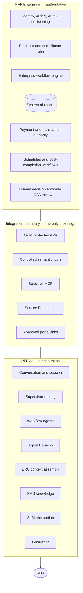

# ADR-D1-01 — PFF AI scope boundary: a conversational orchestration layer, not a replacement enterprise platform

## 1. Summary

PFF AI is scoped as a conversational orchestration layer over the existing PFF platform. It
owns conversation, context assembly, agent execution, knowledge retrieval and communication.
It owns no business rule, no transaction, no authorization decision and no system-of-record
data. The scope is defined by explicit exclusion as much as inclusion — 1 PFF-FA-AI-ARCHITECTURE.md §2.3's nine
non-goals are part of this decision, not commentary on it.

## 2. Context and Problem Statement

PFF is a working platform. It administers club affiliation, team registration, insurance,
discipline, officials and safeguarding, county cups and payments for the FA's county
associations, and it integrates with WGS, the FA's national football database. It has a
database, a workflow engine, deterministic compliance rules, a payment service, and years of
accumulated business logic — the affiliation flow alone documents 32 distinct scenarios with
six application statuses and six decision flags that alter routing.

Introducing a conversational AI layer over a platform like that admits a wide range of
scopes, and the choice is not obvious. It could be a thin natural-language veneer over
existing screens. It could be an autonomous agent that reads the database and acts. It could
be a replacement front end that gradually absorbs business logic. Each is a coherent product,
and each has been built somewhere.

The scope question must be settled first because everything downstream inherits it. Whether
the platform has a rules engine, whether it holds authoritative state, whether it can write
to the database, whether a model output can authorise anything — these are not independent
choices. They are consequences of where this boundary is drawn.

Getting it wrong in the permissive direction is expensive and hard to reverse. An AI layer
that re-implements an eligibility rule creates a second source of truth for eligibility. When
the two disagree — and they will, because PFF's rules change and the AI copy will lag — the
platform produces two answers to a compliance question about, in some cases, whether an adult
with a pending DBS check may work with under-18s. That is not a defect to be fixed in a
release; it is a safeguarding failure.

Getting it wrong in the restrictive direction is cheaper but real: a layer that can only
paraphrase screen content delivers little, and the affiliation flow shows why. A club
secretary hitting a pre-check failure at Phase 1 gets a banner listing what is wrong across
officials, safeguarding, insurance, ground, league and debt. Turning that into a guided
conversation that gathers the relevant context and explains each item requires orchestration
across several enterprise services — more than a veneer can do.

The specifications answer this question consistently but in fragments across three documents.
1 PFF-FA-AI-ARCHITECTURE.md §1 states the boundary as a principle. 1 PFF-FA-AI-ARCHITECTURE.md §2.1–§2.3 enumerate ownership and
non-goals. 2. PFF-FA-AI-ARCHITECTURE-DETAILED.md §5.1–§5.3 restate it as three boundaries. 3. PFF-FA-AI-RESPONSIBILITY-MATRIX.md §71 restates it again as a
diagram. 2. PFF-FA-AI-ARCHITECTURE-DETAILED.md §48 lists the anti-patterns that follow from it. None of them records why this
scope was chosen over the alternatives, what it costs, or what would justify revisiting it.

## 3. Decision Drivers

### 3.1 Functional drivers

| ID | Driver | Source |
|---|---|---|
| DR-F-01 | Users must be able to complete real business workflows conversationally, not merely ask questions about them | 1 PFF-FA-AI-ARCHITECTURE.md §39 criteria 1–7; affiliation flow Phases 1–6 |
| DR-F-02 | The platform must assemble context across multiple enterprise services in one interaction | 1 PFF-FA-AI-ARCHITECTURE.md §39 criterion 5; affiliation flow Phase 1 club checks |
| DR-F-03 | Enterprise systems must remain the single system of record for all business state | 1 PFF-FA-AI-ARCHITECTURE.md §2.1; 3. PFF-FA-AI-RESPONSIBILITY-MATRIX.md §71 |
| DR-F-04 | The platform must be extensible to new workflows without redesigning its core | 1 PFF-FA-AI-ARCHITECTURE.md §39 criterion 20; 2. PFF-FA-AI-ARCHITECTURE-DETAILED.md §49 |
| DR-F-05 | The platform must explain enterprise outcomes it did not decide, faithfully | 3. PFF-FA-AI-RESPONSIBILITY-MATRIX.md §65; 1 PFF-FA-AI-ARCHITECTURE.md §1 |

### 3.2 Non-functional drivers

| ID | Driver | Target | Source |
|---|---|---|---|
| DR-N-01 | No divergence between AI-stated and enterprise-held business state | 0 contradictions of authoritative state | 3. PFF-FA-AI-RESPONSIBILITY-MATRIX.md §63; 1 PFF-FA-AI-ARCHITECTURE.md §2.3 |
| DR-N-02 | Enterprise change must not require a corresponding AI change for rule updates | 0 AI releases required when a PFF business rule changes | 1 PFF-FA-AI-ARCHITECTURE.md §2.3; 2. PFF-FA-AI-ARCHITECTURE-DETAILED.md §3.1 |
| DR-N-03 | New workflow onboarding cost stays bounded | A new agent added without core changes | 1 PFF-FA-AI-ARCHITECTURE.md §39 criterion 20 |
| DR-N-04 | Auditability of every enterprise action the platform triggers | 100% traceable to an enterprise API call or event | 20.PFF-FA-AI-GOVERNANCE.md §29 |

### 3.3 Constraints

| ID | Constraint | Type | Source |
|---|---|---|---|
| DR-C-01 | The AI platform must not reimplement enterprise business rules, access enterprise databases directly, replace enterprise workflow execution, implement an independent authorization engine, implement scheduled processing, make independent compliance/eligibility decisions, treat RAG as operational truth, allow the SLM unrestricted tool access, or invent portal URLs or API results | Organisational | 1 PFF-FA-AI-ARCHITECTURE.md §2.3 |
| DR-C-02 | Enterprise owns identity, authentication, authorization decisioning, business rules, workflow authority, transaction authority, database authority, payment authority, scheduled workflows, post-completion workflows and human decision authority | Organisational | 2. PFF-FA-AI-ARCHITECTURE-DETAILED.md §5.1; 1 PFF-FA-AI-ARCHITECTURE.md §2.1 |
| DR-C-03 | Integration is only through APIM-protected APIs, controlled semantic tools, selective MCP, Service Bus events and approved portal links | Platform | 2. PFF-FA-AI-ARCHITECTURE-DETAILED.md §5.3 |
| DR-C-04 | PFF business logic is subject to FA safeguarding obligations covering minors | Regulatory | Affiliation flow Phase 1 (CRC/DBS checks for U5–U18 teams) |

### 3.4 Assumptions

| ID | Assumption | If false | Validation |
|---|---|---|---|
| DR-A-01 | PFF exposes, or can expose, APIs sufficient for every context the AI needs | The AI is tempted toward direct data access, breaching DR-C-01; the correct response is an enterprise API request, not an AI workaround | Verified per workflow during ERC design; ADR-D2-14 |
| DR-A-02 | Enterprise APIs are responsive enough for conversational latency | Scope narrows to asynchronous or informational interactions for the affected workflows | ADR-D5-18 latency budget |
| DR-A-03 | Orchestration alone delivers enough user value to justify the platform | The business case fails and scope must widen or the platform be reconsidered | ADR-D8-03 benefit realisation |

## 4. Evaluation Criteria and Weights

| ID | Criterion | Weight | Rationale | Measurement |
|---|---|---|---|---|
| EC-01 | Preservation of a single source of business truth | 30 | Divergence in a safeguarding or eligibility answer is a compliance failure, not a bug; DR-C-04 makes this the dominant concern | Can the platform produce a business answer that contradicts PFF? |
| EC-02 | User value delivered | 25 | A scope that is safe and useless is not worth building | Can a user complete a real workflow end to end? |
| EC-03 | Change independence from enterprise | 20 | PFF's rules change continuously; scope that couples to them creates permanent maintenance | Does a PFF rule change force an AI release? |
| EC-04 | Extensibility to further workflows | 15 | Affiliation is the first of many | Can a new workflow be added without core redesign? |
| EC-05 | Implementation and operating cost | 10 | Real but secondary to correctness here | Build effort and run cost |
| | **Total** | **100** | | |

Scoring scale: **1** unacceptable · **2** poor · **3** adequate · **4** good · **5** excellent.

EC-01 at 30 is deliberate and defensible. DR-C-04 puts children's safeguarding data inside
the workflows in scope: the affiliation pre-checks in Phase 1 include whether officials on
youth teams hold valid DBS clearance. A scope permitting the AI to form its own view on that
question is not a trade-off to be weighed against convenience.

## 5. Alternatives Considered

### 5.1 Option A — Conversational veneer over existing screens

**Description.** The AI interprets natural language and navigates the user to the right PFF
screen, paraphrasing on-screen content. No context assembly, no tool execution, no workflow
participation.

**Strengths.**
- Cannot diverge from enterprise truth, because it holds none.
- Trivially safe against every anti-pattern in 2. PFF-FA-AI-ARCHITECTURE-DETAILED.md §48.
- Lowest cost to build and run.
- No coupling to enterprise rules whatsoever.

**Weaknesses.**
- Delivers little. The Phase 1 pre-check failure — the moment a club secretary most needs
  help — produces the same banner, now narrated.
- Cannot satisfy DR-F-01 or DR-F-02; no workflow is completed and no context is assembled.
- Fails 15 of 1 PFF-FA-AI-ARCHITECTURE.md §39's 20 success criteria outright.
- Sets up the wrong expectation with users, who will ask it to do things it cannot.

**Cost / effort.** Low.

### 5.2 Option B — Conversational orchestration layer over enterprise APIs and events

**Description.** The AI owns conversation, session, routing, agents, context assembly (ERC),
knowledge retrieval, guardrails, evaluation and observability. It executes enterprise
operations only through governed tools calling APIM-protected APIs, consumes Service Bus
events, and resolves portal links from a registry. All business decisions, rules,
transactions and authorization remain with PFF.

**Strengths.**
- Single source of truth preserved by construction: every business answer originates from an
  enterprise API or event.
- Delivers real value — a user completes affiliation conversationally, with context gathered
  across services and outcomes explained.
- Enterprise rule changes flow through automatically; the AI reads results, not rules.
- Extensible: a new workflow is a new agent over the same core, per 2. PFF-FA-AI-ARCHITECTURE-DETAILED.md §49.
- Every enterprise action is a traceable tool call.

**Weaknesses.**
- Wholly dependent on enterprise API coverage and latency (DR-A-01, DR-A-02). Where an API
  does not exist, the workflow cannot be orchestrated.
- Considerably more machinery than a veneer: ERC, harness, guardrails, evaluation.
- The AI must faithfully explain outcomes it did not compute, which is a genuine
  communication problem, not a trivial one.
- Requires discipline: the boundary is easy to describe and easy to erode one convenience at
  a time.

**Cost / effort.** High build, moderate run.

### 5.3 Option C — Autonomous agent with direct data and rule capability

**Description.** The AI reads enterprise data directly, evaluates business rules itself, and
acts with broad authority, calling enterprise systems where convenient.

**Strengths.**
- Fastest possible responses; no API round trips for context.
- Not blocked by missing enterprise APIs.
- Can answer questions no current API supports.
- Simplest architecture in the small — one system, one data path.

**Weaknesses.**
- Violates DR-C-01 and DR-C-02 comprehensively; prohibited by 1 PFF-FA-AI-ARCHITECTURE.md §2.3 and 2. PFF-FA-AI-ARCHITECTURE-DETAILED.md §48.
- Creates a second source of truth for eligibility, compliance and safeguarding. When it
  diverges — and a copied rule always eventually diverges — the platform gives two answers to
  a DBS-clearance question about work with minors.
- Direct database access defeats the authorization model: APIM claims mean nothing if the AI
  reads around them.
- A model output becomes an authorization decision, which 2. PFF-FA-AI-ARCHITECTURE-DETAILED.md §48 prohibits absolutely.
- Every PFF rule change requires a corresponding AI change, forever.

**Cost / effort.** Moderate to build, extreme to operate correctly and to assure.

### 5.4 Option D — Progressive absorption: orchestration now, business logic over time

**Description.** Start as Option B, but permit the AI to absorb business logic where doing so
improves latency or resilience — caching eligibility outcomes as rules, evaluating simple
checks locally, gradually becoming authoritative for some decisions.

**Strengths.**
- Delivers Option B's value initially.
- Pragmatic where an enterprise API is slow or missing.
- Allows optimisation of hot paths without waiting on enterprise change.

**Weaknesses.**
- The failure mode is not a possibility but a trajectory. Each absorption is individually
  defensible and collectively fatal; the platform arrives at Option C without a decision ever
  having been taken to go there.
- No stable place to stop. "Simple checks" is not a definable category — the affiliation
  debt rule looks simple and involves three invoice types with different overdue windows, one
  of which rolls to the next Tuesday.
- Divergence risk grows silently, and the divergence is discovered by a user receiving a
  wrong compliance answer.
- Makes the boundary unenforceable in review: there is no bright line to point at.

**Cost / effort.** Appears lower than B initially; higher over the platform's life.

## 6. Evaluation Method and Decision Matrix

**Method.** Weighted scoring against §4. EC-01 and EC-03 are assessed against the specific
prohibitions in 1 PFF-FA-AI-ARCHITECTURE.md §2.3 and the anti-patterns in 2. PFF-FA-AI-ARCHITECTURE-DETAILED.md §48. EC-02 is assessed by walking
each option against the affiliation flow's Phases 1–6 and 1 PFF-FA-AI-ARCHITECTURE.md §39's twenty success criteria.

| Criterion | Weight | A: Veneer | B: Orchestration | C: Autonomous | D: Progressive |
|---|---|---|---|---|---|
| EC-01 Single source of truth | 30 | 5 | 5 | 1 | 2 |
| EC-02 User value | 25 | 1 | 5 | 5 | 5 |
| EC-03 Change independence | 20 | 5 | 5 | 1 | 2 |
| EC-04 Extensibility | 15 | 2 | 5 | 3 | 3 |
| EC-05 Cost | 10 | 5 | 2 | 3 | 3 |
| **Weighted total** | **100** | **355** | **470** | **250** | **295** |

- **Option B:** (30×5) + (25×5) + (20×5) + (15×5) + (10×2) = 150 + 125 + 100 + 75 + 20 = **470**
- **Option A:** (30×5) + (25×1) + (20×5) + (15×2) + (10×5) = 150 + 25 + 100 + 30 + 50 = **355**

**Sensitivity.** B leads by 115 points over A, its nearest rival, and wins or ties every
criterion except cost. The result is insensitive to reweighting: B scores 5 on the four
highest-weighted criteria, so no redistribution among them changes the outcome. Only if EC-05
were weighted above about 55 — more than EC-01 and EC-02 combined, i.e. asserting that cost
matters more than correctness and value together — would A overtake B. C and D are excluded
by DR-C-01 before scoring; they are scored here to record what was rejected and why, per
ADR-D0-02 §7.2's retention of rejected options.

## 7. Decision

PFF AI is scoped as a **conversational orchestration layer**. The boundary is defined in
three parts, and all three are binding.

### 7.1 What PFF AI owns

Conversation and session management; supervisor routing; workflow-level agents; the Agent
Harness; LangGraph execution; ERC construction and context engineering; controlled tools;
selective MCP integration; RAG integration; embedding and vector integration; SLM
abstraction; prompt management and versioning; memory, session and cache; input and output
guardrails; AI evaluation; AI observability; Service Bus event consumption; event-driven ERC
refresh and workflow resume; and AI-specific resilience, testing and cost controls.

### 7.2 What PFF AI does not own

Authentication and authorization decisioning; APIM policies and claims validation;
deterministic business and compliance rules; the enterprise workflow engine; the enterprise
database and system of record; payment and transaction authority; scheduled and timer
workflows; post-completion workflows; human approval and decision authority; and enterprise
operational notifications.

### 7.3 What PFF AI must never do

The nine prohibitions of 1 PFF-FA-AI-ARCHITECTURE.md §2.3 are adopted as binding architectural constraints, not
guidance. PFF AI must not reimplement enterprise business rules; access enterprise databases
directly; replace enterprise workflow execution; implement an independent authorization
engine; implement enterprise scheduled processing; make independent compliance or eligibility
decisions; treat RAG as operational truth; allow the SLM unrestricted API or tool access; or
invent portal URLs or enterprise API results.

Each maps to an anti-pattern in 2. PFF-FA-AI-ARCHITECTURE-DETAILED.md §48 and to a specific enforcement mechanism recorded in
a downstream ADR — §8.2 gives the mapping. A prohibition with no enforcement point is a
wish, and this decision does not rely on wishes.

### 7.4 The test for a proposed capability

A capability is in scope if it interprets, orchestrates, contextualises, explains or
communicates. It is out of scope if it decides or executes business outcomes. Where a
proposal appears to be both, it is out of scope: the ambiguity means it contains a decision
the enterprise should be making.

**Status rationale.** Accepted. This is a tier 1 decision under ADR-D0-03 §7.1 — it defines
system boundaries and data ownership, two of 2. PFF-FA-AI-ARCHITECTURE-DETAILED.md §52's enumerated categories — so it is
ratified by the external ADF/ADR governance forum.

## 8. Architecture Detail

### 8.1 The boundary

There are exactly five crossings, per 2. PFF-FA-AI-ARCHITECTURE-DETAILED.md §5.3. Any proposed sixth is a boundary change and
a tier 1 decision under ADR-D0-03.

### 8.2 Prohibitions and their enforcement points

A prohibition is only real where something enforces it. Each of 1 PFF-FA-AI-ARCHITECTURE.md §2.3's nine
non-goals has a named enforcement mechanism:

| Prohibition (1 PFF-FA-AI-ARCHITECTURE.md §2.3) | Anti-pattern (2. PFF-FA-AI-ARCHITECTURE-DETAILED.md §48) | Enforcement | ADR |
|---|---|---|---|
| No reimplementing business rules | LLM as business-rule engine | Agents call tools for outcomes; no rule evaluation in agent code; architecture-fitness check on `src/pff_fa_ai/domain/` | ADR-D1-02, ADR-D2-09 |
| No direct database access | Direct database access | No DB driver dependency in the package; integration is HTTP-only through the API catalogue | ADR-D2-13 |
| No replacing enterprise workflow | — | Workflow state is AI-execution state only; business state is read from the enterprise | ADR-D4-01 |
| No independent authorization engine | SLM-controlled authorization | APIM validates; the platform consumes claims and never derives them | ADR-D6-02 |
| No enterprise scheduled processing | — | Timer-driven outcomes arrive as Service Bus events; the platform schedules nothing business-facing | ADR-D2-16 |
| No independent compliance decisions | LLM as business-rule engine | Eligibility answers originate from an enterprise response; guardrail rejects unsourced compliance claims | ADR-D6-09 |
| RAG is never operational truth | RAG as operational database | Precedence chain enforced at context assembly; RAG content is separately labelled | ADR-D1-03, ADR-D3-20 |
| No unrestricted SLM tool access | — | Tool allowlist per agent; parameters schema-validated before execution | ADR-D6-10 |
| No invented portal URLs or API results | SLM-generated URLs | Portal links resolved from a registry; output guardrail rejects model-generated URLs | ADR-D2-19 |

### 8.3 The boundary applied to affiliation

Walking the affiliation flow shows the split concretely and is the clearest statement of what
this scope means in practice:

| Affiliation flow step | Enterprise decides | PFF AI does |
|---|---|---|
| Phase 1 club checks | Whether officials, safeguarding, DBS, ground, league and debt checks pass | Gathers the check results into ERC, explains which failed and what resolving each requires |
| Phase 2 team selection and fees | Which teams are eligible; the fee for each | Presents eligible teams, explains fee composition, collects the selection |
| Phase 3 insurance | Which products apply; whether cover is mandatory | Explains options, guides the choice, hands off to the portal for document upload |
| Phase 5 submission | Whether the application is valid | Assembles and submits through a tool; never fabricates an outcome |
| Phase 6 routing | Auto-approve, PENDING CFA, INVOICED, REJECTED or CANCELLED, and the flags that determine it | Reports the status reached and what happens next; waits during PENDING CFA |
| Phase 6 CFA review | The reviewing officer's decision | Communicates the outcome; never predicts or pre-empts it |
| Phase 6–7 payment | Whether payment succeeded | Reports confirmed status only; never celebrates an unconfirmed transaction |
| Phase 8 WGS integration | Whether the WGS record was created | Reports the confirmed result |

The `isCfaReviewRequired`, `isOutstandingDebt` and `isWelfareOfficerNonCompliance` flags are
enterprise decision flags. PFF AI reads their effect from the application status; it does not
evaluate them.

## 9. Consequences

### 9.1 Positive

- One source of business truth. A user cannot receive an eligibility or safeguarding answer
  from PFF AI that PFF itself would not give.
- PFF rule changes require no AI change, because the AI reads outcomes rather than rules.
- Every enterprise action is a traceable tool call against an APIM-protected API, which
  satisfies DR-N-04 without additional machinery.
- The nine prohibitions become testable through the §8.2 enforcement points rather than
  remaining aspirational.
- New workflows are new agents over the same core, per 2. PFF-FA-AI-ARCHITECTURE-DETAILED.md §49 and ADR-D8-08.

### 9.2 Negative

- The platform is only as capable as PFF's API surface. Where a needed API does not exist,
  the workflow cannot be orchestrated and the correct response is an enterprise change
  request — slower than building around it, and this decision forecloses building around it.
- Latency accumulates: a conversational turn may require several enterprise calls, and the
  platform cannot cache its way out of freshness requirements on authoritative state.
- Considerable machinery for a layer that decides nothing — ERC, harness, guardrails,
  evaluation all exist to make orchestration safe.
- Explaining an outcome the platform did not compute is genuinely hard, particularly for
  rejections, and the platform carries the communication burden without the decision
  authority.

### 9.3 Neutral

- The scope is stated as much by exclusion as inclusion, which makes review straightforward
  but requires a proposal to be checked against §7.2 and §7.3 as well as §7.1.
- Boundary changes are possible but expensive by design: they are tier 1 decisions.

### 9.4 Trade-offs explicitly accepted

| Given up | In exchange for | Accepted by |
|---|---|---|
| Ability to answer questions PFF's APIs do not support | A single source of business truth | Business Owner |
| Latency that direct data access would avoid | Authorization integrity — every read passes APIM | Security Owner |
| Simplicity of one system | Independence from enterprise rule change | AI Platform Owner |
| Optimisation opportunities from local rule evaluation | An enforceable boundary rather than a gradient | External ADF/ADR forum |

## 10. Golden-Rule and Precedence Conformance

| Constraint | Conformance |
|---|---|
| Enterprise decides; AI orchestrates | This ADR *is* that rule as a scope statement. §7.1 lists what the platform interprets, orchestrates, contextualises, explains and communicates; §7.2 lists what decides and executes and places all of it with the enterprise. |
| Authoritative-truth precedence | Upheld by construction: business answers originate from an enterprise API or event. The precedence chain that resolves conflicts between sources is recorded in ADR-D1-03. |
| Four-state separation | Established here at scope level — Enterprise Business State is out of scope per §7.2 and owned entirely by PFF. The remaining three states are AI-owned. ADR-D4-01 carries the detail. |
| Versioned artefacts, never mutated in place | Not directly — this is a scope decision. All AI-owned artefacts in §7.1 are versioned per ADR-D5-06. |
| Adam persona governs how, never what | Directly supported: the persona operates entirely within §7.1's communication responsibility and can never reach §7.2's decision authority. ADR-D1-09. |

## 11. Risks and Mitigations

| ID | Risk | Likelihood | Impact | Exposure | Mitigation | Owner | Residual |
|---|---|---|---|---|---|---|---|
| RSK-01 | Boundary erodes incrementally — Option D by accident, one convenience at a time | Medium | High | High | §7.4 scope test applied at review; §8.2 enforcement points make each breach detectable in code, not only in discussion; boundary changes are tier 1 | AI Solution Architect | Medium |
| RSK-02 | Missing enterprise APIs block a workflow, creating pressure to work around DR-C-01 | High | Medium | High | API gap raised as an enterprise change request, never resolved in AI code; ADR-D2-14 records the integration matrix and its gaps | AI Platform Owner | Medium |
| RSK-03 | The SLM states a business outcome not grounded in an enterprise response | Medium | High | High | Output guardrail rejects unsourced business claims; ADR-D6-09; evaluation suite includes grounding checks | Security Owner | Low |
| RSK-04 | Accumulated latency across enterprise calls makes conversation unusable | Medium | Medium | Medium | Latency budget per ADR-D5-18; parallel context collection per ADR-D2-08; caching of non-authoritative context only | AI Engineering Lead | Medium |
| RSK-05 | Users expect the platform to do things §7.2 excludes, and read refusal as failure | High | Low | Medium | Persona handles boundary explanation explicitly; portal handoff via registered links; ADR-D1-08 | AI Product Owner | Low |
| RSK-06 | Business case fails because orchestration alone does not deliver enough value (DR-A-03) | Low | High | Medium | Affiliation E2E as the proving workflow; benefit realisation tracked per ADR-D8-03 | Business Owner | Medium |

## 12. Quantitative Targets and Measures

| ID | Measure | Target | Threshold (alert) | Source | Review cadence |
|---|---|---|---|---|---|
| QM-01 | Business assertions in AI output not traceable to an enterprise API response or event | 0 | ≥1 | Langfuse trace audit against output guardrail decisions | Weekly |
| QM-02 | Direct database dependencies in `src/pff_fa_ai/` | 0 | ≥1 | Dependency scan in CI | Per build |
| QM-03 | AI releases required by a PFF business rule change | 0 | ≥1 | Release notes correlation | Quarterly |
| QM-04 | Enterprise operations executed outside the tool boundary | 0 | ≥1 | Tool registry audit against outbound HTTP traces | Weekly |
| QM-05 | Workflows blocked by missing enterprise API coverage | Tracked | ≥3 concurrently | ADR-D2-14 integration matrix | Quarterly |
| QM-06 | Affiliation workflows completed conversationally end to end | Rising | Falling for 2 quarters | Application records correlated with conversation IDs | Quarterly |

QM-03's zero target is the sharpest test of whether the boundary actually holds. If a PFF
rule change ever forces an AI release, the AI is holding a copy of that rule, and DR-C-01 has
been breached somewhere.

## 13. Security, Privacy and Compliance Impact

| Dimension | Impact |
|---|---|
| Attack surface change | Substantially constrained by scope. Five integration crossings only (§8.1); no database credentials in the AI platform; no authorization logic to subvert. |
| Data classification touched | Personal and special-category data flows through the platform in context, though none is stored authoritatively here. |
| Personal data / PII | Club officials' names, roles, safeguarding and DBS status appear in ERC. The platform is a processor of this data in transit and in context, never a controller of record. Retention is governed by ADR-D4-11. |
| Children's data and safeguarding | Material and central. Affiliation Phase 1 requires DBS/CRC validation for officials on U5–U18 teams. This decision places every safeguarding determination with the enterprise: PFF AI reads and explains a clearance outcome and can never form one. That is the single most important consequence of §7.3's prohibition on independent compliance decisions. |
| UK GDPR lawful basis and rights impact | The platform processes on the enterprise's basis as part of the same service. It creates no new lawful basis and holds no authoritative record, so subject access and rectification remain answerable from PFF. |
| Audit and evidential requirements | Every enterprise action is a tool call against an APIM-protected API, traced with a correlation ID (ADR-D7-03), which gives a complete audit trail without a separate mechanism. |
| Standards touched | ISO/IEC 42001 (AI system scope and boundaries); ISO/IEC 27001 A.5.19 (supplier and interface relationships); NIST AI RMF GOVERN 1.1 (system boundaries and context), MAP 1.1; EU AI Act — scope discipline is what keeps the platform out of higher-risk classification by ensuring it makes no autonomous decision about a person. |

## 14. Implementation Impact

| Aspect | Detail |
|---|---|
| Build phases | Phase 0 (establishes the boundary for all subsequent work), Phase 23 (affiliation E2E proves it) |
| Repository paths | The whole of `src/pff_fa_ai/`. Layer boundaries per ADR-D2-01 enforce it structurally. |
| Configuration | `config/enterprise/api-catalog/` and `config/enterprise/tool-registry/` are the only sanctioned enterprise reach |
| Contracts / schemas | Tool request/response contracts; ERC schema; event contracts — all crossings are typed |
| Migration | None; foundational |
| Dependencies on other ADRs | None upstream. Nearly every other ADR in the library depends on this one. |
| Effort estimate | Not separately estimable — this decision shapes the entire build rather than adding work to it |

## 15. Validation and Verification

| ID | Acceptance criterion | Verification method |
|---|---|---|
| AC-01 | No database driver appears in the dependency tree of `src/pff_fa_ai/` | Dependency scan in CI; QM-02 |
| AC-02 | No module in `src/pff_fa_ai/domain/` evaluates a business eligibility or compliance rule | Architecture-fitness test plus code review |
| AC-03 | Every outbound enterprise call originates from a registered tool in `config/enterprise/tool-registry/` | Integration test asserting no direct HTTP client use outside the tool executor; QM-04 |
| AC-04 | Every business assertion in a response cites an ERC section or tool result | Output guardrail test suite; QM-01 |
| AC-05 | No portal URL in output originates from model generation | Portal link registry test; ADR-D2-19 |
| AC-06 | The affiliation workflow completes end to end with all business decisions made by enterprise responses | Phase 23 E2E test against the affiliation flow's 32 scenarios |
| AC-07 | The platform schedules no business-facing timer; Scenario 12's auto-cancel arrives as an event | Event-handler test; absence of scheduler in `src/pff_fa_ai/` |

## 16. Operational Impact

| Aspect | Detail |
|---|---|
| Monitoring | Langfuse traces show every tool call and its enterprise response, so boundary conformance is observable rather than asserted |
| Alerting | QM-01 and QM-04 breaches alert as governance incidents per 20.PFF-FA-AI-GOVERNANCE.md §105 |
| Runbook | `docs/runbooks/enterprise-api.md` covers enterprise API failure — the platform's principal dependency under this scope |
| Failure mode and degradation | When an enterprise API is unavailable the platform degrades to explaining that it cannot currently retrieve authoritative state. It must not substitute cached, inferred or remembered business state — that would breach the scope this ADR sets. ADR-D3-08 governs the wording. |
| Rollback | Not applicable; scope is not deployed. A boundary change requires tier 1 ratification and a superseding ADR. |
| Support model impact | Incidents involving business logic route to PFF support, not AI support. The boundary is also a support boundary, per ADR-D7-16. |

## 17. Cost Impact

| Cost element | One-off | Recurring | Basis |
|---|---|---|---|
| Orchestration machinery (ERC, harness, guardrails, evaluation) | Substantial — most of Phases 4–11 | — | `DEVELOPMENT-GUIDE.md` §4 |
| Enterprise API call volume | — | Per-conversation enterprise load | ADR-D8-01 unit economics |
| Enterprise API gap remediation | Variable | — | Borne by PFF, not the AI programme; a consequence of DR-C-01 |
| Avoided cost — no rule engine, no duplicate data store, no authorization engine | — | Ongoing | Option C would carry all three plus permanent synchronisation cost |

## 18. Revisit Triggers and Causal Analysis Hooks

| ID | Trigger | Detected by | Action on trigger |
|---|---|---|---|
| RT-01 | QM-03 records an AI release forced by a PFF rule change | Release correlation | Causal analysis: locate the copied rule and remove it. A breach of DR-C-01 has occurred. |
| RT-02 | QM-05 shows ≥3 workflows concurrently blocked on missing enterprise APIs | Quarterly review | Escalate to the enterprise as a platform-level API gap; do not narrow the boundary to compensate |
| RT-03 | QM-01 records any unsourced business assertion reaching a user | Trace audit | Governance incident per 20.PFF-FA-AI-GOVERNANCE.md §105; strengthen the output guardrail |
| RT-04 | Latency budget (ADR-D5-18) unachievable within the API-only constraint | Performance testing | Re-evaluate DR-A-02; consider read-model provision by the enterprise, never direct data access by the AI |
| RT-05 | Benefit realisation (ADR-D8-03) shows orchestration scope does not justify the platform | Quarterly business review | Re-open scope with the Business Owner; a scope widening is a tier 1 decision |
| RT-06 | PFF exposes a capability that changes what orchestration can achieve — e.g. a rules API returning explanations | Enterprise roadmap | Re-evaluate §7.1 inclusions; the boundary may move without weakening |

**Scheduled review:** 2027-08-21, or on any trigger above.

## 19. Traceability

| Dimension | Reference |
|---|---|
| Workshop sheet | WS-01 Executive Summary |
| Specification sections | 1 PFF-FA-AI-ARCHITECTURE.md §1 (Purpose), §2.1 (Enterprise-owned), §2.2 (AI-platform-owned), §2.3 (Explicit non-goals), §39 (Architecture Success Criteria); 2. PFF-FA-AI-ARCHITECTURE-DETAILED.md §2 (Architectural Objective), §5.1–§5.3 (Architectural Boundaries), §48 (Anti-Patterns), §49 (Extension Model); 3. PFF-FA-AI-RESPONSIBILITY-MATRIX.md §2 (Core Responsibility Principle), §71 (Final Boundary Statement); `MD files/0 Workflow/pff_affiliation_e2e_flow.md` Phases 1–8 |
| Requirement IDs | Per ADR-D1-12 |
| Build phases | 0, 23 |
| Code paths | `src/pff_fa_ai/` in its entirety |
| Configuration | `config/enterprise/api-catalog/`, `config/enterprise/tool-registry/` |
| Tests | AC-01 to AC-07 |
| Upstream ADRs | None |
| Downstream ADRs | ADR-D1-02, ADR-D1-03, ADR-D1-06, ADR-D1-11, ADR-D2-01, ADR-D2-02, ADR-D2-13, ADR-D6-02, ADR-D8-08 |

## 20. Change Log

| Version | Date | Author | Change |
|---|---|---|---|
| 1.0.0 | 2026-08-21 | AI Solution Architect | Initial decision recorded. Orchestration scope adopted; 1 PFF-FA-AI-ARCHITECTURE.md §2.3's nine non-goals made binding with named enforcement points. Tier 1 — ratified by the external ADF/ADR forum. |
