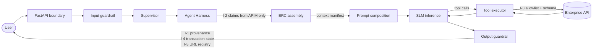

# ADR-D1-02 — The Golden Rule as a binding architectural constraint with named enforcement points

## 1. Summary

The Golden Rule — *enterprise systems decide and execute; the AI platform interprets,
orchestrates, contextualises, explains and communicates* — is adopted as a binding
architectural constraint enforced deterministically in code, not as a principle relied on
through discipline. Every clause maps to a specific enforcement point, and the enforcement is
deterministic rather than model-mediated, per 2. PF-FT-AI-ARCHITECTURE-DETAILED.md §3.3.

## 2. Context and Problem Statement

ADR-D1-01 set the platform's scope. This decision addresses a different question: how the
scope is *held*.

The Golden Rule appears in every specification document and at the head of `CLAUDE.md`. It is
stated as a principle. Principles that govern safety-relevant behaviour and are enforced only
by the good intentions of the people implementing them have a predictable failure pattern:
they hold while the team is small and attentive, and erode under delivery pressure, staff
change, and the accumulation of individually reasonable exceptions.

The specific risk here is not carelessness. It is that the AI platform is built on a model
that is fluent, plausible and confidently wrong under exactly the conditions where its output
matters most. Left unconstrained, a language model asked "is my club eligible to affiliate?"
will answer. It will answer well. It will sometimes answer correctly. And nothing about the
answer will indicate which of those occurred.

2. PF-FT-AI-ARCHITECTURE-DETAILED.md §3.3 states the necessary response directly: security, authorization enforcement,
batching, retry, timeout, idempotency, schema validation and transaction protection must be
deterministic wherever practical, and *the SLM must not be the only enforcement mechanism*.
That sentence is the crux. A guardrail implemented as a prompt instruction — "do not state
eligibility outcomes you have not been given" — is the SLM enforcing a rule on itself. It
raises the cost of a violation without making one impossible.

Three failure modes need enforcement:

- **The model asserts business truth it was not given.** A hallucinated eligibility result,
  a guessed fee, an invented application status.
- **The model's output becomes an authorization decision.** The platform acts on the model's
  judgement about what a user may do, rather than on validated claims.
- **The model reports an unconfirmed transaction as confirmed.** The affiliation flow's
  Scenarios 21–27 are payment-failure cases where the outcome is genuinely uncertain. A model
  that resolves that uncertainty optimistically produces a user who believes they have paid.

None is prevented by stating the rule more often.

## 3. Decision Drivers

### 3.1 Functional drivers

| ID | Driver | Source |
|---|---|---|
| DR-F-01 | No business outcome may reach a user unless it originated from an enterprise response or event | 3. PF-FT-AI-RESPONSIBILITY-MATRIX.md §63; 1 PF-FT-AI-ARCHITECTURE.md §2.3 |
| DR-F-02 | No model output may function as an authorization decision | 2. PF-FT-AI-ARCHITECTURE-DETAILED.md §48 (SLM-controlled authorization) |
| DR-F-03 | Critical controls must be deterministic, with the SLM never the sole enforcement | 2. PF-FT-AI-ARCHITECTURE-DETAILED.md §3.3 |
| DR-F-04 | Tool access must be governed, never open | 2. PF-FT-AI-ARCHITECTURE-DETAILED.md §3.4 |
| DR-F-05 | An unconfirmed transaction must never be communicated as confirmed | `CLAUDE.md` §Adam persona rule 6; affiliation flow Scenarios 21–27 |

### 3.2 Non-functional drivers

| ID | Driver | Target | Source |
|---|---|---|---|
| DR-N-01 | Enforcement must not depend on prompt compliance | 100% of business-truth checks implemented outside the model | 2. PF-FT-AI-ARCHITECTURE-DETAILED.md §3.3 |
| DR-N-02 | A violation must be detectable, not merely improbable | Every violation class has a detecting control | 20.PF-FT-AI-GOVERNANCE.md §29 |
| DR-N-03 | Enforcement latency must fit the conversational budget | ≤50 ms added per output guardrail pass | ADR-D5-18 |

### 3.3 Constraints

| ID | Constraint | Type | Source |
|---|---|---|---|
| DR-C-01 | The SLM must not be the only enforcement mechanism for any critical control | Platform | 2. PF-FT-AI-ARCHITECTURE-DETAILED.md §3.3 |
| DR-C-02 | The AI platform never authenticates or authorizes; it consumes validated claims | Platform | 1 PF-FT-AI-ARCHITECTURE.md §2.1; `CLAUDE.md` |
| DR-C-03 | Model output is never an authoritative data source | Platform | 3. PF-FT-AI-RESPONSIBILITY-MATRIX.md §63 |
| DR-C-04 | The nine prohibitions of 1 PF-FT-AI-ARCHITECTURE.md §2.3 are binding | Organisational | ADR-D1-01 §7.3 |

### 3.4 Assumptions

| ID | Assumption | If false | Validation |
|---|---|---|---|
| DR-A-01 | Business assertions in output can be reliably distinguished from conversational language by a deterministic check | Enforcement becomes probabilistic and needs a model-based classifier as a second layer, never a first | Guardrail evaluation suite; QM-02 |
| DR-A-02 | Grounding every business claim in an ERC section or tool result is achievable without crippling fluency | The persona degrades into stilted citation; the check moves to sampling rather than blocking | Persona evaluation per ADR-D1-09 |

## 4. Evaluation Criteria and Weights

| ID | Criterion | Weight | Rationale | Measurement |
|---|---|---|---|---|
| EC-01 | Strength of guarantee | 35 | The rule's purpose is preventing a class of harm, not reducing its frequency; a probabilistic guarantee on a safeguarding answer is not a guarantee | Can a violation occur if the model behaves adversarially? |
| EC-02 | Detectability of violations | 25 | Undetected violations are worse than detected ones, because they are believed | Is every violation class observable? |
| EC-03 | Conversational quality retained | 20 | Enforcement that destroys the experience will be relaxed, defeating itself | Persona evaluation scores under enforcement |
| EC-04 | Implementation and runtime cost | 12 | Real but subordinate | Effort and per-turn latency |
| EC-05 | Maintainability as workflows grow | 8 | Enforcement must not need rewriting per agent | Effort to add a workflow |
| | **Total** | **100** | | |

Scoring scale: **1** unacceptable · **2** poor · **3** adequate · **4** good · **5** excellent.

EC-01 at 35 is the highest weight assigned anywhere in this library. It is justified by
DR-C-01: 2. PF-FT-AI-ARCHITECTURE-DETAILED.md §3.3 does not present determinism as preferable, it presents SLM-only
enforcement as unacceptable. A criterion reflecting a stated prohibition dominates criteria
reflecting preferences.

## 5. Alternatives Considered

### 5.1 Option A — Prompt-level enforcement

**Description.** The Golden Rule is expressed in the system prompt. The model is instructed
never to assert unsourced business outcomes, never to authorise, never to confirm unconfirmed
transactions.

**Strengths.**
- Trivial to implement and to change.
- Zero runtime cost.
- Preserves conversational fluency completely — the model incorporates the rule naturally.
- Scales to any number of workflows at no cost.

**Weaknesses.**
- Violates DR-C-01 directly: this is the SLM as sole enforcement mechanism, which 2. PF-FT-AI-ARCHITECTURE-DETAILED.md §3.3
  prohibits in terms.
- Provides no guarantee. Prompt instructions are probabilistic and degrade under injection,
  long context, unusual phrasing and ordinary sampling variance.
- Violations are undetectable — nothing outside the model examines what the model produced.
- The failure is silent and confident, which is the worst combination for a safeguarding or
  payment answer.

**Cost / effort.** Negligible.

### 5.2 Option B — Deterministic enforcement at architectural boundaries

**Description.** The rule is decomposed into checkable invariants, each enforced in code at a
specific boundary: tool allowlisting before execution, claims validation before authorization,
provenance checking of business assertions before output, transaction-state verification
before any success statement. The prompt states the rule as well, as defence in depth, but no
control depends on it.

**Strengths.**
- Satisfies DR-C-01: every critical control is deterministic and the SLM is never the sole
  mechanism.
- Guarantees hold under adversarial model behaviour, because the check sits outside the model.
- Every violation attempt is observable and loggable — it becomes a guardrail rejection event
  rather than a silent output.
- Enforcement lives at boundaries shared by all agents, so it does not multiply per workflow.

**Weaknesses.**
- Substantial machinery: guardrail pipeline, provenance tracking through context assembly,
  tool registry, transaction-state model.
- Provenance checking constrains generation — the model must produce output whose business
  claims are traceable, which is a real design burden on the prompt layer.
- False positives block legitimate responses and are visible to users as failures.
- Adds latency to every turn.

**Cost / effort.** High build; modest per-turn runtime cost.

### 5.3 Option C — Post-hoc detection and monitoring

**Description.** Output is generated freely and audited afterwards. Violations are detected in
traces, alerted on, and corrected through prompt and model improvement.

**Strengths.**
- No latency impact on the user path.
- No false positives blocking legitimate responses.
- Produces excellent data about actual failure modes.
- Simple to build relative to Option B.

**Weaknesses.**
- Detects violations after the user has seen them. For a payment confirmation or a DBS
  clearance answer, the harm is done at the moment of display.
- Provides no guarantee at all (EC-01 fails).
- Correction loop runs at the speed of prompt iteration — days — against a failure that
  recurs per conversation.

**Cost / effort.** Low to moderate.

### 5.4 Option D — Deterministic enforcement plus a model-based secondary classifier

**Description.** Option B, with an additional model-based check on residual cases the
deterministic layer cannot classify — ambiguous phrasings, implicit assertions.

**Strengths.**
- All of Option B's guarantees on the deterministic layer.
- Catches subtler violations that pattern-based checks miss, addressing DR-A-01's risk.
- The secondary layer is advisory, so it never weakens the primary guarantee.

**Weaknesses.**
- A second model call per turn: latency and cost, on every conversation.
- The classifier is itself fallible and needs its own evaluation and versioning.
- Risk of the deterministic layer being weakened over time on the assumption the classifier
  will catch what it misses — which would quietly return the platform to Option A.

**Cost / effort.** Option B plus a per-turn inference cost.

## 6. Evaluation Method and Decision Matrix

**Method.** Weighted scoring against §4. EC-01 is assessed against DR-C-01's prohibition
rather than against observed failure rates, since the constraint is categorical. EC-03 is
assessed against the persona expectations in `CLAUDE.md` and the `SampleWorkflowchat.md`
reference.

| Criterion | Weight | A: Prompt | B: Deterministic | C: Post-hoc | D: Deterministic + classifier |
|---|---|---|---|---|---|
| EC-01 Strength of guarantee | 35 | 1 | 5 | 1 | 5 |
| EC-02 Detectability | 25 | 1 | 5 | 4 | 5 |
| EC-03 Conversational quality | 20 | 5 | 3 | 5 | 3 |
| EC-04 Cost | 12 | 5 | 3 | 4 | 2 |
| EC-05 Maintainability | 8 | 5 | 4 | 4 | 3 |
| **Weighted total** | **100** | **220** | **425** | **270** | **418** |

- **Option B:** (35×5) + (25×5) + (20×3) + (12×3) + (8×4) = 175 + 125 + 60 + 36 + 32 = **425**
- **Option D:** (35×5) + (25×5) + (20×3) + (12×2) + (8×3) = 175 + 125 + 60 + 24 + 24 = **418**

**Sensitivity.** B and D separate by 7 points, entirely on cost and maintainability — they
are identical on the three criteria that matter most. The choice between them is therefore
not made by the matrix but by DR-A-01: if deterministic classification of business assertions
proves reliable, B suffices and D's per-turn inference cost buys nothing. If it does not, D
becomes necessary. B is adopted with D held as the documented response should QM-02 show the
deterministic layer missing violations. A and C are eliminated by DR-C-01 and by EC-01
respectively, and no reweighting rescues either: both score 1 on a criterion carrying 35
points, reflecting a stated prohibition.

## 7. Decision

The Golden Rule is enforced **deterministically at architectural boundaries**. The prompt
layer also states it, as defence in depth, but no control depends on the model observing it.

### 7.1 Decomposition into enforceable invariants

The rule is not enforceable as a sentence. It is decomposed into six invariants, each checked
in code at a named boundary:

| # | Invariant | Boundary | Mechanism | ADR |
|---|---|---|---|---|
| **I-1** | Every business assertion in output traces to an ERC section, tool result or event | Output guardrail | Provenance check against the turn's context manifest; unsourced assertions block the response | ADR-D6-09 |
| **I-2** | No model output influences an authorization outcome | Harness, before tool execution | Authorization derives from APIM claims only; the claims object is not model-writable | ADR-D6-02, ADR-D6-03 |
| **I-3** | Only allowlisted tools execute, with schema-valid parameters | Tool executor | Per-agent allowlist; Pydantic validation of every parameter before dispatch | ADR-D6-10 |
| **I-4** | No success is stated for an unconfirmed transaction | Output guardrail | Transaction-state check: success language requires a confirmed enterprise state | ADR-D3-08 |
| **I-5** | No URL is emitted that did not come from the portal link registry | Output guardrail | URL extraction and registry membership check | ADR-D2-19 |
| **I-6** | No business rule is evaluated inside the platform | Build time | Architecture-fitness test over `src/pf_ft_ai/domain/`; dependency scan | ADR-D2-01 |

I-1 to I-5 are runtime checks. I-6 is a build-time check, because a rule implementation is a
property of the code, not of a turn.

### 7.2 Enforcement is fail-closed

A guardrail that cannot complete its check blocks the response. It does not pass it through
with a warning. The rationale is asymmetric cost: a blocked response is a visible degradation
the user can act on; an unchecked response asserting an unverified safeguarding or payment
outcome is an invisible failure the user cannot detect. ADR-D6-09 carries the detail.

### 7.3 The prompt layer states the rule but does not enforce it

The system prompt expresses the rule so the model cooperates with the constraint rather than
fighting it — a model that understands why it must ground its claims produces better output
than one blocked repeatedly. But the prompt is defence in depth. Removing it should degrade
quality, not safety. Any control whose removal from the prompt would create a safety gap is,
by definition, an SLM-only control and violates DR-C-01.

### 7.4 What the rule permits

The rule is frequently read as purely restrictive. It is not, and reading it that way produces
an unnecessarily timid platform. Within the boundary, the AI has full authority over:
interpreting what the user means; deciding which workflow applies; deciding what context to
gather and in what order; deciding how to explain an outcome; deciding what to ask next; and
deciding when to hand off. 3. PF-FT-AI-RESPONSIBILITY-MATRIX.md §46 marks these as **authoritative AI decisions** in the same
matrix that marks eligibility and payment as authoritative enterprise decisions. The rule
partitions authority; it does not subordinate one side to the other in everything.

**Status rationale.** Accepted. Tier 1 under ADR-D0-03 §7.1 — it concerns system boundaries
and security — ratified by the external ADF/ADR governance forum.

## 8. Architecture Detail

### 8.1 Enforcement points in the request path

The context manifest produced during ERC assembly is what makes I-1 checkable: it records
which facts entered the turn and from which source, so the output check is a set-membership
test rather than an interpretation.

### 8.2 Worked example — affiliation Scenario 23

The affiliation flow's Scenario 23 is *paid offline but invoice still unpaid in Xero* —
application COMPLETE, reconciliation at risk. It exercises four invariants at once.

A user asks whether their payment went through. Without enforcement, the model has an
application status of COMPLETE in context and will report success, which is the answer the
user wants and is not reliably true — the invoice is unreconciled.

With enforcement:

- **I-1** requires the payment claim to trace to a source. The context carries an application
  status, not a payment confirmation; they are different facts.
- **I-4** blocks success language because the transaction state is not `confirmed`.
- The response reports what is actually known — the application is complete, the payment is
  recorded as offline, reconciliation is outstanding — and states what happens next.
- **I-5** ensures any link to the payments page comes from the registry.

The persona still carries this in Adam's voice. What it cannot do is convert uncertainty into
a goal celebration, which `CLAUDE.md` persona rule 6 also prohibits and which I-4 makes
structurally impossible rather than merely discouraged.

### 8.3 Relationship to the authoritative-truth precedence chain

This ADR governs *whether* an assertion may be made. ADR-D1-03 governs *which source wins*
when two sources disagree. They compose: I-1 establishes that a claim has a source; the
precedence chain establishes which source to believe. Neither substitutes for the other.

## 9. Consequences

### 9.1 Positive

- The rule holds under adversarial model behaviour, prompt injection and sampling variance,
  because no runtime control depends on the model.
- Every violation attempt becomes an observable guardrail event rather than a silent output,
  which turns the rule into something measurable.
- The prompt layer can be tuned freely for quality without any risk of weakening safety.
- Six named invariants give reviewers something concrete to check, replacing a judgement call
  about whether a change "respects the Golden Rule".

### 9.2 Negative

- Real machinery, and it is on the critical path: provenance tracking, context manifests, a
  guardrail pipeline, transaction-state modelling.
- False positives block legitimate responses. A correct answer phrased unusually may fail the
  provenance check and produce a visible failure.
- Provenance constrains the prompt layer: output must be generated so that business claims
  are traceable, which limits some natural phrasings.
- Per-turn latency, bounded by DR-N-03 at 50 ms but non-zero.

### 9.3 Neutral

- The prompt still states the rule; the change is that nothing depends on it doing so.
- I-6 is a build-time check, so it constrains the codebase rather than the conversation.

### 9.4 Trade-offs explicitly accepted

| Given up | In exchange for | Accepted by |
|---|---|---|
| Some conversational latitude and fluency | A guarantee rather than a probability on business truth | AI Product Owner |
| Simplicity of prompt-based control | Conformance with 2. PF-FT-AI-ARCHITECTURE-DETAILED.md §3.3's prohibition on SLM-only enforcement | External ADF/ADR forum |
| Some legitimate responses blocked by false positives | No unsourced business assertion reaching a user | Business Owner |
| ~50 ms per turn | Every violation detectable | AI Engineering Lead |

## 10. Golden-Rule and Precedence Conformance

| Constraint | Conformance |
|---|---|
| Enterprise decides; AI orchestrates | This ADR is the enforcement mechanism for that rule. §7.1's six invariants are the rule expressed as checkable conditions. |
| Authoritative-truth precedence | I-1 requires every business assertion to name a source, which is the precondition for applying the precedence chain. ADR-D1-03 carries the ordering. |
| Four-state separation | Supported: I-1 prevents Workflow/Agent State from being presented as Enterprise Business State, which is the most likely conflation in practice. |
| Versioned artefacts, never mutated in place | Guardrail configuration and prompt layers are versioned per ADR-D5-06; an enforcement change is a release, not an edit. |
| Adam persona governs how, never what | Enforced structurally. The persona operates on content that has already passed I-1 and I-4, so it can change the wording of a confirmed outcome but cannot manufacture one. |

## 11. Risks and Mitigations

| ID | Risk | Likelihood | Impact | Exposure | Mitigation | Owner | Residual |
|---|---|---|---|---|---|---|---|
| RSK-01 | Deterministic provenance checking misses implicit or paraphrased business assertions (DR-A-01) | Medium | High | High | Guardrail evaluation suite with adversarial phrasings; QM-02 tracks escapes; Option D classifier is the documented response if QM-02 breaches | Security Owner | Medium |
| RSK-02 | False-positive rate makes the platform feel unreliable and creates pressure to relax I-1 | Medium | Medium | Medium | Tuned against the golden dataset; QM-03 caps false positives at 2%; relaxation requires a superseding ADR, not a config change | AI Product Owner | Medium |
| RSK-03 | Enforcement weakened incrementally through configuration rather than decision | Low | High | Medium | Guardrail configuration is versioned and release-gated per ADR-D6-15; QM-04 audits fail-open occurrences | Security Owner | Low |
| RSK-04 | Latency budget breached by guardrail passes on complex turns | Low | Medium | Low | DR-N-03 budget; checks are pattern and set-membership operations, not inference | AI Engineering Lead | Low |
| RSK-05 | I-6 architecture-fitness test becomes a formality that passes while rules creep into agent code | Medium | High | High | Test asserts on imports and on rule-shaped constructs; code review checks agent logic for branching on business conditions; QM-05 | AI Engineering Lead | Medium |

## 12. Quantitative Targets and Measures

| ID | Measure | Target | Threshold (alert) | Source | Review cadence |
|---|---|---|---|---|---|
| QM-01 | Guardrail rejections by invariant (I-1 … I-5) | Tracked | Sudden change >3× baseline | Langfuse guardrail events | Weekly |
| QM-02 | Unsourced business assertions reaching a user, found by trace audit | 0 | ≥1 | Sampled trace audit, 100 conversations per week | Weekly |
| QM-03 | False-positive guardrail rejections | ≤2% of turns | >5% | Golden dataset evaluation; user-reported failures | Weekly |
| QM-04 | Fail-open occurrences (guardrail unable to complete, response passed) | 0 | ≥1 | Guardrail error logs | Daily |
| QM-05 | Business-rule evaluation constructs found in agent or domain code | 0 | ≥1 | Architecture-fitness test; code review | Per build |
| QM-06 | Success language emitted for an unconfirmed transaction | 0 | ≥1 | I-4 audit against enterprise transaction states | Weekly |

QM-02, QM-04, QM-05 and QM-06 all carry zero thresholds. Each represents a categorical
failure of the constraint rather than a metric to optimise, and a single occurrence is a
governance incident under 20.PF-FT-AI-GOVERNANCE.md §105.

## 13. Security, Privacy and Compliance Impact

| Dimension | Impact |
|---|---|
| Attack surface change | Materially reduced. I-2 means a successful prompt injection cannot escalate privilege, because authorization never reads model output. I-3 means it cannot reach an unapproved tool. I-5 means it cannot emit an attacker-supplied URL. |
| Data classification touched | All classifications pass through the enforcement points; the guardrail sees context and output in full. |
| Personal data / PII | Guardrail processing is in-memory and transient. Rejection events log the invariant breached and a redacted excerpt, never the full context — per ADR-D7-04. |
| Children's data and safeguarding | Central. I-1 makes it structurally impossible for the platform to state a DBS or safeguarding outcome it was not given by the enterprise. Affiliation Phase 1's youth-team CRC checks are exactly this case. A model-only control would reduce the frequency of a wrong safeguarding answer; I-1 removes the possibility. |
| UK GDPR lawful basis and rights impact | Supports accuracy (Art. 5(1)(d)) by preventing the platform from asserting personal data it does not hold, and supports Art. 22 by ensuring no decision about a person originates from the model. |
| Audit and evidential requirements | Every enforcement decision is a logged event, giving positive evidence that the control operated, not merely that it existed. Supports 20.PF-FT-AI-GOVERNANCE.md §30 and §99. |
| Standards touched | ISO/IEC 42001 (AI system controls and human oversight); ISO/IEC 27001 A.8.28 (secure coding), A.5.15 (access control); NIST AI RMF MEASURE 2.5, MANAGE 2.2; EU AI Act Art. 14 (human oversight) — deterministic enforcement is what makes oversight meaningful rather than nominal. |

## 14. Implementation Impact

| Aspect | Detail |
|---|---|
| Build phases | 0 (principle), 4 (harness enforcement points), 11 (guardrail pipeline), 23 (affiliation E2E validation) |
| Repository paths | `src/pf_ft_ai/guardrails/`, `src/pf_ft_ai/orchestration/harness/`, `src/pf_ft_ai/context/projection/` (context manifest) |
| Configuration | `config/base/guardrails.yaml` — versioned, release-gated |
| Contracts / schemas | Context manifest schema; guardrail decision event schema; tool parameter schemas |
| Migration | None; foundational |
| Dependencies on other ADRs | ADR-D1-01 (scope), ADR-D1-03 (precedence chain that I-1's sources are ranked by) |
| Effort estimate | Large — the guardrail pipeline and context manifest are substantial components in their own right |

## 15. Validation and Verification

| ID | Acceptance criterion | Verification method |
|---|---|---|
| AC-01 | An output containing a business assertion with no matching context-manifest entry is blocked | Guardrail unit and integration tests with synthesised unsourced claims |
| AC-02 | Authorization outcome is unchanged when model output is manipulated | Adversarial test: injected output attempting privilege escalation leaves claims unchanged |
| AC-03 | A tool call outside the agent's allowlist is rejected before dispatch | Tool executor test |
| AC-04 | Success language is blocked when transaction state is not confirmed | Scenario-23 test from the affiliation flow |
| AC-05 | A URL not present in the portal registry is stripped or blocked | Portal link guardrail test |
| AC-06 | No business-rule evaluation exists in `src/pf_ft_ai/domain/` or `src/pf_ft_ai/agents/` | Architecture-fitness test in CI |
| AC-07 | Removing the Golden Rule text from the system prompt degrades quality but breaks no safety test | Prompt-ablation test in the evaluation suite — the direct test of DR-C-01 |

AC-07 is the definitive check that Option A was genuinely rejected. If any safety test fails
when the prompt text is removed, that control is SLM-only and must be reimplemented.

## 16. Operational Impact

| Aspect | Detail |
|---|---|
| Monitoring | Guardrail decisions traced per turn in Langfuse, broken down by invariant |
| Alerting | QM-02, QM-04, QM-05 and QM-06 alert on any occurrence as governance incidents |
| Runbook | `docs/runbooks/guardrail.md`; `docs/runbooks/prompt-injection-incident.md` |
| Failure mode and degradation | Fail-closed per §7.2. When a check cannot complete, the response is blocked and the user is told the platform cannot confirm the answer — degraded but honest. |
| Rollback | Enforcement cannot be disabled by configuration. Weakening any invariant requires a superseding ADR ratified at tier 1. |
| Support model impact | Guardrail rejections appearing to users as failures route to AI support with the invariant ID, which makes triage immediate. |

## 17. Cost Impact

| Cost element | One-off | Recurring | Basis |
|---|---|---|---|
| Guardrail pipeline and context manifest | Phase 11 plus part of Phase 5 | — | `DEVELOPMENT-GUIDE.md` §4 |
| Per-turn enforcement latency | — | ≤50 ms per turn | DR-N-03; pattern and set-membership checks, no inference |
| Guardrail evaluation suite maintenance | — | ~0.5 day per quarter | Adversarial dataset refresh |
| Avoided cost | — | Ongoing | One wrong safeguarding or payment answer reaching a club carries remediation, reputational and potentially regulatory cost far exceeding the above |

## 18. Revisit Triggers and Causal Analysis Hooks

| ID | Trigger | Detected by | Action on trigger |
|---|---|---|---|
| RT-01 | QM-02 records any unsourced business assertion reaching a user | Weekly trace audit | Governance incident; causal analysis; adopt Option D's secondary classifier if the escape was a classification miss |
| RT-02 | QM-03 exceeds 5% false positives | Weekly evaluation | Tune the provenance check; do not relax I-1 — a superseding ADR would be required |
| RT-03 | QM-04 records any fail-open | Daily log review | Immediate incident; fail-closed is not negotiable |
| RT-04 | AC-07 ablation test fails | CI | A control has become SLM-only; DR-C-01 breached; reimplement deterministically |
| RT-05 | 2. PF-FT-AI-ARCHITECTURE-DETAILED.md §3.3 amended | Change notice | Re-evaluate the determinism requirement |
| RT-06 | A new workflow introduces an assertion class the six invariants do not cover | Agent onboarding review | Extend §7.1; adding an invariant is a minor version bump, weakening one is a supersession |

**Scheduled review:** 2027-08-21, or on any trigger above.

## 19. Traceability

| Dimension | Reference |
|---|---|
| Workshop sheet | WS-01 Executive Summary; WS-02 Business Vision, Problem Statement & Objectives |
| Specification sections | 1 PF-FT-AI-ARCHITECTURE.md §1 (Purpose — the rule as stated), §2.3 (Explicit non-goals); 2. PF-FT-AI-ARCHITECTURE-DETAILED.md §3.1 (Enterprise Authority), §3.2 (AI Orchestration), §3.3 (Deterministic Control), §3.4 (Controlled Tool Access), §48 (Anti-Patterns); 3. PF-FT-AI-RESPONSIBILITY-MATRIX.md §2 (Core Responsibility Principle), §46 (Decision Authority Matrix), §63 (Ownership of Authoritative Truth), §71 (Final Boundary Statement); affiliation flow Scenarios 21–27 |
| Requirement IDs | Per ADR-D1-12 |
| Build phases | 0, 4, 11, 23 |
| Code paths | `src/pf_ft_ai/guardrails/`, `src/pf_ft_ai/orchestration/harness/`, `src/pf_ft_ai/context/projection/` |
| Configuration | `config/base/guardrails.yaml` |
| Tests | AC-01 to AC-07; guardrail evaluation suite; prompt-ablation test |
| Upstream ADRs | ADR-D1-01 |
| Downstream ADRs | ADR-D1-03, ADR-D2-09, ADR-D3-08, ADR-D6-02, ADR-D6-09, ADR-D6-10, ADR-D2-19 |

## 20. Change Log

| Version | Date | Author | Change |
|---|---|---|---|
| 1.0.0 | 2026-08-21 | AI Solution Architect | Initial decision recorded. Golden Rule decomposed into six deterministically enforced invariants; prompt-level enforcement rejected under 2. PF-FT-AI-ARCHITECTURE-DETAILED.md §3.3. Tier 1 — ratified by the external ADF/ADR forum. |
