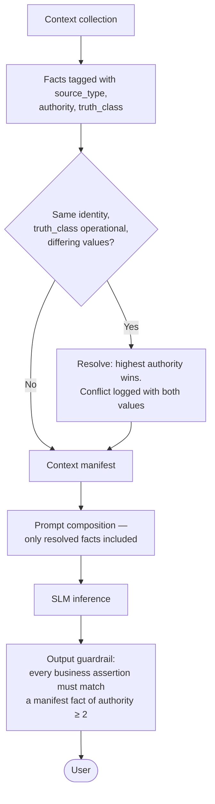

# ADR-D1-03 — Authoritative-truth precedence chain for resolving source conflicts

## 1. Summary

When two sources of information disagree about operational or business truth, the ordering
**Enterprise API / Enterprise Event > ERC > Cache > RAG > SLM output** decides, without
exception. The chain is implemented as a property carried on every fact in context, not as a
convention observed by developers, and it applies only to operational truth — it says nothing
about which source is better for knowledge or explanation.

## 2. Context and Problem Statement

The platform assembles a single conversational turn from five kinds of source. A live
enterprise API response. An event that arrived on the Service Bus. The Enterprise Runtime
Context assembled earlier in the conversation. A cache entry from minutes ago. A retrieved
knowledge passage. And the model's own output, which is fluent and carries no inherent
marker distinguishing recall from invention.

These sources disagree routinely, and not because anything is broken. Disagreement is the
normal condition of a distributed system observed at different moments:

- ERC was assembled at the start of the conversation. A CFA officer approved the application
  ninety seconds ago. ERC says PENDING CFA; a fresh API call says INVOICED.
- A cached club record is four minutes old. A team folded three minutes ago. The cache shows
  eleven teams; the enterprise holds ten.
- A knowledge document describes the affiliation fee structure as it was published. The
  county changed its products for this season. RAG describes last season; the API knows this
  season.
- The model, asked about a specific club's debt position, produces a plausible figure that
  matches the shape of the data it has seen and belongs to no club at all.

Without a stated ordering, each of these resolves by accident — by whichever value the
prompt-assembly code happened to place last, by which section the model attended to, by
whether a cache lookup preceded or followed an API call. The resolution is arbitrary and
varies between turns.

3. PF-FT-AI-RESPONSIBILITY-MATRIX.md §63 states the ordering. 3. PF-FT-AI-RESPONSIBILITY-MATRIX.md §47 gives five conflict-resolution rules covering the
specific cases. 8 PF-FT-AI-ERC-CONTEXT.md §19 defines ERC authority levels. What none of them records is why this
particular ordering, what it costs, and — most importantly — how it is enforced. An ordering
that exists only in documentation resolves nothing at runtime, because at runtime a fact is
just a value in a dictionary with no memory of where it came from.

There is also a scoping question the specifications address but easily gets lost. 2. PF-FT-AI-ARCHITECTURE-DETAILED.md §3.6
distinguishes knowledge from operational truth: RAG provides knowledge, enterprise APIs
provide operational truth, and the two must remain distinguishable. Read carelessly, the
precedence chain says RAG outranks the SLM and is outranked by everything else, which sounds
like a quality judgement about RAG. It is not. For "what does the county's safeguarding policy
say?", RAG is the *best* source and the enterprise API has nothing to offer. The chain orders
sources for operational truth only.

## 3. Decision Drivers

### 3.1 Functional drivers

| ID | Driver | Source |
|---|---|---|
| DR-F-01 | Conflicts between sources must resolve deterministically and identically on every turn | 3. PF-FT-AI-RESPONSIBILITY-MATRIX.md §47 |
| DR-F-02 | Enterprise operational state must win over any AI-held copy | 3. PF-FT-AI-RESPONSIBILITY-MATRIX.md §47 Rule 1, Rule 4 |
| DR-F-03 | Model output must never be treated as an authoritative data source | 3. PF-FT-AI-RESPONSIBILITY-MATRIX.md §63 |
| DR-F-04 | RAG content must never be presented as operational truth | 2. PF-FT-AI-ARCHITECTURE-DETAILED.md §3.6; 8 PF-FT-AI-ERC-CONTEXT.md §7 |
| DR-F-05 | Every fact in context must carry its source, so precedence is computable | 8 PF-FT-AI-ERC-CONTEXT.md §15, §16 (Provenance) |
| DR-F-06 | A human enterprise decision (HIL) outranks any AI suggestion | 3. PF-FT-AI-RESPONSIBILITY-MATRIX.md §47 Rule 5 |

### 3.2 Non-functional drivers

| ID | Driver | Target | Source |
|---|---|---|---|
| DR-N-01 | Precedence resolution must not require an extra enterprise call per turn | 0 additional calls for resolution itself | ADR-D5-18 |
| DR-N-02 | Conflicts must be observable, not silently resolved | 100% of resolved conflicts logged | 20.PF-FT-AI-GOVERNANCE.md §29 |
| DR-N-03 | Freshness of authoritative state must be adequate for the workflow | Per-section freshness policy honoured | 8 PF-FT-AI-ERC-CONTEXT.md §17, §18 |

### 3.3 Constraints

| ID | Constraint | Type | Source |
|---|---|---|---|
| DR-C-01 | The ordering is fixed by specification and is not open for local variation | Organisational | 3. PF-FT-AI-RESPONSIBILITY-MATRIX.md §63; `CLAUDE.md` |
| DR-C-02 | ERC is not the enterprise database, not memory, not cache and not RAG | Platform | 8 PF-FT-AI-ERC-CONTEXT.md §4, §5, §6, §7 |
| DR-C-03 | SLM output is never authoritative under any circumstance | Platform | 3. PF-FT-AI-RESPONSIBILITY-MATRIX.md §63 |
| DR-C-04 | Transaction outcomes may be genuinely uncertain and must not be resolved by inference | Platform | 8 PF-FT-AI-ERC-CONTEXT.md §66 |

### 3.4 Assumptions

| ID | Assumption | If false | Validation |
|---|---|---|---|
| DR-A-01 | Every fact entering context can be attributed to exactly one source | Precedence is uncomputable for unattributed facts; those facts must be excluded from context entirely | Context manifest completeness test |
| DR-A-02 | Aggregated or derived facts can carry the precedence of their weakest input | Derivations need their own rule; §7.4 addresses this | ERC aggregation tests |
| DR-A-03 | Conflict frequency is low enough that logging every one is practical | Logging is sampled instead | QM-01 |

## 4. Evaluation Criteria and Weights

| ID | Criterion | Weight | Rationale | Measurement |
|---|---|---|---|---|
| EC-01 | Correctness of the resolved answer | 35 | The chain exists to prevent a user being told something false about their club's state; nothing else here matters as much | Does the resolution select the source most likely to be currently true? |
| EC-02 | Determinism — same inputs, same resolution | 25 | Non-deterministic resolution is unauditable and untestable | Does resolution depend on ordering, timing or model attention? |
| EC-03 | Enforceability in code | 20 | An ordering nothing enforces is documentation | Is precedence a runtime property or a convention? |
| EC-04 | Latency and call cost | 12 | Always resolving by fresh API call is correct and unaffordable | Additional enterprise calls per turn |
| EC-05 | Explainability to the user | 8 | The user should understand why an answer changed | Can the platform say why it revised a statement? |
| | **Total** | **100** | | |

Scoring scale: **1** unacceptable · **2** poor · **3** adequate · **4** good · **5** excellent.

## 5. Alternatives Considered

### 5.1 Option A — Recency wins: the most recently obtained value

**Description.** Whichever value was fetched or produced most recently is used, regardless of
source.

**Strengths.**
- Simple to implement and to reason about.
- Correct in the common case, since fresher usually is truer.
- Needs no source attribution at all.

**Weaknesses.**
- Ranks SLM output above ERC whenever the model spoke last, which is precisely inverted. A
  hallucinated fee generated a second ago would beat an enterprise-sourced fee from a minute
  ago.
- Treats a freshly retrieved RAG passage as beating an older API response, so last season's
  published fee structure would override this season's actual fee.
- Fails DR-F-03 and DR-F-04 outright.

**Cost / effort.** Minimal.

### 5.2 Option B — Always re-fetch from the enterprise; hold nothing

**Description.** No ERC, no cache. Every fact is fetched live at the moment it is needed, so
no conflict can arise.

**Strengths.**
- Maximum correctness — every answer reflects enterprise state at the moment of answering.
- No conflict resolution needed, because there is only ever one source.
- Trivially satisfies DR-F-02.

**Weaknesses.**
- Latency is unworkable. The affiliation Phase 1 check alone spans officials, safeguarding,
  ground, league membership and debt across several services; doing that per turn puts a
  conversational response into multiple seconds.
- Enterprise API load multiplies by conversational turn count, which the enterprise has not
  sized for.
- Contradicts DR-C-02's premise: ERC exists precisely because assembling context per turn is
  not viable, per 8 PF-FT-AI-ERC-CONTEXT.md §2.
- Still cannot resolve genuinely uncertain transaction outcomes (DR-C-04) — re-fetching an
  ambiguous payment state returns the same ambiguity.

**Cost / effort.** Low to build, unaffordable to run.

### 5.3 Option C — Fixed precedence chain carried as fact-level provenance

**Description.** The specified ordering — Enterprise API/Event > ERC > Cache > RAG > SLM — is
implemented as an authority level attached to every fact at the moment it enters context.
Resolution is a comparison of authority levels, performed deterministically at context
assembly and re-checked at the output guardrail.

**Strengths.**
- Selects the source most likely to be currently true in each conflict, because the ordering
  encodes distance from the system of record (EC-01).
- Fully deterministic: same facts, same levels, same result, independent of timing or model
  attention (EC-02).
- Enforceable, because authority is a property of the datum rather than a rule in someone's
  head (EC-03).
- No additional enterprise calls; resolution is local comparison (EC-04).
- Provenance is available to explain a revision to the user (EC-05).
- Directly implements 3. PF-FT-AI-RESPONSIBILITY-MATRIX.md §63 and 8 PF-FT-AI-ERC-CONTEXT.md §15–§19.

**Weaknesses.**
- Requires provenance plumbing through the whole context pipeline — every collector,
  normaliser and projector must preserve it.
- Aggregated facts need a composition rule (DR-A-02).
- A stale-but-higher-authority fact can beat a fresher lower-authority one, which is
  occasionally wrong; §7.3's freshness interaction handles this.

**Cost / effort.** Moderate; provenance is already required by 8 PF-FT-AI-ERC-CONTEXT.md §15–§16.

### 5.4 Option D — Confidence-weighted resolution

**Description.** Each source carries a confidence score combining authority, freshness and,
for model output, token-level confidence. Resolution selects the highest weighted score.

**Strengths.**
- Nuanced: naturally handles the stale-authoritative versus fresh-cached case.
- Could incorporate freshness without a separate rule.
- Extensible to new sources.

**Weaknesses.**
- Non-deterministic in practice — scores shift with model behaviour, so identical inputs
  can resolve differently (EC-02 fails).
- Permits SLM output to win a conflict if its confidence is high enough, violating DR-C-03
  and 3. PF-FT-AI-RESPONSIBILITY-MATRIX.md §63 categorically. Model confidence is in any case a poor predictor of
  correctness, and is highest precisely when the model is confidently wrong.
- Unauditable: "why did the platform say that?" resolves to a score comparison rather than a
  source.
- Weight tuning becomes a permanent, unfalsifiable maintenance activity.

**Cost / effort.** High, with ongoing tuning.

## 6. Evaluation Method and Decision Matrix

**Method.** Weighted scoring against §4, assessed against the four concrete conflict cases in
§2 and the five rules in 3. PF-FT-AI-RESPONSIBILITY-MATRIX.md §47.

| Criterion | Weight | A: Recency | B: Always re-fetch | C: Fixed chain | D: Confidence-weighted |
|---|---|---|---|---|---|
| EC-01 Correctness | 35 | 2 | 5 | 5 | 3 |
| EC-02 Determinism | 25 | 4 | 5 | 5 | 1 |
| EC-03 Enforceability | 20 | 3 | 5 | 5 | 2 |
| EC-04 Latency and call cost | 12 | 5 | 1 | 5 | 4 |
| EC-05 Explainability | 8 | 2 | 4 | 5 | 2 |
| **Weighted total** | **100** | **306** | **442** | **500** | **250** |

- **Option C:** (35×5) + (25×5) + (20×5) + (12×5) + (8×5) = 175 + 125 + 100 + 60 + 40 = **500**
- **Option B:** (35×5) + (25×5) + (20×5) + (12×1) + (8×4) = 175 + 125 + 100 + 12 + 32 = **442**

**Sensitivity.** C scores maximum on every criterion and cannot be overtaken by any
reweighting — it is a dominant solution here, which is unusual and reflects that the ordering
was already specified and this decision is largely about how to implement it faithfully. B is
correct but unaffordable; its 58-point gap is entirely EC-04, and no realistic reweighting
makes multi-second conversational latency acceptable. D is eliminated by DR-C-03 independent
of score: any scheme permitting SLM output to win a conflict about operational truth is
prohibited, not merely inferior.

## 7. Decision

### 7.1 The ordering

For **operational and business truth**, sources rank:

```
Enterprise API / Enterprise Event   authority 5   system of record, now
            >
ERC                                 authority 4   enterprise-sourced, assembled earlier
            >
Cache                               authority 3   enterprise-sourced, older, may be stale
            >
RAG                                 authority 2   knowledge, never operational state
            >
SLM output                          authority 1   never authoritative under any condition
```

Higher authority wins. Always. There is no threshold, no override and no configuration key
that reverses it.

### 7.2 Scope — what the chain does and does not order

The chain orders sources **for operational and business truth only**: application status,
eligibility, fees, payment state, team affiliation, official compliance, debt.

It does not rank sources for **knowledge**. For "what does the safeguarding policy require?"
or "how does the insurance step work?", RAG is the appropriate source and no enterprise API
competes with it. 2. PF-FT-AI-ARCHITECTURE-DETAILED.md §3.6 requires the two categories to remain distinguishable, and the
distinction is made at context assembly: a fact is tagged either `operational` or `knowledge`,
and only `operational` facts are subject to the chain.

Nor does it rank sources for **language**. The SLM generates every word the user reads. Its
authority level of 1 means it may not *originate* a business fact; it says nothing about its
role in expressing one.

### 7.3 Interaction with freshness

Authority and freshness are independent properties and are both required. Authority decides
who wins a conflict. Freshness decides whether a fact may be used at all.

An ERC section past its freshness policy (8 PF-FT-AI-ERC-CONTEXT.md §17–§18) is not demoted to cache authority —
it is **invalidated** and must be refreshed before use. This is the correct handling of the
stale-but-authoritative case that Option D tried to solve by scoring: a stale enterprise fact
does not lose to a fresh cached one, it is simply not used, and the platform refetches.

Where refresh is impossible (enterprise API unavailable), the platform states that it cannot
confirm current state. It does not fall back to the lower-authority value and present it as
current. 3. PF-FT-AI-RESPONSIBILITY-MATRIX.md §50 governs API-failure responsibility; ADR-D3-08 governs the wording.

### 7.4 Aggregated and derived facts

A fact derived from several inputs carries the authority of its **weakest** input. A total fee
computed from an API-sourced team fee and a cached club fee has authority 3, not 5. This is
conservative by design: a derivation cannot be more trustworthy than the least trustworthy
thing it was derived from, and the alternative — taking the strongest input's authority —
would launder cached data into apparent authority. This resolves DR-A-02.

### 7.5 3. PF-FT-AI-RESPONSIBILITY-MATRIX.md §47's five rules as instances

The five conflict rules in 3. PF-FT-AI-RESPONSIBILITY-MATRIX.md §47 are consequences of §7.1, not separate rules:

| 3. PF-FT-AI-RESPONSIBILITY-MATRIX.md §47 rule | Instance of |
|---|---|
| Rule 1 — ERC vs Enterprise API → API wins | authority 5 > 4 |
| Rule 2 — AI assumption vs APIM claims → claims win | authority 5 > 1; also I-2 of ADR-D1-02 |
| Rule 3 — SLM reasoning vs enterprise rule result → enterprise wins | authority 5 > 1 |
| Rule 4 — Cache vs current enterprise response → enterprise wins | authority 5 > 3 |
| Rule 5 — AI suggestion vs HIL decision → HIL wins | HIL decisions arrive as enterprise events, authority 5 > 1 |

Recording them as instances rather than as five independent rules matters: it means a sixth
conflict type not enumerated in §47 still resolves correctly, without needing a new rule.

### 7.6 Transaction uncertainty is not a conflict

8 PF-FT-AI-ERC-CONTEXT.md §66 identifies a distinct case: a transaction whose outcome is genuinely unknown —
affiliation Scenarios 21–27. This is not a disagreement between sources to be resolved by
precedence. It is an absence of authoritative information, and the chain must not be used to
manufacture an answer from a lower-authority source. The platform states the uncertainty.
ADR-D3-08 carries this.

**Status rationale.** Accepted. Tier 1 under ADR-D0-03 §7.1 — data ownership and system
boundaries — ratified by the external ADF/ADR governance forum.

## 8. Architecture Detail

### 8.1 Authority as a fact-level property

Every fact entering context carries provenance, per 8 PF-FT-AI-ERC-CONTEXT.md §15–§16:

```
ContextFact
  value            the datum
  source_type      enterprise_api | enterprise_event | erc | cache | rag | slm
  authority        5 | 5 | 4 | 3 | 2 | 1
  truth_class      operational | knowledge
  collected_at     timestamp
  freshness_policy the section's policy, per 8 PF-FT-AI-ERC-CONTEXT.md §18
  source_ref       API operation, event ID, ERC section, cache key or document ID
```

Precedence is then a comparison of `authority` among facts with the same identity and
`truth_class: operational`. No interpretation is involved, which is what makes it deterministic.

### 8.2 Resolution points



Two enforcement points, deliberately. Resolution at assembly ensures the model never sees a
contradiction to reason about. Re-checking at output ensures the model did not introduce an
unsourced fact of its own — which is invariant I-1 of ADR-D1-02, and is why the two decisions
compose rather than overlap.

### 8.3 Worked example — the CFA approval race

ERC assembled at 09:14:02 holds `application.status = PENDING CFA` (authority 4). The user
asks at 09:15:30 whether there is any news. The agent's freshness policy for the application
section is 60 seconds; ERC is 88 seconds old, so §7.3 invalidates it and triggers a refresh.
The API returns `INVOICED` (authority 5).

- Refresh replaces the section; no conflict reaches the model.
- Had refresh been impossible, the platform would state that it cannot confirm the current
  status — not report PENDING CFA as current.
- Had both values somehow entered context together, authority 5 would win and the conflict
  would be logged for QM-01.

The user is told the application is now invoiced and what to pay. The chain's contribution is
that this is the only possible outcome, not the likely one.

## 9. Consequences

### 9.1 Positive

- Conflicts resolve identically every time, which makes the platform's answers testable.
- SLM output can never win a conflict about business state, satisfying DR-C-03 structurally.
- RAG cannot leak into operational answers, satisfying 2. PF-FT-AI-ARCHITECTURE-DETAILED.md §3.6.
- 3. PF-FT-AI-RESPONSIBILITY-MATRIX.md §47's five rules become derivable rather than enumerated, so unforeseen conflict
  types resolve correctly.
- Provenance enables the platform to explain a revised answer, rather than appearing to
  contradict itself.

### 9.2 Negative

- Provenance must be preserved through every stage of context assembly. A single collector or
  normaliser that drops it creates facts that cannot participate in precedence — which is why
  DR-A-01 requires unattributed facts to be excluded entirely rather than defaulted.
- §7.4's weakest-input rule is conservative and will sometimes demote a derived fact that was
  in truth reliable, causing an unnecessary refresh.
- Freshness invalidation means the platform sometimes says "I cannot confirm" where a
  slightly stale answer would have been correct. That is the intended trade.

### 9.3 Neutral

- The ordering itself was fixed by 3. PF-FT-AI-RESPONSIBILITY-MATRIX.md §63; this decision concerns its implementation and
  scoping, and records the rationale the specification omitted.
- Knowledge-class facts sit outside the chain entirely, which is a scoping clarification
  rather than a change.

### 9.4 Trade-offs explicitly accepted

| Given up | In exchange for | Accepted by |
|---|---|---|
| Occasionally usable stale answers | Never presenting stale state as current | Business Owner |
| Simplicity of an untyped context dictionary | Computable, enforceable precedence | AI Engineering Lead |
| Nuance of confidence weighting | Determinism and auditability | External ADF/ADR forum |
| Some derived facts demoted unnecessarily | No laundering of cached data into apparent authority | Data Owner |

## 10. Golden-Rule and Precedence Conformance

| Constraint | Conformance |
|---|---|
| Enterprise decides; AI orchestrates | Upheld: authority 5 is reserved for enterprise sources, and no AI-held source can outrank them. |
| Authoritative-truth precedence | This ADR *is* that constraint, implemented. §7.1 states the ordering; §8.1 makes it a computable property; §8.2 enforces it at two points. |
| Four-state separation | Supported: `truth_class` and `source_type` prevent Workflow/Agent State or memory being presented as Enterprise Business State. |
| Versioned artefacts, never mutated in place | Freshness policies and authority mappings live in versioned configuration per ADR-D5-06. |
| Adam persona governs how, never what | Enforced: the persona shapes expression of a resolved fact and cannot alter its authority or value. |

## 11. Risks and Mitigations

| ID | Risk | Likelihood | Impact | Exposure | Mitigation | Owner | Residual |
|---|---|---|---|---|---|---|---|
| RSK-01 | Provenance lost in a collector or normaliser, leaving facts unrankable | Medium | High | High | Context manifest completeness test; unattributed facts excluded from context rather than defaulted (DR-A-01) | AI Engineering Lead | Low |
| RSK-02 | Freshness policies set too loosely, so stale ERC is used as current | Medium | High | High | Per-section policies in versioned config; QM-03 tracks age at use; policies reviewed per workflow | Data Owner | Medium |
| RSK-03 | RAG content answering an operational question through mis-tagging of `truth_class` | Medium | High | High | Tagging at ingestion, not inference; RAG sources classified per ADR-D3-20; output guardrail checks authority ≥2 for business assertions | Security Owner | Medium |
| RSK-04 | §7.4's weakest-input rule causes excessive refresh and latency | Low | Medium | Low | Measured by QM-04; if excessive, refine to per-field rather than per-derivation authority | AI Engineering Lead | Low |
| RSK-05 | Transaction uncertainty resolved by falling back down the chain | Medium | High | High | §7.6 excludes it explicitly; ADR-D3-08 governs the response; I-4 of ADR-D1-02 blocks success language | Security Owner | Low |
| RSK-06 | Conflict logging volume makes the signal unusable | Low | Low | Low | Sampled logging if QM-01 volume exceeds practicality (DR-A-03) | AI Engineering Lead | Low |

## 12. Quantitative Targets and Measures

| ID | Measure | Target | Threshold (alert) | Source | Review cadence |
|---|---|---|---|---|---|
| QM-01 | Conflicts detected and resolved, by source pair | Tracked | >3× baseline | Context assembly logs | Weekly |
| QM-02 | Conflicts resolved in favour of the lower-authority source | 0 | ≥1 | Resolution audit | Weekly |
| QM-03 | Facts used past their freshness policy | 0 | ≥1 | Context manifest age at use | Daily |
| QM-04 | Refreshes triggered by §7.4 derived-authority demotion | Tracked | >20% of refreshes | Refresh trigger logs | Monthly |
| QM-05 | Business assertions in output sourced from `truth_class: knowledge` | 0 | ≥1 | Output guardrail; ADR-D1-02 I-1 | Weekly |
| QM-06 | Facts entering context without provenance | 0 | ≥1 | Context manifest completeness test | Per build |

## 13. Security, Privacy and Compliance Impact

| Dimension | Impact |
|---|---|
| Attack surface change | Reduced. A poisoned RAG document cannot influence an operational answer, because authority 2 loses to any enterprise-sourced fact and `truth_class` excludes it from operational resolution entirely. |
| Data classification touched | All classes; provenance travels with personal and special-category data through context. |
| Personal data / PII | Provenance metadata references source operations and document IDs, not personal data. Conflict logs record field identity and authority levels, with values redacted per ADR-D7-04. |
| Children's data and safeguarding | Direct. A safeguarding or DBS status is operational truth of the highest sensitivity. The chain guarantees that such a status shown to a user came from the enterprise, never from a cached copy presented as current, a knowledge document, or the model. Freshness invalidation (§7.3) means an out-of-date clearance status is refused rather than displayed. |
| UK GDPR lawful basis and rights impact | Supports the accuracy principle (Art. 5(1)(d)) directly: personal data presented to a user is traceable to the controller's own record and is either current or withheld. |
| Audit and evidential requirements | Provenance on every fact gives a complete lineage from enterprise source to displayed statement, satisfying 20.PF-FT-AI-GOVERNANCE.md §60 (Data Lineage) and §61 (Data Authority). |
| Standards touched | ISO/IEC 42001 (data provenance and quality for AI systems); ISO/IEC 27001 A.5.33 (protection of records); NIST AI RMF MAP 2.3, MEASURE 2.8 (data provenance); EU AI Act Art. 10 (data governance). |

## 14. Implementation Impact

| Aspect | Detail |
|---|---|
| Build phases | 5 (ERC and provenance), 8 (RAG tagging), 11 (output guardrail check) |
| Repository paths | `src/pf_ft_ai/context/erc/provenance.py`, `src/pf_ft_ai/context/projection/`, `src/pf_ft_ai/guardrails/` |
| Configuration | `config/base/source-precedence.yaml` (authority mapping), `config/base/erc.yaml` (freshness policies) |
| Contracts / schemas | `ContextFact` provenance fields; context manifest schema |
| Migration | None; foundational |
| Dependencies on other ADRs | ADR-D1-01 (scope), ADR-D1-02 (I-1 depends on this chain to rank sources) |
| Effort estimate | Moderate — provenance is already mandated by 8 PF-FT-AI-ERC-CONTEXT.md §15–§16, so the incremental work is the resolution and enforcement logic |

## 15. Validation and Verification

| ID | Acceptance criterion | Verification method |
|---|---|---|
| AC-01 | Given conflicting facts of differing authority, the higher always wins | Unit tests across all fifteen source pairs |
| AC-02 | Every fact in a context manifest carries a non-null `source_type` and `authority` | Manifest completeness test; QM-06 |
| AC-03 | A fact past its freshness policy is invalidated, not demoted | ERC lifecycle test |
| AC-04 | A derived fact carries the minimum authority of its inputs | Aggregation test |
| AC-05 | A `truth_class: knowledge` fact cannot satisfy a business assertion at the output guardrail | Guardrail test with a RAG-sourced operational claim |
| AC-06 | 3. PF-FT-AI-RESPONSIBILITY-MATRIX.md §47's five rules each produce the specified outcome | Scenario tests, one per rule |
| AC-07 | An ambiguous transaction outcome produces an uncertainty statement, not a lower-authority answer | Affiliation Scenario 23 test |

## 16. Operational Impact

| Aspect | Detail |
|---|---|
| Monitoring | Conflict resolution events and fact ages traced per turn in Langfuse |
| Alerting | QM-02, QM-03, QM-05 and QM-06 alert on any occurrence |
| Runbook | `docs/runbooks/erc-batch-recovery.md`; `docs/runbooks/enterprise-api.md` for the refresh-impossible path |
| Failure mode and degradation | When authoritative refresh is impossible, the platform states it cannot confirm current state. It does not degrade to the next source down — that would be exactly the failure this decision prevents. |
| Rollback | The ordering is fixed by 3. PF-FT-AI-RESPONSIBILITY-MATRIX.md §63 and cannot be changed by configuration. `source-precedence.yaml` maps source types to levels; it cannot reorder them. |
| Support model impact | Conflict logs give support a precise account of what the platform knew and when, which shortens investigation of "it told me something different earlier". |

## 17. Cost Impact

| Cost element | One-off | Recurring | Basis |
|---|---|---|---|
| Provenance plumbing | Part of Phase 5 | — | Largely required by 8 PF-FT-AI-ERC-CONTEXT.md §15–§16 regardless |
| Resolution logic | Small | Negligible runtime | Local comparison, no I/O |
| Refresh calls from freshness invalidation | — | Additional enterprise calls | Bounded by per-section policies; QM-04 |
| Avoided cost | — | Ongoing | Option B's per-turn re-fetch would multiply enterprise API load by turn count |

## 18. Revisit Triggers and Causal Analysis Hooks

| ID | Trigger | Detected by | Action on trigger |
|---|---|---|---|
| RT-01 | QM-02 records a resolution favouring lower authority | Weekly audit | Governance incident; causal analysis on the resolution path |
| RT-02 | QM-03 records a fact used past its freshness policy | Daily check | Incident; review whether the policy or the enforcement failed |
| RT-03 | QM-04 shows §7.4 demotion driving over 20% of refreshes | Monthly review | Refine to per-field authority composition; the conservative rule is costing more than it protects |
| RT-04 | QM-05 records knowledge-sourced business assertions | Weekly audit | Review `truth_class` tagging at ingestion; ADR-D3-20 |
| RT-05 | 3. PF-FT-AI-RESPONSIBILITY-MATRIX.md §63 or 8 PF-FT-AI-ERC-CONTEXT.md §19 amended | Change notice | Re-derive §7.1 and the authority mapping |
| RT-06 | A new source type is introduced (e.g. an enterprise read model) | Architecture change | Assign its authority level explicitly; a new source without a level cannot enter context |

**Scheduled review:** 2027-08-21.

## 19. Traceability

| Dimension | Reference |
|---|---|
| Workshop sheet | WS-01 Executive Summary; WS-02 Business Vision, Problem Statement & Objectives |
| Specification sections | 3. PF-FT-AI-RESPONSIBILITY-MATRIX.md §47 (Conflict Resolution Rules), §54 (Responsibility During RAG Conflict), §55 (Responsibility During Cache Conflict), §63 (Ownership of Authoritative Truth); 2. PF-FT-AI-ARCHITECTURE-DETAILED.md §3.5 (Context Before Reasoning), §3.6 (Knowledge vs Operational Truth); 8 PF-FT-AI-ERC-CONTEXT.md §7 (ERC Is Not RAG), §15–§16 (Source Provenance), §17–§18 (Freshness), §19 (ERC Authority Levels), §65 (ERC and Transaction State), §66 (Transaction Uncertainty) |
| Requirement IDs | Per ADR-D1-12 |
| Build phases | 5, 8, 11 |
| Code paths | `src/pf_ft_ai/context/erc/provenance.py`, `src/pf_ft_ai/context/projection/`, `src/pf_ft_ai/guardrails/` |
| Configuration | `config/base/source-precedence.yaml`, `config/base/erc.yaml` |
| Tests | AC-01 to AC-07 |
| Upstream ADRs | ADR-D1-01, ADR-D1-02 |
| Downstream ADRs | ADR-D3-20, ADR-D3-25, ADR-D4-03, ADR-D4-12, ADR-D6-09, ADR-D3-08 |

## 20. Change Log

| Version | Date | Author | Change |
|---|---|---|---|
| 1.0.0 | 2026-08-21 | AI Solution Architect | Initial decision recorded. Precedence implemented as fact-level authority; scoped to operational truth only; freshness handled by invalidation rather than demotion; 3. PF-FT-AI-RESPONSIBILITY-MATRIX.md §47's rules derived rather than enumerated. Tier 1 — ratified by the external ADF/ADR forum. |
