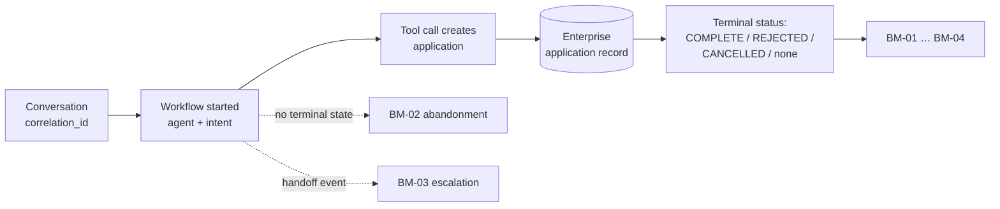

# ADR-D1-04 — Business problem framing and measurable success definition

## 1. Summary

PFF AI's success is defined as **workflow completion**, not conversational quality or query
deflection. The platform succeeds when a county-football administrator who would otherwise
have abandoned, escalated or completed a process incorrectly instead completes it correctly
and unaided. Every KPI in the library derives from that framing, and the measures are set
here so that later dashboards cannot quietly redefine what winning means.

## 2. Context and Problem Statement

1 PF-FT-AI-ARCHITECTURE.md §39 gives twenty architecture success criteria. Every one is technical: the supervisor
routes correctly, ERC aggregates multiple APIs, prompts are versioned, guardrails prevent
injection. 2. PF-FT-AI-ARCHITECTURE-DETAILED.md §50 defines "architecture complete" in the same terms. These are necessary
and they are not sufficient — a platform can satisfy all twenty and deliver nothing a county
association would miss if it were switched off.

Nowhere in the specification set is the *business* problem stated in measurable terms. That
gap is more dangerous than it appears, because AI platforms attract proxy metrics that are
easy to collect and easy to satisfy without delivering value:

- **Conversation volume.** Rises when the platform is confusing and users retry.
- **User satisfaction scores.** A pleasant assistant that fails to complete the task scores
  well; the affiliation flow is an administrative obligation, not an experience users are
  seeking to enjoy.
- **Query deflection.** Counts contacts the county association did not receive, which
  includes users who gave up.
- **Containment rate.** Rises when the platform refuses to hand off.

Each is measurable, each looks like progress, and each can improve while the actual outcome
worsens. Choosing the framing before the dashboards exist is the only way to prevent the
dashboard defining the goal.

The problem PFF AI addresses is visible in the affiliation flow itself. Thirty-two scenarios.
Six application statuses. Six decision flags that alter routing. A Phase 1 pre-check spanning
officials, safeguarding, DBS validity, suspension status, ground assignment, league membership
and a debt rule with three invoice types on different overdue clocks. The users navigating
this are club secretaries — largely volunteers, doing this once or twice a season, alongside
running a football club. The predictable outcomes are abandonment at the pre-check banner,
a call to the county association, or submission of an application that will be rejected.

That is the problem: **the process is correct and the people using it cannot reliably
complete it.** It is a comprehension and guidance problem, not a rules problem — which is
precisely why an orchestration layer (ADR-D1-01) is the right shape of solution and a rules
engine is not.

## 3. Decision Drivers

### 3.1 Functional drivers

| ID | Driver | Source |
|---|---|---|
| DR-F-01 | Success must be measurable from enterprise outcome data, not only from conversation data | 20.PF-FT-AI-GOVERNANCE.md §87 (AI Governance Metrics) |
| DR-F-02 | The definition must distinguish a completed workflow from a pleasant conversation | 21.PF-FT-AI-EVALUATION.md §1 (technically successful ≠ AI-quality successful) |
| DR-F-03 | Measures must attribute outcomes to the platform, not merely correlate with it | ADR-D8-03 |
| DR-F-04 | The framing must apply to workflows beyond affiliation | 2. PF-FT-AI-ARCHITECTURE-DETAILED.md §49 (Extension Model) |

### 3.2 Non-functional drivers

| ID | Driver | Target | Source |
|---|---|---|---|
| DR-N-01 | Measures must be collectable without new enterprise instrumentation | Derivable from existing application records plus correlation IDs | ADR-D7-03 |
| DR-N-02 | Measurement must not create a privacy burden | No new personal data collected for measurement | ADR-D6-06 |
| DR-N-03 | The definition must be stable enough to compare across quarters | ≤1 material redefinition per year | Programme practice |

### 3.3 Constraints

| ID | Constraint | Type | Source |
|---|---|---|---|
| DR-C-01 | The platform decides no business outcome, so it cannot be measured on outcome favourability — only on completion and correctness | Platform | ADR-D1-01 §7.2 |
| DR-C-02 | 1 PF-FT-AI-ARCHITECTURE.md §39's twenty technical criteria remain mandatory and are not replaced by this framing | Organisational | 1 PF-FT-AI-ARCHITECTURE.md §39 |
| DR-C-03 | Users include volunteers with low system familiarity and no training obligation | Organisational | Affiliation flow personas |

### 3.4 Assumptions

| ID | Assumption | If false | Validation |
|---|---|---|---|
| DR-A-01 | Conversations can be correlated to affiliation applications through a shared identifier | Attribution becomes inferential and measures weaken to correlation | Correlation ID design, ADR-D7-03 |
| DR-A-02 | A meaningful baseline of pre-platform completion behaviour is obtainable | Improvement cannot be evidenced, only current-state reported | Baseline capture before Phase 23 go-live |
| DR-A-03 | Rejection and rework rates are attributable to comprehension rather than to genuine ineligibility | The platform's ceiling is lower than assumed | Analysis of historical rejection reasons |

## 4. Evaluation Criteria and Weights

| ID | Criterion | Weight | Rationale | Measurement |
|---|---|---|---|---|
| EC-01 | Fidelity to actual business value | 35 | A framing that can improve while value falls is worse than no framing, because it justifies continued investment | Can the measure improve while users are worse off? |
| EC-02 | Resistance to gaming | 25 | Metrics drive behaviour; a gameable metric will be gamed without anyone intending to | Can the measure be improved without improving outcomes? |
| EC-03 | Measurability from available data | 20 | An unmeasurable framing is a slogan | Can it be computed from enterprise records plus traces? |
| EC-04 | Generality across workflows | 12 | Affiliation is the first of many | Does it transfer without redefinition? |
| EC-05 | Legibility to stakeholders | 8 | The Business Owner must recognise it as value | Is it explainable in one sentence to a county association? |
| | **Total** | **100** | | |

Scoring scale: **1** unacceptable · **2** poor · **3** adequate · **4** good · **5** excellent.

## 5. Alternatives Considered

### 5.1 Option A — Conversational quality and satisfaction

**Description.** Success measured by user satisfaction ratings, conversation ratings, and
persona-adherence scores.

**Strengths.**
- Directly measures the experience the platform is responsible for.
- Cheap to collect through in-conversation prompts.
- Sensitive to persona and prompt improvements, so it moves when the team works on it.

**Weaknesses.**
- Fails EC-01 comprehensively. A user who has a pleasant conversation and then submits an
  application that gets rejected rates the conversation well.
- Highly gameable: satisfaction rises with agreeableness, which is in tension with the honest
  delivery of bad news that ADR-D1-02 I-4 requires.
- Response bias — the users who rate are not the users who abandoned.

**Cost / effort.** Low.

### 5.2 Option B — Deflection and containment

**Description.** Success measured by reduction in contacts to county associations and by the
proportion of conversations resolved without handoff.

**Strengths.**
- Directly measurable cost saving; attractive in a business case.
- County associations feel the benefit immediately.
- Easy to compute from contact-centre data.

**Weaknesses.**
- Cannot distinguish a resolved user from an abandoned one. Both stop contacting.
- Perverse incentive against handoff, which is sometimes the correct action — a genuinely
  ineligible club needs a person, and containment penalises sending them to one.
- Fails EC-01: deflection can rise while completion falls.
- Says nothing about correctness, so a deflected user who submits a wrong application counts
  as a success.

**Cost / effort.** Low.

### 5.3 Option C — Workflow completion and correctness

**Description.** Success measured by the proportion of started workflows that reach a correct
terminal enterprise state without abandonment, escalation or avoidable rework — with
correctness judged by the enterprise outcome, not by the conversation.

**Strengths.**
- Measures the thing the user actually came to do (EC-01).
- Hard to game: the terminal state is set by the enterprise, not by the platform. The
  platform cannot mark its own homework (EC-02).
- Computable from application records correlated to conversations (EC-03).
- Transfers to any workflow with a terminal state — registration, discipline, cup entry
  (EC-04).
- Explains itself in a sentence (EC-05).

**Weaknesses.**
- Lagging: an affiliation may take days to reach COMPLETE, so the signal is slow.
- Attribution is imperfect — a user may complete despite the platform rather than because of
  it (DR-A-03).
- Requires a pre-platform baseline to evidence improvement (DR-A-02).
- Cannot capture value in conversations that were never meant to complete a workflow, such
  as a policy question.

**Cost / effort.** Moderate — needs correlation and baseline work.

### 5.4 Option D — Composite index across quality, deflection and completion

**Description.** A weighted index combining Options A, B and C into one headline number.

**Strengths.**
- Captures multiple dimensions of value.
- One number for executive reporting.
- No single dimension can dominate.

**Weaknesses.**
- Weighting is arbitrary and becomes the real decision, made invisibly.
- Movement in the index is uninterpretable — a rise could be better completion or merely
  higher satisfaction masking worse completion (EC-01 fails through opacity).
- Inherits the gameability of its weakest component (EC-02).
- Difficult to explain, which defeats EC-05.

**Cost / effort.** Moderate, with permanent argument about weights.

## 6. Evaluation Method and Decision Matrix

**Method.** Weighted scoring against §4, tested against a specific adversarial question for
each option: *could this measure improve over a quarter in which fewer clubs successfully
affiliated?*

| Criterion | Weight | A: Satisfaction | B: Deflection | C: Completion | D: Composite |
|---|---|---|---|---|---|
| EC-01 Fidelity to value | 35 | 1 | 2 | 5 | 3 |
| EC-02 Resistance to gaming | 25 | 1 | 1 | 5 | 2 |
| EC-03 Measurability | 20 | 5 | 5 | 4 | 3 |
| EC-04 Generality | 12 | 4 | 3 | 5 | 4 |
| EC-05 Legibility | 8 | 4 | 5 | 5 | 2 |
| **Weighted total** | **100** | **240** | **246** | **475** | **288** |

- **Option C:** (35×5) + (25×5) + (20×4) + (12×5) + (8×5) = 175 + 125 + 80 + 60 + 40 = **475**

**Sensitivity.** C leads by 187 points. The adversarial test is decisive rather than the
scores: A, B and D can all improve in a quarter where fewer clubs affiliated — A through
agreeableness, B through abandonment, D through either, masked by aggregation. C cannot,
because its numerator is an enterprise-set terminal state. No reweighting changes that
property, which is a structural feature of the measure rather than a scoring judgement.

## 7. Decision

### 7.1 The problem, stated

> County football administration processes are correct, comprehensive and difficult to
> complete. The people completing them are largely volunteers doing so infrequently. The cost
> falls as abandoned applications, avoidable contacts to county associations, and submissions
> that are rejected or reworked.
>
> PFF AI exists to make a correct process completable by the people obliged to complete it —
> without changing the process, the rules, or who decides.

The final clause is a constraint carried over from ADR-D1-01, and it bounds the solution
space: the platform improves comprehension and guidance, never the rules.

### 7.2 Success definition

The platform succeeds when a workflow that would have been abandoned, escalated or completed
incorrectly is instead **completed correctly and unaided**.

Four primary measures, all derived from that sentence:

| ID | Measure | Definition |
|---|---|---|
| **BM-01** | Assisted completion rate | Workflows started in conversation that reach a correct terminal enterprise state, as a proportion of workflows started in conversation |
| **BM-02** | Abandonment rate | Conversations that begin a workflow and reach no terminal state within the workflow's natural window |
| **BM-03** | Avoidable escalation rate | Handoffs to a county association for reasons the platform could have resolved — excluding handoffs that were correct |
| **BM-04** | First-submission correctness | Applications submitted through conversation that are not rejected or reworked for a reason the platform could have surfaced beforehand |

BM-03 and BM-04 both carry an explicit "could have" qualifier, and it is load-bearing. A club
that is genuinely ineligible *should* be escalated, and an application rejected on a
substantive ground the platform correctly surfaced is not a platform failure. Without the
qualifier, BM-03 would recreate Option B's perverse incentive against necessary handoff.

### 7.3 What is deliberately not a success measure

| Not a measure | Reason |
|---|---|
| Conversation volume | Rises with confusion and retry |
| User satisfaction | Rises with agreeableness, which conflicts with honest delivery of bad news |
| Containment rate | Penalises correct handoff |
| Raw deflection | Counts abandonment as success |
| Response latency | A constraint (ADR-D5-18), not an objective |
| Persona adherence | A quality gate (ADR-D8-05), not a business outcome |

These remain **instrumented** — they are diagnostic signals, valuable for understanding *why*
BM-01 to BM-04 move. They are not success. The distinction is recorded here so a future
dashboard cannot promote a diagnostic to an objective by placing it at the top.

### 7.4 Baseline and attribution

BM-01 to BM-04 are meaningless without a baseline. Before Phase 23 go-live, the equivalent
measures are captured for the non-conversational path over a comparable period, from
application records alone. Attribution is by correlation ID linking conversation to
application (ADR-D7-03), with a matched comparison against non-conversational applications in
the same window — not a before-and-after comparison across seasons, which would confound with
seasonal and county-level variation.

**Status rationale.** Accepted. Tier 2d under ADR-D0-03 §7.1 — it defines what the platform
is for in user-facing terms — ratified by the AI Product Owner with the Business Owner
consulted.

## 8. Architecture Detail

### 8.1 Measurement chain

The chain crosses the platform boundary exactly once, at the application record. That is
deliberate: the outcome is read from the enterprise, so the platform cannot influence its own
score. It is the structural property that gives Option C its EC-02 advantage.

### 8.2 Applying the framing to affiliation

The affiliation flow's own scenario table supplies the target cases:

| Scenario | Current failure | Success under §7.2 |
|---|---|---|
| 1 — Pre-check failure | Banner lists failures across six categories; user abandons or calls | Platform explains each failure and what resolves it; user returns and completes (BM-01, BM-03) |
| 2A — Folded team submission | Submission blocked; reason unclear | Platform surfaces the fold and the 14-day cooling period before submission (BM-04) |
| 28 — Suspended official | Application reaches CFA review needing an override | Platform surfaces it pre-submission so the club can resolve or expect the review (BM-04) |
| 29 — Youth team CRC in progress | Same | Same, with the safeguarding implication explained by the enterprise's own result (BM-04) |
| 6 → 7 — Invoiced then payment | User unclear what is owed or how to pay | Platform explains the invoice composition and links to the payments page (BM-01) |
| 10 — CFA rejects | Rejection reason arrives by email; next steps unclear | Platform explains the reason and the resubmission path (BM-03) |

Each is a comprehension failure in a correct process — which is the §7.1 problem statement in
concrete form, and is why these six become the first golden-dataset cases in ADR-D7-13.

## 9. Consequences

### 9.1 Positive

- The platform is measured on the outcome users came for, and cannot improve its score
  without improving that outcome.
- The enterprise sets the terminal state, so the measure is independent of the platform.
- The framing transfers to registration, discipline and cup entry without redefinition.
- Diagnostic metrics stay diagnostic, which protects against dashboard drift.
- The golden dataset and evaluation suite inherit a clear target.

### 9.2 Negative

- Lagging indicators. An affiliation may sit in PENDING CFA for days, so BM-01 cannot report
  weekly with confidence.
- Attribution is imperfect; matched comparison reduces but does not eliminate confounding.
- Conversations with no workflow — a policy question — fall outside the primary measures and
  need separate treatment in ADR-D8-05.
- The "could have" qualifiers in BM-03 and BM-04 require judgement, and judgement is
  contestable.

### 9.3 Neutral

- 1 PF-FT-AI-ARCHITECTURE.md §39's twenty technical criteria remain mandatory alongside these (DR-C-02); this
  framing sits above them, not instead of them.
- Diagnostic metrics continue to be collected in full.

### 9.4 Trade-offs explicitly accepted

| Given up | In exchange for | Accepted by |
|---|---|---|
| Fast-moving weekly metrics | Measures that cannot improve while users are worse off | Business Owner |
| Clean attribution | An outcome measure the platform cannot influence directly | AI Product Owner |
| A single headline index | Interpretability of each measure | Business Owner |

## 10. Golden-Rule and Precedence Conformance

| Constraint | Conformance |
|---|---|
| Enterprise decides; AI orchestrates | Directly reflected: success is measured on completion and comprehension, never on outcome favourability. The platform is not credited for an approval or debited for a rejection — DR-C-01. |
| Authoritative-truth precedence | Upheld: terminal state is read from the enterprise application record, authority 5, never inferred from conversation. |
| Four-state separation | Supported: measurement reads Enterprise Business State for outcomes and Conversation State for attribution, and does not conflate them. |
| Versioned artefacts, never mutated in place | Measure definitions are versioned with this ADR; a redefinition is a supersession, which is what prevents silent goal drift. |
| Adam persona governs how, never what | Reinforced: persona adherence is explicitly a quality gate and not a success measure (§7.3), so the persona cannot be optimised at the expense of outcomes. |

## 11. Risks and Mitigations

| ID | Risk | Likelihood | Impact | Exposure | Mitigation | Owner | Residual |
|---|---|---|---|---|---|---|---|
| RSK-01 | Diagnostic metrics promoted to objectives in dashboards | Medium | High | High | §7.3 lists exclusions explicitly; ADR-D8-04 dashboard design must cite this ADR; redefinition requires supersession | AI Product Owner | Low |
| RSK-02 | No usable baseline captured before go-live (DR-A-02) | Medium | High | High | Baseline capture scheduled ahead of Phase 23; matched comparison as fallback if historical data is thin | AI Evaluation Owner | Medium |
| RSK-03 | "Could have" judgement in BM-03/BM-04 applied inconsistently | High | Medium | High | Classification rubric maintained with the golden dataset; sampled dual-review quarterly | AI Evaluation Owner | Medium |
| RSK-04 | Lagging measures delay detection of a regression | High | Medium | High | Diagnostic metrics provide leading signal; evaluation gates (ADR-D7-13) catch quality regression pre-release | AI Evaluation Owner | Low |
| RSK-05 | Correlation between conversation and application fails (DR-A-01) | Low | High | Medium | Correlation ID design tested in Phase 23; without it, measures degrade to cohort comparison | AI Engineering Lead | Low |

## 12. Quantitative Targets and Measures

| ID | Measure | Target | Threshold (alert) | Source | Review cadence |
|---|---|---|---|---|---|
| BM-01 | Assisted completion rate | Above matched non-conversational baseline | Below baseline for 2 quarters | Application records × correlation ID | Quarterly |
| BM-02 | Abandonment rate | Below matched baseline | Above baseline | Conversation traces with no terminal state | Monthly |
| BM-03 | Avoidable escalation rate | Falling quarter on quarter | Rising for 2 quarters | Handoff events, classified per §7.2 rubric | Quarterly |
| BM-04 | First-submission correctness | Above matched baseline | Below baseline | Application rejection and rework reasons | Quarterly |
| QM-01 | Conversations correlatable to an application | ≥95% | <90% | Correlation ID coverage | Monthly |
| QM-02 | BM-03/BM-04 classifications changed on dual review | ≤10% | >25% | Quarterly dual-review sample | Quarterly |

Targets are expressed relative to baseline rather than as absolutes. An absolute target would
be invented, and inventing a number is how a measure becomes theatre.

## 13. Security, Privacy and Compliance Impact

| Dimension | Impact |
|---|---|
| Attack surface change | None. |
| Data classification touched | Internal for aggregates; personal data in the underlying correlation. |
| Personal data / PII | Measurement uses application identifiers and correlation IDs, not personal attributes. Aggregates are reported without club or individual identification. No new personal data is collected for measurement (DR-N-02). |
| Children's data and safeguarding | BM-04 touches safeguarding indirectly: an application rejected for a DBS or welfare-officer non-compliance is a correct rejection and must be classified as such under §7.2's qualifier, not as a platform failure. Misclassifying it would create pressure to help clubs past a safeguarding check, which is the opposite of intended. |
| UK GDPR lawful basis and rights impact | Aggregate measurement on the existing service basis; no profiling of individuals and no automated decision-making about a person. |
| Audit and evidential requirements | Provides the outcome evidence for 20.PF-FT-AI-GOVERNANCE.md §87 (AI Governance Metrics) and the benefit realisation in ADR-D8-03. |
| Standards touched | ISO/IEC 42001 (objectives and performance evaluation); ISO 9001 §9.1 (monitoring, measurement, analysis and evaluation); NIST AI RMF MEASURE 1.1, 2.1. |

## 14. Implementation Impact

| Aspect | Detail |
|---|---|
| Build phases | 0 (framing fixed), 16 (evaluation framework), 23 (affiliation E2E, first real measurement) |
| Repository paths | `config/evaluation/golden/` — the §8.2 scenarios become golden cases |
| Configuration | Measure definitions versioned with this ADR |
| Contracts / schemas | Correlation ID propagation into tool calls creating applications |
| Migration | Baseline capture before go-live |
| Dependencies on other ADRs | ADR-D1-01 (scope bounds what success can mean), ADR-D7-03 (correlation) |
| Effort estimate | Small for definition; moderate for baseline capture and classification rubric |

## 15. Validation and Verification

| ID | Acceptance criterion | Verification method |
|---|---|---|
| AC-01 | Every conversation that starts a workflow carries a correlation ID reaching the enterprise application record | Phase 23 integration test; QM-01 |
| AC-02 | BM-01 to BM-04 are computable from enterprise records plus traces with no new enterprise instrumentation | Measurement pipeline test |
| AC-03 | A pre-platform baseline exists for all four measures | Baseline report before go-live |
| AC-04 | The §7.3 exclusions appear in no dashboard as a headline objective | ADR-D8-04 dashboard review |
| AC-05 | Each §8.2 scenario appears as a golden-dataset case | `config/evaluation/golden/` inspection |
| AC-06 | A correct rejection on safeguarding grounds classifies as success, not failure, under BM-04 | Classification rubric test case |

## 16. Operational Impact

| Aspect | Detail |
|---|---|
| Monitoring | BM-01 to BM-04 quarterly; diagnostic metrics continuously |
| Alerting | Threshold breaches raised at the quarterly business review, not as operational alerts — these are business measures, not service signals |
| Runbook | None required |
| Failure mode and degradation | The failure mode is measurement drift: diagnostics gradually treated as objectives. AC-04 is the check. |
| Rollback | Redefinition requires a superseding ADR, which is the intended friction |
| Support model impact | BM-03 classification requires county-association input on which escalations were avoidable |

## 17. Cost Impact

| Cost element | One-off | Recurring | Basis |
|---|---|---|---|
| Baseline capture | ~3 analyst-days | — | Historical application records |
| Measurement pipeline | Part of Phase 16 | — | Reuses observability infrastructure |
| Quarterly classification and review | — | ~1 analyst-day per quarter | BM-03/BM-04 rubric application |

## 18. Revisit Triggers and Causal Analysis Hooks

| ID | Trigger | Detected by | Action on trigger |
|---|---|---|---|
| RT-01 | BM-01 below baseline for two quarters | Quarterly review | Causal analysis; the platform is not delivering its stated purpose |
| RT-02 | QM-02 exceeds 25% classification disagreement | Quarterly dual review | Rubric is ambiguous; revise before the measures are relied upon |
| RT-03 | A workflow is onboarded with no terminal enterprise state | Agent onboarding | Extend the framing for that workflow class; do not stretch BM-01 to fit |
| RT-04 | A §7.3 exclusion appears as a headline objective | Dashboard review | Correct the dashboard; if the promotion was deliberate, it needs a superseding ADR |
| RT-05 | Non-workflow conversations become a substantial share of usage | Usage analysis | The framing under-measures a growing segment; extend via ADR-D8-05 |

**Scheduled review:** 2027-02-21.

## 19. Traceability

| Dimension | Reference |
|---|---|
| Workshop sheet | WS-02 Business Vision, Problem Statement & Objectives |
| Specification sections | 1 PF-FT-AI-ARCHITECTURE.md §1 (Purpose), §38 (Non-Functional Requirements), §39 (Architecture Success Criteria); 2. PF-FT-AI-ARCHITECTURE-DETAILED.md §2 (Architectural Objective), §50 (Definition of Architecture Complete); 21.PF-FT-AI-EVALUATION.md §1 (Purpose — technically successful ≠ AI-quality successful); 20.PF-FT-AI-GOVERNANCE.md §87 (AI Governance Metrics); affiliation flow Scenarios 1, 2A, 6, 7, 10, 28, 29 |
| Requirement IDs | Per ADR-D1-12 |
| Build phases | 0, 16, 23 |
| Code paths | Measurement pipeline in `src/pf_ft_ai/evaluation/` |
| Configuration | `config/evaluation/golden/` |
| Tests | AC-01 to AC-06 |
| Upstream ADRs | ADR-D1-01 |
| Downstream ADRs | ADR-D1-05, ADR-D1-10, ADR-D8-03, ADR-D8-04, ADR-D8-05, ADR-D7-13 |

## 20. Change Log

| Version | Date | Author | Change |
|---|---|---|---|
| 1.0.0 | 2026-08-21 | AI Product Owner | Initial decision recorded. Success framed as workflow completion and correctness; satisfaction, deflection and containment explicitly excluded as objectives while retained as diagnostics. |
