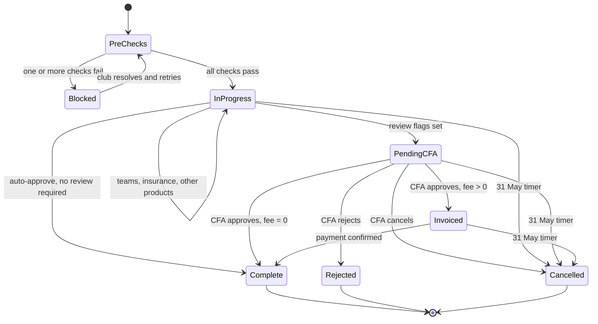

# ADR-D1-05 — Club Affiliation as the first end-to-end reference workflow

## 1. Summary

Club Affiliation is built first and end to end, rather than a simpler workflow or a partial
slice of several. It is chosen precisely because it is hard: it exercises long-running
execution, human-in-the-loop review, payment, batching, event-driven resume and transaction
uncertainty in a single flow, and a platform that handles it has demonstrably built the
capabilities the other workflows will reuse.

## 2. Context and Problem Statement

The platform must prove itself on something. The choice of that something determines which
capabilities get built first, which get deferred, and — most consequentially — which
architectural assumptions get tested before they are expensive to change.

The instinct on a new platform is to pick an easy first workflow. Ship something, build
confidence, tackle the hard cases later. Applied here, that would mean a read-only workflow:
"what is my club's affiliation status?" It is a single API call, no state, no transaction, no
waiting. It could ship early.

It would also prove almost nothing. The specification set's difficulty is concentrated in a
small number of capabilities — long-running execution across HTTP requests (2. PF-FT-AI-ARCHITECTURE-DETAILED.md §28), HIL
suspension and resume (2. PF-FT-AI-ARCHITECTURE-DETAILED.md §29), event-driven continuation (2. PF-FT-AI-ARCHITECTURE-DETAILED.md §26), ERC batching (2. PF-FT-AI-ARCHITECTURE-DETAILED.md
§16), transaction uncertainty (8 PF-FT-AI-ERC-CONTEXT.md §66). A read-only workflow exercises none of them. The
platform would appear to work and would collapse on contact with the first workflow that
waits for a human.

1 PF-FT-AI-ARCHITECTURE.md §37 and 2. PF-FT-AI-ARCHITECTURE-DETAILED.md §47 both already designate Club Affiliation as the reference flow, and
3. PF-FT-AI-RESPONSIBILITY-MATRIX.md §48 works through the responsibility split for it. The 654-line flow document exists.
What is not recorded is why affiliation rather than something smaller, what building it first
costs, and — importantly — what the platform must not conclude from succeeding at it.

There is a further consideration specific to this programme. Affiliation is seasonal. The
window opens, clubs affiliate, and a timer cancels stragglers at 1am on 31 May. The workflow
is not evenly loaded through the year, which affects both when it can be validated in
production and what load profile the platform must handle.

## 3. Decision Drivers

### 3.1 Functional drivers

| ID | Driver | Source |
|---|---|---|
| DR-F-01 | The first workflow must exercise long-running execution across multiple requests | 1 PF-FT-AI-ARCHITECTURE.md §39 criterion 13; 2. PF-FT-AI-ARCHITECTURE-DETAILED.md §28 |
| DR-F-02 | It must exercise human-in-the-loop suspension and resume | 2. PF-FT-AI-ARCHITECTURE-DETAILED.md §29; affiliation Phase 6 PENDING CFA |
| DR-F-03 | It must exercise event-driven ERC refresh and workflow resume | 1 PF-FT-AI-ARCHITECTURE.md §39 criterion 12; affiliation Phase 6-7 |
| DR-F-04 | It must exercise ERC aggregation across several enterprise services with batching | 1 PF-FT-AI-ARCHITECTURE.md §39 criteria 5-6; affiliation Phase 1 |
| DR-F-05 | It must include cases where a transaction outcome is genuinely uncertain | 8 PF-FT-AI-ERC-CONTEXT.md §66; affiliation Scenarios 21-27 |
| DR-F-06 | It must deliver real user value on completion, not only technical validation | ADR-D1-04 §7.2 |

### 3.2 Non-functional drivers

| ID | Driver | Target | Source |
|---|---|---|---|
| DR-N-01 | The workflow must be documented in enough detail to build against without discovery | Complete scenario coverage available | affiliation flow, 32 scenarios |
| DR-N-02 | Validation must be possible outside the seasonal window | Test environment with synthetic applications | Phase 23 |
| DR-N-03 | Capabilities built must be reusable, not affiliation-specific | ≥80% of components reused by workflow two | 2. PF-FT-AI-ARCHITECTURE-DETAILED.md §49 |

### 3.3 Constraints

| ID | Constraint | Type | Source |
|---|---|---|---|
| DR-C-01 | Only `AffiliationAgent` is built in the first pass; the wider agent catalogue is deferred | Organisational | `DEVELOPMENT-GUIDE.md` §2; ADR-D1-11 |
| DR-C-02 | Affiliation involves children's safeguarding data through youth-team DBS/CRC checks | Regulatory | affiliation flow Phase 1 |
| DR-C-03 | Affiliation is seasonal, with a window and a 31 May cancellation timer | Organisational | affiliation flow Phase 7, Scenario 12 |
| DR-C-04 | Payment is enterprise-owned; the platform never handles funds | Platform | ADR-D1-01 §7.2 |

### 3.4 Assumptions

| ID | Assumption | If false | Validation |
|---|---|---|---|
| DR-A-01 | Enterprise APIs exist for every affiliation step the platform must orchestrate | Scope narrows for the affected phases; the gap becomes an enterprise change request | ADR-D2-14 integration matrix |
| DR-A-02 | Capabilities built for affiliation generalise to registration, discipline and cup entry | Workflow two costs as much as workflow one and the extensibility claim fails | Measured at workflow two; QM-03 |
| DR-A-03 | A non-seasonal validation path exists through test environments | Production validation waits up to a year | Phase 23 environment design |

## 4. Evaluation Criteria and Weights

| ID | Criterion | Weight | Rationale | Measurement |
|---|---|---|---|---|
| EC-01 | Architectural coverage — does it exercise the hard capabilities? | 30 | The purpose of a reference workflow is to test assumptions while they are cheap to change | How many of DR-F-01 to DR-F-05 does it exercise? |
| EC-02 | User value on completion | 25 | Per ADR-D1-04, a technically instructive workflow with no user value is not success | Does completing it help a real user complete a real obligation? |
| EC-03 | Reusability of what gets built | 20 | The first workflow's real output is a platform, not an agent | Proportion of components reusable by workflow two |
| EC-04 | Specification completeness | 15 | Building against an undocumented workflow means discovery, which inflates cost unpredictably | Is the flow documented to scenario level? |
| EC-05 | Delivery risk | 10 | Real, but a first workflow chosen for low risk teaches little | Probability of not completing within the phase |
| | **Total** | **100** | | |

Scoring scale: **1** unacceptable · **2** poor · **3** adequate · **4** good · **5** excellent.

## 5. Alternatives Considered

### 5.1 Option A — A read-only status enquiry workflow

**Description.** "What is my club's affiliation status?" — one API call, one response, no
state, no transaction.

**Strengths.**
- Very low delivery risk; achievable in days.
- Validates the FastAPI boundary, supervisor routing and basic ERC assembly.
- Ships early, building organisational confidence.
- No safeguarding or payment exposure.

**Weaknesses.**
- Exercises none of DR-F-01 to DR-F-05. Long-running execution, HIL, events, batching and
  transaction uncertainty all remain untested.
- Modest user value: a status is already visible in the portal.
- Almost nothing built is reused by a workflow that waits, pays or resumes.
- Creates false confidence — the riskiest outcome, because it defers the discovery of
  architectural problems to a point where the platform is already committed.

**Cost / effort.** Very low.

### 5.2 Option B — Club Affiliation, end to end

**Description.** The full flow: Phase 1 pre-checks, team selection, insurance, other products,
submission, routing through auto-approve or CFA review, invoicing, payment, WGS integration
and post-completion scenarios.

**Strengths.**
- Exercises every capability in DR-F-01 to DR-F-05. Long-running (days, through PENDING CFA);
  HIL (CFA review); event-driven (approval, payment, timer cancellation); batching (teams and
  officials); transaction uncertainty (Scenarios 21–27).
- High user value — it is a mandatory seasonal obligation with a genuine comprehension
  problem, per ADR-D1-04 §7.1.
- What gets built is the platform: harness, ERC, events, HIL resume, guardrails all generalise.
- Documented to 32 scenarios with statuses, flags and notifications, so building is
  implementation rather than discovery.
- Already designated as the reference flow by 1 PF-FT-AI-ARCHITECTURE.md §37 and 2. PF-FT-AI-ARCHITECTURE-DETAILED.md §47.

**Weaknesses.**
- Substantial delivery risk; the largest possible first workflow.
- Touches safeguarding data (DR-C-02), so it carries the highest compliance exposure at the
  point of least platform maturity.
- Seasonal, so production validation may wait for a window (DR-C-03).
- Payment-adjacent, and payment failures are visible and consequential.

**Cost / effort.** High — Phase 23 in full.

### 5.3 Option C — A vertical slice of affiliation: Phase 1 pre-checks only

**Description.** Build the pre-check conversation — explaining officials, safeguarding, ground,
league and debt failures — and hand off to the portal for everything after.

**Strengths.**
- Targets the single highest-value moment: the Phase 1 banner is where users abandon.
- Exercises ERC aggregation and batching across several services (DR-F-04).
- Materially lower risk than the full flow.
- No payment exposure, no transaction uncertainty.

**Weaknesses.**
- Does not exercise DR-F-01, DR-F-02, DR-F-03 or DR-F-05. No long-running execution, no HIL,
  no events, no transaction uncertainty.
- Handing off mid-workflow is a worse experience than either completing it or not starting.
- Defers exactly the architectural risks that need early testing.
- Sets up a second project to finish what was started.

**Cost / effort.** Moderate.

### 5.4 Option D — Breadth first: shallow support across several workflows

**Description.** Basic conversational support for affiliation, registration, discipline and
cup entry simultaneously, none completed end to end.

**Strengths.**
- Demonstrates the supervisor's routing across agents, which is otherwise untested.
- Broader apparent coverage for stakeholders.
- Validates the multi-agent architecture early.

**Weaknesses.**
- Contradicts DR-C-01 directly — `DEVELOPMENT-GUIDE.md` §2 defers the agent catalogue as
  genuinely unfinalised and requires `AffiliationAgent` only.
- Exercises no workflow deeply, so DR-F-01 to DR-F-05 remain untested across all of them.
- Four shallow agents is four times the surface area with none of the depth.
- Multiplies the safeguarding and compliance review burden across four domains at once.

**Cost / effort.** High, with low depth per unit of effort.

## 6. Evaluation Method and Decision Matrix

**Method.** Weighted scoring against §4. EC-01 is scored by counting which of DR-F-01 to
DR-F-05 each option exercises. EC-03 is estimated from the component inventory in
`DEVELOPMENT-GUIDE.md` §3.

| Criterion | Weight | A: Read-only | B: Affiliation E2E | C: Phase 1 slice | D: Breadth first |
|---|---|---|---|---|---|
| EC-01 Architectural coverage | 30 | 1 | 5 | 2 | 2 |
| EC-02 User value | 25 | 2 | 5 | 4 | 2 |
| EC-03 Reusability | 20 | 1 | 5 | 3 | 3 |
| EC-04 Specification completeness | 15 | 5 | 5 | 5 | 2 |
| EC-05 Delivery risk | 10 | 5 | 2 | 4 | 2 |
| **Weighted total** | **100** | **215** | **470** | **335** | **225** |

- **Option B:** (30×5) + (25×5) + (20×5) + (15×5) + (10×2) = 150 + 125 + 100 + 75 + 20 = **470**
- **Option C:** (30×2) + (25×4) + (20×3) + (15×5) + (10×4) = 60 + 100 + 60 + 75 + 40 = **335**

**Sensitivity.** B leads C by 135 points and loses only on delivery risk. For C to win, EC-05
would need a weight above about 55 — more than architectural coverage and user value combined
— which would amount to choosing the first workflow to minimise the chance of difficulty, in a
programme whose principal risk is untested architectural assumptions. B's low EC-05 score is
acknowledged and managed in §11 rather than avoided by choosing something easier. D is
additionally excluded by DR-C-01.

## 7. Decision

**Club Affiliation is built first, end to end**, as the reference workflow, in Phase 23.

### 7.1 Scope of "end to end"

All eleven phases of the affiliation flow, covering the conversational path through:

| Phase | Platform responsibility |
|---|---|
| 1 — Club checks | Gather check results into ERC; explain each failure and its resolution |
| 2 — Team selection and fees | Present eligible teams; explain fee composition; collect selection |
| 3 — Insurance | Explain PL and PA options; guide the choice; hand off for document upload |
| 4 — Other products | Present mandatory and optional products |
| 5 — Summary and submission | Assemble and submit through a tool; never fabricate an outcome |
| 6 — Routing | Report the status reached; suspend during PENDING CFA; resume on the approval event |
| 7 — Timers | Handle the 31 May auto-cancellation arriving as an event |
| 8 — WGS integration | Report the confirmed integration result |
| 9 — Post-complete | Handle cancellation, refund, team fold, document management |
| 10 — Payment fail states | Communicate uncertainty honestly per ADR-D3-08 |
| 11 — Edge cases | Handle mid-season club change, deselected teams |

### 7.2 Which capabilities this forces into existence

The reason for choosing the hardest workflow is that it forces the platform to be real. Each
phase demands a capability that would otherwise be deferred:

| Affiliation feature | Capability forced | ADR |
|---|---|---|
| PENDING CFA lasting days | Durable long-running execution surviving request termination | ADR-D2-10 |
| CFA officer approves or rejects | HIL suspension and resume | ADR-D2-10 |
| Approval, payment and timer outcomes arriving asynchronously | Service Bus consumption and event-driven resume | ADR-D2-16 |
| Phase 1 checks across officials, safeguarding, ground, league, debt | Multi-service ERC aggregation | ADR-D2-12 |
| Clubs with many teams and officials | ERC batching at `MAX_ERC_BATCH_SIZE = 20` | ADR-D4-04 |
| Scenarios 21–27 payment failures | Transaction-uncertainty handling | ADR-D3-08 |
| Youth-team DBS and CRC checks | Safeguarding-grade provenance on compliance facts | ADR-D1-03, ADR-D6-16 |
| Invoice and payment links | Portal link registry | ADR-D2-19 |
| Season rollover and re-affiliation | Conversation and session lifecycle across seasons | ADR-D4-01 |

None of these is affiliation-specific. Each is a platform capability that registration,
discipline and cup entry will reuse — which is the substance of the EC-03 argument.

### 7.3 What success at affiliation does not prove

A caution recorded deliberately, because the temptation after Phase 23 will be to generalise
too fast:

- It does not prove the supervisor routes correctly **between** agents. With one agent there
  is nothing to route between. ADR-D3-05 remains untested until workflow two.
- It does not prove the agent catalogue is right. `DEVELOPMENT-GUIDE.md` §2 treats the
  catalogue as genuinely unfinalised, and one successful agent is not evidence for the others
  (ADR-D1-11).
- It does not validate DR-A-02. Reusability is a claim until workflow two measures it.
- It does not establish production load characteristics. Affiliation is seasonal (DR-C-03), so
  its peak is unrepresentative of steady-state load.

### 7.4 Validation approach

Given DR-C-03's seasonality, validation is in three stages: the 32 scenarios as automated
tests against a test environment with synthetic applications; a limited pilot with a small
number of county associations within a live window; then general availability. The scenario
table is the test plan — it enumerates the cases, and completeness against it is measurable.

**Status rationale.** Accepted. Tier 2d under ADR-D0-03 §7.1 — it determines which workflows
the platform supports first — ratified by the AI Product Owner. Confirms the designation
already made in 1 PF-FT-AI-ARCHITECTURE.md §37 and 2. PF-FT-AI-ARCHITECTURE-DETAILED.md §47, with the rationale those documents did not record.

## 8. Architecture Detail

### 8.1 The workflow's shape

Every transition is enterprise-owned. The platform observes them, explains them, and waits
between them. That is the whole architecture in one diagram, which is part of why this
workflow is a good reference: the boundary from ADR-D1-01 is legible in it.

### 8.2 Suspension points

Three places where the conversation must survive without a live request:

| Suspension | Duration | Resumed by |
|---|---|---|
| PENDING CFA review | Hours to days | Enterprise approval, rejection or cancellation event |
| INVOICED awaiting payment | Hours to days | Payment confirmation event |
| Portal handoff for document upload | Minutes to hours | User return, or a document-uploaded event |

Each requires durable workflow state (ADR-D2-10). A platform holding this in memory would lose
it, which is why 2. PF-FT-AI-ARCHITECTURE-DETAILED.md §48 lists in-memory-only long-running workflows as an anti-pattern.

### 8.3 The hardest conversational moment

Scenario 23 — *paid offline but invoice still unpaid in Xero* — is the workflow's sharpest
test and is worth naming as the acceptance case for honest communication. The application is
COMPLETE. The teams are affiliated. The invoice is unreconciled. A user asking "is it all
sorted?" is asking a question with no clean answer.

The platform must convey: yes, affiliation completed and teams are affiliated; the payment was
recorded as an offline payment; reconciliation is outstanding on the finance side; here is
what that means and who resolves it. In Adam's voice, with the football register `CLAUDE.md`
requires, without softening the reconciliation gap into a metaphor, and without a goal
celebration for a transaction that is not confirmed.

Getting Scenario 23 right is a better test of the platform than the twenty scenarios that
resolve cleanly.

## 9. Consequences

### 9.1 Positive

- Every architecturally hard capability is built and tested in the first workflow rather than
  discovered in the second.
- Real user value on delivery — a mandatory seasonal obligation with a genuine comprehension
  problem.
- The 32-scenario table is both specification and test plan, so completeness is measurable.
- What gets built is a platform, not an agent.

### 9.2 Negative

- The largest possible first workflow, with commensurate delivery risk (EC-05 score of 2).
- Safeguarding data is in scope at the point of least platform maturity — mitigated by
  ADR-D1-03's provenance guarantees, but the exposure is real and early.
- Seasonality delays production validation, so confidence lags delivery.
- Payment-adjacent failures are highly visible to clubs and county associations.

### 9.3 Neutral

- Confirms a designation already made in 1 PF-FT-AI-ARCHITECTURE.md §37 and 2. PF-FT-AI-ARCHITECTURE-DETAILED.md §47; the decision here is the
  recorded rationale and the §7.3 caution.
- Only `AffiliationAgent` is built, per DR-C-01 — this decision does not expand scope.

### 9.4 Trade-offs explicitly accepted

| Given up | In exchange for | Accepted by |
|---|---|---|
| An early, low-risk delivery | Architectural assumptions tested while still cheap to change | Business Owner |
| Deferred safeguarding exposure | Real value in the first release | Compliance/Legal |
| Fast production validation | A workflow that actually proves the platform | AI Product Owner |

## 10. Golden-Rule and Precedence Conformance

| Constraint | Conformance |
|---|---|
| Enterprise decides; AI orchestrates | Every state transition in §8.1 is enterprise-owned. The platform observes, explains and waits; it decides no approval, no fee, no eligibility. |
| Authoritative-truth precedence | Application status is read from the enterprise at authority 5 and refreshed on freshness policy; never inferred from conversation. |
| Four-state separation | The workflow exposes all four distinctly: conversation across turns, session across the portal handoff, workflow state across suspension, and enterprise application state as the system of record. It is the clearest available demonstration of the separation. |
| Versioned artefacts, never mutated in place | The agent, its prompts and its tool bindings are versioned per ADR-D5-06. |
| Adam persona governs how, never what | Scenario 23 (§8.3) is the acceptance case: the persona shapes how an uncertain outcome is delivered and cannot make it certain. |

## 11. Risks and Mitigations

| ID | Risk | Likelihood | Impact | Exposure | Mitigation | Owner | Residual |
|---|---|---|---|---|---|---|---|
| RSK-01 | Phase 23 does not complete within its window given the workflow's size | Medium | High | High | Phased delivery within the workflow — pre-checks and submission before post-complete scenarios; scenario table gives objective progress measurement | AI Engineering Lead | Medium |
| RSK-02 | Missing enterprise APIs block phases (DR-A-01) | Medium | High | High | Integration matrix (ADR-D2-14) mapped before build; gaps raised as enterprise change requests, never worked around | AI Platform Owner | Medium |
| RSK-03 | Safeguarding data mishandled in the first workflow | Low | Very High | High | ADR-D1-03 provenance guarantees; ADR-D6-16 safeguarding controls; Compliance/Legal review before pilot | Compliance/Legal | Low |
| RSK-04 | Seasonality prevents production validation before the next window | High | Medium | High | Test environment with synthetic applications; limited pilot within a live window per §7.4 | AI Product Owner | Medium |
| RSK-05 | Capabilities prove affiliation-specific and do not generalise (DR-A-02) | Medium | High | High | Component design reviewed for workflow-neutrality at build; measured at workflow two via QM-03 | AI Solution Architect | Medium |
| RSK-06 | Success at affiliation is over-generalised into unwarranted confidence | Medium | Medium | Medium | §7.3 records explicitly what it does not prove; cited at the Phase 23 review | AI Solution Architect | Low |

## 12. Quantitative Targets and Measures

| ID | Measure | Target | Threshold (alert) | Source | Review cadence |
|---|---|---|---|---|---|
| QM-01 | Affiliation scenarios covered by automated test | 32 of 32 | <28 | Phase 23 test suite | Per build |
| QM-02 | Suspension points surviving a full runtime restart | 3 of 3 | <3 | Durability test | Per build |
| QM-03 | Components reused unchanged by workflow two | ≥80% | <60% | Component inventory at workflow two | At workflow two |
| QM-04 | Scenario 23-class responses correctly communicating uncertainty | 100% | <100% | Evaluation suite; ADR-D3-08 | Per release |
| QM-05 | BM-01 assisted completion rate for affiliation | Above baseline | Below baseline | ADR-D1-04 measurement chain | Quarterly |
| QM-06 | Safeguarding facts presented without enterprise provenance | 0 | ≥1 | ADR-D1-03 QM-06 filtered to safeguarding fields | Weekly |

## 13. Security, Privacy and Compliance Impact

| Dimension | Impact |
|---|---|
| Attack surface change | Introduces the platform's first production data path. All crossings are the five in ADR-D1-01 §8.1. |
| Data classification touched | Personal and special-category: officials' names, roles, DBS and safeguarding status, suspension status, club financial position. |
| Personal data / PII | Club and team officials' personal data flows through ERC. The platform holds it transiently in context and memory per ADR-D4-11's retention policy, never as a record. |
| Children's data and safeguarding | The most significant compliance dimension of this decision. Phase 1 validates that officials on U5–U18 teams hold current DBS/CRC clearance, and Scenarios 28 and 29 involve CFA overrides for suspended officials and in-progress CRCs. The platform explains these outcomes and never forms them. Selecting affiliation first means this exposure arrives with the first release, which is why Compliance/Legal review precedes the pilot (RSK-03). |
| UK GDPR lawful basis and rights impact | Processing on the enterprise's existing basis for club administration. No new lawful basis; no automated decision-making about an individual, since every determination is enterprise-made. |
| Audit and evidential requirements | The 32-scenario table doubles as the compliance evidence set: each scenario's expected platform behaviour is testable and traceable. |
| Standards touched | ISO/IEC 42001 (AI system in operation); NIST AI RMF MAP 3.4, MEASURE 2.6; EU AI Act — the platform makes no decision about a person, which is central to its risk classification and is demonstrated by this workflow. |

## 14. Implementation Impact

| Aspect | Detail |
|---|---|
| Build phases | 23, depending on Phases 0–22 |
| Repository paths | `src/pf_ft_ai/agents/affiliation/`; exercises nearly every other package |
| Configuration | `config/base/agents.yaml`, `config/base/workflows.yaml`, `config/enterprise/api-catalog/affiliations.yaml`; affiliation prompts under `prompts/` |
| Contracts / schemas | Affiliation event contracts under `contracts/events/affiliation/` |
| Migration | None; first workflow |
| Dependencies on other ADRs | Nearly all — this workflow is where the library's decisions meet reality |
| Effort estimate | Large; the whole of Phase 23 |

## 15. Validation and Verification

| ID | Acceptance criterion | Verification method |
|---|---|---|
| AC-01 | All 32 scenarios have an automated test with the expected platform behaviour | Phase 23 test suite; QM-01 |
| AC-02 | A conversation suspended at PENDING CFA resumes correctly after a full runtime restart | Durability test; QM-02 |
| AC-03 | An approval arriving as a Service Bus event resumes the workflow and refreshes ERC | Event integration test |
| AC-04 | A club with more than 20 teams is processed with correct batching | Batching test at `MAX_ERC_BATCH_SIZE` |
| AC-05 | Scenario 23 produces an uncertainty statement with no success language | Evaluation suite; QM-04 |
| AC-06 | Every safeguarding fact shown carries enterprise provenance | ADR-D1-03 AC-02 filtered to safeguarding fields; QM-06 |
| AC-07 | The 31 May auto-cancellation arriving as an event is handled without the platform scheduling anything | Event handler test; ADR-D1-01 AC-07 |

## 16. Operational Impact

| Aspect | Detail |
|---|---|
| Monitoring | Per-phase progression and drop-off traced; suspension durations tracked |
| Alerting | Suspension exceeding expected duration; event-resume failures; batching failures |
| Runbook | `docs/runbooks/enterprise-api.md`, `docs/runbooks/service-bus-dlq.md`, `docs/runbooks/erc-batch-recovery.md` |
| Failure mode and degradation | Where enterprise APIs are unavailable mid-workflow, the platform preserves workflow state and tells the user it cannot currently proceed. It must not advance the workflow on assumed state. |
| Rollback | The agent can be disabled by configuration, returning users to the portal path. Workflow state persists for resume. |
| Support model impact | Affiliation-window seasonal load; support readiness required ahead of the window rather than at go-live |

## 17. Cost Impact

| Cost element | One-off | Recurring | Basis |
|---|---|---|---|
| Phase 23 build | Large | — | `DEVELOPMENT-GUIDE.md` §4 |
| Enterprise API call volume | — | Per affiliation conversation | ADR-D8-01 |
| Seasonal peak capacity | — | Window-period scaling | ADR-D5-17 |
| Avoided cost — capabilities not rebuilt for workflow two | — | Saving | Value depends on QM-03 |

## 18. Revisit Triggers and Causal Analysis Hooks

| ID | Trigger | Detected by | Action on trigger |
|---|---|---|---|
| RT-01 | QM-03 shows under 60% component reuse at workflow two | Workflow two build | DR-A-02 is false; causal analysis on why components coupled to affiliation |
| RT-02 | QM-01 falls short of full scenario coverage at Phase 23 exit | Phase review | Do not exit the phase on partial coverage; the scenario table is the completion definition |
| RT-03 | QM-06 records a safeguarding fact without provenance | Weekly audit | Immediate governance incident per 20.PF-FT-AI-GOVERNANCE.md §105 |
| RT-04 | The affiliation flow document is revised by the enterprise | Change notice | Re-derive scenario coverage; new scenarios need tests before release |
| RT-05 | BM-01 for affiliation is below baseline after a full window | Quarterly review | Causal analysis; the workflow choice was right but the execution is not delivering |

**Scheduled review:** 2027-02-21, or at Phase 23 exit, whichever is sooner.

## 19. Traceability

| Dimension | Reference |
|---|---|
| Workshop sheet | WS-02 Business Vision, Problem Statement & Objectives; WS-05 Enterprise Workflow Catalogue |
| Specification sections | `MD files/0 Workflow/pff_affiliation_e2e_flow.md` Phases 0–11, Complete Scenario Summary Table, Application Status Reference, Key Decision Flags; 1 PF-FT-AI-ARCHITECTURE.md §37 (Club Affiliation Reference Architecture), §39 (Success Criteria); 2. PF-FT-AI-ARCHITECTURE-DETAILED.md §47 (Club Affiliation Reference Flow), §49 (Extension Model); 3. PF-FT-AI-RESPONSIBILITY-MATRIX.md §48 (Responsibility During Affiliation) |
| Requirement IDs | Per ADR-D1-12 |
| Build phases | 23 |
| Code paths | `src/pf_ft_ai/agents/affiliation/` |
| Configuration | `config/base/agents.yaml`, `config/enterprise/api-catalog/affiliations.yaml`, `contracts/events/affiliation/` |
| Tests | AC-01 to AC-07; the 32-scenario suite |
| Upstream ADRs | ADR-D1-01, ADR-D1-04 |
| Downstream ADRs | ADR-D1-10, ADR-D1-11, ADR-D2-10, ADR-D3-08, ADR-D4-04, ADR-D8-08 |

## 20. Change Log

| Version | Date | Author | Change |
|---|---|---|---|
| 1.0.0 | 2026-08-21 | AI Product Owner | Initial decision recorded. Affiliation selected end to end over simpler alternatives on architectural coverage and user value; §7.3 records explicitly what success at it does not prove. |
