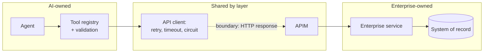

# ADR-D1-06 — Business capability map and capability ownership model

## 1. Summary

Capabilities are mapped in three ownership classes — Enterprise-owned, AI-owned, and Shared
by boundary — with "Shared" given a precise definition rather than left as a comfortable
label: a shared capability is one where the enterprise owns the *operation* and the AI
platform owns the *abstraction over it*, with authority always resting on the enterprise side.

## 2. Context and Problem Statement

Doc 3 §4 provides an executive responsibility matrix across forty capabilities. It is the most
useful single table in the specification set, and it contains an ambiguity that matters.

Nine of its rows are marked **Shared**: Enterprise API Integration, Tools, RAG, Cache, Service
Bus, AI Observability, Security, CI/CD, Infrastructure, and DR. "Shared" is doing different
work in each case:

- **Enterprise API Integration** — the enterprise owns the APIs; the AI owns the integration
  and tool abstraction. Two clearly separated layers.
- **Cache** — marked "Shared by boundary": the enterprise may have its own cache, and the AI
  has its own. Two independent things with the same name.
- **Service Bus** — the enterprise produces events; the AI consumes them. A producer/consumer
  split.
- **Security** — enterprise security controls plus AI-specific controls. Overlapping
  responsibility for one concern.

Four different meanings under one label. That is tolerable in an executive summary and
corrosive in an operating model, because "shared" is where accountability goes to die. When a
tool call to an enterprise API returns a malformed payload at 2am, "shared" does not tell
anyone whose incident it is. Doc 20 §9 is explicit that no production AI component should be
ownerless, and a jointly-owned capability with no boundary definition is functionally
ownerless.

There is a second problem. Doc 3 §4 is a *responsibility* matrix organised by technical
capability — LangGraph, ERC, Vector Store. A *business* capability map (WS-03) should be
organised by what the organisation does for its members: affiliate a club, register a player,
process a discipline case. The two are different views and both are needed. Without the
business view, there is no way to answer "which business capabilities does PFF AI touch, and
which are untouched?" — which is exactly the question a county association or an FA governance
board will ask.

## 3. Decision Drivers

### 3.1 Functional drivers

| ID | Driver | Source |
|---|---|---|
| DR-F-01 | Every capability must have a single accountable owner | doc 20 §9 |
| DR-F-02 | "Shared" must have an operational definition, not just a label | doc 3 §4 |
| DR-F-03 | A business-capability view must exist alongside the technical view | WS-03 |
| DR-F-04 | The map must show which business capabilities the AI touches and which it does not | ADR-D1-01 §7 |
| DR-F-05 | Ownership must map to real teams | doc 3 §62 |

### 3.2 Non-functional drivers

| ID | Driver | Target | Source |
|---|---|---|---|
| DR-N-01 | Incident routing must be derivable from the map | 0 ownership disputes during incidents | ADR-D7-16 |
| DR-N-02 | The map must remain stable as workflows are added | New workflow adds a business capability, not a new ownership class | doc 2 §49 |
| DR-N-03 | The map must be small enough to be read | ≤3 ownership classes; ≤10 business capability groups | Programme practice |

### 3.3 Constraints

| ID | Constraint | Type | Source |
|---|---|---|---|
| DR-C-01 | Doc 3 §4's authority column is binding and not open to reinterpretation | Organisational | doc 3 §4 |
| DR-C-02 | Enterprise owns every business capability's authority; the AI owns none | Platform | ADR-D1-01 §7.2 |
| DR-C-03 | Doc 3 §62's five-team logical model is the ownership vocabulary | Organisational | doc 3 §62 |

### 3.4 Assumptions

| ID | Assumption | If false | Validation |
|---|---|---|---|
| DR-A-01 | Doc 3 §62's logical teams map onto real organisational teams | Ownership is nominal and incidents route badly | Confirmed with the Business Owner before Phase 23 |
| DR-A-02 | Business capabilities are stable even as workflows change | The business view needs revision per workflow, which would defeat its purpose | Reviewed at each workflow onboarding |

## 4. Evaluation Criteria and Weights

| ID | Criterion | Weight | Rationale | Measurement |
|---|---|---|---|---|
| EC-01 | Accountability clarity | 35 | The map's purpose is answering "whose is this?"; ambiguity here defeats it entirely | Can a single owner be named for every capability? |
| EC-02 | Fidelity to doc 3 §4 | 25 | The specification's authority assignments are binding (DR-C-01) | Does the model preserve every authority assignment? |
| EC-03 | Usability during an incident | 20 | The map is consulted under pressure or not at all | Can routing be determined in under a minute? |
| EC-04 | Business legibility | 12 | WS-03 is a business artefact; a purely technical map fails its purpose | Would a county association recognise the capabilities? |
| EC-05 | Stability under change | 8 | A map needing revision per workflow is not a map | Revisions required per new workflow |
| | **Total** | **100** | | |

Scoring scale: **1** unacceptable · **2** poor · **3** adequate · **4** good · **5** excellent.

## 5. Alternatives Considered

### 5.1 Option A — Adopt doc 3 §4 unchanged

**Description.** Use the forty-row responsibility matrix as the capability map, with "Shared"
as-is.

**Strengths.**
- Zero divergence from the specification; nothing to maintain in parallel.
- Comprehensive technical coverage.
- Already reviewed and agreed.

**Weaknesses.**
- Nine "Shared" rows carrying four different meanings leave accountability undefined for a
  quarter of the map (EC-01).
- Technical rather than business capabilities, so WS-03's purpose is unmet (EC-04).
- Cannot answer "which business capabilities does the AI touch?"

**Cost / effort.** Nil.

### 5.2 Option B — Binary ownership: every capability assigned to exactly one side

**Description.** Eliminate "Shared". Each capability is Enterprise or AI, chosen by where
authority sits.

**Strengths.**
- Maximum accountability clarity — no ambiguity possible (EC-01).
- Trivially usable during an incident (EC-03).
- Simple to explain.

**Weaknesses.**
- Misrepresents reality. Enterprise API Integration genuinely has two owners of two layers;
  forcing it to one side means either the AI team owns enterprise APIs it cannot change, or
  the enterprise team owns tool abstractions it did not write.
- Loses doc 3 §4's authority nuance (EC-02) — the matrix distinguishes owning an operation
  from owning an abstraction, and that distinction is load-bearing.
- Would put Security wholly on one side, which no organisation actually operates.

**Cost / effort.** Low, but produces a map that does not match how work happens.

### 5.3 Option C — Three classes, with "Shared" defined as operation/abstraction separation

**Description.** Enterprise-owned, AI-owned, and Shared — where Shared is defined precisely:
the enterprise owns the operation and holds authority; the AI platform owns the abstraction
over it and holds no authority. Each shared capability names its layer boundary explicitly.
Paired with a business-capability view for WS-03.

**Strengths.**
- Preserves doc 3 §4's authority assignments exactly (EC-02).
- Every capability has one accountable owner per layer, so accountability is complete even
  where two teams are involved (EC-01).
- Incident routing follows from which layer failed (EC-03).
- Business view answers WS-03's question (EC-04).
- Adding a workflow adds a business capability without changing the ownership model (EC-05).

**Weaknesses.**
- Two views to maintain — business and technical.
- The layer boundary must be stated for each shared capability, which is real work.
- "Shared" still requires reading a definition rather than being self-evident.

**Cost / effort.** Moderate one-off.

### 5.4 Option D — RACI per capability

**Description.** Extend doc 3 §61's RACI across all forty capabilities and use that as the map.

**Strengths.**
- Accountability explicit by construction — every row has an A.
- Familiar governance format.
- Captures consultation relationships the other options lose.

**Weaknesses.**
- Forty rows × five roles is not consultable during an incident (EC-03).
- Does not describe *what* is shared, only *who* is involved — the operation/abstraction
  boundary remains undefined.
- Still technical rather than business (EC-04).
- Duplicates doc 3 §61, which already exists for delivery capabilities.

**Cost / effort.** Moderate, with high maintenance.

## 6. Evaluation Method and Decision Matrix

**Method.** Weighted scoring against §4. EC-01 and EC-03 tested by walking three incident
scenarios — a malformed enterprise API payload, a Service Bus message stuck in the DLQ, and a
cache returning stale club data — and asking whether each option names an owner unambiguously.

| Criterion | Weight | A: §4 as-is | B: Binary | C: Three classes defined | D: RACI |
|---|---|---|---|---|---|
| EC-01 Accountability clarity | 35 | 2 | 5 | 5 | 4 |
| EC-02 Fidelity to doc 3 §4 | 25 | 5 | 2 | 5 | 4 |
| EC-03 Incident usability | 20 | 3 | 5 | 5 | 2 |
| EC-04 Business legibility | 12 | 1 | 2 | 5 | 1 |
| EC-05 Stability | 8 | 4 | 4 | 5 | 3 |
| **Weighted total** | **100** | **299** | **382** | **500** | **335** |

- **Option C:** (35×5) + (25×5) + (20×5) + (12×5) + (8×5) = 175 + 125 + 100 + 60 + 40 = **500**

**Sensitivity.** C scores maximum throughout and cannot be overtaken. That is unusual and
reflects that C is essentially A with its one defect repaired and its missing view added — it
inherits A's fidelity while fixing A's ambiguity, so it dominates rather than trades off. B's
382 is respectable and fails on EC-02: it would require overriding doc 3 §4's authority
column, which DR-C-01 forbids.

## 7. Decision

### 7.1 Three ownership classes

| Class | Definition | Authority | Incident routing |
|---|---|---|---|
| **Enterprise-owned** | The enterprise builds, runs and decides. The AI platform consumes results. | Enterprise | Enterprise support |
| **AI-owned** | The AI platform builds, runs and decides, within the boundary of ADR-D1-01. | AI Platform | AI support |
| **Shared by layer** | The enterprise owns the **operation** and holds authority. The AI platform owns the **abstraction over it** and holds none. | **Always enterprise** | By failing layer |

The third class's definition is the substance of this decision. "Shared" never means shared
authority. It means two owners of two layers, with authority unambiguously on the enterprise
side. Doc 3 §4's authority column already says this; §7.1 makes it operative.

### 7.2 The nine shared capabilities, with their layer boundaries

| Capability | Enterprise owns (operation) | AI platform owns (abstraction) | Boundary |
|---|---|---|---|
| Enterprise API Integration | The APIs, their contracts and behaviour | API catalogue, client, retry, timeout, circuit breaking | The HTTP response leaving APIM |
| Tools | The enterprise operation each tool invokes | Tool registry, schema, validation, allowlist, execution | The tool's outbound call |
| RAG | Source documents and their accuracy | Ingestion, chunking, retrieval, reranking, citation | The document as ingested |
| Cache | Any enterprise-side caching | AI cache: keys, TTL, invalidation | Separate systems; no shared keys or entries |
| Service Bus | Event production, schema, delivery | Subscription, consumption, handlers, idempotency, DLQ handling | The message on the subscription |
| AI Observability | Enterprise observability of enterprise systems | AI traces, spans, token and cost metrics, Langfuse | The correlation ID linking them |
| Security | Perimeter, identity, APIM policy, network | Guardrails, prompt security, tool allowlist, AI-specific controls | The validated claim entering FastAPI |
| CI/CD | Enterprise pipelines and release process | AI pipeline: evaluation gates, prompt and model release bundles | The container image in ACR |
| Infrastructure and DR | AKS, networking, APIM, Key Vault, enterprise DR | AI workload requirements, AI-specific recovery | The Kubernetes namespace |

Each boundary is a concrete artefact — a response, a message, a claim, an image — not a
conceptual line. That is what makes incident routing mechanical: identify which side of the
named artefact failed.

### 7.3 Business capability view

The technical view above answers "who owns this component?". The business view answers "what
does the organisation do, and does the AI touch it?".

| Business capability | Description | AI involvement | First workflow |
|---|---|---|---|
| **Club affiliation** | Affiliating a club and its teams for a season | Full orchestration | Phase 23 |
| **Team and player registration** | Registering teams and players | None yet | Deferred (ADR-D1-11) |
| **Officials and safeguarding** | Managing officials, DBS/CRC, welfare officers | Read and explain, via affiliation pre-checks | Partial in Phase 23 |
| **Insurance administration** | PL and PA cover, group schemes, own policies | Explain and guide, via affiliation | Partial in Phase 23 |
| **Discipline** | Cases, sanctions, fines, appeals | None yet | Deferred |
| **County cups** | Cup entry, eligibility, competition administration | None yet | Deferred |
| **Payments and finance** | Invoicing, payment, refund, reconciliation | Explain state only; never handles funds | Partial in Phase 23 |
| **League management** | League membership and structure | Read only, via affiliation pre-checks | Partial in Phase 23 |
| **WGS integration** | National football database synchronisation | Report confirmed outcomes only | Partial in Phase 23 |

Nine business capabilities. **Authority for all nine rests entirely with the enterprise** —
this is the same statement as ADR-D1-01 §7.2, expressed as a map. The "AI involvement" column
describes conversational reach, never decision rights.

### 7.4 Team mapping

Doc 3 §62's five logical teams map to the three classes:

| Class | Doc 3 §62 team |
|---|---|
| Enterprise-owned | Enterprise Application Team |
| AI-owned | AI Platform Team; AI/ML Platform Team for model hosting, GPU, embeddings, vector |
| Shared by layer | Enterprise Application Team ↔ AI Platform Team, with Platform/DevOps for infrastructure and Security for security |

DR-A-01 flags that these are logical teams and their mapping to real ones is confirmed
separately.

**Status rationale.** Accepted. Tier 1 under ADR-D0-03 §7.1 — data ownership is one of doc 2
§52's categories — ratified by the external ADF/ADR governance forum.

## 8. Architecture Detail

### 8.1 Ownership across a single tool call

A timeout on the AI side of the boundary is an AI incident. A 500 from the enterprise service
is an enterprise incident. A schema mismatch is a contract incident, jointly triaged, and the
contract's owner — the enterprise, per §7.2 — decides the resolution.

### 8.2 Worked routing — three incidents

| Incident | Failing layer | Owner | Reasoning |
|---|---|---|---|
| Enterprise API returns a payload failing the tool's response schema | Enterprise, operation | Enterprise Application Team | The response crossed the boundary artefact malformed; the abstraction correctly rejected it |
| Service Bus message stuck in DLQ after repeated handler exceptions | AI, abstraction | AI Platform Team | The message arrived on the subscription correctly; consumption failed |
| Cached club data served stale after an enterprise update | AI, abstraction | AI Platform Team | AI cache invalidation is wholly AI-owned; enterprise caching is a separate system per §7.2 |

Each resolves in one step by asking which side of the named artefact failed. That is EC-03
satisfied concretely rather than asserted.

## 9. Consequences

### 9.1 Positive

- Every capability has an accountable owner, satisfying doc 20 §9 for capabilities as well as
  components.
- "Shared" is operationally defined, so a quarter of doc 3 §4's map stops being ambiguous.
- Incident routing follows from a named artefact rather than a negotiation.
- The business view answers what the AI touches — the question governance will ask.
- Adding a workflow extends the business view without changing the ownership model.

### 9.2 Negative

- Two views to keep consistent. Divergence between them is a real maintenance risk.
- The nine layer boundaries in §7.2 must be maintained as integration evolves; a boundary that
  drifts silently reintroduces the ambiguity.
- Contract incidents — a schema mismatch — still require joint triage; the model narrows the
  ambiguous space but does not eliminate it.

### 9.3 Neutral

- Preserves doc 3 §4's authority column unchanged; this is a clarification, not a revision.
- Doc 3 §62's team model is adopted as-is, including its own caveat about mapping to real
  teams.

### 9.4 Trade-offs explicitly accepted

| Given up | In exchange for | Accepted by |
|---|---|---|
| Simplicity of binary ownership | Fidelity to how the layers actually divide | External ADF/ADR forum |
| A single view | Both technical routing and business legibility | Business Owner |
| Self-evident labels | Precision in the one place doc 3 §4 was ambiguous | AI Platform Owner |

## 10. Golden-Rule and Precedence Conformance

| Constraint | Conformance |
|---|---|
| Enterprise decides; AI orchestrates | The map is this rule as an ownership model. Authority is enterprise in all three classes; the AI never holds it, including in shared capabilities. |
| Authoritative-truth precedence | Supported: §7.2's boundary artefacts are where authority-bearing data enters the platform, which is where provenance is stamped per ADR-D1-03. |
| Four-state separation | Supported: Enterprise Business State sits wholly in the Enterprise-owned class; the AI-owned class holds the other three. |
| Versioned artefacts, never mutated in place | Not directly; the capability map itself is versioned as an ADR. |
| Adam persona governs how, never what | Reflected in §7.3: AI involvement is described as conversational reach, never decision rights. |

## 11. Risks and Mitigations

| ID | Risk | Likelihood | Impact | Exposure | Mitigation | Owner | Residual |
|---|---|---|---|---|---|---|---|
| RSK-01 | Layer boundaries drift as integration evolves, restoring ambiguity | Medium | Medium | Medium | §7.2 boundaries are ADR content; a change is an amendment with a change-log row; reviewed at each integration change | AI Solution Architect | Low |
| RSK-02 | Business and technical views diverge | Medium | Low | Low | Both live in this ADR; a change to one forces review of the other | AI Solution Architect | Low |
| RSK-03 | "Shared" reverts to meaning shared authority in practice | Medium | High | High | §7.1's definition is explicit and repeated in ADR-D7-16's support model; escalations citing shared authority are corrected | AI Platform Owner | Medium |
| RSK-04 | Logical teams do not map to real teams (DR-A-01) | Medium | Medium | Medium | Confirmed with the Business Owner before Phase 23; unmapped ownership blocks go-live | Business Owner | Medium |
| RSK-05 | Contract incidents route slowly through joint triage | Medium | Low | Low | Contract owner named as enterprise in §7.2, so triage has a tie-break | Enterprise Application Team | Low |

## 12. Quantitative Targets and Measures

| ID | Measure | Target | Threshold (alert) | Source | Review cadence |
|---|---|---|---|---|---|
| QM-01 | Incidents where ownership was disputed for more than 30 minutes | 0 | ≥1 per quarter | Incident records | Quarterly |
| QM-02 | Capabilities without a named owner | 0 | ≥1 | Map audit | Quarterly |
| QM-03 | Shared capabilities without a stated boundary artefact | 0 | ≥1 | §7.2 audit | Quarterly |
| QM-04 | Business capabilities in §7.3 not reflected in the workflow catalogue | 0 | ≥1 | Cross-check against ADR-D1-10 | Quarterly |
| QM-05 | Escalations asserting shared authority over a business decision | 0 | ≥1 | Incident and escalation records | Quarterly |

## 13. Security, Privacy and Compliance Impact

| Dimension | Impact |
|---|---|
| Attack surface change | None directly. Clarifies the security capability's split — perimeter and identity enterprise-side, guardrails and tool controls AI-side — which prevents a control being assumed by both and implemented by neither. |
| Data classification touched | Internal. |
| Personal data / PII | None in the map itself. §7.3 identifies which business capabilities involve personal data, which informs ADR-D6-06's data-flow policy. |
| Children's data and safeguarding | The Officials and safeguarding capability in §7.3 is enterprise-authoritative with AI read-and-explain involvement only. The map is where that limitation is visible to a governance reviewer at a glance. |
| UK GDPR lawful basis and rights impact | Clarifies controller/processor reality: the enterprise controls all nine business capabilities' data; the AI platform processes in transit. |
| Audit and evidential requirements | Provides the ownership evidence doc 20 §9 requires and the accountability basis for §60 (Data Lineage). |
| Standards touched | ISO/IEC 42001 (roles and responsibilities); ISO/IEC 27001 A.5.2 (roles), A.5.19–A.5.22 (supplier and interface relationships); ISO 9001 §5.3; CMMI-DEV OPD, GP 2.4. |

## 14. Implementation Impact

| Aspect | Detail |
|---|---|
| Build phases | 0 (establishes ownership), 21 (governance artefacts) |
| Repository paths | Reflected in the package structure of `src/pf_ft_ai/` — AI-owned capabilities each have a package |
| Configuration | `config/enterprise/` holds the shared-capability boundary definitions (API catalogue, tool registry) |
| Contracts / schemas | The boundary artefacts in §7.2 are typed contracts |
| Migration | None |
| Dependencies on other ADRs | ADR-D1-01 (scope determines what can be AI-owned) |
| Effort estimate | Small — definition and confirmation with the Business Owner |

## 15. Validation and Verification

| ID | Acceptance criterion | Verification method |
|---|---|---|
| AC-01 | Every capability in doc 3 §4 appears in exactly one class in §7.1 | Cross-check against doc 3 §4 |
| AC-02 | Every shared capability names a concrete boundary artefact | §7.2 audit; QM-03 |
| AC-03 | Authority for every business capability in §7.3 is enterprise | Map audit against ADR-D1-01 §7.2 |
| AC-04 | Each §8.2 incident scenario routes to one owner in a single step | Tabletop exercise with the support function |
| AC-05 | Logical teams in §7.4 map to named real teams | Business Owner confirmation before Phase 23 |
| AC-06 | Every AI-owned capability corresponds to a package in `src/pf_ft_ai/` | Structure audit against `DEVELOPMENT-GUIDE.md` §3 |

## 16. Operational Impact

| Aspect | Detail |
|---|---|
| Monitoring | Boundary artefacts are natural instrumentation points — response, message, claim, image |
| Alerting | Alerts attributed to a layer, which sets the routing |
| Runbook | `docs/runbooks/README.md` indexes by capability; ADR-D7-16 carries the support model |
| Failure mode and degradation | The failure mode is disputed ownership during an incident, measured by QM-01 |
| Rollback | Not applicable |
| Support model impact | Directly determines routing; ADR-D7-16 depends on this map |

## 17. Cost Impact

| Cost element | One-off | Recurring | Basis |
|---|---|---|---|
| Map definition and team confirmation | ~1 architect-day plus Business Owner time | — | This record |
| Boundary maintenance | — | Reviewed at each integration change | Absorbed in integration work |
| Avoided cost | — | Ongoing | Disputed ownership during a seasonal-window incident is expensive in exactly the wrong moment |

## 18. Revisit Triggers and Causal Analysis Hooks

| ID | Trigger | Detected by | Action on trigger |
|---|---|---|---|
| RT-01 | QM-01 records a disputed-ownership incident | Quarterly review | Causal analysis; the boundary artefact was unclear or absent |
| RT-02 | QM-05 records an escalation asserting shared authority | Quarterly review | Correct and reinforce §7.1's definition; a repeat suggests the model is not understood |
| RT-03 | A new business capability is brought into scope | Workflow onboarding | Extend §7.3; a new capability with no owner blocks onboarding |
| RT-04 | Doc 3 §4 or §62 amended | Change notice | Re-derive §7.1 and §7.4 |
| RT-05 | Real team structure diverges from §7.4 | Organisational change | Re-map; ownership must follow the real structure, not the logical one |

**Scheduled review:** 2027-08-21.

## 19. Traceability

| Dimension | Reference |
|---|---|
| Workshop sheet | WS-03 Business Capability Map |
| Specification sections | doc 3 §4 (Executive Responsibility Matrix), §61 (Responsibility RACI), §62 (Team Boundary Model); doc 1 §2.1–§2.2; doc 2 §5.1–§5.3 |
| Requirement IDs | Per ADR-D1-12 |
| Build phases | 0, 21 |
| Code paths | Package structure of `src/pf_ft_ai/` |
| Configuration | `config/enterprise/api-catalog/`, `config/enterprise/tool-registry/` |
| Tests | AC-01 to AC-06 |
| Upstream ADRs | ADR-D1-01 |
| Downstream ADRs | ADR-D1-10, ADR-D2-01, ADR-D2-14, ADR-D7-16, ADR-D8-08 |

## 20. Change Log

| Version | Date | Author | Change |
|---|---|---|---|
| 1.0.0 | 2026-08-21 | AI Solution Architect | Initial decision recorded. Three ownership classes with "Shared" defined as operation/abstraction separation and a named boundary artefact per capability; business-capability view added for WS-03. Tier 1 — ratified by the external ADF/ADR forum. |
