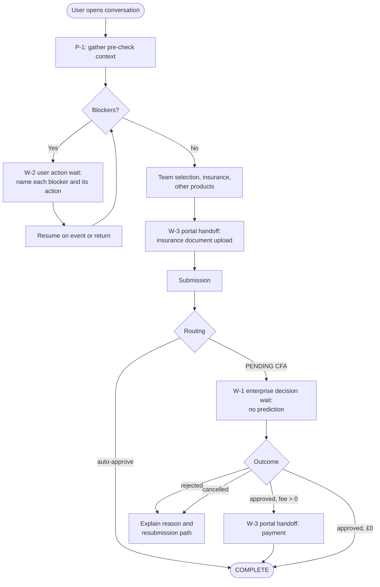

# ADR-D1-08 — Conversational journey design principles and human-in-the-loop touchpoints

## 1. Summary

The conversational journey is designed around four principles — surface blockers before they
block, never leave a wait unexplained, hand off deliberately rather than by failure, and make
every wait resumable. Three classes of human-in-the-loop touchpoint are distinguished, because
they behave differently: enterprise decision waits, user action waits, and portal handoffs.

## 2. Context and Problem Statement

The affiliation flow is not a form. It is a process with three kinds of pause built into it,
and a conversational layer that treats all three the same will handle at least two of them
badly.

**Enterprise decision waits.** A PENDING CFA application waits for a county officer, for hours
or days. Nothing the user does advances it. The platform's job is to explain the wait, set
expectations about it, and be there when it resolves.

**User action waits.** A Phase 1 pre-check failure — a missing DBS, an unassigned ground, an
overdue invoice — waits for the *user* to go and do something, some of it outside the
conversation entirely. The platform's job is to make the required action unambiguous and to
recognise when it has been done.

**Portal handoffs.** Insurance document upload happens in the Club Portal. Payment happens in
the Payments tab. These are not failures of the conversation; they are steps the conversation
cannot perform and should not try to.

2. PFF-FA-AI-ARCHITECTURE-DETAILED.md §29 covers HIL architecture and 20.PFF-FA-AI-GOVERNANCE.md §68–§71 covers HIL governance, but both address
the enterprise-decision case — the CFA review. Neither addresses user-action waits or portal
handoffs, which in the affiliation flow are more frequent.

The design problem this creates is specific. A conversational assistant that cannot distinguish
"I am waiting for someone else" from "you need to do something" from "this happens elsewhere"
produces a characteristic failure: it says something vague and hopeful, the user waits for
nothing to happen, and the application sits in IN PROGRESS until the 31 May timer cancels it.
Scenario 12 exists in the flow because that outcome is common enough to have needed a timer.

There is a second design question the flow raises. The Phase 1 pre-check runs *before* an
application is created and blocks with a banner listing failures across officials,
safeguarding, ground, league and debt. That banner is where users abandon. A conversational
layer could either narrate the same blocker at the same moment, or gather the same information
and surface it *before* the user commits to starting — which changes the journey's shape
rather than its wording.

## 3. Decision Drivers

### 3.1 Functional drivers

| ID | Driver | Source |
|---|---|---|
| DR-F-01 | The user must always know who or what the workflow is waiting for | `CLAUDE.md` persona rule 8; 20.PFF-FA-AI-GOVERNANCE.md §68 |
| DR-F-02 | Blockers must be surfaced with the action that resolves each | Affiliation Phase 1 |
| DR-F-03 | Portal handoffs must use registered links, never generated ones | 12 PFF-FA-AI-PORTAL-LINKS.md; ADR-D2-19 |
| DR-F-04 | Every wait must be resumable across sessions and runtime restarts | 2. PFF-FA-AI-ARCHITECTURE-DETAILED.md §29; ADR-D2-10 |
| DR-F-05 | Handoff to a human must be a deliberate action, not a fallback from failure | 20.PFF-FA-AI-GOVERNANCE.md §69 |
| DR-F-06 | The platform must not predict or pre-empt an enterprise human decision | 20.PFF-FA-AI-GOVERNANCE.md §70; `CLAUDE.md` persona rule 9 |

### 3.2 Non-functional drivers

| ID | Driver | Target | Source |
|---|---|---|---|
| DR-N-01 | A resumed conversation must reflect current enterprise state, not state at suspension | 100% refresh on resume | ADR-D1-03 §7.3 |
| DR-N-02 | Blocker surfacing must not require an unbounded number of enterprise calls | Bounded by the workflow's context requirements | ADR-D2-08 |
| DR-N-03 | Journeys must be evaluable against fixed expectations | Every touchpoint has a golden case | ADR-D7-13 |

### 3.3 Constraints

| ID | Constraint | Type | Source |
|---|---|---|---|
| DR-C-01 | The platform decides no enterprise outcome and must not anticipate one | Platform | ADR-D1-01 §7.2 |
| DR-C-02 | Portal URLs come only from the registry | Platform | ADR-D2-19 |
| DR-C-03 | Human decision authority is enterprise-owned | Organisational | 20.PFF-FA-AI-GOVERNANCE.md §70 |
| DR-C-04 | Some required actions occur entirely outside the platform's visibility | Platform | Affiliation Phase 1 (DBS applications, ground agreements) |

### 3.4 Assumptions

| ID | Assumption | If false | Validation |
|---|---|---|---|
| DR-A-01 | Pre-check data is obtainable before an application is created | Early blocker surfacing is impossible and the journey reverts to narrating the Phase 1 banner | ADR-D2-14 integration matrix |
| DR-A-02 | Completion of a user action is observable, by event or by refresh | The platform cannot recognise resolution and must ask the user | Event catalogue review |
| DR-A-03 | Users return to a suspended conversation rather than starting a new one | Resumption is rarer than designed for; notification design compensates | Measured post-launch |

## 4. Evaluation Criteria and Weights

| ID | Criterion | Weight | Rationale | Measurement |
|---|---|---|---|---|
| EC-01 | Reduction in abandonment | 30 | Abandonment at a blocker is the primary business failure per ADR-D1-04 §7.1 | Does the journey shape reduce the abandonment points? |
| EC-02 | Clarity of who is waited on | 25 | The characteristic failure in §2; `CLAUDE.md` persona rule 8 makes it mandatory | Can the user always name the next actor? |
| EC-03 | Resumability | 20 | A wait that cannot resume is an abandonment with extra steps | Does every wait survive session end and restart? |
| EC-04 | Honesty at uncertainty | 15 | Predicting a CFA outcome would breach DR-C-01 and mislead the user | Does the journey avoid anticipating enterprise decisions? |
| EC-05 | Implementation cost | 10 | Real but subordinate | Enterprise calls and complexity added |
| | **Total** | **100** | | |

Scoring scale: **1** unacceptable · **2** poor · **3** adequate · **4** good · **5** excellent.

## 5. Alternatives Considered

### 5.1 Option A — Mirror the portal flow conversationally

**Description.** The conversation follows the portal's phase order exactly: start, hit the
pre-check, report failures, proceed. Same sequence, conversational surface.

**Strengths.**
- Simplest to build and to reason about; the flow document is the design.
- Perfectly consistent with the portal, so users switching between them are never surprised.
- No additional enterprise calls beyond what the portal itself makes.
- Easy to validate against the 32 scenarios.

**Weaknesses.**
- Preserves the abandonment point rather than removing it. The user still meets the blocker
  after committing to start, having been given no earlier warning (EC-01).
- The conversational layer adds wording but not value at the single moment that matters most.
- Fails to use the one advantage a conversation has over a form: it can gather and reason
  about context before the user commits.

**Cost / effort.** Low.

### 5.2 Option B — Surface blockers before commitment; explicit wait taxonomy

**Description.** Before the user starts, the platform gathers the pre-check context and
surfaces what would block, with the resolving action for each. Waits are classified into the
three types in §2, each with its own communication pattern and resumption mechanism. Portal
handoffs are deliberate, registered and expected to return.

**Strengths.**
- Moves the blocker from after commitment to before it, which is where it can be acted on
  without the user having failed at something (EC-01).
- The wait taxonomy makes "who are we waiting for?" answerable by construction, since each
  type carries the actor (EC-02).
- Each wait type gets the right resumption mechanism — event, refresh, or return (EC-03).
- Enterprise decision waits are explicitly the type where no prediction is permitted (EC-04).

**Weaknesses.**
- Requires pre-check context before an application exists (DR-A-01), which may not be
  available through existing APIs.
- More enterprise calls up front, some of which are wasted if the user does not proceed.
- Three wait types is more design and more evaluation surface than one.
- Surfacing a blocker early can read as discouraging — "here is everything wrong with your
  club" before the user has asked to start.

**Cost / effort.** Moderate.

### 5.3 Option C — Proactive: initiate contact when a blocker or window event occurs

**Description.** Option B, plus the platform initiates — notifying a club when the affiliation
window opens, when a DBS is due to expire, when an invoice approaches its overdue date.

**Strengths.**
- Highest potential impact on abandonment: the blocker is resolved before the season starts.
- Aligns with the affiliation flow's own notification model, which already emails at seven
  trigger points.
- Turns the platform from reactive to genuinely useful between windows.

**Weaknesses.**
- Substantially wider scope: requires a notification channel, consent handling, scheduling and
  contact-preference management.
- Scheduling is enterprise-owned per ADR-D1-01 §7.2 — the platform must not implement enterprise
  scheduled processing, so proactive triggers must originate as enterprise events.
- Unsolicited contact about a person's DBS expiry raises consent and safeguarding questions
  that are not trivial.
- Materially increases the first release's risk for a benefit that can be added later.

**Cost / effort.** High.

### 5.4 Option D — Conversation as guidance only; all action in the portal

**Description.** The conversation explains and advises; every state-changing action is a portal
handoff. The platform never submits, never pays, never selects.

**Strengths.**
- Very low risk: no state-changing tool calls, so no transaction uncertainty.
- Clean separation — the conversation cannot cause an incorrect enterprise action.
- Simple to build and to assure.

**Weaknesses.**
- Fails DR-F-01 in spirit: the workflow is never completed conversationally, so ADR-D1-04's
  BM-01 assisted completion cannot be measured meaningfully.
- Contradicts ADR-D1-05's rationale for choosing affiliation end to end — a guidance-only
  journey exercises none of the hard capabilities.
- Constant context-switching between conversation and portal is a worse experience than
  either alone.

**Cost / effort.** Low.

## 6. Evaluation Method and Decision Matrix

**Method.** Weighted scoring against §4. EC-01 assessed by mapping each option against the
affiliation flow's known abandonment points (Scenario 1 pre-check failure; Scenario 12 timer
cancellation of IN PROGRESS applications). EC-02 and EC-04 assessed against `CLAUDE.md` persona
rules 6, 8 and 9.

| Criterion | Weight | A: Mirror portal | B: Early blockers + taxonomy | C: Proactive | D: Guidance only |
|---|---|---|---|---|---|
| EC-01 Abandonment reduction | 30 | 2 | 4 | 5 | 2 |
| EC-02 Clarity of who is waited on | 25 | 3 | 5 | 5 | 3 |
| EC-03 Resumability | 20 | 3 | 5 | 5 | 2 |
| EC-04 Honesty at uncertainty | 15 | 4 | 5 | 5 | 5 |
| EC-05 Cost | 10 | 5 | 3 | 1 | 5 |
| **Weighted total** | **100** | **305** | **455** | **475** | **295** |

- **Option B:** (30×4) + (25×5) + (20×5) + (15×5) + (10×3) = 120 + 125 + 100 + 75 + 30 = **455**
- **Option C:** (30×5) + (25×5) + (20×5) + (15×5) + (10×1) = 150 + 125 + 100 + 75 + 10 = **475**

**Sensitivity.** C leads B by 20 points, on EC-01 alone, and loses badly on cost. C is
adopted **as the roadmap direction, not the first release**: its proactive triggers must
originate as enterprise events per ADR-D1-01 §7.2, which is a dependency the platform does not
control, and its consent and safeguarding implications for unsolicited DBS-expiry contact need
Compliance/Legal treatment that would delay Phase 23. B is the decision now; C is recorded in
ADR-D8-08's extensibility roadmap and reachable without rework, because B's wait taxonomy is
the same machinery a proactive trigger would resume into.

## 7. Decision

### 7.1 Four journey principles

**P-1 — Surface blockers before commitment.** Where pre-check context is obtainable, the
platform gathers it and surfaces what would block *before* the user starts, with the specific
action that resolves each. The framing is preparatory, not judgemental: this is what the season
needs, here is where you stand.

**P-2 — Never leave a wait unexplained.** Every pause names the actor, the expected duration
where known, and what happens next. `CLAUDE.md` persona rule 8 permits football language for
waits; it does not permit vagueness about who is being waited on.

**P-3 — Hand off deliberately.** A portal handoff is a designed step with a registered link,
a stated purpose and an expected return — not a fallback when the conversation cannot proceed.
A handoff caused by platform failure is a different thing and is communicated as such.

**P-4 — Every wait is resumable.** No wait depends on the user keeping a session, a tab or a
device. State is durable per ADR-D2-10, and resumption refreshes enterprise state per DR-N-01
rather than restoring what was true at suspension.

### 7.2 Three wait types

| Type | Waiting on | Resolution signal | Communication | Prediction |
|---|---|---|---|---|
| **W-1 Enterprise decision** | A person in the enterprise — CFA officer review, override, offline payment marking | Enterprise event | Name the reviewing body, the typical window, and what each possible outcome means | **Forbidden.** No likelihood, no expectation-setting about which way it will go |
| **W-2 User action** | The user, often outside the platform — obtain a DBS, assign a ground, join a league, clear a debt | Event where available; otherwise refresh on the user's return | Name the specific action, where it is done, and what changes when it is | Permitted to state what the check requires — that is enterprise-published fact, not prediction |
| **W-3 Portal handoff** | The user, in a known portal location — upload an insurance document, pay an invoice | Event, or return to conversation | Registered link, stated purpose, explicit invitation to return | Permitted to state what the portal step does |

The distinction between W-1 and W-2 is the one that most often gets lost, and it is the one
that matters most. In W-1 the user can do nothing; telling them to "check back" is the only
honest instruction. In W-2 the user is the blocker; leaving that ambiguous produces Scenario
12's timer cancellations.

### 7.3 W-1 and the prohibition on prediction

For an enterprise decision wait, the platform states:

- who is reviewing, and what they are reviewing;
- the typical timescale, where the enterprise publishes one;
- what each possible outcome means for the club — approve with fee, approve at £0, reject,
  cancel — as enumerated in the affiliation flow's Phase 6;
- what the user should do meanwhile, which is usually nothing.

It does not state, imply, or allow the persona's optimism to suggest a likely outcome. This
follows from DR-C-01 and 20.PFF-FA-AI-GOVERNANCE.md §70, and it has a persona consequence recorded in ADR-D1-09:
the football register is available for the *waiting*, not for the *outcome*. "The referee's
having a look at this one" is acceptable. "Should be a formality" is not, because the platform
does not know that and the CFA has not decided.

### 7.4 The affiliation journey

Every pause in the journey is one of the three types. That is the taxonomy's purpose: there is
no unclassified wait, so there is no wait without a communication pattern.

### 7.5 Handoff versus failure

Two things that look similar to a user and must not be communicated the same way:

| | Deliberate handoff (P-3) | Platform failure |
|---|---|---|
| Cause | The step belongs elsewhere by design | The platform cannot proceed |
| Framing | "This part happens in the portal — here's the link" | "I can't retrieve that right now" |
| Link | Registered portal link for the specific step | Registered link to the relevant page, if useful |
| Persona | Normal register | Factual; `CLAUDE.md` persona rule 7 — the failure is explicit, never softened into metaphor |
| State | Workflow preserved, return expected | Workflow preserved, retry expected |

Conflating them teaches users that the platform breaks often, when in fact it is working as
designed.

**Status rationale.** Accepted. Tier 2d under ADR-D0-03 §7.1 — it shapes the user-facing
journey — ratified by the AI Product Owner.

## 8. Architecture Detail

### 8.1 Wait type to mechanism

| Wait type | Suspension | Resumption | ADR |
|---|---|---|---|
| W-1 Enterprise decision | Durable workflow state; conversation may end entirely | Service Bus event → workflow resume → ERC refresh | ADR-D2-10, ADR-D2-16 |
| W-2 User action | Durable workflow state; blocker set recorded | Event where published; otherwise ERC refresh on the user's return, re-evaluating the blocker set | ADR-D2-10, ADR-D4-06 |
| W-3 Portal handoff | Durable workflow state; expected return point recorded | Event (document uploaded, payment confirmed) or user return | ADR-D2-19 |

All three use the same durable-state machinery. They differ in the resumption signal, which is
why classifying them matters at design time and not at implementation time.

### 8.2 Blocker surfacing under P-1

The Phase 1 pre-check spans officials, team officials, safeguarding and DBS validity,
suspension status, ground assignment, league membership and debt. P-1 gathers these as ERC
context requirements (ADR-D2-12) and presents them as a readiness picture rather than a
failure list.

Two properties matter:

- **Each blocker names its resolving action.** "Two youth-team coaches need current DBS
  clearance" is actionable. "Safeguarding check failed" is not.
- **The check result is the enterprise's, not the platform's.** The platform does not evaluate
  whether a DBS is valid; it reads the check outcome and explains it. This is ADR-D1-01 §7.3's
  prohibition on independent compliance decisions applied at the journey's most tempting point
  to breach it.

### 8.3 Resumption refreshes rather than restores

On resumption the platform refreshes enterprise state rather than restoring what was true at
suspension. A user returning after three days to a PENDING CFA application may find it
INVOICED, REJECTED or CANCELLED by the 31 May timer. Restoring the suspended view would
present authority-4 ERC as current, which ADR-D1-03 §7.3 forbids.

The user-visible consequence: the platform picks up where the *workflow* is, not where the
*conversation* left off. Those differ, and the difference is the point.

## 9. Consequences

### 9.1 Positive

- The primary abandonment point moves from after commitment to before it, where the user has
  not yet failed at anything.
- Every wait names its actor, so `CLAUDE.md` persona rule 8 is satisfiable by construction.
- W-1's prohibition on prediction is explicit, closing the most likely route by which the
  persona's optimism could imply an enterprise decision.
- Handoffs are distinguishable from failures, so the platform does not appear unreliable when
  it is working correctly.
- The taxonomy gives evaluation fixed targets: each type has an expected communication pattern.

### 9.2 Negative

- P-1 costs enterprise calls before the user commits, some wasted on users who do not proceed.
- Early blocker surfacing can read as discouraging; framing carries a real burden and is a
  persona risk (RSK-03).
- Three wait types triple the evaluation surface relative to a single generic wait.
- Depends on pre-check context being available pre-application (DR-A-01), which may force a
  fallback to Option A's shape for some checks.

### 9.3 Neutral

- Proactive contact (Option C) is deferred, not rejected; the taxonomy is the machinery it
  would use.
- Portal handoffs remain part of the journey; the platform does not attempt document upload or
  payment.

### 9.4 Trade-offs explicitly accepted

| Given up | In exchange for | Accepted by |
|---|---|---|
| Enterprise calls on users who do not proceed | Blockers surfaced before commitment | AI Platform Owner |
| Reassurance about likely CFA outcomes | Never implying a decision the enterprise has not made | Compliance/Legal |
| A single generic wait pattern | Communication that fits what is actually being waited on | AI Product Owner |
| Proactive value in the first release | A deliverable Phase 23 | Business Owner |

## 10. Golden-Rule and Precedence Conformance

| Constraint | Conformance |
|---|---|
| Enterprise decides; AI orchestrates | §7.3's prohibition on predicting a W-1 outcome is this rule at the journey's sharpest point. §8.2 keeps blocker evaluation with the enterprise; the platform explains results it did not compute. |
| Authoritative-truth precedence | §8.3: resumption refreshes rather than restores, so a suspended authority-4 view is never presented as current. |
| Four-state separation | The journey exposes all four: conversation across turns, session across handoffs, workflow across suspension, enterprise state as the thing being waited on. |
| Versioned artefacts, never mutated in place | Journey definitions live in versioned workflow configuration per ADR-D5-06. |
| Adam persona governs how, never what | §7.3 draws the line precisely: the football register applies to the waiting, never to the outcome. |

## 11. Risks and Mitigations

| ID | Risk | Likelihood | Impact | Exposure | Mitigation | Owner | Residual |
|---|---|---|---|---|---|---|---|
| RSK-01 | Pre-check context unavailable before application creation (DR-A-01) | Medium | High | High | Integration matrix mapped before Phase 23; where unavailable, that check falls back to Option A's timing and is stated as such | AI Platform Owner | Medium |
| RSK-02 | W-1 communication implies a likely outcome through persona optimism | Medium | High | High | §7.3 explicit; ADR-D1-09 persona constraint; golden cases test W-1 wording; QM-03 | AI Product Owner | Medium |
| RSK-03 | Early blocker surfacing reads as discouraging and deters users | Medium | Medium | Medium | Readiness framing rather than failure framing; persona evaluation includes P-1 openings; measured by BM-02 | AI Product Owner | Medium |
| RSK-04 | W-2 resolution unobservable, so the platform cannot recognise the blocker cleared (DR-A-02) | Medium | Medium | Medium | Refresh on user return re-evaluates the blocker set; where no event exists, the platform asks rather than assumes | AI Engineering Lead | Low |
| RSK-05 | Users do not return to suspended conversations (DR-A-03) | Medium | Medium | Medium | Enterprise notifications already fire at seven trigger points; resumption works from a fresh conversation because state is workflow-bound, not conversation-bound | AI Product Owner | Low |
| RSK-06 | Handoffs communicated as failures, eroding trust | Medium | Medium | Medium | §7.5 table; distinct message templates; persona evaluation distinguishes them | AI Product Owner | Low |

## 12. Quantitative Targets and Measures

| ID | Measure | Target | Threshold (alert) | Source | Review cadence |
|---|---|---|---|---|---|
| QM-01 | Waits communicated without naming the actor | 0 | ≥1 | Evaluation suite across all three wait types | Per release |
| QM-02 | Conversations reaching a wait with no resumption path | 0 | ≥1 | Workflow state audit | Weekly |
| QM-03 | W-1 responses containing outcome likelihood language | 0 | ≥1 | Evaluation suite; guardrail check | Per release |
| QM-04 | Blockers surfaced before commitment, as a share of blockers encountered | ≥80% | <50% | Conversation traces against pre-check results | Monthly |
| QM-05 | Suspended workflows resumed within their natural window | Rising | Falling for 2 quarters | Workflow state records | Quarterly |
| QM-06 | Handoffs communicated with failure framing | 0 | ≥1 | Evaluation suite | Per release |

## 13. Security, Privacy and Compliance Impact

| Dimension | Impact |
|---|---|
| Attack surface change | Portal handoffs use registered links only (DR-C-02), so the journey introduces no URL-based surface. |
| Data classification touched | Personal and special-category — P-1 blocker surfacing involves officials' DBS and safeguarding status. |
| Personal data / PII | P-1 surfaces personal data about officials to a club administrator within their archetype scope (ADR-D1-07 §7.2). Only the check outcome and the required action are surfaced, never underlying certificate detail. |
| Children's data and safeguarding | Significant. P-1 will routinely surface that a named coach on an under-18 team lacks current clearance. This must be communicated as a compliance requirement and an action, never as a judgement about the person, and never in the football-commentary register — ADR-D1-09 §7 carries that constraint. The check outcome is the enterprise's; the platform relays it. |
| UK GDPR lawful basis and rights impact | Processing on the enterprise's basis. P-1's early surfacing does not widen the data set — it changes when the same data is shown, within the same entitlement. |
| Audit and evidential requirements | Wait type, actor and resumption signal recorded per suspension, giving an auditable account of what the user was told and when. |
| Standards touched | ISO/IEC 42001 (human oversight, transparency); NIST AI RMF GOVERN 5.2, MEASURE 2.9; EU AI Act Art. 14 (human oversight) — W-1's prohibition on prediction preserves the human decision-maker's authority in substance, not just in form. |

## 14. Implementation Impact

| Aspect | Detail |
|---|---|
| Build phases | 13 (portal links), 23 (affiliation journey) |
| Repository paths | `src/pff_fa_ai/agents/affiliation/`, `src/pff_fa_ai/portal_links/`, `src/pff_fa_ai/application/workflows/` |
| Configuration | `config/base/workflows.yaml` — wait types per workflow step; portal link registry |
| Contracts / schemas | Wait-type value on workflow state; resumption signal contract |
| Migration | None |
| Dependencies on other ADRs | ADR-D2-10 (durable state), ADR-D2-16 (events), ADR-D2-19 (portal links), ADR-D1-07 (archetype scoping) |
| Effort estimate | Moderate — the taxonomy is design; the mechanisms exist for other reasons |

## 15. Validation and Verification

| ID | Acceptance criterion | Verification method |
|---|---|---|
| AC-01 | Every wait in the affiliation journey is classified W-1, W-2 or W-3 | Workflow configuration audit |
| AC-02 | Every wait response names the actor | Evaluation suite; QM-01 |
| AC-03 | No W-1 response contains outcome likelihood language | Evaluation suite plus guardrail; QM-03 |
| AC-04 | A conversation suspended at any wait resumes with refreshed enterprise state | Resumption test across all three types |
| AC-05 | A blocker resolved outside the platform is recognised on return | W-2 refresh test |
| AC-06 | Portal handoffs use registry links and are framed distinctly from failures | Portal link test; QM-06 |
| AC-07 | A safeguarding blocker is surfaced as a requirement and action, without characterisation of the person | Persona evaluation case |

## 16. Operational Impact

| Aspect | Detail |
|---|---|
| Monitoring | Wait entries and exits traced with type and duration; blocker sets recorded |
| Alerting | Waits exceeding expected duration; resumption failures |
| Runbook | `docs/runbooks/service-bus-dlq.md` for missed resumption events |
| Failure mode and degradation | A missed resumption event leaves a workflow suspended past its window. Detected by QM-02 and by wait-duration alerting; reconciliation per ADR-D2-18. |
| Rollback | P-1 early surfacing can be disabled by configuration, reverting that step to Option A's timing without affecting the wait taxonomy |
| Support model impact | Support needs visibility of suspended workflows and their wait type to answer "why has nothing happened?" |

## 17. Cost Impact

| Cost element | One-off | Recurring | Basis |
|---|---|---|---|
| Journey design and wait taxonomy | ~2 days | — | This record plus workflow configuration |
| P-1 pre-commitment enterprise calls | — | Calls on conversations that do not proceed | Bounded by the pre-check context requirement set |
| Evaluation across three wait types | — | Tripled wait-case golden set | ADR-D7-13 |
| Avoided cost | — | Ongoing | Scenario 12 timer cancellations represent wholly wasted club and county effort |

## 18. Revisit Triggers and Causal Analysis Hooks

| ID | Trigger | Detected by | Action on trigger |
|---|---|---|---|
| RT-01 | QM-04 shows under 50% of blockers surfaced pre-commitment | Monthly review | DR-A-01 is failing; re-evaluate which checks can move earlier |
| RT-02 | QM-03 records outcome-likelihood language in a W-1 response | Per release | Persona and guardrail correction; this is a DR-C-01 breach |
| RT-03 | BM-02 abandonment does not improve after P-1 is live | Quarterly review | The blocker was not the abandonment cause, or framing is deterring users (RSK-03) |
| RT-04 | QM-05 resumption rate falls for two quarters | Quarterly review | DR-A-03 failing; strengthen notification or re-entry design |
| RT-05 | Enterprise publishes proactive event triggers | Enterprise roadmap | Option C becomes reachable; extend via ADR-D8-08 |
| RT-06 | A new wait type appears that fits none of W-1, W-2, W-3 | Workflow onboarding | Extend the taxonomy; an unclassified wait must not ship |

**Scheduled review:** 2027-02-21.

## 19. Traceability

| Dimension | Reference |
|---|---|
| Workshop sheet | WS-04 Personas & User Journey Mapping |
| Specification sections | affiliation flow Phases 1, 3, 5, 6, 10, Scenario 12, Notification Summary; 2. PFF-FA-AI-ARCHITECTURE-DETAILED.md §29 (HIL Architecture); 20.PFF-FA-AI-GOVERNANCE.md §68 (Human Oversight), §69 (HIL Boundary), §70 (Human Decision Authority), §71 (HIL Evidence); 12 PFF-FA-AI-PORTAL-LINKS.md (Portal Links); `Examples/SampleWorkflowchat.md` |
| Requirement IDs | Per ADR-D1-12 |
| Build phases | 13, 23 |
| Code paths | `src/pff_fa_ai/agents/affiliation/`, `src/pff_fa_ai/portal_links/`, `src/pff_fa_ai/application/workflows/` |
| Configuration | `config/base/workflows.yaml`; portal link registry |
| Tests | AC-01 to AC-07 |
| Upstream ADRs | ADR-D1-05, ADR-D1-07 |
| Downstream ADRs | ADR-D1-09, ADR-D2-10, ADR-D2-19, ADR-D3-07, ADR-D3-08, ADR-D6-14 |

## 20. Change Log

| Version | Date | Author | Change |
|---|---|---|---|
| 1.0.0 | 2026-08-21 | AI Product Owner | Initial decision recorded. Four journey principles; three wait types with distinct communication and resumption; prediction of enterprise decisions prohibited; proactive contact deferred to the roadmap. |
