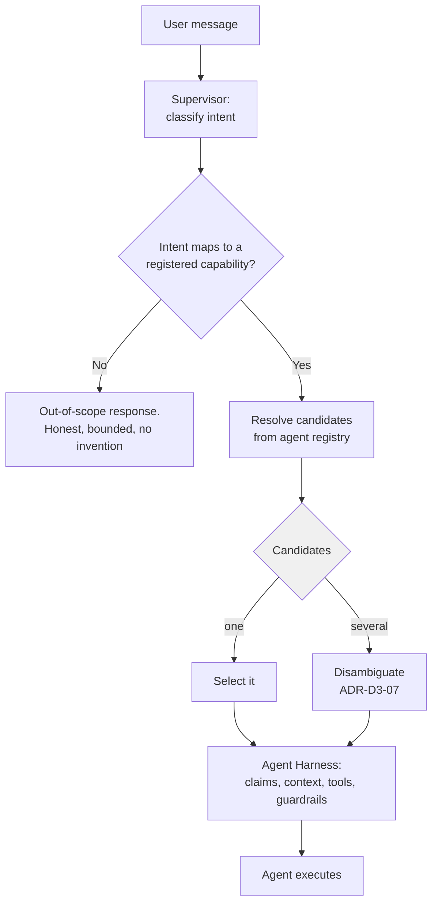

# ADR-D1-11 — Agent catalogue scope: `AffiliationAgent` only in the first pass

## 1. Summary

Exactly one agent is built: `AffiliationAgent`. The wider catalogue stays unfinalised, per doc 7
§6's own statement that it "will be finalized separately". The supervisor, agent contract and
harness are nonetheless built as if several agents existed, because retrofitting multi-agent
routing into a single-agent design is expensive and the interfaces cost little now.

## 2. Context and Problem Statement

Doc 7 §6 names seven agents and then states that the actual catalogue will be finalised
separately. The Foundation documents name eight capabilities, overlapping but not identical.
`DEVELOPMENT-GUIDE.md` §2 flags the discrepancy as a genuine reconciliation item and directs:
build only `AffiliationAgent`; defer the rest to a real product decision; do not invent it.

ADR-D1-10 handled the *workflow* side of this — a candidate catalogue with no commitment. This
decision handles the *agent* side, and the two are separate questions because an agent is a
runtime construct, not a business one. Deciding to build one agent has architectural
consequences that deciding to support one workflow does not.

The specific problem is a design trap. Building one agent invites building it as *the* agent:
the supervisor becomes a passthrough because there is nothing to route between; the agent
contract becomes affiliation's interface because there is nothing else to satisfy it; tool
registration becomes global because there is only one consumer. Each shortcut is locally
sensible and collectively produces a platform where adding agent two means rebuilding the
orchestration layer.

Doc 1 §39's twentieth success criterion is explicit that this must not happen: *"New
workflow-level agents can be added without redesigning the platform core."* Doc 2 §49's
extension model says the same. But a criterion about extensibility cannot be tested with one
agent — the test would pass trivially, and would keep passing until it mattered.

There is a countervailing risk. Building speculative multi-agent machinery for agents that may
never exist is the kind of over-engineering that `DEVELOPMENT-GUIDE.md` §2 is warning against
when it says not to invent the catalogue. The decision has to distinguish *interfaces that
admit multiple agents* — cheap, and required by doc 1 §39 — from *machinery for hypothetical
agents* — expensive, and speculative.

## 3. Decision Drivers

### 3.1 Functional drivers

| ID | Driver | Source |
|---|---|---|
| DR-F-01 | Only `AffiliationAgent` is built in the first pass | `DEVELOPMENT-GUIDE.md` §2 |
| DR-F-02 | New agents must be addable without redesigning the platform core | doc 1 §39 criterion 20; doc 2 §49 |
| DR-F-03 | Agents are logical capabilities in one runtime, not microservices | doc 2 §48; `CLAUDE.md` |
| DR-F-04 | An agent owns one business interaction, not one API | doc 7 §7 |
| DR-F-05 | The supervisor must route to a candidate agent, even when there is one candidate | doc 1 §39 criterion 2; doc 2 §9 |

### 3.2 Non-functional drivers

| ID | Driver | Target | Source |
|---|---|---|---|
| DR-N-01 | Adding agent two must not change orchestration code | 0 core changes | doc 1 §39 criterion 20 |
| DR-N-02 | Speculative machinery must be minimal | No component exists solely for a hypothetical agent | `DEVELOPMENT-GUIDE.md` §2 |
| DR-N-03 | The agent contract must be satisfiable by a second agent without amendment | Contract reviewed against a paper design of a second agent | Programme practice |

### 3.3 Constraints

| ID | Constraint | Type | Source |
|---|---|---|---|
| DR-C-01 | The agent catalogue is unfinalised and must not be invented | Organisational | doc 7 §6; `DEVELOPMENT-GUIDE.md` §2 |
| DR-C-02 | One microservice per agent is an anti-pattern unless independently justified | Platform | doc 2 §48 |
| DR-C-03 | Agents may not execute business rules, access databases, bypass tools, override authorization or execute unrestricted APIs | Platform | doc 7 §5 |
| DR-C-04 | Workflow two is not chosen until Phase 23 exit | Organisational | ADR-D1-10 §7.4 |

### 3.4 Assumptions

| ID | Assumption | If false | Validation |
|---|---|---|---|
| DR-A-01 | A second agent will eventually exist | The multi-agent interfaces are unused overhead — small, but real | ADR-D1-10 RT-06 |
| DR-A-02 | The agent contract derived from affiliation generalises to other workflows | The contract needs amendment at agent two, breaking DR-N-01 | Paper-design review per DR-N-03 |
| DR-A-03 | Single-agent routing is testable enough to give confidence in multi-agent routing | Routing bugs surface only at agent two | ADR-D3-05; synthetic second agent in tests |

## 4. Evaluation Criteria and Weights

| ID | Criterion | Weight | Rationale | Measurement |
|---|---|---|---|---|
| EC-01 | Extensibility without core redesign | 35 | Doc 1 §39 criterion 20 is a stated success criterion, not a preference | Would adding agent two change orchestration code? |
| EC-02 | Avoidance of speculative machinery | 25 | `DEVELOPMENT-GUIDE.md` §2 forbids inventing the catalogue; building for it is the same error | Does any component exist only for a hypothetical agent? |
| EC-03 | Delivery cost for the first pass | 20 | Phase 23 is already the largest phase | Effort added to build one agent |
| EC-04 | Testability of the extension claim | 12 | An untested extensibility claim is an assumption | Can extensibility be verified before agent two? |
| EC-05 | Fidelity to the specification's agent model | 8 | Doc 7 §7's granularity rule is binding | One agent per business interaction? |
| | **Total** | **100** | | |

Scoring scale: **1** unacceptable · **2** poor · **3** adequate · **4** good · **5** excellent.

## 5. Alternatives Considered

### 5.1 Option A — Single agent, single-agent design

**Description.** Build `AffiliationAgent` with no abstraction for other agents. The supervisor
is a passthrough; the agent contract is affiliation's interface; tools register globally.

**Strengths.**
- Lowest first-pass cost; nothing built that is not used.
- No speculative machinery whatsoever (EC-02).
- Simplest code to read and test.
- Fastest route to Phase 23 completion.

**Weaknesses.**
- Fails doc 1 §39 criterion 20 outright. Adding agent two would require rebuilding the
  supervisor, generalising the agent contract, and scoping the tool registry (EC-01).
- The rebuild lands at the worst time — when there is a second workflow to deliver and a first
  one in production.
- Extensibility is untestable, so the failure is discovered rather than predicted (EC-04).

**Cost / effort.** Lowest now; highest at agent two.

### 5.2 Option B — Single agent, multi-agent interfaces

**Description.** Build `AffiliationAgent` only, but define the agent contract, agent registry,
supervisor routing interface and per-agent tool allowlist as if several agents existed. No
second agent, no stubs, no placeholder implementations.

**Strengths.**
- Agent two is a registration plus an implementation; orchestration code is unchanged (EC-01).
- Interfaces are cheap — a contract, a registry, a scoping key — and each has a present-tense
  purpose in the single-agent case too (EC-02).
- Extensibility is testable with a synthetic test-only second agent, without shipping one
  (EC-04).
- Matches doc 7 §7's granularity: one agent, one business interaction (EC-05).

**Weaknesses.**
- Slightly more code than Option A, and a registry with one entry looks like ceremony.
- The contract is derived from one workflow and may not generalise (DR-A-02).
- Routing logic that never branches is hard to have confidence in.

**Cost / effort.** Low increment over Option A.

### 5.3 Option C — Build two agents to prove extensibility

**Description.** Build `AffiliationAgent` plus a second, minimal agent — a status enquiry agent,
say — purely to exercise multi-agent routing.

**Strengths.**
- Extensibility genuinely demonstrated rather than asserted (EC-04).
- Routing logic exercised on a real branch.
- Contract validated against two implementations (DR-A-02 tested).

**Weaknesses.**
- Contradicts DR-C-01 and DR-F-01: `DEVELOPMENT-GUIDE.md` §2 says build only
  `AffiliationAgent`, and a second agent chosen for demonstration rather than value is
  precisely the invention it forbids.
- Adds a real agent to maintain, evaluate, guardrail and support for no user benefit.
- Pre-empts ADR-D1-10 §7.4's choice of workflow two by building something adjacent to it.

**Cost / effort.** Materially higher; ongoing maintenance for no value.

### 5.4 Option D — Agent-per-microservice decomposition

**Description.** Decompose affiliation into several fine-grained agents — a club agent, a team
agent, an officials agent — routed by the supervisor.

**Strengths.**
- Exercises multi-agent routing immediately and genuinely.
- Each agent is small and independently testable.
- Natural mapping to enterprise services.

**Weaknesses.**
- Directly violates doc 7 §7: "one agent = one API" is the anti-pattern it names, against "one
  agent = one business interaction" (EC-05 fails).
- Fragments a single user interaction across agents, so conversation coherence becomes a
  routing problem that should not exist.
- Doc 2 §48 lists one-microservice-per-agent as an anti-pattern; this is its logical
  counterpart inside the runtime.
- Multiplies harness, prompt and evaluation surface for one workflow.

**Cost / effort.** High, with a worse result.

## 6. Evaluation Method and Decision Matrix

**Method.** Weighted scoring against §4. EC-01 assessed by tracing, for each option, exactly
which files would change to add a hypothetical `RegistrationAgent`. EC-02 assessed by asking
whether each component introduced has a purpose in the single-agent case.

| Criterion | Weight | A: Single-agent design | B: Multi-agent interfaces | C: Two agents | D: Agent per service |
|---|---|---|---|---|---|
| EC-01 Extensibility | 35 | 1 | 5 | 5 | 3 |
| EC-02 No speculative machinery | 25 | 5 | 4 | 2 | 1 |
| EC-03 First-pass cost | 20 | 5 | 4 | 2 | 1 |
| EC-04 Testability of extension | 12 | 1 | 4 | 5 | 4 |
| EC-05 Fidelity to agent model | 8 | 4 | 5 | 4 | 1 |
| **Weighted total** | **100** | **304** | **447** | **370** | **216** |

- **Option B:** (35×5) + (25×4) + (20×4) + (12×4) + (8×5) = 175 + 100 + 80 + 48 + 40 = **447**

**Sensitivity.** B leads A by 143 points and C by 77. Against A, the entire margin is EC-01,
where A scores 1 — A's cost advantage on EC-02 and EC-03 is real but small in absolute terms
because the interfaces B adds are genuinely cheap. Against C, B wins on EC-02 and EC-03 and
loses only one point on EC-04, which §7.3's synthetic-agent approach recovers without shipping
a second agent. C is in any case excluded by DR-C-01. D is excluded by doc 7 §7 regardless of
score.

## 7. Decision

**Exactly one agent is built: `AffiliationAgent`.** The orchestration layer is built to
multi-agent interfaces.

### 7.1 What is built

| Component | Built as | Present-tense justification (not speculative) |
|---|---|---|
| `AffiliationAgent` | One agent, one business interaction, per doc 7 §7 | The committed workflow |
| Agent contract | An interface an agent implements — capability declaration, intent surface, tool requirements, context requirements | Defines what the harness may assume; needed even with one agent |
| Agent registry | Agents registered by name and capability; the supervisor resolves candidates from it | Configuration-driven agent enablement per environment; needed for the enable/disable rollback in ADR-D1-05 §16 |
| Supervisor routing | Intent → candidate agents → selection | Doc 1 §39 criterion 2 requires routing; also handles out-of-scope intents, which exist from day one |
| Per-agent tool allowlist | Tools scoped by agent, not global | Required by ADR-D1-02 invariant I-3 and ADR-D1-07's archetype scoping regardless of agent count |
| Per-agent prompt layers | Prompts parameterised by agent | Required by ADR-D3-09's composition model |
| Per-agent evaluation | Golden cases scoped by agent | Required by ADR-D7-13 |

Every row has a reason to exist with one agent. That is the test applied to keep Option B from
drifting into Option C: **no component is built solely because a second agent might arrive.**

### 7.2 What is not built

- No second agent, real or stubbed.
- No agent-to-agent handoff protocol. Doc 7's model is supervisor-routed, not agent-chained;
  a handoff protocol would be speculative machinery for an interaction pattern the
  specification does not describe.
- No cross-agent shared conversation state beyond what the four-state model already defines.
- No agent capability negotiation or dynamic discovery. Registration is static configuration.
- No separate deployable per agent — DR-C-02 and doc 2 §48 forbid it absent a specific
  operational justification, and none exists.

### 7.3 Testing the extension claim without shipping a second agent

Doc 1 §39 criterion 20 needs verification, and one agent cannot verify it. A **test-only
synthetic agent** exists in the test suite: a minimal implementation of the agent contract, with
one intent and one tool, registered only in tests.

This is not a second agent in the Option C sense. It ships to no environment, has no prompts, no
evaluation set, no guardrail configuration and no user-facing behaviour. Its entire purpose is
to assert that:

- the registry holds two agents and the supervisor routes between them;
- the agent contract is satisfiable by an implementation that is not affiliation;
- tool allowlists scope correctly per agent;
- adding it required no change to any file under `src/pf_ft_ai/orchestration/`.

That last assertion is DR-N-01 made executable, and it is the substantive reason this approach
was chosen over simply asserting extensibility in a document.

### 7.4 The supervisor with one agent

The supervisor is not a passthrough, and building it as one would be the shortcut this decision
exists to prevent. Even with a single agent it performs real work:

- classifying intent, which may be **out of scope** — a user asking about a discipline case has
  an intent no agent serves, and the response is a bounded, honest one, not a routing error;
- resolving candidate agents from the registry against the intent;
- selecting among candidates, which is trivially one today;
- rejecting requests where no agent's capability matches.

The out-of-scope path is the one that matters most in the single-agent case, and it is
exercised constantly: most of what users might ask about county football administration is not
affiliation. ADR-D3-05 carries the routing design; ADR-D3-07 carries the out-of-scope response.

### 7.5 When the catalogue is finalised

Not by this decision. The catalogue remains open per doc 7 §6 and DR-C-01. It is finalised when:

1. ADR-D1-10 §7.4's prioritisation is applied at Phase 23 exit; and
2. the enterprise makes the product decision `DEVELOPMENT-GUIDE.md` §2 defers to.

Adding an agent is then a new ADR — its own decision, with its own drivers — plus a registry
entry, a contract implementation, prompts, tools, guardrails and evaluation. Not an amendment
to this one.

**Status rationale.** Accepted. Tier 2d under ADR-D0-03 §7.1 — it determines what the platform
supports — ratified by the AI Product Owner. This decision **does not** finalise the catalogue,
which remains open by design.

## 8. Architecture Detail

### 8.1 Agent resolution

The `several` branch exists and is unreachable in production today. It is reachable in tests via
§7.3's synthetic agent, which is what keeps it correct rather than merely present.

### 8.2 What changes when agent two arrives

The deliverable of this decision is that this list is short and contains no orchestration code:

| Change | File |
|---|---|
| Implement the agent contract | `src/pf_ft_ai/agents/<new>/` |
| Register the agent | `config/base/agents.yaml` |
| Declare its tools | `config/base/tools.yaml`, `config/enterprise/tool-registry/` |
| Add its prompt layers | `prompts/` |
| Add its golden cases | `config/evaluation/golden/` |
| Add its workflow definition | `config/base/workflows.yaml` |

Nothing under `src/pf_ft_ai/orchestration/`. AC-03 asserts this, and §7.3's synthetic agent is
how it is asserted before agent two exists.

### 8.3 Agents are logical, not deployable

Per DR-C-02 and doc 2 §48, agents are capabilities inside one runtime. `AffiliationAgent` is a
module, not a service. The registry is in-process. Routing is a function call, not a network
hop.

Should a future agent genuinely require independent scaling — a GPU-bound agent, for instance —
that is a separate decision requiring its own ADR and the specific operational justification
doc 2 §48 demands. It is not a default and not a growth path.

## 9. Consequences

### 9.1 Positive

- Adding agent two touches no orchestration code, satisfying doc 1 §39 criterion 20.
- The extensibility claim is executable rather than asserted, via §7.3's synthetic agent.
- Every interface built has a present-tense purpose, so nothing is speculative.
- The supervisor's out-of-scope path is exercised from day one, which is the path most users
  will hit while only affiliation exists.
- The catalogue stays genuinely open, as `DEVELOPMENT-GUIDE.md` §2 requires.

### 9.2 Negative

- A registry with one entry and a routing branch that never taken in production look like
  ceremony to a reader unfamiliar with the rationale.
- The agent contract is derived from one workflow and may need amendment at agent two (DR-A-02),
  which would breach DR-N-01. The paper-design review in §15 AC-04 is the mitigation, and it is
  a review, not a proof.
- Some interface cost is incurred against DR-A-01, which may not hold.

### 9.3 Neutral

- Agents remain logical capabilities in one runtime; no deployment topology changes.
- The catalogue question is unchanged by this decision — it was open before and remains open.

### 9.4 Trade-offs explicitly accepted

| Given up | In exchange for | Accepted by |
|---|---|---|
| The simplicity of a single-agent design | No orchestration rebuild at agent two | AI Solution Architect |
| Genuine multi-agent validation from a real second agent | Not inventing a catalogue entry for demonstration purposes | AI Product Owner |
| Certainty that the contract generalises | Deferring the catalogue decision to when evidence exists | AI Platform Owner |

## 10. Golden-Rule and Precedence Conformance

| Constraint | Conformance |
|---|---|
| Enterprise decides; AI orchestrates | Doc 7 §5's prohibitions are the agent contract's boundary: an agent may not execute business rules, access databases, bypass tools, override authorization or execute unrestricted APIs. The contract encodes them. |
| Authoritative-truth precedence | Agents receive resolved context from the harness; they do not select among sources. ADR-D1-03 resolves precedence before the agent runs. |
| Four-state separation | Agent state is Workflow/Agent State, distinct from conversation, session and enterprise state. Per-agent scoping keeps it separated even as agents multiply. |
| Versioned artefacts, never mutated in place | Agent definitions, prompts and tool bindings are versioned per ADR-D5-06. |
| Adam persona governs how, never what | Persona is a prompt layer above the agent, not agent logic. An agent determines what to do; the persona layer determines how it is said. |

## 11. Risks and Mitigations

| ID | Risk | Likelihood | Impact | Exposure | Mitigation | Owner | Residual |
|---|---|---|---|---|---|---|---|
| RSK-01 | Multi-agent interfaces are bypassed in practice because there is one agent | Medium | High | High | §7.3's synthetic agent test fails if the registry or routing is bypassed; AC-03 asserts no orchestration change | AI Engineering Lead | Low |
| RSK-02 | Agent contract does not generalise (DR-A-02) | Medium | High | High | Paper-design review of the contract against a second candidate workflow before Phase 23 exit (AC-04) | AI Solution Architect | Medium |
| RSK-03 | Pressure to add a second agent before ADR-D1-10 §7.4's choice point | Medium | Medium | Medium | Adding an agent requires its own ADR; DR-C-01 and DR-C-04 cited | AI Product Owner | Low |
| RSK-04 | Supervisor built as a passthrough because there is one candidate | Medium | High | High | §7.4 enumerates the supervisor's real work; out-of-scope path tested from day one; ADR-D3-05 | AI Engineering Lead | Low |
| RSK-05 | Speculative machinery creeps in under an extensibility justification | Medium | Medium | Medium | §7.1's present-tense test applied at review; §7.2's explicit exclusions | AI Solution Architect | Low |
| RSK-06 | An agent is later given its own deployable without the doc 2 §48 justification | Low | Medium | Low | §8.3; a separate ADR required | AI Platform Owner | Low |

## 12. Quantitative Targets and Measures

| ID | Measure | Target | Threshold (alert) | Source | Review cadence |
|---|---|---|---|---|---|
| QM-01 | Agents built | 1 | ≥2 without a new ADR | `src/pf_ft_ai/agents/` inventory | Per release |
| QM-02 | Orchestration files changed when the synthetic agent is added in tests | 0 | ≥1 | Extensibility test; AC-03 | Per build |
| QM-03 | Components existing solely for hypothetical agents | 0 | ≥1 | Architecture review against §7.1's justification column | Per phase |
| QM-04 | Out-of-scope intents handled with a bounded honest response | 100% | <100% | Evaluation suite | Per release |
| QM-05 | Agent contract amendments required after Phase 23 | 0 | ≥1 | Contract change history | At agent two |
| QM-06 | Separate deployables per agent | 0 | ≥1 | Deployment manifest audit | Per release |

## 13. Security, Privacy and Compliance Impact

| Dimension | Impact |
|---|---|
| Attack surface change | Reduced relative to Option A. Per-agent tool allowlists mean a compromised or misdirected agent reaches only its own tools, which is a containment property that only exists because the scoping was built now. |
| Data classification touched | Affiliation's data classes only, per ADR-D1-05 §13. |
| Personal data / PII | Per-agent context scoping limits what any agent assembles, complementing ADR-D1-07's archetype scoping. |
| Children's data and safeguarding | Only `AffiliationAgent` touches safeguarding data, and only through the pre-check results. Limiting the catalogue to one agent limits safeguarding exposure to one reviewed, evaluated path — a real benefit of building one agent well rather than several thinly. |
| UK GDPR lawful basis and rights impact | None beyond affiliation's. |
| Audit and evidential requirements | Agent registry and per-agent scoping give a clear account of what each agent may reach. |
| Standards touched | ISO/IEC 42001 (AI system components and boundaries); ISO/IEC 27001 A.8.3 (information access restriction); NIST AI RMF MAP 2.1. |

## 14. Implementation Impact

| Aspect | Detail |
|---|---|
| Build phases | 4 (supervisor, agent contract, harness), 23 (`AffiliationAgent`) |
| Repository paths | `src/pf_ft_ai/agents/affiliation/`, `src/pf_ft_ai/orchestration/supervisor/`, `src/pf_ft_ai/orchestration/harness/` |
| Configuration | `config/base/agents.yaml` — one entry |
| Contracts / schemas | Agent contract; capability declaration; per-agent tool allowlist |
| Migration | None |
| Dependencies on other ADRs | ADR-D1-05 (affiliation committed), ADR-D1-10 (catalogue open), ADR-D3-02 (agentic style), ADR-D3-03 (contract) |
| Effort estimate | Small increment over a single-agent design; the interfaces are contracts and a registry |

## 15. Validation and Verification

| ID | Acceptance criterion | Verification method |
|---|---|---|
| AC-01 | Exactly one agent is registered in `config/base/agents.yaml` | Configuration audit; QM-01 |
| AC-02 | The synthetic test agent registers and routes correctly alongside `AffiliationAgent` | Extensibility test |
| AC-03 | Adding the synthetic agent changes no file under `src/pf_ft_ai/orchestration/` | Test asserts on the diff; QM-02 |
| AC-04 | The agent contract is reviewed against a paper design of a second candidate workflow | Design review record before Phase 23 exit |
| AC-05 | An out-of-scope intent produces a bounded honest response, not a routing error | Evaluation suite; QM-04 |
| AC-06 | Tool allowlists are agent-scoped, verified by a cross-agent access attempt in tests | Tool executor test |
| AC-07 | No component in §7.1 lacks a present-tense justification | Architecture review; QM-03 |

## 16. Operational Impact

| Aspect | Detail |
|---|---|
| Monitoring | Agent selection recorded per turn, including out-of-scope classifications |
| Alerting | Rising out-of-scope rate indicates demand for a workflow not yet built — a useful product signal, not an error |
| Runbook | None specific |
| Failure mode and degradation | Where no agent matches, the platform states plainly what it can help with. It does not attempt the request with the agent it has, which would breach ADR-D1-01's scope. |
| Rollback | The agent can be disabled by configuration, which is why the registry exists (§7.1) |
| Support model impact | Out-of-scope requests route to the portal or to county support |

## 17. Cost Impact

| Cost element | One-off | Recurring | Basis |
|---|---|---|---|
| Multi-agent interfaces over single-agent design | ~2 days | — | Contract, registry, scoping key |
| Synthetic test agent | ~0.5 day | Maintained with the contract | §7.3 |
| Avoided cost at agent two | — | Saving | Option A would require rebuilding supervisor, contract and tool scoping while a second workflow is in flight |

## 18. Revisit Triggers and Causal Analysis Hooks

| ID | Trigger | Detected by | Action on trigger |
|---|---|---|---|
| RT-01 | ADR-D1-10 §7.4's prioritisation selects workflow two | Phase 23 exit | New ADR for the second agent; this record is not amended |
| RT-02 | QM-02 shows orchestration changes when adding the synthetic agent | CI | Extensibility has regressed; fix before merge |
| RT-03 | AC-04's paper-design review finds the contract does not generalise | Design review | Amend the contract before Phase 23 exit, while there is one implementation to change |
| RT-04 | Out-of-scope rate rises sharply for one intent class | Monthly review | Product signal: that workflow has demand; feed into ADR-D1-10 §7.3's user-struggle criterion |
| RT-05 | The enterprise finalises the agent catalogue | Change notice | Reconcile; the enterprise decision governs |
| RT-06 | An agent is proposed for independent deployment | Architecture review | Requires its own ADR with doc 2 §48's operational justification |

**Scheduled review:** 2027-02-21, or at Phase 23 exit.

## 19. Traceability

| Dimension | Reference |
|---|---|
| Workshop sheet | WS-05 Enterprise Workflow Catalogue |
| Specification sections | doc 7 §5 (agent prohibitions), §6 (Workflow-Level Agent Responsibility — the seven examples and "finalized separately"), §7 (Why Workflow-Level Agents); doc 1 §10 (Workflow-level Agents), §39 criterion 20; doc 2 §9 (Supervisor Layer), §48 (Anti-Patterns), §49 (Extension Model); `DEVELOPMENT-GUIDE.md` §2 |
| Requirement IDs | Per ADR-D1-12 |
| Build phases | 4, 23 |
| Code paths | `src/pf_ft_ai/agents/affiliation/`, `src/pf_ft_ai/orchestration/supervisor/` |
| Configuration | `config/base/agents.yaml` |
| Tests | AC-01 to AC-07; extensibility test with synthetic agent |
| Upstream ADRs | ADR-D1-05, ADR-D1-10 |
| Downstream ADRs | ADR-D2-02, ADR-D3-02, ADR-D3-03, ADR-D3-05, ADR-D8-08 |

## 20. Change Log

| Version | Date | Author | Change |
|---|---|---|---|
| 1.0.0 | 2026-08-21 | AI Solution Architect | Initial decision recorded. One agent built, multi-agent interfaces adopted with a present-tense justification test; extensibility verified by a test-only synthetic agent rather than by shipping a second one. Catalogue remains open. |
