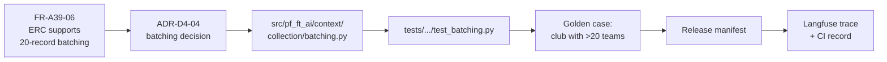

# ADR-D1-12 — Functional and non-functional requirements baseline and identifier traceability scheme

## 1. Summary

Requirements are identified by a scheme that names their **source** rather than a flat
sequence, and the baseline is derived from what the specifications already state rather than
re-elicited. 1 PF-FT-AI-ARCHITECTURE.md §39's twenty architecture success criteria become the functional baseline;
1 PF-FT-AI-ARCHITECTURE.md §38's eleven quality attributes become the non-functional baseline once each is given a
target, since 1 PF-FT-AI-ARCHITECTURE.md §38 lists the attributes and defers the numbers.

## 2. Context and Problem Statement

20.PF-FT-AI-GOVERNANCE.md §115 mandates a traceability chain: requirement → architecture → implementation → test →
evaluation → release → evidence. 20.PF-FT-AI-GOVERNANCE.md §116 makes it part of the governance definition of
done. Every ADR in this library carries a `Requirement IDs` row in its §19 traceability table.

None of those IDs exist. There is no requirements baseline, no identifier scheme, and no
statement of what a requirement *is* for this programme.

The specifications get most of the way there without quite arriving:

- **1 PF-FT-AI-ARCHITECTURE.md §39** gives twenty architecture success criteria, each a testable statement ("ERC
  supports 20-record batching", "Supervisor routes to the correct workflow agent"). These are
  functional requirements in all but name and identifier.
- **1 PF-FT-AI-ARCHITECTURE.md §38** lists eleven quality attributes — availability, reliability, scalability,
  performance, security, observability, maintainability, testability, versionability,
  recoverability, cost control — and then says, explicitly: *"Detailed targets will be defined
  in the NFR and performance documents."* The attributes are named; the numbers are deferred.
- **2. PF-FT-AI-ARCHITECTURE-DETAILED.md §50** defines "architecture complete" in similar terms.

So the gap is narrower than "no requirements exist". It is: the functional statements need
identifiers, the quality attributes need targets, and both need a scheme that makes 20.PF-FT-AI-GOVERNANCE.md
§115's chain navigable.

The identifier scheme is where the real decision lies. A flat sequence — `FR-001`, `FR-002` —
is conventional and loses the one piece of information that matters most in a programme with 29
specification documents and 136 ADRs: **where a requirement came from**. When a specification
section is amended, the question "which requirements does this change?" should be answerable by
inspection, not by search.

There is a scoping caution. Re-eliciting requirements from scratch would produce a fourth
statement of what the platform must do, alongside 1 PF-FT-AI-ARCHITECTURE.md §39, 2. PF-FT-AI-ARCHITECTURE-DETAILED.md §50 and this library, and
they would drift apart. The specifications are the requirements; what is missing is the
apparatus to trace them.

## 3. Decision Drivers

### 3.1 Functional drivers

| ID | Driver | Source |
|---|---|---|
| DR-F-01 | Every requirement must have a stable unique identifier | 20.PF-FT-AI-GOVERNANCE.md §115 |
| DR-F-02 | The chain requirement → architecture → implementation → test → evaluation → release → evidence must be navigable | 20.PF-FT-AI-GOVERNANCE.md §115 |
| DR-F-03 | Non-functional attributes must have measurable targets, not just names | 1 PF-FT-AI-ARCHITECTURE.md §38 |
| DR-F-04 | A specification amendment must identify the requirements it affects | Programme practice |
| DR-F-05 | Requirements must not be re-elicited, creating a competing statement | 1 PF-FT-AI-ARCHITECTURE.md §39; 2. PF-FT-AI-ARCHITECTURE-DETAILED.md §50 |

### 3.2 Non-functional drivers

| ID | Driver | Target | Source |
|---|---|---|---|
| DR-N-01 | Identifiers must be allocatable without central coordination | 0 collisions | ADR-D0-02 §4 EC-02 |
| DR-N-02 | The baseline must be maintainable by a small team | ≤1 day per quarter | Programme practice |
| DR-N-03 | Traceability must be verifiable mechanically | Broken links detectable by a script | 20.PF-FT-AI-GOVERNANCE.md §116 |

### 3.3 Constraints

| ID | Constraint | Type | Source |
|---|---|---|---|
| DR-C-01 | `MD files/` is the specification source of truth and is not modified | Organisational | `CLAUDE.md` |
| DR-C-02 | 1 PF-FT-AI-ARCHITECTURE.md §38 defers NFR targets to the NFR and performance documents | Organisational | 1 PF-FT-AI-ARCHITECTURE.md §38 |
| DR-C-03 | 1 PF-FT-AI-ARCHITECTURE.md §39's twenty criteria are the stated definition of architectural success | Organisational | 1 PF-FT-AI-ARCHITECTURE.md §39 |
| DR-C-04 | ADR IDs are domain-prefixed per ADR-D0-02; requirement IDs must not collide with them | Platform | ADR-D0-02 §7.1 |

### 3.4 Assumptions

| ID | Assumption | If false | Validation |
|---|---|---|---|
| DR-A-01 | 1 PF-FT-AI-ARCHITECTURE.md §39's criteria are complete enough to serve as the functional baseline | Gaps are added as programme-derived requirements under §7.2's `FR-P-` prefix | Coverage review at Phase 17 |
| DR-A-02 | NFR targets can be set from 26.PF-FT-AI-PERFORMANCE-COST.md and programme judgement without a separate elicitation | Targets are provisional until 26.PF-FT-AI-PERFORMANCE-COST.md is fully mined | Reviewed at Phase 20 |
| DR-A-03 | Specification sections are stable enough for source-anchored IDs to remain valid | Section renumbering breaks IDs; §7.4 handles this | Change notices on `MD files/` |

## 4. Evaluation Criteria and Weights

| ID | Criterion | Weight | Rationale | Measurement |
|---|---|---|---|---|
| EC-01 | Traceability chain navigability | 30 | 20.PF-FT-AI-GOVERNANCE.md §115 and §116 make this a governance obligation | Can the chain be walked in both directions? |
| EC-02 | Impact analysis on specification change | 25 | The most frequent real use: "what does this amendment affect?" | Can affected requirements be identified by inspection? |
| EC-03 | Avoidance of a competing requirements statement | 20 | A fourth statement of what the platform must do would drift | Does it restate or reference? |
| EC-04 | Maintenance cost | 15 | An unmaintained baseline misleads | Effort per quarter |
| EC-05 | Mechanical verifiability | 10 | Manual traceability review does not scale to 136 ADRs | Can links be checked by script? |
| | **Total** | **100** | | |

Scoring scale: **1** unacceptable · **2** poor · **3** adequate · **4** good · **5** excellent.

## 5. Alternatives Considered

### 5.1 Option A — Flat sequential identifiers with a separate requirements document

**Description.** `FR-001` … `FR-nnn`, `NFR-001` … `NFR-nnn`, held in a new requirements
specification that restates what the platform must do.

**Strengths.**
- Entirely conventional; every requirements tool expects it.
- Simple to allocate and to cite.
- A single document to review and approve.
- Familiar to auditors.

**Weaknesses.**
- The identifier carries no information. `FR-047` requires a lookup to learn anything (EC-02).
- Creates a fourth statement of platform requirements alongside 1 PF-FT-AI-ARCHITECTURE.md §39, 2. PF-FT-AI-ARCHITECTURE-DETAILED.md §50 and this
  library, which will drift (EC-03 fails).
- Central allocation, so concurrent authoring collides (DR-N-01).
- Restating specification content invites divergence from `MD files/`, which DR-C-01 makes the
  source of truth.

**Cost / effort.** Moderate to write; high to keep synchronised.

### 5.2 Option B — Source-anchored identifiers referencing the specifications

**Description.** Identifiers encode their origin: `FR-A39-01` for 1 PF-FT-AI-ARCHITECTURE.md §39 criterion 1,
`NFR-A38-PERF` for the performance attribute in 1 PF-FT-AI-ARCHITECTURE.md §38, `FR-P-nn` for requirements the
programme derives that no specification states. The baseline is a *mapping*, not a restatement:
each row cites the specification text rather than reproducing it.

**Strengths.**
- The identifier names its source, so impact analysis on a specification amendment is
  inspection rather than search (EC-02).
- No competing statement — the baseline references, and `MD files/` remains the source of truth
  (EC-03).
- Allocation is decentralised: an ID is determined by its source, not assigned by a registry
  (DR-N-01).
- Programme-derived requirements are visibly distinguished by the `-P-` prefix, so it is clear
  what the specifications state and what the programme added.
- No collision with ADR IDs, which use `ADR-D<n>-<nn>` (DR-C-04).

**Weaknesses.**
- Identifiers are longer and less uniform than a flat sequence.
- Fragile to specification renumbering (DR-A-03).
- Unfamiliar to auditors expecting `FR-001`.
- The mapping must be maintained as specifications change.

**Cost / effort.** Low one-off; low recurring.

### 5.3 Option C — ADR-anchored: requirements derived from and identified by ADRs

**Description.** Requirements are extracted from the ADR library itself, identified by the ADR
that states them — `REQ-D1-04-01` for the first requirement in ADR-D1-04.

**Strengths.**
- Perfect alignment with the decision library; every requirement has a rationale attached.
- No separate baseline to maintain.
- Decentralised allocation.
- Impact analysis on an ADR change is trivial.

**Weaknesses.**
- Inverts the correct dependency. Requirements should precede and justify decisions; deriving
  them from decisions means the requirement exists because the decision does (EC-01 weakens —
  the chain's first link becomes circular).
- 1 PF-FT-AI-ARCHITECTURE.md §39's criteria predate this library and would need reassigning to ADRs artificially.
- A requirement no ADR happens to mention would not exist.
- Makes it impossible to ask "does this decision satisfy its requirements?" independently.

**Cost / effort.** Low, with a structural flaw.

### 5.4 Option D — Requirements management tool with generated identifiers

**Description.** A dedicated tool holds requirements, generates identifiers, and maintains
traceability links to code, tests and decisions.

**Strengths.**
- Purpose-built traceability with automated link checking (EC-05).
- Standard reporting for audit.
- Handles versioning and baselines natively.
- Scales well beyond this programme's size.

**Weaknesses.**
- Introduces a system outside the repository, so requirements and code version independently —
  the problem ADR-D0-01 rejected for decisions applies equally here.
- Licence and administration cost for a baseline of roughly forty requirements.
- Still needs a mapping to `MD files/`, so it does not remove EC-03's risk.
- Traceability links to code would be maintained manually in the tool, which is where such
  links go stale.

**Cost / effort.** High relative to the baseline's size.

## 6. Evaluation Method and Decision Matrix

**Method.** Weighted scoring against §4. EC-02 tested against a concrete case: 8 PF-FT-AI-ERC-CONTEXT.md §36 fixes
the ERC batch size at 20 — if that section were amended, which requirements, ADRs, code paths
and tests are affected, and how quickly can each option answer?

| Criterion | Weight | A: Flat + document | B: Source-anchored | C: ADR-anchored | D: RM tool |
|---|---|---|---|---|---|
| EC-01 Chain navigability | 30 | 4 | 5 | 2 | 5 |
| EC-02 Impact analysis | 25 | 2 | 5 | 3 | 4 |
| EC-03 No competing statement | 20 | 1 | 5 | 4 | 2 |
| EC-04 Maintenance cost | 15 | 2 | 4 | 5 | 2 |
| EC-05 Mechanical verifiability | 10 | 3 | 4 | 4 | 5 |
| **Weighted total** | **100** | **255** | **470** | **330** | **375** |

- **Option B:** (30×5) + (25×5) + (20×5) + (15×4) + (10×4) = 150 + 125 + 100 + 60 + 40 = **470**

**Sensitivity.** B leads D by 95 points and A by 215. D is the only option that beats B on any
criterion (EC-05, by one point), and loses decisively on EC-03 and EC-04 for a baseline of this
size — a requirements management tool is the right answer at a scale this programme is not at.
C's flaw is structural rather than scored: deriving requirements from decisions makes the first
link of 20.PF-FT-AI-GOVERNANCE.md §115's chain circular, and no reweighting repairs that.

## 7. Decision

### 7.1 Identifier scheme

```
FR-<source>-<nn>      functional requirement
NFR-<source>-<attr>   non-functional requirement
```

`<source>` names where the requirement comes from:

| Source code | Origin |
|---|---|
| `A38` | 1 PF-FT-AI-ARCHITECTURE.md §38 — quality attributes |
| `A39` | 1 PF-FT-AI-ARCHITECTURE.md §39 — architecture success criteria |
| `AFF` | `MD files/0 Workflow/pff_affiliation_e2e_flow.md` |
| `GR` | The Golden Rule and its constraints (`CLAUDE.md`, 3. PF-FT-AI-RESPONSIBILITY-MATRIX.md §63) |
| `P` | Programme-derived — no specification states it; the programme added it |

Examples: `FR-A39-05` (ERC aggregates multiple enterprise APIs), `NFR-A38-PERF`
(performance), `FR-AFF-12` (the 31 May cancellation timer must be handled as an event),
`FR-P-03` (a programme-derived requirement).

The `P` prefix matters disproportionately: it makes visible, at a glance, which requirements
the specifications state and which the programme invented. DR-A-01's gaps land here, and a
growing `FR-P-` set is a signal that the specification baseline is incomplete.

No collision with `ADR-D<n>-<nn>` is possible, satisfying DR-C-04.

### 7.2 Functional baseline

1 PF-FT-AI-ARCHITECTURE.md §39's twenty architecture success criteria become `FR-A39-01` … `FR-A39-20`, cited not
restated. A representative extract:

| ID | Requirement (1 PF-FT-AI-ARCHITECTURE.md §39) | Primary ADRs |
|---|---|---|
| `FR-A39-02` | Supervisor routes to the correct workflow agent | ADR-D3-05, ADR-D1-11 |
| `FR-A39-05` | ERC aggregates multiple enterprise APIs | ADR-D2-12, ADR-D4-04 |
| `FR-A39-06` | ERC supports 20-record batching | ADR-D4-04 |
| `FR-A39-08` | RAG provides knowledge without replacing operational truth | ADR-D3-20, ADR-D1-03 |
| `FR-A39-09` | SLM provider can change without rewriting agents | ADR-D3-14 |
| `FR-A39-11` | Guardrails prevent injection and unauthorized behavior | ADR-D6-08, ADR-D6-09 |
| `FR-A39-13` | Long-running workflows survive request termination | ADR-D2-10 |
| `FR-A39-17` | Enterprise authorization remains authoritative | ADR-D6-02, ADR-D1-02 |
| `FR-A39-20` | New workflow-level agents can be added without redesigning the platform core | ADR-D1-11 |

Workflow-specific functional requirements derive from the affiliation flow under `FR-AFF-`,
one per scenario in its 32-scenario table, which makes the scenario table simultaneously the
requirement set, the test plan (ADR-D1-05 §7.4) and the evidence set.

### 7.3 Non-functional baseline

1 PF-FT-AI-ARCHITECTURE.md §38 names eleven attributes and defers targets. This decision assigns each attribute an
identifier and points at the ADR that sets its target — the target itself belongs with the
decision that determines it, not in a separate list that would immediately diverge.

| ID | Attribute | Target set by | Status |
|---|---|---|---|
| `NFR-A38-AVAIL` | Availability | ADR-D7-07 (SLO/error budget) | Target pending Phase 14 |
| `NFR-A38-REL` | Reliability | ADR-D7-06, ADR-D7-07 | Target pending Phase 14 |
| `NFR-A38-SCALE` | Scalability | ADR-D5-17 | Target pending Phase 20 |
| `NFR-A38-PERF` | Performance | ADR-D5-18 (latency budget) | Target pending Phase 20 |
| `NFR-A38-SEC` | Security | ADR-D6-01 … ADR-D6-18 | Controls defined; measures per ADR |
| `NFR-A38-OBS` | Observability | ADR-D7-01, ADR-D7-02, ADR-D7-03 | Defined Phase 14 |
| `NFR-A38-MAINT` | Maintainability | ADR-D2-01, ADR-D5-05 | Defined Phase 0 |
| `NFR-A38-TEST` | Testability | ADR-D7-14 | Defined Phase 17 |
| `NFR-A38-VER` | Versionability | ADR-D5-06, ADR-D0-02 | Defined Phase 1 |
| `NFR-A38-RECOV` | Recoverability | ADR-D7-18 (RPO/RTO) | Target pending Phase 19 |
| `NFR-A38-COST` | Cost control | ADR-D8-01 | Target pending Phase 20 |

"Target pending" is honest rather than deficient: 1 PF-FT-AI-ARCHITECTURE.md §38 defers these to the performance and
NFR work in Phases 14, 19 and 20, and asserting numbers now would be inventing them. What this
decision fixes is that each attribute has an identifier and a named owner-decision, so no
attribute can be quietly dropped. A `NFR-A38-*` row still showing "target pending" after its
phase has passed is a visible failure — QM-02 tracks exactly that.

### 7.4 Handling specification renumbering

DR-A-03's risk is real: source-anchored IDs break if `MD files/` sections are renumbered. The
response is that **an identifier is never reassigned**. If 1 PF-FT-AI-ARCHITECTURE.md §39's criterion 5 becomes
criterion 6, `FR-A39-05` continues to denote the same requirement, and the traceability matrix
records the section move. The ID is an identity, not a pointer — the same principle ADR-D0-02
§7.3 applies to ADR IDs.

### 7.5 Where traceability lives

`_register/traceability-matrix.md` holds the mapping, in the three directions it already
defines. Each ADR's §19 `Requirement IDs` row cites the IDs it satisfies. Mechanical
verification (DR-N-03) checks that every cited ID exists in the baseline and that every baseline
ID is cited by at least one ADR — an uncited requirement is either unimplemented or
unnecessary, and both are worth knowing.

**Status rationale.** Accepted. Tier 3 under ADR-D0-03 §7.1 — it concerns how requirements are
identified, not any 2. PF-FT-AI-ARCHITECTURE-DETAILED.md §52 architecture category — ratified by the AI Solution Architect.

## 8. Architecture Detail

### 8.1 The 20.PF-FT-AI-GOVERNANCE.md §115 chain, instantiated



Every arrow is a citation that exists in a file: the ADR's §19 names the requirement; its §14
names the code path; its §15 names the test; ADR-D7-13 names the golden case. The chain is
navigable in both directions because each link is bidirectional — the traceability matrix
inverts it.

### 8.2 Impact analysis, worked

8 PF-FT-AI-ERC-CONTEXT.md §36 fixes the agreed ERC batch size at 20. Suppose it is amended to 50.

1. Grep the baseline for source `A39` and `AFF` requirements citing batching: `FR-A39-06`.
2. The traceability matrix gives its ADRs: `ADR-D4-04`, and `ADR-D2-12` as related.
3. Those ADRs' §14 give the code paths; their §15 give the tests.
4. `ADR-D4-04`'s §18 revisit triggers should include a specification-change trigger, which
   fires.
5. The change proceeds as a supersession of `ADR-D4-04` per ADR-D0-02 §7.3.

Under Option A this begins with a search for the word "batch" across a requirements document
with no guarantee of completeness. That difference is EC-02's 25 points.

### 8.3 What is not a requirement

Recorded to bound the baseline, mirroring ADR-D0-02 §7.4's significance test:

- **Design decisions** are ADRs, not requirements. "Use LangGraph" is a decision; "the platform
  must support sequential and parallel AI execution" is the requirement it serves.
- **Implementation detail** belongs in code.
- **`CLAUDE.md` coding conventions** are standards, not requirements.
- **Business rules** belong to the enterprise and are never platform requirements — restating
  an eligibility rule as `FR-` would breach ADR-D1-01 §7.3 in the requirements baseline itself.

That last exclusion is worth stating explicitly. A requirements baseline is a natural place for
enterprise business logic to leak in under the guise of completeness.

## 9. Consequences

### 9.1 Positive

- 20.PF-FT-AI-GOVERNANCE.md §115's chain becomes navigable and mechanically checkable.
- Impact analysis on a specification amendment is inspection rather than search.
- No competing requirements statement is created; `MD files/` remains the source of truth.
- The `FR-P-` prefix makes programme-invented requirements visible as such.
- "Target pending" rows in §7.3 make deferred NFR targets visible rather than absent.

### 9.2 Negative

- Identifiers are longer and less uniform than a flat sequence, and unfamiliar to auditors
  expecting `FR-001`.
- Source anchoring is conceptually fragile to renumbering, mitigated but not eliminated by
  §7.4's never-reassign rule.
- The traceability matrix is another artefact to maintain, and it goes stale silently unless
  DR-N-03's verification runs.
- Eleven NFR attributes carry no targets at the point this decision is made.

### 9.3 Neutral

- The baseline references rather than restates, so it is small.
- NFR targets are set in the ADRs that determine them, which is where they would otherwise be
  duplicated.

### 9.4 Trade-offs explicitly accepted

| Given up | In exchange for | Accepted by |
|---|---|---|
| Conventional flat identifiers | Impact analysis by inspection | AI Solution Architect |
| A single consolidated requirements document | No fourth competing statement of what the platform must do | Business Owner |
| Immediate NFR targets | Not inventing numbers 1 PF-FT-AI-ARCHITECTURE.md §38 explicitly defers | AI Product Owner |

## 10. Golden-Rule and Precedence Conformance

| Constraint | Conformance |
|---|---|
| Enterprise decides; AI orchestrates | §8.3 excludes enterprise business rules from the baseline explicitly — a requirements document is a natural place for them to leak in. |
| Authoritative-truth precedence | `FR-GR-*` requirements derive from the precedence chain; ADR-D1-03 satisfies them. |
| Four-state separation | Traced through requirements derived from 5. PF-FT-AI-STATE-MODEL.md and satisfied by ADR-D4-01. |
| Versioned artefacts, never mutated in place | §7.4's never-reassign rule applies ADR-D0-02's identity principle to requirement IDs. |
| Adam persona governs how, never what | Persona requirements are quality expectations traced to ADR-D1-09 and ADR-D8-05, not functional requirements. |

## 11. Risks and Mitigations

| ID | Risk | Likelihood | Impact | Exposure | Mitigation | Owner | Residual |
|---|---|---|---|---|---|---|---|
| RSK-01 | Traceability matrix goes stale as ADRs and code change | High | Medium | High | Mechanical verification per DR-N-03 in CI; QM-03 | AI Engineering Lead | Medium |
| RSK-02 | NFR targets never set, leaving §7.3 permanently "pending" | Medium | High | High | QM-02 flags any attribute past its phase without a target; ADR-D0-04's gating model applies | AI Solution Architect | Medium |
| RSK-03 | Specification renumbering breaks source anchoring | Medium | Low | Low | §7.4 never-reassign rule; matrix records section moves | AI Solution Architect | Low |
| RSK-04 | `FR-P-` set grows, indicating the specification baseline is incomplete | Medium | Medium | Medium | QM-04 tracks the count; growth is escalated as a specification gap, not absorbed silently | AI Product Owner | Low |
| RSK-05 | Business rules restated as requirements | Low | High | Medium | §8.3 exclusion; review of any `FR-` citing an eligibility or compliance rule | Compliance/Legal | Low |
| RSK-06 | Auditors reject non-standard identifiers | Low | Low | Low | Scheme documented here; mapping is mechanical if a flat view is ever required | AI Solution Architect | Low |

## 12. Quantitative Targets and Measures

| ID | Measure | Target | Threshold (alert) | Source | Review cadence |
|---|---|---|---|---|---|
| QM-01 | Baseline requirements cited by at least one ADR | 100% | <90% | Traceability verification | Quarterly |
| QM-02 | `NFR-A38-*` attributes past their phase without a target | 0 | ≥1 | §7.3 table against phase progress | Per phase |
| QM-03 | Requirement IDs cited in ADRs that do not exist in the baseline | 0 | ≥1 | Traceability verification script | Per build |
| QM-04 | `FR-P-` programme-derived requirements | Tracked | >10 | Baseline count | Quarterly |
| QM-05 | Requirements with a complete §115 chain to evidence | ≥90% | <75% | Traceability matrix completeness | Quarterly |
| QM-06 | Requirement IDs reassigned to a different requirement | 0 | ≥1 | Baseline change history | Quarterly |

## 13. Security, Privacy and Compliance Impact

| Dimension | Impact |
|---|---|
| Attack surface change | None. |
| Data classification touched | Internal. |
| Personal data / PII | None. |
| Children's data and safeguarding | Indirect: safeguarding-relevant requirements derived from affiliation Phase 1 carry `FR-AFF-` identifiers and are traceable to ADR-D6-16 and ADR-D1-09's X-1 exclusion zone, so a safeguarding obligation cannot be implemented without a traceable requirement behind it. |
| UK GDPR lawful basis and rights impact | None from this decision; privacy requirements trace to ADR-D6-06 and ADR-D6-16. |
| Audit and evidential requirements | This decision is what makes 20.PF-FT-AI-GOVERNANCE.md §115 and §116 satisfiable. Without identifiers there is no chain to evidence. |
| Standards touched | ISO 9001 §8.2.2 (determining requirements), §8.3.3 (design inputs); ISO/IEC 42001 (AI system requirements); CMMI-DEV RD (Requirements Development), REQM (Requirements Management) SP 1.4 — bidirectional traceability. |

## 14. Implementation Impact

| Aspect | Detail |
|---|---|
| Build phases | 0 (scheme), 17 (test traceability), 21 (governance artefacts) |
| Repository paths | `docs/architecture/adr/_register/traceability-matrix.md` |
| Configuration | None |
| Contracts / schemas | Requirement ID format; ADR §19 `Requirement IDs` row |
| Migration | Existing ADRs' §19 rows currently say "Per ADR-D1-12"; they are populated once the baseline is instantiated in the matrix |
| Dependencies on other ADRs | ADR-D0-01 (library), ADR-D0-02 (identity principle) |
| Effort estimate | Small — the baseline references rather than restates |

## 15. Validation and Verification

| ID | Acceptance criterion | Verification method |
|---|---|---|
| AC-01 | Every requirement ID matches the §7.1 format | Format check over the matrix |
| AC-02 | Every requirement ID cited in an ADR exists in the baseline | Verification script; QM-03 |
| AC-03 | Every baseline requirement is cited by at least one ADR | Verification script; QM-01 |
| AC-04 | 1 PF-FT-AI-ARCHITECTURE.md §39's twenty criteria all appear as `FR-A39-01` … `FR-A39-20` | Baseline audit |
| AC-05 | All eleven 1 PF-FT-AI-ARCHITECTURE.md §38 attributes appear with a named target-setting ADR | Baseline audit |
| AC-06 | No requirement restates an enterprise business rule | Review of `FR-` entries against §8.3 |
| AC-07 | No requirement ID has been reassigned | Baseline change history; QM-06 |

## 16. Operational Impact

| Aspect | Detail |
|---|---|
| Monitoring | Not runtime. Traceability verification runs in CI. |
| Alerting | QM-03 breaks the build; QM-02 raised at phase review |
| Runbook | None |
| Failure mode and degradation | The failure is silent staleness — the matrix says a requirement is covered when the code has moved. QM-03 catches broken citations; QM-05 catches incomplete chains. |
| Rollback | Not applicable |
| Support model impact | None |

## 17. Cost Impact

| Cost element | One-off | Recurring | Basis |
|---|---|---|---|
| Scheme definition | ~0.5 architect-day | — | This record |
| Baseline instantiation in the matrix | ~1.5 days | — | 20 + 11 + affiliation scenarios, referenced not restated |
| Traceability verification script | ~0.5 day | — | Runs in CI thereafter |
| Matrix maintenance | — | ~1 day per quarter | DR-N-02 |

## 18. Revisit Triggers and Causal Analysis Hooks

| ID | Trigger | Detected by | Action on trigger |
|---|---|---|---|
| RT-01 | QM-02 shows an NFR attribute past its phase without a target | Phase review | Set the target or record a formal deferral per ADR-D0-04 §7.4 |
| RT-02 | QM-04 shows `FR-P-` exceeding 10 | Quarterly review | The specification baseline is materially incomplete; escalate as a specification gap |
| RT-03 | A `MD files/` document is renumbered | Change notice | Update section references in the matrix; do not reassign IDs (§7.4) |
| RT-04 | QM-01 falls below 90% | Quarterly review | Uncited requirements are unimplemented or unnecessary; determine which |
| RT-05 | The baseline exceeds a size a Markdown matrix serves well | Quarterly review | Reconsider Option D; the scale threshold has been crossed |
| RT-06 | An auditor requires flat sequential identifiers | Audit | Generate a mapped flat view; do not renumber the baseline |

**Scheduled review:** 2027-02-21.

## 19. Traceability

| Dimension | Reference |
|---|---|
| Workshop sheet | WS-06 Functional & Non-Functional Requirements |
| Specification sections | 1 PF-FT-AI-ARCHITECTURE.md §38 (Non-Functional Requirements — attributes named, targets deferred), §39 (Architecture Success Criteria); 2. PF-FT-AI-ARCHITECTURE-DETAILED.md §50 (Definition of Architecture Complete); 20.PF-FT-AI-GOVERNANCE.md §115 (Governance Traceability Matrix), §116 (Governance Definition of Done); 26.PF-FT-AI-PERFORMANCE-COST.md (Performance & Cost); affiliation flow scenario table |
| Requirement IDs | This ADR defines the scheme; it is traced by `FR-P-01` (a traceability scheme must exist) |
| Build phases | 0, 17, 21 |
| Code paths | Traceability verification script in `scripts/` |
| Configuration | None |
| Tests | AC-01 to AC-07 |
| Upstream ADRs | ADR-D0-01, ADR-D0-02 |
| Downstream ADRs | Every ADR — each cites requirement IDs under this scheme in its §19 |

## 20. Change Log

| Version | Date | Author | Change |
|---|---|---|---|
| 1.0.0 | 2026-08-21 | AI Solution Architect | Initial decision recorded. Source-anchored identifier scheme; 1 PF-FT-AI-ARCHITECTURE.md §39 adopted as the functional baseline by reference; 1 PF-FT-AI-ARCHITECTURE.md §38's eleven attributes given identifiers with targets assigned to the ADRs that set them; enterprise business rules explicitly excluded from the baseline. |
