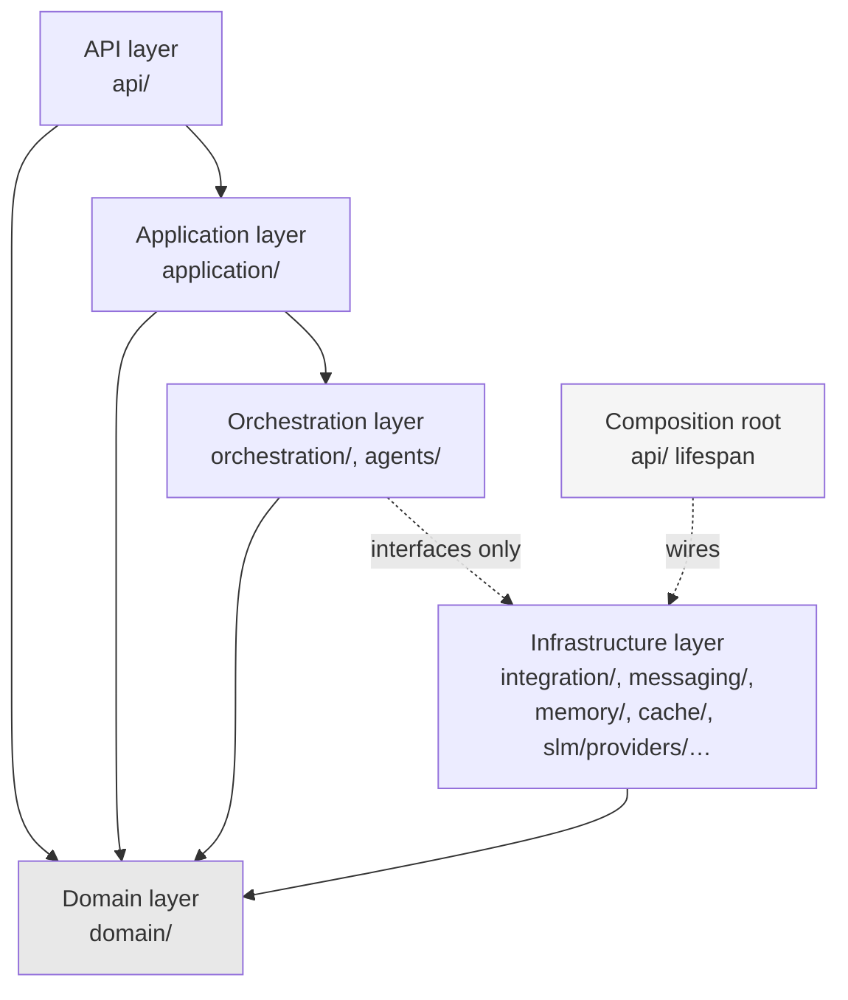

# ADR-D2-01 — Layered architecture with a mechanically enforced dependency rule

## 1. Summary

Five layers — API, Application, Orchestration, Domain, Infrastructure — with dependencies
running strictly inward. The decision is not the layering, which `CLAUDE.md` already states; it
is that the rule is **enforced by an import-boundary test in CI** rather than by convention,
because a layering rule that is only a convention is a layering rule that has already been
broken somewhere.

## 2. Context and Problem Statement

`CLAUDE.md` states the rule: *"Layering (enforced, not just conventional): API → Application →
Orchestration → Domain → Infrastructure/Integrations. Domain code must never import FastAPI,
Langfuse, Azure SDK, a provider SDK, or a DB driver directly."* Doc 4 §3 and §4 give the runtime
components; doc 2 §6.1 assigns the API layer its boundary responsibility.

The parenthetical "enforced, not just conventional" is the whole decision, and it is asserted
without a mechanism. That gap matters here more than in a typical application, for three
specific reasons.

**The domain must stay testable without infrastructure.** Doc 5's state model and doc 6's
conversation and session entities carry the platform's core logic. If a domain entity imports
`redis.asyncio` or `azure.servicebus`, testing it requires those services, and the fast test
suite that makes iteration possible stops being fast.

**Provider independence is a stated requirement, not a preference.** Doc 15 §6 requires an SLM
provider abstraction so that, per doc 1 §39 criterion 9, *"SLM provider can change without
rewriting agents"*. Doc 9 §137–§138 requires the same for memory and cache stores. Doc 14
requires it for vector stores — a decision still open under ADR-D0-04. Every one of these
guarantees is a layering guarantee: it holds if and only if no code above the infrastructure
layer imports a provider SDK. There is no other mechanism that delivers it.

**The Golden Rule's enforcement depends on it.** ADR-D1-02's invariant I-6 prohibits business
rule evaluation in the platform, and names an architecture-fitness test over
`src/pf_ft_ai/domain/` as the mechanism. That test presupposes a domain layer that is
identifiable and separate. If the layering is nominal, I-6 has nothing to assert on.

The failure mode of convention-only layering is well understood and undramatic: one import
added under deadline pressure, in a pull request where the reviewer is focused on the logic. It
does not fail; it accumulates. By the time anyone measures, the layers are a diagram rather than
a property of the code, and restoring them is a refactor nobody has time for.

## 3. Decision Drivers

### 3.1 Functional drivers

| ID | Driver | Source |
|---|---|---|
| DR-F-01 | Domain code must not import FastAPI, Langfuse, Azure SDKs, provider SDKs or DB drivers | `CLAUDE.md` §Coding Conventions |
| DR-F-02 | SLM provider must be changeable without rewriting agents | doc 1 §39 criterion 9; doc 15 §6 |
| DR-F-03 | Memory, cache and vector stores must sit behind interfaces | doc 9 §137–§138; ADR-D0-04 §7.3 |
| DR-F-04 | The API layer holds no business logic | doc 2 §6.1 |
| DR-F-05 | The domain layer must be identifiable for ADR-D1-02's I-6 check | ADR-D1-02 §7.1 |

### 3.2 Non-functional drivers

| ID | Driver | Target | Source |
|---|---|---|---|
| DR-N-01 | Domain tests run without external services | 100% of domain tests are pure | doc 22 (Testing) |
| DR-N-02 | Violations detected before merge, not at review | Build fails on violation | `CLAUDE.md` |
| DR-N-03 | The rule must be expressible without ambiguity | Every module maps to exactly one layer | Programme practice |

### 3.3 Constraints

| ID | Constraint | Type | Source |
|---|---|---|---|
| DR-C-01 | The five layers and their order are fixed by `CLAUDE.md` | Organisational | `CLAUDE.md` |
| DR-C-02 | The canonical package is `src/pf_ft_ai/` | Organisational | `CLAUDE.md`; doc 6 §102 |
| DR-C-03 | Pydantic at boundaries, TypedDict for LangGraph internal state | Platform | `CLAUDE.md`; ADR-D2-07 |
| DR-C-04 | Agents are logical capabilities in one runtime, not services | Platform | ADR-D1-11 §8.3 |

### 3.4 Assumptions

| ID | Assumption | If false | Validation |
|---|---|---|---|
| DR-A-01 | Every module in `src/pf_ft_ai/` maps unambiguously to one layer | The enforcement tool needs per-module exceptions, which erode the rule | Layer mapping audit at Phase 2 |
| DR-A-02 | Import-level enforcement catches the violations that matter | Runtime coupling passes the check while breaking the intent | Reviewed against provider-swap tests |

## 4. Evaluation Criteria and Weights

| ID | Criterion | Weight | Rationale | Measurement |
|---|---|---|---|---|
| EC-01 | Strength of enforcement | 35 | `CLAUDE.md` says "enforced, not just conventional"; convention-only enforcement fails the stated requirement | Can a violation reach the main branch? |
| EC-02 | Provider independence delivered | 25 | Three separate specification requirements depend on it, one of them protecting an open decision | Can a provider be swapped without changes above infrastructure? |
| EC-03 | Developer friction | 20 | Enforcement that obstructs legitimate work gets disabled | False positives; time lost to the rule |
| EC-04 | Clarity of the layer mapping | 12 | An ambiguous rule cannot be enforced consistently | Does every module have one obvious layer? |
| EC-05 | Setup and maintenance cost | 8 | Real but small | Effort to establish and keep working |
| | **Total** | **100** | | |

Scoring scale: **1** unacceptable · **2** poor · **3** adequate · **4** good · **5** excellent.

## 5. Alternatives Considered

### 5.1 Option A — Convention and code review

**Description.** The layering is documented in `CLAUDE.md` and enforced by reviewers.

**Strengths.**
- Zero tooling; nothing to configure or maintain.
- No false positives; a human judges intent.
- Flexible where a genuine exception arises.
- Already the status quo.

**Weaknesses.**
- Fails EC-01 by definition. `CLAUDE.md` explicitly asks for more than this.
- Review attention is finite and goes to logic, not imports.
- Violations accumulate silently; nothing measures them.
- Provider independence becomes an aspiration nobody can verify — and it protects an open
  decision (vector store), so its failure would silently close that decision.

**Cost / effort.** Nil.

### 5.2 Option B — Import-boundary test in CI

**Description.** A test asserts the permitted import directions between layers, using a
declarative layer map. Runs in CI and pre-commit; a violation fails the build.

**Strengths.**
- Violations cannot reach the main branch (EC-01).
- Provider independence becomes a verified property, not a claim (EC-02).
- The layer map is explicit and reviewable, so the rule is unambiguous (EC-04).
- Fast; adds seconds to a build.

**Weaknesses.**
- Detects import coupling only, not runtime coupling. A domain object handed an infrastructure
  callable passes the check (DR-A-02).
- Needs a per-module layer map, maintained as packages are added.
- Occasional legitimate cases need an exception mechanism, which is where such rules erode.

**Cost / effort.** Low.

### 5.3 Option C — Separate distributable packages per layer

**Description.** Each layer is its own installable package with declared dependencies, so the
package manager enforces direction.

**Strengths.**
- The strongest possible enforcement — a violation cannot even be expressed (EC-01).
- Dependency direction is visible in package metadata.
- Forces genuinely clean interfaces.

**Weaknesses.**
- Substantial overhead for one deployable runtime. Five packages, five version numbers, five
  release steps, for a single AKS workload (EC-05).
- Cross-layer refactoring becomes a multi-package change, which is high friction for ordinary
  work (EC-03).
- Contradicts the single-runtime model in ADR-D1-11 §8.3 in spirit: agents are logical, and so
  are layers.

**Cost / effort.** High, ongoing.

### 5.4 Option D — Runtime dependency injection with layer-aware container

**Description.** A DI container wires dependencies and rejects cross-layer resolution at
startup.

**Strengths.**
- Catches runtime coupling that imports miss, addressing DR-A-02.
- Makes dependencies explicit at composition.
- Fails at startup rather than in production.

**Weaknesses.**
- Fails at startup, not at build — so a violation reaches the main branch and is caught later
  (EC-01 weaker than B).
- Adds a DI framework to a codebase that does not otherwise need one.
- Python's dynamic imports mean it does not actually prevent an import; it only prevents
  wiring.
- Complements B rather than replacing it, at meaningful cost.

**Cost / effort.** Moderate.

## 6. Evaluation Method and Decision Matrix

**Method.** Weighted scoring against §4. EC-02 tested concretely: could `RedisMemoryStore` be
replaced with a different implementation under each option without touching
`src/pf_ft_ai/application/` or `src/pf_ft_ai/domain/`, and would anything detect it if the
answer were no?

| Criterion | Weight | A: Convention | B: Import test | C: Separate packages | D: DI container |
|---|---|---|---|---|---|
| EC-01 Enforcement strength | 35 | 1 | 5 | 5 | 3 |
| EC-02 Provider independence | 25 | 2 | 5 | 5 | 4 |
| EC-03 Developer friction | 20 | 5 | 4 | 2 | 3 |
| EC-04 Layer mapping clarity | 12 | 2 | 5 | 5 | 4 |
| EC-05 Setup and maintenance | 8 | 5 | 4 | 1 | 3 |
| **Weighted total** | **100** | **249** | **470** | **410** | **345** |

- **Option B:** (35×5) + (25×5) + (20×4) + (12×5) + (8×4) = 175 + 125 + 80 + 60 + 32 = **470**
- **Option C:** (35×5) + (25×5) + (20×2) + (12×5) + (8×1) = 175 + 125 + 40 + 60 + 8 = **410**

**Sensitivity.** B leads C by 60 points, entirely on friction and maintenance. C's enforcement
is stronger in principle and the difference is immaterial in practice — both make a violation
fail the build — while C's cost is real and recurring for a single-deployable runtime. A is
excluded by `CLAUDE.md`'s own wording. D is a complement, not an alternative, and is recorded
in §7.4 as the response if DR-A-02 proves false.

## 7. Decision

### 7.1 The five layers

| Layer | Package roots | Responsibility | May import |
|---|---|---|---|
| **API** | `api/` | HTTP boundary only: routing, request/response models, status codes. No business logic (doc 2 §6.1). | Application, Domain |
| **Application** | `application/` | Use-case orchestration: commands, queries, DTOs, transaction scripts. No I/O detail. | Orchestration, Domain |
| **Orchestration** | `orchestration/`, `agents/` | Supervisor, harness, LangGraph, agents. The AI execution machinery. | Domain, and infrastructure **interfaces** only |
| **Domain** | `domain/` | Entities, value objects, state enums, domain rules about the platform's own concepts. | Nothing outside `domain/` and the standard library |
| **Infrastructure** | `infrastructure/`, `integration/`, `messaging/`, `slm/providers/`, `embedding_vector/`, `memory/`, `cache/`, `observability/`, `portal_links/` | Adapters to the outside world: HTTP clients, Redis, Service Bus, SLM providers, vector stores, telemetry. | Domain, and external SDKs |

The remaining packages — `context/`, `rag/`, `prompt_engineering/`, `guardrails/`,
`evaluation/`, `configuration/`, `common/` — are **capability packages** and are internally
layered: each has a domain-shaped core and infrastructure-shaped adapters. §7.3 handles them.

### 7.2 The dependency rule

Dependencies run **inward toward Domain**. `Domain` imports nothing outside itself.
`Infrastructure` may import `Domain` — it implements interfaces the domain defines — but nothing
imports `Infrastructure` concretely except the composition root.

Two specific prohibitions, both from `CLAUDE.md`:

1. **Domain imports no framework.** Not FastAPI, not Langfuse, not an Azure SDK, not a provider
   SDK, not a DB driver.
2. **Orchestration imports infrastructure interfaces, never implementations.** An agent depends
   on `MemoryStore`, never on `RedisMemoryStore`.

The second is what delivers DR-F-02 and DR-F-03. It is also what protects the still-open vector
store decision (ADR-D3-24): while `VectorStore` is an interface and nothing above infrastructure
names a concrete implementation, the decision genuinely remains open. The moment a concrete type
leaks upward, the decision has been made by accident — which is exactly the failure mode
ADR-D0-04 §7.3 describes.

### 7.3 Capability packages

Packages like `context/`, `rag/` and `guardrails/` do not sit at one layer; they span from
domain-shaped models to infrastructure-shaped adapters. Within each, the same rule applies
internally:

```
context/
├── erc/models.py          domain-shaped — no external imports
├── erc/service.py         application-shaped — orchestrates
├── collection/executor.py orchestration-shaped — uses interfaces
└── erc/repository.py      infrastructure-shaped — concrete adapter
```

The layer map (§8.1) records the layer of each module, not each package. DR-A-01's audit checks
this mapping is unambiguous.

### 7.4 The composition root

Exactly one place wires concrete implementations to interfaces: the application startup in
`src/pf_ft_ai/api/` (FastAPI lifespan). It is the only module permitted to import concrete
infrastructure types alongside orchestration and application types, and it is explicitly
exempted in the layer map.

Concentrating the exemption in one file is what keeps it honest. A diffuse set of exemptions is
how enforcement erodes; one named file is reviewable.

### 7.5 If import checking proves insufficient

DR-A-02 flags that import-level checking misses runtime coupling — a domain object handed an
infrastructure callable. If provider-swap tests (AC-03) show this occurring, Option D's
startup-time validation is added **alongside** B, not instead of it. Recorded as RT-03.

**Status rationale.** Accepted. Tier 1 under ADR-D0-03 §7.1 — it concerns system boundaries —
ratified by the external ADF/ADR governance forum.

## 8. Architecture Detail

### 8.1 Layer map and enforcement

A declarative map assigns every module a layer; the test asserts the permitted edges:



The dotted edge from Orchestration to Infrastructure is the one the test scrutinises most: it is
permitted for interface modules and forbidden for implementation modules.

### 8.2 The provider-swap test

The clearest verification of EC-02 is behavioural rather than structural. For each abstracted
provider, a test substitutes a different implementation and asserts that no module above the
infrastructure layer changed:

| Interface | Production implementation | Test substitution | Protects |
|---|---|---|---|
| `MemoryStore` / `CacheStore` | `RedisMemoryStore` (ADR-D4-10) | `fakeredis` async client | doc 9 §137–§138 |
| `SLMProvider` | Hugging Face client (ADR-D3-13) | Deterministic mock provider | doc 1 §39 criterion 9 |
| `VectorStore` | **Open** (ADR-D3-24) | In-memory stub | The open decision itself |

The vector store row is the important one: the substitution passing is the evidence that
ADR-D3-24 is still genuinely open.

### 8.3 Relationship to ADR-D1-02's invariant I-6

I-6 prohibits business rule evaluation in the platform and names an architecture-fitness test
over `src/pf_ft_ai/domain/`. That test is a sibling of this one and depends on it: a domain
layer that is identifiable and framework-free is what makes "does this evaluate a business
rule?" a tractable question. Without §7.1's layer map, I-6 would have no defined surface to
check.

## 9. Consequences

### 9.1 Positive

- `CLAUDE.md`'s "enforced, not just conventional" becomes true rather than aspirational.
- Provider independence is verified by test, so doc 1 §39 criterion 9 and doc 9 §137–§138 are
  demonstrable rather than asserted.
- The open vector store decision stays open, provably, until it is decided.
- Domain tests run without external services, keeping the fast suite fast.
- ADR-D1-02's I-6 gains a well-defined surface to check.

### 9.2 Negative

- Import-level checking misses runtime coupling (DR-A-02); §7.5 is the response, not a denial.
- The layer map must be maintained as packages are added, and a missing entry either blocks a
  build or silently exempts a module depending on the default.
- Capability packages (§7.3) require per-module rather than per-package mapping, which is more
  work to keep accurate.
- Occasional legitimate exceptions need a mechanism, and every exception mechanism is an
  erosion path.

### 9.3 Neutral

- The layering itself is unchanged from `CLAUDE.md`; this decision adds the mechanism.
- One deployable runtime is unaffected — layers are logical, like agents (DR-C-04).

### 9.4 Trade-offs explicitly accepted

| Given up | In exchange for | Accepted by |
|---|---|---|
| Flexibility to import upward under deadline pressure | A layering that is a property of the code | AI Engineering Lead |
| Simplicity of package-level mapping | Accurate layering inside capability packages | AI Solution Architect |
| The stronger guarantee of separate packages | Low friction in a single-deployable runtime | External ADF/ADR forum |

## 10. Golden-Rule and Precedence Conformance

| Constraint | Conformance |
|---|---|
| Enterprise decides; AI orchestrates | The infrastructure layer is where every enterprise crossing lives (ADR-D1-01 §8.1's five crossings). Confining them there means an upward-importing shortcut to an enterprise API is a build failure, not a review comment. |
| Authoritative-truth precedence | Supported: provenance is stamped at the infrastructure boundary where data enters, and the layering guarantees there is no other entry point. |
| Four-state separation | Supported: domain packages for conversation, session and workflow state are separate modules with no cross-imports; Enterprise Business State has no domain module at all, correctly. |
| Versioned artefacts, never mutated in place | Not directly. |
| Adam persona governs how, never what | Supported: `prompt_engineering/` sits above domain and cannot influence domain logic. |

## 11. Risks and Mitigations

| ID | Risk | Likelihood | Impact | Exposure | Mitigation | Owner | Residual |
|---|---|---|---|---|---|---|---|
| RSK-01 | Exceptions accumulate until the rule is meaningless | Medium | High | High | Exceptions listed explicitly in the layer map, reviewed quarterly; QM-02 caps them; the composition root is the only standing exemption | AI Solution Architect | Medium |
| RSK-02 | Runtime coupling passes import checking (DR-A-02) | Medium | Medium | Medium | Provider-swap tests (§8.2) detect behavioural coupling; §7.5 adds startup validation if needed | AI Engineering Lead | Medium |
| RSK-03 | Layer map falls out of date as packages are added | Medium | Medium | Medium | Unmapped module fails the build rather than defaulting to permitted; QM-03 | AI Engineering Lead | Low |
| RSK-04 | A concrete provider type leaks above infrastructure, silently closing an open decision | Medium | High | High | §7.2's second prohibition tested directly; §8.2's vector store substitution is the specific check; QM-04 | AI Solution Architect | Low |
| RSK-05 | Developers disable the check when it obstructs work | Low | High | Medium | Low false-positive rate targeted by QM-05; disabling requires a config change visible in review | AI Engineering Lead | Low |

## 12. Quantitative Targets and Measures

| ID | Measure | Target | Threshold (alert) | Source | Review cadence |
|---|---|---|---|---|---|
| QM-01 | Layer violations reaching the main branch | 0 | ≥1 | CI import-boundary test | Per build |
| QM-02 | Standing exceptions in the layer map | ≤1 (the composition root) | ≥3 | Layer map review | Quarterly |
| QM-03 | Modules unmapped to a layer | 0 | ≥1 | Build failure on unmapped module | Per build |
| QM-04 | Concrete provider types imported above the infrastructure layer | 0 | ≥1 | Import-boundary test; provider-swap test | Per build |
| QM-05 | False-positive violations requiring an exception | ≤1 per quarter | ≥4 per quarter | Exception requests | Quarterly |
| QM-06 | Domain tests requiring an external service | 0 | ≥1 | Test suite audit | Per build |

## 13. Security, Privacy and Compliance Impact

| Dimension | Impact |
|---|---|
| Attack surface change | Reduced. Confining external SDKs to the infrastructure layer means the set of modules that can reach the network, a database or a secret store is small, enumerable and reviewable. |
| Data classification touched | Internal. |
| Personal data / PII | Indirect: personal data enters at the infrastructure boundary and is modelled in domain terms above it, which makes the entry points auditable for data-flow mapping (ADR-D6-06). |
| Children's data and safeguarding | Indirect but useful: every path by which safeguarding data enters the platform is an infrastructure-layer adapter, so the data-flow assessment has a finite, testable surface. |
| UK GDPR lawful basis and rights impact | Supports data-flow mapping and records of processing by making ingress points structurally identifiable. |
| Audit and evidential requirements | The CI test result is positive evidence that the architecture held for a given release, not merely that it was documented. |
| Standards touched | ISO/IEC 27001 A.8.25 (secure development lifecycle), A.8.27 (secure system architecture and engineering principles); ISO/IEC 42001 (AI system design); CMMI-DEV TS SP 2.1. |

## 14. Implementation Impact

| Aspect | Detail |
|---|---|
| Build phases | 0 (rule and tooling), 2 (domain layer), 3 (API and application layers) |
| Repository paths | All of `src/pf_ft_ai/`; layer map alongside the test |
| Configuration | Layer map as a declarative file consumed by the test |
| Contracts / schemas | Interfaces at each layer boundary; Pydantic at API and integration boundaries per DR-C-03 |
| Migration | None; established at Phase 0 |
| Dependencies on other ADRs | ADR-D5-01 (Python/FastAPI), ADR-D5-03 (Pydantic) |
| Effort estimate | Small — a test plus a map |

## 15. Validation and Verification

| ID | Acceptance criterion | Verification method |
|---|---|---|
| AC-01 | No module under `domain/` imports FastAPI, Langfuse, an Azure SDK, a provider SDK or a DB driver | Import-boundary test |
| AC-02 | No module under `orchestration/` or `agents/` imports a concrete infrastructure implementation | Import-boundary test; QM-04 |
| AC-03 | Each abstracted provider can be substituted with no change above the infrastructure layer | Provider-swap tests per §8.2 |
| AC-04 | Every module in `src/pf_ft_ai/` is mapped to exactly one layer | Layer map completeness check; QM-03 |
| AC-05 | The composition root is the only standing exemption | Layer map review; QM-02 |
| AC-06 | Domain tests execute with no external service available | Test suite run with network and services disabled; QM-06 |
| AC-07 | A deliberately introduced upward import fails the build | Negative test in CI |

AC-07 is the check that the check works. A guard nobody has seen fail is not known to function.

## 16. Operational Impact

| Aspect | Detail |
|---|---|
| Monitoring | Not runtime. CI result per build. |
| Alerting | Build failure |
| Runbook | None |
| Failure mode and degradation | The failure mode is silent erosion through exceptions, which is why QM-02 caps them and RT-01 acts on growth |
| Rollback | Not applicable |
| Support model impact | None |

## 17. Cost Impact

| Cost element | One-off | Recurring | Basis |
|---|---|---|---|
| Import-boundary test and layer map | ~1 day | — | Phase 0 |
| Provider-swap tests | ~1 day | Maintained with each abstraction | §8.2 |
| Layer map maintenance | — | Minutes per new package | DR-N-03 |
| Avoided cost | — | Ongoing | A layering refactor after eighteen months of erosion is a project, not a task |

## 18. Revisit Triggers and Causal Analysis Hooks

| ID | Trigger | Detected by | Action on trigger |
|---|---|---|---|
| RT-01 | QM-02 shows exceptions growing beyond the composition root | Quarterly review | Causal analysis on each; an exception that cannot be removed indicates a layer boundary in the wrong place |
| RT-02 | QM-05 exceeds 4 false positives per quarter | Quarterly review | The layer map is wrong, not the code; correct the map |
| RT-03 | Provider-swap tests reveal runtime coupling despite clean imports (DR-A-02) | Test failure | Add Option D's startup validation alongside the import test |
| RT-04 | QM-04 records a concrete provider type above infrastructure | CI | Immediate fix; check whether an open decision was silently closed |
| RT-05 | A new capability package does not fit the five-layer model | Architecture review | Extend §7.3's internal-layering pattern; do not add a sixth layer without a superseding ADR |

**Scheduled review:** 2027-08-21.

## 19. Traceability

| Dimension | Reference |
|---|---|
| Workshop sheet | WS-07 Enterprise Reference Architecture |
| Specification sections | doc 4 §3 (Runtime Architecture), §4 (Runtime Responsibilities); doc 2 §6.1 (API Layer), §48 (Anti-Patterns); doc 27 (Development Standards); doc 9 §137–§138 (Provider Independence); doc 1 §39 criterion 9; `CLAUDE.md` §Coding Conventions |
| Requirement IDs | `FR-A39-09`, `NFR-A38-MAINT`, `NFR-A38-TEST` |
| Build phases | 0, 2, 3 |
| Code paths | `src/pf_ft_ai/` |
| Configuration | Layer map |
| Tests | AC-01 to AC-07; import-boundary test; provider-swap tests |
| Upstream ADRs | ADR-D1-01, ADR-D1-02 |
| Downstream ADRs | ADR-D2-02, ADR-D3-14, ADR-D3-24, ADR-D4-10, ADR-D5-01, ADR-D7-09 |

## 20. Change Log

| Version | Date | Author | Change |
|---|---|---|---|
| 1.0.0 | 2026-08-21 | AI Solution Architect | Initial decision recorded. Five layers with import-boundary enforcement in CI; provider-swap tests added as behavioural verification; the composition root established as the single standing exemption. |
