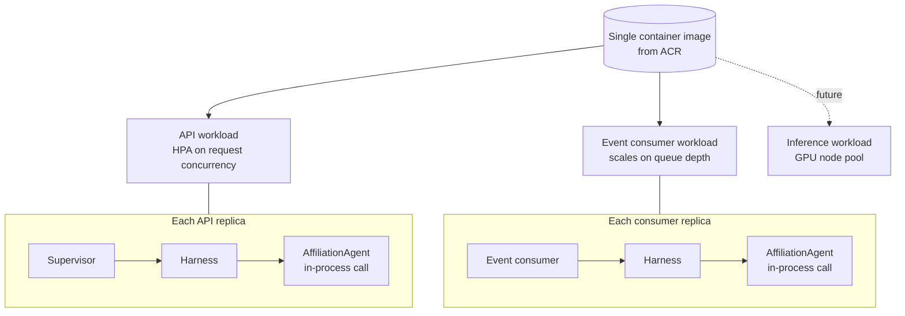

# ADR-D2-02 — Single AI runtime with agents as logical capabilities, not deployables

## 1. Summary

Agents are modules inside one deployable runtime. One microservice per agent is an
anti-pattern under 2. PFF-FA-AI-ARCHITECTURE-DETAILED.md §48 unless independent deployment or scaling is specifically
justified, and no such justification exists. The runtime does, however, separate **workload
classes** — synchronous request handling, event consumption, and any future GPU-bound
inference — because those have genuinely different scaling characteristics, which agents do not.

## 2. Context and Problem Statement

2. PFF-FA-AI-ARCHITECTURE-DETAILED.md §48 lists "one microservice per agent" first among its architectural anti-patterns,
qualified: *"Unless independent deployment/scaling is justified."* 7 PFF-FA-AI-AGENTIC-ORCHESTRATION.md §6 says the platform
uses workflow-level agents, not one microservice per agent. `CLAUDE.md` repeats it: *"Agents are
logical capabilities inside one AI runtime, not one microservice per agent. Don't create a
separate deployable per agent without a clear, justified operational/scaling reason."*

The decision is stated three times and the reasoning is stated nowhere, which matters because
the pull toward agent-per-service is strong and comes with respectable arguments. Each agent has
its own prompts, its own tools, its own evaluation set; teams could own agents independently;
one agent's failure would not affect another; scaling could follow demand per workflow. These
are the standard microservice arguments and they are not silly.

They are, in this case, mostly wrong, and recording why matters more than recording the
conclusion — because the question will be reopened. It will be reopened when a second agent
arrives, when a team wants independent release cadence, and when someone observes that a
GPU-bound agent has different resource needs from a CPU-bound one. The last of those is a real
argument, and it is the one this decision must handle honestly rather than dismiss.

There is a related conflation to untangle. "One runtime" and "one process type" are not the same
claim. 25.PFF-FA-AI-INFRASTRUCTURE-OPERATIONS.md §12 covers workload separation and §13 states the agent deployment principle;
4. PFF-FA-AI-RUNTIME.md §47 describes a Service Bus runtime consuming events. A synchronous HTTP worker and an
event consumer have different scaling triggers — request rate versus queue depth — and different
failure modes. Separating those is workload separation, which 25.PFF-FA-AI-INFRASTRUCTURE-OPERATIONS.md §12 endorses; it is not
agent decomposition, which 2. PFF-FA-AI-ARCHITECTURE-DETAILED.md §48 prohibits. Collapsing the distinction would either produce
a monolith that scales badly or an agent-per-service architecture justified by the wrong
argument.

## 3. Decision Drivers

### 3.1 Functional drivers

| ID | Driver | Source |
|---|---|---|
| DR-F-01 | Agents are logical capabilities in one runtime | 7 PFF-FA-AI-AGENTIC-ORCHESTRATION.md §6; `CLAUDE.md` |
| DR-F-02 | A separate deployable per agent requires specific operational justification | 2. PFF-FA-AI-ARCHITECTURE-DETAILED.md §48; `CLAUDE.md` |
| DR-F-03 | Adding an agent must not require a deployment topology change | 1 PFF-FA-AI-ARCHITECTURE.md §39 criterion 20; ADR-D1-11 |
| DR-F-04 | Event consumption must scale on queue depth, independently of request rate | 25.PFF-FA-AI-INFRASTRUCTURE-OPERATIONS.md §53; 4. PFF-FA-AI-RUNTIME.md §47 |
| DR-F-05 | GPU workloads must be separable from CPU workloads | 25.PFF-FA-AI-INFRASTRUCTURE-OPERATIONS.md §20; 2. PFF-FA-AI-ARCHITECTURE-DETAILED.md §39 |

### 3.2 Non-functional drivers

| ID | Driver | Target | Source |
|---|---|---|---|
| DR-N-01 | Agent invocation must not incur network latency | In-process call | ADR-D5-18 |
| DR-N-02 | Operational surface must stay proportionate to the team | ≤3 workload types | Programme staffing |
| DR-N-03 | A failure in one agent must not take down unrelated conversations | Bounded blast radius | 24.PFF-FA-AI-OBSERVABILITY-RESILIENCE.md (Resilience) |

### 3.3 Constraints

| ID | Constraint | Type | Source |
|---|---|---|---|
| DR-C-01 | One microservice per agent is an anti-pattern absent justification | Platform | 2. PFF-FA-AI-ARCHITECTURE-DETAILED.md §48 |
| DR-C-02 | Only one agent exists in the first pass | Organisational | ADR-D1-11 |
| DR-C-03 | Deployment is to AKS | Platform | ADR-D5-08 |
| DR-C-04 | Layering is enforced within the runtime | Platform | ADR-D2-01 |

### 3.4 Assumptions

| ID | Assumption | If false | Validation |
|---|---|---|---|
| DR-A-01 | Agents have similar resource profiles, so co-scaling is not wasteful | An outlier agent justifies its own deployable under DR-F-02 | Resource profiling per agent from Phase 20 |
| DR-A-02 | One team owns all agents for the foreseeable future | Independent release cadence becomes a genuine argument | Organisational review |
| DR-A-03 | In-process failure isolation is achievable without process isolation | Blast radius is wider than intended | Chaos testing at Phase 20 |

## 4. Evaluation Criteria and Weights

| ID | Criterion | Weight | Rationale | Measurement |
|---|---|---|---|---|
| EC-01 | Operational simplicity | 30 | A small team operating many services is the failure mode that sinks platforms of this size | Number of deployables, pipelines, dashboards, on-call surfaces |
| EC-02 | Cost of adding an agent | 25 | 1 PFF-FA-AI-ARCHITECTURE.md §39 criterion 20; extensibility is a stated success criterion | Deployment changes required per new agent |
| EC-03 | Scaling fitness | 20 | Different workload classes genuinely differ; ignoring that wastes money or degrades service | Can each workload class scale on its own trigger? |
| EC-04 | Failure isolation | 15 | One workflow's failure should not affect another | Blast radius of an agent-level fault |
| EC-05 | Latency | 10 | Inter-agent network hops would be pure overhead | Agent invocation latency |
| | **Total** | **100** | | |

Scoring scale: **1** unacceptable · **2** poor · **3** adequate · **4** good · **5** excellent.

## 5. Alternatives Considered

### 5.1 Option A — One deployable containing everything

**Description.** A single service handling HTTP requests, consuming Service Bus events, and
running all agents.

**Strengths.**
- Simplest possible operations: one image, one pipeline, one dashboard (EC-01).
- Adding an agent is a code change only (EC-02).
- No inter-component network latency (EC-05).
- One configuration surface.

**Weaknesses.**
- Event consumption and request handling share a scaling trigger. A queue backlog cannot be
  absorbed without scaling HTTP capacity nobody needs, and a request spike starves event
  consumers (EC-03) — the failure 25.PFF-FA-AI-INFRASTRUCTURE-OPERATIONS.md §53 anticipates with worker scaling.
- Long-running event processing competes with request latency in the same process.
- A poison-message loop in event consumption degrades the request path (EC-04).

**Cost / effort.** Lowest.

### 5.2 Option B — One runtime image, workload-separated deployments

**Description.** One container image, one codebase, deployed as distinct Kubernetes workloads:
an API deployment scaling on request rate, an event-consumer deployment scaling on queue depth,
and — when self-hosted inference arrives — a GPU-backed inference deployment. Agents are modules
present in every replica.

**Strengths.**
- Each workload class scales on its own trigger, per 25.PFF-FA-AI-INFRASTRUCTURE-OPERATIONS.md §51–§53 (EC-03).
- One image and one pipeline, so operational surface stays small (EC-01).
- Adding an agent changes no deployment topology (EC-02).
- Event-path faults are isolated from the request path (EC-04).
- In-process agent invocation (EC-05).
- Matches 25.PFF-FA-AI-INFRASTRUCTURE-OPERATIONS.md §12's workload separation without agent decomposition.

**Weaknesses.**
- One image containing code that some replicas never execute — the API deployment carries the
  event handlers and vice versa.
- A shared codebase means a change to one workload's code redeploys all of them.
- Agent-level failure isolation is in-process only (DR-A-03).

**Cost / effort.** Low.

### 5.3 Option C — One deployable per agent

**Description.** Each agent is its own service with its own image, pipeline, scaling policy and
deployment, coordinated by a supervisor service.

**Strengths.**
- True per-agent scaling and failure isolation (EC-03, EC-04 in principle).
- Independent release cadence per agent.
- Clear team ownership boundaries.
- An agent with unusual resource needs is naturally accommodated.

**Weaknesses.**
- Prohibited by DR-C-01 absent justification, and no justification exists: one agent, one team,
  similar resource profiles.
- Multiplies operational surface by agent count — pipelines, dashboards, alerts, on-call
  runbooks, version skew between supervisor and agents (EC-01).
- Adding an agent becomes an infrastructure project, directly contradicting 1 PFF-FA-AI-ARCHITECTURE.md §39 criterion
  20 (EC-02).
- Supervisor-to-agent invocation becomes a network call, adding latency and a failure mode to
  every conversation (EC-05).
- Shared context — ERC, memory, session — must cross a network boundary or be duplicated.

**Cost / effort.** High, growing with agent count.

### 5.4 Option D — One runtime with per-agent process isolation inside the pod

**Description.** One deployment, but each agent runs in a separate process within the pod,
communicating over local IPC.

**Strengths.**
- Genuine process-level failure isolation without network hops (EC-04).
- One deployable, so operational surface stays small (EC-01).
- An agent crash cannot take the pod's other agents down.

**Weaknesses.**
- Substantial complexity: process supervision, IPC serialisation, shared-state coordination,
  debugging across process boundaries.
- Duplicates memory per process for shared context and models.
- Solves a problem not yet demonstrated to exist — DR-A-03 assumes in-process isolation
  suffices, and nothing yet contradicts it.
- Python multiprocessing with async I/O is an awkward combination.

**Cost / effort.** High, for speculative benefit.

## 6. Evaluation Method and Decision Matrix

**Method.** Weighted scoring against §4. EC-01 counted as deployables, pipelines and alert
surfaces. EC-03 assessed against 25.PFF-FA-AI-INFRASTRUCTURE-OPERATIONS.md §51–§53's scaling model. EC-02 assessed by listing the
deployment artefacts a second agent would require under each option.

| Criterion | Weight | A: One deployable | B: Workload-separated | C: Per-agent service | D: In-pod processes |
|---|---|---|---|---|---|
| EC-01 Operational simplicity | 30 | 5 | 4 | 1 | 3 |
| EC-02 Cost of adding an agent | 25 | 5 | 5 | 1 | 4 |
| EC-03 Scaling fitness | 20 | 2 | 5 | 5 | 2 |
| EC-04 Failure isolation | 15 | 2 | 4 | 5 | 5 |
| EC-05 Latency | 10 | 5 | 5 | 2 | 4 |
| **Weighted total** | **100** | **395** | **460** | **255** | **350** |

- **Option B:** (30×4) + (25×5) + (20×5) + (15×4) + (10×5) = 120 + 125 + 100 + 60 + 50 = **460**
- **Option A:** (30×5) + (25×5) + (20×2) + (15×2) + (10×5) = 150 + 125 + 40 + 30 + 50 = **395**

**Sensitivity.** B leads A by 65 points, on scaling fitness and failure isolation. The margin
would close if event volumes were low enough that shared scaling never bit — but 25.PFF-FA-AI-INFRASTRUCTURE-OPERATIONS.md §53
provides for Service Bus worker scaling specifically, and affiliation's seasonal window means
event bursts (approval, payment, the 31 May timer cancellation across a county) are expected.
C scores lowest despite winning two criteria, because its operational and extensibility costs
are severe and it is excluded by DR-C-01 in any case. D is deferred to RT-03 should DR-A-03
prove false.

## 7. Decision

### 7.1 Agents are modules

`AffiliationAgent` is a package under `src/pff_fa_ai/agents/`. It is invoked by an in-process
function call from the supervisor through the harness. It has no network address, no
independent lifecycle, no separate image and no deployment of its own.

Adding an agent adds a package and a registry entry (ADR-D1-11 §8.2). It changes no Dockerfile,
no manifest, no pipeline and no scaling policy.

### 7.2 Workload separation is not agent separation

One image, deployed as distinct workloads:

| Workload | Scales on | Contains | Justification |
|---|---|---|---|
| **API** | Request rate / concurrency | FastAPI, supervisor, harness, all agents | Synchronous conversational path |
| **Event consumer** | Service Bus queue depth | Event consumer, handlers, harness, all agents | 25.PFF-FA-AI-INFRASTRUCTURE-OPERATIONS.md §53; independent scaling trigger, and isolation of poison-message loops from the request path |
| **Inference** (future) | GPU utilisation | Self-hosted SLM serving | 25.PFF-FA-AI-INFRASTRUCTURE-OPERATIONS.md §20–§21; GPU nodes are a different node pool with different cost characteristics (ADR-D5-11) |

All three run the same image. Which workload a replica is, is a startup argument. This keeps one
build, one artefact and one version, while giving each class its own scaling policy — which is
the whole benefit Option C claimed and delivers it without agent decomposition.

The inference workload is listed because ADR-D3-13 targets self-hosted SLM serving. It does not
exist yet, and it is a workload separation, not an agent separation: it hosts a model, not an
agent.

### 7.3 The justification test

2. PFF-FA-AI-ARCHITECTURE-DETAILED.md §48 permits a separate deployable where independent deployment or scaling is justified.
A proposal must demonstrate, with evidence:

1. **A materially different resource profile** — GPU dependence, memory footprint an order of
   magnitude apart, or a fundamentally different scaling trigger. Measured, not asserted.
2. **A materially different availability requirement** — a workload that must survive when the
   rest degrades, or vice versa.
3. **A genuine independent release requirement** — separate teams with separate cadences,
   evidenced by organisational structure, not by preference.

Meeting one of these is necessary; none of them is sufficient on its own, because the cost side
must also be weighed. A proposal meeting none is the anti-pattern 2. PFF-FA-AI-ARCHITECTURE-DETAILED.md §48 names, and is
refused.

Note what is *not* on the list: an agent being complex, an agent being important, an agent
having many tools, or a team wanting to own something. None of those is an operational or
scaling justification.

### 7.4 Failure isolation within the runtime

Option C's genuine advantage is process-level isolation. Within one runtime this is achieved by
bounded failure domains rather than by process boundaries:

| Mechanism | Effect | ADR |
|---|---|---|
| Per-agent timeout and loop limits | A runaway agent run terminates without consuming the replica | ADR-D2-11 |
| Circuit breakers per enterprise dependency | A failing enterprise API fails fast rather than exhausting connections | ADR-D7-06 |
| Bounded parallelism | Concurrent context collection cannot saturate the event loop | ADR-D2-08 |
| Per-request resource ceilings | One conversation cannot starve others | 4. PFF-FA-AI-RUNTIME.md §54, §57 |
| Workload separation | Event-path faults do not reach the request path | §7.2 |

DR-A-03 assumes these suffice. Chaos testing at Phase 20 tests that assumption; RT-03 is the
response if it fails.

**Status rationale.** Accepted. Tier 1 under ADR-D0-03 §7.1 — deployment boundaries are a 2. PFF-FA-AI-ARCHITECTURE-DETAILED.md
§52 category — ratified by the external ADF/ADR governance forum.

## 8. Architecture Detail

### 8.1 One image, three workload roles

The agent appears in both workloads because both need it — a workflow resumed by an event runs
the same agent as one driven by a request. That is a direct consequence of §7.1: agents are
modules, and modules are wherever the image is.

### 8.2 What a second agent changes

| Artefact | Changes? |
|---|---|
| `src/pff_fa_ai/agents/<new>/` | Added |
| `config/base/agents.yaml` | One entry |
| Dockerfile | No |
| Kubernetes manifests | No |
| Scaling policies | No |
| CI/CD pipeline | No |
| Dashboards | Agent dimension already present |
| On-call runbooks | No new deployable to operate |

This table is the practical content of 1 PFF-FA-AI-ARCHITECTURE.md §39 criterion 20, and it is why the criterion is
satisfiable at all.

### 8.3 Observability across a shared runtime

A shared runtime risks losing per-agent visibility. Agent identity is a dimension on every trace,
metric and log line (ADR-D7-02, ADR-D7-03), so per-agent latency, error rate, token consumption
and cost are all queryable without separate deployables. Operationally this is most of what
Option C's separation would have provided, at none of its cost.

## 9. Consequences

### 9.1 Positive

- Operational surface stays proportionate: one image, one pipeline, three workload
  configurations regardless of agent count.
- Adding an agent is a code and configuration change, satisfying 1 PFF-FA-AI-ARCHITECTURE.md §39 criterion 20.
- Event consumption scales on queue depth independently, which matters during affiliation's
  seasonal bursts.
- No network hop between supervisor and agent, so no latency and no distributed failure mode in
  the conversational path.
- Shared context — ERC, memory, session — needs no cross-service coordination.

### 9.2 Negative

- Every replica carries code it does not execute; the API deployment includes event handlers
  and vice versa. Image size and cold-start cost are marginally higher.
- A change to event-handling code redeploys the API workload too, because they share an image.
- Agent failure isolation is in-process, weaker than process isolation, and rests on DR-A-03.
- Per-agent resource attribution is observational rather than enforced — one agent cannot be
  given a hard CPU quota.

### 9.3 Neutral

- Workload separation is not agent separation, and this distinction must be restated whenever
  the question is reopened.
- The inference workload is anticipated but does not yet exist.

### 9.4 Trade-offs explicitly accepted

| Given up | In exchange for | Accepted by |
|---|---|---|
| Process-level failure isolation per agent | Operational simplicity and zero-cost agent addition | Operations/SRE |
| Independent release cadence per agent | One artefact, one version, no skew | AI Platform Owner |
| Hard per-agent resource quotas | In-process invocation with no network latency | AI Solution Architect |
| Smaller per-workload images | A single build and a single artefact to promote | AI Engineering Lead |

## 10. Golden-Rule and Precedence Conformance

| Constraint | Conformance |
|---|---|
| Enterprise decides; AI orchestrates | Unaffected by topology. All five enterprise crossings (ADR-D1-01 §8.1) exist identically in every workload. |
| Authoritative-truth precedence | Shared in-process context means one provenance model, not one per service — a real benefit over Option C, where provenance would have to survive serialisation between agents. |
| Four-state separation | Preserved within the runtime by ADR-D2-01's layering; a shared process does not imply shared state, and the four state concepts remain separate modules. |
| Versioned artefacts, never mutated in place | One image, one version, immutable per ADR-D5-09. Agents are versioned within it per 7 PFF-FA-AI-AGENTIC-ORCHESTRATION.md §21. |
| Adam persona governs how, never what | Not affected by topology. |

## 11. Risks and Mitigations

| ID | Risk | Likelihood | Impact | Exposure | Mitigation | Owner | Residual |
|---|---|---|---|---|---|---|---|
| RSK-01 | Pressure to split agents into services as the catalogue grows | Medium | High | High | §7.3's evidence-based justification test; a split requires a tier 1 ADR; 2. PFF-FA-AI-ARCHITECTURE-DETAILED.md §48 cited | AI Solution Architect | Medium |
| RSK-02 | In-process isolation proves insufficient; one agent degrades others (DR-A-03) | Medium | High | High | §7.4's five bounded failure domains; chaos testing at Phase 20; RT-03 adds process isolation if needed | Operations/SRE | Medium |
| RSK-03 | Shared image means unrelated redeploys, increasing change risk | Medium | Low | Low | Immutable images and rolling deployment (ADR-D7-10); the same image already runs all workloads, so a redeploy is not a new risk class | AI Engineering Lead | Low |
| RSK-04 | Per-agent resource contention invisible until it bites | Medium | Medium | Medium | Agent dimension on all metrics (§8.3); per-agent latency and token budgets tracked from Phase 14 | Operations/SRE | Medium |
| RSK-05 | GPU inference workload is bolted on as an agent rather than a workload | Low | Medium | Low | §7.2 classifies it explicitly as a workload hosting a model, not an agent | AI Solution Architect | Low |

## 12. Quantitative Targets and Measures

| ID | Measure | Target | Threshold (alert) | Source | Review cadence |
|---|---|---|---|---|---|
| QM-01 | Deployables per agent | 0 | ≥1 | Deployment manifest audit | Per release |
| QM-02 | Deployment artefacts changed when adding an agent | 0 | ≥1 | Change review at agent two | At agent two |
| QM-03 | Workload types | 2, rising to 3 with self-hosted inference | >3 | Manifest audit | Per release |
| QM-04 | Event consumer scaling independent of API replica count | Yes | No | Scaling policy audit | Per release |
| QM-05 | Conversations affected by an agent-level fault | Bounded to the faulting run | Cross-conversation impact observed | Chaos testing; incident records | Quarterly |
| QM-06 | Per-agent latency, error rate and token cost queryable | Yes | No | Observability audit | Per release |

## 13. Security, Privacy and Compliance Impact

| Dimension | Impact |
|---|---|
| Attack surface change | Reduced relative to Option C. One deployable means one set of ingress rules, one managed identity per workload, and no internal service-to-service authentication surface to secure. |
| Data classification touched | All classes handled in-process; no serialisation of personal data between agent services. |
| Personal data / PII | A benefit of the single runtime: context containing personal data is never serialised onto a network hop between agents, removing a class of exposure Option C would create. |
| Children's data and safeguarding | Safeguarding data stays in one process boundary from ingress to response, which simplifies the data-flow assessment materially. |
| UK GDPR lawful basis and rights impact | Fewer processing locations; simpler records of processing. |
| Audit and evidential requirements | One trace per conversation with agent as a dimension, rather than a distributed trace across services — simpler and less lossy. |
| Standards touched | ISO/IEC 27001 A.8.27 (secure architecture), A.8.31 (separation of environments); ISO/IEC 42001 (AI system architecture); 25.PFF-FA-AI-INFRASTRUCTURE-OPERATIONS.md §12–§13. |

## 14. Implementation Impact

| Aspect | Detail |
|---|---|
| Build phases | 4 (agents as modules), 19 (workload-separated deployment) |
| Repository paths | `src/pff_fa_ai/agents/`, `src/pff_fa_ai/orchestration/`, `Dockerfile` |
| Configuration | Workload role as a startup argument; per-workload scaling policy in manifests |
| Contracts / schemas | None new |
| Migration | None |
| Dependencies on other ADRs | ADR-D1-11 (one agent), ADR-D2-01 (layering), ADR-D5-08 (AKS) |
| Effort estimate | Small — the decision mostly constrains what is *not* built |

## 15. Validation and Verification

| ID | Acceptance criterion | Verification method |
|---|---|---|
| AC-01 | No agent has its own image, manifest or pipeline | Deployment audit; QM-01 |
| AC-02 | Supervisor-to-agent invocation is an in-process call | Trace inspection; no network span between them |
| AC-03 | API and event-consumer workloads scale on independent triggers | Scaling policy test; QM-04 |
| AC-04 | Both workloads run the same image, differing only by startup argument | Manifest and image digest comparison |
| AC-05 | Adding the synthetic test agent (ADR-D1-11 §7.3) changes no deployment artefact | Extensibility test; QM-02 |
| AC-06 | An agent-level fault does not affect concurrent conversations | Chaos test; QM-05 |
| AC-07 | Per-agent metrics are queryable without separate deployables | Observability test; QM-06 |

## 16. Operational Impact

| Aspect | Detail |
|---|---|
| Monitoring | Agent dimension on all traces and metrics; per-workload dashboards |
| Alerting | Per workload, not per agent; agent-level anomalies surface as dimensioned alerts |
| Runbook | `docs/runbooks/README.md`; no per-agent runbook required |
| Failure mode and degradation | An agent fault is bounded to its run by §7.4's mechanisms. A workload fault degrades that class only — an event-consumer outage leaves the request path serving, with resumption delayed. |
| Rollback | One image, one rollback, per ADR-D7-10 |
| Support model impact | Small: two workload types to operate regardless of how many agents exist |

## 17. Cost Impact

| Cost element | One-off | Recurring | Basis |
|---|---|---|---|
| Workload-separated manifests | ~1 day | — | Phase 19 |
| Compute | — | Two workload types, independently scaled | Independent scaling reduces cost relative to Option A's shared trigger |
| Avoided cost | — | Substantial and growing | Option C's per-agent pipelines, dashboards, alerts and on-call surface scale with agent count |

## 18. Revisit Triggers and Causal Analysis Hooks

| ID | Trigger | Detected by | Action on trigger |
|---|---|---|---|
| RT-01 | An agent demonstrates a materially different resource profile (§7.3 test 1) | Resource profiling from Phase 20 | Evaluate a separate deployable for that agent with a tier 1 ADR |
| RT-02 | Separate teams take independent ownership of agents (§7.3 test 3, DR-A-02) | Organisational change | Re-evaluate; independent cadence becomes a genuine argument |
| RT-03 | QM-05 shows cross-conversation impact from an agent fault (DR-A-03 false) | Chaos testing | Add in-pod process isolation (Option D) for the affected class |
| RT-04 | QM-03 shows workload types exceeding three | Release audit | Check whether a workload split is really an agent split in disguise |
| RT-05 | Self-hosted inference is adopted (ADR-D3-13) | Roadmap | Add the inference workload per §7.2; confirm it is a workload, not an agent |
| RT-06 | 2. PFF-FA-AI-ARCHITECTURE-DETAILED.md §48 amended | Change notice | Re-derive §7.3's justification test |

**Scheduled review:** 2027-08-21.

## 19. Traceability

| Dimension | Reference |
|---|---|
| Workshop sheet | WS-07 Enterprise Reference Architecture |
| Specification sections | 2. PFF-FA-AI-ARCHITECTURE-DETAILED.md §48 (Anti-Patterns — one microservice per agent), §39 (Scaling Architecture); 7 PFF-FA-AI-AGENTIC-ORCHESTRATION.md §6 (Workflow-Level Agent Responsibility), §7 (Why Workflow-Level Agents), §21 (Agent Versioning); 25.PFF-FA-AI-INFRASTRUCTURE-OPERATIONS.md §12 (Workload Separation), §13 (Agent Deployment Principle), §20 (CPU/GPU Strategy), §51–§53 (Scaling); 4. PFF-FA-AI-RUNTIME.md §47 (Service Bus Runtime), §54, §57 (Runtime Limits, Concurrency); `CLAUDE.md` |
| Requirement IDs | `FR-A39-20`, `NFR-A38-SCALE`, `NFR-A38-MAINT` |
| Build phases | 4, 19 |
| Code paths | `src/pff_fa_ai/agents/`, `src/pff_fa_ai/orchestration/` |
| Configuration | Workload role startup argument; Kubernetes manifests |
| Tests | AC-01 to AC-07 |
| Upstream ADRs | ADR-D1-11, ADR-D2-01 |
| Downstream ADRs | ADR-D2-03, ADR-D5-08, ADR-D5-11, ADR-D5-17, ADR-D7-10 |

## 20. Change Log

| Version | Date | Author | Change |
|---|---|---|---|
| 1.0.0 | 2026-08-21 | AI Solution Architect | Initial decision recorded. Agents as in-process modules; workload separation distinguished from agent separation; an evidence-based justification test for any future separate deployable. Tier 1 — ratified by the external ADF/ADR forum. |
