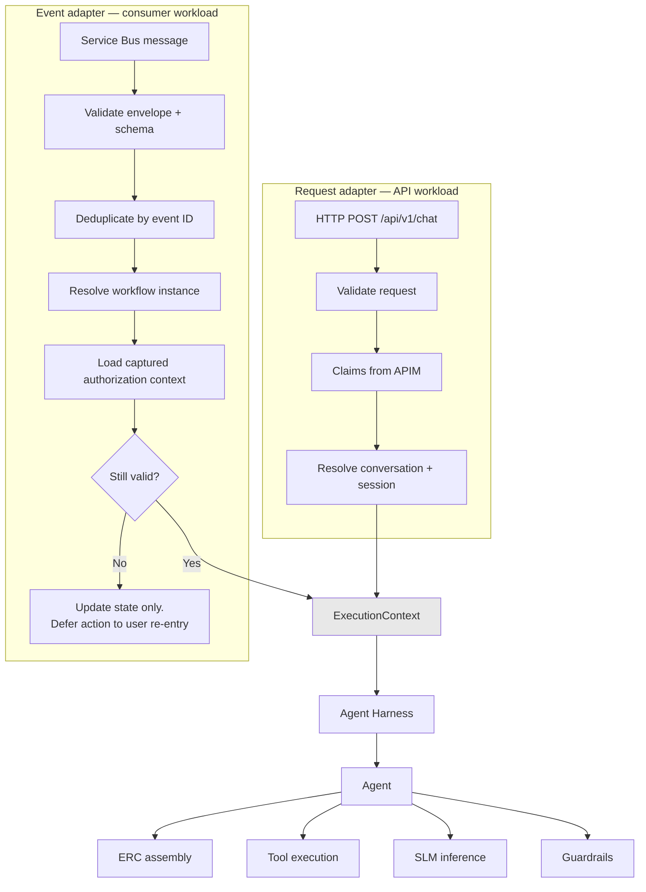

# ADR-D2-03 — Dual runtime model: request-driven and event-driven entry into one execution core

## 1. Summary

The platform has two entry paths — a synchronous HTTP request and an asynchronous Service Bus
event — converging on **one** execution core: the same harness, the same agents, the same ERC,
the same guardrails. What differs is entry, identity resolution and the absence of a user to
respond to. Critically, an event is treated as a **notification that something changed**, never
as an instruction to follow.

## 2. Context and Problem Statement

1 PF-FT-AI-ARCHITECTURE.md §4 and §5 describe a request-driven runtime and an event-driven runtime as two runtimes.
4. PF-FT-AI-RUNTIME.md §5 gives the request lifecycle across twenty-odd stages; 4. PF-FT-AI-RUNTIME.md §47–§49 give the Service Bus
runtime, event-to-workflow mapping and HIL runtime. 11 PF-FT-AI-SERVICE-BUS.md §32–§34 give consumer architecture and
responsibilities.

Read quickly, "two runtimes" suggests two implementations. That reading produces a specific and
expensive failure: guardrails applied on the request path but not the event path, provenance
stamped in one and not the other, context assembly diverging, two sets of retry semantics. The
event path would become the platform's soft underbelly — less exercised, less tested, and
carrying exactly the state transitions that matter most, since it is how CFA approvals, payment
confirmations and timer cancellations arrive.

The affiliation flow makes the stakes concrete. Every consequential outcome reaches the platform
as an event: Scenario 6's CFA approval, Scenario 7 and 8's payment confirmations, Scenario 12's
31 May timer cancellation, Scenario 15 and 16's WGS integration results. If the event path
applied weaker checks than the request path, the platform's least-guarded code would handle its
most authoritative inputs.

There is a second, subtler problem that 11 PF-FT-AI-SERVICE-BUS.md §58 names precisely: *"Event Should Not Become
Prompt Instruction."* An event arriving from the Service Bus is external input. If its payload
were assembled into a prompt as instruction-shaped content, the event bus would become an
injection channel into the model — and unlike user input, events are not obviously untrusted to
a developer, because they come from the enterprise. The mitigation has to be structural.

Third, the paths genuinely do differ, and pretending otherwise would be its own error. A request
has a user waiting, an HTTP timeout, and validated APIM claims. An event has no user, no
deadline in the same sense, and no claims — the enterprise system that emitted it is not a user
and carries no user's authorization. Resolving what authority an event-triggered execution runs
under is not obvious and must be decided, not assumed.

## 3. Decision Drivers

### 3.1 Functional drivers

| ID | Driver | Source |
|---|---|---|
| DR-F-01 | Events must refresh ERC and resume workflows | 1 PF-FT-AI-ARCHITECTURE.md §39 criterion 12; 11 PF-FT-AI-SERVICE-BUS.md §50, §55 |
| DR-F-02 | An event is a notification, not a data source or an instruction | 11 PF-FT-AI-SERVICE-BUS.md §25, §58 |
| DR-F-03 | Guardrails apply at every boundary, on both paths | 18.PF-FT-AI-GUARDRAILS.md; ADR-D1-02 |
| DR-F-04 | Long-running workflows survive request termination | 1 PF-FT-AI-ARCHITECTURE.md §39 criterion 13; 4. PF-FT-AI-RUNTIME.md §46 |
| DR-F-05 | Event processing must be idempotent | 11 PF-FT-AI-SERVICE-BUS.md §40–§44 |
| DR-F-06 | The consumer must not make business decisions | 11 PF-FT-AI-SERVICE-BUS.md §34 |

### 3.2 Non-functional drivers

| ID | Driver | Target | Source |
|---|---|---|---|
| DR-N-01 | No security or quality control may exist on one path only | 100% parity of controls | ADR-D1-02 |
| DR-N-02 | Event processing must not block on a user | 0 user-waiting dependencies | 11 PF-FT-AI-SERVICE-BUS.md §5 |
| DR-N-03 | Both paths must be equally observable | Same trace model | ADR-D7-03 |

### 3.3 Constraints

| ID | Constraint | Type | Source |
|---|---|---|---|
| DR-C-01 | Events carry no user authorization; the emitting system is not a user | Platform | 3. PF-FT-AI-RESPONSIBILITY-MATRIX.md §5.2; 11 PF-FT-AI-SERVICE-BUS.md §23 |
| DR-C-02 | Event payloads are notifications; authoritative data comes from a subsequent API read | Platform | 11 PF-FT-AI-SERVICE-BUS.md §25, §26 |
| DR-C-03 | The platform implements no enterprise scheduled processing | Platform | ADR-D1-01 §7.3 |
| DR-C-04 | Both paths run in the same image, as separate workloads | Platform | ADR-D2-02 §7.2 |

### 3.4 Assumptions

| ID | Assumption | If false | Validation |
|---|---|---|---|
| DR-A-01 | Every event that triggers work maps to a workflow whose original authorization context was captured | Event-triggered execution has no authority basis and must halt for user re-entry | Workflow state design, ADR-D2-10 |
| DR-A-02 | Enterprise events are reliably delivered, if not reliably ordered | Reconciliation becomes the primary mechanism rather than the backstop | 11 PF-FT-AI-SERVICE-BUS.md §45–§48; ADR-D2-18 |
| DR-A-03 | The same agent logic is correct on both paths | Path-specific agent behaviour is needed, weakening the shared core | Phase 23 resumption tests |

## 4. Evaluation Criteria and Weights

| ID | Criterion | Weight | Rationale | Measurement |
|---|---|---|---|---|
| EC-01 | Parity of security and quality controls | 35 | The event path carries the most authoritative inputs; weaker controls there would be the platform's largest hole | Does any control exist on one path only? |
| EC-02 | Behavioural consistency | 25 | A user must get the same answer whether the state changed by request or by event | Same context, same agent, same output rules? |
| EC-03 | Correct handling of the authority gap | 20 | Events carry no claims; running with borrowed or absent authority is a security failure either way | Is event-triggered authority explicit and bounded? |
| EC-04 | Resilience of event processing | 12 | Duplicate, out-of-order and stale events are normal, not exceptional | Idempotency, ordering and staleness handled? |
| EC-05 | Implementation cost | 8 | Real but subordinate | Duplicated code and test surface |
| | **Total** | **100** | | |

Scoring scale: **1** unacceptable · **2** poor · **3** adequate · **4** good · **5** excellent.

## 5. Alternatives Considered

### 5.1 Option A — Two independent runtimes

**Description.** A request runtime and an event runtime, each with its own context assembly,
guardrails and agent invocation, optimised for its own path.

**Strengths.**
- Each path optimised without compromise — the event path needs no streaming, no HTTP timeout
  handling, no response generation.
- Failures are naturally isolated.
- Simpler code per path, since neither carries the other's concerns.

**Weaknesses.**
- Control parity depends on discipline and will drift. Every guardrail, provenance rule and
  precedence check must be implemented and maintained twice (EC-01 fails).
- Behavioural divergence is near-certain over time: the same question answered differently
  depending on how state was last updated (EC-02).
- Doubles the surface for ADR-D1-02's six invariants, each of which would need two
  implementations and two test suites.
- The less-exercised path handles the most authoritative inputs.

**Cost / effort.** Higher than it appears — two of everything.

### 5.2 Option B — Two entry adapters, one execution core

**Description.** Distinct entry adapters — FastAPI and Service Bus consumer — normalise their
input into one execution context, then invoke the same harness, agents, ERC assembly, guardrails
and precedence logic. Differences are confined to entry, identity resolution and output
disposition.

**Strengths.**
- Every control is implemented once and applies to both paths by construction (EC-01).
- Behaviour is identical because the code is identical (EC-02).
- ADR-D1-02's invariants have one implementation and one test suite.
- The authority gap is resolved in one place — the entry adapter — rather than diffused.
- Matches 4. PF-FT-AI-RUNTIME.md's structure: §5's request lifecycle and §47's Service Bus runtime converge at
  the harness.

**Weaknesses.**
- The execution core must accommodate both paths' needs, so it carries conditionals — no user
  to respond to, no streaming, no HTTP deadline.
- A change to the core affects both paths, so blast radius per change is wider.
- Event-path concerns can leak into request-path code and vice versa.

**Cost / effort.** Moderate; lower over time.

### 5.3 Option C — Event path as a thin trigger into the request path

**Description.** The event consumer does minimal work — validate, deduplicate, then synthesise
an internal request and push it through the normal request pipeline.

**Strengths.**
- Maximum reuse; one pipeline, trivially consistent (EC-01, EC-02).
- Smallest event-path codebase.
- Anything the request path gains, the event path gains automatically.

**Weaknesses.**
- Requires fabricating a request that has no user and no claims, which means fabricating an
  identity — precisely the failure DR-C-01 warns against. A synthetic request with synthetic
  claims is an authorization bypass wearing a costume (EC-03 fails).
- Forces event processing into a request-shaped lifecycle it does not fit: HTTP timeouts,
  response generation, streaming.
- Muddles observability — traces show requests that no user made.

**Cost / effort.** Low, with a serious security flaw.

### 5.4 Option D — Event-sourced core: all state changes flow through events

**Description.** Both paths write events; the runtime consumes its own event stream as the single
execution trigger. Requests emit events rather than executing directly.

**Strengths.**
- One execution trigger, so parity is structural (EC-01, EC-02).
- Natural audit log and replay capability.
- Ordering and idempotency handled once, uniformly (EC-04).

**Weaknesses.**
- Adds latency to every conversational turn — a user waits for a round trip through the bus.
- Substantial architectural complexity for a platform that holds no authoritative business
  state (ADR-D1-01 §7.2); event sourcing pays off where the event log *is* the system of record,
  and here PFF is.
- The platform would be event-sourcing its own orchestration state, which is low-value.
- Contradicts 4. PF-FT-AI-RUNTIME.md §5's synchronous request lifecycle.

**Cost / effort.** High, for benefit the platform's scope does not need.

## 6. Evaluation Method and Decision Matrix

**Method.** Weighted scoring against §4. EC-01 assessed by counting how many implementations
each of ADR-D1-02's six invariants would need. EC-03 assessed by asking, for each option, what
authority an event-triggered execution runs under and whether that answer is defensible.

| Criterion | Weight | A: Two runtimes | B: Two adapters, one core | C: Event as request | D: Event-sourced |
|---|---|---|---|---|---|
| EC-01 Control parity | 35 | 2 | 5 | 5 | 5 |
| EC-02 Behavioural consistency | 25 | 2 | 5 | 5 | 5 |
| EC-03 Authority gap handling | 20 | 3 | 5 | 1 | 3 |
| EC-04 Event resilience | 12 | 4 | 4 | 3 | 5 |
| EC-05 Cost | 8 | 2 | 4 | 5 | 1 |
| **Weighted total** | **100** | **244** | **477** | **396** | **436** |

- **Option B:** (35×5) + (25×5) + (20×5) + (12×4) + (8×4) = 175 + 125 + 100 + 48 + 32 = **477**
- **Option D:** (35×5) + (25×5) + (20×3) + (12×5) + (8×1) = 175 + 125 + 60 + 60 + 8 = **436**

**Sensitivity.** B leads D by 41 points and C by 81. C's failure is categorical rather than
scored: synthesising claims for an event-triggered run is an authorization bypass, and no
reweighting makes that acceptable. D's shortfall is on the authority gap — event sourcing does
not answer whose authority a replayed action runs under — and on cost, which is high for a
platform that owns no system of record. A is eliminated by EC-01, the criterion this decision
exists to satisfy.

## 7. Decision

### 7.1 Two adapters, one core

```
FastAPI adapter ────┐
                    ├──► ExecutionContext ──► Harness ──► Agent ──► ERC/Tools/SLM/Guardrails
Service Bus adapter ┘
```

Everything to the right of `ExecutionContext` is shared: harness initialisation, context
requirement determination, ERC assembly, precedence resolution, prompt composition, tool
execution, guardrails, output validation. There is exactly one implementation of each.

### 7.2 What the adapters do differently

| Concern | Request adapter | Event adapter |
|---|---|---|
| Trigger | HTTP POST from the chat UI | Message on the AI subscription |
| Identity | APIM-validated claims (3. PF-FT-AI-RESPONSIBILITY-MATRIX.md §5.2) | **None** — see §7.3 |
| Correlation | Generated or continued from the request | Carried on the event envelope (11 PF-FT-AI-SERVICE-BUS.md §19) |
| Deadline | HTTP timeout, user waiting | Message lock renewal, no user waiting |
| Idempotency | Conversation turn semantics | Event ID deduplication (11 PF-FT-AI-SERVICE-BUS.md §40–§44) |
| Output | Response to the user, possibly streamed | Workflow state update; user notified on next entry |
| Failure | Error response to the user | Retry, then dead-letter (ADR-D2-18) |

### 7.3 The authority gap — how an event-triggered run is authorized

This is the decision's most consequential detail, and DR-C-01 makes it unavoidable: an event
carries no user authorization. The emitting enterprise system is not a user.

Three rules:

1. **An event-triggered run never acquires new authority.** It executes under the authorization
   context **captured when the workflow was suspended**, stored with the durable workflow state
   (ADR-D2-10). It cannot do anything the original user could not have done.
2. **The captured context is validated as still current before use.** If the original claims
   have expired or the user's entitlement has changed, the run does not proceed on stale
   authority. It updates workflow state to reflect what the event reported and defers any
   further action until the user next enters, at which point fresh claims apply.
3. **No synthetic identity is ever created.** There is no service principal standing in for the
   user, no elevated event-processing role, no "system" claims object. Option C's approach is
   prohibited outright.

The practical consequence for affiliation: a CFA approval event arriving for a suspended
workflow refreshes ERC and advances workflow state under the club administrator's captured
context. If that context is no longer valid, the state is still updated — because the enterprise
fact is true regardless — but nothing further is executed on the user's behalf until they return.

### 7.4 An event is a notification, not data and not an instruction

11 PF-FT-AI-SERVICE-BUS.md §25 and §26 establish the pattern; 11 PF-FT-AI-SERVICE-BUS.md §58 adds the injection prohibition. Both are
adopted as binding:

- **Not data.** An event says *something changed*. Authoritative values come from a subsequent
  enterprise API read (11 PF-FT-AI-SERVICE-BUS.md §26's event-to-API refresh pattern). An event payload's field
  values are never written into ERC as authoritative. This falls out of ADR-D1-03: an event has
  authority 5 for the *fact that a change occurred*, and the refreshed API response carries the
  changed values.
- **Not an instruction.** Event payload content is never composed into a prompt as
  instruction-shaped text. The event's *type* selects a handler through a static registry
  mapping (4. PF-FT-AI-RUNTIME.md §48); its payload provides identifiers for the refresh. No free text from an
  event reaches the model as directive content.

The second rule is what closes the injection channel 11 PF-FT-AI-SERVICE-BUS.md §58 identifies. It is enforced
structurally: the handler registry maps event type to handler, and handlers extract typed
identifiers from validated payloads. There is no code path from event payload to prompt
instruction.

### 7.5 Scheduled outcomes arrive as events

Affiliation Scenario 12's 31 May auto-cancellation is an enterprise timer. Per DR-C-03 and
ADR-D1-01 §7.3, the platform implements no scheduled processing of its own. The cancellation
reaches the platform as an event like any other, and is handled by the same path. The platform
has no scheduler for business-facing work, and AC-07 asserts its absence.

**Status rationale.** Accepted. Tier 1 under ADR-D0-03 §7.1 — system boundaries and eventing —
ratified by the external ADF/ADR governance forum. §7.3's authority model was reviewed by the
Security Owner.

## 8. Architecture Detail

### 8.1 Convergence point



Everything below `ExecutionContext` is written once. The `V3` decision is where §7.3's rule 2
lives, and the `S` branch is what makes rule 2 safe rather than merely restrictive.

### 8.2 Event-to-API refresh, worked

A `AffiliationApproved` event arrives for a suspended workflow:

1. Envelope validated; schema version checked (11 PF-FT-AI-SERVICE-BUS.md §37–§38).
2. Deduplicated by event ID (11 PF-FT-AI-SERVICE-BUS.md §41).
3. Workflow instance resolved from `workflow_instance_id` (11 PF-FT-AI-SERVICE-BUS.md §21).
4. Captured authorization context loaded and validated (§7.3 rule 2).
5. Event treated as notification: ERC's application section is **invalidated**, not overwritten
   from the payload (§7.4).
6. Refresh reads the enterprise API, which returns the authoritative status — `INVOICED`, with
   the invoice number and fee.
7. Workflow state advances; the user is notified on next entry.

Step 5 is the one that matters. A naive handler would write `status: APPROVED` from the payload.
That value would carry event authority for a fact the event does not authoritatively state — the
event says a decision happened, the API says what the application now is. The affiliation flow
shows why the distinction is real: approval with a fee leads to `INVOICED`, approval at £0 leads
straight to `COMPLETE`, and the event alone does not distinguish them.

### 8.3 Control parity

| Control | Implementation | Applies to |
|---|---|---|
| ADR-D1-02 invariants I-1 … I-5 | `guardrails/` | Both, via shared core |
| Precedence resolution | `context/projection/` | Both |
| Provenance stamping | `context/erc/provenance.py` | Both |
| Tool allowlist and validation | `integration/tools/` | Both |
| Context budget | `context/projection/budget.py` | Both |
| Loop and timeout limits | `orchestration/harness/` | Both |

One implementation each. AC-02 asserts this by construction: a control present in the shared core
cannot be absent from either path.

## 9. Consequences

### 9.1 Positive

- Every control is implemented once, so the event path cannot drift into being less guarded than
  the request path.
- Behaviour is identical regardless of how state changed, which is what users experience as
  consistency.
- The authority gap is resolved explicitly rather than papered over with a synthetic identity.
- The event-payload-to-prompt injection channel 11 PF-FT-AI-SERVICE-BUS.md §58 warns about is closed structurally.
- The event-to-API refresh pattern keeps event data out of ERC as authoritative values.

### 9.2 Negative

- The shared core carries path conditionals — no user, no streaming, no HTTP deadline — which is
  complexity in the most heavily used code.
- A core change affects both paths, widening blast radius per change.
- §7.3 rule 2 means some events update state without advancing the workflow, which users may
  experience as the platform knowing something but not acting on it. That is correct and needs
  explaining in the journey (ADR-D1-08).
- Step 5's refresh means an additional enterprise call per event, rather than trusting the
  payload.

### 9.3 Neutral

- Both adapters run in the same image as separate workloads (ADR-D2-02 §7.2).
- 1 PF-FT-AI-ARCHITECTURE.md §4 and §5's "two runtimes" is realised as two entries to one runtime, which is a
  clarification of the specification rather than a departure from it.

### 9.4 Trade-offs explicitly accepted

| Given up | In exchange for | Accepted by |
|---|---|---|
| Path-specific optimisation | One implementation of every security and quality control | Security Owner |
| Acting immediately on every event | Never executing on stale or borrowed authority | Security Owner |
| Trusting event payload values | Authoritative values always from an enterprise read | AI Solution Architect |
| Narrow blast radius per change | Behavioural consistency across paths | AI Engineering Lead |

## 10. Golden-Rule and Precedence Conformance

| Constraint | Conformance |
|---|---|
| Enterprise decides; AI orchestrates | §7.5: enterprise timers and decisions arrive as events; the platform schedules and decides nothing. §7.4: an event notifies, and the enterprise API states what is true. |
| Authoritative-truth precedence | §7.4 and §8.2 apply it precisely: an event has authority 5 for the fact of a change; the refreshed API response carries the authoritative values. Writing payload values into ERC would conflate the two. |
| Four-state separation | Both paths update Workflow State and read Enterprise Business State; neither writes enterprise state. Conversation and session state are touched only by the request path. |
| Versioned artefacts, never mutated in place | Event contracts are versioned (11 PF-FT-AI-SERVICE-BUS.md §16); unknown versions handled per 11 PF-FT-AI-SERVICE-BUS.md §38. |
| Adam persona governs how, never what | Event-driven updates produce no immediate user output; the persona applies when the user next enters, on refreshed authoritative state. |

## 11. Risks and Mitigations

| ID | Risk | Likelihood | Impact | Exposure | Mitigation | Owner | Residual |
|---|---|---|---|---|---|---|---|
| RSK-01 | A control is added to the request path only, breaking parity | Medium | Very High | High | Controls live in the shared core by construction; AC-02 asserts no path-specific control module; code review checks placement | Security Owner | Low |
| RSK-02 | Event payload values written into ERC as authoritative | Medium | High | High | §7.4 rule; handlers invalidate rather than write; AC-04 tests it; QM-03 | AI Engineering Lead | Low |
| RSK-03 | Event payload content reaches a prompt as instruction | Low | Very High | High | Static handler registry; typed identifier extraction; no free-text path from payload to prompt; AC-05 | Security Owner | Low |
| RSK-04 | Captured authorization context used after entitlement changed | Medium | High | High | §7.3 rule 2 validation before use; state-only update on failure; QM-04 | Security Owner | Low |
| RSK-05 | Workflows with no captured context (DR-A-01) | Low | Medium | Low | Context captured at suspension by design (ADR-D2-10); a workflow without it defers entirely to user re-entry | AI Engineering Lead | Low |
| RSK-06 | Out-of-order or stale events advance workflow state incorrectly | Medium | Medium | Medium | Sequence and staleness handling per 11 PF-FT-AI-SERVICE-BUS.md §45–§47; reconciliation per ADR-D2-18 | AI Engineering Lead | Medium |

## 12. Quantitative Targets and Measures

| ID | Measure | Target | Threshold (alert) | Source | Review cadence |
|---|---|---|---|---|---|
| QM-01 | Controls implemented on one path only | 0 | ≥1 | Architecture review of `guardrails/`, `context/`, `integration/tools/` | Per release |
| QM-02 | Behavioural divergence between paths on equivalent state | 0 | ≥1 | Paired scenario tests | Per release |
| QM-03 | ERC sections written from event payload rather than refresh | 0 | ≥1 | Provenance audit — source_type on refreshed sections | Weekly |
| QM-04 | Event-triggered runs executing on invalid captured authority | 0 | ≥1 | Harness audit log | Daily |
| QM-05 | Synthetic identities created for event processing | 0 | ≥1 | Code audit | Per build |
| QM-06 | Events deferred to user re-entry due to authority validation | Tracked | >10% of events | Handler metrics | Monthly |

QM-06 has no zero target: deferral is correct behaviour. A high rate would indicate captured
contexts are expiring too fast, which is a session-lifetime question, not a security failure.

## 13. Security, Privacy and Compliance Impact

| Dimension | Impact |
|---|---|
| Attack surface change | The Service Bus subscription is an ingress point. §7.4's structural prohibition on payload-to-prompt paths closes the injection channel 11 PF-FT-AI-SERVICE-BUS.md §58 identifies; envelope and schema validation (11 PF-FT-AI-SERVICE-BUS.md §36–§37) close malformed-input paths. |
| Data classification touched | Event payloads carry identifiers, not personal data by design (11 PF-FT-AI-SERVICE-BUS.md §24). Refreshed API responses carry the personal data. |
| Personal data / PII | Minimised on the event path: payloads carry identifiers and the refresh retrieves data under the captured entitlement. |
| Children's data and safeguarding | Safeguarding state changes — a DBS clearance completing, a suspension lifting — arrive as events and are refreshed from the enterprise before being shown. §7.4 guarantees a safeguarding status displayed to a user came from an authoritative read, never from an event payload. |
| UK GDPR lawful basis and rights impact | §7.3's authority model means no processing occurs outside the entitlement of the user whose workflow it is — an important property, since event-triggered processing has no live user to consent or object. |
| Audit and evidential requirements | Correlation and causation IDs (11 PF-FT-AI-SERVICE-BUS.md §19–§20) link event to workflow to refresh to eventual user notification, giving an unbroken chain. |
| Standards touched | ISO/IEC 27001 A.5.15 (access control), A.8.28 (secure coding); ISO/IEC 42001 (AI system inputs); NIST AI RMF MEASURE 2.7 (security and resilience); EU AI Act Art. 15. |

## 14. Implementation Impact

| Aspect | Detail |
|---|---|
| Build phases | 3 (request adapter), 12 (event adapter and handlers) |
| Repository paths | `src/pf_ft_ai/api/v1/`, `src/pf_ft_ai/messaging/`, `src/pf_ft_ai/orchestration/harness/` |
| Configuration | Event-type-to-handler registry; subscription filters (11 PF-FT-AI-SERVICE-BUS.md §30) |
| Contracts / schemas | Event envelope (11 PF-FT-AI-SERVICE-BUS.md §13); `ExecutionContext` model |
| Migration | None |
| Dependencies on other ADRs | ADR-D2-09 (harness), ADR-D2-10 (durable state and captured context), ADR-D2-16 (Service Bus) |
| Effort estimate | Moderate — the shared core is built once for the request path and reused |

## 15. Validation and Verification

| ID | Acceptance criterion | Verification method |
|---|---|---|
| AC-01 | Both adapters converge on the same `ExecutionContext` type and harness entry point | Code structure test |
| AC-02 | No guardrail, precedence or provenance module is reachable from only one adapter | Import and call-graph analysis; QM-01 |
| AC-03 | An event-triggered run cannot exceed the captured authorization context | Adversarial test: event for a workflow whose user lost entitlement |
| AC-04 | An event handler invalidates and refreshes rather than writing payload values into ERC | Provenance test on refreshed sections; QM-03 |
| AC-05 | No code path carries event payload text into prompt instruction content | Static analysis plus injection test with instruction-shaped payload |
| AC-06 | Equivalent state reached by request and by event produces identical agent behaviour | Paired scenario tests; QM-02 |
| AC-07 | No business-facing scheduler exists in the platform | Code audit; Scenario 12 handled as an event |

## 16. Operational Impact

| Aspect | Detail |
|---|---|
| Monitoring | Both paths traced with the same model; adapter as a trace dimension |
| Alerting | Event lag, dead-letter depth, deferral rate (QM-06), authority validation failures |
| Runbook | `docs/runbooks/service-bus-dlq.md` |
| Failure mode and degradation | Event-path failure leaves workflows suspended past their expected window; detected by lag and by ADR-D1-08's QM-02. The request path continues serving, and a user entering will see refreshed state, which partially self-heals. |
| Rollback | Consumer workload can be scaled to zero independently, pausing event processing while the request path continues — a benefit of ADR-D2-02 §7.2's workload separation |
| Support model impact | Support needs visibility of event lag to answer "the county approved it, why does the platform not know?" |

## 17. Cost Impact

| Cost element | One-off | Recurring | Basis |
|---|---|---|---|
| Event adapter and handlers | Phase 12 | — | `DEVELOPMENT-GUIDE.md` §4 |
| Refresh calls per event | — | One enterprise read per state-changing event | The cost of §7.4's correctness |
| Consumer workload compute | — | Scales on queue depth | ADR-D2-02 §7.2 |
| Avoided cost | — | Ongoing | Option A would carry two implementations and two test suites of every control |

## 18. Revisit Triggers and Causal Analysis Hooks

| ID | Trigger | Detected by | Action on trigger |
|---|---|---|---|
| RT-01 | QM-01 finds a path-specific control | Release review | Move it to the shared core; parity is not negotiable |
| RT-02 | QM-04 records execution on invalid captured authority | Daily audit | Governance incident; §7.3 rule 2 has failed |
| RT-03 | QM-06 exceeds 10% deferral | Monthly review | Captured contexts expiring too quickly; review session lifetime, not the security rule |
| RT-04 | Path conditionals in the shared core become numerous enough to obscure it | Architecture review | Consider a strategy boundary rather than conditionals; do not split the core |
| RT-05 | Event ordering problems exceed reconciliation's capacity (DR-A-02) | Incident records | Strengthen sequence handling per 11 PF-FT-AI-SERVICE-BUS.md §45–§46 |
| RT-06 | A need arises for platform-scheduled business work | Requirement | Refuse; DR-C-03 and ADR-D1-01 §7.3. Raise as an enterprise event requirement. |

**Scheduled review:** 2027-08-21.

## 19. Traceability

| Dimension | Reference |
|---|---|
| Workshop sheet | WS-07 Enterprise Reference Architecture |
| Specification sections | 1 PF-FT-AI-ARCHITECTURE.md §4 (Request-driven Runtime), §5 (Event-driven Runtime), §39 criteria 12–13; 4. PF-FT-AI-RUNTIME.md §5 (Request Lifecycle), §46 (Long-Running Workflow), §47 (Service Bus Runtime), §48 (Event-to-Workflow Mapping), §49 (HIL Runtime); 11 PF-FT-AI-SERVICE-BUS.md §5 (Event-Driven Workflow Principle), §19–§21 (Correlation, Causation, Workflow Instance), §25–§26 (Event as Notification, Event-to-API Refresh), §32–§34 (Consumer Architecture, Responsibilities, Must Not), §40–§44 (Idempotency), §45–§48 (Ordering, Staleness), §55 (Workflow Resume), §58 (Event Should Not Become Prompt Instruction); 3. PF-FT-AI-RESPONSIBILITY-MATRIX.md §5.2 |
| Requirement IDs | `FR-A39-12`, `FR-A39-13`, `NFR-A38-REL` |
| Build phases | 3, 12 |
| Code paths | `src/pf_ft_ai/api/v1/`, `src/pf_ft_ai/messaging/`, `src/pf_ft_ai/orchestration/harness/` |
| Configuration | Event handler registry; subscription filters |
| Tests | AC-01 to AC-07 |
| Upstream ADRs | ADR-D2-01, ADR-D2-02 |
| Downstream ADRs | ADR-D2-09, ADR-D2-10, ADR-D2-16, ADR-D2-18, ADR-D4-06 |

## 20. Change Log

| Version | Date | Author | Change |
|---|---|---|---|
| 1.0.0 | 2026-08-21 | AI Solution Architect | Initial decision recorded. Two adapters converging on one execution core; event-triggered authority bounded to the context captured at suspension with no synthetic identity; event treated as notification with authoritative values from a subsequent API read; payload-to-prompt instruction path structurally closed. Tier 1 — ratified by the external ADF/ADR forum. |
