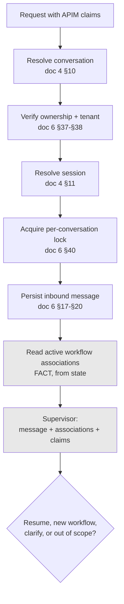

# ADR-D2-04 — Conversation Manager responsibility boundary

## 1. Summary

The Conversation Manager owns conversation and session lifecycle, message persistence,
concurrency control and active-workflow *association*. It owns no routing, no intent
classification and no workflow *execution*. The boundary is drawn at a specific place: the
Conversation Manager answers "is there an active workflow?" and the Supervisor answers "what
should happen next?"

## 2. Context and Problem Statement

Doc 6 §4 lists the Conversation Manager's responsibilities and §5 its non-responsibilities. Doc 2
§7 gives it a layer. Doc 4 §10–§12 place conversation resolution, session resolution and existing
workflow detection in the request lifecycle. Doc 7 §15 places existing-workflow detection
*before* the Supervisor.

That last placement is the crux, and it is easy to get wrong in a way that quietly relocates
routing authority. Doc 7 §15 says:

```
Conversation → Active Workflow? → YES: Resume / NO: Supervisor
```

Read as an implementation instruction, this appears to give the Conversation Manager a routing
decision: it decides whether to resume or to route. If that reading is taken, the Conversation
Manager starts asking questions it has no business asking — is this message a continuation of
the affiliation workflow, or a new intent? Doc 6 §25 is a whole section on exactly that
distinction ("Workflow Resume vs New Intent"), and it is a *semantic* judgement about what the
user meant.

The moment the Conversation Manager makes semantic judgements, three things follow. It needs the
message content, not just its identity. It needs intent understanding, duplicating the
Supervisor. And the platform has two components that route, with no clear rule about which wins
— which is how a system develops inconsistent behaviour that nobody can localise.

The opposite error is equally available: making the Conversation Manager a thin persistence
shim, and pushing session lifecycle, concurrency and workflow association into the Supervisor or
the harness. Doc 6 §39–§40 require concurrency control over concurrent requests on one
conversation; doc 6 §48 requires handling session expiry *during* a workflow. These are lifecycle
concerns with real complexity, and scattering them across components that are focused on routing
and execution would leave them under-owned.

There is also a four-state question. Doc 6 §6 distinguishes conversation, session and workflow.
`CLAUDE.md` adds enterprise business state as the fourth. The Conversation Manager touches three
of the four and must not touch the fourth. Where exactly it stops is worth stating, because
"active workflow association" sounds like workflow ownership and is not.

## 3. Decision Drivers

### 3.1 Functional drivers

| ID | Driver | Source |
|---|---|---|
| DR-F-01 | Conversation and session lifecycle must be owned in one place | doc 6 §4 |
| DR-F-02 | Existing workflow detection must precede supervisor invocation | doc 7 §15; doc 4 §12 |
| DR-F-03 | Concurrent requests on one conversation must be controlled | doc 6 §39, §40 |
| DR-F-04 | Session expiry during a workflow must not lose the workflow | doc 6 §48 |
| DR-F-05 | A conversation may host several workflows | doc 6 §23 |
| DR-F-06 | Conversation ownership and tenant boundary must be enforced | doc 6 §37, §38 |

### 3.2 Non-functional drivers

| ID | Driver | Target | Source |
|---|---|---|---|
| DR-N-01 | Conversation resolution must not add material latency | ≤20 ms | ADR-D5-18 |
| DR-N-02 | Message persistence must not lose messages on failure | 0 lost messages | doc 6 §21 |
| DR-N-03 | Concurrency control must not serialise unrelated conversations | Per-conversation scope only | doc 6 §40 |

### 3.3 Constraints

| ID | Constraint | Type | Source |
|---|---|---|---|
| DR-C-01 | Conversation, session, workflow and enterprise state are strictly separate | Platform | `CLAUDE.md`; doc 6 §6 |
| DR-C-02 | The Conversation Manager performs no intent classification or routing | Platform | doc 6 §5 |
| DR-C-03 | Claims come from APIM and are consumed, never derived | Platform | doc 6 §36; ADR-D1-07 |
| DR-C-04 | The application layer holds no I/O detail | Platform | ADR-D2-01 §7.1 |

### 3.4 Assumptions

| ID | Assumption | If false | Validation |
|---|---|---|---|
| DR-A-01 | Active-workflow detection can be answered from state alone, without message semantics | The boundary in §7.2 is unworkable and detection must move to the Supervisor | Phase 3 design review |
| DR-A-02 | Conversations rarely host more than a few concurrent workflows | Concurrency control needs a richer model than per-conversation locking | doc 6 §41; measured post-launch |
| DR-A-03 | Session TTL is long enough that expiry during a workflow is uncommon | §7.4's handling becomes a frequent path rather than an edge case | QM-04 |

## 4. Evaluation Criteria and Weights

| ID | Criterion | Weight | Rationale | Measurement |
|---|---|---|---|---|
| EC-01 | Single locus of routing authority | 30 | Two components that route produce behaviour nobody can localise | Is there exactly one component making routing decisions? |
| EC-02 | Four-state separation preserved | 25 | `CLAUDE.md` makes conflation of the four states a named failure | Does any component hold two state kinds? |
| EC-03 | Lifecycle concerns properly owned | 20 | Concurrency, expiry and ownership are complex and must not be diffuse | Is each lifecycle concern owned by exactly one component? |
| EC-04 | Latency of the pre-routing path | 15 | Every turn passes through it | Milliseconds added before routing |
| EC-05 | Implementation simplicity | 10 | Real but subordinate | Component count and coupling |
| | **Total** | **100** | | |

Scoring scale: **1** unacceptable · **2** poor · **3** adequate · **4** good · **5** excellent.

## 5. Alternatives Considered

### 5.1 Option A — Conversation Manager decides resume versus new intent

**Description.** The Conversation Manager reads the message, judges whether it continues the
active workflow or starts something new, and either resumes or calls the Supervisor.

**Strengths.**
- Matches a literal reading of doc 7 §15's flowchart.
- Avoids invoking the Supervisor when a workflow is plainly continuing, saving an inference.
- One component sees the whole picture — state and message together.

**Weaknesses.**
- Puts semantic judgement in a lifecycle component. Doc 6 §25's resume-versus-new-intent
  question is intent classification by another name, and doc 6 §5 lists intent classification as
  a non-responsibility (EC-01 fails).
- Two components now interpret user intent, with no rule for which is authoritative.
- The Conversation Manager needs message content and probably model inference, which pulls it
  out of the application layer and into orchestration (DR-C-04).

**Cost / effort.** Low, with a boundary violation.

### 5.2 Option B — State-only detection; Supervisor makes every semantic decision

**Description.** The Conversation Manager answers a purely factual question from state — *is
there an active workflow on this conversation, and which?* — and passes the answer to the
Supervisor as an input. The Supervisor decides resume versus new intent, using that fact plus
the message.

**Strengths.**
- Exactly one component makes routing and semantic decisions (EC-01).
- The Conversation Manager stays a lifecycle component, needing no message understanding
  (EC-02).
- Doc 7 §15's ordering is honoured: detection precedes the Supervisor and feeds it.
- Doc 6 §25's distinction lands where doc 6 §5 says it belongs — outside the Conversation
  Manager.
- Detection is a state lookup, so latency is trivial (EC-04).

**Weaknesses.**
- The Supervisor is invoked even when a workflow is obviously continuing, costing an inference
  per turn that Option A would sometimes skip.
- Requires the Supervisor's decision model to accept active-workflow state as an input, which
  doc 7 §12's example schema does not show.
- The reading of doc 7 §15 is interpretive rather than literal.

**Cost / effort.** Low.

### 5.3 Option C — Merge Conversation Manager into the Supervisor

**Description.** One component owns conversation lifecycle, session, workflow association and
routing.

**Strengths.**
- No boundary to police; no possibility of two routers.
- Fewer components and less inter-component plumbing (EC-05).
- All context available in one place.

**Weaknesses.**
- Collapses lifecycle and routing into one component, which is the opposite of the separation
  doc 2 §7 and doc 6 §3 describe.
- Conversation and session state would sit in the same component as routing logic, weakening
  the four-state separation `CLAUDE.md` requires (EC-02 fails).
- The merged component spans two layers — application and orchestration — breaching ADR-D2-01.
- Concurrency control and session expiry would be entangled with routing.

**Cost / effort.** Low initially, poor structurally.

### 5.4 Option D — Conversation Manager as a thin persistence shim

**Description.** The Conversation Manager only persists messages and resolves identifiers.
Session lifecycle, concurrency and workflow association move to the harness or Supervisor.

**Strengths.**
- Very simple component with one clear job.
- No possibility of it making routing decisions.
- Easy to test.

**Weaknesses.**
- Session lifecycle (doc 6 §14–§16), concurrency control (§39–§40), expiry during workflow
  (§48) and ownership enforcement (§37–§38) become homeless. Distributing them across the
  harness and Supervisor means each is partially owned (EC-03 fails).
- Concurrency control in the Supervisor would serialise routing, not conversation state, which
  is the wrong scope.
- Doc 6 §4 explicitly assigns these to the Conversation Manager.

**Cost / effort.** Low, with concerns under-owned.

## 6. Evaluation Method and Decision Matrix

**Method.** Weighted scoring against §4. EC-01 assessed by asking, for each option, how many
components would need to change to alter routing behaviour. EC-02 assessed by mapping each of
the four state kinds to its owning component under each option.

| Criterion | Weight | A: CM decides | B: State-only detection | C: Merged | D: Thin shim |
|---|---|---|---|---|---|
| EC-01 Single routing locus | 30 | 1 | 5 | 4 | 4 |
| EC-02 Four-state separation | 25 | 3 | 5 | 2 | 4 |
| EC-03 Lifecycle ownership | 20 | 5 | 5 | 4 | 1 |
| EC-04 Pre-routing latency | 15 | 5 | 4 | 4 | 4 |
| EC-05 Simplicity | 10 | 4 | 4 | 5 | 4 |
| **Weighted total** | **100** | **300** | **470** | **355** | **345** |

- **Option B:** (30×5) + (25×5) + (20×5) + (15×4) + (10×4) = 150 + 125 + 100 + 60 + 40 = **470**

**Sensitivity.** B leads by 115 points and loses only on EC-04, by one point, against options
that skip a Supervisor invocation. That inference cost is the price of EC-01, and EC-04's weight
would need to exceed 45 — three times EC-01's margin — for A to overtake. A's real defect is not
its score but its boundary violation: it places intent classification in a component doc 6 §5
forbids it in.

## 7. Decision

### 7.1 What the Conversation Manager owns

| Responsibility | Detail | Source |
|---|---|---|
| Conversation lifecycle | Creation, status, state transitions, closure, reopening | doc 6 §10–§13, §49–§50 |
| Session lifecycle | Session identity, status, TTL, termination | doc 6 §8, §14–§15, §51 |
| Message persistence | Model, sequence, idempotency, persistence, failure handling | doc 6 §17–§21 |
| Active workflow **association** | Which workflow instances are attached to this conversation and their status | doc 6 §22–§23 |
| Concurrency control | Per-conversation serialisation of concurrent requests | doc 6 §39–§41 |
| Ownership and tenant boundary | The conversation belongs to this user in this tenant | doc 6 §37–§38 |
| Conversation context projection | Selecting which prior messages and summary are available downstream | doc 6 §26–§28 |

### 7.2 What it does not own — and the exact line

| Not owned | Owner | Why |
|---|---|---|
| Intent classification | Supervisor | doc 6 §5; it is semantic |
| Routing and agent selection | Supervisor | doc 7 §12 |
| **Resume versus new intent** | Supervisor | doc 6 §25 — a semantic judgement about what the user meant |
| Workflow **execution** | Agent, via harness | doc 6 §5 |
| Workflow business state | Enterprise | ADR-D1-01 §7.2 |
| Context assembly (ERC) | ERC service | doc 8 |
| Memory retrieval | Memory service | doc 9 |

The line runs between **association** and **execution**, and between **fact** and **judgement**:

> The Conversation Manager answers *"is there an active workflow on this conversation, and which
> one?"* — a factual question answerable from state alone. The Supervisor answers *"given that
> fact and this message, what should happen?"* — a semantic question requiring the message.

This is the reading of doc 7 §15 adopted here: its flowchart shows a *sequence*, not an
allocation of decision authority. Detection precedes the Supervisor and feeds it.

### 7.3 Multiple workflows in one conversation

Doc 6 §23 permits several workflows per conversation. The Conversation Manager therefore holds a
*set* of workflow associations with statuses, not a single "current workflow" pointer. The
Supervisor receives the set and decides which — if any — the message relates to.

For affiliation this is not hypothetical. A club administrator may have an affiliation suspended
at PENDING CFA and start a question about an invoice in the same conversation. The Conversation
Manager reports both associations; the Supervisor decides.

### 7.4 Session expiry during a workflow

Doc 6 §48 requires this case be handled. The rule follows from the four-state separation:

- **Session** expiry ends the session. It does not end the conversation and does not end the
  workflow.
- **Workflow** state is durable and independent of session (ADR-D2-10).
- On the user's return, a new session is established; the conversation is reopened; workflow
  associations are intact.
- Fresh claims apply to the new session. The workflow does not inherit the expired session's
  authorization — the same principle as ADR-D2-03 §7.3, applied at the session boundary.

The last point is the security-relevant one: a long-suspended workflow does not carry an
indefinite authorization. Entitlement is re-established on re-entry.

### 7.5 Concurrency control scope

Doc 6 §39–§40 require control over concurrent requests on one conversation. The scope is **per
conversation**, never global and never per user: a user with two conversations open may act on
both concurrently (DR-N-03). Within one conversation, requests are serialised so that message
sequence (doc 6 §18) and workflow association remain consistent.

**Status rationale.** Accepted. Tier 3 under ADR-D0-03 §7.1 — a component boundary within the AI
platform, not a doc 2 §52 category — ratified by the AI Solution Architect.

## 8. Architecture Detail

### 8.1 The pre-routing path



Node `G` is a state read. Node `H` is where every judgement happens. Nothing between `A` and `G`
inspects message content for meaning.

### 8.2 State ownership across the four concepts

| State kind | Owner | Store | Lifetime |
|---|---|---|---|
| Conversation State | Conversation Manager | Redis (ADR-D4-10) | Until closed; reopenable (doc 6 §50) |
| Session State | Conversation Manager | Redis, with TTL (doc 6 §15) | TTL-bounded |
| Workflow/Agent State | Workflow service, associated by the Conversation Manager | Durable store (ADR-D2-10) | Until the workflow terminates |
| Enterprise Business State | **PFF** | Enterprise database | Owned entirely by the enterprise |

The Conversation Manager owns two, associates a third, and never touches the fourth. That is the
four-state separation made concrete at this component, and AC-02 tests it.

### 8.3 Why the Supervisor is invoked even on obvious continuation

Option A's efficiency argument is real: many turns plainly continue an active workflow, and
invoking the Supervisor costs an inference. It is rejected because "plainly" is a semantic
judgement, and the cases where it is wrong are the expensive ones.

Doc 7 §14's own example makes the point — *"I need help with registration"* is ambiguous when
several registration workflows exist. Its affiliation analogue: a user with a suspended
PENDING CFA workflow types *"can I add another team?"*. That could be a question about the
suspended application, a new affiliation for a different team, or a general enquiry. Doc 7 §14
is explicit that the Supervisor *"should not guess when the wrong workflow could trigger an
incorrect enterprise operation"*. A Conversation Manager applying a heuristic would be guessing,
in a component with no confidence model and no clarification path.

The inference cost is accepted. ADR-D3-05 may later introduce a fast deterministic pre-check
inside the Supervisor — which is a Supervisor optimisation, not a relocation of authority.

## 9. Consequences

### 9.1 Positive

- Exactly one component makes routing and semantic decisions, so behaviour is localisable.
- The Conversation Manager stays in the application layer with no need for message
  understanding or model inference.
- Lifecycle concerns — concurrency, expiry, ownership — are owned in one place rather than
  scattered.
- Multiple workflows per conversation are supported without a "current workflow" pointer that
  would need semantic maintenance.
- Session expiry does not extend authorization indefinitely into a suspended workflow.

### 9.2 Negative

- The Supervisor is invoked on every turn, including obvious continuations, costing an
  inference per turn.
- Doc 7 §15's flowchart is read interpretively rather than literally; a reader coming from that
  diagram may expect Option A.
- The Supervisor's decision model must accept workflow associations as an input, extending doc 7
  §12's example schema.

### 9.3 Neutral

- Doc 6 §4 and §5's responsibility lists are adopted essentially unchanged; this decision
  resolves where §25's resume-versus-new-intent question sits.
- Concurrency scope is per conversation, which is the natural granularity.

### 9.4 Trade-offs explicitly accepted

| Given up | In exchange for | Accepted by |
|---|---|---|
| An inference saved on obvious continuations | One component that judges intent, with a confidence model and a clarification path | AI Solution Architect |
| A literal reading of doc 7 §15 | Conformance with doc 6 §5's non-responsibilities | AI Solution Architect |
| A single "current workflow" pointer | Correct support for doc 6 §23's multiple workflows | AI Engineering Lead |

## 10. Golden-Rule and Precedence Conformance

| Constraint | Conformance |
|---|---|
| Enterprise decides; AI orchestrates | The Conversation Manager holds no business state and makes no business decision. Workflow association is a pointer to an AI workflow instance, never to enterprise state. |
| Authoritative-truth precedence | Conversation history is Conversation State, not operational truth. Doc 6 §54 and ADR-D1-03 keep conversation content out of the operational precedence chain; a fact stated three turns ago is not a source. |
| Four-state separation | This ADR is where the separation is operationalised. §8.2 assigns every state kind an owner; the Conversation Manager owns two, associates one, and never touches Enterprise Business State. |
| Versioned artefacts, never mutated in place | Conversation summaries are versioned per doc 6 §31. |
| Adam persona governs how, never what | Not applicable — the Conversation Manager produces no user-facing language. |

## 11. Risks and Mitigations

| ID | Risk | Likelihood | Impact | Exposure | Mitigation | Owner | Residual |
|---|---|---|---|---|---|---|---|
| RSK-01 | A heuristic for resume-versus-new-intent creeps into the Conversation Manager as an optimisation | Medium | High | High | §7.2's fact-versus-judgement line; AC-01 asserts no message-content inspection; code review | AI Solution Architect | Medium |
| RSK-02 | Per-conversation locking causes contention or deadlock | Low | High | Medium | Lock scoped to conversation with a timeout; doc 6 §40; QM-03 | AI Engineering Lead | Low |
| RSK-03 | Session expiry loses workflow association | Low | High | Medium | §7.4: workflow state is durable and independent of session; AC-04 | AI Engineering Lead | Low |
| RSK-04 | Conversation state grows unbounded across a long affiliation | Medium | Medium | Medium | Summarisation per doc 6 §28–§30; retention per ADR-D4-11 | AI Engineering Lead | Low |
| RSK-05 | Ownership check bypassed on a resumed conversation | Low | Very High | High | Ownership verified on every entry (§8.1 node C), not only on creation; AC-03 | Security Owner | Low |
| RSK-06 | Multiple workflow associations confuse the Supervisor | Medium | Medium | Medium | Associations passed as a typed set with statuses; ADR-D3-07 clarification path | AI Engineering Lead | Medium |

## 12. Quantitative Targets and Measures

| ID | Measure | Target | Threshold (alert) | Source | Review cadence |
|---|---|---|---|---|---|
| QM-01 | Routing decisions made outside the Supervisor | 0 | ≥1 | Code audit; trace inspection | Per release |
| QM-02 | Conversation resolution latency, p95 | ≤20 ms | >50 ms | Traces | Weekly |
| QM-03 | Lock acquisition failures or timeouts | ≤0.1% of turns | >1% | Concurrency metrics | Weekly |
| QM-04 | Session expiries occurring during an active workflow | Tracked | >20% of workflows | Session and workflow state | Monthly |
| QM-05 | Messages lost on persistence failure | 0 | ≥1 | Message sequence gaps | Daily |
| QM-06 | Ownership or tenant boundary violations | 0 | ≥1 | Access audit | Daily |

QM-04 validates DR-A-03. A high rate would mean §7.4's path is routine rather than exceptional,
which is a session-TTL question for ADR-D4-11 rather than a defect here.

## 13. Security, Privacy and Compliance Impact

| Dimension | Impact |
|---|---|
| Attack surface change | Ownership and tenant verification on every entry (§8.1 node C) is the platform's conversation-level access control. Verifying on entry rather than only on creation closes the resumed-conversation bypass. |
| Data classification touched | Conversation history contains whatever the user and platform discussed, including personal and safeguarding data surfaced during affiliation pre-checks. |
| Personal data / PII | Conversation and session state hold personal data. Retention and redaction per ADR-D4-11; conversation closure and reopening (doc 6 §49–§50) bound the lifetime. |
| Children's data and safeguarding | Affiliation pre-check conversations will contain officials' DBS and safeguarding outcomes in message history. Retention policy for conversations containing safeguarding fields is the shortest available (ADR-D4-11), and summarisation (doc 6 §28) must not carry a named individual's clearance status into a long-lived summary. |
| UK GDPR lawful basis and rights impact | Conversation records are personal data processed on the enterprise's basis. Ownership enforcement supports access control; retention supports storage limitation (Art. 5(1)(e)). |
| Audit and evidential requirements | Message sequence and idempotency (doc 6 §18–§19) give a reliable record of what was said and when. |
| Standards touched | ISO/IEC 27001 A.5.15 (access control), A.5.33 (protection of records), A.8.10 (information deletion); ISO/IEC 42001; UK GDPR Art. 5(1)(c), 5(1)(e). |

## 14. Implementation Impact

| Aspect | Detail |
|---|---|
| Build phases | 3 (FastAPI runtime, conversation and session layer) |
| Repository paths | `src/pf_ft_ai/application/conversation/`, `src/pf_ft_ai/application/session/`, `src/pf_ft_ai/domain/conversation/`, `src/pf_ft_ai/domain/session/` |
| Configuration | Session TTL, lock timeout, summarisation thresholds in `config/base/` |
| Contracts / schemas | Conversation, session and message models (Pydantic at the API boundary; domain entities internally) |
| Migration | None |
| Dependencies on other ADRs | ADR-D2-01 (layering), ADR-D4-10 (state store), ADR-D2-05 (Supervisor receives the associations) |
| Effort estimate | Moderate — lifecycle, concurrency and persistence are the substance of Phase 3 |

## 15. Validation and Verification

| ID | Acceptance criterion | Verification method |
|---|---|---|
| AC-01 | No module in `application/conversation/` inspects message content for meaning | Code review plus a test asserting the Supervisor is invoked on every turn with an active workflow |
| AC-02 | The Conversation Manager holds no enterprise business state | Type audit of conversation and session models |
| AC-03 | Ownership and tenant are verified on every conversation entry, not only on creation | Adversarial test: resume another user's conversation |
| AC-04 | Session expiry during a workflow leaves the workflow resumable with fresh claims | Expiry scenario test |
| AC-05 | Two workflows can be associated with one conversation and both reported to the Supervisor | Multi-workflow test |
| AC-06 | Concurrent requests on one conversation are serialised; different conversations are not | Concurrency test |
| AC-07 | A message persistence failure does not create a sequence gap | Failure injection test; QM-05 |

## 16. Operational Impact

| Aspect | Detail |
|---|---|
| Monitoring | Conversation and session counts, lock contention, resolution latency, expiry-during-workflow rate |
| Alerting | QM-05 and QM-06 on any occurrence; QM-03 on contention |
| Runbook | None specific; state store issues covered by Redis operations |
| Failure mode and degradation | If conversation state is unavailable, no turn can proceed — the platform cannot establish who is speaking or about what. This is a hard dependency and correctly so; degrading to an unidentified conversation would breach ownership enforcement. |
| Rollback | Standard deployment rollback; conversation state is compatible across versions per doc 6 §31's summary versioning |
| Support model impact | Support needs conversation lookup by ID for investigation, within the same ownership rules |

## 17. Cost Impact

| Cost element | One-off | Recurring | Basis |
|---|---|---|---|
| Conversation and session layer | Phase 3 | — | `DEVELOPMENT-GUIDE.md` §4 |
| Supervisor invocation on continuation turns | — | One inference per turn | The accepted cost of §8.3 |
| State store | — | Redis capacity for conversation, session and message data | ADR-D4-10 |

## 18. Revisit Triggers and Causal Analysis Hooks

| ID | Trigger | Detected by | Action on trigger |
|---|---|---|---|
| RT-01 | QM-01 records a routing decision outside the Supervisor | Release review | Remove it; the boundary has been breached |
| RT-02 | Supervisor invocation cost becomes a material share of per-turn cost | Cost analysis (ADR-D8-01) | Optimise **inside** the Supervisor (ADR-D3-05), never by relocating the decision |
| RT-03 | QM-04 shows expiry during workflow above 20% (DR-A-03 false) | Monthly review | Review session TTL in ADR-D4-11; §7.4's path is fine but should not be routine |
| RT-04 | QM-03 shows lock contention above 1% | Weekly review | Review lock scope and timeout; do not widen scope beyond one conversation |
| RT-05 | Conversations routinely host many concurrent workflows (DR-A-02 false) | Usage analysis | Richer association model may be needed; ADR-D3-07's clarification load rises |

**Scheduled review:** 2027-08-21.

## 19. Traceability

| Dimension | Reference |
|---|---|
| Workshop sheet | WS-07 Enterprise Reference Architecture; WS-08 Workflow Orchestration Architecture |
| Specification sections | doc 6 §3 (Boundary), §4 (Responsibilities), §5 (Non-Responsibilities), §6 (Conversation vs Session vs Workflow), §17–§21 (Messages), §22–§23 (Workflow Association, Multiple Workflows), §25 (Workflow Resume vs New Intent), §26–§31 (Context Projection, Summary), §37–§38 (Ownership, Tenant), §39–§41 (Concurrency), §48 (Session Expiration During Workflow), §49–§51 (Closure, Reopening, Termination); doc 2 §7 (Conversation Layer); doc 4 §10–§12; doc 7 §15 (Existing Workflow Detection) |
| Requirement IDs | `NFR-A38-REL`, `NFR-A38-SEC` |
| Build phases | 3 |
| Code paths | `src/pf_ft_ai/application/conversation/`, `src/pf_ft_ai/application/session/`, `src/pf_ft_ai/domain/conversation/` |
| Configuration | Session TTL, lock timeout, summarisation thresholds |
| Tests | AC-01 to AC-07 |
| Upstream ADRs | ADR-D2-01, ADR-D2-03 |
| Downstream ADRs | ADR-D2-05, ADR-D2-10, ADR-D4-01, ADR-D4-11, ADR-D6-03 |

## 20. Change Log

| Version | Date | Author | Change |
|---|---|---|---|
| 1.0.0 | 2026-08-21 | AI Solution Architect | Initial decision recorded. Boundary drawn between factual workflow detection (Conversation Manager) and semantic resume-versus-new-intent judgement (Supervisor); doc 7 §15 read as a sequence rather than an allocation of decision authority; session expiry does not extend workflow authorization. |
