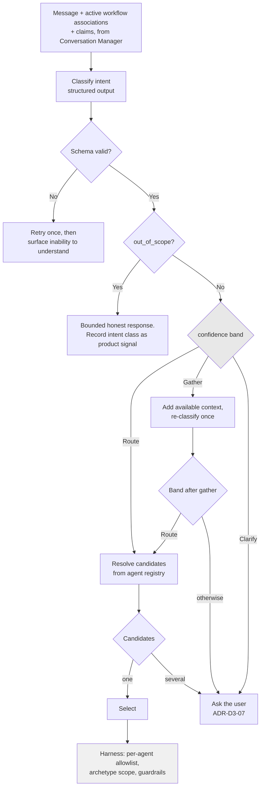

# ADR-D2-05 — Supervisor intent routing, confidence thresholds and candidate agent selection

## 1. Summary

The Supervisor produces a **schema-validated structured decision** — intent, workflow, agent,
confidence, clarification flag — before any routing occurs. Confidence is a routing signal only,
never a business authorization, and the thresholds are configurable and evaluated. Below the
routing threshold the Supervisor clarifies rather than guessing, because doc 7 §14 is explicit
that a wrong workflow can trigger an incorrect enterprise operation.

## 2. Context and Problem Statement

Doc 7 §12 gives the Supervisor's output shape: a JSON object with `intent`, `workflow`, `agent`,
`confidence` and `clarification_required`, and states that *"this output must be schema validated
before routing."* Doc 7 §13 gives a three-band confidence model — high routes, medium gathers
context or clarifies, low clarifies — with *"thresholds must be configurable and evaluated."*
Doc 7 §14 gives the clarification rule and its rationale.

Three things are underspecified in ways that matter.

**What confidence actually means.** Doc 7 §12's example shows `0.96`. A confidence number from a
language model is not a calibrated probability — it is a token the model produced because the
prompt asked for one, and its relationship to actual correctness is unknown until measured. Doc 7
§13's instruction that thresholds be *"evaluated"* is the acknowledgement of this. Treating an
uncalibrated number as if it were a probability, and setting a threshold at 0.9 because that
sounds high, is a common and quiet failure.

**Where the bands sit and what happens between them.** Doc 7 §13's "medium confidence → additional
context / clarification" offers two different responses without saying which applies when.
Gathering more context and asking the user are very different actions with very different costs.

**How the single-agent case behaves.** ADR-D1-11 builds one agent. With one candidate, a naive
Supervisor routes everything to it, and confidence becomes decorative. That is exactly backwards:
with one agent, the Supervisor's most important job is deciding what is **out of scope**, because
most of what a county-football user might ask is not affiliation. Doc 7 §5's supervisor
responsibilities and doc 7 §24's agent selection assume a catalogue; the single-agent case needs
its own treatment.

There is a security dimension too. Doc 7 §13 says confidence is *"a routing signal, not a
business authorization."* The Supervisor's decision selects which agent runs and therefore which
tool allowlist applies. If the decision object were treated as authoritative for anything beyond
routing — if, say, a high-confidence classification were allowed to widen a tool allowlist — a
model output would have become an authorization input, which ADR-D1-02's invariant I-2 forbids.

## 3. Decision Drivers

### 3.1 Functional drivers

| ID | Driver | Source |
|---|---|---|
| DR-F-01 | The Supervisor's output must be schema-validated before routing | doc 7 §12 |
| DR-F-02 | Confidence is a routing signal, never business authorization | doc 7 §13 |
| DR-F-03 | Thresholds must be configurable and evaluated | doc 7 §13 |
| DR-F-04 | The Supervisor must not guess where a wrong workflow could trigger an incorrect enterprise operation | doc 7 §14 |
| DR-F-05 | Existing workflow associations must inform routing | doc 7 §15; ADR-D2-04 §7.2 |
| DR-F-06 | Agent selection resolves from the capability registry | doc 7 §22–§24 |

### 3.2 Non-functional drivers

| ID | Driver | Target | Source |
|---|---|---|---|
| DR-N-01 | Routing must not dominate turn latency | ≤400 ms p95 | ADR-D5-18 |
| DR-N-02 | Routing decisions must be reproducible for evaluation | Same input, same decision at temperature 0 | ADR-D3-16 |
| DR-N-03 | Out-of-scope handling must be as reliable as in-scope routing | Same evaluation rigour | ADR-D1-11 §7.4 |

### 3.3 Constraints

| ID | Constraint | Type | Source |
|---|---|---|---|
| DR-C-01 | Model output is never an authorization input | Platform | ADR-D1-02 I-2 |
| DR-C-02 | One agent exists in the first pass | Organisational | ADR-D1-11 |
| DR-C-03 | The Supervisor makes no business decision | Platform | doc 7 §5; ADR-D1-01 |
| DR-C-04 | Structured output must be schema-validated | Platform | doc 7 §71; ADR-D3-17 |

### 3.4 Assumptions

| ID | Assumption | If false | Validation |
|---|---|---|---|
| DR-A-01 | Model-reported confidence correlates usefully with routing correctness | Confidence bands are meaningless and routing must use a separate signal | Calibration measurement, §7.3 |
| DR-A-02 | Clarification is acceptable to users at the rate the thresholds produce | Thresholds are too conservative and the platform feels obstructive | QM-04 |
| DR-A-03 | Out-of-scope intents are distinguishable from in-scope ones with one agent | Out-of-scope handling is unreliable, which is most of the single-agent experience | Evaluation suite |

## 4. Evaluation Criteria and Weights

| ID | Criterion | Weight | Rationale | Measurement |
|---|---|---|---|---|
| EC-01 | Avoidance of wrong-workflow routing | 35 | Doc 7 §14 names the consequence: an incorrect enterprise operation. This is the failure that costs a user a wrongly submitted application | Rate of routing to the wrong workflow |
| EC-02 | Confidence treated honestly | 25 | An uncalibrated number used as a probability produces false safety | Is the threshold derived from measurement or from intuition? |
| EC-03 | Out-of-scope reliability | 20 | With one agent this is most of the Supervisor's work | Rate of correct out-of-scope classification |
| EC-04 | Clarification rate acceptable to users | 12 | Over-clarifying is a real failure, just a less dangerous one | Clarifications per conversation |
| EC-05 | Latency and cost | 8 | Real but subordinate | Milliseconds and tokens per routing decision |
| | **Total** | **100** | | |

Scoring scale: **1** unacceptable · **2** poor · **3** adequate · **4** good · **5** excellent.

## 5. Alternatives Considered

### 5.1 Option A — Model classification with a fixed intuitive threshold

**Description.** The model returns doc 7 §12's decision object; route if `confidence >= 0.85`,
otherwise clarify. The threshold is set by judgement and adjusted when complaints arrive.

**Strengths.**
- Simple and immediately implementable.
- Matches doc 7 §12's example shape directly.
- One number to tune.
- Low latency and cost — one classification call.

**Weaknesses.**
- The threshold is meaningless without calibration. If the model reports 0.9 on cases it gets
  right 70% of the time, an 0.85 threshold routes a third of borderline cases wrongly while
  appearing conservative (EC-02 fails).
- Fails doc 7 §13's requirement that thresholds be *evaluated*.
- Tuning by complaint is a slow feedback loop against a fast failure.

**Cost / effort.** Lowest.

### 5.2 Option B — Structured decision with calibrated, evaluated thresholds and explicit bands

**Description.** The model returns the decision object, schema-validated. Thresholds are derived
from a labelled golden set by measuring actual routing accuracy at each confidence level, and
are re-derived whenever the model or prompt changes. Doc 7 §13's three bands are given distinct
actions. Out-of-scope is a first-class classification outcome, not a low-confidence side effect.

**Strengths.**
- Thresholds mean something measurable, satisfying doc 7 §13 (EC-02).
- Wrong-workflow rate is measured directly against the golden set rather than inferred (EC-01).
- Out-of-scope is classified positively, so it is evaluable independently (EC-03).
- Re-derivation on model or prompt change prevents silent drift when the underlying
  distribution moves.
- Clarification rate is a tuning input, not an accident (EC-04).

**Weaknesses.**
- Requires a labelled golden set before thresholds can be set, which is work ahead of Phase 4.
- Thresholds must be re-derived on every model or prompt release, adding a gate.
- Still depends on model-reported confidence being informative at all (DR-A-01).

**Cost / effort.** Moderate; the golden set is reusable by ADR-D7-13.

### 5.3 Option C — Deterministic rules first, model only for ambiguity

**Description.** A rule layer handles clear cases — explicit keywords, an active workflow with a
plainly continuing message — and the model is invoked only when rules do not resolve.

**Strengths.**
- Lowest latency and cost for the common case (EC-05).
- Deterministic behaviour where rules apply, so those cases are perfectly reproducible.
- Reduces exposure to model variance.

**Weaknesses.**
- Rules encoding "what the user meant" are a second intent classifier with worse coverage.
  Keyword matching on "registration" is exactly the ambiguity doc 7 §14 warns about.
- Two classifiers with different failure modes, and the rule layer's failures are silent.
- Rule maintenance grows with the workflow catalogue.
- The efficiency gain is real but small relative to a turn's total cost.

**Cost / effort.** Moderate, with growing maintenance.

### 5.4 Option D — Route to all plausible agents; let agents decline

**Description.** The Supervisor routes optimistically to any plausible candidate; agents that
find the request inapplicable decline and the next is tried.

**Strengths.**
- No clarification needed in ambiguous cases; the system resolves them itself.
- Agents have full context to judge applicability, which the Supervisor lacks.
- Degrades gracefully as the catalogue grows.

**Weaknesses.**
- Directly violates doc 7 §14. Invoking an agent means initialising its harness and potentially
  executing tools; "try it and see" against an enterprise write operation is the incorrect
  enterprise operation doc 7 §14 exists to prevent (EC-01 fails).
- Multiplies latency and cost by candidate count.
- An agent declining after gathering context has already assembled data it should not have.

**Cost / effort.** Moderate, with an unacceptable failure mode.

## 6. Evaluation Method and Decision Matrix

**Method.** Weighted scoring against §4. EC-01 assessed against doc 7 §14's stated consequence.
EC-02 assessed by asking whether each option can answer "what does confidence 0.85 mean?" with a
measurement.

| Criterion | Weight | A: Fixed threshold | B: Calibrated bands | C: Rules first | D: Try agents |
|---|---|---|---|---|---|
| EC-01 Wrong-workflow avoidance | 35 | 2 | 5 | 3 | 1 |
| EC-02 Honest confidence | 25 | 1 | 5 | 3 | 2 |
| EC-03 Out-of-scope reliability | 20 | 2 | 5 | 3 | 2 |
| EC-04 Clarification rate | 12 | 3 | 4 | 4 | 5 |
| EC-05 Latency and cost | 8 | 5 | 4 | 5 | 1 |
| **Weighted total** | **100** | **211** | **481** | **321** | **196** |

- **Option B:** (35×5) + (25×5) + (20×5) + (12×4) + (8×4) = 175 + 125 + 100 + 48 + 32 = **481**

**Sensitivity.** B leads C by 160 points and dominates on the three highest-weighted criteria.
Its only sub-maximum scores are clarification rate and cost, together worth 20 points — B would
still lead if it scored 1 on both. D is excluded by doc 7 §14 categorically: speculative agent
invocation against enterprise operations is the named failure. C's rule layer is not rejected
outright and returns in §7.6 as a possible *pre-filter inside* the Supervisor, which is a
different thing from a competing classifier.

## 7. Decision

### 7.1 The decision object

The Supervisor produces a structured decision, schema-validated before any routing action:

```yaml
intent: string                 # classified intent
workflow: string | null        # resolved workflow, null if out of scope
agent: string | null           # resolved agent from the registry, null if none
confidence: float              # 0.0-1.0, model-reported
clarification_required: bool
out_of_scope: bool             # positive classification, not an absence
candidate_agents: [string]     # resolved candidates before selection
resume_workflow_id: string | null   # if continuing an associated workflow
reasoning: string              # for traces and evaluation; never shown to the user
```

Two additions to doc 7 §12's example are deliberate. `out_of_scope` is a positive flag rather
than an inference from `agent: null`, so it is evaluable in its own right (§7.5). `reasoning` is
captured for traces and never surfaced — it is diagnostic, and exposing model reasoning to users
would leak prompt structure.

Schema validation failure is a hard failure: the turn does not route. Per ADR-D3-17, malformed
structured output is retried once and then surfaced as an inability to understand, never
salvaged by parsing prose.

### 7.2 Confidence is a routing signal only

Per doc 7 §13 and DR-C-01, `confidence` may influence exactly one thing: whether to route,
gather, or clarify. It may **not** influence:

- which tools an agent may call — the allowlist is per agent, resolved from configuration
  (ADR-D1-02 I-3);
- what data is assembled — scope comes from the access archetype (ADR-D1-07);
- whether a business operation proceeds — that is never a model decision;
- guardrail strictness — controls do not relax on high confidence.

A high-confidence classification and a low-confidence one that both route to `AffiliationAgent`
produce identical authority. This is I-2 applied at the routing boundary.

### 7.3 Thresholds are derived, not chosen

Doc 7 §13 requires thresholds be configurable and evaluated. They are derived by measurement:

1. A labelled golden set of routing cases is maintained (ADR-D7-13), covering in-scope,
   ambiguous and out-of-scope inputs.
2. For each confidence decile, actual routing accuracy is measured on that set.
3. The **route** threshold is set where measured accuracy meets the target — the point above
   which the wrong-workflow rate is acceptable, not the point where the number looks high.
4. The **clarify** threshold is set where accuracy degrades enough that asking beats guessing.
5. Thresholds are re-derived on every model change, prompt change or golden-set expansion, as a
   release gate (ADR-D6-15).

This is what makes DR-A-01 testable rather than assumed. If measurement shows confidence does not
correlate with correctness — a real possibility — the bands are meaningless and §7.6's
alternative signal is required. RT-01 covers that case.

### 7.4 The three bands and their distinct actions

Doc 7 §13's "additional context / clarification" is split into two distinct behaviours:

| Band | Action | Rationale |
|---|---|---|
| **Route** (≥ route threshold) | Select the agent and proceed | Measured accuracy is adequate |
| **Gather** (between thresholds) | Retrieve additional *available* context — active workflow associations, recent conversation summary, session state — and re-classify **once** | Ambiguity is sometimes resolvable from context the classifier did not have. Costs one extra inference, no user interruption |
| **Clarify** (< clarify threshold, or still ambiguous after gathering) | Ask the user (ADR-D3-07) | Doc 7 §14: do not guess |

The Gather band re-classifies at most once. A second failure to reach the route threshold goes to
Clarify — an unbounded gather loop would be a latency failure and would not converge, since the
available context does not grow.

### 7.5 Out-of-scope is a first-class outcome

With one agent (DR-C-02), most user inputs about county football administration are not
affiliation. Out-of-scope classification is therefore the Supervisor's highest-volume outcome,
and it is treated accordingly:

- It is a positive classification (`out_of_scope: true`), not the absence of a match.
- It is evaluated with the same rigour as in-scope routing, on its own golden cases (DR-N-03).
- The response is bounded and honest: what the platform can help with, and where the user goes
  for what it cannot (ADR-D3-07). It must not attempt the request with the agent it has.
- Out-of-scope rates by intent class are a **product signal**, feeding ADR-D1-10 §7.3's
  user-struggle criterion for choosing workflow two.

That last point turns a limitation into useful data: the shape of what users ask and the platform
cannot do is exactly the evidence the workflow-two decision needs.

### 7.6 If confidence proves uninformative

DR-A-01 may be false. If §7.3's calibration shows model-reported confidence does not correlate
with correctness, the fallback is **not** to guess and not to clarify on everything. It is to
derive a routing signal from measurable properties instead — classification stability across
repeated samples, agreement between the classification and the active workflow associations, and
presence of workflow-distinctive entities in the message. This is Option C's rule layer
readmitted as a *signal inside* the Supervisor rather than a competing classifier outside it,
and it keeps EC-01 intact.

**Status rationale.** Accepted. Tier 3 under ADR-D0-03 §7.1 — a component design within the AI
platform — ratified by the AI Solution Architect. The confidence-is-not-authorization rule was
reviewed by the Security Owner as an application of ADR-D1-02 I-2.

## 8. Architecture Detail

### 8.1 Routing flow



Node `L` is where authority is applied, and it reads the agent identity — never the confidence.

### 8.2 Resume versus new intent

ADR-D2-04 §7.2 places this judgement here. The Supervisor receives the active workflow
associations as a fact and decides:

| Situation | Decision |
|---|---|
| Message clearly continues an associated workflow | `resume_workflow_id` set; route to that workflow's agent |
| Message clearly starts something new | New workflow; the existing association remains, per doc 6 §23 |
| Message could be either | Clarify. Doc 7 §14 applies with full force — resuming the wrong workflow and starting a duplicate one are both incorrect enterprise operations |
| Message is out of scope entirely | `out_of_scope: true`, regardless of associations |

The third row is the one that matters in affiliation. A user with a suspended PENDING CFA
application asking *"can I add another team?"* may mean amending the suspended application or
starting a new one. Those have different enterprise consequences. Clarifying costs one turn;
guessing costs a wrongly submitted application.

### 8.3 Selection with one agent

With one registered agent, candidate resolution returns zero or one. The `several` branch exists,
is unreachable in production, and is exercised by ADR-D1-11 §7.3's synthetic test agent — which
is what keeps it correct rather than merely present.

The consequential path with one agent is `D` (out-of-scope), not `J` (selection). Evaluation
weighting reflects that: the golden set carries more out-of-scope cases than in-scope ones,
because that is the production distribution.

## 9. Consequences

### 9.1 Positive

- Thresholds mean something measured, so doc 7 §13's "evaluated" requirement is satisfied rather
  than nodded at.
- Wrong-workflow routing is measured directly and is the primary tuning target.
- Out-of-scope classification is evaluable, which matters because it is the majority outcome
  with one agent.
- Confidence cannot influence authority, closing the route by which a model output could widen
  access.
- Out-of-scope rates by intent become product evidence for the workflow-two decision.

### 9.2 Negative

- A labelled golden set must exist before thresholds can be set, which is work ahead of Phase 4
  and must be maintained.
- Threshold re-derivation is a release gate on every model or prompt change, adding process.
- The Gather band costs a second inference on ambiguous turns.
- Clarification will sometimes ask about things a user considers obvious, which is the cost of
  not guessing.

### 9.3 Neutral

- Doc 7 §12's decision object is extended by two fields, both additive.
- Option C's rule layer is not rejected permanently; §7.6 readmits it as an internal signal if
  calibration fails.

### 9.4 Trade-offs explicitly accepted

| Given up | In exchange for | Accepted by |
|---|---|---|
| A simple fixed threshold | Thresholds derived from measured accuracy | AI Evaluation Owner |
| Some turns resolved without asking | Never guessing where a wrong workflow triggers an incorrect enterprise operation | AI Product Owner |
| Lower latency on ambiguous turns | One re-classification attempt before interrupting the user | AI Solution Architect |

## 10. Golden-Rule and Precedence Conformance

| Constraint | Conformance |
|---|---|
| Enterprise decides; AI orchestrates | Doc 3 §46 marks workflow and agent selection as authoritative *AI* decisions — this is one of the few places the AI decides. It decides which capability runs, never any business outcome. |
| Authoritative-truth precedence | The routing decision is SLM output, authority 1, and is used only to select a code path. It never enters ERC and never becomes a business fact. |
| Four-state separation | The Supervisor reads Conversation State (associations, summary) and Session State (claims); it writes Workflow State selection. It touches no Enterprise Business State. |
| Versioned artefacts, never mutated in place | Thresholds live in versioned configuration; the classifier prompt is a versioned artefact per ADR-D3-11; a threshold change is a release. |
| Adam persona governs how, never what | The Supervisor produces no user-facing language. Clarification and out-of-scope wording are generated downstream through the persona layer. |

## 11. Risks and Mitigations

| ID | Risk | Likelihood | Impact | Exposure | Mitigation | Owner | Residual |
|---|---|---|---|---|---|---|---|
| RSK-01 | Model confidence proves uncorrelated with correctness (DR-A-01) | Medium | High | High | §7.3 calibration measures it directly rather than assuming; §7.6 provides the alternative signal; RT-01 | AI Evaluation Owner | Medium |
| RSK-02 | Wrong-workflow routing triggers an incorrect enterprise operation | Low | Very High | High | Thresholds set on measured accuracy; clarification below threshold; §8.2's ambiguity rule; QM-01 | AI Solution Architect | Low |
| RSK-03 | Clarification rate makes the platform feel obstructive (DR-A-02) | Medium | Medium | Medium | Gather band resolves some ambiguity without asking; QM-04 tracks the rate; thresholds tunable | AI Product Owner | Medium |
| RSK-04 | Confidence leaks into an authorization path | Low | Very High | High | §7.2 prohibition; AC-03 adversarial test; ADR-D1-02 I-2 | Security Owner | Low |
| RSK-05 | Out-of-scope handled poorly, which is most of the single-agent experience | Medium | High | High | §7.5 first-class treatment; golden set weighted to production distribution; QM-03 | AI Evaluation Owner | Medium |
| RSK-06 | Thresholds drift as the model or prompt changes | Medium | High | High | Re-derivation as a release gate (ADR-D6-15); QM-05 | AI Evaluation Owner | Low |

## 12. Quantitative Targets and Measures

| ID | Measure | Target | Threshold (alert) | Source | Review cadence |
|---|---|---|---|---|---|
| QM-01 | Wrong-workflow routing rate on the golden set | ≤1% | >3% | Evaluation suite | Per release |
| QM-02 | Schema validation failures on the decision object | ≤0.5% of turns | >2% | Structured output metrics | Weekly |
| QM-03 | Out-of-scope classification accuracy | ≥95% | <90% | Evaluation suite | Per release |
| QM-04 | Clarifications per conversation | ≤0.3 | >0.8 | Conversation traces | Weekly |
| QM-05 | Releases shipped without threshold re-derivation | 0 | ≥1 | Release gate records | Per release |
| QM-06 | Routing decisions where confidence influenced anything beyond band selection | 0 | ≥1 | Code audit; trace inspection | Per release |
| QM-07 | Gather-band turns escalating to Clarify | Tracked | >70% | Routing metrics | Monthly |

QM-07 measures whether the Gather band earns its extra inference. If most gathers end in
clarification anyway, the band is cost without benefit and should collapse (RT-04).

## 13. Security, Privacy and Compliance Impact

| Dimension | Impact |
|---|---|
| Attack surface change | The Supervisor is the first component to process user message content semantically, so it is an injection target. Structured output with schema validation bounds what a successful injection can produce: a malformed or out-of-range decision fails validation rather than routing somewhere unintended. |
| Data classification touched | User message content; conversation summary; workflow associations. |
| Personal data / PII | The classifier sees message content, which may contain personal data. `reasoning` is retained in traces and is subject to redaction per ADR-D7-04. |
| Children's data and safeguarding | A user may describe a safeguarding concern in a message the Supervisor classifies. Out-of-scope handling must route such a message to a human path rather than attempting it — an important case for §7.5's response design, and one Compliance/Legal should review in the golden set. |
| UK GDPR lawful basis and rights impact | No automated decision about a person: routing selects a capability, not an outcome affecting the user's rights. |
| Audit and evidential requirements | The full decision object including `reasoning` and `confidence` is traced per turn, giving a complete account of why a turn routed as it did. |
| Standards touched | ISO/IEC 42001 (AI system decision-making, human oversight); NIST AI RMF MEASURE 2.3 (validity and reliability), 2.5; EU AI Act Art. 14 — the clarification path is a human-oversight mechanism. |

## 14. Implementation Impact

| Aspect | Detail |
|---|---|
| Build phases | 4 (supervisor and routing) |
| Repository paths | `src/pf_ft_ai/orchestration/supervisor/` |
| Configuration | Thresholds in `config/base/agents.yaml`; classifier prompt in `prompts/system/` |
| Contracts / schemas | Decision object schema (Pydantic); agent capability registry schema |
| Migration | None |
| Dependencies on other ADRs | ADR-D2-04 (associations as input), ADR-D3-06 (classification approach), ADR-D3-17 (structured output), ADR-D7-13 (golden set) |
| Effort estimate | Moderate; the golden set and calibration are a meaningful share |

## 15. Validation and Verification

| ID | Acceptance criterion | Verification method |
|---|---|---|
| AC-01 | No routing occurs on an unvalidated decision object | Test with malformed structured output |
| AC-02 | Thresholds in configuration match those derived from the current golden set | Release gate check; QM-05 |
| AC-03 | Confidence value does not affect tool allowlist, context scope or guardrail behaviour | Adversarial test varying confidence with identical input; QM-06 |
| AC-04 | A message ambiguous between resuming and starting a workflow produces clarification | Scenario test per §8.2 row 3 |
| AC-05 | Out-of-scope inputs are classified positively and answered within bounds | Evaluation suite; QM-03 |
| AC-06 | The Gather band re-classifies at most once before escalating | Routing loop test |
| AC-07 | With the synthetic test agent registered, multi-candidate selection escalates to clarification | Extensibility test |

## 16. Operational Impact

| Aspect | Detail |
|---|---|
| Monitoring | Decision object, confidence, band and outcome traced per turn; out-of-scope intent distribution |
| Alerting | QM-01, QM-03 and QM-06 breaches; schema failure rate |
| Runbook | `docs/runbooks/slm.md` for classifier failures |
| Failure mode and degradation | If classification fails repeatedly, the platform states it cannot determine what is needed and offers the portal. It must not default to the single available agent — that would be guessing with extra steps. |
| Rollback | Thresholds and classifier prompt are versioned; both roll back independently of code |
| Support model impact | Trace shows the decision object, so "why did it ask me that?" is answerable precisely |

## 17. Cost Impact

| Cost element | One-off | Recurring | Basis |
|---|---|---|---|
| Supervisor and decision schema | Phase 4 | — | `DEVELOPMENT-GUIDE.md` §4 |
| Golden set and calibration | ~3 days | ~0.5 day per release | Shared with ADR-D7-13 |
| Classification inference | — | One per turn, plus one on Gather-band turns | ADR-D8-01 |
| Threshold re-derivation | — | ~1 hour per model or prompt release | Release gate |

## 18. Revisit Triggers and Causal Analysis Hooks

| ID | Trigger | Detected by | Action on trigger |
|---|---|---|---|
| RT-01 | Calibration shows confidence uncorrelated with correctness (DR-A-01 false) | Calibration measurement | Adopt §7.6's derived signal; do not keep using a meaningless number |
| RT-02 | QM-01 exceeds 3% wrong-workflow rate | Per release | Raise the route threshold; causal analysis on the failing cases |
| RT-03 | QM-04 exceeds 0.8 clarifications per conversation | Weekly review | Thresholds too conservative, or classification is weak; distinguish before tuning |
| RT-04 | QM-07 shows over 70% of Gather turns escalating to Clarify | Monthly review | The Gather band is not earning its inference; collapse to two bands |
| RT-05 | A second agent is registered | Agent onboarding | Re-derive thresholds; the multi-candidate path becomes live and its accuracy is unmeasured |
| RT-06 | QM-06 records confidence influencing anything beyond band selection | Release review | Governance incident; ADR-D1-02 I-2 breached |

**Scheduled review:** 2027-08-21.

## 19. Traceability

| Dimension | Reference |
|---|---|
| Workshop sheet | WS-08 Workflow Orchestration Architecture |
| Specification sections | doc 7 §5 (Supervisor Responsibility), §11 (Supervisor-to-Agent Flow), §12 (Supervisor Decision Model), §13 (Supervisor Confidence), §14 (Supervisor Clarification), §15 (Existing Workflow Detection), §22–§24 (Agent Capability Registry, Registry Example, Agent Selection), §71 (Structured Output); doc 2 §8 (Supervisor Layer); doc 4 §13 (Supervisor Execution), §14 (Clarification Path); doc 3 §46 |
| Requirement IDs | `FR-A39-02`, `NFR-A38-REL` |
| Build phases | 4 |
| Code paths | `src/pf_ft_ai/orchestration/supervisor/` |
| Configuration | `config/base/agents.yaml` thresholds; `prompts/system/` classifier prompt |
| Tests | AC-01 to AC-07; routing golden set |
| Upstream ADRs | ADR-D1-11, ADR-D2-04 |
| Downstream ADRs | ADR-D2-09, ADR-D3-05, ADR-D3-06, ADR-D3-07, ADR-D3-17 |

## 20. Change Log

| Version | Date | Author | Change |
|---|---|---|---|
| 1.0.0 | 2026-08-21 | AI Solution Architect | Initial decision recorded. Thresholds derived from measured accuracy rather than chosen; doc 7 §13's medium band split into Gather and Clarify with distinct actions; out-of-scope made a first-class classification outcome, reflecting that it is the majority outcome with one agent. |
