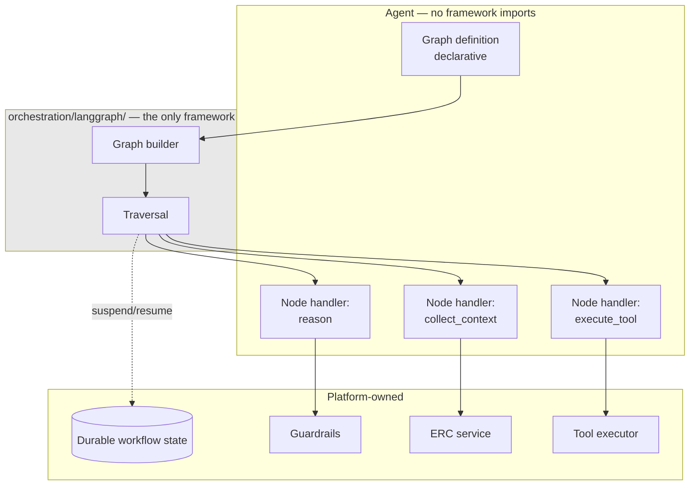

# ADR-D2-06 — Workflow orchestration engine: LangGraph

## 1. Summary

LangGraph is adopted as the workflow orchestration engine, confirming `CLAUDE.md`'s stated
stack. The decision that needed making was not *whether* — that was fixed — but **how much of
the platform depends on it**. LangGraph is confined to graph construction and traversal;
durability, ERC, guardrails, tool execution and retry semantics are the platform's own, so the
engine is replaceable at bounded cost.

## 2. Context and Problem Statement

`CLAUDE.md` lists LangGraph under Confirmed Tech Stack. Doc 7 §9 assigns it responsibility, §25
gives an example `AffiliationGraph`, §28 lists twenty typical nodes, §29 classifies nodes as
deterministic or AI, §30 gives edge types. Doc 1 §12 and §13 cover LangGraph and
sequential/parallel/hybrid execution. Doc 1 §39 criterion 4 requires that *"LangGraph supports
sequential and parallel AI execution."*

The engine choice is therefore settled, and an ADR that merely restated it would be recording a
fact rather than a decision. The genuine architectural question — the one that will determine
what this choice costs over the platform's life — is the **depth of coupling**.

Agent frameworks move fast. LangGraph's API has changed materially across versions, and the
platform is expected to run for years in an FA enterprise context where dependency churn is a
real operational cost. Two positions are available:

- **Deep adoption.** Use LangGraph's checkpointing for durability, its interrupt mechanism for
  human-in-the-loop, its state reducers for merge semantics, its retry policies, its
  observability integration. Less code to write; more capability inherited.
- **Bounded adoption.** Use LangGraph for what it is uniquely good at — declaring a graph of
  nodes and edges and traversing it, including conditional and parallel branches — and own
  everything else.

The choice is consequential because of what the platform's requirements actually are. Doc 1 §39
criterion 13 requires long-running workflows to survive request termination. Doc 2 §29 requires
HIL suspension across days. Doc 11 §55 requires resume driven by Service Bus events. ADR-D2-03
§7.3 requires an event-triggered resume to run under a *captured authorization context* that is
validated before use. ADR-D1-02 requires six invariants enforced at platform boundaries.

None of those is a generic agent-framework concern, and several are unusual enough that no
framework's built-in mechanism would satisfy them unmodified. A checkpointer that restores state
does not validate that the user's entitlement is still current. An interrupt mechanism designed
for a notebook does not survive a pod restart three days later, resumed by a message on a
different workload.

So the real question is whether to bend the platform's requirements toward the framework's
mechanisms, or use the framework for graph traversal and build the requirements properly.

## 3. Decision Drivers

### 3.1 Functional drivers

| ID | Driver | Source |
|---|---|---|
| DR-F-01 | Sequential, parallel and hybrid AI execution must be supported | doc 1 §39 criterion 4; doc 1 §13 |
| DR-F-02 | Long-running workflows must survive request termination | doc 1 §39 criterion 13; doc 2 §28 |
| DR-F-03 | Nodes must be classifiable as deterministic or AI | doc 7 §29 |
| DR-F-04 | Graph state must be strongly typed and reference-based | doc 7 §26–§27; ADR-D2-07 |
| DR-F-05 | Resume must run under a captured, revalidated authorization context | ADR-D2-03 §7.3 |
| DR-F-06 | Each agent may have its own graph | doc 7 §25 |

### 3.2 Non-functional drivers

| ID | Driver | Target | Source |
|---|---|---|---|
| DR-N-01 | Engine replacement must not require rewriting agents, ERC, guardrails or tools | Bounded to `orchestration/langgraph/` | ADR-D8-10 |
| DR-N-02 | Framework version upgrades must not break platform semantics | Upgrade is a contained change | Programme practice |
| DR-N-03 | Graph traversal overhead must be small relative to inference | ≤5% of turn latency | ADR-D5-18 |

### 3.3 Constraints

| ID | Constraint | Type | Source |
|---|---|---|---|
| DR-C-01 | LangGraph is the confirmed orchestration engine | Organisational | `CLAUDE.md` |
| DR-C-02 | LangGraph internal state uses TypedDict; Pydantic at boundaries | Platform | `CLAUDE.md`; ADR-D2-07 |
| DR-C-03 | Layering is enforced; orchestration imports infrastructure interfaces only | Platform | ADR-D2-01 §7.2 |
| DR-C-04 | Agents are logical capabilities in one runtime | Platform | ADR-D2-02 |

### 3.4 Assumptions

| ID | Assumption | If false | Validation |
|---|---|---|---|
| DR-A-01 | LangGraph's graph model expresses the node and edge shapes doc 7 §28–§30 require | Some workflow shapes need bespoke traversal | Phase 4 spike against the affiliation graph |
| DR-A-02 | Framework churn is a real cost worth insulating against | Bounded adoption is unnecessary caution | Observed over the platform's life; QM-04 |
| DR-A-03 | Platform-owned durability outperforms framework checkpointing for this workload | Reinventing a solved problem | Phase 12 resumption testing |

## 4. Evaluation Criteria and Weights

| ID | Criterion | Weight | Rationale | Measurement |
|---|---|---|---|---|
| EC-01 | Fitness for the platform's actual durability and HIL requirements | 30 | Doc 1 §39 criterion 13 and ADR-D2-03 §7.3 are unusual requirements; a mechanism that half-fits is worse than none | Does the mechanism satisfy captured-context revalidation and multi-day, cross-workload resume? |
| EC-02 | Replaceability of the engine | 25 | Frameworks churn; vendor lock-in is an ADR-D8-10 concern | Files needing change to swap engines |
| EC-03 | Development effort | 20 | Building what a framework provides is waste, if it fits | Code written versus inherited |
| EC-04 | Upgrade safety | 15 | A breaking framework change must not break platform semantics | Blast radius of a major version bump |
| EC-05 | Observability and debuggability | 10 | Graph execution must be traceable | Trace fidelity per node |
| | **Total** | **100** | | |

Scoring scale: **1** unacceptable · **2** poor · **3** adequate · **4** good · **5** excellent.

## 5. Alternatives Considered

Engine selection is fixed by DR-C-01. The alternatives are depth-of-adoption positions, plus one
recorded counterfactual (Option D) to document why the confirmed choice is sound rather than
merely mandated.

### 5.1 Option A — Deep adoption: use LangGraph's full feature set

**Description.** Use LangGraph checkpointers for durability, interrupts for HIL, state reducers
for merge semantics, built-in retry policies and its tracing integration.

**Strengths.**
- Least code written; substantial capability inherited (EC-03).
- Idiomatic use, so community knowledge and documentation apply directly.
- Framework improvements arrive for free.
- Checkpointing and interrupts are genuinely well-designed for their intended use.

**Weaknesses.**
- Checkpointer durability does not satisfy ADR-D2-03 §7.3. A restored checkpoint carries the
  authorization context as data; nothing revalidates entitlement before resuming. Bolting
  revalidation onto a checkpointer means reimplementing most of it anyway (EC-01).
- Interrupts are designed for in-process human input, not for a workflow suspended for three days
  and resumed by a Service Bus message on a different workload.
- Framework retry policies would compete with the platform's own retry hierarchy (doc 4 §56) and
  its idempotency model (doc 10 §45–§47), producing two retry layers with different semantics.
- Engine replacement becomes a rewrite of durability, HIL and retry (EC-02).
- A breaking change to checkpointing is a breaking change to the platform's core guarantee
  (EC-04).

**Cost / effort.** Lowest initially; highest at upgrade or replacement.

### 5.2 Option B — Bounded adoption: graph construction and traversal only

**Description.** LangGraph declares nodes, edges, conditional routing and parallel branches, and
traverses them. Durability, HIL suspension and resume, retry, idempotency, guardrails, ERC and
tool execution are platform-owned, invoked from within nodes.

**Strengths.**
- Durability and HIL are built to the platform's actual requirements, including captured-context
  revalidation (EC-01).
- Engine dependency is confined to `orchestration/langgraph/`; agents, ERC, guardrails and tools
  never import it (EC-02).
- One retry hierarchy, one idempotency model, one durability mechanism — no competing semantics.
- A framework upgrade touches graph construction only (EC-04).
- Satisfies DR-N-01 and ADR-D2-01's layering directly.

**Weaknesses.**
- More code: a durability mechanism, a suspension model and a resume path must be built.
- Forgoes framework capabilities that would otherwise be free.
- Risks reimplementing something the framework does better (DR-A-03).
- Less idiomatic; community examples use the features being declined.

**Cost / effort.** Higher initially; lower at upgrade and replacement.

### 5.3 Option C — Selective adoption: framework durability, platform HIL

**Description.** Use LangGraph checkpointing for within-turn durability and platform mechanisms
for cross-turn HIL suspension.

**Strengths.**
- Inherits checkpointing where it fits well.
- Less code than Option B.
- Keeps the hard HIL case under platform control.

**Weaknesses.**
- Two durability mechanisms with different failure modes, and a boundary between them that must
  be reasoned about on every workflow. Which state is where after a crash mid-suspension is not
  obvious.
- The seam is exactly where bugs concentrate: state partially in a checkpointer, partially in
  platform storage.
- Engine replacement still requires rewriting the checkpointed half (EC-02).
- No clean answer for a workflow that suspends *during* the part the checkpointer owns.

**Cost / effort.** Moderate, with the worst structural property of the three.

### 5.4 Option D — A different or bespoke orchestration engine (counterfactual)

**Description.** Temporal, a bespoke state machine, or another agent framework.

**Strengths.**
- Temporal is purpose-built for durable execution and would satisfy DR-F-02 exceptionally.
- A bespoke engine would fit the requirements exactly.
- No agent-framework churn exposure.

**Weaknesses.**
- Excluded by DR-C-01; `CLAUDE.md` confirms LangGraph.
- Temporal adds substantial operational surface — a cluster to run — for a platform whose
  durability needs are met by durable state plus event-driven resume.
- A bespoke engine forfeits LangGraph's genuine strength: expressing conditional and parallel
  graph traversal declaratively, which doc 7 §30 and doc 1 §13 both require.
- Recorded to show the confirmed choice is defensible: LangGraph's declarative graph model is a
  good fit for doc 7 §25–§30's node and edge shapes, which is the part the platform actually
  needs.

**Cost / effort.** Not pursued.

## 6. Evaluation Method and Decision Matrix

**Method.** Weighted scoring against §4. EC-01 assessed by testing each option against three
concrete requirements: a workflow suspended for three days at PENDING CFA; resumed by a Service
Bus event on the consumer workload, not the API workload; running under a captured authorization
context that must be revalidated. EC-02 assessed by listing the packages that would change to
replace the engine.

| Criterion | Weight | A: Deep | B: Bounded | C: Selective | D: Other engine |
|---|---|---|---|---|---|
| EC-01 Fitness for durability and HIL | 30 | 2 | 5 | 3 | 4 |
| EC-02 Replaceability | 25 | 1 | 5 | 2 | 3 |
| EC-03 Development effort | 20 | 5 | 3 | 4 | 1 |
| EC-04 Upgrade safety | 15 | 2 | 5 | 3 | 4 |
| EC-05 Observability | 10 | 4 | 4 | 4 | 4 |
| **Weighted total** | **100** | **255** | **455** | **310** | **310** |

- **Option B:** (30×5) + (25×5) + (20×3) + (15×5) + (10×4) = 150 + 125 + 60 + 75 + 40 = **455**

**Sensitivity.** B leads C by 145 points and loses only on development effort, where A leads by
two points on a 20-weight criterion — worth 40 points against B's 200-point margin over A. The
result is insensitive to reweighting: B wins EC-01, EC-02 and EC-04 by three points each, and
those carry 70 of the 100 weight between them. D is excluded by DR-C-01 and scores no better
than C in any case.

## 7. Decision

### 7.1 LangGraph is used for graph construction and traversal

Within scope for LangGraph:

- declaring nodes and their handlers;
- declaring edges, including conditional edges (doc 7 §30);
- fan-out and fan-in for parallel branches (doc 7 §34; doc 1 §13);
- traversing the graph and invoking node handlers in order;
- carrying the typed state object between nodes (ADR-D2-07).

### 7.2 What the platform owns instead

| Capability | Owner | Why not the framework |
|---|---|---|
| Durability and workflow persistence | `application/workflows/` + ADR-D4-10 store | Must survive pod restart and workload change across days; must be readable by the event consumer, not just the API workload (ADR-D2-03) |
| HIL suspension and resume | ADR-D2-10 | Resume is event-driven, cross-workload, and requires captured-context revalidation (ADR-D2-03 §7.3) |
| Retry and timeout | ADR-D2-11; doc 4 §55–§56 | One hierarchy; framework retries would compete with tool-level and API-level retry and with the idempotency model |
| Idempotency | doc 10 §45–§47 | Tied to enterprise operation semantics, not graph traversal |
| Guardrails | ADR-D1-02; `guardrails/` | Enforced at platform boundaries, applying identically on both runtime paths |
| ERC assembly | `context/`; ADR-D2-12 | Platform concern; graph nodes invoke it |
| Tool execution and authorization | `integration/tools/`; ADR-D6-10 | Allowlist and validation are security controls, not traversal |
| Observability | ADR-D7-02 Langfuse | One trace model spanning both runtime paths; nodes emit spans through the platform's client |

### 7.3 The dependency boundary

`langgraph` may be imported **only** by modules under `src/pf_ft_ai/orchestration/langgraph/`.
Not by agents, not by ERC, not by guardrails, not by tools, not by the harness. This is enforced
by ADR-D2-01's import-boundary test, which makes DR-N-01 a build-time property rather than an
intention.

A node handler is a plain async function taking the state object and returning an update. It
carries no framework types in its signature. That is what makes the handlers — where the actual
work lives — portable.

### 7.4 Node classification

Doc 7 §29's deterministic/AI classification is adopted and made structural. Every node declares
its class:

| Class | Examples (doc 7 §28) | Property |
|---|---|---|
| **Deterministic** | `validate_request`, `authorize_tool`, `execute_tool`, `validate_tool_result`, `build_erc`, `validate_erc`, `validate_output` | No model inference. Reproducible. Testable without an SLM. |
| **AI** | `identify_intent`, `identify_entities`, `reason`, `select_tool`, `generate_response` | Model inference. Non-deterministic above temperature 0. Requires evaluation, not only unit tests. |

The classification is not documentation. It determines how a node is tested (unit versus
evaluation), whether it appears in the deterministic-control surface ADR-D1-02 §7.1 depends on,
and whether its output requires schema validation (ADR-D3-17). A node that changes class is a
significant change.

### 7.5 One graph per agent

Per doc 7 §25, each agent declares its own graph. `AffiliationGraph` is built from doc 7 §28's
node vocabulary, using the subset affiliation needs — doc 7 §28 notes explicitly that *"not every
workflow requires every node."*

Graphs are constructed from a declarative definition rather than assembled imperatively, so that
graph structure is inspectable, diffable and versionable as a configuration artefact (ADR-D5-06),
not buried in code.

**Status rationale.** Accepted. Tier 1 under ADR-D0-03 §7.1 — LangGraph architecture is a doc 2
§52 category — ratified by the external ADF/ADR governance forum.

## 8. Architecture Detail

### 8.1 Where LangGraph sits

The dotted edge is the important one: suspension and resumption are platform operations that the
traversal defers to, not framework features it uses.

### 8.2 Suspension across a three-day CFA review

The concrete case Option A cannot handle:

1. `AffiliationGraph` reaches a `wait` node after submission returns PENDING CFA.
2. The node handler returns a suspension result. Traversal stops; the API request completes and
   the user gets a response.
3. Platform durability writes workflow state — including the captured authorization context —
   to the durable store (ADR-D2-10). Nothing framework-specific is serialised.
4. The pod restarts. The API workload scales down overnight. Three days pass.
5. An `AffiliationApproved` event arrives on the **consumer** workload.
6. Workflow state is loaded; the captured context is revalidated (ADR-D2-03 §7.3).
7. A fresh graph traversal begins at the resume node with the restored state.

Step 3 is why durability is platform-owned: the persisted state must be readable by a different
workload, in a different process, after a framework upgrade, and must contain nothing that ties
it to a framework version. Step 6 is why the framework's interrupt mechanism does not fit — it
has no concept of revalidating entitlement, because no generic framework would.

### 8.3 Replacement cost

If LangGraph were replaced, the change is bounded to:

| Changes | Does not change |
|---|---|
| `orchestration/langgraph/` graph builder and traversal | Node handlers — plain async functions |
| Graph definition format, if the replacement differs | Agents, ERC, guardrails, tools, memory, cache |
| — | Durability, HIL, retry, idempotency, observability |

QM-02 measures this by asserting no framework import exists outside the boundary. It is the
concrete expression of ADR-D8-10's portability concern.

## 9. Consequences

### 9.1 Positive

- Durability and HIL are built to the platform's real requirements, including cross-workload
  resume and captured-context revalidation.
- One retry hierarchy and one idempotency model, with no competing framework semantics.
- Engine replacement is bounded to one package, verified by the import-boundary test.
- Framework upgrades touch graph construction only.
- Node handlers are plain functions and are testable without the framework.

### 9.2 Negative

- More code than Option A: durability, suspension and resume are the platform's to build and
  maintain.
- Some LangGraph capability is deliberately unused, which will look like under-use to anyone
  familiar with the framework.
- Community examples and documentation assume the features being declined, so idiomatic
  guidance applies less directly.
- Risk of reimplementing something the framework does better (DR-A-03), tested at Phase 12.

### 9.3 Neutral

- LangGraph remains the confirmed engine per `CLAUDE.md`; this decision sets its depth, not its
  identity.
- Doc 7 §25–§30's node and edge model is adopted essentially unchanged.

### 9.4 Trade-offs explicitly accepted

| Given up | In exchange for | Accepted by |
|---|---|---|
| Inherited checkpointing and interrupts | Durability that satisfies cross-workload, multi-day, revalidated resume | AI Solution Architect |
| Idiomatic framework usage | An engine dependency confined to one package | AI Platform Owner |
| Lower initial development effort | Bounded upgrade and replacement cost over the platform's life | External ADF/ADR forum |

## 10. Golden-Rule and Precedence Conformance

| Constraint | Conformance |
|---|---|
| Enterprise decides; AI orchestrates | The graph orchestrates AI execution only. Business decisions occur in enterprise systems reached through tool nodes; no graph node evaluates a business rule (ADR-D1-02 I-6). |
| Authoritative-truth precedence | Graph state holds *references* to ERC rather than copies (doc 7 §27), so precedence and provenance stay with the ERC service and cannot be lost in a state transition. |
| Four-state separation | Graph state is Workflow/Agent State. It references conversation and session by identifier and holds no enterprise business state. ADR-D2-07 enforces this at the type level. |
| Versioned artefacts, never mutated in place | Graph definitions are declarative and versioned per ADR-D5-06; agents are versioned per doc 7 §21. |
| Adam persona governs how, never what | `generate_response` is an AI node whose output passes the persona layer and then the output guardrail; the graph does not shape language. |

## 11. Risks and Mitigations

| ID | Risk | Likelihood | Impact | Exposure | Mitigation | Owner | Residual |
|---|---|---|---|---|---|---|---|
| RSK-01 | Framework features creep in beyond the boundary as conveniences | Medium | High | High | Import-boundary test (ADR-D2-01); QM-02; the boundary is a build failure, not a review comment | AI Engineering Lead | Low |
| RSK-02 | Platform-built durability is worse than framework checkpointing (DR-A-03) | Medium | Medium | Medium | Phase 12 resumption tests against the three-day, cross-workload case; if it fails, the fix is better platform durability, not framework adoption — the requirements are unchanged | AI Engineering Lead | Medium |
| RSK-03 | LangGraph's graph model cannot express a required shape (DR-A-01) | Low | Medium | Low | Phase 4 spike against the full `AffiliationGraph`; a shape it cannot express is handled in the handler, not by escaping the boundary | AI Solution Architect | Low |
| RSK-04 | Breaking framework change forces significant rework despite the boundary | Low | Medium | Low | Version pinned (ADR-D5-04); upgrade tested against the affiliation graph; blast radius is one package | AI Engineering Lead | Low |
| RSK-05 | Node classification (§7.4) treated as documentation rather than structure | Medium | Medium | Medium | Class declared on every node and asserted in tests; determines test strategy and output validation | AI Engineering Lead | Low |
| RSK-06 | Graph state grows large, defeating doc 7 §27's reference rule | Medium | Medium | Medium | ADR-D2-07's reference-only rule with a size assertion in tests | AI Engineering Lead | Low |

## 12. Quantitative Targets and Measures

| ID | Measure | Target | Threshold (alert) | Source | Review cadence |
|---|---|---|---|---|---|
| QM-01 | Graph traversal overhead as a share of turn latency | ≤5% | >15% | Traces | Weekly |
| QM-02 | `langgraph` imports outside `orchestration/langgraph/` | 0 | ≥1 | Import-boundary test | Per build |
| QM-03 | Workflows resumed successfully after a full runtime restart | 100% | <100% | Durability test | Per build |
| QM-04 | Framework major version upgrades requiring changes outside the boundary | 0 | ≥1 | Upgrade change review | Per upgrade |
| QM-05 | Nodes without a declared deterministic/AI class | 0 | ≥1 | Graph definition audit | Per build |
| QM-06 | Graph state size at any transition | ≤ configured ceiling | Above ceiling | State size assertion | Per build |

QM-04 is the direct test of whether bounded adoption delivered what it was chosen for. A single
occurrence means the boundary leaked somewhere QM-02 did not catch.

## 13. Security, Privacy and Compliance Impact

| Dimension | Impact |
|---|---|
| Attack surface change | Confining the framework to one package limits the code paths through which a framework vulnerability could be reached. Node handlers, where user-influenced data flows, contain no framework code. |
| Data classification touched | Graph state references personal data in ERC rather than carrying it, per doc 7 §27 — which limits what is serialised at suspension. |
| Personal data / PII | Persisted workflow state carries references and identifiers, not personal data copies. A three-day suspension therefore does not park personal data in workflow storage. |
| Children's data and safeguarding | Safeguarding facts stay in ERC behind a reference, so a suspended affiliation workflow does not persist a named individual's DBS status in workflow state. That is a direct consequence of doc 7 §27's reference rule and is worth the explicit note. |
| UK GDPR lawful basis and rights impact | Reference-based state supports minimisation (Art. 5(1)(c)) and simplifies erasure — deleting ERC removes the data, leaving a dangling reference rather than an orphaned copy. |
| Audit and evidential requirements | Each node emits a span through the platform's Langfuse client (ADR-D7-02), giving a uniform trace across both runtime paths rather than a framework-specific one. |
| Standards touched | ISO/IEC 27001 A.8.25–A.8.28 (secure development, architecture), A.8.29 (security testing); ISO/IEC 42001 (AI system components); NIST AI RMF MAP 2.1. |

## 14. Implementation Impact

| Aspect | Detail |
|---|---|
| Build phases | 4 (graph builder, state, node registry) |
| Repository paths | `src/pf_ft_ai/orchestration/langgraph/` — builder, state, node registry |
| Configuration | Graph definitions as versioned declarative artefacts; `config/base/workflows.yaml` |
| Contracts / schemas | `AgentGraphState` TypedDict (ADR-D2-07); node handler signature |
| Migration | None |
| Dependencies on other ADRs | ADR-D2-01 (boundary enforcement), ADR-D2-07 (state), ADR-D2-10 (durability), ADR-D5-04 (version pinning) |
| Effort estimate | Moderate for the graph layer; durability and HIL are costed in ADR-D2-10 |

## 15. Validation and Verification

| ID | Acceptance criterion | Verification method |
|---|---|---|
| AC-01 | No module outside `orchestration/langgraph/` imports `langgraph` | Import-boundary test; QM-02 |
| AC-02 | Node handlers have signatures free of framework types | Signature audit; handlers callable directly in tests |
| AC-03 | A workflow suspended at a `wait` node resumes correctly after a full restart, on the consumer workload | Cross-workload durability test; QM-03 |
| AC-04 | Sequential, parallel and hybrid execution all function in the affiliation graph | Execution pattern tests; `FR-A39-04` |
| AC-05 | Every node declares a deterministic or AI class | Graph definition audit; QM-05 |
| AC-06 | Graph state contains references, not raw datasets | State size assertion; QM-06 |
| AC-07 | Persisted workflow state contains no framework-versioned structures | Serialisation audit |

AC-07 is what makes AC-03 survivable across a framework upgrade: if persisted state carried
framework types, a version bump would strand suspended workflows.

## 16. Operational Impact

| Aspect | Detail |
|---|---|
| Monitoring | Per-node spans with class, duration and outcome; graph-level completion and suspension rates |
| Alerting | Traversal errors, suspensions exceeding expected duration, resume failures |
| Runbook | `docs/runbooks/README.md`; resume failures covered by the Service Bus runbook |
| Failure mode and degradation | A traversal failure fails the turn with workflow state preserved; the user can retry, and the workflow is not lost. A framework fault is contained to the traversal package. |
| Rollback | Framework version is pinned; rollback is a dependency change. Graph definitions roll back independently of code. |
| Support model impact | Per-node traces make "where did it stop?" answerable directly |

## 17. Cost Impact

| Cost element | One-off | Recurring | Basis |
|---|---|---|---|
| Graph builder, state, node registry | Phase 4 | — | `DEVELOPMENT-GUIDE.md` §4 |
| Platform durability and HIL | Costed in ADR-D2-10 | — | The additional cost of Option B over Option A |
| Framework upgrades | — | Bounded to one package | QM-04 |
| Licence | None | None | Open source |
| Avoided cost | — | Ongoing | Option A's replacement or major-upgrade cost would span durability, HIL and retry |

## 18. Revisit Triggers and Causal Analysis Hooks

| ID | Trigger | Detected by | Action on trigger |
|---|---|---|---|
| RT-01 | QM-02 records a framework import outside the boundary | CI | Build failure; remove before merge |
| RT-02 | QM-04 records an upgrade requiring changes outside the boundary | Upgrade review | Causal analysis; the boundary leaked in a way imports did not reveal |
| RT-03 | Phase 12 shows platform durability failing the cross-workload resume case (DR-A-03) | Durability testing | Fix the platform mechanism; the requirement does not bend to the framework |
| RT-04 | A required graph shape cannot be expressed (DR-A-01) | Phase 4 spike | Handle in the node handler; escalate only if traversal itself is inadequate |
| RT-05 | LangGraph is deprecated or its direction diverges materially | Ecosystem monitoring | Engine replacement, bounded by §8.3; a tier 1 superseding ADR |
| RT-06 | Framework churn proves lower than expected (DR-A-02 false) | Observed over two years | Reconsider selective adoption of specific features, each on its own merits |

**Scheduled review:** 2027-08-21.

## 19. Traceability

| Dimension | Reference |
|---|---|
| Workshop sheet | WS-08 Workflow Orchestration Architecture |
| Specification sections | doc 7 §9 (LangGraph Responsibility), §25 (LangGraph Graph Model), §26–§27 (Graph State, Graph State Rule), §28 (Graph Nodes), §29 (Deterministic vs AI Nodes), §30 (Graph Edge Types), §34 (Fan-Out/Fan-In); doc 1 §12 (LangGraph), §13 (Sequential/Parallel/Hybrid), §39 criteria 4, 13; doc 2 §11 (LangGraph Execution Architecture), §13 (Execution Pattern), §28 (Durable Workflow Architecture); doc 4 §19–§20, §55–§56; `CLAUDE.md` |
| Requirement IDs | `FR-A39-04`, `FR-A39-13`, `NFR-A38-MAINT` |
| Build phases | 4 |
| Code paths | `src/pf_ft_ai/orchestration/langgraph/` |
| Configuration | Graph definitions; `config/base/workflows.yaml` |
| Tests | AC-01 to AC-07 |
| Upstream ADRs | ADR-D2-01, ADR-D2-02, ADR-D2-03 |
| Downstream ADRs | ADR-D2-07, ADR-D2-08, ADR-D2-09, ADR-D2-10, ADR-D2-11, ADR-D8-10 |

## 20. Change Log

| Version | Date | Author | Change |
|---|---|---|---|
| 1.0.0 | 2026-08-21 | AI Solution Architect | Initial decision recorded. LangGraph confirmed per `CLAUDE.md`, with adoption bounded to graph construction and traversal; durability, HIL, retry, idempotency and observability retained by the platform because cross-workload multi-day resume with captured-context revalidation is not a generic framework concern. Tier 1 — ratified by the external ADF/ADR forum. |
