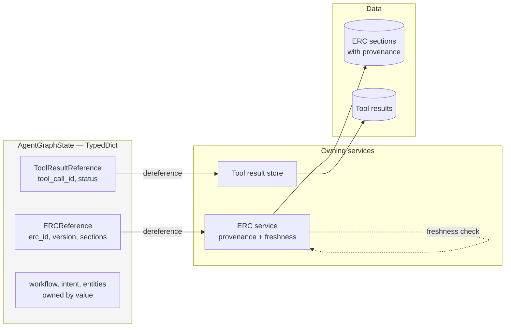

# ADR-D2-07 — Graph state representation: TypedDict internally, Pydantic at boundaries, references not copies

## 1. Summary

LangGraph internal state is a `TypedDict`, as `CLAUDE.md` requires; everything crossing a
boundary is a Pydantic model. The consequential part is doc 7 §27's rule: graph state carries
**references** to large data, never copies. This is not only a serialisation optimisation — it is
what keeps provenance authoritative, keeps personal data out of suspended workflow storage, and
keeps a three-day suspension from freezing a stale copy of enterprise state.

## 2. Context and Problem Statement

`CLAUDE.md` states the representation split: *"Boundary models: Pydantic everywhere data crosses
a boundary... LangGraph internal state: TypedDict."* Doc 7 §26 gives a conceptual
`AgentGraphState` with fourteen fields. Doc 7 §27 adds the rule that matters most:

> Do not put large raw datasets into every graph transition. Prefer: Graph State → Reference →
> ERC / Store → Large Dataset. This reduces serialization and token overhead.

Doc 7 §27 justifies the rule on serialisation and token cost. Those are real, and they are the
least important reasons. Three others are more consequential and are not stated anywhere in the
specification set.

**Provenance survival.** ADR-D1-03 makes precedence a property carried on every fact. If graph
state copied ERC values, the copies would need to carry provenance too, and every node that
transformed them would need to preserve it. The first node that assembled a plain dictionary
would drop it, and precedence would become uncomputable for those facts. A reference means
provenance lives in exactly one place — the ERC service — and is never in danger of being
flattened by a state transition.

**Staleness across suspension.** An affiliation workflow suspends at PENDING CFA for three days.
If graph state held a copy of the application status, the resumed workflow would restore
`PENDING CFA` as though it were current. ADR-D1-03 §7.3 requires freshness invalidation, and a
copy in workflow state has no freshness policy attached — it is simply a value that was true once.
A reference forces the resumed workflow to consult ERC, which applies the freshness policy and
refreshes.

**Personal data in workflow storage.** Doc 7 §26's state includes `erc`, `rag_context`,
`memory_context` and `tool_results`. If those were copies, a suspended affiliation workflow would
persist officials' names, DBS statuses and safeguarding outcomes into workflow storage for
three days. As references, workflow storage holds identifiers. That difference is material for
UK GDPR minimisation and for the safeguarding-data handling in ADR-D6-16.

There is also a representation question that looks like style and is not. `TypedDict` gives type
checking with no runtime validation and no runtime overhead; Pydantic gives runtime validation
at a cost. Applying Pydantic everywhere would be safer-sounding and would validate the same data
repeatedly at every node transition, on the platform's hottest path. Applying `TypedDict`
everywhere would leave boundary data unvalidated, which `CLAUDE.md` forbids and which is where
malformed data actually enters.

## 3. Decision Drivers

### 3.1 Functional drivers

| ID | Driver | Source |
|---|---|---|
| DR-F-01 | LangGraph internal state is `TypedDict` | `CLAUDE.md` |
| DR-F-02 | Pydantic everywhere data crosses a boundary | `CLAUDE.md`; ADR-D5-03 |
| DR-F-03 | Graph state must reference large data, not copy it | doc 7 §27, §40 |
| DR-F-04 | Graph state must be strongly typed | doc 7 §26 |
| DR-F-05 | State must be serialisable for suspension and resume | ADR-D2-10 |
| DR-F-06 | The four state concepts must not be conflated in graph state | `CLAUDE.md`; doc 5 |

### 3.2 Non-functional drivers

| ID | Driver | Target | Source |
|---|---|---|---|
| DR-N-01 | State transition overhead must be negligible | ≤1 ms per transition | ADR-D5-18 |
| DR-N-02 | Persisted state must stay small | ≤ configured ceiling | doc 7 §27 |
| DR-N-03 | Persisted state must survive a framework upgrade | No framework types serialised | ADR-D2-06 AC-07 |

### 3.3 Constraints

| ID | Constraint | Type | Source |
|---|---|---|---|
| DR-C-01 | The representation split is fixed by `CLAUDE.md` | Organisational | `CLAUDE.md` |
| DR-C-02 | Provenance is carried on facts by the ERC service | Platform | ADR-D1-03 §8.1 |
| DR-C-03 | Framework types must not reach persisted state | Platform | ADR-D2-06 §7.3 |
| DR-C-04 | Personal data must be minimised in storage | Regulatory | UK GDPR Art. 5(1)(c) |

### 3.4 Assumptions

| ID | Assumption | If false | Validation |
|---|---|---|---|
| DR-A-01 | Referenced data is retrievable whenever a node needs it | Nodes fail on dereference; a fallback to copies would be needed | ERC lifetime versus workflow lifetime analysis |
| DR-A-02 | ERC outlives, or is refreshable across, a workflow suspension | A resumed workflow cannot dereference and must rebuild ERC | ADR-D4-06; Phase 12 testing |
| DR-A-03 | `TypedDict` type checking catches the errors runtime validation would | Internal state errors reach production | mypy strict coverage |

## 4. Evaluation Criteria and Weights

| ID | Criterion | Weight | Rationale | Measurement |
|---|---|---|---|---|
| EC-01 | Provenance and freshness integrity | 30 | A copied fact loses its provenance and its freshness policy, breaking ADR-D1-03 | Can a fact reach the model without provenance? |
| EC-02 | Personal data minimisation in persisted state | 25 | Suspended workflows persist for days; what they hold is a real privacy question | Does workflow storage hold personal data? |
| EC-03 | Type safety | 20 | Fourteen fields across twenty nodes; untyped state is unmaintainable | Are errors caught at build or at runtime? |
| EC-04 | Transition performance | 15 | Every node transition, every turn | Milliseconds and bytes per transition |
| EC-05 | Serialisation robustness | 10 | State must survive restart and framework upgrade | Does persisted state carry framework or library types? |
| | **Total** | **100** | | |

Scoring scale: **1** unacceptable · **2** poor · **3** adequate · **4** good · **5** excellent.

## 5. Alternatives Considered

### 5.1 Option A — Pydantic models throughout, values embedded

**Description.** Graph state is a Pydantic model. ERC sections, RAG passages, memory items and
tool results are embedded as values.

**Strengths.**
- Runtime validation at every transition; malformed state cannot propagate.
- One representation everywhere — simplest mental model.
- Rich validators, serialisation and schema generation available throughout.
- State is self-contained, so a node needs nothing external.

**Weaknesses.**
- Contradicts `CLAUDE.md`'s explicit `TypedDict` requirement (DR-C-01).
- Embedded values lose provenance unless every model carries it and every transformation
  preserves it — one omission and precedence becomes uncomputable (EC-01).
- Suspended workflow state would persist officials' personal and safeguarding data for the
  duration of a CFA review (EC-02).
- Revalidating the whole state at every node is repeated work on the hottest path (EC-04).
- Doc 7 §27's rule is directly violated.

**Cost / effort.** Low, with three significant defects.

### 5.2 Option B — TypedDict internally, Pydantic at boundaries, references to large data

**Description.** `AgentGraphState` is a `TypedDict` carrying scalars, identifiers and typed
reference objects. ERC, RAG, memory and tool results are referenced. Anything entering or leaving
the graph — the request, the response, tool payloads, persisted state — is a Pydantic model
validated at the boundary.

**Strengths.**
- Provenance stays with the ERC service; a reference cannot flatten it (EC-01).
- Persisted state holds identifiers, not personal data (EC-02).
- `TypedDict` with mypy strict gives build-time type safety at zero runtime cost (EC-03, EC-04).
- Validation happens where data actually enters, not repeatedly on trusted internal transitions.
- Satisfies `CLAUDE.md` and doc 7 §26–§27 directly.
- Suspended state is small and free of framework types (EC-05).

**Weaknesses.**
- Nodes must dereference, so a node needs the ERC service rather than only its state.
- A stale or unresolvable reference is a failure mode copies do not have (DR-A-01).
- No runtime validation of internal state; a type error escaping mypy surfaces at runtime.
- Two representations to understand, and the boundary between them must be clear.

**Cost / effort.** Low.

### 5.3 Option C — TypedDict throughout, including boundaries

**Description.** `TypedDict` everywhere, with manual validation at boundaries where needed.

**Strengths.**
- One representation; no boundary to reason about.
- Zero runtime overhead everywhere.
- Simplest possible types.

**Weaknesses.**
- Boundary data is unvalidated. Tool responses, enterprise API payloads and user requests are
  exactly where malformed data enters, and `TypedDict` provides no runtime check (EC-03 fails at
  the point it matters).
- Contradicts `CLAUDE.md`'s Pydantic-at-boundaries requirement.
- Manual validation is validation that gets forgotten.

**Cost / effort.** Low, with unguarded boundaries.

### 5.4 Option D — Immutable event-sourced state

**Description.** Graph state is an append-only sequence of typed events; current state is derived
by folding them.

**Strengths.**
- Complete history of how state was reached — excellent for debugging.
- Immutability eliminates a class of mutation bugs.
- Natural audit trail.
- Replay for testing.

**Weaknesses.**
- Substantial complexity for a state object of fourteen fields.
- Folding on every access, or caching the fold, which reintroduces mutable state.
- Persisted event log grows across a multi-day suspension.
- Does not address EC-01 or EC-02 — events would carry copies unless references are used anyway,
  so the reference decision is orthogonal and still required.

**Cost / effort.** High, for benefit disproportionate to the state's size.

## 6. Evaluation Method and Decision Matrix

**Method.** Weighted scoring against §4. EC-01 and EC-02 assessed against a concrete case: an
affiliation workflow suspended at PENDING CFA for three days, with a club of thirty teams and
forty officials in ERC.

| Criterion | Weight | A: Pydantic + values | B: TypedDict + references | C: TypedDict throughout | D: Event-sourced |
|---|---|---|---|---|---|
| EC-01 Provenance and freshness | 30 | 2 | 5 | 2 | 3 |
| EC-02 Personal data minimisation | 25 | 1 | 5 | 1 | 2 |
| EC-03 Type safety | 20 | 5 | 4 | 2 | 4 |
| EC-04 Transition performance | 15 | 2 | 5 | 5 | 3 |
| EC-05 Serialisation robustness | 10 | 3 | 5 | 4 | 3 |
| **Weighted total** | **100** | **250** | **480** | **235** | **295** |

- **Option B:** (30×5) + (25×5) + (20×4) + (15×5) + (10×5) = 150 + 125 + 80 + 75 + 50 = **480**

**Sensitivity.** B leads by 185 points and loses only on type safety, where Pydantic's runtime
validation beats `TypedDict` by one point on a 20-weight criterion. That gap is closed in
practice by mypy strict mode (ADR-D5-02) and by validating at boundaries, which is where
untrusted data is. The result is insensitive to reweighting: B wins EC-01 and EC-02 by three and
four points, and those carry 55 of the 100 weight. B is also the option `CLAUDE.md` mandates,
so the analysis confirms the constraint rather than testing it.

## 7. Decision

### 7.1 The representation split

| Where | Representation | Validation |
|---|---|---|
| LangGraph internal state (`AgentGraphState`) | `TypedDict` | mypy strict at build time; no runtime validation |
| API request and response | Pydantic | At the FastAPI boundary |
| Tool request and response | Pydantic | Before dispatch and on receipt (ADR-D6-10) |
| Enterprise API response | Pydantic | At the integration boundary |
| Event envelope and payload | Pydantic | At the consumer boundary (ADR-D2-17) |
| Persisted workflow state | Pydantic | On write and on read (ADR-D2-10) |
| ERC sections | Pydantic | At construction and on validation (doc 8 §67) |
| Configuration | Pydantic | At load (ADR-D5-06) |

The principle behind the split: **validate where trust changes**. Internal transitions between
nodes in one graph carry data that was validated on entry and has not left the process. Boundary
crossings carry data from outside the trust boundary. Revalidating internal state at every
transition would be repeated work that catches only programming errors mypy already catches.

Note that persisted workflow state is a boundary — writing to and reading from durable storage
crosses a trust and time boundary, so it is Pydantic, not the raw `TypedDict`. That is what
makes DR-N-03 achievable: the persisted shape is an explicit, versioned model rather than
whatever the state dictionary happened to contain.

### 7.2 References, not copies

Graph state carries typed references for anything that is not a scalar or identifier:

```python
class ERCReference(TypedDict):
    erc_id: str
    version: int
    sections: list[str]        # which sections were requested, not their contents

class ToolResultReference(TypedDict):
    tool_call_id: str
    status: Literal["success", "failure", "unknown"]
    result_ref: str            # pointer to the stored result

class RAGReference(TypedDict):
    document_id: str
    chunk_id: str
    score: float
```

A reference carries what a node needs to *decide* — status, version, score — and not the payload.
Dereferencing goes to the owning service, which is where provenance, freshness and access
control live.

### 7.3 What the reference rule buys, beyond serialisation cost

Doc 7 §27 justifies references on serialisation and token overhead. Three further consequences
follow, and they are the reasons the rule is treated as binding rather than advisory:

| Consequence | Mechanism |
|---|---|
| **Provenance cannot be lost** | Provenance lives on the ERC fact (ADR-D1-03 §8.1). No node transformation can flatten it, because no node holds the fact. |
| **Freshness is enforced on every read** | Dereferencing goes through the ERC service, which applies the freshness policy (ADR-D1-03 §7.3). A copy has no policy — it is simply a value that was once true. |
| **Personal data stays out of workflow storage** | A suspended workflow persists `erc_id` and section names. It does not persist officials' names, DBS statuses or safeguarding outcomes. |

The third is the one that matters most for this platform. A club with forty officials, suspended
for a three-day CFA review, persists a handful of identifiers rather than forty people's
safeguarding records. AC-04 tests it directly.

### 7.4 Four-state separation in the state object

Doc 7 §26's conceptual state mixes references to all four state concepts. The typing keeps them
distinct:

| Field group | State concept | Rule |
|---|---|---|
| `conversation_ref`, `session_ref` | Conversation, Session | **References only.** Graph state never holds conversation history or session data by value. |
| `workflow`, `intent`, `entities`, `execution_status`, `pending_action`, `error` | Workflow/Agent State | Owned here. This is graph state's own data. |
| `erc`, `tool_results` | Projections of Enterprise Business State | **References only.** Graph state never holds enterprise business state, by value or by ownership. |
| `claims` | Session-derived | Read-only; never modified by a node (ADR-D1-02 I-2) |
| `rag_context`, `memory_context` | Knowledge, Memory | References only |

The `claims` field is read-only by type and by test. A node that could write to it would be a
path by which graph execution influenced authorization, which ADR-D1-02 invariant I-2 forbids.
AC-05 asserts it.

### 7.5 Persisted state is a versioned Pydantic model

At suspension, the `TypedDict` is converted to an explicit, versioned Pydantic model and
persisted. On resume, the reverse. Three properties follow:

- The persisted shape is explicit and schema-versioned, so a change to `AgentGraphState` does not
  silently strand suspended workflows.
- No framework or library types are serialised, satisfying DR-N-03 and ADR-D2-06 AC-07.
- The conversion is the natural place to assert the reference rule: a size ceiling on persisted
  state (QM-03) catches any node that started embedding values.

**Status rationale.** Accepted. Tier 3 under ADR-D0-03 §7.1 — an internal representation
decision — ratified by the AI Solution Architect. The `claims` read-only rule and the personal
data consequence were reviewed by the Security Owner.

## 8. Architecture Detail

### 8.1 Reference resolution



The self-loop on the ERC service is the freshness check. It runs on every dereference, which is
why a stale reference produces a refresh rather than a stale value — the behaviour a copy could
never provide.

### 8.2 What a suspended affiliation workflow actually persists

For a club with thirty teams and forty officials:

| Persisted | Not persisted |
|---|---|
| `workflow_instance_id`, `execution_status`, current node | Team records |
| `conversation_ref`, `session_ref` | Conversation history |
| `erc_id`, ERC version, requested section names | Officials' names, DBS status, safeguarding outcomes |
| Captured authorization context (ADR-D2-03 §7.3) | Claims payload beyond what revalidation needs |
| `tool_call_id` and status for each tool result | Tool result payloads |
| `intent`, `entities` — small, workflow-owned | RAG passage text |

Order of kilobytes rather than megabytes, and containing no special-category personal data. This
table is the practical answer to "what is sitting in storage for three days?", and it is the
reason §7.3 treats doc 7 §27 as binding.

### 8.3 The dereference failure mode

References introduce a failure copies do not have: the referent may be gone. DR-A-01 and DR-A-02
flag it, and the handling is explicit:

| Situation | Handling |
|---|---|
| ERC expired or invalidated during suspension | Rebuild ERC from its context requirements before resuming. This is the correct behaviour: a three-day-old ERC should not be restored (ADR-D1-03 §7.3). |
| Tool result no longer stored | Status is retained on the reference itself, so completion logic works. The payload is refetched or the step re-run under idempotency (doc 10 §45–§47). |
| Conversation closed | Workflow continues; the outcome reaches the user through a new conversation (doc 6 §50). |

In each case the reference's *metadata* — version, status — is sufficient to decide what to do,
which is why references carry decision-relevant fields and not just an identifier.

## 9. Consequences

### 9.1 Positive

- Provenance and freshness cannot be lost in a state transition, because facts never enter graph
  state.
- Suspended workflows persist kilobytes of identifiers rather than a club's personal and
  safeguarding data.
- Type safety at build time with zero runtime cost on the hottest path.
- Persisted state is an explicit versioned model, so suspended workflows survive state-shape
  changes and framework upgrades.
- The four state concepts are kept distinct by the type definition itself.

### 9.2 Negative

- Nodes need the owning services, not only their state, so node handlers have dependencies.
- Dereference failure is a real failure mode requiring §8.3's handling.
- `TypedDict` has no runtime validation; a type error that escapes mypy surfaces at runtime.
- Two representations and a boundary to understand, which is a recurring source of "which one
  goes here?" questions.

### 9.3 Neutral

- The split is `CLAUDE.md`'s; this decision records why and adds the reference rule's fuller
  rationale.
- Doc 7 §26's conceptual state is adopted with typing that enforces §7.4's separation.

### 9.4 Trade-offs explicitly accepted

| Given up | In exchange for | Accepted by |
|---|---|---|
| Self-contained state objects | Provenance integrity and minimal persisted personal data | Security Owner |
| Runtime validation of internal state | Zero-overhead transitions, with validation where trust actually changes | AI Solution Architect |
| A single representation | Validation at boundaries and speed internally | AI Engineering Lead |

## 10. Golden-Rule and Precedence Conformance

| Constraint | Conformance |
|---|---|
| Enterprise decides; AI orchestrates | Graph state holds no enterprise business state, only references to ERC projections of it. A node cannot mutate business state because it does not hold it. |
| Authoritative-truth precedence | This decision is what keeps precedence computable. Facts stay with the ERC service carrying provenance and authority; a copy in graph state would be an unranked value (§7.3). |
| Four-state separation | Enforced by the type definition itself (§7.4): conversation, session and enterprise projections are reference-only fields; only Workflow/Agent State is owned by value. |
| Versioned artefacts, never mutated in place | Persisted state is a versioned Pydantic model (§7.5); a state-shape change is a schema version, not a silent reinterpretation. |
| Adam persona governs how, never what | Graph state carries no user-facing language; response generation reads from it and produces language downstream. |

## 11. Risks and Mitigations

| ID | Risk | Likelihood | Impact | Exposure | Mitigation | Owner | Residual |
|---|---|---|---|---|---|---|---|
| RSK-01 | A node embeds values instead of references as a convenience | Medium | High | High | Persisted-state size ceiling (QM-03); reference-only field types; code review | AI Engineering Lead | Low |
| RSK-02 | ERC unavailable on resume, blocking the workflow (DR-A-02) | Medium | Medium | Medium | §8.3: rebuild from context requirements, which is the correct behaviour after three days anyway | AI Engineering Lead | Low |
| RSK-03 | Type error escapes mypy and surfaces at runtime (DR-A-03) | Low | Medium | Low | mypy strict (ADR-D5-02); boundary validation catches externally-sourced errors | AI Engineering Lead | Low |
| RSK-04 | `claims` mutated by a node, creating an authorization path | Low | Very High | High | Read-only by type; AC-05 adversarial test; ADR-D1-02 I-2 | Security Owner | Low |
| RSK-05 | Persisted state shape changes strand suspended workflows | Low | High | Medium | Versioned persisted model (§7.5) with migration on read | AI Engineering Lead | Low |
| RSK-06 | Confusion about which representation applies where | Medium | Low | Low | §7.1's table; the "validate where trust changes" principle | AI Solution Architect | Low |

## 12. Quantitative Targets and Measures

| ID | Measure | Target | Threshold (alert) | Source | Review cadence |
|---|---|---|---|---|---|
| QM-01 | State transition overhead | ≤1 ms | >5 ms | Traces | Weekly |
| QM-02 | Personal data fields in persisted workflow state | 0 | ≥1 | Persisted-state schema audit | Per build |
| QM-03 | Persisted workflow state size, p95 | ≤ ceiling | Above ceiling | Persistence metrics | Weekly |
| QM-04 | Dereference failures on resume | ≤1% of resumes | >5% | Resume metrics | Weekly |
| QM-05 | Framework or library types in persisted state | 0 | ≥1 | Serialisation audit | Per build |
| QM-06 | Node writes to `claims` | 0 | ≥1 | Static analysis; runtime assertion | Per build |

QM-02's zero target is checked against the schema, not sampled from data — a personal-data field
in the persisted model is a defect whether or not it is currently populated.

## 13. Security, Privacy and Compliance Impact

| Dimension | Impact |
|---|---|
| Attack surface change | Reduced. A compromise of workflow storage yields identifiers, not personal data. |
| Data classification touched | Persisted state: Internal (identifiers). Referenced data: up to special-category, held in ERC under its own controls. |
| Personal data / PII | The central privacy consequence of this decision. Workflow storage holds no personal data by design; §8.2 documents exactly what is and is not persisted. This is data minimisation implemented structurally rather than by policy. |
| Children's data and safeguarding | Directly material. A suspended affiliation workflow does not persist named officials' DBS or safeguarding status for the duration of a CFA review. Under Option A it would, for days, in a store whose retention is governed by workflow lifetime rather than by safeguarding-data policy. |
| UK GDPR lawful basis and rights impact | Supports minimisation (Art. 5(1)(c)) and storage limitation (Art. 5(1)(e)). Simplifies erasure: deleting ERC removes the data; a workflow reference becomes unresolvable and is handled by §8.3, rather than leaving an orphaned copy that erasure would miss. |
| Audit and evidential requirements | References carry version and status, so a trace shows which ERC version a decision was made against — stronger evidence than a copied value with no version. |
| Standards touched | ISO/IEC 27001 A.8.10 (information deletion), A.8.11 (data masking), A.8.12 (data leakage prevention); ISO/IEC 42001; UK GDPR Art. 5(1)(c), 5(1)(e), 17, 25. |

## 14. Implementation Impact

| Aspect | Detail |
|---|---|
| Build phases | 2 (domain workflow types), 4 (graph state) |
| Repository paths | `src/pf_ft_ai/orchestration/langgraph/state.py`, `src/pf_ft_ai/domain/workflow/` |
| Configuration | Persisted-state size ceiling |
| Contracts / schemas | `AgentGraphState` TypedDict; reference types; versioned persisted-state Pydantic model |
| Migration | None; established at Phase 4 |
| Dependencies on other ADRs | ADR-D2-06 (graph), ADR-D2-10 (persistence), ADR-D5-03 (Pydantic), ADR-D1-03 (provenance) |
| Effort estimate | Small — type definitions and a conversion layer |

## 15. Validation and Verification

| ID | Acceptance criterion | Verification method |
|---|---|---|
| AC-01 | `AgentGraphState` is a `TypedDict` and passes mypy strict | Type check in CI |
| AC-02 | Every boundary crossing uses a Pydantic model | Boundary audit against §7.1's table |
| AC-03 | Graph state contains no field typed as a collection of records | Type audit; size assertion |
| AC-04 | Persisted state for a thirty-team, forty-official club contains no personal data | Persistence test with a realistic fixture; QM-02 |
| AC-05 | No node can write to `claims` | Static analysis plus runtime assertion; QM-06 |
| AC-06 | A workflow resumes after a persisted-state schema version change | Migration test |
| AC-07 | Persisted state contains no framework or library types | Serialisation audit; QM-05 |

## 16. Operational Impact

| Aspect | Detail |
|---|---|
| Monitoring | Persisted state size, dereference failure rate, transition latency |
| Alerting | QM-02, QM-05 and QM-06 on any occurrence; QM-03 on ceiling breach |
| Runbook | `docs/runbooks/erc-batch-recovery.md` covers ERC rebuild on dereference failure |
| Failure mode and degradation | A dereference failure is handled per §8.3 — rebuild, re-run under idempotency, or continue in a new conversation. The workflow is not lost; the data is refetched. |
| Rollback | Persisted state is versioned, so a rollback reads the older schema |
| Support model impact | Traces show ERC version per decision, which shortens "what did it know at the time?" investigations |

## 17. Cost Impact

| Cost element | One-off | Recurring | Basis |
|---|---|---|---|
| State types and conversion layer | ~1 day | — | Phase 4 |
| Dereference calls | — | ERC service reads per node | Local within the runtime; ERC caching applies |
| Storage | — | Kilobytes per suspended workflow | §8.2 |
| Avoided cost | — | Ongoing | Option A would persist megabytes per suspended workflow and would require personal-data retention controls on workflow storage |

## 18. Revisit Triggers and Causal Analysis Hooks

| ID | Trigger | Detected by | Action on trigger |
|---|---|---|---|
| RT-01 | QM-03 shows persisted state exceeding its ceiling | Weekly review | A node is embedding values; find and fix. The ceiling is the reference rule's tripwire. |
| RT-02 | QM-04 shows dereference failures above 5% | Weekly review | ERC lifetime is shorter than workflow lifetime (DR-A-02); adjust ERC retention or rebuild strategy |
| RT-03 | QM-02 finds a personal-data field in the persisted schema | CI | Remove before merge; this is a minimisation breach in design, not just in data |
| RT-04 | QM-06 records a write to `claims` | CI | Build failure; ADR-D1-02 I-2 breached |
| RT-05 | `CLAUDE.md` changes the representation split | Change notice | Re-derive §7.1 |
| RT-06 | mypy strict proves insufficient for internal state errors (DR-A-03) | Incident analysis | Consider runtime validation at suspension and resume only — not at every transition |

**Scheduled review:** 2027-08-21.

## 19. Traceability

| Dimension | Reference |
|---|---|
| Workshop sheet | WS-08 Workflow Orchestration Architecture |
| Specification sections | doc 7 §26 (Graph State), §27 (Graph State Rule), §40 (ERC as Graph State Reference); doc 2 §12 (LangGraph State); doc 4 §20 (LangGraph Runtime State); doc 5 (State Model); `CLAUDE.md` §Coding Conventions |
| Requirement IDs | `NFR-A38-MAINT`, `NFR-A38-SEC`, `NFR-A38-PERF` |
| Build phases | 2, 4 |
| Code paths | `src/pf_ft_ai/orchestration/langgraph/state.py`, `src/pf_ft_ai/domain/workflow/` |
| Configuration | Persisted-state size ceiling |
| Tests | AC-01 to AC-07 |
| Upstream ADRs | ADR-D2-06, ADR-D1-03 |
| Downstream ADRs | ADR-D2-10, ADR-D4-01, ADR-D6-06, ADR-D6-16 |

## 20. Change Log

| Version | Date | Author | Change |
|---|---|---|---|
| 1.0.0 | 2026-08-21 | AI Solution Architect | Initial decision recorded. `CLAUDE.md`'s representation split confirmed with the "validate where trust changes" principle; doc 7 §27's reference rule treated as binding on provenance, freshness and personal-data grounds rather than only serialisation cost; `claims` made read-only by type. |
