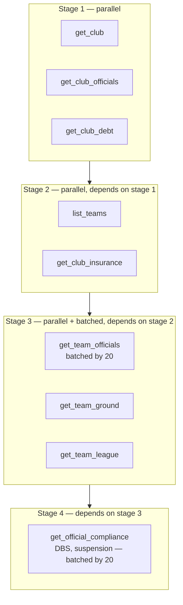

# ADR-D2-08 — Sequential, parallel and hybrid execution with bounded parallelism

## 1. Summary

Execution order is derived from a **declared dependency graph** in the API catalogue, not chosen
by an agent or a model. Independent calls run in parallel under a bounded concurrency limit that
exists to protect the enterprise, not the platform. Parallel failure is handled by mandatory
versus optional classification, decided before execution rather than after it.

## 2. Context and Problem Statement

1 PF-FT-AI-ARCHITECTURE.md §39 criterion 4 requires sequential and parallel AI execution. 7 PF-FT-AI-AGENTIC-ORCHESTRATION.md §31–§34 cover
sequential and parallel API execution, parallel execution controls, and fan-out/fan-in. 10 PF-FT-AI-ENTERPRISE-INTEGRATION.md
§50–§57 cover the same ground from the integration side, adding an execution planner (§53), an
API dependency graph (§52), bounded parallelism (§55) and parallel failure handling (§56).

The affiliation Phase 1 pre-check makes the need concrete. Before an application can be created,
the platform must know: are mandatory club officials assigned; are mandatory team officials
assigned; do officials hold valid safeguarding and DBS clearance; is any official suspended; is a
ground assigned; is league membership assigned; is there overdue debt. That is seven checks
across several enterprise services. Run sequentially at 200 ms each, the user waits well over a
second before the conversation can even begin. Run in parallel, it is one round trip.

But some of those checks depend on others. Officials' DBS status cannot be fetched without first
knowing which officials are assigned to which teams, which requires knowing the teams. There is a
genuine dependency graph, and it is not obvious from the call names.

Three questions follow, and the specifications leave each of them partly open.

**Who decides execution order?** 10 PF-FT-AI-ENTERPRISE-INTEGRATION.md §53 names an execution planner. It does not say what the
planner reads. If the agent decides, order becomes agent-specific and untestable. If the model
decides, execution order becomes a model output — and a model that gets the dependency graph
wrong produces either an error or, worse, a call made with a placeholder identifier.

**What bounds parallelism, and why?** 10 PF-FT-AI-ENTERPRISE-INTEGRATION.md §55 requires bounded parallelism without saying what
the bound protects. This matters: a bound sized to protect the platform's event loop is a
different number from one sized to protect an enterprise service's connection pool. 25.PF-FT-AI-INFRASTRUCTURE-OPERATIONS.md §64
notes API rate limits exist. A club with forty officials fanned out at full width could look like
a denial-of-service attempt to a service sized for portal traffic.

**What happens when one parallel branch fails?** 10 PF-FT-AI-ENTERPRISE-INTEGRATION.md §56 covers parallel failure handling and
8 PF-FT-AI-ERC-CONTEXT.md §49–§50 distinguish mandatory from optional collection failure. The distinction is
essential — a failed debt check blocks affiliation, a failed course-history fetch does not — but
*when* that classification is made determines whether the system can behave correctly. Deciding
after a failure invites the model to reason about whether the missing data mattered, which is a
business judgement it must not make.

## 3. Decision Drivers

### 3.1 Functional drivers

| ID | Driver | Source |
|---|---|---|
| DR-F-01 | Sequential, parallel and hybrid execution must all be supported | 1 PF-FT-AI-ARCHITECTURE.md §39 criterion 4; 1 PF-FT-AI-ARCHITECTURE.md §13 |
| DR-F-02 | An execution planner must derive the order | 10 PF-FT-AI-ENTERPRISE-INTEGRATION.md §53 |
| DR-F-03 | API dependencies must be declared | 10 PF-FT-AI-ENTERPRISE-INTEGRATION.md §52; 8 PF-FT-AI-ERC-CONTEXT.md §25 |
| DR-F-04 | Parallelism must be bounded | 10 PF-FT-AI-ENTERPRISE-INTEGRATION.md §55; 7 PF-FT-AI-AGENTIC-ORCHESTRATION.md §33 |
| DR-F-05 | Mandatory and optional context must be distinguished | 8 PF-FT-AI-ERC-CONTEXT.md §24, §49, §50 |
| DR-F-06 | Fan-out/fan-in must be supported for collections | 7 PF-FT-AI-AGENTIC-ORCHESTRATION.md §34; 10 PF-FT-AI-ENTERPRISE-INTEGRATION.md §54 |

### 3.2 Non-functional drivers

| ID | Driver | Target | Source |
|---|---|---|---|
| DR-N-01 | Context collection must fit the turn latency budget | Within ADR-D5-18's allocation | ADR-D5-18 |
| DR-N-02 | Enterprise services must not be overloaded by fan-out | Within published rate limits | 25.PF-FT-AI-INFRASTRUCTURE-OPERATIONS.md §64 |
| DR-N-03 | Execution order must be deterministic and testable | Same requirements, same plan | 10 PF-FT-AI-ENTERPRISE-INTEGRATION.md §22 |

### 3.3 Constraints

| ID | Constraint | Type | Source |
|---|---|---|---|
| DR-C-01 | All external I/O is async; no blocking call in an async path | Platform | `CLAUDE.md` |
| DR-C-02 | ERC batch size is 20 | Platform | 8 PF-FT-AI-ERC-CONTEXT.md §36; ADR-D4-04 |
| DR-C-03 | The model must not decide execution order | Platform | ADR-D1-02 §7.1 I-6; 2. PF-FT-AI-ARCHITECTURE-DETAILED.md §3.3 |
| DR-C-04 | Enterprise APIs declare whether they are parallelisable | Platform | 10 PF-FT-AI-ENTERPRISE-INTEGRATION.md §10 |

### 3.4 Assumptions

| ID | Assumption | If false | Validation |
|---|---|---|---|
| DR-A-01 | API dependencies are knowable and declarable at catalogue time | Some dependencies are data-dependent and only discoverable at runtime | ADR-D2-14 integration mapping |
| DR-A-02 | Enterprise services tolerate the chosen concurrency bound | The bound must be lowered, or per-service bounds are needed | Load testing at Phase 20; §7.3 |
| DR-A-03 | Mandatory/optional classification is stable per workflow step | Classification becomes contextual, requiring runtime evaluation | Phase 5 design review |

## 4. Evaluation Criteria and Weights

| ID | Criterion | Weight | Rationale | Measurement |
|---|---|---|---|---|
| EC-01 | Correctness of dependency ordering | 30 | A call made before its prerequisite produces a wrong result or a call with a placeholder identifier | Can a dependent call execute before its prerequisite? |
| EC-02 | Enterprise protection | 25 | The platform is a guest on enterprise services sized for portal traffic | Can fan-out exceed what a service tolerates? |
| EC-03 | Latency reduction achieved | 20 | The reason for parallelism at all | Wall-clock for the Phase 1 pre-check set |
| EC-04 | Deterministic and testable | 15 | Non-deterministic ordering is untestable and unauditable | Same inputs, same plan? |
| EC-05 | Failure handling clarity | 10 | Partial failure must resolve without model judgement | Is mandatory/optional decided before execution? |
| | **Total** | **100** | | |

Scoring scale: **1** unacceptable · **2** poor · **3** adequate · **4** good · **5** excellent.

## 5. Alternatives Considered

### 5.1 Option A — Sequential execution only

**Description.** All enterprise calls execute in order, one at a time.

**Strengths.**
- Trivially correct ordering; dependencies satisfied by construction (EC-01).
- No concurrency load on enterprise services (EC-02).
- Simplest to implement, reason about and debug.
- Deterministic (EC-04).

**Weaknesses.**
- Fails 1 PF-FT-AI-ARCHITECTURE.md §39 criterion 4, which requires parallel execution.
- The Phase 1 pre-check becomes seven sequential round trips; at 200 ms each, 1.4 seconds before
  the conversation begins, against a turn budget that also has to accommodate inference (EC-03).
- A club with forty officials batched at 20 per call becomes two more sequential calls.
- Latency scales linearly with context breadth, so richer context always costs more time.

**Cost / effort.** Lowest.

### 5.2 Option B — Model-planned execution

**Description.** The model examines the required context and produces an execution plan,
including which calls can run in parallel.

**Strengths.**
- Adapts to context that a static catalogue might not anticipate.
- No dependency declarations to maintain.
- Could optimise per situation.

**Weaknesses.**
- Execution order becomes a model output. A wrong plan calls a dependent API before its
  prerequisite, which either errors or executes with a placeholder (EC-01 fails).
- Violates DR-C-03 and 2. PF-FT-AI-ARCHITECTURE-DETAILED.md §3.3: this is a critical control, and the SLM must not be the only
  enforcement — here it would be the only mechanism at all.
- Non-deterministic, so the same requirements can produce different plans and different
  enterprise load (EC-04 fails).
- Fan-out width would be a model decision, which is an enterprise-protection failure (EC-02).

**Cost / effort.** Low, with an unacceptable failure mode.

### 5.3 Option C — Planner over a declared dependency graph, bounded parallelism

**Description.** Each API in the catalogue declares its dependencies and whether it is
parallelisable (10 PF-FT-AI-ENTERPRISE-INTEGRATION.md §10). The execution planner topologically sorts the required calls into
stages: within a stage, calls run concurrently under a bound; stages run sequentially.
Mandatory/optional classification is declared per context requirement before execution.

**Strengths.**
- Ordering is derived from declarations, so a dependent call cannot precede its prerequisite
  (EC-01).
- Concurrency is bounded by configuration sized to protect enterprise services (EC-02).
- Independent calls run concurrently, collapsing the Phase 1 pre-check to a small number of
  stages (EC-03).
- Fully deterministic: same requirements produce the same plan (EC-04).
- Mandatory/optional decided before execution, so partial failure resolves without judgement
  (EC-05).
- Directly implements 10 PF-FT-AI-ENTERPRISE-INTEGRATION.md §52–§56.

**Weaknesses.**
- Dependency declarations must be maintained as the API catalogue evolves; a wrong declaration
  produces a wrong plan silently.
- Static planning cannot exploit data-dependent optimisations.
- Requires the catalogue to be accurate about parallelisability, which depends on enterprise
  knowledge the platform does not own (DR-A-01).

**Cost / effort.** Moderate.

### 5.4 Option D — Unbounded parallelism for independent calls

**Description.** As Option C's planning, but with no concurrency limit — all independent calls
in a stage fire at once.

**Strengths.**
- Minimum possible latency (EC-03 maximised).
- Simplest concurrency model: no semaphore, no queueing.
- Correct ordering, same as Option C (EC-01).

**Weaknesses.**
- A club with forty officials, or a county administrator's cross-club query, produces a burst
  that enterprise services sized for portal traffic have not been designed for (EC-02 fails).
- Rate limiting or throttling would then produce failures the platform caused.
- Unbounded concurrency also risks exhausting the shared HTTP client's connection pool
  (ADR-D5-16), degrading unrelated conversations.
- Load is unpredictable, so capacity planning on the enterprise side becomes guesswork.

**Cost / effort.** Lowest of the planned options, with an externality the platform imposes on
others.

## 6. Evaluation Method and Decision Matrix

**Method.** Weighted scoring against §4. EC-03 estimated by modelling the affiliation Phase 1
pre-check under each option. EC-02 assessed by asking what peak concurrent request rate each
option would present to a single enterprise service for a large club.

| Criterion | Weight | A: Sequential | B: Model-planned | C: Planner + bounded | D: Unbounded |
|---|---|---|---|---|---|
| EC-01 Dependency correctness | 30 | 5 | 1 | 5 | 5 |
| EC-02 Enterprise protection | 25 | 5 | 2 | 5 | 1 |
| EC-03 Latency reduction | 20 | 1 | 4 | 5 | 5 |
| EC-04 Deterministic | 15 | 5 | 1 | 5 | 5 |
| EC-05 Failure clarity | 10 | 4 | 2 | 5 | 4 |
| **Weighted total** | **100** | **410** | **200** | **500** | **380** |

- **Option C:** (30×5) + (25×5) + (20×5) + (15×5) + (10×5) = 150 + 125 + 100 + 75 + 50 = **500**

**Sensitivity.** C scores maximum on every criterion and cannot be overtaken — it is Option A's
correctness with Option D's latency and a bound that removes D's externality. A is a genuine
fallback if DR-A-01 fails and dependencies cannot be declared reliably, since correctness matters
more than latency; that is RT-04. B is excluded by DR-C-03 regardless of score.

## 7. Decision

### 7.1 Execution is planned from declared dependencies

Each API in the catalogue declares, per 10 PF-FT-AI-ENTERPRISE-INTEGRATION.md §10:

```yaml
execution:
  idempotent: true
  retryable: true
  parallelizable: true
depends_on:
  - enterprise.team.list      # must complete before this call can be planned
```

The execution planner (10 PF-FT-AI-ENTERPRISE-INTEGRATION.md §53):

1. Takes the context requirements for the current workflow step (8 PF-FT-AI-ERC-CONTEXT.md §22–§23).
2. Resolves each to its catalogue entry.
3. Builds the dependency graph (10 PF-FT-AI-ENTERPRISE-INTEGRATION.md §52).
4. Topologically sorts into **stages**: all calls in a stage are mutually independent.
5. Executes stages sequentially; within a stage, executes concurrently under the bound.

This is hybrid execution as 1 PF-FT-AI-ARCHITECTURE.md §13 describes it: sequential between stages, parallel within
them. Neither the agent nor the model participates in producing the plan.

### 7.2 A wrong declaration must fail loudly

Option C's weakness is that an incorrect dependency declaration produces a wrong plan silently.
Two mitigations, because a silent wrong plan is worse than a loud failure:

- **Path parameters must resolve.** A call whose path or query parameters reference a value not
  yet available fails at plan time, not at execution. If `enterprise.official.get` needs a
  `teamId` and no completed stage produced one, the plan is rejected. This catches a missing
  `depends_on` declaration structurally.
- **No placeholder substitution.** The planner never substitutes a default, empty or synthesised
  identifier to make a call executable. 10 PF-FT-AI-ENTERPRISE-INTEGRATION.md §35's input validation rejects it.

Together these mean a missing dependency declaration surfaces as a plan-time error rather than
as a call made with the wrong identifier — which is the failure mode that would otherwise
corrupt ERC quietly.

### 7.3 The concurrency bound protects the enterprise, not the platform

10 PF-FT-AI-ENTERPRISE-INTEGRATION.md §55 requires bounded parallelism without stating what the bound is for. It is stated here
because it determines how the number is chosen:

> The bound exists to keep the platform within what enterprise services can absorb. It is sized
> from enterprise capacity and rate limits (25.PF-FT-AI-INFRASTRUCTURE-OPERATIONS.md §64), not from the platform's own throughput.

Consequences:

- The bound is **per enterprise service**, not global. A stage touching four services may run
  more calls concurrently in total than the per-service bound, while respecting each service's
  limit.
- It is configuration, per environment, because DEV and PROD enterprise capacity differ.
- Where an enterprise service publishes a rate limit, the bound is derived from it. Where it
  does not, a conservative default applies and is revised from load testing (DR-A-02).
- The bound is *not* a platform protection mechanism. Platform-side protection — connection pool
  limits, event loop health — is ADR-D5-16's and 4. PF-FT-AI-RUNTIME.md §57–§58's concern, and uses separate
  controls.

Conflating the two would produce a single number that protects neither well.

### 7.4 Mandatory versus optional is declared before execution

Per 8 PF-FT-AI-ERC-CONTEXT.md §24, every context requirement declares whether it is mandatory or optional for the
current workflow step. The classification is **in the workflow definition**, not decided after a
failure.

| Classification | On failure |
|---|---|
| **Mandatory** | The step cannot proceed. Retry per policy (10 PF-FT-AI-ENTERPRISE-INTEGRATION.md §41–§44); on exhaustion, the workflow reports it cannot continue and states what is unavailable (8 PF-FT-AI-ERC-CONTEXT.md §49). |
| **Optional** | Execution continues. ERC records the section as incomplete with a reason (8 PF-FT-AI-ERC-CONTEXT.md §50–§51). Downstream reasoning is told the section is absent, not given a silent gap. |

Deciding this before execution matters for a specific reason: after a failure, "did we need
that?" is a business question. A model asked to judge whether a missing debt check mattered would
be making an eligibility judgement, which ADR-D1-01 §7.3 prohibits. Declaring it up front removes
the question.

For affiliation Phase 1, the checks that gate application creation — officials, safeguarding,
DBS, suspension, ground, league, debt — are all **mandatory**, because the enterprise treats
their absence as blocking. Context that enriches explanation without gating anything is optional.

### 7.5 Fan-out and fan-in for collections

7 PF-FT-AI-AGENTIC-ORCHESTRATION.md §34 and 10 PF-FT-AI-ENTERPRISE-INTEGRATION.md §54 require fan-out/fan-in. Applied to collections, it composes with
batching (ADR-D4-04):

1. A collection is partitioned into batches of at most 20 (8 PF-FT-AI-ERC-CONTEXT.md §36, DR-C-02).
2. Batches fan out under the §7.3 per-service bound.
3. Results fan in and are aggregated in a deterministic order (8 PF-FT-AI-ERC-CONTEXT.md §58).
4. Per-batch failures are handled per 8 PF-FT-AI-ERC-CONTEXT.md §48's partial batch failure rules.

Deterministic aggregation ordering matters beyond tidiness: without it, the same club's officials
could appear in different orders across turns, producing different prompt content and
different model output for identical enterprise state.

**Status rationale.** Accepted. Tier 3 under ADR-D0-03 §7.1 — an execution design within the AI
platform. The enterprise-protection aspect of §7.3 was reviewed with the AI Platform Owner, since
it bears on enterprise load.

## 8. Architecture Detail

### 8.1 Planning the affiliation Phase 1 pre-check



Four stages rather than seven-plus sequential calls. The dependency chain is real: officials'
compliance cannot be fetched without the official identifiers, which come from team officials,
which come from teams, which come from the club. The planner derives this from `depends_on`
declarations; nobody codes the order into the agent.

### 8.2 Where the bound applies

```
Stage 3 contains:
  get_team_officials  × 2 batches   → officials-service   (bound 5)
  get_team_ground     × 30 teams    → teams-service       (bound 8)
  get_team_league     × 30 teams    → teams-service       (bound 8)

Concurrency: officials-service sees at most 5 in flight.
             teams-service sees at most 8 in flight across both call types.
             Total platform concurrency in this stage: at most 13.
```

The bound is per service, so a stage's total concurrency is the sum of what each service
tolerates — never a single global number that would either throttle a fast service unnecessarily
or overwhelm a slow one.

### 8.3 Partial failure in a stage

10 PF-FT-AI-ENTERPRISE-INTEGRATION.md §56 and 8 PF-FT-AI-ERC-CONTEXT.md §48–§50 combine:

1. All calls in the stage run to completion or failure; a failure does not cancel siblings, since
   their results may still be needed.
2. Mandatory failures are collected. If any mandatory call failed after retries, the step fails
   with a complete list of what was unavailable — not the first failure encountered, which would
   send the user back repeatedly for one problem at a time.
3. Optional failures are recorded in ERC completeness tracking (8 PF-FT-AI-ERC-CONTEXT.md §51–§52).
4. Dependent stages are not executed if a mandatory prerequisite failed (10 PF-FT-AI-ENTERPRISE-INTEGRATION.md §57).

Point 2 matters for the affiliation user experience specifically. A club failing three pre-checks
should be told all three, which is what the portal's own banner does. Failing fast on the first
would be technically simpler and would make the platform worse than the screen it is meant to
improve on.

## 9. Consequences

### 9.1 Positive

- Execution order is derived, deterministic and testable; the same requirements always produce
  the same plan.
- A dependent call cannot precede its prerequisite, and a missing declaration fails at plan time
  rather than producing a call with a wrong identifier.
- The Phase 1 pre-check collapses from seven-plus sequential calls to four stages.
- Enterprise services are protected by per-service bounds sized to their capacity.
- Partial failure resolves without any business judgement by the platform or the model.
- Users are told all their blockers at once, matching the portal's behaviour.

### 9.2 Negative

- Dependency declarations must be maintained in the API catalogue, and their accuracy depends on
  enterprise knowledge the platform does not own.
- Static planning forgoes data-dependent optimisations a runtime planner might find.
- Per-service bounds are more configuration than a single global limit, and each needs a basis.
- Running all calls in a stage to completion despite a failure costs calls whose results may be
  discarded.

### 9.3 Neutral

- Hybrid execution is the specification's own model (1 PF-FT-AI-ARCHITECTURE.md §13); this decision fixes how the plan
  is produced.
- Batching composes with fan-out rather than replacing it.

### 9.4 Trade-offs explicitly accepted

| Given up | In exchange for | Accepted by |
|---|---|---|
| Adaptive per-situation planning | Deterministic, testable execution order | AI Solution Architect |
| Minimum possible latency | Enterprise services staying within their capacity | AI Platform Owner |
| Fast-fail on first mandatory failure | Users told all their blockers at once | AI Product Owner |
| Simplicity of one global concurrency limit | Bounds that reflect each service's real capacity | Operations/SRE |

## 10. Golden-Rule and Precedence Conformance

| Constraint | Conformance |
|---|---|
| Enterprise decides; AI orchestrates | §7.4 keeps mandatory/optional a declared workflow property rather than a post-failure judgement, so the platform never decides whether missing data mattered — that would be an eligibility judgement. |
| Authoritative-truth precedence | Aggregation preserves per-fact provenance (ADR-D1-03); a partially-failed collection is recorded as incomplete rather than silently gapped, so downstream reasoning knows what it does not have. |
| Four-state separation | Execution plans are Workflow/Agent State; results become ERC projections of Enterprise Business State. |
| Versioned artefacts, never mutated in place | Dependency declarations and bounds live in versioned configuration (ADR-D5-06). |
| Adam persona governs how, never what | Blocker lists are enterprise check results; the persona conveys them under ADR-D1-09's X-1 exclusion where they concern a named individual. |

## 11. Risks and Mitigations

| ID | Risk | Likelihood | Impact | Exposure | Mitigation | Owner | Residual |
|---|---|---|---|---|---|---|---|
| RSK-01 | A missing or wrong dependency declaration produces a bad plan | Medium | High | High | §7.2's parameter-resolution check makes it a plan-time failure; no placeholder substitution; QM-02 | AI Engineering Lead | Low |
| RSK-02 | Concurrency bound too high for an enterprise service (DR-A-02) | Medium | High | High | Per-service bounds from published limits where available, conservative default otherwise; load testing at Phase 20; QM-03 | AI Platform Owner | Medium |
| RSK-03 | Bound too low, making context collection exceed the latency budget | Medium | Medium | Medium | Measured against ADR-D5-18's allocation; QM-01; bounds are per-environment configuration | AI Engineering Lead | Medium |
| RSK-04 | Mandatory/optional classification proves contextual (DR-A-03) | Low | Medium | Low | Classification is per workflow *step*, not per workflow, which gives the needed granularity | AI Solution Architect | Low |
| RSK-05 | Aggregation ordering non-deterministic, producing varying prompt content | Low | Medium | Low | Deterministic ordering per 8 PF-FT-AI-ERC-CONTEXT.md §58; AC-06 | AI Engineering Lead | Low |
| RSK-06 | Data-dependent dependencies not expressible in the catalogue (DR-A-01) | Medium | Medium | Medium | Handled by staging: the dependent call is planned in a later stage once the value exists. A genuinely undeclarable dependency is escalated as an integration gap. | AI Solution Architect | Medium |

## 12. Quantitative Targets and Measures

| ID | Measure | Target | Threshold (alert) | Source | Review cadence |
|---|---|---|---|---|---|
| QM-01 | Phase 1 pre-check collection wall-clock, p95 | Within ADR-D5-18 allocation | Above allocation | Traces | Weekly |
| QM-02 | Plan-time rejections due to unresolvable parameters | 0 in production | ≥1 | Planner logs | Daily |
| QM-03 | Enterprise service rate-limit responses caused by platform fan-out | 0 | ≥1 | Integration error metrics | Daily |
| QM-04 | Concurrent in-flight calls per enterprise service | ≤ configured bound | Above bound | Execution metrics | Weekly |
| QM-05 | Mandatory failures reported one at a time rather than collected | 0 | ≥1 | Response audit | Per release |
| QM-06 | Execution plans differing for identical context requirements | 0 | ≥1 | Planner determinism test | Per build |

QM-03's zero target is the direct test of §7.3: a rate-limit response the platform caused means
the bound was wrong.

## 13. Security, Privacy and Compliance Impact

| Dimension | Impact |
|---|---|
| Attack surface change | Bounded concurrency limits the amplification available to an attacker who can trigger context collection — a request cannot be turned into an unbounded burst against enterprise services. |
| Data classification touched | Collection retrieves personal and special-category data (officials' DBS and suspension status). |
| Personal data / PII | Only declared context requirements are collected. The planner cannot fetch more than the workflow step declares, which implements minimisation structurally. |
| Children's data and safeguarding | Stage 4 in §8.1 fetches officials' compliance — DBS and suspension — for youth-team officials. It runs only when earlier stages establish which officials are in scope, so the platform never fetches compliance data for people outside the workflow's scope. |
| UK GDPR lawful basis and rights impact | Supports minimisation (Art. 5(1)(c)): collection is bounded by declared requirements, not by what is convenient to fetch. |
| Audit and evidential requirements | The plan is recorded per turn, so what was fetched and why is reconstructable. |
| Standards touched | ISO/IEC 27001 A.8.6 (capacity management), A.8.16 (monitoring); ISO/IEC 42001; NIST AI RMF MEASURE 2.7. |

## 14. Implementation Impact

| Aspect | Detail |
|---|---|
| Build phases | 5 (context collection planner), 6 (integration execution) |
| Repository paths | `src/pf_ft_ai/integration/execution/planner.py`, `dependency.py`, `concurrency.py`; `src/pf_ft_ai/context/collection/` |
| Configuration | `depends_on` and `parallelizable` in `config/enterprise/api-catalog/`; per-service bounds in `config/base/batching.yaml` and per-environment overrides |
| Contracts / schemas | Execution plan model; context requirement model with mandatory/optional |
| Migration | None |
| Dependencies on other ADRs | ADR-D2-12 (ERC), ADR-D2-15 (API contracts), ADR-D4-04 (batching), ADR-D5-16 (HTTP client) |
| Effort estimate | Moderate — planner, dependency graph and bounded execution |

## 15. Validation and Verification

| ID | Acceptance criterion | Verification method |
|---|---|---|
| AC-01 | A dependent call never executes before its prerequisite | Planner test across the affiliation dependency graph |
| AC-02 | A call with an unresolvable path parameter is rejected at plan time | Planner test with a missing `depends_on`; QM-02 |
| AC-03 | Concurrent in-flight calls per service never exceed the configured bound | Concurrency test under load; QM-04 |
| AC-04 | A mandatory failure blocks the step; an optional failure records incompleteness | Failure injection per 8 PF-FT-AI-ERC-CONTEXT.md §49–§50 |
| AC-05 | All mandatory failures in a stage are reported together | Multi-failure scenario test; QM-05 |
| AC-06 | Aggregation ordering is deterministic across runs | Repeated-run comparison |
| AC-07 | Identical context requirements produce identical plans | Determinism test; QM-06 |

## 16. Operational Impact

| Aspect | Detail |
|---|---|
| Monitoring | Stage count, per-stage duration, per-service concurrency, plan rejections |
| Alerting | QM-02 and QM-03 on any occurrence; QM-04 on bound breach |
| Runbook | `docs/runbooks/enterprise-api.md`, `docs/runbooks/erc-batch-recovery.md` |
| Failure mode and degradation | A mandatory failure stops the step with a complete blocker list. An enterprise service degrading under load is exactly what §7.3's bound exists to prevent; if it occurs, lowering the bound is the first response. |
| Rollback | Bounds are per-environment configuration and can be lowered without a deployment |
| Support model impact | Plan traces answer "why did it call that?" and "why did it take that long?" |

## 17. Cost Impact

| Cost element | One-off | Recurring | Basis |
|---|---|---|---|
| Planner, dependency graph, bounded executor | Phases 5–6 | — | `DEVELOPMENT-GUIDE.md` §4 |
| Enterprise call volume | — | Unchanged by parallelism — same calls, different timing | Parallelism affects latency, not call count |
| Calls discarded after a sibling's mandatory failure | — | Small | §8.3 point 1's cost |
| Avoided cost | — | Ongoing | Option A's sequential latency would push turn time past the budget, requiring compensation elsewhere |

## 18. Revisit Triggers and Causal Analysis Hooks

| ID | Trigger | Detected by | Action on trigger |
|---|---|---|---|
| RT-01 | QM-03 records a rate-limit response caused by fan-out | Daily | Lower the affected service's bound immediately; the bound was wrong |
| RT-02 | QM-01 shows collection exceeding its latency allocation | Weekly | Raise bounds where enterprise capacity allows; otherwise revisit context requirements |
| RT-03 | QM-02 records plan-time rejections in production | Daily | A dependency declaration is missing; fix the catalogue |
| RT-04 | Dependencies prove undeclarable for a workflow (DR-A-01 false) | Integration design | Fall back to sequential execution for that requirement set; correctness over latency |
| RT-05 | Enterprise publishes revised rate limits | Change notice | Re-derive per-service bounds |
| RT-06 | QM-06 records plan non-determinism | CI | Investigate; a non-deterministic plan makes execution untestable |

**Scheduled review:** 2027-08-21.

## 19. Traceability

| Dimension | Reference |
|---|---|
| Workshop sheet | WS-08 Workflow Orchestration Architecture |
| Specification sections | 7 PF-FT-AI-AGENTIC-ORCHESTRATION.md §31 (Sequential API Execution), §32 (Parallel API Execution), §33 (Parallel Execution Controls), §34 (Fan-Out/Fan-In); 10 PF-FT-AI-ENTERPRISE-INTEGRATION.md §50–§57 (Sequential, Parallel, Dependency Graph, Execution Planner, Fan-Out/Fan-In, Bounded Parallelism, Parallel Failure Handling, Tool Dependency Failure), §10 (Extended Metadata), §35 (Tool Input Validation); 8 PF-FT-AI-ERC-CONTEXT.md §22–§25 (Context Requirements, Dependency Graph), §36 (Agreed Batch Size), §48–§52 (Partial Batch Failure, Mandatory/Optional Failure, Completeness), §58 (Aggregation Ordering); 1 PF-FT-AI-ARCHITECTURE.md §13, §39 criterion 4; 4. PF-FT-AI-RUNTIME.md §23–§24, §57–§58; 25.PF-FT-AI-INFRASTRUCTURE-OPERATIONS.md §64 |
| Requirement IDs | `FR-A39-04`, `FR-A39-05`, `NFR-A38-PERF`, `NFR-A38-SCALE` |
| Build phases | 5, 6 |
| Code paths | `src/pf_ft_ai/integration/execution/`, `src/pf_ft_ai/context/collection/` |
| Configuration | `config/enterprise/api-catalog/`, `config/base/batching.yaml` |
| Tests | AC-01 to AC-07 |
| Upstream ADRs | ADR-D2-06 |
| Downstream ADRs | ADR-D2-11, ADR-D2-12, ADR-D2-15, ADR-D4-04, ADR-D5-16, ADR-D5-18 |

## 20. Change Log

| Version | Date | Author | Change |
|---|---|---|---|
| 1.0.0 | 2026-08-21 | AI Solution Architect | Initial decision recorded. Execution planned from declared dependencies with plan-time parameter resolution so a missing declaration fails loudly; concurrency bounds stated as enterprise protection and made per-service; mandatory/optional declared before execution so partial failure needs no business judgement. |
