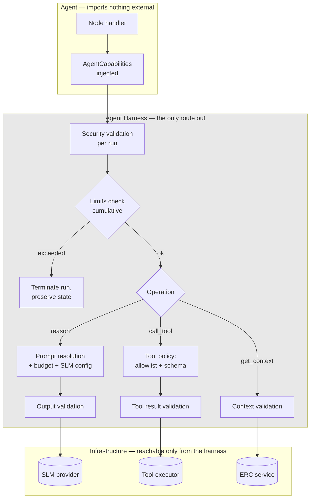

# ADR-D2-09 — Agent Harness as the single controlled execution boundary

## 1. Summary

The Agent Harness is the **only** path by which an agent reaches a model, a tool, ERC, memory,
RAG or MCP. Agents receive capabilities from the harness rather than importing them, so an agent
physically cannot bypass a control. Every one of ADR-D1-02's six invariants is enforced here or
at a boundary the harness owns, which is what makes "the SLM must not be the only enforcement
mechanism" structurally true rather than a rule people follow.

## 2. Context and Problem Statement

7 PF-FT-AI-AGENTIC-ORCHESTRATION.md §8 calls the harness *"the controlled runtime boundary"* and lists seventeen things it
manages — prompt, context, ERC, memory, tools, MCP, RAG, SLM, guardrails, limits, retries,
timeouts, observability, evaluation, versioning. It adds the requirement that matters most:
*"The Harness must prevent the SLM from directly controlling unrestricted runtime operations."*
7 PF-FT-AI-AGENTIC-ORCHESTRATION.md §50 gives an eleven-stage execution pipeline. 2. PF-FT-AI-ARCHITECTURE-DETAILED.md §10 and 1 PF-FT-AI-ARCHITECTURE.md §11 give it a place.

Two things are underdetermined, and both determine whether the harness is a real boundary or a
convention.

**Is it a gateway or a helper?** A component that manages seventeen concerns could be a facade
agents call for convenience, or a gateway agents must go through because there is no other
route. The difference is invisible in a diagram and total in practice. If an agent can
`import` the SLM client directly, then the harness's SLM configuration, its guardrails and its
token accounting are all optional — and the first agent written under deadline pressure will
skip them, correctly observing that everything still works.

**Does it apply per node, per agent run, or per turn?** 7 PF-FT-AI-AGENTIC-ORCHESTRATION.md §50's pipeline reads as a
per-invocation sequence, but 7 PF-FT-AI-AGENTIC-ORCHESTRATION.md §72's agent loop and §73's loop protection imply an agent
runs many nodes across many model calls within one harness invocation. Where the pipeline's
stages apply is not stated, and it matters: applying security validation once per run and then
executing twenty nodes means nineteen of them are unguarded.

There is a third question the specifications raise indirectly. ADR-D1-02 decomposed the Golden
Rule into six invariants and named enforcement points for each. Five of those points — the tool
executor, the claims boundary, the output guardrail, the context manifest — are things the
harness owns or mediates. If the harness is not a mandatory gateway, those invariants are
enforced only when the agent chooses to go through it, which is not enforcement at all.

## 3. Decision Drivers

### 3.1 Functional drivers

| ID | Driver | Source |
|---|---|---|
| DR-F-01 | The harness must prevent the SLM controlling unrestricted runtime operations | 7 PF-FT-AI-AGENTIC-ORCHESTRATION.md §8 |
| DR-F-02 | The eleven-stage pipeline must execute for agent work | 7 PF-FT-AI-AGENTIC-ORCHESTRATION.md §50 |
| DR-F-03 | Loop protection and limits must be enforced | 7 PF-FT-AI-AGENTIC-ORCHESTRATION.md §72–§73; 4. PF-FT-AI-RUNTIME.md §54 |
| DR-F-04 | Retries and timeouts follow a single hierarchy | 4. PF-FT-AI-RUNTIME.md §55–§56 |
| DR-F-05 | ADR-D1-02's invariants must be enforceable at harness-owned boundaries | ADR-D1-02 §7.1 |
| DR-F-06 | The harness applies identically on both runtime paths | ADR-D2-03 §7.1 |

### 3.2 Non-functional drivers

| ID | Driver | Target | Source |
|---|---|---|---|
| DR-N-01 | Harness overhead must be small relative to inference | ≤5% of turn latency | ADR-D5-18 |
| DR-N-02 | An agent must not be able to bypass the harness | Structurally impossible, not merely prohibited | 7 PF-FT-AI-AGENTIC-ORCHESTRATION.md §8 |
| DR-N-03 | Agents must remain testable without the full harness | Unit-testable node handlers | 22.PF-FT-AI-TESTING.md |

### 3.3 Constraints

| ID | Constraint | Type | Source |
|---|---|---|---|
| DR-C-01 | Critical controls are deterministic; the SLM is never the sole mechanism | Platform | 2. PF-FT-AI-ARCHITECTURE-DETAILED.md §3.3 |
| DR-C-02 | Agents may not bypass tools, override authorization or execute unrestricted APIs | Platform | 7 PF-FT-AI-AGENTIC-ORCHESTRATION.md §5 |
| DR-C-03 | Layering: orchestration imports infrastructure interfaces only | Platform | ADR-D2-01 §7.2 |
| DR-C-04 | Guardrails apply at every boundary | Platform | 18.PF-FT-AI-GUARDRAILS.md; ADR-D6-09 |

### 3.4 Assumptions

| ID | Assumption | If false | Validation |
|---|---|---|---|
| DR-A-01 | Capability injection prevents bypass as effectively as a process boundary would | An agent could still import a client directly; the import test is the backstop | ADR-D2-01 import-boundary test |
| DR-A-02 | Per-node enforcement overhead is acceptable | Enforcement is reduced in frequency, weakening guarantees | QM-01 |
| DR-A-03 | One harness serves all agents without agent-specific variants | Agent-specific harness behaviour reintroduces divergence | Reviewed at agent two |

## 4. Evaluation Criteria and Weights

| ID | Criterion | Weight | Rationale | Measurement |
|---|---|---|---|---|
| EC-01 | Impossibility of bypass | 35 | A boundary that can be walked around is not a boundary; ADR-D1-02's invariants depend on this | Can an agent reach a model or tool without the harness? |
| EC-02 | Completeness of enforcement coverage | 25 | Enforcement gaps are where incidents happen | Is every model call and tool call guarded? |
| EC-03 | Agent testability | 15 | Agents that need the full harness to test are agents nobody tests | Can node handlers be unit-tested? |
| EC-04 | Performance overhead | 15 | Applied per node, so it compounds | Milliseconds per node |
| EC-05 | Implementation and maintenance cost | 10 | Real but subordinate | Complexity of the harness |
| | **Total** | **100** | | |

Scoring scale: **1** unacceptable · **2** poor · **3** adequate · **4** good · **5** excellent.

## 5. Alternatives Considered

### 5.1 Option A — Harness as a facade agents call by convention

**Description.** The harness exposes helper methods. Agents are expected to use them but can
import the SLM client, tool executor or ERC service directly.

**Strengths.**
- Simplest to build; the harness is a convenience layer.
- Agents retain full flexibility for cases the harness does not anticipate.
- Easy to test agents in isolation.
- No inversion of control to reason about.

**Weaknesses.**
- Fails DR-N-02 and 7 PF-FT-AI-AGENTIC-ORCHESTRATION.md §8 outright. An agent can reach the SLM directly, and then guardrails,
  token accounting, loop limits and tracing are all optional (EC-01).
- ADR-D1-02's invariants I-2, I-3 and I-4 become unenforced whenever an agent takes a direct
  route.
- The bypass will happen: not maliciously, but because a developer needs one thing the harness
  does not expose and takes the shortest path.

**Cost / effort.** Lowest, with the central requirement unmet.

### 5.2 Option B — Harness as a mandatory gateway with capability injection

**Description.** Agents receive an injected capability object exposing only harness-mediated
operations. Agents import no client, no executor, no service. Every model call, tool call, ERC
read, memory read and RAG retrieval goes through the harness, which applies the pipeline.

**Strengths.**
- An agent cannot bypass the harness because it has no reference to anything else. Reinforced by
  ADR-D2-01's import test, which makes a direct import a build failure (EC-01).
- Every model and tool interaction is guarded uniformly (EC-02).
- ADR-D1-02's invariants have a single enforcement site each.
- Node handlers receive the capability object and are unit-testable with a stub (EC-03).
- Applies identically on both runtime paths, satisfying ADR-D2-03's parity requirement.

**Weaknesses.**
- Every capability an agent needs must be exposed through the harness interface, which grows.
- Inversion of control adds indirection when reading agent code.
- A harness bug affects every agent.
- Per-node enforcement adds overhead that compounds across a graph (EC-04).

**Cost / effort.** Moderate.

### 5.3 Option C — Enforcement in a middleware chain around node execution

**Description.** Agents call services directly, but every call passes through middleware that
applies guardrails, limits and tracing — an interceptor pattern rather than a gateway.

**Strengths.**
- Agents read naturally; no injected capability object.
- Enforcement is centralised in the middleware.
- Familiar pattern.

**Weaknesses.**
- Middleware must be applied to every client, and a client instantiated directly bypasses it.
  Enforcement depends on construction discipline (EC-01 weaker than B).
- Cross-cutting state — token budget across a run, loop count, elapsed time — is awkward in
  stateless middleware and needs a context object anyway, which is Option B with extra steps.
- Harder to reason about ordering when several interceptors apply.

**Cost / effort.** Moderate, with a weaker guarantee.

### 5.4 Option D — Per-agent harness subclassing

**Description.** A base harness with agent-specific subclasses overriding behaviour where an
agent needs different limits, prompt assembly or tool policy.

**Strengths.**
- Accommodates genuine per-agent differences cleanly.
- Base class still enforces the pipeline.
- Familiar object-oriented structure.

**Weaknesses.**
- Overriding is how enforcement erodes: an agent subclass that relaxes a limit or skips a stage
  is a local decision with a platform-wide security consequence (EC-02).
- Divergence between agents in exactly the controls that must not diverge.
- ADR-D2-03's parity argument applies within the harness too — one implementation is the point.
- Per-agent variation is better expressed as configuration than as code.

**Cost / effort.** Moderate, with a structural erosion path.

## 6. Evaluation Method and Decision Matrix

**Method.** Weighted scoring against §4. EC-01 tested by asking, for each option, what a
developer would have to do to make a model call that skipped the guardrails, and whether anything
would stop them. EC-02 assessed by mapping ADR-D1-02's six invariants onto enforcement sites.

| Criterion | Weight | A: Facade | B: Gateway + injection | C: Middleware | D: Subclassing |
|---|---|---|---|---|---|
| EC-01 Bypass impossibility | 35 | 1 | 5 | 3 | 4 |
| EC-02 Enforcement coverage | 25 | 2 | 5 | 4 | 3 |
| EC-03 Agent testability | 15 | 5 | 4 | 4 | 4 |
| EC-04 Performance overhead | 15 | 5 | 4 | 4 | 4 |
| EC-05 Cost | 10 | 5 | 3 | 4 | 3 |
| **Weighted total** | **100** | **265** | **455** | **375** | **375** |

- **Option B:** (35×5) + (25×5) + (15×4) + (15×4) + (10×3) = 175 + 125 + 60 + 60 + 30 = **455**

**Sensitivity.** B leads C and D by 80 points and A by 190. B's only sub-maximum scores are on
testability, overhead and cost, together worth 40 points — B would still lead C if it scored 1 on
all three. A's 265 is carried entirely by the criteria that do not matter for a security
boundary. The result is insensitive to reweighting because EC-01 and EC-02 carry 60 of the 100
weight and B wins both outright.

## 7. Decision

### 7.1 The harness is a mandatory gateway

Agents receive an injected capability object. They import no SLM client, no tool executor, no
ERC service, no memory store, no RAG retriever and no MCP client. The capability object exposes
only harness-mediated operations:

```python
class AgentCapabilities(Protocol):
    async def reason(self, request: ReasoningRequest) -> ReasoningResult: ...
    async def call_tool(self, call: ToolCall) -> ToolResult: ...
    async def get_context(self, requirement: ContextRequirement) -> ERCReference: ...
    async def retrieve_knowledge(self, query: KnowledgeQuery) -> list[RAGReference]: ...
    async def recall(self, query: MemoryQuery) -> list[MemoryReference]: ...
```

Every method applies the relevant pipeline stages before and after the underlying operation.
There is no method that returns an unmediated client.

Bypass is prevented twice over: an agent has no reference to reach around the harness with, and
ADR-D2-01's import-boundary test makes acquiring one a build failure. DR-A-01 relies on the
second as the backstop for the first.

### 7.2 Where the pipeline stages apply

7 PF-FT-AI-AGENTIC-ORCHESTRATION.md §50's eleven stages do not all apply at the same frequency. Applying them all per node
would be wasteful; applying them all per run would leave most operations unguarded. They are
therefore split by scope:

| Stage (7 PF-FT-AI-AGENTIC-ORCHESTRATION.md §50) | Scope | Rationale |
|---|---|---|
| Security validation | **Per run**, on entry | Claims and archetype do not change mid-run |
| Context validation | **Per context read** | Each ERC read is validated on retrieval (8 PF-FT-AI-ERC-CONTEXT.md §67) |
| Prompt resolution | **Per model call** | Prompt composition differs per node and per content class (ADR-D1-09 §7.5) |
| Context budget | **Per model call** | Budget is consumed cumulatively; each call must fit what remains |
| Tool/MCP policy | **Per tool call** | Allowlist and parameter validation apply to every call (ADR-D6-10) |
| SLM configuration | **Per model call** | Generation parameters vary by task class (ADR-D3-16) |
| Node execution | Per node | The work itself |
| Output validation | **Per model call**, and per turn at the response boundary | Structured output validated per call; user-facing output validated once |
| Observability | **Per node and per call** | Spans at every level |
| Evaluation | **Per run**, sampled | Evaluation hooks capture the run, not each node |
| Limits and loop protection | **Continuous across the run** | Cumulative by nature (7 PF-FT-AI-AGENTIC-ORCHESTRATION.md §73) |

The load-bearing entries are the per-call ones. Every model call and every tool call is guarded,
which is what makes ADR-D1-02's invariants hold across a twenty-node graph rather than only at
its edges.

### 7.3 Cumulative limits across a run

7 PF-FT-AI-AGENTIC-ORCHESTRATION.md §72–§73 and 4. PF-FT-AI-RUNTIME.md §54 require loop protection and runtime limits. These are cumulative
properties of a run, held by the harness and checked before each operation:

| Limit | Scope | Breach behaviour |
|---|---|---|
| Model calls per run | Run | Terminate the run; report inability to complete |
| Tool calls per run | Run | Terminate the run |
| Same tool with same parameters, repeated | Run | Terminate — a loop, not progress (7 PF-FT-AI-AGENTIC-ORCHESTRATION.md §73) |
| Total tokens per run | Run | Terminate |
| Wall-clock per run | Run | Terminate |
| Node revisits | Run | Terminate |

Termination is a controlled outcome, not a crash: workflow state is preserved, the user is told
the request could not be completed, and the run is traced with the limit that fired. A silent
truncation would be worse than a stated failure, because the user would receive a partial answer
believing it complete.

### 7.4 Enforcement of ADR-D1-02's invariants

| Invariant | Harness enforcement site | Frequency |
|---|---|---|
| I-1 provenance of business assertions | Output validation, against the context manifest the harness assembled | Per model call and at the response boundary |
| I-2 no model output influences authorization | Claims held by the harness, read-only to the agent (ADR-D2-07 §7.4); tool authorization uses claims, never model output | Per tool call |
| I-3 allowlisted tools, schema-valid parameters | Tool/MCP policy stage before dispatch | Per tool call |
| I-4 no success on unconfirmed transactions | Output validation with transaction state from tool results | Per response |
| I-5 no invented URLs | Output validation against the portal registry | Per response |
| I-6 no business rule evaluation | Build-time architecture test; harness enforces nothing at runtime here | Build |

Five of the six are harness-mediated. That is the concrete answer to why the harness must be a
gateway rather than a facade: under Option A, five invariants would be optional.

### 7.5 One harness, no agent-specific variants

Per-agent differences are expressed as **configuration** consumed by the one harness — limits,
tool allowlists, prompt layer selection, generation parameters — never as subclassing or
overriding. This is the same reasoning as ADR-D2-03's control parity: one implementation cannot
diverge from itself.

An agent needing behaviour the harness does not support is a request to extend the harness, and
extending it extends it for all agents, which forces the question of whether the behaviour is
sound in general.

**Status rationale.** Accepted. Tier 1 under ADR-D0-03 §7.1 — the harness is the platform's
principal security boundary — ratified by the external ADF/ADR governance forum with the Security
Owner as co-approver.

## 8. Architecture Detail

### 8.1 The gateway



There is no edge from `AGENT` to `INFRA`. That absence is the decision.

### 8.2 A guarded tool call, end to end

A node handler calls `capabilities.call_tool(ToolCall(name="submit_affiliation", params={...}))`:

1. **Limits** — has this run exceeded its tool-call budget? Has this exact call been made before
   with these parameters (7 PF-FT-AI-AGENTIC-ORCHESTRATION.md §73)?
2. **Tool policy** — is `submit_affiliation` in this agent's allowlist? (I-3)
3. **Parameter validation** — do the parameters satisfy the tool's schema? (I-3, 10 PF-FT-AI-ENTERPRISE-INTEGRATION.md §35)
4. **Authorization** — do the harness-held claims permit this operation on this resource? Model
   output is not consulted. (I-2)
5. **Idempotency** — is an idempotency key required and present? (10 PF-FT-AI-ENTERPRISE-INTEGRATION.md §45–§47)
6. **Execution** — dispatch through the tool executor with timeout and retry per ADR-D2-11.
7. **Result validation** — does the response satisfy the tool's response schema? (10 PF-FT-AI-ENTERPRISE-INTEGRATION.md §36)
8. **Transaction state** — is the outcome confirmed, failed, or unknown? Recorded for I-4.
9. **Observability** — span emitted with tool, duration, outcome.
10. **Return** — a `ToolResultReference`, not a raw payload (ADR-D2-07 §7.2).

Steps 2, 3, 4 and 8 are ADR-D1-02 invariants. The agent's code is one line; the guarantees are
the harness's.

### 8.3 Testing agents without the harness

DR-N-03 requires node handlers to be unit-testable. Because handlers depend on the
`AgentCapabilities` protocol rather than concrete services, a test provides a stub implementation
returning fixed results. The handler is exercised with no harness, no model and no enterprise
calls.

This is a genuine benefit of Option B over Option A: under a facade, handlers would depend on
concrete clients and would need those clients stubbed at import level, which is fragile and
often ends with tests that instantiate real objects.

## 9. Consequences

### 9.1 Positive

- An agent cannot reach a model, tool or service without the harness, so five of ADR-D1-02's six
  invariants are enforced by construction rather than by convention.
- Every model call and every tool call is guarded, not just the run's edges.
- Cumulative limits are held in one place and cannot be circumvented by a node.
- Node handlers are unit-testable against a stub capability object.
- One harness serving all agents means enforcement cannot diverge between them.

### 9.2 Negative

- The harness interface grows as agents need capabilities, and each addition is a decision about
  what agents may do.
- Inversion of control adds indirection; reading an agent does not show what actually happens.
- A harness defect affects every agent — the cost of a single enforcement point.
- Per-call enforcement adds overhead that compounds across a graph.

### 9.3 Neutral

- 7 PF-FT-AI-AGENTIC-ORCHESTRATION.md §50's eleven stages are adopted with §7.2's scoping, which the specification leaves open.
- Per-agent variation moves from code to configuration.

### 9.4 Trade-offs explicitly accepted

| Given up | In exchange for | Accepted by |
|---|---|---|
| Agent flexibility to reach services directly | Enforcement that cannot be skipped | Security Owner |
| Directness of reading agent code | Indirection that makes bypass impossible | AI Engineering Lead |
| Per-agent harness customisation | One implementation that cannot diverge | External ADF/ADR forum |
| Some per-node overhead | Every model and tool call guarded | AI Solution Architect |

## 10. Golden-Rule and Precedence Conformance

| Constraint | Conformance |
|---|---|
| Enterprise decides; AI orchestrates | The harness is where 7 PF-FT-AI-AGENTIC-ORCHESTRATION.md §8's requirement is realised: the SLM controls no runtime operation directly. Every enterprise reach passes tool policy, parameter validation and claims-based authorization. |
| Authoritative-truth precedence | The harness assembles the context manifest that I-1 checks against, so every business assertion is traceable to a ranked source. |
| Four-state separation | The harness holds claims (session-derived) read-only, mediates ERC (enterprise projection) by reference, and lets the agent own only workflow state. |
| Versioned artefacts, never mutated in place | Prompt resolution and SLM configuration resolve versioned artefacts (ADR-D3-11, ADR-D3-15); the harness records which versions were used per run. |
| Adam persona governs how, never what | The persona is a prompt layer the harness composes; it is applied after content is determined and cannot alter tool results or context. |

## 11. Risks and Mitigations

| ID | Risk | Likelihood | Impact | Exposure | Mitigation | Owner | Residual |
|---|---|---|---|---|---|---|---|
| RSK-01 | A capability method returns an unmediated client, opening a bypass | Low | Very High | High | Interface review; no method returns a client type; AC-02 asserts return types | Security Owner | Low |
| RSK-02 | An agent imports a service directly, circumventing injection | Low | Very High | High | ADR-D2-01 import-boundary test makes it a build failure; QM-02 | AI Engineering Lead | Low |
| RSK-03 | Per-node overhead breaches the latency budget (DR-A-02) | Medium | Medium | Medium | QM-01 measures it; validation is schema and set-membership work, not inference | AI Engineering Lead | Medium |
| RSK-04 | The harness interface grows until it is effectively a passthrough | Medium | High | High | Every addition reviewed against whether it is sound for all agents (§7.5); QM-05 tracks interface size | AI Solution Architect | Medium |
| RSK-05 | A harness defect affects every agent simultaneously | Low | High | Medium | High test coverage on the harness; it is the platform's most-tested component; staged rollout per ADR-D7-10 | AI Engineering Lead | Medium |
| RSK-06 | Limits set too tightly, terminating legitimate long runs | Medium | Medium | Medium | Limits are per-environment configuration; QM-04 tracks terminations by cause | AI Engineering Lead | Low |

## 12. Quantitative Targets and Measures

| ID | Measure | Target | Threshold (alert) | Source | Review cadence |
|---|---|---|---|---|---|
| QM-01 | Harness overhead as a share of turn latency | ≤5% | >15% | Traces | Weekly |
| QM-02 | Direct imports of SLM, tool, ERC, memory or RAG services by agent modules | 0 | ≥1 | Import-boundary test | Per build |
| QM-03 | Model or tool calls executed without their pipeline stages | 0 | ≥1 | Trace audit for unguarded spans | Daily |
| QM-04 | Runs terminated by limit, by limit type | Tracked | >2% of runs | Harness metrics | Weekly |
| QM-05 | Methods on the `AgentCapabilities` interface | Tracked | >12 | Interface audit | Quarterly |
| QM-06 | Agent-specific harness code paths | 0 | ≥1 | Code audit | Per release |

QM-05 has no target, only a ceiling. A growing interface is not automatically wrong — new
workflows need new capabilities — but growth past a dozen methods suggests the harness is becoming
a passthrough, which is RSK-04.

## 13. Security, Privacy and Compliance Impact

| Dimension | Impact |
|---|---|
| Attack surface change | Substantially reduced and, more importantly, *enumerable*. Every path from agent logic to a model, a tool or enterprise data passes through one component, so the security review surface is one component rather than every agent. |
| Data classification touched | All classes pass through the harness — context, prompts, tool payloads, model output. |
| Personal data / PII | The harness mediates every read of personal data. Context validation and the archetype scope from ADR-D1-07 are applied here, so over-collection is caught at a single point. |
| Children's data and safeguarding | Safeguarding data reaches an agent only through `get_context`, which applies validation and scoping. An agent cannot fetch officials' DBS status by any other route, which makes the safeguarding data path auditable in one place. |
| UK GDPR lawful basis and rights impact | Single mediation point supports records of processing and data-flow mapping; supports Art. 25 data protection by design. |
| Audit and evidential requirements | Every model call, tool call and context read emits a span with its enforcement outcomes, giving positive evidence that controls operated rather than merely existed. |
| Standards touched | ISO/IEC 27001 A.8.3 (information access restriction), A.8.27 (secure architecture), A.8.28 (secure coding); ISO/IEC 42001 (AI system controls); NIST AI RMF MANAGE 2.2, MEASURE 2.7; EU AI Act Art. 14–15. |

## 14. Implementation Impact

| Aspect | Detail |
|---|---|
| Build phases | 4 (harness) |
| Repository paths | `src/pf_ft_ai/orchestration/harness/` |
| Configuration | Per-agent limits, allowlists, prompt selection and generation parameters in `config/base/agents.yaml` |
| Contracts / schemas | `AgentCapabilities` protocol; `ReasoningRequest`, `ToolCall`, `ContextRequirement` models |
| Migration | None |
| Dependencies on other ADRs | ADR-D2-01 (import enforcement), ADR-D2-06 (graph), ADR-D2-07 (state), ADR-D6-09 (guardrails), ADR-D6-10 (tool security) |
| Effort estimate | Large — the harness is the platform's central component |

## 15. Validation and Verification

| ID | Acceptance criterion | Verification method |
|---|---|---|
| AC-01 | No agent module imports an SLM client, tool executor, ERC service, memory store or RAG retriever | Import-boundary test; QM-02 |
| AC-02 | No `AgentCapabilities` method returns a client or service object | Return-type audit |
| AC-03 | Every model call and tool call in a trace shows its pipeline stages | Trace audit; QM-03 |
| AC-04 | A run exceeding any limit terminates with state preserved and the limit recorded | Limit tests per §7.3 |
| AC-05 | A repeated identical tool call is detected and terminates the run | Loop protection test |
| AC-06 | Node handlers are unit-testable against a stub `AgentCapabilities` | Test suite structure |
| AC-07 | No agent-specific harness code path exists | Code audit; QM-06 |

## 16. Operational Impact

| Aspect | Detail |
|---|---|
| Monitoring | Per-operation spans with enforcement outcomes; limit consumption per run |
| Alerting | QM-02 and QM-03 on any occurrence; QM-04 on elevated termination rate |
| Runbook | `docs/runbooks/guardrail.md`, `docs/runbooks/slm.md` |
| Failure mode and degradation | A limit breach terminates the run with a clear statement to the user and preserved workflow state. A harness failure fails the turn; it does not fall through to unguarded execution, which would be the worst possible degradation. |
| Rollback | Limits and allowlists are configuration; harness code rolls back with the deployment |
| Support model impact | One component's traces answer most "why did it do that?" questions |

## 17. Cost Impact

| Cost element | One-off | Recurring | Basis |
|---|---|---|---|
| Harness implementation | Phase 4, large | — | `DEVELOPMENT-GUIDE.md` §4 |
| Per-call enforcement | — | ≤5% turn latency | DR-N-01 |
| Interface extension | — | Per new capability | §7.5's review |
| Avoided cost | — | Ongoing | Option A would require enforcement in every agent, multiplied by agent count and re-verified per agent |

## 18. Revisit Triggers and Causal Analysis Hooks

| ID | Trigger | Detected by | Action on trigger |
|---|---|---|---|
| RT-01 | QM-02 records a direct service import in an agent | CI | Build failure; investigate what the agent needed and whether the harness should expose it |
| RT-02 | QM-03 records an unguarded model or tool call | Daily audit | Governance incident; a bypass exists |
| RT-03 | QM-01 exceeds 15% overhead | Weekly review | Profile the pipeline; reduce per-call work, never per-call frequency |
| RT-04 | QM-05 exceeds 12 interface methods | Quarterly review | Review whether the harness is becoming a passthrough (RSK-04) |
| RT-05 | An agent genuinely requires behaviour the harness cannot express | Agent onboarding | Extend the harness for all agents; do not subclass (§7.5) |
| RT-06 | QM-04 shows terminations above 2% of runs | Weekly review | Distinguish loops from legitimately long runs before adjusting limits |

**Scheduled review:** 2027-08-21.

## 19. Traceability

| Dimension | Reference |
|---|---|
| Workshop sheet | WS-08 Workflow Orchestration Architecture |
| Specification sections | 7 PF-FT-AI-AGENTIC-ORCHESTRATION.md §8 (Agent Harness Responsibility), §50 (Agent Harness Execution Pipeline), §61 (Guardrail Architecture), §67–§69 (Reasoning Boundary, Deterministic Control Boundary, AI Reasoning Boundary), §72–§73 (Agent Loop, Loop Protection), §5 (agent prohibitions); 1 PF-FT-AI-ARCHITECTURE.md §11 (Agent Harness); 2. PF-FT-AI-ARCHITECTURE-DETAILED.md §10 (Agent Harness), §3.3 (Deterministic Control); 4. PF-FT-AI-RUNTIME.md §16 (Agent Harness Initialization), §54 (Runtime Limits), §55–§56 (Timeout and Retry Hierarchy) |
| Requirement IDs | `FR-A39-03`, `FR-A39-07`, `FR-A39-11`, `NFR-A38-SEC` |
| Build phases | 4 |
| Code paths | `src/pf_ft_ai/orchestration/harness/` |
| Configuration | `config/base/agents.yaml` |
| Tests | AC-01 to AC-07 |
| Upstream ADRs | ADR-D1-02, ADR-D2-01, ADR-D2-06, ADR-D2-07 |
| Downstream ADRs | ADR-D2-11, ADR-D3-03, ADR-D6-09, ADR-D6-10 |

## 20. Change Log

| Version | Date | Author | Change |
|---|---|---|---|
| 1.0.0 | 2026-08-21 | AI Solution Architect | Initial decision recorded. Harness made a mandatory gateway with capability injection rather than a facade; 7 PF-FT-AI-AGENTIC-ORCHESTRATION.md §50's pipeline stages scoped per run, per call and continuously; five of ADR-D1-02's six invariants mapped to harness-owned enforcement sites. Tier 1 — ratified by the external ADF/ADR forum. |
