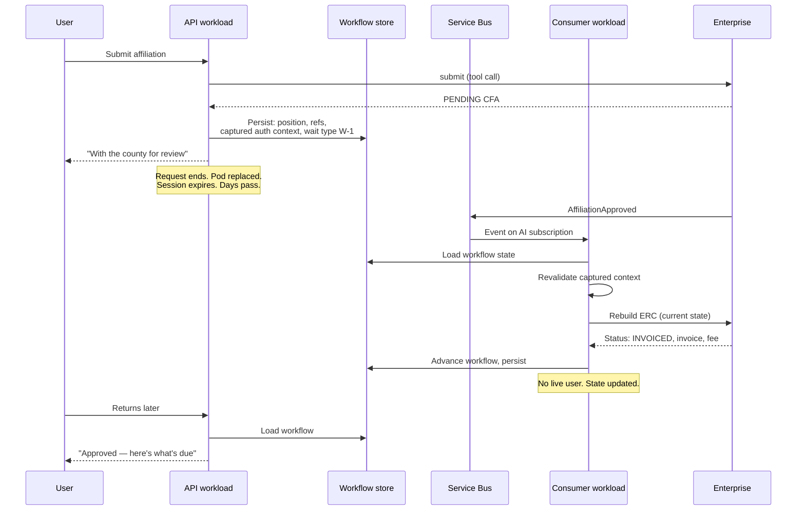

# ADR-D2-10 — Long-running workflow durability and human-in-the-loop suspend/resume

## 1. Summary

Workflow state is persisted at every suspension point in a store independent of process, session
and conversation, so a workflow survives request termination, pod restart, session expiry and a
change of workload. Resumption **re-establishes** rather than restores: enterprise state is
refreshed, and the captured authorization context is revalidated before any action is taken on
the user's behalf.

## 2. Context and Problem Statement

1 PFF-FA-AI-ARCHITECTURE.md §39 criterion 13 requires that long-running workflows survive request termination. 2. PFF-FA-AI-ARCHITECTURE-DETAILED.md
§28 covers durable workflow architecture and §29 HIL architecture. 6 PFF-FA-AI-CONVERSATION-SESSION.md §42–§48 cover async
workflow support and the three waiting states — waiting for user, waiting for human, waiting for
external event — plus session expiry during a workflow. 11 PFF-FA-AI-SERVICE-BUS.md §55–§57 cover workflow resume,
resume safety and resume context. 20.PFF-FA-AI-GOVERNANCE.md §68–§71 cover HIL governance. 2. PFF-FA-AI-ARCHITECTURE-DETAILED.md §48 lists
in-memory-only long-running workflows as an anti-pattern.

The affiliation flow gives the requirement its real shape, and it is more demanding than "persist
some state":

- An application sits at PENDING CFA for **hours to days** while a county officer works through a
  review queue.
- The user's session expires long before that (6 PFF-FA-AI-CONVERSATION-SESSION.md §48).
- The user closes their browser, and possibly the conversation.
- The API pod is replaced by a routine deployment, or scaled down overnight.
- The resumption trigger is a **Service Bus event** arriving on the *consumer* workload — a
  different process from the one that suspended it (ADR-D2-03 §7.2).
- Meanwhile the enterprise state may have moved on: an approval, a rejection, a cancellation, or
  the 31 May timer firing (Scenario 12).

Three questions the specifications leave open determine whether this works.

**What exactly is persisted?** Persisting too little means the workflow cannot resume. Persisting
too much — a full ERC snapshot including officials' safeguarding data — parks personal data in
workflow storage for days and freezes a copy of enterprise state that will be wrong by the time
it is read.

**Under whose authority does a resumed workflow act?** ADR-D2-03 §7.3 established the rule for
event-triggered runs; this decision must define what is captured at suspension to make that rule
implementable, and what happens when revalidation fails.

**Is resumption a restoration or a re-establishment?** Restoring the suspended state and
continuing is the obvious implementation and is wrong: the platform would resume believing
`PENDING CFA` when the application is now `INVOICED`. ADR-D1-03 §7.3 requires stale authoritative
facts to be invalidated rather than used, and a three-day-old ERC is emphatically stale.

## 3. Decision Drivers

### 3.1 Functional drivers

| ID | Driver | Source |
|---|---|---|
| DR-F-01 | Workflows must survive request termination | 1 PFF-FA-AI-ARCHITECTURE.md §39 criterion 13; 2. PFF-FA-AI-ARCHITECTURE-DETAILED.md §28 |
| DR-F-02 | Workflows must survive session expiry | 6 PFF-FA-AI-CONVERSATION-SESSION.md §48 |
| DR-F-03 | Resume must be possible from a different workload than the one that suspended | ADR-D2-03 §7.2 |
| DR-F-04 | HIL suspension and resume must be supported | 2. PFF-FA-AI-ARCHITECTURE-DETAILED.md §29; 20.PFF-FA-AI-GOVERNANCE.md §68–§71 |
| DR-F-05 | Resume must be safe against duplicate and stale triggers | 11 PFF-FA-AI-SERVICE-BUS.md §56 |
| DR-F-06 | Three waiting kinds must be distinguished | 6 PFF-FA-AI-CONVERSATION-SESSION.md §43–§45; ADR-D1-08 §7.2 |

### 3.2 Non-functional drivers

| ID | Driver | Target | Source |
|---|---|---|---|
| DR-N-01 | Persisted state must be small and free of personal data | Identifiers only | ADR-D2-07 §7.3 |
| DR-N-02 | Suspension and resume must not lose a workflow | 0 lost workflows | 1 PFF-FA-AI-ARCHITECTURE.md §39 criterion 13 |
| DR-N-03 | Persisted state must survive schema and framework changes | Versioned model | ADR-D2-06 AC-07 |

### 3.3 Constraints

| ID | Constraint | Type | Source |
|---|---|---|---|
| DR-C-01 | In-memory-only long-running workflows are an anti-pattern | Platform | 2. PFF-FA-AI-ARCHITECTURE-DETAILED.md §48 |
| DR-C-02 | Human decision authority is enterprise-owned | Organisational | 20.PFF-FA-AI-GOVERNANCE.md §70 |
| DR-C-03 | An event-triggered run uses the captured context, revalidated | Platform | ADR-D2-03 §7.3 |
| DR-C-04 | Stale authoritative facts are invalidated, not used | Platform | ADR-D1-03 §7.3 |

### 3.4 Assumptions

| ID | Assumption | If false | Validation |
|---|---|---|---|
| DR-A-01 | A workflow's context requirements can be re-derived to rebuild ERC on resume | Resume needs a persisted ERC snapshot, reintroducing staleness and personal data | Phase 12 resume testing |
| DR-A-02 | Resumption triggers arrive reliably enough that reconciliation is a backstop | Reconciliation becomes the primary mechanism | ADR-D2-18; QM-04 |
| DR-A-03 | Workflows have a natural maximum lifetime | Suspended workflows accumulate indefinitely | Affiliation: the 31 May timer bounds it |

## 4. Evaluation Criteria and Weights

| ID | Criterion | Weight | Rationale | Measurement |
|---|---|---|---|---|
| EC-01 | Correctness after resume | 30 | Resuming on stale state produces confidently wrong statements about a user's application | Does the resumed workflow reflect current enterprise state? |
| EC-02 | Durability across process, session and workload | 25 | The affiliation case crosses all three | Does the workflow survive all four disruptions in §2? |
| EC-03 | Authorization safety on resume | 20 | A resumed workflow acts days later, with no live user | Can it act beyond the original entitlement? |
| EC-04 | Personal data exposure in storage | 15 | Days of persistence, potentially special-category data | Does workflow storage hold personal data? |
| EC-05 | Implementation cost | 10 | Real but subordinate | Complexity of the durability mechanism |
| | **Total** | **100** | | |

Scoring scale: **1** unacceptable · **2** poor · **3** adequate · **4** good · **5** excellent.

## 5. Alternatives Considered

### 5.1 Option A — In-memory workflow state with session affinity

**Description.** Workflow state lives in the process, with sticky routing keeping a user on the
same replica.

**Strengths.**
- No persistence layer; simplest possible implementation.
- Fastest resume — state is already in memory.
- No serialisation concerns.

**Weaknesses.**
- Explicitly an anti-pattern under 2. PFF-FA-AI-ARCHITECTURE-DETAILED.md §48 (DR-C-01).
- Cannot survive pod replacement, which happens on every deployment (EC-02).
- Cannot survive session expiry, which occurs long before a CFA review completes.
- Cannot be resumed by the consumer workload, which is a different process entirely.
- A routine overnight scale-down would destroy every suspended affiliation in the county.

**Cost / effort.** Lowest, and unusable for the actual requirement.

### 5.2 Option B — Full state snapshot persisted and restored

**Description.** At suspension, the entire graph state including ERC contents is serialised to
durable storage. At resume, it is deserialised and execution continues from where it stopped.

**Strengths.**
- Survives process, session and workload changes (EC-02).
- Resume is fast — no rebuilding needed.
- Conceptually simple: freeze and thaw.
- Works even if enterprise APIs are unavailable at resume.

**Weaknesses.**
- Restores a three-day-old view of enterprise state as though current, breaching DR-C-04 and
  ADR-D1-03 §7.3 (EC-01 fails).
- Persists officials' names, DBS status and safeguarding outcomes in workflow storage for the
  duration of the review (EC-04 fails).
- Contradicts ADR-D2-07 §7.2's reference rule.
- Snapshot size grows with club size; a forty-official club produces a large snapshot per
  suspension.

**Cost / effort.** Moderate, with two serious defects.

### 5.3 Option C — Minimal durable state, re-established on resume

**Description.** At suspension, persist the minimum needed to re-establish: workflow instance
identity, current position, workflow-owned data, references, and the captured authorization
context. At resume, revalidate authority, rebuild ERC from the workflow's context requirements,
and continue from the resume node.

**Strengths.**
- Resumed workflows see current enterprise state, because ERC is rebuilt rather than restored
  (EC-01).
- Survives process, session, conversation and workload changes (EC-02).
- Captured context enables ADR-D2-03 §7.3's revalidation (EC-03).
- Workflow storage holds identifiers, not personal data (EC-04).
- Consistent with ADR-D2-07's reference rule.

**Weaknesses.**
- Resume costs enterprise calls to rebuild ERC, adding latency to the resume path.
- Requires context requirements to be re-derivable (DR-A-01).
- Cannot resume if enterprise APIs are unavailable — the workflow waits rather than proceeding
  on stale data, which is correct but is a dependency.

**Cost / effort.** Moderate.

### 5.4 Option D — Enterprise-owned workflow state

**Description.** The enterprise persists AI workflow state alongside its own application state.

**Strengths.**
- One source of truth for workflow position.
- Enterprise durability guarantees apply.
- No divergence between AI and enterprise views.

**Weaknesses.**
- Breaches ADR-D1-01 §7.2 in the opposite direction: AI workflow state is the AI platform's, and
  asking the enterprise to hold it couples the enterprise schema to AI internals.
- Every suspension and resume becomes an enterprise write, which the enterprise has not sized for.
- Conflates Workflow/Agent State with Enterprise Business State, which `CLAUDE.md` forbids.
- The enterprise would need to change whenever AI workflow structure changes.

**Cost / effort.** High, with a boundary violation.

## 6. Evaluation Method and Decision Matrix

**Method.** Weighted scoring against §4, tested against the affiliation PENDING CFA case: suspend
on the API workload, survive pod replacement and session expiry, resume three days later on the
consumer workload from an approval event, for a club with forty officials.

| Criterion | Weight | A: In-memory | B: Full snapshot | C: Minimal + re-establish | D: Enterprise-owned |
|---|---|---|---|---|---|
| EC-01 Correctness after resume | 30 | 2 | 1 | 5 | 3 |
| EC-02 Durability | 25 | 1 | 5 | 5 | 5 |
| EC-03 Authorization safety | 20 | 2 | 3 | 5 | 3 |
| EC-04 Personal data exposure | 15 | 3 | 1 | 5 | 2 |
| EC-05 Cost | 10 | 5 | 4 | 3 | 1 |
| **Weighted total** | **100** | **220** | **300** | **480** | **330** |

- **Option C:** (30×5) + (25×5) + (20×5) + (15×5) + (10×3) = 150 + 125 + 100 + 75 + 30 = **480**

**Sensitivity.** C leads by 180 points and loses only on cost. B — the intuitive choice — scores
1 on correctness and on personal-data exposure, which are the two things that matter most about a
multi-day suspension. No reweighting rescues it: raising EC-05's weight to 40 still leaves C
ahead, and would in any case be asserting that implementation cost outweighs telling users
correct things about their application.

## 7. Decision

### 7.1 What is persisted at suspension

| Persisted | Not persisted |
|---|---|
| `workflow_instance_id`, agent, graph version | ERC contents |
| Current node and execution status | Conversation history |
| Workflow-owned data: intent, entities, pending action | RAG passage text |
| References: `erc_id` and version, `conversation_ref`, `session_ref`, tool result references with status | Tool result payloads |
| **Captured authorization context** (§7.3) | Full claims payload |
| Context requirements for the current step — enough to rebuild ERC | Personal data of any kind |
| Suspension reason and wait type (W-1, W-2, W-3 per ADR-D1-08 §7.2) | |
| Suspension timestamp and expected resumption window | |

Order of kilobytes. Free of personal data by construction, which is ADR-D2-07 §7.3's rule applied
at the suspension boundary and is what makes days-long persistence acceptable.

### 7.2 Resumption re-establishes, it does not restore

```
1. Load persisted workflow state
2. Revalidate the captured authorization context        ← may halt here
3. Rebuild ERC from persisted context requirements       ← current enterprise state
4. Reconcile: what changed while suspended?
5. Continue from the resume node with re-established context
```

Step 3 is the decision's substance. The resumed workflow sees enterprise state **as it is now**,
not as it was. For affiliation this is not a refinement — a workflow suspended at PENDING CFA
may resume to find the application `INVOICED`, `REJECTED`, `CANCELLED`, or cancelled by the 31 May
timer. Restoring the suspended view would have the platform tell the user their application is
awaiting review when it was rejected two days ago.

Step 4 is what makes the difference visible rather than silent. The workflow compares the
suspension reason against current state and takes the appropriate branch — which for a rejection
means explaining the outcome, not continuing toward payment.

### 7.3 The captured authorization context

To make ADR-D2-03 §7.3 implementable, suspension captures:

| Captured | Purpose |
|---|---|
| User identifier | Who the workflow acts for |
| Access archetype (ADR-D1-07 §7.2) | What scope applied |
| Tenant and organisation context | Isolation boundary |
| Entitlement assertions relied upon | What must still be true |
| Claims validity window | When revalidation is required |

At resume, the context is **revalidated**, not trusted:

| Revalidation outcome | Behaviour |
|---|---|
| Still valid | Proceed with the full resume path |
| Expired or entitlement changed | **Update workflow state to reflect the enterprise fact, take no action on the user's behalf, and defer the remainder to the user's next entry** — at which point fresh claims apply |
| User no longer exists or is deprovisioned | Terminate the workflow; record the reason |

The middle row is the important one and is worth stating plainly: an approval event for a
suspended workflow whose user has lost entitlement still updates state, because the approval
happened regardless. What it does not do is act. A long-suspended workflow never becomes a
standing authorization.

### 7.4 The three waiting kinds

6 PFF-FA-AI-CONVERSATION-SESSION.md §43–§45 and ADR-D1-08 §7.2 distinguish three; each has a different resumption trigger and
a different timeout:

| Wait | 6 PFF-FA-AI-CONVERSATION-SESSION.md | Trigger | Timeout behaviour |
|---|---|---|---|
| **Waiting for user** (W-2) | §43 | User's next message, or an event if the action is observable | Conversation-lifetime bounded |
| **Waiting for human** (W-1) | §44 | Enterprise event — CFA approval, rejection, cancellation | Bounded by the enterprise's own timer (Scenario 12's 31 May) |
| **Waiting for external event** (W-3) | §45 | Event, or user return from a portal handoff | Bounded by the workflow's expected window |

The distinction is persisted so that reconciliation (§7.6) knows what to look for and so that
ADR-D1-08's communication pattern is available on resume.

### 7.5 Resume safety

11 PFF-FA-AI-SERVICE-BUS.md §56 requires safe resume. Three properties:

- **Idempotent.** A workflow resumed twice by a duplicate event produces one advance. Event
  deduplication (11 PFF-FA-AI-SERVICE-BUS.md §41) is the first line; workflow-level position checking is the second —
  a resume targeting a node the workflow has already passed is a no-op.
- **Ordered by state, not by arrival.** A stale event (11 PFF-FA-AI-SERVICE-BUS.md §47) — an approval arriving after a
  cancellation — is detected by comparing against current enterprise state in step 3, not by
  trusting arrival order.
- **Single-flight.** Concurrent resume attempts on one workflow instance are serialised, as
  conversation requests are (ADR-D2-04 §7.5).

Point two is why step 3 precedes step 5. Rebuilding ERC before continuing means the workflow
reacts to what is true, which makes out-of-order events self-correcting rather than a problem to
detect.

### 7.6 Reconciliation as a backstop

DR-A-02 assumes events arrive reliably. They will not always. A periodic reconciliation sweep
(ADR-D2-18) identifies workflows suspended beyond their expected window and refreshes their state
directly from the enterprise.

This is a backstop, not the primary mechanism, and the distinction matters: if reconciliation
becomes the usual path to resumption, event delivery is broken and should be fixed rather than
compensated for. QM-04 measures the split.

**Status rationale.** Accepted. Tier 1 under ADR-D0-03 §7.1 — state and eventing are 2. PFF-FA-AI-ARCHITECTURE-DETAILED.md §52
categories — ratified by the external ADF/ADR governance forum, with the Security Owner
co-approving §7.3.

## 8. Architecture Detail

### 8.1 Suspend and resume across three days



The gap between the consumer advancing state and the user learning about it is deliberate and is
what ADR-D1-08's journey design communicates. The platform does not need the user present to
record what happened.

### 8.2 Store characteristics

| Property | Requirement | Realisation |
|---|---|---|
| Independent of process | Survives pod replacement | External store (ADR-D4-10) |
| Independent of session | Survives session expiry | Keyed by workflow instance, not session |
| Independent of conversation | Survives conversation closure | Referenced, not owned by, the conversation |
| Readable by both workloads | Consumer resumes what API suspended | Shared store, no affinity |
| Durable | Survives store restart | Persistence enabled |
| Versioned schema | Survives state-shape change | Versioned Pydantic model (ADR-D2-07 §7.5) |

Workflow state is namespaced separately from conversation, session, memory and cache, per the
key-namespace separation ADR-D4-12 defines. Same technology, different logical store — the
separation 9 PFF-FA-AI-MEMORY-CACHE.md §140 requires.

### 8.3 What happens when resumption cannot proceed

| Situation | Behaviour |
|---|---|
| Enterprise APIs unavailable at resume | Do not proceed on persisted references. Leave suspended; retry on the next event or reconciliation sweep. The workflow waits rather than acting on stale data. |
| ERC cannot be rebuilt (DR-A-01 false for this workflow) | Escalate: the workflow cannot resume safely. Recorded and surfaced to support rather than silently retried forever. |
| Authorization revalidation fails | §7.3's middle row: update state, take no action, defer to user re-entry |
| Enterprise state has moved past the resume point | Step 4's reconciliation takes the appropriate branch — a cancelled application resumes into an explanation, not into payment |
| Workflow exceeds its maximum lifetime | Terminate and record. For affiliation this is bounded by the enterprise's own 31 May timer (DR-A-03) |

The first row is the one that distinguishes this design from Option B: the platform would rather
wait than tell the user something stale.

## 9. Consequences

### 9.1 Positive

- Workflows survive request termination, pod replacement, session expiry, conversation closure
  and a change of workload — all four disruptions in §2.
- A resumed workflow reflects current enterprise state, so the platform never tells a user their
  rejected application is awaiting review.
- Workflow storage holds no personal data, which makes days-long persistence acceptable under
  minimisation.
- A long-suspended workflow is never a standing authorization.
- Out-of-order events self-correct, because the workflow reacts to current state rather than to
  arrival order.

### 9.2 Negative

- Resume costs enterprise calls to rebuild ERC, adding latency and load on the resume path.
- Resumption depends on enterprise API availability; a workflow cannot resume during an outage.
- More complex than freeze-and-thaw, with a reconciliation step and a revalidation step that
  Option B would not need.
- Context requirements must be re-derivable, which constrains how workflow steps declare them.

### 9.3 Neutral

- The three waiting kinds are 6 PFF-FA-AI-CONVERSATION-SESSION.md §43–§45's; this decision assigns each a trigger and a
  timeout.
- Reconciliation exists as a backstop and should stay one.

### 9.4 Trade-offs explicitly accepted

| Given up | In exchange for | Accepted by |
|---|---|---|
| Fast resume from a snapshot | Resumed workflows reflecting current enterprise state | AI Product Owner |
| Ability to resume during an enterprise outage | Never proceeding on stale authoritative state | AI Solution Architect |
| Simplicity of freeze-and-thaw | No personal data in multi-day workflow storage | Compliance/Legal |
| Acting immediately on every resumption trigger | No long-suspended workflow becoming a standing authorization | Security Owner |

## 10. Golden-Rule and Precedence Conformance

| Constraint | Conformance |
|---|---|
| Enterprise decides; AI orchestrates | The workflow waits for an enterprise decision it neither makes nor predicts (ADR-D1-08 §7.3). Human decision authority stays with the CFA officer per 20.PFF-FA-AI-GOVERNANCE.md §70. |
| Authoritative-truth precedence | §7.2 step 3 is ADR-D1-03 §7.3 applied to resumption: the suspended ERC is stale and is invalidated, not restored. Rebuilding is the only way to honour the freshness policy across days. |
| Four-state separation | Workflow State is persisted independently of Conversation State and Session State, and holds only references to Enterprise Business State. The independence is what lets a session expire without losing the workflow. |
| Versioned artefacts, never mutated in place | Persisted state is a versioned model; graph version is recorded so a resumed workflow knows which graph it belongs to. |
| Adam persona governs how, never what | The resumed outcome is enterprise fact; the persona conveys it on the user's next entry, under ADR-D1-09's exclusion zones where the outcome is a rejection (X-6). |

## 11. Risks and Mitigations

| ID | Risk | Likelihood | Impact | Exposure | Mitigation | Owner | Residual |
|---|---|---|---|---|---|---|---|
| RSK-01 | A resumption trigger is missed and a workflow stays suspended | Medium | High | High | Reconciliation sweep (§7.6); expected-window alerting; QM-04 | Operations/SRE | Low |
| RSK-02 | ERC rebuild fails at resume (DR-A-01) | Medium | Medium | Medium | §8.3 escalation rather than silent retry; Phase 12 testing | AI Engineering Lead | Medium |
| RSK-03 | Captured context revalidation is skipped under pressure to "just resume" | Low | Very High | High | §7.3 is a hard step in the resume path; AC-04 adversarial test; QM-03 | Security Owner | Low |
| RSK-04 | Duplicate events cause double advance | Medium | High | High | Event deduplication plus workflow position check (§7.5); AC-05 | AI Engineering Lead | Low |
| RSK-05 | Suspended workflows accumulate without bound (DR-A-03) | Low | Medium | Low | Maximum lifetime with termination; affiliation bounded by the enterprise's 31 May timer | Operations/SRE | Low |
| RSK-06 | Persisted state acquires personal data through a well-meaning addition | Medium | High | High | Schema audit in CI (ADR-D2-07 QM-02); §7.1's explicit not-persisted column | Compliance/Legal | Low |

## 12. Quantitative Targets and Measures

| ID | Measure | Target | Threshold (alert) | Source | Review cadence |
|---|---|---|---|---|---|
| QM-01 | Workflows lost across a runtime restart | 0 | ≥1 | Durability test and production audit | Per build and daily |
| QM-02 | Resumed workflows proceeding on stale enterprise state | 0 | ≥1 | Provenance audit on resume path | Daily |
| QM-03 | Resumes executing without context revalidation | 0 | ≥1 | Resume path audit | Daily |
| QM-04 | Resumptions triggered by reconciliation rather than by event | ≤5% | >20% | Resume trigger metrics | Weekly |
| QM-05 | Workflows suspended beyond their expected window | ≤2% | >10% | Workflow state sweep | Daily |
| QM-06 | Personal data fields in the persisted workflow schema | 0 | ≥1 | Schema audit | Per build |
| QM-07 | Double advances from duplicate triggers | 0 | ≥1 | Workflow position audit | Daily |

QM-04 is the health check on DR-A-02. Reconciliation carrying more than a fifth of resumptions
means event delivery is unreliable and needs fixing rather than compensating.

## 13. Security, Privacy and Compliance Impact

| Dimension | Impact |
|---|---|
| Attack surface change | Workflow storage is a persistent store holding identifiers and authorization context. It holds no personal data and no reusable credential — the captured context is an assertion of what was true, revalidated before use, not a token that can be replayed. |
| Data classification touched | Internal (identifiers and workflow position). |
| Personal data / PII | None persisted, by construction (§7.1). This is the decision's most significant privacy property: a county's worth of suspended affiliations holds no personal data at rest in AI storage. |
| Children's data and safeguarding | Directly material. Under Option B, a suspended affiliation would persist named youth-team officials' DBS and safeguarding status for the days of a CFA review, in a store whose retention follows workflow lifetime rather than safeguarding policy. Under this decision it persists an `erc_id`. |
| UK GDPR lawful basis and rights impact | Supports minimisation (Art. 5(1)(c)) and storage limitation (Art. 5(1)(e)). Erasure is clean: deleting ERC removes the data and the workflow reference becomes unresolvable, handled by §8.3 — no orphaned copy survives an erasure request. |
| Audit and evidential requirements | Suspension reason, wait type, captured context and every resume attempt with its revalidation outcome are recorded, satisfying 20.PFF-FA-AI-GOVERNANCE.md §71's HIL evidence requirement. |
| Standards touched | ISO/IEC 27001 A.5.15, A.8.10 (information deletion), A.8.13 (backup); ISO/IEC 42001 (human oversight); NIST AI RMF GOVERN 5.2; EU AI Act Art. 14; UK GDPR Art. 5(1)(c), 5(1)(e), 17, 25. |

## 14. Implementation Impact

| Aspect | Detail |
|---|---|
| Build phases | 4 (suspension model), 12 (event-driven resume), 23 (affiliation validation) |
| Repository paths | `src/pff_fa_ai/application/workflows/`, `src/pff_fa_ai/domain/workflow/`, `src/pff_fa_ai/infrastructure/persistence/` |
| Configuration | Expected windows and maximum lifetimes per workflow in `config/base/workflows.yaml`; store connection per ADR-D4-10 |
| Contracts / schemas | Versioned persisted workflow state model; captured authorization context model |
| Migration | None |
| Dependencies on other ADRs | ADR-D2-03 (event path and authority), ADR-D2-07 (references), ADR-D4-10 (store), ADR-D2-16 (events), ADR-D2-18 (reconciliation) |
| Effort estimate | Large — durability, resume and reconciliation |

## 15. Validation and Verification

| ID | Acceptance criterion | Verification method |
|---|---|---|
| AC-01 | A workflow suspended on the API workload resumes on the consumer workload after a full restart | Cross-workload durability test |
| AC-02 | A workflow survives session expiry and conversation closure | Expiry and closure tests |
| AC-03 | A resumed workflow reflects enterprise state at resume time, not at suspension | Resume test with state changed during suspension; QM-02 |
| AC-04 | A resume whose captured context fails revalidation updates state but takes no action | Adversarial test with entitlement revoked; QM-03 |
| AC-05 | Duplicate resumption triggers produce one advance | Duplicate event test; QM-07 |
| AC-06 | Persisted workflow state for a forty-official club contains no personal data | Persistence test with realistic fixture; QM-06 |
| AC-07 | A workflow suspended past its expected window is detected by reconciliation | Reconciliation test; QM-05 |
| AC-08 | An approval arriving after a cancellation does not advance the workflow toward payment | Out-of-order event test |

## 16. Operational Impact

| Aspect | Detail |
|---|---|
| Monitoring | Suspended workflow count by wait type and age; resume success rate; revalidation outcomes; reconciliation share |
| Alerting | QM-01, QM-02, QM-03, QM-06 and QM-07 on any occurrence; QM-05 on window breaches |
| Runbook | `docs/runbooks/service-bus-dlq.md`, `docs/runbooks/erc-batch-recovery.md` |
| Failure mode and degradation | A workflow that cannot resume stays suspended and is surfaced, rather than failing silently or proceeding on stale data. During an enterprise outage, suspended workflows simply wait. |
| Rollback | Persisted state is versioned; a rollback reads the older schema. Suspended workflows survive a deployment rollback. |
| Support model impact | Support needs to query suspended workflows by club and by age to answer "the county approved it, why hasn't it moved?" |

## 17. Cost Impact

| Cost element | One-off | Recurring | Basis |
|---|---|---|---|
| Durability, resume and reconciliation | Phases 4 and 12, large | — | `DEVELOPMENT-GUIDE.md` §4 |
| Workflow state storage | — | Kilobytes per suspended workflow | ADR-D4-10 |
| ERC rebuild on resume | — | Context collection per resumption | The cost of §7.2's correctness |
| Reconciliation sweep | — | Periodic query and refresh for overdue workflows | Backstop only |
| Avoided cost | — | Ongoing | Option B would require personal-data retention controls, DPIA treatment and erasure handling on workflow storage |

## 18. Revisit Triggers and Causal Analysis Hooks

| ID | Trigger | Detected by | Action on trigger |
|---|---|---|---|
| RT-01 | QM-04 shows reconciliation above 20% of resumptions | Weekly review | Event delivery is unreliable; fix delivery, do not lean on the backstop |
| RT-02 | QM-02 records a resume on stale state | Daily audit | Governance incident; step 3 was skipped or ERC rebuild silently failed |
| RT-03 | QM-03 records a resume without revalidation | Daily audit | Security incident; ADR-D2-03 §7.3 breached |
| RT-04 | ERC rebuild proves impossible for a workflow class (DR-A-01) | Phase 12 or production | That workflow's context requirements are not re-derivable; redesign the step's declarations |
| RT-05 | Suspended workflows accumulate without a bounding timer (DR-A-03) | Monthly review | Introduce a platform maximum lifetime for workflows the enterprise does not bound |
| RT-06 | Resume latency from ERC rebuild becomes user-visible | Performance review | Consider partial rebuild of only the sections the resume branch needs — never a snapshot restore |

**Scheduled review:** 2027-08-21.

## 19. Traceability

| Dimension | Reference |
|---|---|
| Workshop sheet | WS-08 Workflow Orchestration Architecture; WS-11 Event Notification & Real-Time Synchronization |
| Specification sections | 2. PFF-FA-AI-ARCHITECTURE-DETAILED.md §28 (Durable Workflow Architecture), §29 (HIL Architecture), §48 (Anti-Patterns — in-memory-only long-running workflows); 4. PFF-FA-AI-RUNTIME.md §46 (Long-Running Workflow), §49 (HIL Runtime); 6 PFF-FA-AI-CONVERSATION-SESSION.md §42–§48 (Async Workflow Support, Waiting for User, Waiting for Human, Waiting for External Event, Event Resume, Conversation After External Event, Session Expiration During Workflow); 11 PFF-FA-AI-SERVICE-BUS.md §55–§57 (Workflow Resume, Resume Safety, Resume Context), §59 (HIL Event Flow), §47 (Stale Event); 20.PFF-FA-AI-GOVERNANCE.md §68–§71 (Human Oversight, HIL Boundary, Human Decision Authority, HIL Evidence); 9 PFF-FA-AI-MEMORY-CACHE.md §140; affiliation flow Phases 6–7, Scenario 12 |
| Requirement IDs | `FR-A39-12`, `FR-A39-13`, `NFR-A38-REL`, `NFR-A38-RECOV` |
| Build phases | 4, 12, 23 |
| Code paths | `src/pff_fa_ai/application/workflows/`, `src/pff_fa_ai/domain/workflow/` |
| Configuration | `config/base/workflows.yaml` |
| Tests | AC-01 to AC-08 |
| Upstream ADRs | ADR-D2-03, ADR-D2-06, ADR-D2-07 |
| Downstream ADRs | ADR-D2-16, ADR-D2-18, ADR-D4-10, ADR-D6-14, ADR-D1-08 |

## 20. Change Log

| Version | Date | Author | Change |
|---|---|---|---|
| 1.0.0 | 2026-08-21 | AI Solution Architect | Initial decision recorded. Minimal durable state with re-establishment on resume rather than snapshot restore, so a resumed workflow reflects current enterprise state and persists no personal data; captured authorization context revalidated before any action, with state-only update on failure. Tier 1 — ratified by the external ADF/ADR forum. |
