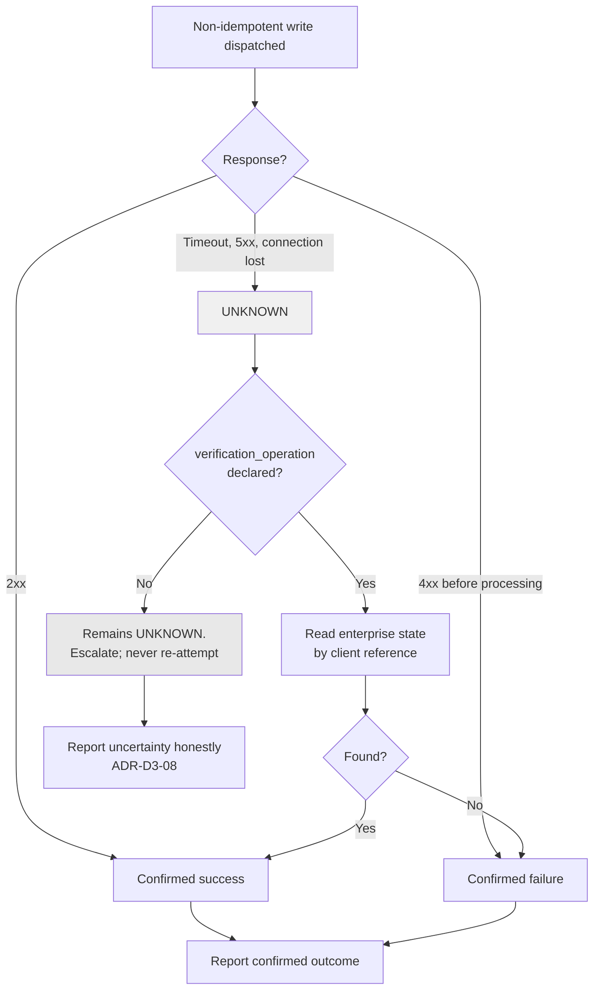

# ADR-D2-11 — Workflow idempotency, retry, timeout and loop-limit policy

## 1. Summary

Retry eligibility is a **declared property of each enterprise operation**, not a runtime judgement,
and a write is retried only when it carries an idempotency key. 2. PF-FT-AI-ARCHITECTURE-DETAILED.md §48's "blind transaction
retry — never" is enforced by making the unknown outcome a first-class state: an operation whose
result is genuinely unknown is **verified**, never re-attempted. Timeouts and retries form one
nested hierarchy so that no inner layer can outlive its outer budget.

## 2. Context and Problem Statement

10 PF-FT-AI-ENTERPRISE-INTEGRATION.md §41–§44 cover retry policy, retryable and non-retryable examples, and retry configuration.
10 PF-FT-AI-ENTERPRISE-INTEGRATION.md §45–§47 cover idempotency, keys and lifecycle. 10 PF-FT-AI-ENTERPRISE-INTEGRATION.md §48–§49 cover unknown transaction
state and transaction verification. 4. PF-FT-AI-RUNTIME.md §55 gives a timeout hierarchy and §56 a retry hierarchy.
7 PF-FT-AI-AGENTIC-ORCHESTRATION.md §72–§73 give the agent loop and loop protection. 3. PF-FT-AI-RESPONSIBILITY-MATRIX.md §36–§37 assign transaction and
idempotency responsibility. 2. PF-FT-AI-ARCHITECTURE-DETAILED.md §48 lists blind transaction retry among the anti-patterns.

The material is comprehensive and leaves the hardest question open, which the affiliation flow
poses directly. Scenarios 21 through 27 are payment and submission failures where the outcome is
uncertain:

- Scenario 21 — invoice not created in PAAS.
- Scenario 22 — invoice created but not mapped to the application ID.
- Scenario 23 — paid offline but the invoice is still unpaid in Xero.
- Scenario 25 — invoice not posted to Xero.
- Scenario 26 — a 500 error on submission of an insurance product.
- Scenario 27 — a 404 on product validation.

A 500 on submission is the case that matters most. The platform does not know whether the
application was created. Retrying might create a duplicate affiliation application for a club.
Not retrying might leave the user believing submission failed when it succeeded. Both are wrong,
and the difference between them is invisible from the error alone.

Three sub-questions follow.

**Who decides whether an operation is retryable?** If an agent or a model decides, retry
eligibility becomes a judgement about business semantics — is creating a second application
harmful? — which is a business question the platform must not answer (ADR-D1-01 §7.3).

**What makes a write safely retryable?** 10 PF-FT-AI-ENTERPRISE-INTEGRATION.md §45–§47 give idempotency keys. But an idempotency
key only helps if the enterprise operation honours it, and whether it does is enterprise
knowledge, not something the platform can assume.

**How do the timeout and retry hierarchies compose?** 4. PF-FT-AI-RUNTIME.md §55 and §56 give both without stating
the invariant that must hold between them. If a tool's retry budget can exceed the agent run's
timeout, the run dies mid-retry, leaving an operation in flight with no one waiting for the
result — which manufactures the unknown-outcome case rather than handling it.

## 3. Decision Drivers

### 3.1 Functional drivers

| ID | Driver | Source |
|---|---|---|
| DR-F-01 | Blind transaction retry must never occur | 2. PF-FT-AI-ARCHITECTURE-DETAILED.md §48 |
| DR-F-02 | Retryable and non-retryable operations must be distinguished | 10 PF-FT-AI-ENTERPRISE-INTEGRATION.md §41–§43 |
| DR-F-03 | Idempotency keys must be used for write operations | 10 PF-FT-AI-ENTERPRISE-INTEGRATION.md §45–§46 |
| DR-F-04 | Unknown transaction state must be handled explicitly | 10 PF-FT-AI-ENTERPRISE-INTEGRATION.md §48–§49 |
| DR-F-05 | Loop protection must terminate runaway agent runs | 7 PF-FT-AI-AGENTIC-ORCHESTRATION.md §73; 4. PF-FT-AI-RUNTIME.md §54 |
| DR-F-06 | Timeout and retry hierarchies must be defined | 4. PF-FT-AI-RUNTIME.md §55–§56 |

### 3.2 Non-functional drivers

| ID | Driver | Target | Source |
|---|---|---|---|
| DR-N-01 | Total retry time must fit within the turn budget | Inner budgets strictly less than outer | ADR-D5-18 |
| DR-N-02 | Retries must not amplify load on a struggling service | Backoff with jitter; circuit breaking | ADR-D7-06 |
| DR-N-03 | Duplicate enterprise operations must not occur | 0 duplicates | 3. PF-FT-AI-RESPONSIBILITY-MATRIX.md §37 |

### 3.3 Constraints

| ID | Constraint | Type | Source |
|---|---|---|---|
| DR-C-01 | Transaction authority is enterprise-owned | Platform | ADR-D1-01 §7.2; 3. PF-FT-AI-RESPONSIBILITY-MATRIX.md §36 |
| DR-C-02 | The platform must not guess at ambiguous transaction outcomes | Platform | `CLAUDE.md`; 8 PF-FT-AI-ERC-CONTEXT.md §66 |
| DR-C-03 | Retry configuration is declared, not inferred | Platform | 10 PF-FT-AI-ENTERPRISE-INTEGRATION.md §10, §44 |
| DR-C-04 | Critical controls are deterministic | Platform | 2. PF-FT-AI-ARCHITECTURE-DETAILED.md §3.3 |

### 3.4 Assumptions

| ID | Assumption | If false | Validation |
|---|---|---|---|
| DR-A-01 | Enterprise write operations honour idempotency keys where declared | Retrying a "safe" write creates duplicates | Per-operation confirmation with the enterprise; ADR-D2-14 |
| DR-A-02 | A verification read exists for every write whose outcome may be unknown | The unknown state cannot be resolved and must be escalated to a human | Integration mapping; §7.4 |
| DR-A-03 | Loop limits distinguish loops from legitimately long runs | Legitimate runs are terminated | QM-05 |

## 4. Evaluation Criteria and Weights

| ID | Criterion | Weight | Rationale | Measurement |
|---|---|---|---|---|
| EC-01 | Prevention of duplicate enterprise operations | 35 | A duplicate affiliation application or a double payment is the worst outcome the platform can cause; 2. PF-FT-AI-ARCHITECTURE-DETAILED.md §48 makes it categorical | Can a retry create a duplicate? |
| EC-02 | Correct handling of unknown outcomes | 25 | Affiliation Scenarios 21–27 are the platform's hardest real cases | Is unknown a distinct state, or collapsed into success or failure? |
| EC-03 | Resilience to transient failure | 20 | Without retry, ordinary network blips become user-visible failures | Transient failures absorbed |
| EC-04 | Budget composition | 12 | An inner budget exceeding its outer manufactures unknown outcomes | Can an inner layer outlive its outer? |
| EC-05 | Configuration simplicity | 8 | Real but subordinate | Number of independently tuned values |
| | **Total** | **100** | | |

Scoring scale: **1** unacceptable · **2** poor · **3** adequate · **4** good · **5** excellent.

## 5. Alternatives Considered

### 5.1 Option A — Uniform retry policy for all operations

**Description.** One retry policy — three attempts with exponential backoff — applied to every
enterprise call regardless of type.

**Strengths.**
- Simplest possible configuration (EC-05).
- Absorbs transient failures well (EC-03).
- Nothing to declare per operation; nothing to get wrong in a catalogue.
- Consistent behaviour, easy to reason about.

**Weaknesses.**
- Retries writes blindly, which is 2. PF-FT-AI-ARCHITECTURE-DETAILED.md §48's named anti-pattern. A retried `submit_affiliation`
  after a 500 may create a second application (EC-01 fails).
- Cannot distinguish a timeout — where the operation may have succeeded — from a connection
  refusal, where it certainly did not.
- Collapses unknown into failure, so Scenario 26 would be reported as a failed submission when
  the application may exist (EC-02 fails).

**Cost / effort.** Lowest, with the central failure unaddressed.

### 5.2 Option B — Declared retry eligibility with idempotency-gated writes and explicit unknown state

**Description.** Each API in the catalogue declares `idempotent`, `retryable` and its
verification operation. Reads retry freely. Writes retry only when idempotent and carrying a key.
Where an outcome is genuinely unknown, the platform **verifies** by reading enterprise state
rather than re-attempting. Timeout and retry budgets are nested with a strict inequality between
layers.

**Strengths.**
- A non-idempotent write is never retried, so duplicates are structurally prevented (EC-01).
- Unknown is a first-class outcome resolved by verification, matching 10 PF-FT-AI-ENTERPRISE-INTEGRATION.md §48–§49 (EC-02).
- Reads retry freely, absorbing transient failure where it is safe (EC-03).
- Nested budgets guarantee no inner layer outlives its outer (EC-04).
- Eligibility is declared, so no runtime business judgement is made (DR-C-04).

**Weaknesses.**
- Requires accurate per-operation declarations, which depend on enterprise knowledge (DR-A-01).
- Requires a verification operation for each uncertain write (DR-A-02); where none exists, the
  case escalates.
- More configuration than a uniform policy.
- Verification costs an extra call on the failure path.

**Cost / effort.** Moderate.

### 5.3 Option C — No retry; surface every failure to the user

**Description.** Any failure is reported immediately. The user retries if they wish.

**Strengths.**
- No duplicates possible from platform behaviour (EC-01 trivially).
- No ambiguity about what the platform did.
- Simplest implementation.
- The user is always in control.

**Weaknesses.**
- Transient failures become user-visible, and a conversational interface that fails on every
  network blip is unusable (EC-03 fails).
- Does not address unknown outcomes — a 500 is still ambiguous, and telling the user "it failed"
  is asserting something the platform does not know (EC-02).
- Pushes retry decisions to users who have no way to judge whether re-submitting is safe. A user
  retrying a submission is exactly the duplicate this decision must prevent.

**Cost / effort.** Lowest, with an unusable experience and the duplicate risk merely relocated.

### 5.4 Option D — Model-mediated retry decisions

**Description.** On failure, the model assesses the error and decides whether retrying is safe.

**Strengths.**
- Adapts to novel error conditions the catalogue does not anticipate.
- Could incorporate conversational context in the decision.
- No per-operation declarations to maintain.

**Weaknesses.**
- Whether re-submitting an affiliation is harmful is a business question, and the model answering
  it breaches ADR-D1-01 §7.3 and DR-C-04.
- Non-deterministic: the same failure could retry once and not the next time, so duplicate risk
  becomes probabilistic (EC-01 fails).
- 2. PF-FT-AI-ARCHITECTURE-DETAILED.md §3.3 requires deterministic critical controls; transaction safety is as critical as it
  gets.
- Adds an inference to the failure path, which is the worst time for latency.

**Cost / effort.** Low, with an unacceptable failure mode.

## 6. Evaluation Method and Decision Matrix

**Method.** Weighted scoring against §4, tested against affiliation Scenarios 21–27 — for each
option, what happens after a 500 on `submit_affiliation`?

| Criterion | Weight | A: Uniform retry | B: Declared + verify | C: No retry | D: Model-mediated |
|---|---|---|---|---|---|
| EC-01 Duplicate prevention | 35 | 1 | 5 | 4 | 2 |
| EC-02 Unknown handling | 25 | 1 | 5 | 2 | 3 |
| EC-03 Transient resilience | 20 | 5 | 5 | 1 | 4 |
| EC-04 Budget composition | 12 | 3 | 5 | 5 | 2 |
| EC-05 Configuration simplicity | 8 | 5 | 3 | 5 | 4 |
| **Weighted total** | **100** | **236** | **480** | **306** | **287** |

- **Option B:** (35×5) + (25×5) + (20×5) + (12×5) + (8×3) = 175 + 125 + 100 + 60 + 24 = **480**

**Sensitivity.** B leads by 174 points and loses only on configuration simplicity. That gap is
worth 16 points against a 174-point margin. A and D both score 1 or 2 on duplicate prevention,
the criterion carrying 35 points and reflecting a 2. PF-FT-AI-ARCHITECTURE-DETAILED.md §48 categorical prohibition — no
reweighting rescues either. C prevents platform-caused duplicates but relocates the risk to
users, who are less equipped to judge it.

## 7. Decision

### 7.1 Retry eligibility is declared, per operation

Each catalogue entry declares, per 10 PF-FT-AI-ENTERPRISE-INTEGRATION.md §10 and §44:

```yaml
execution:
  idempotent: true | false
  retryable: true | false
  idempotency_key_required: true | false
  verification_operation: enterprise.affiliation.get_by_client_ref | null
  retry:
    max_attempts: 3
    backoff: exponential
    base_delay_ms: 200
    jitter: true
```

The retry executor reads these declarations. It makes no inference from the operation name, the
HTTP verb or the error text. An operation with no declaration is **not retried** — the safe
default, since an undeclared operation is one whose semantics the platform does not know.

### 7.2 The retry decision table

| Operation class | Failure type | Behaviour |
|---|---|---|
| **Read** | Transient — timeout, 502, 503, connection reset | Retry per policy |
| Read | Permanent — 400, 404, 403 | No retry; surface |
| **Idempotent write with key** | Transient | Retry with the **same** idempotency key |
| Idempotent write with key | Permanent | No retry; surface |
| **Non-idempotent write** | Transient | **No retry.** Enter unknown-outcome handling (§7.4) |
| Non-idempotent write | Permanent, before dispatch (validation, 400) | No retry; surface as a definite failure |
| Non-idempotent write | Permanent, after dispatch (500) | Unknown-outcome handling (§7.4) |
| Any | Circuit open | No attempt; surface as unavailable |

The row that carries the decision's weight is *non-idempotent write, transient failure*. The
intuitive response — retry, since it was only a timeout — is exactly the blind retry 2. PF-FT-AI-ARCHITECTURE-DETAILED.md §48
forbids, because a timeout means the request may have been processed.

### 7.3 Idempotency keys

Per 10 PF-FT-AI-ENTERPRISE-INTEGRATION.md §45–§47, a write declared `idempotency_key_required` carries a key derived
deterministically from the operation and its business parameters — not randomly generated, so
that a retry after a process restart produces the same key.

```
key = hash(operation_id, workflow_instance_id, business_parameters)
```

Derivation from `workflow_instance_id` rather than from a request identifier is deliberate: a
workflow resumed after suspension (ADR-D2-10) regenerates the same key, so a retry across a
resume boundary is still recognised as the same operation.

DR-A-01 flags that a key only helps if the enterprise honours it. `idempotency_key_required: true`
is therefore a statement about the *enterprise operation*, confirmed with the enterprise during
integration mapping (ADR-D2-14), not an assumption the platform makes.

### 7.4 Unknown outcome: verify, never re-attempt

10 PF-FT-AI-ENTERPRISE-INTEGRATION.md §48–§49 and 8 PF-FT-AI-ERC-CONTEXT.md §66 identify the unknown state. The handling:



Three properties matter:

- **Unknown is a state, not an error.** It propagates into the tool result (ADR-D2-09 §8.2 step 8)
  and reaches ADR-D1-02's invariant I-4, which blocks success language.
- **Verification is a read, not a re-attempt.** It asks the enterprise what happened; it does not
  ask the enterprise to do it again.
- **Where verification is impossible, the platform says so.** Per DR-C-02 and `CLAUDE.md`'s
  persona rule 6, it does not guess. ADR-D3-08 governs the wording; ADR-D1-09's exclusion zone
  X-2 prohibits football framing here.

This is the direct answer to affiliation Scenario 26: a 500 on submission produces UNKNOWN, the
platform reads the application by client reference, and reports what it finds. If no verification
operation exists, the user is told the submission's outcome could not be confirmed and what to
check — which is honest and actionable, where "it failed" would be neither.

### 7.5 The nested budget hierarchy

4. PF-FT-AI-RUNTIME.md §55 and §56 give timeout and retry hierarchies. The invariant between them is stated here
because without it the hierarchies do not compose:

> **Every inner budget must be strictly less than the remaining outer budget at the moment the
> inner operation begins.**

| Layer | Timeout | Retry |
|---|---|---|
| **Turn** (user-facing) | Overall budget per ADR-D5-18 | None — turns are not retried |
| **Agent run** | < remaining turn budget | None — runs are not retried |
| **Node** | < remaining run budget | None |
| **Tool call** | < remaining node budget | Per §7.2, bounded so total attempts fit |
| **HTTP request** | < remaining tool budget ÷ max attempts | Transport-level only |

The division by `max_attempts` at the innermost layer is what guarantees the whole retry sequence
fits. Without it, three attempts at the tool timeout would exceed the node budget, the run would
be cancelled mid-retry, and an operation would be left in flight with nobody waiting — creating
an unknown outcome the platform caused rather than encountered.

Budgets are **remaining**, not absolute: an operation starting late in a turn gets less, so a slow
first call cannot leave a later one with an impossible budget.

### 7.6 Loop protection

7 PF-FT-AI-AGENTIC-ORCHESTRATION.md §73 requires loop protection. The harness enforces cumulative limits per run (ADR-D2-09
§7.3), of which two are specific to loops:

- **Repeated identical tool call** — the same tool with the same parameters, twice in a run, is a
  loop rather than progress. This is distinct from a retry: a retry is the executor re-attempting
  one call; a repeated call is the agent deciding to call again.
- **Node revisit count** — a node entered more times than its configured maximum.

Breach terminates the run with workflow state preserved and the limit recorded (ADR-D2-09 §7.3).
DR-A-03 assumes limits distinguish loops from long runs; QM-05 measures it.

**Status rationale.** Accepted. Tier 1 under ADR-D0-03 §7.1 — transaction safety is a system
boundary concern — ratified by the external ADF/ADR governance forum.

## 8. Architecture Detail

### 8.1 Affiliation Scenario 26 end to end

A 500 on submission of an insurance product:

| Step | Action |
|---|---|
| 1 | `submit_affiliation` declared `idempotent: false`, `retryable: false`, with `verification_operation: enterprise.affiliation.get_by_client_ref` |
| 2 | Dispatch returns 500 after the request was accepted |
| 3 | Executor classifies: non-idempotent write, post-dispatch failure → **UNKNOWN** |
| 4 | No retry. §7.2's table has no path from UNKNOWN to re-attempt. |
| 5 | Verification: read the application by the client reference the submission carried |
| 6a | Found, status `PENDING CFA` → confirmed success. The user is told the application was submitted, despite the error. |
| 6b | Not found → confirmed failure. The user is told it was not submitted and can retry. |
| 6c | Verification itself fails → remains UNKNOWN. The user is told the outcome could not be confirmed, with what to check. I-4 blocks any success language. |

Branch 6a is the one a uniform retry policy would get badly wrong: it would have retried and
created a duplicate application for a club that already had one.

### 8.2 Where each mechanism lives

| Mechanism | Component | ADR |
|---|---|---|
| Retry eligibility declarations | API catalogue | ADR-D2-15 |
| Retry execution with backoff and jitter | `integration/execution/retry.py` | This |
| Idempotency key derivation | `integration/execution/idempotency.py` | This |
| Unknown-outcome verification | `integration/execution/` | This |
| Circuit breaking | `integration/execution/circuit.py` | ADR-D7-06 |
| Timeout budgets | Harness, propagated down | ADR-D2-09 |
| Loop limits | Harness | ADR-D2-09 §7.3 |
| Unknown state in responses | Output guardrail I-4 | ADR-D1-02, ADR-D3-08 |

Retry is deliberately in the integration layer rather than in agents: an agent that could retry
would be making the business judgement §5.4 rejects.

### 8.3 Interaction with event-driven reconciliation

An operation left UNKNOWN and unverifiable at the time is not abandoned. ADR-D2-18's
reconciliation sweep re-attempts **verification** — never the operation — on a schedule. If the
enterprise later shows the application exists, the workflow state is corrected and the user is
informed on next entry.

This matters for affiliation Scenario 25 (invoice not posted to Xero) and Scenario 23 (offline
payment unreconciled), where the truth becomes knowable later than the moment of failure.

## 9. Consequences

### 9.1 Positive

- A non-idempotent write is never retried, so the platform cannot create a duplicate affiliation
  application or a double payment.
- Unknown outcomes are resolved by asking the enterprise what happened, which is often
  determinable even when the response was not.
- Reads retry freely, so ordinary transient failures never reach the user.
- Nested budgets mean the platform never abandons an in-flight operation because an outer layer
  timed out mid-retry.
- Retry decisions are deterministic and declared, so they are testable and auditable.

### 9.2 Negative

- Per-operation declarations must be accurate, and their accuracy depends on enterprise knowledge
  the platform does not own.
- Where no verification operation exists, the platform can only report uncertainty — honest, but
  unsatisfying for the user.
- Verification costs an extra call on the failure path, when the system is already degraded.
- More configuration than a uniform policy, and a wrong declaration is dangerous rather than
  merely suboptimal.

### 9.3 Neutral

- Retry lives in the integration layer, not in agents.
- Loop limits are cumulative run properties held by the harness.

### 9.4 Trade-offs explicitly accepted

| Given up | In exchange for | Accepted by |
|---|---|---|
| Automatic retry of writes | No possibility of a platform-caused duplicate transaction | External ADF/ADR forum |
| A single uniform policy | Behaviour matched to each operation's real semantics | AI Platform Owner |
| Certainty in every response | Honest uncertainty where the outcome is genuinely unknown | AI Product Owner |
| Some latency on the failure path | Verification that often resolves the uncertainty | AI Solution Architect |

## 10. Golden-Rule and Precedence Conformance

| Constraint | Conformance |
|---|---|
| Enterprise decides; AI orchestrates | §7.4's verification asks the enterprise what happened rather than the platform deciding what probably happened. Transaction authority stays with the enterprise per 3. PF-FT-AI-RESPONSIBILITY-MATRIX.md §36. |
| Authoritative-truth precedence | The verification read is an authority-5 enterprise response and settles the question. The platform's own record of what it attempted never overrides it. |
| Four-state separation | Retry and idempotency state is Workflow/Agent State; the transaction outcome is Enterprise Business State, read not inferred. |
| Versioned artefacts, never mutated in place | Retry declarations live in the versioned API catalogue (ADR-D5-06). |
| Adam persona governs how, never what | §7.4's uncertainty is communicated under ADR-D1-09's X-2 exclusion — no football framing, no celebration, and ADR-D1-02's I-4 blocks success language structurally. |

## 11. Risks and Mitigations

| ID | Risk | Likelihood | Impact | Exposure | Mitigation | Owner | Residual |
|---|---|---|---|---|---|---|---|
| RSK-01 | An operation wrongly declared idempotent is retried and duplicates | Low | Very High | High | Declarations confirmed with the enterprise during integration mapping (DR-A-01); duplicate detection in reconciliation; QM-01 | AI Platform Owner | Low |
| RSK-02 | No verification operation exists for an uncertain write (DR-A-02) | Medium | Medium | Medium | Escalated as an integration gap; §8.3 reconciliation retries verification later; user told honestly meanwhile | AI Solution Architect | Medium |
| RSK-03 | Budget miscomposition abandons an in-flight operation | Low | High | Medium | §7.5's strict inequality asserted in tests; AC-05 | AI Engineering Lead | Low |
| RSK-04 | Retry amplifies load on a failing enterprise service | Medium | Medium | Medium | Exponential backoff with jitter; circuit breaking per ADR-D7-06; bounded concurrency per ADR-D2-08 | Operations/SRE | Low |
| RSK-05 | Loop limits terminate legitimately long runs (DR-A-03) | Medium | Medium | Medium | Limits per-environment configurable; QM-05 tracks terminations by cause | AI Engineering Lead | Medium |
| RSK-06 | An undeclared operation is added and silently never retried | Medium | Low | Low | Safe default by design; catalogue completeness check flags undeclared entries | AI Engineering Lead | Low |

## 12. Quantitative Targets and Measures

| ID | Measure | Target | Threshold (alert) | Source | Review cadence |
|---|---|---|---|---|---|
| QM-01 | Duplicate enterprise operations attributable to platform retry | 0 | ≥1 | Reconciliation and enterprise audit | Daily |
| QM-02 | Non-idempotent writes retried | 0 | ≥1 | Retry executor logs | Daily |
| QM-03 | Unknown outcomes resolved by verification | ≥90% | <70% | Verification metrics | Weekly |
| QM-04 | Operations abandoned in flight by an outer timeout | 0 | ≥1 | Budget audit | Daily |
| QM-05 | Runs terminated by loop limit, by cause | Tracked | >2% of runs | Harness metrics | Weekly |
| QM-06 | Success language emitted for an UNKNOWN outcome | 0 | ≥1 | ADR-D1-02 I-4 audit | Weekly |
| QM-07 | Catalogue operations without retry declarations | 0 | ≥1 | Catalogue completeness check | Per build |

QM-01, QM-02, QM-04 and QM-06 carry zero thresholds — each is a categorical breach of a 2. PF-FT-AI-ARCHITECTURE-DETAILED.md
§48 prohibition or of a stated invariant.

## 13. Security, Privacy and Compliance Impact

| Dimension | Impact |
|---|---|
| Attack surface change | Bounded retry with circuit breaking limits the amplification available from a triggered failure. Deterministic idempotency keys are derived from workflow and business parameters, so they are not attacker-controllable. |
| Data classification touched | Idempotency keys are hashes of operation identifiers and business parameters, holding no personal data in plaintext. |
| Personal data / PII | Verification reads retrieve enterprise state under the same entitlement as the original operation; no widened access on the failure path. |
| Children's data and safeguarding | Not directly. Indirectly: a duplicate affiliation application would duplicate safeguarding checks and could produce conflicting compliance records for the same officials, which §7.2 prevents. |
| UK GDPR lawful basis and rights impact | Preventing duplicate records supports accuracy (Art. 5(1)(d)); a duplicate application is inaccurate personal data about a club and its officials. |
| Audit and evidential requirements | Every attempt, its classification and its outcome are traced, giving a complete account of what the platform attempted and what it concluded — important where an outcome was uncertain. |
| Standards touched | ISO/IEC 27001 A.8.6 (capacity management), A.8.16 (monitoring); ISO/IEC 42001; NIST AI RMF MEASURE 2.7 (security and resilience). |

## 14. Implementation Impact

| Aspect | Detail |
|---|---|
| Build phases | 4 (budgets and loop limits in the harness), 6 (retry, idempotency, verification) |
| Repository paths | `src/pf_ft_ai/integration/execution/retry.py`, `timeout.py`, `idempotency.py`, `circuit.py`; `src/pf_ft_ai/orchestration/harness/` |
| Configuration | Per-operation declarations in `config/enterprise/api-catalog/`; budgets and loop limits in `config/base/agents.yaml` |
| Contracts / schemas | Tool result with explicit `unknown` status; idempotency key derivation |
| Migration | None |
| Dependencies on other ADRs | ADR-D2-09 (budgets), ADR-D2-15 (catalogue), ADR-D7-06 (circuit breaking), ADR-D3-08 (uncertainty communication) |
| Effort estimate | Moderate |

## 15. Validation and Verification

| ID | Acceptance criterion | Verification method |
|---|---|---|
| AC-01 | A non-idempotent write is never retried on any failure type | Retry executor test across the §7.2 table; QM-02 |
| AC-02 | An idempotent write retried across a workflow resume uses the same key | Key derivation test with resume |
| AC-03 | A post-dispatch 500 on a non-idempotent write produces UNKNOWN and triggers verification | Scenario 26 test |
| AC-04 | An UNKNOWN outcome that cannot be verified produces an uncertainty statement with no success language | ADR-D1-02 AC-04; QM-06 |
| AC-05 | No inner budget can exceed its remaining outer budget | Budget composition test; QM-04 |
| AC-06 | A repeated identical tool call terminates the run | Loop protection test |
| AC-07 | An operation with no retry declaration is not retried | Default-behaviour test |

## 16. Operational Impact

| Aspect | Detail |
|---|---|
| Monitoring | Attempts and outcomes per operation; UNKNOWN rate; verification success rate; loop terminations |
| Alerting | QM-01, QM-02, QM-04 and QM-06 on any occurrence; rising UNKNOWN rate |
| Runbook | `docs/runbooks/enterprise-api.md` covers UNKNOWN escalation |
| Failure mode and degradation | On repeated failure the circuit opens and operations are refused rather than attempted, which is a clear degradation the user can be told about. UNKNOWN outcomes are surfaced honestly rather than resolved optimistically. |
| Rollback | Retry declarations and budgets are configuration; changeable without deployment |
| Support model impact | Support needs a view of UNKNOWN outcomes awaiting verification — these are the cases most likely to generate a call |

## 17. Cost Impact

| Cost element | One-off | Recurring | Basis |
|---|---|---|---|
| Retry, idempotency and verification | Phase 6 | — | `DEVELOPMENT-GUIDE.md` §4 |
| Retry call volume | — | Additional calls on transient failure | Bounded by max attempts |
| Verification calls | — | One per UNKNOWN outcome | Failure path only |
| Avoided cost | — | Ongoing | A single duplicate affiliation application requires manual county intervention, and a double payment requires a refund |

## 18. Revisit Triggers and Causal Analysis Hooks

| ID | Trigger | Detected by | Action on trigger |
|---|---|---|---|
| RT-01 | QM-01 records a platform-caused duplicate | Daily | Governance incident; an idempotency declaration is wrong |
| RT-02 | QM-03 shows verification resolving under 70% of UNKNOWNs | Weekly | Verification operations are missing or inadequate; raise as an integration gap |
| RT-03 | QM-04 records an abandoned in-flight operation | Daily | Budget composition is wrong; §7.5's inequality was violated |
| RT-04 | UNKNOWN rate rises materially | Weekly | Enterprise instability or a budget too tight; distinguish before acting |
| RT-05 | QM-05 shows loop terminations above 2% | Weekly | Distinguish genuine loops from long runs before adjusting limits (DR-A-03) |
| RT-06 | An enterprise operation's idempotency behaviour changes | Change notice | Re-derive its declaration; a silent change here is the most dangerous case |

**Scheduled review:** 2027-08-21.

## 19. Traceability

| Dimension | Reference |
|---|---|
| Workshop sheet | WS-08 Workflow Orchestration Architecture |
| Specification sections | 10 PF-FT-AI-ENTERPRISE-INTEGRATION.md §41–§44 (Retry Policy, Retryable/Non-Retryable Examples, Retry Configuration), §45–§47 (Idempotency, Key, Lifecycle), §48 (Unknown Transaction State), §49 (Transaction Verification), §10 (Extended Metadata); 4. PF-FT-AI-RUNTIME.md §37 (Transaction Safety), §54 (Runtime Limits), §55 (Timeout Hierarchy), §56 (Retry Hierarchy); 7 PF-FT-AI-AGENTIC-ORCHESTRATION.md §72–§73 (Agent Loop, Loop Protection); 3. PF-FT-AI-RESPONSIBILITY-MATRIX.md §36 (Transaction Responsibility), §37 (Idempotency Responsibility); 2. PF-FT-AI-ARCHITECTURE-DETAILED.md §48 (Anti-Patterns — blind transaction retry); 8 PF-FT-AI-ERC-CONTEXT.md §66 (Transaction Uncertainty); affiliation flow Scenarios 21–27 |
| Requirement IDs | `NFR-A38-REL`, `NFR-A38-RECOV` |
| Build phases | 4, 6 |
| Code paths | `src/pf_ft_ai/integration/execution/` |
| Configuration | `config/enterprise/api-catalog/`, `config/base/agents.yaml` |
| Tests | AC-01 to AC-07 |
| Upstream ADRs | ADR-D2-08, ADR-D2-09 |
| Downstream ADRs | ADR-D2-15, ADR-D2-18, ADR-D3-08, ADR-D7-06 |

## 20. Change Log

| Version | Date | Author | Change |
|---|---|---|---|
| 1.0.0 | 2026-08-21 | AI Solution Architect | Initial decision recorded. Retry eligibility declared per operation with undeclared operations defaulting to no retry; non-idempotent writes never retried on any failure; UNKNOWN made a first-class state resolved by verification rather than re-attempt; nested budget inequality stated so no inner layer outlives its outer. Tier 1 — ratified by the external ADF/ADR forum. |
