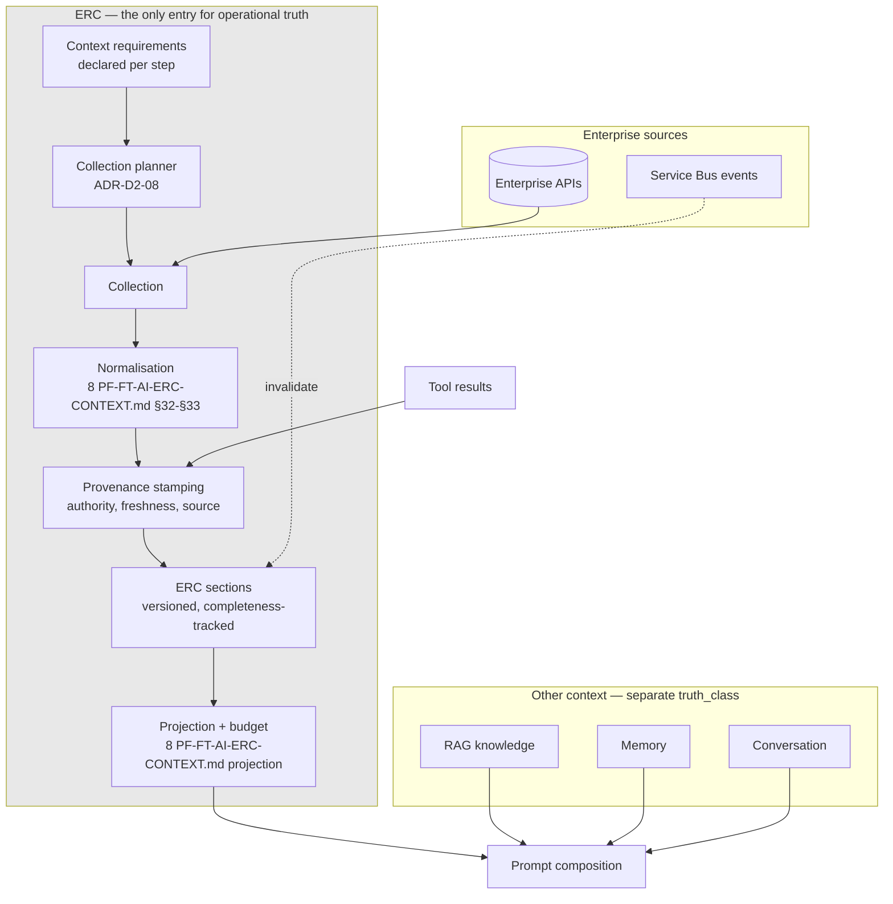

# ADR-D2-12 — ERC as the enterprise context boundary

## 1. Summary

ERC is the **single, exclusive** path by which enterprise operational data reaches the model. It
is defined as much by what it is not — not the enterprise database, not conversation memory, not
cache, not RAG — as by what it is. Making it exclusive rather than merely primary is what turns
the authoritative-truth precedence chain and 2. PF-FT-AI-ARCHITECTURE-DETAILED.md §3.5's "context before reasoning" from
principles into properties.

## 2. Context and Problem Statement

8 PF-FT-AI-ERC-CONTEXT.md is the platform's longest specification document, and its first seven sections are
unusually emphatic. §2 gives the core principle; §3 defines what ERC means; then §4, §5, §6 and
§7 each say what ERC is *not*: not the enterprise database, not conversation memory, not cache,
not RAG. Four consecutive sections of negative definition is a strong signal that the author
expected these confusions to arise.

They arise because each is a plausible design. ERC holds enterprise data, so it looks like a
cache. It persists across a conversation, so it looks like memory. It is retrieved and assembled
into a prompt, so it looks like RAG. It mirrors enterprise records, so it looks like a read model
of the database. Each resemblance invites a shortcut, and each shortcut breaks something specific.

1 PF-FT-AI-ARCHITECTURE.md §14–§15 and 2. PF-FT-AI-ARCHITECTURE-DETAILED.md §14–§15 give ERC architecture and processing pipeline. 2. PF-FT-AI-ARCHITECTURE-DETAILED.md §3.5 states
"context before reasoning": the SLM should reason over relevant, authoritative and bounded
context rather than receiving uncontrolled enterprise datasets.

What none of them states is whether ERC is the **only** path for enterprise operational data into
a prompt, or merely the **primary** one. 8 PF-FT-AI-ERC-CONTEXT.md §2 says ERC "is the primary operational context
mechanism," and "primary" leaves room for exceptions.

That ambiguity is the decision this ADR must settle, because everything downstream depends on it:

- **Precedence** (ADR-D1-03) ranks facts by authority, and authority is stamped where facts enter
  context. A second entry path that does not stamp provenance produces unrankable facts.
- **Freshness** (ADR-D1-03 §7.3) invalidates stale facts. A tool result injected directly into a
  prompt has no freshness policy.
- **Context budget** (8 PF-FT-AI-ERC-CONTEXT.md's projection stage) bounds what reaches the model. A bypass path is
  unbudgeted.
- **Minimisation** — a bypass path fetches whatever the caller wants rather than what the workflow
  declared.

The practical temptation is concrete. An agent calls `submit_affiliation` and gets back an
application status. The obvious next step is to put that status straight into the prompt. It is
one line, it is enterprise-sourced, and it is fresher than ERC. Whether that is permitted is
exactly the question.

## 3. Decision Drivers

### 3.1 Functional drivers

| ID | Driver | Source |
|---|---|---|
| DR-F-01 | ERC aggregates multiple enterprise APIs into structured context | 1 PF-FT-AI-ARCHITECTURE.md §39 criterion 5; 8 PF-FT-AI-ERC-CONTEXT.md §30 |
| DR-F-02 | ERC is not the enterprise database, memory, cache or RAG | 8 PF-FT-AI-ERC-CONTEXT.md §4–§7 |
| DR-F-03 | Context requirements must be identified before collection | 8 PF-FT-AI-ERC-CONTEXT.md §22–§23 |
| DR-F-04 | Every fact must carry provenance and authority | 8 PF-FT-AI-ERC-CONTEXT.md §15–§16, §19; ADR-D1-03 |
| DR-F-05 | Context must be bounded, not an uncontrolled dataset | 2. PF-FT-AI-ARCHITECTURE-DETAILED.md §3.5; 8 PF-FT-AI-ERC-CONTEXT.md §8 |
| DR-F-06 | ERC has identity, version and lifecycle | 8 PF-FT-AI-ERC-CONTEXT.md §9–§13 |

### 3.2 Non-functional drivers

| ID | Driver | Target | Source |
|---|---|---|---|
| DR-N-01 | Context assembly must fit the turn latency budget | Within ADR-D5-18's allocation | ADR-D5-18 |
| DR-N-02 | Context must fit the model's budget | Within the projection budget | 8 PF-FT-AI-ERC-CONTEXT.md projection |
| DR-N-03 | Only declared context may be collected | 0 undeclared collection | UK GDPR Art. 5(1)(c) |

### 3.3 Constraints

| ID | Constraint | Type | Source |
|---|---|---|---|
| DR-C-01 | No direct database access | Platform | ADR-D1-01 §7.3 |
| DR-C-02 | RAG is knowledge, never operational truth | Platform | ADR-D1-03 §7.2; 8 PF-FT-AI-ERC-CONTEXT.md §7 |
| DR-C-03 | Precedence is computed from fact-level authority | Platform | ADR-D1-03 §8.1 |
| DR-C-04 | Graph state references ERC rather than copying it | Platform | ADR-D2-07 §7.2; 8 PF-FT-AI-ERC-CONTEXT.md §40 |

### 3.4 Assumptions

| ID | Assumption | If false | Validation |
|---|---|---|---|
| DR-A-01 | All enterprise operational context a workflow needs can be expressed as declared requirements | Some context is discovered mid-reasoning and cannot be pre-declared | Phase 5 design against affiliation |
| DR-A-02 | Routing tool results through ERC does not add unacceptable latency | The exclusivity rule costs too much and needs relaxing | QM-01 |
| DR-A-03 | ERC's section model accommodates every enterprise entity shape | Some data does not fit and tempts a bypass | ADR-D4-02 schema design |

## 4. Evaluation Criteria and Weights

| ID | Criterion | Weight | Rationale | Measurement |
|---|---|---|---|---|
| EC-01 | Completeness of provenance coverage | 30 | An unranked fact breaks ADR-D1-03 and, through it, ADR-D1-02's invariant I-1 | Can a fact reach the model without provenance? |
| EC-02 | Enforcement of freshness and budget | 25 | Both are properties of the entry path; a bypass has neither | Is every fact subject to freshness and budget? |
| EC-03 | Data minimisation | 20 | Only declared requirements should be collected | Can more be fetched than declared? |
| EC-04 | Latency | 15 | Exclusivity may cost a round trip through ERC | Milliseconds added versus direct injection |
| EC-05 | Developer ergonomics | 10 | A rule that is painful gets circumvented | Effort to use enterprise data in a prompt |
| | **Total** | **100** | | |

Scoring scale: **1** unacceptable · **2** poor · **3** adequate · **4** good · **5** excellent.

## 5. Alternatives Considered

### 5.1 Option A — ERC as the primary path, with direct injection permitted

**Description.** ERC handles bulk context assembly. Agents may inject tool results and small
enterprise reads directly into the prompt where convenient.

**Strengths.**
- Lowest latency for freshly-fetched data — no round trip through ERC (EC-04).
- Natural to write: call a tool, use the result (EC-05).
- Matches a literal reading of 8 PF-FT-AI-ERC-CONTEXT.md §2's "primary".
- No ERC update needed for transient values.

**Weaknesses.**
- Directly injected facts carry no provenance, so ADR-D1-03 cannot rank them and ADR-D1-02's I-1
  cannot verify them (EC-01 fails).
- No freshness policy and no budget participation (EC-02).
- Collection is whatever the agent asks for, not what the workflow declared (EC-03).
- The bypass will become the common path, because it is easier — and the platform's guarantees
  would then apply to a shrinking fraction of its context.

**Cost / effort.** Lowest, and it hollows out the guarantees.

### 5.2 Option B — ERC as the exclusive path for enterprise operational data

**Description.** No enterprise operational data reaches a prompt except through ERC. Tool results
update ERC and are read back as ERC sections. Context requirements are declared per workflow step.

**Strengths.**
- Every enterprise fact carries provenance, so precedence is always computable (EC-01).
- Every fact is subject to freshness policy and context budget (EC-02).
- Collection is bounded by declared requirements (EC-03).
- One path means one place to audit, one place to enforce, one place to instrument.
- Implements 8 PF-FT-AI-ERC-CONTEXT.md §4–§7's negative definitions as a structural property rather than a caution.

**Weaknesses.**
- A tool result must be written to ERC and read back, which is indirection and some latency
  (EC-04).
- Requires context requirements to be declarable in advance (DR-A-01).
- Less natural to write than using a tool result directly (EC-05).
- ERC's section model must accommodate every shape of enterprise data (DR-A-03).

**Cost / effort.** Moderate.

### 5.3 Option C — Two-tier: ERC for collected context, a separate channel for tool results

**Description.** ERC handles pre-reasoning context collection. Tool results flow through a
distinct, lighter channel with its own provenance handling.

**Strengths.**
- Recognises a genuine difference: collected context is fetched before reasoning, tool results
  arrive during it.
- Lower latency for tool results (EC-04).
- ERC stays focused on bulk assembly.

**Weaknesses.**
- Two provenance implementations, two freshness models, two budget accountings — the divergence
  problem ADR-D2-03 rejected for runtime paths, reappearing for context.
- The precedence chain would need to rank facts from two systems consistently, which requires
  them to agree on authority semantics, at which point they are one system with extra steps.
- 8 PF-FT-AI-ERC-CONTEXT.md §60–§61's ERC update and patch model already covers mid-reasoning updates, so the second
  channel duplicates existing capability.

**Cost / effort.** Moderate, with structural duplication.

### 5.4 Option D — ERC as a read-through cache over enterprise APIs

**Description.** ERC becomes a caching layer: agents request data by identifier, ERC serves from
cache or fetches, with no declared requirements.

**Strengths.**
- Very ergonomic — ask for what you need, when you need it (EC-05).
- Automatic caching reduces enterprise load.
- No requirement declarations to maintain.
- Adapts to context discovered mid-reasoning (DR-A-01 not needed).

**Weaknesses.**
- This is precisely what 8 PF-FT-AI-ERC-CONTEXT.md §6 says ERC is not. A cache is keyed by request; ERC is a
  structured, versioned, provenance-bearing projection with a lifecycle (8 PF-FT-AI-ERC-CONTEXT.md §9–§13).
- No declared requirements means no minimisation bound — an agent could fetch anything (EC-03
  fails).
- Cache authority is 3, below ERC's 4 (ADR-D1-03 §7.1); collapsing them would flatten the
  precedence chain.
- Loses ERC's identity, versioning and completeness tracking, which 8 PF-FT-AI-ERC-CONTEXT.md §51–§52 require.

**Cost / effort.** Low, and it discards ERC's defining properties.

## 6. Evaluation Method and Decision Matrix

**Method.** Weighted scoring against §4. EC-01 to EC-03 assessed by asking, for each option,
whether a fact could reach the model without provenance, without a freshness policy, or without
having been declared.

| Criterion | Weight | A: Primary + injection | B: Exclusive | C: Two-tier | D: Read-through cache |
|---|---|---|---|---|---|
| EC-01 Provenance coverage | 30 | 1 | 5 | 3 | 2 |
| EC-02 Freshness and budget | 25 | 1 | 5 | 3 | 2 |
| EC-03 Minimisation | 20 | 2 | 5 | 4 | 1 |
| EC-04 Latency | 15 | 5 | 3 | 4 | 5 |
| EC-05 Ergonomics | 10 | 5 | 3 | 4 | 5 |
| **Weighted total** | **100** | **210** | **450** | **340** | **230** |

- **Option B:** (30×5) + (25×5) + (20×5) + (15×3) + (10×3) = 150 + 125 + 100 + 45 + 30 = **450**

**Sensitivity.** B leads C by 110 points and loses on latency and ergonomics, together worth 25
points. B would still lead C if it scored 1 on both. A's 210 reflects that convenience alone
cannot carry a design whose purpose is guaranteeing properties. D is excluded by 8 PF-FT-AI-ERC-CONTEXT.md §6
directly — it is the confusion the specification took a whole section to forbid.

## 7. Decision

### 7.1 ERC is the exclusive path

> **No enterprise operational data reaches a prompt except as an ERC section.**

8 PF-FT-AI-ERC-CONTEXT.md §2's "primary" is read as "exclusive" for operational truth. The reasoning: the properties
ERC provides — provenance, authority, freshness, budget, completeness — are properties of the
*path*, not of the data. A fact that arrives by another route has none of them, and there is no
way to add them retrospectively because the information needed to stamp them (which API, at what
time, under what freshness policy) exists only at the point of collection.

The rule applies to **operational truth** only. Knowledge from RAG has its own path and its own
`truth_class` (ADR-D1-03 §7.2); conversation content and memory are separate state concepts.

### 7.2 Tool results enter through ERC

The specific case §2 raises. An agent calls `submit_affiliation` and receives an application
status:

1. The tool executor validates the response (ADR-D2-09 §8.2 step 7).
2. The result **updates ERC** via the patch model (8 PF-FT-AI-ERC-CONTEXT.md §61), stamped with provenance:
   `source_type: enterprise_api`, authority 5, collection timestamp, source operation.
3. The agent receives a `ToolResultReference` carrying status and identity (ADR-D2-07 §7.2).
4. Any subsequent prompt reads the value from ERC, where it carries full provenance.

The round trip is the cost of the guarantee. The value is genuinely fresher than the rest of ERC,
and the provenance records that — which is better than being fresher and unranked. 8 PF-FT-AI-ERC-CONTEXT.md §36
("ERC Update After Tool Execution", 4. PF-FT-AI-RUNTIME.md §36) already describes this flow; this decision makes
it mandatory rather than typical.

### 7.3 What ERC is not — with the consequence of each confusion

8 PF-FT-AI-ERC-CONTEXT.md §4–§7's four negative definitions, each with what breaks if ignored:

| ERC is not | Because | What breaks if confused |
|---|---|---|
| **The enterprise database** (§4) | It is a projection assembled for a purpose, not a replica | Direct data access (DR-C-01); the platform becomes a second system of record |
| **Conversation memory** (§5) | It holds enterprise state, not what was said | Conversation content would acquire enterprise authority; a fact stated three turns ago would rank as operational truth |
| **Cache** (§6) | It has identity, version, sections, completeness and a lifecycle; a cache has keys and TTLs | Authority 4 and authority 3 collapse, flattening the precedence chain |
| **RAG** (§7) | It carries operational truth; RAG carries knowledge | RAG content could answer an operational question, which 2. PF-FT-AI-ARCHITECTURE-DETAILED.md §3.6 forbids |

The third is subtlest and the most likely in practice. ERC and cache both hold enterprise-sourced
data with an expiry. They differ in that ERC is a *structured projection with provenance and
completeness tracking*, and the cache is a *keyed store of previously-retrieved values*. ADR-D1-03
ranks them differently precisely because a cached value has weaker currency guarantees.

### 7.4 Context requirements are declared before collection

Per 8 PF-FT-AI-ERC-CONTEXT.md §22–§23, each workflow step declares what context it needs — which sections, which
fields, mandatory or optional (ADR-D2-08 §7.4). Collection satisfies the declaration and nothing
more.

Two consequences:

- **Minimisation is structural.** An agent cannot fetch data the step did not declare, so
  over-collection is a configuration error caught at review rather than a runtime behaviour.
- **Collection is plannable.** ADR-D2-08's execution planner needs the full requirement set up
  front to build a dependency graph. Requirements discovered mid-reasoning would force sequential
  collection.

DR-A-01 assumes requirements are declarable. Where reasoning genuinely reveals a need for context
not declared, the step transitions to a new node with its own declared requirements — the
requirement is added to the workflow definition, not fetched ad hoc.

### 7.5 ERC is per conversation, not per turn

8 PF-FT-AI-ERC-CONTEXT.md §9–§13 give ERC identity, version and lifecycle. ERC is scoped to a workflow instance within
a conversation and persists across turns, updated by patch (8 PF-FT-AI-ERC-CONTEXT.md §61) and invalidated by
freshness policy or event (8 PF-FT-AI-ERC-CONTEXT.md §62–§64).

This is what makes ERC distinct from per-turn context assembly and is why it can be *referenced*
by suspended workflow state (ADR-D2-10 §7.1) rather than copied. It is also why freshness policy
matters: a long-lived ERC accumulates staleness that per-turn assembly would not.

**Status rationale.** Accepted. Tier 1 under ADR-D0-03 §7.1 — ERC is a named 2. PF-FT-AI-ARCHITECTURE-DETAILED.md §52 category —
ratified by the external ADF/ADR governance forum.

## 8. Architecture Detail

### 8.1 The single path

There is no arrow from `API` or `TOOL` directly to `PR`. That absence is the decision, and AC-01
asserts it.

### 8.2 The affiliation pre-check as ERC sections

The Phase 1 checks become declared requirements resolving to ERC sections:

| Section | Source operations | Freshness | Mandatory |
|---|---|---|---|
| `club` | `enterprise.club.get` | Long | Yes |
| `club_officials` | `enterprise.club.officials.list` | Medium | Yes |
| `teams` | `enterprise.team.list` | Medium | Yes |
| `team_officials` | `enterprise.team.officials.list` (batched by 20) | Medium | Yes |
| `official_compliance` | `enterprise.compliance.get` (batched by 20) | **Short** | Yes |
| `grounds`, `league_memberships` | per-team operations | Medium | Yes |
| `debt` | `enterprise.finance.debt.get` | **Short** | Yes |
| `insurance` | `enterprise.insurance.get` | Medium | Yes |

`official_compliance` and `debt` carry short freshness policies deliberately. A DBS clearance
completing, or a debt being paid, changes the affiliation outcome, and a stale answer on either
would tell a club it is blocked when it is not — or, worse for safeguarding, that it is clear when
it is not.

### 8.3 Boundary cases

| Case | Handling |
|---|---|
| A tool returns a value used only for control flow, never shown | Still enters ERC. The agent branches on the `ToolResultReference` status without the value reaching a prompt, but if it *ever* reaches a prompt it must be an ERC fact. |
| An enterprise event carries a status field | Event is a notification (ADR-D2-03 §7.4); the section is invalidated and refreshed. The payload value never becomes an ERC fact. |
| A value derived from two ERC sections | Carries the weakest input's authority (ADR-D1-03 §7.4) and is recorded as derived. |
| Data too large for a section | Batched (ADR-D4-04) and aggregated; size is a collection concern, not grounds for a bypass. |
| An identifier the agent already holds from workflow state | Not enterprise operational data — it is workflow state. Identifiers may be used freely for control flow; their *associated data* comes from ERC. |

The last row is the practical distinction developers need: knowing an application ID is workflow
state; knowing that application's status is enterprise operational truth.

## 9. Consequences

### 9.1 Positive

- Every enterprise fact reaching the model carries provenance, so ADR-D1-03's precedence and
  ADR-D1-02's I-1 are always computable.
- Freshness policy applies to every operational fact, including those from tool results.
- Context budget accounts for everything, so nothing escapes the model's context limits.
- Collection is bounded by declared requirements, making minimisation structural.
- One entry path means one place to audit, instrument and secure.

### 9.2 Negative

- Tool results take a round trip through ERC rather than being used directly, which is
  indirection and some latency.
- Context requirements must be declared in advance, constraining how workflow steps are written.
- ERC's section model must accommodate every enterprise data shape, or the pressure to bypass
  returns.
- Less ergonomic than direct use; the rule needs enforcing rather than merely stating.

### 9.3 Neutral

- 8 PF-FT-AI-ERC-CONTEXT.md §2's "primary" is read as exclusive, which is an interpretation the specification permits
  but does not compel.
- ERC persists per workflow instance rather than per turn.

### 9.4 Trade-offs explicitly accepted

| Given up | In exchange for | Accepted by |
|---|---|---|
| Direct use of tool results in prompts | Every operational fact carrying provenance and freshness | External ADF/ADR forum |
| Ad hoc context fetching | Collection bounded by declared requirements | Data Owner |
| Some latency and ergonomics | One auditable entry path for enterprise data | AI Solution Architect |

## 10. Golden-Rule and Precedence Conformance

| Constraint | Conformance |
|---|---|
| Enterprise decides; AI orchestrates | ERC is a read-only projection. Nothing in the ERC path writes to the enterprise; writes go through tools, and their results return through ERC as facts. |
| Authoritative-truth precedence | This decision is what makes the chain enforceable. Exclusivity guarantees every operational fact is stamped with authority at collection, so no unrankable fact can exist. |
| Four-state separation | ERC is the platform's projection of Enterprise Business State, explicitly distinct from conversation, session and workflow state — which is what 8 PF-FT-AI-ERC-CONTEXT.md §5's negative definition protects. |
| Versioned artefacts, never mutated in place | ERC sections are versioned (8 PF-FT-AI-ERC-CONTEXT.md §59) and updated by patch (8 PF-FT-AI-ERC-CONTEXT.md §61), not overwritten in place. |
| Adam persona governs how, never what | The persona shapes how an ERC fact is expressed; it cannot introduce a fact, because facts come only from ERC. |

## 11. Risks and Mitigations

| ID | Risk | Likelihood | Impact | Exposure | Mitigation | Owner | Residual |
|---|---|---|---|---|---|---|---|
| RSK-01 | An agent injects a tool result directly into a prompt | Medium | High | High | Prompt composition accepts only ERC references (AC-01); harness mediates all context (ADR-D2-09); QM-02 | AI Engineering Lead | Low |
| RSK-02 | ERC round trip breaches the latency budget (DR-A-02) | Medium | Medium | Medium | Patch updates are in-process; QM-01 measures; caching within ERC assembly | AI Engineering Lead | Medium |
| RSK-03 | Context genuinely undeclarable in advance (DR-A-01) | Medium | Medium | Medium | §7.4's node-transition approach; a genuinely dynamic need is a workflow design gap | AI Solution Architect | Medium |
| RSK-04 | ERC confused with cache, collapsing authority levels | Medium | High | High | §7.3's table; separate key namespaces (ADR-D4-12); distinct types | Data Owner | Low |
| RSK-05 | A data shape does not fit the section model, tempting bypass (DR-A-03) | Low | Medium | Low | ADR-D4-02 schema design; a shape that does not fit is a schema change, not a bypass | Data Owner | Low |
| RSK-06 | Stale ERC used because freshness policies are set too loosely | Medium | High | High | Short policies on compliance and debt (§8.2); ADR-D1-03 QM-03 | Data Owner | Medium |

## 12. Quantitative Targets and Measures

| ID | Measure | Target | Threshold (alert) | Source | Review cadence |
|---|---|---|---|---|---|
| QM-01 | Context assembly latency, p95 | Within ADR-D5-18 allocation | Above allocation | Traces | Weekly |
| QM-02 | Enterprise operational facts in prompts not sourced from ERC | 0 | ≥1 | Prompt composition audit | Daily |
| QM-03 | Context collected beyond declared requirements | 0 | ≥1 | Collection audit against declarations | Daily |
| QM-04 | ERC sections used past their freshness policy | 0 | ≥1 | ADR-D1-03 QM-03 | Daily |
| QM-05 | Tool results not written to ERC before use in a prompt | 0 | ≥1 | Tool-to-ERC flow audit | Daily |
| QM-06 | ERC section completeness on assembly | ≥98% for mandatory sections | <95% | Completeness tracking (8 PF-FT-AI-ERC-CONTEXT.md §51) | Weekly |

## 13. Security, Privacy and Compliance Impact

| Dimension | Impact |
|---|---|
| Attack surface change | One entry path for enterprise data means one place to apply access scoping (ADR-D1-07's archetype), one place to audit, and no secondary route an injection could exploit to pull unscoped data. |
| Data classification touched | Personal and special-category — officials' DBS, suspension and safeguarding status flow through ERC. |
| Personal data / PII | Declared requirements bound what is collected, so minimisation is enforced at collection rather than filtered at output. Archetype scoping (ADR-D1-07 §7.2) applies here. |
| Children's data and safeguarding | The `official_compliance` section in §8.2 carries DBS and suspension status for youth-team officials, with a deliberately short freshness policy. Exclusivity means this data has exactly one route into a prompt, so the safeguarding data path is auditable in one place — and a stale clearance can never be presented as current. |
| UK GDPR lawful basis and rights impact | Supports minimisation (Art. 5(1)(c)) through declared requirements and accuracy (Art. 5(1)(d)) through freshness policy. Single path simplifies records of processing. |
| Audit and evidential requirements | ERC identity, version and provenance give a complete account of what the platform knew, from which source, at what time — 20.PF-FT-AI-GOVERNANCE.md §60's data lineage requirement satisfied structurally. |
| Standards touched | ISO/IEC 27001 A.8.3 (information access restriction), A.8.12 (data leakage prevention); ISO/IEC 42001 (data governance); NIST AI RMF MAP 2.3, MEASURE 2.8; UK GDPR Art. 5(1)(c), 5(1)(d), 30. |

## 14. Implementation Impact

| Aspect | Detail |
|---|---|
| Build phases | 5 (ERC) |
| Repository paths | `src/pf_ft_ai/context/erc/`, `collection/`, `normalization/`, `projection/` |
| Configuration | Context requirements per workflow step in `config/base/workflows.yaml`; freshness policies in `config/base/erc.yaml` |
| Contracts / schemas | ERC schema, section models, provenance fields, context requirement model |
| Migration | None |
| Dependencies on other ADRs | ADR-D1-03 (provenance and precedence), ADR-D2-08 (collection planning), ADR-D4-02 (schema) |
| Effort estimate | Large — ERC is the largest single capability in Phase 5 |

## 15. Validation and Verification

| ID | Acceptance criterion | Verification method |
|---|---|---|
| AC-01 | Prompt composition accepts only ERC references for operational facts | Type-level test; composition rejects raw values; QM-02 |
| AC-02 | A tool result is written to ERC with provenance before any prompt use | Tool-to-ERC flow test; QM-05 |
| AC-03 | Collection fetches only declared requirements | Collection audit against workflow declarations; QM-03 |
| AC-04 | Every ERC fact carries source, authority and collection time | Provenance completeness test; ADR-D1-03 AC-02 |
| AC-05 | `official_compliance` and `debt` sections carry short freshness policies | Configuration audit |
| AC-06 | An ERC section past its freshness policy is refreshed, not used | ADR-D1-03 AC-03; QM-04 |
| AC-07 | ERC is distinguishable from cache by type and namespace | Type and key-namespace audit |

## 16. Operational Impact

| Aspect | Detail |
|---|---|
| Monitoring | Assembly latency, section completeness, freshness violations, collection volume by section |
| Alerting | QM-02, QM-03, QM-04 and QM-05 on any occurrence |
| Runbook | `docs/runbooks/erc-batch-recovery.md`, `docs/runbooks/enterprise-api.md` |
| Failure mode and degradation | A mandatory section that cannot be collected blocks the step with a stated reason (ADR-D2-08 §7.4). The platform does not substitute cached or remembered values — that would breach the precedence chain. |
| Rollback | Freshness policies and requirements are configuration |
| Support model impact | ERC version and provenance in traces answer "what did it know, and when?" |

## 17. Cost Impact

| Cost element | One-off | Recurring | Basis |
|---|---|---|---|
| ERC subsystem | Phase 5, large | — | `DEVELOPMENT-GUIDE.md` §4 |
| Enterprise call volume | — | Per declared requirement set, bounded | Freshness policies control refresh frequency |
| Tool-result round trip | — | In-process patch, negligible | §7.2 |
| Avoided cost | — | Ongoing | A second context path would need its own provenance, freshness, budget and audit implementations |

## 18. Revisit Triggers and Causal Analysis Hooks

| ID | Trigger | Detected by | Action on trigger |
|---|---|---|---|
| RT-01 | QM-02 records an operational fact in a prompt not sourced from ERC | Daily audit | Governance incident; a bypass exists |
| RT-02 | QM-01 shows assembly exceeding its latency allocation (DR-A-02) | Weekly review | Optimise within ERC — parallel collection, caching of collection results — never by permitting a bypass |
| RT-03 | A workflow genuinely cannot declare its requirements (DR-A-01) | Phase 5 or agent onboarding | Redesign the step; a dynamic need is a workflow structure problem |
| RT-04 | QM-06 shows mandatory section completeness below 95% | Weekly review | Enterprise API reliability or requirement misconfiguration; distinguish before acting |
| RT-05 | 8 PF-FT-AI-ERC-CONTEXT.md §2's "primary" is clarified by the enterprise as permitting exceptions | Change notice | Re-evaluate §7.1; the exclusivity reading is the strong one and would need explicit relaxation |
| RT-06 | A data shape repeatedly does not fit the section model (DR-A-03) | Schema review | Extend the schema (ADR-D4-02); do not permit a bypass |

**Scheduled review:** 2027-08-21.

## 19. Traceability

| Dimension | Reference |
|---|---|
| Workshop sheet | WS-09 Enterprise Context Architecture |
| Specification sections | 8 PF-FT-AI-ERC-CONTEXT.md §2 (Core Principle), §3 (What ERC Means), §4 (Not the Enterprise Database), §5 (Not Conversation Memory), §6 (Not Cache), §7 (Not RAG), §8 (ERC Scope), §9–§13 (Lifecycle, Status, Identity, Version, Schema Version), §15–§16 (Provenance), §19 (Authority Levels), §20–§21 (Structure, Dynamic Sections), §22–§23 (Context Requirements), §30 (Construction Pipeline), §32–§33 (Normalisation, Transformation), §51–§52 (Completeness), §59–§64 (Versioning, Update, Patch, Invalidation, Refresh); 1 PF-FT-AI-ARCHITECTURE.md §14–§15, §39 criterion 5; 2. PF-FT-AI-ARCHITECTURE-DETAILED.md §3.5 (Context Before Reasoning), §3.6, §14–§15; 4. PF-FT-AI-RUNTIME.md §36 (ERC Update After Tool Execution) |
| Requirement IDs | `FR-A39-05`, `NFR-A38-SEC`, `NFR-A38-PERF` |
| Build phases | 5 |
| Code paths | `src/pf_ft_ai/context/` |
| Configuration | `config/base/erc.yaml`, `config/base/workflows.yaml`, `config/base/context-budget.yaml` |
| Tests | AC-01 to AC-07 |
| Upstream ADRs | ADR-D1-03, ADR-D2-08 |
| Downstream ADRs | ADR-D3-25, ADR-D4-02, ADR-D4-03, ADR-D4-05, ADR-D4-12 |

## 20. Change Log

| Version | Date | Author | Change |
|---|---|---|---|
| 1.0.0 | 2026-08-21 | AI Solution Architect | Initial decision recorded. 8 PF-FT-AI-ERC-CONTEXT.md §2's "primary" read as exclusive for operational truth, because provenance, freshness and budget are properties of the entry path and cannot be added retrospectively; tool results routed through ERC; 8 PF-FT-AI-ERC-CONTEXT.md §4–§7's four negative definitions given their concrete consequences. Tier 1 — ratified by the external ADF/ADR forum. |
