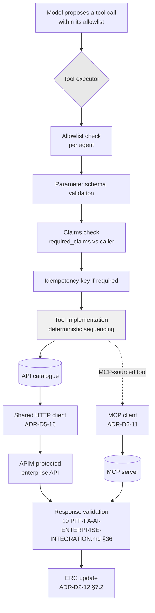

# ADR-D2-13 — Enterprise integration pattern: API catalogue, tool registry and selective MCP

## 1. Summary

Three layers with distinct jobs, per 10 PFF-FA-AI-ENTERPRISE-INTEGRATION.md §4: the **API catalogue** describes what enterprise
operations exist; the **tool registry** describes what the AI may do, in business terms; **MCP** is
adopted selectively where a capability is already exposed that way. The layers are not
interchangeable and the mapping between catalogue and registry is deliberately **not** one-to-one
— a tool is a business capability, not an API wrapper.

## 2. Context and Problem Statement

10 PFF-FA-AI-ENTERPRISE-INTEGRATION.md §4 distinguishes API, tool and MCP. §5–§7 cover the enterprise API and its catalogue.
§25–§33 cover tool abstraction, definition, contract, registry, registry responsibilities,
selection, selection boundary, executor and what the executor must not do. 1 PFF-FA-AI-ARCHITECTURE.md §16–§17 and 2. PFF-FA-AI-ARCHITECTURE-DETAILED.md
§18–§20 give the architecture.

The specification is clear that three concepts exist and less clear about why, which invites the
most common integration failure in agent platforms: **one tool per API endpoint**.

That design is seductive. It is mechanical to generate, it gives complete coverage, and it needs
no design work. It also produces exactly the wrong thing. 7 PFF-FA-AI-AGENTIC-ORCHESTRATION.md §7 rejects its agent-level
equivalent — "one agent = one API" — for the same reason it should be rejected here: an API is an
implementation of an enterprise service's contract, and a tool is a capability the AI is
permitted to exercise. Those are different vocabularies serving different purposes.

Concretely: `submit_affiliation` as a business capability may involve validating the application,
creating it, attaching products, and returning a status — several API calls. Exposing four tools
and expecting the model to sequence them correctly puts orchestration in the model, which 2. PFF-FA-AI-ARCHITECTURE-DETAILED.md
§3.3 forbids for critical controls and which ADR-D2-08 already assigned to a deterministic
planner. Conversely, a single enterprise endpoint that both reads and writes depending on a
parameter should be two tools, because the AI's permission to read is not permission to write.

There is a second question the specification leaves open. 1 PFF-FA-AI-ARCHITECTURE.md §17 and 10 PFF-FA-AI-ENTERPRISE-INTEGRATION.md §4 both include
MCP, and 2. PFF-FA-AI-ARCHITECTURE-DETAILED.md §20 gives an MCP architecture, but 1 PFF-FA-AI-ARCHITECTURE.md §2.2 describes it as *"selective MCP
integration"*. Selective on what basis is not stated — and MCP introduces a trust boundary that
direct API integration does not, since an MCP server describes its own tools and returns its own
results.

Third: 10 PFF-FA-AI-ENTERPRISE-INTEGRATION.md §33 lists what the tool executor must not do, which implies the boundary between
"tool selection" and "tool execution" carries security weight. Where that boundary sits determines
whether a model can influence execution.

## 3. Decision Drivers

### 3.1 Functional drivers

| ID | Driver | Source |
|---|---|---|
| DR-F-01 | A controlled API catalogue must exist | 10 PFF-FA-AI-ENTERPRISE-INTEGRATION.md §7–§10 |
| DR-F-02 | Tools abstract enterprise operations for AI use | 10 PFF-FA-AI-ENTERPRISE-INTEGRATION.md §25–§27 |
| DR-F-03 | A tool registry with defined responsibilities | 10 PFF-FA-AI-ENTERPRISE-INTEGRATION.md §28–§29 |
| DR-F-04 | Tool selection has a boundary distinct from execution | 10 PFF-FA-AI-ENTERPRISE-INTEGRATION.md §30–§31, §33 |
| DR-F-05 | MCP is adopted selectively | 1 PFF-FA-AI-ARCHITECTURE.md §2.2, §17 |
| DR-F-06 | Tools safely invoke enterprise APIs | 1 PFF-FA-AI-ARCHITECTURE.md §39 criterion 7 |

### 3.2 Non-functional drivers

| ID | Driver | Target | Source |
|---|---|---|---|
| DR-N-01 | The tool surface must stay small enough for reliable model selection | Tools per agent bounded | ADR-D3-04 |
| DR-N-02 | Adding an enterprise integration must not require agent changes | Catalogue and registry are configuration | 2. PFF-FA-AI-ARCHITECTURE-DETAILED.md §49 |
| DR-N-03 | Every enterprise call must be attributable to a registered tool | 100% | ADR-D1-01 AC-03 |

### 3.3 Constraints

| ID | Constraint | Type | Source |
|---|---|---|---|
| DR-C-01 | The SLM never receives unrestricted API access | Platform | 2. PFF-FA-AI-ARCHITECTURE-DETAILED.md §3.4; ADR-D1-01 §7.3 |
| DR-C-02 | Integration is only through APIM-protected APIs, tools, MCP, events and portal links | Platform | 2. PFF-FA-AI-ARCHITECTURE-DETAILED.md §5.3 |
| DR-C-03 | The tool executor must not perform the actions 10 PFF-FA-AI-ENTERPRISE-INTEGRATION.md §33 forbids | Platform | 10 PFF-FA-AI-ENTERPRISE-INTEGRATION.md §33 |
| DR-C-04 | Enterprise APIs remain authoritative | Platform | 10 PFF-FA-AI-ENTERPRISE-INTEGRATION.md §6 |

### 3.4 Assumptions

| ID | Assumption | If false | Validation |
|---|---|---|---|
| DR-A-01 | Business capabilities map cleanly onto sequences of enterprise API calls | Some capability needs orchestration the platform should not own | ADR-D2-14 integration mapping |
| DR-A-02 | The enterprise exposes, or will expose, MCP servers worth consuming | MCP remains unused; the architecture still accommodates it | Enterprise roadmap |
| DR-A-03 | A bounded tool surface is achievable per agent | Model selection accuracy degrades with tool count | ADR-D3-04; QM-04 |

## 4. Evaluation Criteria and Weights

| ID | Criterion | Weight | Rationale | Measurement |
|---|---|---|---|---|
| EC-01 | Containment of model authority | 30 | 2. PFF-FA-AI-ARCHITECTURE-DETAILED.md §3.4 and DR-C-01 make unrestricted access categorical; the tool surface *is* the model's reach | Can the model reach an operation it should not? |
| EC-02 | Reliability of tool selection | 25 | A model choosing among many similar tools selects badly, and a wrong tool is a wrong enterprise operation | Selection accuracy against the golden set |
| EC-03 | Orchestration kept out of the model | 20 | 2. PFF-FA-AI-ARCHITECTURE-DETAILED.md §3.3; sequencing is a deterministic control | Does the model sequence multi-call operations? |
| EC-04 | Maintainability as integrations grow | 15 | The catalogue will grow with each workflow | Effort per new integration |
| EC-05 | Coverage of enterprise capability | 10 | A tool surface too narrow blocks workflows | Workflows blocked by missing tools |
| | **Total** | **100** | | |

Scoring scale: **1** unacceptable · **2** poor · **3** adequate · **4** good · **5** excellent.

## 5. Alternatives Considered

### 5.1 Option A — One tool per API endpoint

**Description.** Every catalogue entry becomes a tool, generated mechanically.

**Strengths.**
- Complete coverage by construction (EC-05).
- No design work per tool; generation from the catalogue.
- Trivially maintainable — the registry is derived, not authored (EC-04).
- Transparent mapping between what the model sees and what exists.

**Weaknesses.**
- The tool surface becomes the entire API surface, so the model's reach is the enterprise's reach
  (EC-01 fails). 2. PFF-FA-AI-ARCHITECTURE-DETAILED.md §3.4 forbids exactly this.
- Selection accuracy collapses as tool count grows; twenty similar-sounding endpoints produce
  confident wrong choices (EC-02).
- Multi-call business operations must be sequenced by the model, putting orchestration where 2. PFF-FA-AI-ARCHITECTURE-DETAILED.md
  §3.3 forbids it (EC-03 fails).
- Read and write on one endpoint become one tool, so permission granularity is lost.

**Cost / effort.** Lowest, with two categorical failures.

### 5.2 Option B — Tools as business capabilities over a catalogue, with selective MCP

**Description.** The catalogue describes every enterprise operation. Tools are authored as
business capabilities, each mapping to one or more catalogue entries with deterministic
sequencing in the tool implementation. Per-agent allowlists bound what each agent may use. MCP is
adopted where the enterprise already exposes a capability that way, subject to a trust assessment.

**Strengths.**
- The model sees business capabilities, not endpoints, so its reach is deliberately curated
  (EC-01).
- A small, semantically distinct tool surface makes selection reliable (EC-02).
- Multi-call sequencing lives in the tool implementation, deterministically (EC-03).
- Catalogue and registry evolve independently; a new API does not automatically become a tool.
- MCP is a considered addition rather than a default.

**Weaknesses.**
- Tools must be authored, which is design work per capability (EC-04).
- A capability the workflow needs but no tool exposes blocks the workflow until one is written
  (EC-05).
- Catalogue-to-registry mapping must be maintained, and drift between them is possible.
- Requires judgement about what constitutes a business capability.

**Cost / effort.** Moderate.

### 5.3 Option C — Generated tools with a curated allowlist

**Description.** Tools generated one-per-endpoint as in Option A, but each agent's allowlist
exposes only a curated subset.

**Strengths.**
- Coverage is complete and generation is free (EC-04, EC-05).
- The allowlist bounds what any agent sees, addressing part of EC-01.
- Selection surface per agent is small.

**Weaknesses.**
- Multi-call operations still require model sequencing, since tools remain endpoint-shaped
  (EC-03 fails).
- The allowlist bounds *which* endpoints, not *what* they mean; a write endpoint on the list is
  a write permission with no business framing.
- Tool descriptions are generated from API documentation, which describes technical contracts,
  not business intent — so the model reasons about endpoints while the user talks about
  affiliation.
- The full generated registry exists and can be allowlisted onto by mistake.

**Cost / effort.** Low, and it solves only half the problem.

### 5.4 Option D — MCP-first: expose enterprise capability primarily through MCP

**Description.** Adopt MCP as the primary integration mechanism, with direct API integration as
the exception.

**Strengths.**
- Standard protocol with growing ecosystem support.
- Servers describe their own capabilities, so the registry could be discovered rather than
  authored.
- Decouples the platform from per-API integration work.
- Future-proof if the enterprise moves that way.

**Weaknesses.**
- Server-described tools mean the tool surface is defined outside the platform's control, which
  is a significant EC-01 weakening: a server could describe a tool the platform never intended to
  expose.
- MCP responses come from a server whose trust the platform must establish separately (19.PFF-FA-AI-SECURITY.md
  §61–§64); direct API integration inherits APIM's trust boundary.
- DR-A-02 is unvalidated — no evidence the enterprise exposes MCP servers today.
- Dynamic discovery conflicts with per-agent allowlists being versioned configuration.

**Cost / effort.** Moderate, on an unvalidated premise.

## 6. Evaluation Method and Decision Matrix

**Method.** Weighted scoring against §4. EC-01 tested by asking what the model could reach under
each option. EC-03 tested against `submit_affiliation`, which spans several enterprise calls.

| Criterion | Weight | A: Tool per endpoint | B: Capabilities + selective MCP | C: Generated + allowlist | D: MCP-first |
|---|---|---|---|---|---|
| EC-01 Authority containment | 30 | 1 | 5 | 3 | 2 |
| EC-02 Selection reliability | 25 | 1 | 5 | 4 | 3 |
| EC-03 Orchestration out of the model | 20 | 1 | 5 | 1 | 3 |
| EC-04 Maintainability | 15 | 5 | 3 | 4 | 3 |
| EC-05 Coverage | 10 | 5 | 3 | 5 | 3 |
| **Weighted total** | **100** | **185** | **455** | **310** | **273** |

- **Option B:** (30×5) + (25×5) + (20×5) + (15×3) + (10×3) = 150 + 125 + 100 + 45 + 30 = **455**

**Sensitivity.** B leads C by 145 points and wins the three highest-weighted criteria outright.
Its weaknesses are on maintainability and coverage, worth 25 points combined — B would still lead
C if it scored 1 on both. A is excluded by 2. PFF-FA-AI-ARCHITECTURE-DETAILED.md §3.4. D's premise (DR-A-02) is unvalidated, and
its EC-01 weakness is structural: a tool surface defined by an external server is not a curated
one.

## 7. Decision

### 7.1 Three layers, three jobs

| Layer | Answers | Audience | Vocabulary |
|---|---|---|---|
| **API catalogue** | What enterprise operations exist, who owns them, what they require and return, whether they are idempotent, retryable, parallelisable | Platform engineers and the execution planner | Technical: endpoints, methods, contracts |
| **Tool registry** | What the AI is permitted to do, expressed as business capabilities | The model, and the security review | Business: "submit an affiliation", "check club eligibility" |
| **MCP** | Capabilities the enterprise already exposes over MCP, adopted case by case | The model, through the same tool boundary | Whatever the server declares, after assessment |

The catalogue is the platform's map of the enterprise. The registry is the platform's statement of
what the AI may do. They are related but not the same, and conflating them is Option A.

### 7.2 A tool is a business capability, not an endpoint

The mapping between catalogue and registry is deliberately many-to-many:

| Relationship | Example | Why |
|---|---|---|
| **One tool, several APIs** | `submit_affiliation` → validate, create, attach products, return status | Sequencing is deterministic and belongs in the tool, not the model (2. PFF-FA-AI-ARCHITECTURE-DETAILED.md §3.3) |
| **Several tools, one API** | `get_club_summary` and `get_club_full` over one endpoint with different projections | Different capabilities with different data exposure warrant different permissions |
| **One tool, one API** | `get_club_debt` | Where the capability genuinely is the operation |
| **API with no tool** | Administrative or internal endpoints | Not everything the enterprise exposes is something the AI should do |

The last row is as important as the first. An API in the catalogue with no corresponding tool is a
normal and expected state — the catalogue documents what exists so the platform knows what it is
*not* using, which matters for review.

### 7.3 Tool authoring discipline

Because tools are authored rather than generated, they need a standard. A tool definition
(10 PFF-FA-AI-ENTERPRISE-INTEGRATION.md §26–§27) carries:

- **A business-intent name and description.** Written for a model reasoning about affiliation, not
  for an engineer reading an API spec. This is what makes selection reliable.
- **A typed request and response contract** (Pydantic), independent of the underlying API shapes.
- **An operation class** — read or write — which drives idempotency and retry (ADR-D2-11 §7.1) and
  which permissions attach to.
- **Its catalogue mappings**, with the sequence where more than one.
- **Required claims**, checked against the caller's entitlement before execution (ADR-D1-02 I-2).

Tool count per agent is bounded (DR-N-01). Where a tool surface grows past what the model selects
reliably, the answer is consolidation into higher-level capabilities, not a bigger prompt.

### 7.4 Selection versus execution — the boundary that carries security weight

10 PFF-FA-AI-ENTERPRISE-INTEGRATION.md §30–§31 separate tool selection from execution, and 10 PFF-FA-AI-ENTERPRISE-INTEGRATION.md §33 constrains the executor.
The division:

| Concern | Who | Constraint |
|---|---|---|
| **Which tool to call, with what business parameters** | The model, within its allowlist | A model output — never authoritative for anything but this choice |
| **Whether that tool may be called** | The executor, from the allowlist and claims | Deterministic; model output is not an input (ADR-D1-02 I-2) |
| **Whether the parameters are valid** | The executor, from the tool's schema | Deterministic; 10 PFF-FA-AI-ENTERPRISE-INTEGRATION.md §35 |
| **Which APIs to call and in what order** | The tool implementation | Deterministic; never the model |
| **How to authenticate** | The client, from configuration | Never from tool parameters |
| **What the result means** | The tool's response contract, validated | 10 PFF-FA-AI-ENTERPRISE-INTEGRATION.md §36 |

The model proposes; the executor disposes. 10 PFF-FA-AI-ENTERPRISE-INTEGRATION.md §33's prohibitions on the executor — which
include not bypassing validation and not constructing arbitrary requests — are what keep the
proposal from becoming an instruction.

### 7.5 MCP is selective, and the criterion is stated

1 PFF-FA-AI-ARCHITECTURE.md §2.2 says "selective MCP integration" without a criterion. It is stated here:

> MCP is adopted for a capability when the enterprise **already exposes it over MCP** and the
> server passes a trust assessment. MCP is never adopted as a way to reach a capability that a
> direct API already provides.

The reasoning: MCP's value is consuming something that already exists in that form. Where a
direct API exists, going through MCP adds a trust boundary and a hop for no gain. 19.PFF-FA-AI-SECURITY.md §61–§64
govern MCP server trust, tool security and response validation; ADR-D6-11 carries the assessment.

Two rules regardless of source:

- **MCP tools enter the same registry and the same allowlists.** A tool from an MCP server is not
  privileged over a native one, and it is subject to the same per-agent allowlisting.
- **MCP responses are validated like any other.** A server's self-description is a claim, not a
  contract; the platform validates responses against its own expectations (19.PFF-FA-AI-SECURITY.md §64).

At the time of this decision no enterprise MCP server is in use (DR-A-02 unvalidated). The
architecture accommodates one; nothing depends on it.

### 7.6 Every enterprise call is attributable

Per DR-N-03 and ADR-D1-01 AC-03, no outbound enterprise request originates outside a registered
tool. The shared HTTP client (ADR-D5-16) is reachable only from the tool executor and the ERC
collection path, both of which resolve from the catalogue. An agent has no HTTP client
(ADR-D2-09 §7.1).

**Status rationale.** Accepted. Tier 1 under ADR-D0-03 §7.1 — tool/MCP is a named 2. PFF-FA-AI-ARCHITECTURE-DETAILED.md §52
category — ratified by the external ADF/ADR governance forum, with the Security Owner
co-approving §7.4 and §7.5.

## 8. Architecture Detail

### 8.1 The three layers in the request path

The model's involvement ends at the first box. Everything after is deterministic.

### 8.2 `submit_affiliation` as a worked capability

| Layer | Content |
|---|---|
| **Tool** | `submit_affiliation` — "Submit a completed affiliation application for the club's selected teams." Write. Requires `affiliation.submit` claim. |
| **Request contract** | `application_id`, `team_ids`, `insurance_selections`, `product_selections` |
| **Catalogue mappings, in order** | `enterprise.affiliation.validate` → `enterprise.affiliation.submit` → `enterprise.affiliation.get` |
| **Response contract** | `status` (one of the six affiliation statuses), `application_id`, `invoice_reference` if any |
| **Execution** | Non-idempotent write; no retry; verification via `enterprise.affiliation.get_by_client_ref` (ADR-D2-11 §7.4) |

The model calls one tool. Three enterprise calls occur in a fixed order determined by the tool
implementation. Under Option A the model would have chosen and sequenced three tools, and a wrong
order would produce a submitted-but-unvalidated application.

### 8.3 Catalogue entries without tools

The catalogue documents enterprise operations the platform does *not* expose, and this is
deliberate rather than incomplete. Examples of the kind of thing that stays catalogued and
untooled:

- Administrative operations belonging to county staff working in the portal.
- Operations whose effects the AI should never trigger — deletion, forced state transitions.
- Operations superseded by a higher-level capability the platform does expose.

Recording them means a security review can see what the AI *could* have been given and was not,
which is stronger evidence than an absence.

## 9. Consequences

### 9.1 Positive

- The model's reach is a curated set of business capabilities rather than the enterprise API
  surface.
- Multi-call sequencing is deterministic, keeping orchestration out of the model per 2. PFF-FA-AI-ARCHITECTURE-DETAILED.md §3.3.
- A small, semantically distinct tool surface makes selection reliable.
- Read and write capabilities can carry different permissions even over one endpoint.
- MCP is accommodated without being depended on, and MCP tools get no privilege over native ones.
- The catalogue documents what the platform deliberately does not use.

### 9.2 Negative

- Tools are authored, so each capability is design work rather than generation.
- A workflow needing a capability with no tool is blocked until one is written and reviewed.
- Catalogue and registry must be kept in step; drift is possible and would be silent.
- Judgement is required about what constitutes a business capability, and reasonable people will
  disagree at the margins.

### 9.3 Neutral

- MCP is architecturally present and currently unused.
- The catalogue is larger than the registry, permanently.

### 9.4 Trade-offs explicitly accepted

| Given up | In exchange for | Accepted by |
|---|---|---|
| Automatic complete coverage | A tool surface that is a deliberate permission statement | Security Owner |
| Generation-free maintenance | Business-intent tool descriptions the model can select on reliably | AI Solution Architect |
| Speed of exposing a new capability | Each capability passing review before the model can reach it | External ADF/ADR forum |

## 10. Golden-Rule and Precedence Conformance

| Constraint | Conformance |
|---|---|
| Enterprise decides; AI orchestrates | Tools invoke enterprise operations and return their results; no tool implements a business rule. The enterprise decides; the tool asks. |
| Authoritative-truth precedence | Tool results enter ERC with `enterprise_api` provenance at authority 5 (ADR-D2-12 §7.2), never bypassing into a prompt. |
| Four-state separation | Tool results are projections of Enterprise Business State; the registry and catalogue are configuration, not state. |
| Versioned artefacts, never mutated in place | Catalogue and registry are versioned configuration (ADR-D5-06); a tool change is a release. |
| Adam persona governs how, never what | Tool descriptions are for model selection, not user-facing; the persona never sees or shapes them. |

## 11. Risks and Mitigations

| ID | Risk | Likelihood | Impact | Exposure | Mitigation | Owner | Residual |
|---|---|---|---|---|---|---|---|
| RSK-01 | Tools drift toward endpoint-shaped as integrations are added under pressure | Medium | High | High | §7.3's authoring discipline reviewed per tool; QM-03 tracks tools-to-APIs ratio | AI Solution Architect | Medium |
| RSK-02 | Tool surface grows past reliable selection (DR-A-03) | Medium | High | High | Per-agent bound; consolidation into higher-level capabilities; QM-04 | AI Engineering Lead | Medium |
| RSK-03 | Catalogue and registry drift out of step | Medium | Medium | Medium | Registry references catalogue entries by ID; a dangling reference fails the build; QM-05 | AI Engineering Lead | Low |
| RSK-04 | An MCP server describes a tool the platform did not intend to expose | Low | Very High | High | §7.5: MCP tools enter the registry and allowlists explicitly, never by discovery; ADR-D6-11 trust assessment | Security Owner | Low |
| RSK-05 | A workflow blocked because no tool exposes a needed capability | Medium | Medium | Medium | Tracked as an integration gap; ADR-D2-14; writing a tool is normal work, not an exception | AI Platform Owner | Low |
| RSK-06 | A tool implementation embeds a business rule while sequencing | Medium | High | High | Sequencing is call ordering only; branching on a business condition is a rule (ADR-D1-02 I-6); reviewed per tool | Security Owner | Medium |

RSK-06 is the subtle one: a tool that sequences three calls is fine; a tool that decides *whether*
to make the third call based on a business condition has implemented a rule.

## 12. Quantitative Targets and Measures

| ID | Measure | Target | Threshold (alert) | Source | Review cadence |
|---|---|---|---|---|---|
| QM-01 | Enterprise calls originating outside a registered tool or the ERC collection path | 0 | ≥1 | Outbound HTTP audit | Daily |
| QM-02 | Tool calls rejected by allowlist or claims check | Tracked | >3× baseline | Executor metrics | Weekly |
| QM-03 | Ratio of registered tools to catalogued APIs | <1 | ≥1 | Registry and catalogue audit | Quarterly |
| QM-04 | Tool selection accuracy on the golden set | ≥95% | <90% | Evaluation suite | Per release |
| QM-05 | Registry entries referencing non-existent catalogue entries | 0 | ≥1 | Build-time reference check | Per build |
| QM-06 | Tool implementations branching on a business condition | 0 | ≥1 | Code review; architecture-fitness check | Per release |

QM-03's target of below 1 is the direct test that tools are capabilities rather than wrappers. A
ratio at or above 1 means the registry has become a mirror of the catalogue, which is Option A.

## 13. Security, Privacy and Compliance Impact

| Dimension | Impact |
|---|---|
| Attack surface change | The tool registry *is* the AI's attack surface against the enterprise. Keeping it a curated set of business capabilities, rather than the full API surface, is the single largest reduction available. Per-agent allowlists narrow it further. |
| Data classification touched | Tool responses carry personal and special-category data into ERC. |
| Personal data / PII | Tool response contracts define exactly what is returned, so a tool cannot leak fields the capability does not need — a projection control the raw API would not provide. |
| Children's data and safeguarding | Compliance and safeguarding data is reached through specific read tools with their own required claims. No write tool exists that could alter a safeguarding record; that authority is enterprise-only and the catalogue documents those operations as deliberately untooled (§8.3). |
| UK GDPR lawful basis and rights impact | Response contracts implement minimisation at the integration boundary; required claims implement purpose limitation. |
| Audit and evidential requirements | Every enterprise interaction is a registered tool call, traced with tool identity, parameters (redacted per ADR-D7-04) and outcome — a complete and attributable record. |
| Standards touched | ISO/IEC 27001 A.5.15 (access control), A.5.19–A.5.22 (supplier relationships — MCP), A.8.3, A.8.28; ISO/IEC 42001; NIST AI RMF MANAGE 2.2, MEASURE 2.7; EU AI Act Art. 15. |

## 14. Implementation Impact

| Aspect | Detail |
|---|---|
| Build phases | 6 (enterprise integration) |
| Repository paths | `src/pff_fa_ai/integration/api/`, `tools/`, `mcp/`, `execution/`, `errors/` |
| Configuration | `config/enterprise/api-catalog/`, `config/enterprise/tool-registry/`; per-agent allowlists in `config/base/tools.yaml` |
| Contracts / schemas | Tool request/response contracts; catalogue entry schema; tool definition schema |
| Migration | None |
| Dependencies on other ADRs | ADR-D2-09 (executor within the harness), ADR-D2-15 (API contracts), ADR-D6-10 (tool security), ADR-D6-11 (MCP trust) |
| Effort estimate | Large — the integration layer in full |

## 15. Validation and Verification

| ID | Acceptance criterion | Verification method |
|---|---|---|
| AC-01 | No outbound enterprise request originates outside a registered tool or the ERC collection path | HTTP client usage audit; QM-01 |
| AC-02 | A tool call outside the agent's allowlist is rejected before dispatch | Executor test |
| AC-03 | `submit_affiliation` performs its three catalogue calls in fixed order without model involvement | Tool implementation test |
| AC-04 | Every registry entry resolves to existing catalogue entries | Build-time reference check; QM-05 |
| AC-05 | A tool response containing fields outside its contract is rejected | Response validation test |
| AC-06 | An MCP-sourced tool is subject to the same allowlist and validation as a native tool | MCP integration test |
| AC-07 | No tool implementation branches on a business condition | Code review; QM-06 |

## 16. Operational Impact

| Aspect | Detail |
|---|---|
| Monitoring | Tool call volume, latency and outcome by tool; allowlist rejections; selection accuracy |
| Alerting | QM-01 and QM-05 on any occurrence; QM-02 on anomalous rejection rates |
| Runbook | `docs/runbooks/enterprise-api.md`, `docs/runbooks/mcp.md` |
| Failure mode and degradation | A tool failure surfaces per ADR-D2-11's policy. A missing capability blocks the workflow with a stated reason rather than being improvised. |
| Rollback | Registry and allowlists are versioned configuration; a tool can be withdrawn without a deployment |
| Support model impact | Tool traces attribute every enterprise interaction, so integration incidents route by tool to their owning service |

## 17. Cost Impact

| Cost element | One-off | Recurring | Basis |
|---|---|---|---|
| Integration layer | Phase 6, large | — | `DEVELOPMENT-GUIDE.md` §4 |
| Tool authoring | — | ~0.5 day per capability, plus review | §7.3 |
| Catalogue maintenance | — | Per enterprise API change | ADR-D2-15 |
| MCP client | Deferred | — | Not built until an enterprise server exists (DR-A-02) |
| Avoided cost | — | Ongoing | Option A's generated registry would need per-tool security review anyway, at greater volume and lower value |

## 18. Revisit Triggers and Causal Analysis Hooks

| ID | Trigger | Detected by | Action on trigger |
|---|---|---|---|
| RT-01 | QM-03 shows the tool-to-API ratio reaching 1 | Quarterly review | The registry has become a catalogue mirror; consolidate into capabilities |
| RT-02 | QM-04 shows selection accuracy below 90% | Per release | Consolidate tools or sharpen descriptions; do not enlarge the prompt |
| RT-03 | QM-01 records a call outside the tool boundary | Daily | Governance incident; ADR-D1-01 AC-03 breached |
| RT-04 | The enterprise exposes an MCP server (DR-A-02) | Enterprise roadmap | Assess per ADR-D6-11; adopt only where no direct API exists |
| RT-05 | QM-06 finds a tool branching on a business condition | Release review | Remove the branch; the decision belongs to the enterprise |
| RT-06 | Workflows repeatedly blocked on missing tools (RSK-05) | Quarterly review | Tool authoring is under-resourced, or the capability model is too coarse |

**Scheduled review:** 2027-08-21.

## 19. Traceability

| Dimension | Reference |
|---|---|
| Workshop sheet | WS-10 Integration & 18-Microservice Matrix |
| Specification sections | 10 PFF-FA-AI-ENTERPRISE-INTEGRATION.md §2 (Core Principle), §4 (API vs Tool vs MCP), §5–§6 (Enterprise API, Authority), §7–§10 (API Catalog, Purpose, Metadata), §25–§27 (Tool Abstraction, Definition, Contract), §28–§29 (Tool Registry, Responsibilities), §30–§31 (Tool Selection, Selection Boundary), §32–§33 (Tool Executor, Must Not), §35–§36 (Input/Output Validation); 1 PFF-FA-AI-ARCHITECTURE.md §16–§17, §39 criterion 7, §2.2; 2. PFF-FA-AI-ARCHITECTURE-DETAILED.md §3.4 (Controlled Tool Access), §18–§20; 19.PFF-FA-AI-SECURITY.md §61–§64 (MCP Security) |
| Requirement IDs | `FR-A39-07`, `NFR-A38-SEC` |
| Build phases | 6 |
| Code paths | `src/pff_fa_ai/integration/` |
| Configuration | `config/enterprise/api-catalog/`, `config/enterprise/tool-registry/`, `config/base/tools.yaml` |
| Tests | AC-01 to AC-07 |
| Upstream ADRs | ADR-D1-01, ADR-D2-09 |
| Downstream ADRs | ADR-D2-14, ADR-D2-15, ADR-D3-04, ADR-D6-10, ADR-D6-11 |

## 20. Change Log

| Version | Date | Author | Change |
|---|---|---|---|
| 1.0.0 | 2026-08-21 | AI Solution Architect | Initial decision recorded. Tools defined as business capabilities with a deliberately many-to-many mapping to catalogue entries, so multi-call sequencing stays deterministic; MCP's "selective" criterion stated as adopt-only-where-already-exposed; catalogued-but-untooled operations recorded as deliberate evidence for security review. Tier 1 — ratified by the external ADF/ADR forum. |
