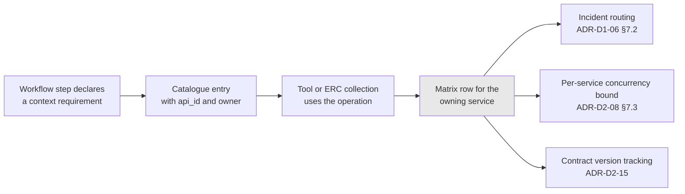

# ADR-D2-14 — Enterprise integration matrix, service ownership and coupling rules

## 1. Summary

The integration matrix is maintained as a **derived artefact** — built up from the enterprise
services the platform actually integrates with, workflow by workflow — rather than asserted
up front from a service count. It records per service: owner, operations used, coupling class,
and known gaps. Three coupling rules bound how the platform may depend on any enterprise service.

## 2. Context and Problem Statement

The workshop pack names this sheet *"Integration & 18-Microservice Matrix"*. That number does not
appear in the specification set, and recording where it comes from matters more than reproducing
it.

10 PFF-FA-AI-ENTERPRISE-INTEGRATION.md §7 gives a recommended API catalogue structure with six example files — `clubs`,
`affiliations`, `teams`, `officials`, `courses`, `compliance` — and adds *"the exact repository
structure will be finalized with the overall platform structure."* 10 PFF-FA-AI-ENTERPRISE-INTEGRATION.md §13 covers API
ownership and §14 API lifecycle. 3. PFF-FA-AI-RESPONSIBILITY-MATRIX.md §4 lists capabilities, not services. The affiliation flow
names several systems by their function: PAAS/Payment Service, SmartPayFuse, Xero, WGS, Bluefin.

So the specification set describes **six example API domains** and the affiliation flow implies
**several more integration points**, none of which totals eighteen. The eighteen is from the
workshop pack — presumably from the enterprise's own service inventory, which the platform
programme has not been given.

This creates a specific risk that is worth naming plainly: an integration matrix that asserts
eighteen named microservices without evidence would be **fabricated architecture**. It would look
authoritative, it would be used for planning, and it would be wrong in ways nobody could detect
until integration work began. That is worse than an admittedly incomplete matrix.

The genuine architectural questions are separate from the count, and they are:

- **How does the platform depend on an enterprise service?** 3. PFF-FA-AI-RESPONSIBILITY-MATRIX.md §4 marks Enterprise API
  Integration as shared — enterprise owns the APIs, the AI owns the integration abstraction
  (ADR-D1-06 §7.2). What that permits and forbids in practice is undefined.
- **What happens when a needed capability has no API?** ADR-D1-01 §9.2 accepted that the platform
  is only as capable as PFF's API surface, and RSK-02 there flagged the pressure this creates.
  There must be a defined response other than working around it.
- **How does the matrix stay accurate?** A matrix compiled once and never revisited is worse than
  no matrix, because it will be believed.

## 3. Decision Drivers

### 3.1 Functional drivers

| ID | Driver | Source |
|---|---|---|
| DR-F-01 | Every enterprise API used must have a catalogued owner | 10 PFF-FA-AI-ENTERPRISE-INTEGRATION.md §13 |
| DR-F-02 | API lifecycle and versioning must be tracked | 10 PFF-FA-AI-ENTERPRISE-INTEGRATION.md §14–§15 |
| DR-F-03 | Integration gaps must be recorded, not worked around | ADR-D1-01 §7.3, RSK-02 |
| DR-F-04 | Coupling to enterprise services must be bounded | 3. PFF-FA-AI-RESPONSIBILITY-MATRIX.md §4; ADR-D1-06 §7.2 |
| DR-F-05 | The matrix must support incident routing | ADR-D1-06 §7.2; ADR-D7-16 |

### 3.2 Non-functional drivers

| ID | Driver | Target | Source |
|---|---|---|---|
| DR-N-01 | The matrix must be accurate rather than complete | 0 unevidenced entries | Programme integrity |
| DR-N-02 | Maintenance must be proportionate | Updated as integrations are added | Programme practice |
| DR-N-03 | A service change must identify affected platform components | Traceable both ways | 20.PFF-FA-AI-GOVERNANCE.md §115 |

### 3.3 Constraints

| ID | Constraint | Type | Source |
|---|---|---|---|
| DR-C-01 | No direct database access to any enterprise service | Platform | ADR-D1-01 §7.3 |
| DR-C-02 | Integration only through the five crossings | Platform | 2. PFF-FA-AI-ARCHITECTURE-DETAILED.md §5.3; ADR-D1-01 §8.1 |
| DR-C-03 | Enterprise owns its APIs and their contracts | Organisational | 3. PFF-FA-AI-RESPONSIBILITY-MATRIX.md §4; ADR-D1-06 §7.2 |
| DR-C-04 | The specification set does not enumerate the enterprise service inventory | Organisational | 10 PFF-FA-AI-ENTERPRISE-INTEGRATION.md §7 |

### 3.4 Assumptions

| ID | Assumption | If false | Validation |
|---|---|---|---|
| DR-A-01 | The enterprise can supply its service inventory when asked | The matrix stays derived from integrations only, which is sufficient for the platform's purposes | Request to the enterprise architecture function |
| DR-A-02 | Enterprise API contracts are stable enough to depend on | Versioning and compatibility handling carry more weight | ADR-D2-15; QM-04 |
| DR-A-03 | Integration gaps are resolvable by enterprise change requests | Some workflows are permanently blocked | Tracked per gap |

## 4. Evaluation Criteria and Weights

| ID | Criterion | Weight | Rationale | Measurement |
|---|---|---|---|---|
| EC-01 | Accuracy — every entry evidenced | 35 | A fabricated matrix is used for planning and is undetectably wrong; this is the criterion the workshop count forces | Can every entry be traced to a real integration? |
| EC-02 | Usefulness for integration work | 25 | The matrix exists to support building and operating integrations | Does it answer what an engineer needs? |
| EC-03 | Gap visibility | 20 | Gaps drive enterprise change requests and bound workflow feasibility | Are missing capabilities recorded as such? |
| EC-04 | Maintenance sustainability | 12 | A stale matrix misleads | Effort to keep current |
| EC-05 | Completeness of enterprise picture | 8 | Nice to have; not what the platform needs to build | Coverage of the enterprise estate |
| | **Total** | **100** | | |

Scoring scale: **1** unacceptable · **2** poor · **3** adequate · **4** good · **5** excellent.

EC-05's low weight is deliberate and is the substantive judgement in this ADR: the platform needs
an accurate picture of **what it integrates with**, not a complete picture of the enterprise
estate. The latter is the enterprise architecture function's artefact, not this programme's.

## 5. Alternatives Considered

### 5.1 Option A — Assert the 18-service matrix from the workshop pack

**Description.** Take the workshop sheet's eighteen services as the matrix and populate it.

**Strengths.**
- Matches the workshop pack directly (EC-05).
- Gives a complete-looking picture for stakeholders.
- Enables long-range integration planning across the whole estate.
- No derivation work.

**Weaknesses.**
- The specification set does not name eighteen services (DR-C-04), so the entries would be
  invented or guessed. Every downstream use — planning, ownership, incident routing — would rest
  on fabrication (EC-01 fails).
- A wrong owner or a wrong operation list is undetectable until integration begins, at which
  point plans built on it are wrong.
- Presents unevidenced content with the authority of an architecture artefact.

**Cost / effort.** Low, and it manufactures false confidence.

### 5.2 Option B — Derived matrix built from actual integrations, with gaps recorded

**Description.** The matrix contains only services the platform actually integrates with,
evidenced by catalogue entries. Each row records owner, operations used, coupling class, contract
version and known gaps. It grows workflow by workflow. Where the enterprise supplies its service
inventory, it is referenced rather than duplicated.

**Strengths.**
- Every entry is evidenced by a real catalogue entry (EC-01).
- Directly useful: it answers what an engineer building or operating an integration needs (EC-02).
- Gaps are first-class entries, driving change requests rather than workarounds (EC-03).
- Grows naturally with the work, so maintenance is incremental (EC-04).
- Honest about the boundary of what the programme knows.

**Weaknesses.**
- Incomplete as a picture of the enterprise estate (EC-05).
- Cannot support long-range planning across services not yet integrated.
- Does not match the workshop sheet's framing, which will need explaining.

**Cost / effort.** Low, incremental.

### 5.3 Option C — Request the enterprise service inventory and build the matrix from it

**Description.** Formally request the enterprise's service catalogue and build the matrix from
that authoritative source.

**Strengths.**
- Accurate and complete, if supplied (EC-01, EC-05).
- Enables planning across the estate.
- Establishes a relationship with the enterprise architecture function.
- The right long-term answer.

**Weaknesses.**
- Blocks on something outside the programme's control (DR-A-01).
- Phase 6 integration work cannot wait for it.
- An enterprise inventory describes services, not the platform's use of them, so the derived view
  would still be needed alongside it.

**Cost / effort.** Low for the programme; dependent on others.

### 5.4 Option D — No matrix; the API catalogue suffices

**Description.** The catalogue already records operations, owners and contracts. Do not maintain
a separate matrix.

**Strengths.**
- No duplication; one artefact (EC-04).
- The catalogue is already required by 10 PFF-FA-AI-ENTERPRISE-INTEGRATION.md §7.
- Cannot drift from reality, being the thing itself.

**Weaknesses.**
- The catalogue is operation-level; incident routing, ownership relationships and coupling class
  are service-level concerns it does not express (EC-02).
- Gaps have no home — the catalogue records what exists, not what is missing (EC-03 fails).
- 3. PFF-FA-AI-RESPONSIBILITY-MATRIX.md §13's API ownership and 10 PFF-FA-AI-ENTERPRISE-INTEGRATION.md §14's lifecycle are service-level properties.

**Cost / effort.** Nil, with two real needs unmet.

## 6. Evaluation Method and Decision Matrix

**Method.** Weighted scoring against §4, with EC-01 assessed by asking what evidence would back
each entry under each option.

| Criterion | Weight | A: Assert 18 | B: Derived + gaps | C: Request inventory | D: No matrix |
|---|---|---|---|---|---|
| EC-01 Accuracy | 35 | 1 | 5 | 5 | 5 |
| EC-02 Usefulness | 25 | 3 | 5 | 4 | 2 |
| EC-03 Gap visibility | 20 | 2 | 5 | 2 | 1 |
| EC-04 Maintenance | 12 | 3 | 4 | 3 | 5 |
| EC-05 Enterprise completeness | 8 | 4 | 2 | 5 | 2 |
| **Weighted total** | **100** | **214** | **463** | **399** | **336** |

- **Option B:** (35×5) + (25×5) + (20×5) + (12×4) + (8×2) = 175 + 125 + 100 + 48 + 16 = **463**

**Sensitivity.** B leads C by 64 points, on usefulness and gap visibility. B and C are not
exclusive and §7.5 adopts both: B now, C requested in parallel, with the inventory referenced
rather than duplicated when it arrives. A is eliminated on EC-01 regardless of weighting —
recording eighteen services the programme cannot evidence would fail the accuracy criterion at
any weight, and the reason to reject it is integrity rather than score.

## 7. Decision

### 7.1 The matrix is derived, and its provenance is stated

The integration matrix records **enterprise services the platform actually integrates with**,
evidenced by API catalogue entries. It is built up as integrations are added, beginning with
affiliation in Phase 23.

It carries an explicit note that the workshop sheet's "18-microservice" framing comes from the
enterprise's own service inventory, which this programme has not been supplied, and that the
matrix therefore reflects the platform's integration surface rather than the enterprise estate.
Stating this prevents the matrix being read as a claim it does not make.

### 7.2 What each row records

| Field | Purpose |
|---|---|
| Service name and domain | Identity |
| **Owning team** | 10 PFF-FA-AI-ENTERPRISE-INTEGRATION.md §13; incident routing per ADR-D1-06 §7.2 |
| Operations used | Catalogue entry IDs — the evidence for the row |
| **Coupling class** | Per §7.3 |
| Contract version and compatibility policy | 10 PFF-FA-AI-ENTERPRISE-INTEGRATION.md §14–§15; ADR-D2-15 |
| Events produced and consumed | ADR-D2-16 |
| Known gaps | Capabilities needed but unavailable |
| Rate limits and capacity notes | ADR-D2-08 §7.3's per-service bounds |
| Workflows depending on it | Impact analysis |

The operations column is what makes each row evidenced: a service with no catalogued operations
is not in the matrix.

### 7.3 Three coupling classes and the rules that bound them

3. PFF-FA-AI-RESPONSIBILITY-MATRIX.md §4 marks Enterprise API Integration as shared without saying what the platform may depend
on. Three classes, each with a rule:

| Class | The platform depends on | Rule |
|---|---|---|
| **Contract coupling** | The service's published API contract | **Permitted.** This is the intended dependency. Versioning and compatibility per ADR-D2-15. |
| **Behavioural coupling** | Observed behaviour not in the contract — response timing, field ordering, undocumented fields, error text | **Forbidden.** If the platform needs it, it belongs in the contract; raise it with the owning team. |
| **Structural coupling** | The service's internals — its database, its queues, its deployment | **Forbidden absolutely.** DR-C-01 and 2. PFF-FA-AI-ARCHITECTURE-DETAILED.md §5.3. |

Behavioural coupling is the one worth stating explicitly, because it happens by accident. A
platform that parses an error message to distinguish two failure modes has coupled to a string the
service may change without notice. The correct response is an error-code contract (10 PFF-FA-AI-ENTERPRISE-INTEGRATION.md §38–§40),
not a cleverer parser.

### 7.4 Gaps are recorded, never worked around

ADR-D1-01 §9.2 accepted that the platform is bounded by PFF's API surface, and RSK-02 there
flagged the pressure that creates. The response is procedural:

1. A capability a workflow needs but no enterprise API provides is recorded as a **gap** against
   the owning service.
2. The gap becomes an enterprise change request through the normal channel.
3. The affected workflow is **blocked** for that capability. It is not delivered by direct data
   access, by inference from adjacent data, or by asking the user for something the enterprise
   knows.
4. Gaps are reviewed at the governance review; ADR-D1-01's QM-05 tracks how many workflows are
   blocked concurrently.

Point 3 is the rule that matters. "The enterprise does not expose this, so we will infer it" is
how ADR-D1-01's boundary erodes, and inference about eligibility is precisely what 1 PFF-FA-AI-ARCHITECTURE.md §2.3
prohibits.

### 7.5 The enterprise inventory is requested in parallel

Option C is pursued alongside B: a request to the enterprise architecture function for the service
inventory the workshop pack's count presumably came from. If supplied, the matrix **references**
it rather than duplicating it — the enterprise's inventory is the enterprise's artefact, and
copying it would create a second version to drift.

Until then the matrix stands on its own evidence, and DR-A-01 records that it may never be
supplied.

### 7.6 Known integration surface at the time of this decision

From 10 PFF-FA-AI-ENTERPRISE-INTEGRATION.md §7's six example domains and the affiliation flow's named systems. This is the
**starting point** for Phase 6 and Phase 23, not a completed matrix — every row is confirmed
during integration mapping before anything is built against it.

| Domain / system | Source | Affiliation involvement | Status |
|---|---|---|---|
| Clubs | 10 PFF-FA-AI-ENTERPRISE-INTEGRATION.md §7 | Club record, officials | To be mapped |
| Affiliations | 10 PFF-FA-AI-ENTERPRISE-INTEGRATION.md §7 | Application lifecycle, statuses, flags | To be mapped |
| Teams | 10 PFF-FA-AI-ENTERPRISE-INTEGRATION.md §7 | Team list, eligibility, fold status | To be mapped |
| Officials | 10 PFF-FA-AI-ENTERPRISE-INTEGRATION.md §7 | Club and team officials, roles | To be mapped |
| Courses | 10 PFF-FA-AI-ENTERPRISE-INTEGRATION.md §7 | Referenced in 7 PFF-FA-AI-AGENTIC-ORCHESTRATION.md §7's tool example | Not in affiliation scope |
| Compliance | 10 PFF-FA-AI-ENTERPRISE-INTEGRATION.md §7 | DBS/CRC validity, suspension, welfare officer | To be mapped |
| Payment service (PAAS) | affiliation flow Phase 6 | Invoice creation, mapping to application | To be mapped |
| SmartPayFuse | affiliation flow Phase 6 | Online payment | Likely indirect, via payment service |
| Xero | affiliation flow Phases 6, 10 | Invoice reconciliation | Likely indirect; Scenarios 23, 25 concern it |
| WGS | affiliation flow Phase 8 | National database integration on completion | To be mapped |
| Insurance (incl. Bluefin group cover) | affiliation flow Phase 3 | PL and PA products, policy documents | To be mapped |
| Finance / debt | affiliation flow Phase 1 | Overdue debt across three invoice types | To be mapped |
| League management | affiliation flow Phase 1 | League membership | To be mapped |
| Grounds | affiliation flow Phase 1 | Ground assignment | To be mapped |

Fourteen candidate integration points, several of which may prove to be one service or may be
reached indirectly. That is not eighteen, and the difference is exactly the point: this table is
what the programme can evidence, and it is marked "to be mapped" because it has not yet been
confirmed with the enterprise.

**Status rationale.** Accepted. Tier 1 under ADR-D0-03 §7.1 — data ownership and system
boundaries — ratified by the external ADF/ADR governance forum. The matrix itself is a living
artefact updated as integrations are added; this ADR fixes how it is maintained, not its contents.

## 8. Architecture Detail

### 8.1 Evidence chain for a matrix row

A row exists because operations exist. Nothing is entered speculatively, which is the mechanical
expression of EC-01.

### 8.2 A gap, worked

Affiliation Phase 1 requires knowing whether a club has overdue debt, where debt spans
affiliation invoices, county cup invoices and discipline/GRF cases with different overdue clocks —
the last rolling to the next Tuesday.

| If the enterprise exposes | Then |
|---|---|
| A single `get_club_debt` returning the computed overdue position | Contract coupling. Catalogue it, tool it, done. |
| Three separate invoice queries and no computed position | **Gap.** The platform must not compute the overdue position itself — the 14-day and next-Tuesday rules are enterprise business rules, and implementing them would breach ADR-D1-01 §7.3. Raise a change request for a computed endpoint; the pre-check is blocked meanwhile. |
| A computed position, but only in the portal UI | **Gap**, and a tempting one. Scraping or replicating the portal's logic is behavioural coupling to something that is not even an API. |

The middle row is the case that will actually arise, and it is the reason §7.4 point 3 is stated
so firmly: computing the debt rule is three lines of code and a boundary breach.

### 8.3 Keeping the matrix current

| Trigger | Action |
|---|---|
| A new integration is catalogued | Row added or updated with its operations |
| An enterprise API version changes | Contract version updated; ADR-D2-15's compatibility check runs |
| A service's rate limits change | Per-service bound re-derived (ADR-D2-08 §7.3) |
| A gap is closed by an enterprise change | Gap removed; the blocked capability unblocks |
| A workflow is onboarded | Its dependencies added to the workflows column |
| Quarterly review | Owners confirmed; stale rows challenged |

The matrix is updated as a consequence of integration work rather than as a separate exercise,
which is what makes DR-N-02 achievable.

## 9. Consequences

### 9.1 Positive

- Every matrix entry is evidenced by a real catalogue operation, so it can be relied on.
- Gaps are visible and drive enterprise change requests rather than platform workarounds.
- Three coupling classes give reviewers a vocabulary for a dependency that is otherwise assessed
  by feel — particularly behavioural coupling, which is easy to introduce accidentally.
- The matrix supports incident routing, per-service bounds and contract-version tracking from one
  place.
- The programme is honest about the difference between its integration surface and the enterprise
  estate.

### 9.2 Negative

- Incomplete as a picture of the enterprise, which will disappoint anyone expecting the workshop
  sheet's eighteen rows.
- Cannot support long-range planning across services not yet integrated.
- Depends on the enterprise supplying its inventory for the fuller picture (DR-A-01), which may
  not happen.
- Recording a gap does not resolve it; a blocked workflow stays blocked until the enterprise acts.

### 9.3 Neutral

- The matrix grows with the work rather than being authored once.
- §7.6's fourteen candidate integration points are a starting position, not a finding.

### 9.4 Trade-offs explicitly accepted

| Given up | In exchange for | Accepted by |
|---|---|---|
| A complete-looking enterprise picture | Every entry being evidenced | External ADF/ADR forum |
| Delivering capabilities the enterprise does not expose | The scope boundary in ADR-D1-01 holding | Business Owner |
| Long-range cross-estate planning | An artefact engineers can rely on | AI Platform Owner |

## 10. Golden-Rule and Precedence Conformance

| Constraint | Conformance |
|---|---|
| Enterprise decides; AI orchestrates | §7.4 point 3 is this rule at its most tested point: a missing API is an enterprise change request, never a platform inference. §8.2's debt example shows the specific temptation. |
| Authoritative-truth precedence | All matrix integrations are authority-5 enterprise sources; the matrix records nothing the platform derives itself. |
| Four-state separation | The matrix documents access to Enterprise Business State; it holds none. |
| Versioned artefacts, never mutated in place | Contract versions are tracked per service; the matrix itself is versioned with the repository. |
| Adam persona governs how, never what | Not applicable. |

## 11. Risks and Mitigations

| ID | Risk | Likelihood | Impact | Exposure | Mitigation | Owner | Residual |
|---|---|---|---|---|---|---|---|
| RSK-01 | The matrix is read as a complete enterprise picture and used for planning | Medium | Medium | Medium | §7.1's explicit provenance note; "to be mapped" status on unconfirmed rows | AI Solution Architect | Low |
| RSK-02 | Behavioural coupling introduced accidentally | Medium | High | High | §7.3's named class; error-code contracts (10 PFF-FA-AI-ENTERPRISE-INTEGRATION.md §38–§40); code review for response parsing beyond the contract; QM-03 | AI Engineering Lead | Medium |
| RSK-03 | A gap is worked around rather than raised (§7.4 point 3) | Medium | Very High | High | Gap register reviewed at governance review; ADR-D1-01 QM-03 detects a copied business rule | Security Owner | Medium |
| RSK-04 | The enterprise inventory is never supplied (DR-A-01) | Medium | Low | Low | The derived matrix is sufficient for the platform's purposes; that is why EC-05 is weighted 8 | AI Platform Owner | Low |
| RSK-05 | Matrix goes stale as integrations change | Medium | Medium | Medium | §8.3's trigger-driven updates plus quarterly owner confirmation; QM-02 | AI Engineering Lead | Low |
| RSK-06 | Service ownership unclear, slowing incident routing | Medium | Medium | Medium | Owner is a required field; a row without one is incomplete; QM-01 | Operations/SRE | Low |

## 12. Quantitative Targets and Measures

| ID | Measure | Target | Threshold (alert) | Source | Review cadence |
|---|---|---|---|---|---|
| QM-01 | Matrix rows without a named owning team | 0 | ≥1 | Matrix audit | Quarterly |
| QM-02 | Catalogued operations whose service has no matrix row | 0 | ≥1 | Cross-check catalogue against matrix | Per release |
| QM-03 | Code paths parsing responses beyond the declared contract | 0 | ≥1 | Code review; static analysis for error-text parsing | Per release |
| QM-04 | Enterprise contract changes detected after they broke something | 0 | ≥1 | Incident records vs. change notices | Quarterly |
| QM-05 | Open integration gaps | Tracked | >5 concurrently | Gap register | Quarterly |
| QM-06 | Workflows blocked by an unresolved gap | Tracked | ≥3 | ADR-D1-01 QM-05 | Quarterly |

QM-02 is the accuracy check in the useful direction: the risk is not a matrix row without
operations (which cannot exist by §7.2) but an operation whose service was never added.

## 13. Security, Privacy and Compliance Impact

| Dimension | Impact |
|---|---|
| Attack surface change | The matrix enumerates every external system the platform reaches, which is the input to threat modelling. An unlisted integration is an unassessed one, which QM-02 detects. |
| Data classification touched | Per service — the compliance and officials services carry special-category data. |
| Personal data / PII | The matrix records which services supply personal data, feeding the data-flow mapping in ADR-D6-06 and the records of processing. |
| Children's data and safeguarding | The compliance service is the source of DBS, CRC and suspension status for youth-team officials. Its row carries the highest sensitivity classification, and its coupling must be contract-only — inferring a clearance outcome from adjacent data would be exactly the §7.4 point 3 breach. |
| UK GDPR lawful basis and rights impact | Supports Art. 30 records of processing by enumerating processing sources; supports data-flow mapping for a DPIA. |
| Audit and evidential requirements | Evidence chain from workflow requirement to catalogue operation to service row makes the platform's enterprise dependencies fully traceable. |
| Standards touched | ISO/IEC 27001 A.5.19–A.5.22 (supplier and interface relationships), A.5.9 (inventory of information and other associated assets); ISO/IEC 42001; UK GDPR Art. 30. |

## 14. Implementation Impact

| Aspect | Detail |
|---|---|
| Build phases | 6 (initial rows from affiliation integration), 23 (confirmed during E2E) |
| Repository paths | Matrix maintained alongside `config/enterprise/api-catalog/`; gap register with it |
| Configuration | Per-service rate limits feed `config/base/batching.yaml` bounds |
| Contracts / schemas | Catalogue entry `owner` and `version` fields (10 PFF-FA-AI-ENTERPRISE-INTEGRATION.md §9–§10) |
| Migration | None |
| Dependencies on other ADRs | ADR-D2-13 (catalogue), ADR-D2-15 (contract versioning), ADR-D1-06 (ownership model) |
| Effort estimate | Small, incremental — a by-product of integration work |

## 15. Validation and Verification

| ID | Acceptance criterion | Verification method |
|---|---|---|
| AC-01 | Every matrix row cites at least one catalogue operation | Matrix audit |
| AC-02 | Every catalogued operation's service appears in the matrix | Cross-check; QM-02 |
| AC-03 | Every row names an owning team | Matrix audit; QM-01 |
| AC-04 | No code parses an enterprise response beyond its declared contract | Static analysis and review; QM-03 |
| AC-05 | Every recorded gap has a corresponding enterprise change request | Gap register review |
| AC-06 | No workflow delivers a capability by inference where the enterprise API is missing | ADR-D1-01 AC-02; QM-06 |
| AC-07 | The matrix states its provenance and the "to be mapped" status of unconfirmed rows | Document review |

## 16. Operational Impact

| Aspect | Detail |
|---|---|
| Monitoring | Per-service call volume, latency, error rate — dimensioned by the matrix's service names |
| Alerting | Per service, routed to the owning team from the matrix |
| Runbook | `docs/runbooks/enterprise-api.md` references the matrix for routing |
| Failure mode and degradation | A service outage degrades the workflows listed in its row, which is what makes the workflows column operationally useful |
| Rollback | Not applicable |
| Support model impact | The matrix is the routing table for integration incidents (ADR-D7-16) |

## 17. Cost Impact

| Cost element | One-off | Recurring | Basis |
|---|---|---|---|
| Initial matrix from affiliation integration | ~2 days | — | Phase 6 |
| Per-integration update | — | Minutes, as part of cataloguing | §8.3 |
| Quarterly owner confirmation | — | ~2 hours per quarter | §8.3 |
| Gap change requests | — | Enterprise-side effort | Borne by the enterprise per ADR-D1-01 §17 |

## 18. Revisit Triggers and Causal Analysis Hooks

| ID | Trigger | Detected by | Action on trigger |
|---|---|---|---|
| RT-01 | The enterprise supplies its service inventory (DR-A-01) | Enterprise engagement | Reference it from the matrix; do not duplicate |
| RT-02 | QM-03 finds behavioural coupling | Release review | Remove it; raise an error-code or field contract request with the owning team |
| RT-03 | QM-06 shows three or more workflows blocked on gaps | Quarterly review | Escalate as a platform-level API gap per ADR-D1-01 RT-02 |
| RT-04 | QM-04 records a contract change that broke something | Quarterly review | Change notification is not reaching the platform; fix the channel |
| RT-05 | A gap is found to have been worked around | Governance review | Governance incident; the ADR-D1-01 boundary has been breached |
| RT-06 | The integration surface grows well beyond §7.6's fourteen | Quarterly review | Confirms the workshop count's scale; revisit whether the enterprise inventory is now needed |

**Scheduled review:** 2027-02-21, or at Phase 23 exit.

## 19. Traceability

| Dimension | Reference |
|---|---|
| Workshop sheet | WS-10 Integration & 18-Microservice Matrix — see §7.1 on the count's provenance |
| Specification sections | 10 PFF-FA-AI-ENTERPRISE-INTEGRATION.md §7 (API Catalog — six example domains), §9–§10 (Metadata), §13 (API Ownership), §14 (API Lifecycle), §15 (API Versioning), §38–§40 (Error Contract, Translation, Categories); 3. PFF-FA-AI-RESPONSIBILITY-MATRIX.md §4 (Executive Responsibility Matrix), §13–§14 (Enterprise API, API Catalog Responsibility), §62 (Team Boundary Model); affiliation flow Phases 1, 3, 6, 8, 10 |
| Requirement IDs | `NFR-A38-REL`, `NFR-A38-MAINT` |
| Build phases | 6, 23 |
| Code paths | None directly; governs `config/enterprise/api-catalog/` |
| Configuration | API catalogue; per-service bounds |
| Tests | AC-01 to AC-07 |
| Upstream ADRs | ADR-D1-06, ADR-D2-13 |
| Downstream ADRs | ADR-D2-15, ADR-D2-16, ADR-D7-16, ADR-D8-08 |

## 20. Change Log

| Version | Date | Author | Change |
|---|---|---|---|
| 1.0.0 | 2026-08-21 | AI Solution Architect | Initial decision recorded. Matrix derived from evidenced integrations rather than asserted from the workshop pack's service count, whose provenance is stated explicitly; three coupling classes defined with behavioural coupling named as forbidden; gaps recorded and raised as enterprise change requests, never worked around. Tier 1 — ratified by the external ADF/ADR forum. |
