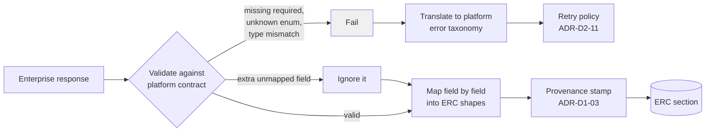

# ADR-D2-15 — Enterprise API contract, versioning and compatibility strategy

## 1. Summary

Every enterprise response is validated against a platform-owned contract and mapped
deterministically into ERC shapes — never passed through raw. The platform pins explicit API
versions rather than following "latest", and treats an unexpected response as a **failure**
rather than something to tolerate, because 10 PFF-FA-AI-ENTERPRISE-INTEGRATION.md §22 requires the mapping to be deterministic
and a tolerated surprise is a silent behaviour change.

## 2. Context and Problem Statement

10 PFF-FA-AI-ENTERPRISE-INTEGRATION.md §15–§24 cover API versioning, contracts, request and response payloads,
response-to-context mapping, why the mapping must be deterministic, data transformation and raw
response handling. 10 PFF-FA-AI-ENTERPRISE-INTEGRATION.md §36 covers tool output validation and §38–§40 the error contract and
its categories. 3. PFF-FA-AI-RESPONSIBILITY-MATRIX.md §67–§68 assign responsibility for payload transformation and version
compatibility. 20.PFF-FA-AI-GOVERNANCE.md §74 covers version compatibility governance.

10 PFF-FA-AI-ENTERPRISE-INTEGRATION.md §22 is unusually direct: the response-to-context mapping *must* be deterministic. It does
not say what happens when a response does not fit the mapping, and that gap is where the real
decision sits.

Three related problems.

**Raw responses are dangerous in a way that is easy to miss.** 10 PFF-FA-AI-ENTERPRISE-INTEGRATION.md §24 covers raw response
handling. An enterprise response passed into ERC unmapped brings whatever fields the service
happens to return today — including fields the platform never asked for, does not need, and may
not be entitled to show. It also means a service adding a field changes what reaches the model,
with no code change on the platform side and nothing to review.

**Version pinning versus tolerance is a real trade-off.** Following "latest" means the platform
adapts automatically to enterprise improvements and breaks unpredictably. Pinning means the
platform is stable and requires deliberate work to adopt changes. 10 PFF-FA-AI-ENTERPRISE-INTEGRATION.md §15 requires versioning
without stating which posture.

**Unexpected responses have two plausible handlings.** A response with a missing field, an
unexpected enum value, or an extra object can be rejected or tolerated. Tolerance is friendlier
and produces silent behaviour drift: the platform carries on with a field defaulted, and nobody
learns the contract changed until a user sees something wrong. This matters more here than in a
typical integration, because ADR-D1-03's precedence chain assumes facts entering ERC are what
they claim to be.

The affiliation flow supplies the sharp case. Its six application statuses — IN PROGRESS,
PENDING CFA, INVOICED, COMPLETE, REJECTED, CANCELLED — drive the entire conversational journey. If
the enterprise adds a seventh, a tolerant platform maps it to "unknown" and continues, telling
users something wrong about their application. A strict platform fails the call and says it cannot
determine the status, which is honest.

## 3. Decision Drivers

### 3.1 Functional drivers

| ID | Driver | Source |
|---|---|---|
| DR-F-01 | Response-to-context mapping must be deterministic | 10 PFF-FA-AI-ENTERPRISE-INTEGRATION.md §21–§22 |
| DR-F-02 | API versions must be explicit | 10 PFF-FA-AI-ENTERPRISE-INTEGRATION.md §15 |
| DR-F-03 | Tool and API outputs must be validated | 10 PFF-FA-AI-ENTERPRISE-INTEGRATION.md §36 |
| DR-F-04 | Errors must map to a platform error contract | 10 PFF-FA-AI-ENTERPRISE-INTEGRATION.md §38–§40 |
| DR-F-05 | Payload transformation responsibility is the platform's | 3. PFF-FA-AI-RESPONSIBILITY-MATRIX.md §67 |
| DR-F-06 | Version compatibility must be governed | 3. PFF-FA-AI-RESPONSIBILITY-MATRIX.md §68; 20.PFF-FA-AI-GOVERNANCE.md §74 |

### 3.2 Non-functional drivers

| ID | Driver | Target | Source |
|---|---|---|---|
| DR-N-01 | A contract change must be detected before it reaches users | 0 undetected breaking changes | 20.PFF-FA-AI-GOVERNANCE.md §74 |
| DR-N-02 | Validation overhead must be small | ≤5 ms per response | ADR-D5-18 |
| DR-N-03 | Only mapped fields may enter ERC | 0 unmapped fields | UK GDPR Art. 5(1)(c) |

### 3.3 Constraints

| ID | Constraint | Type | Source |
|---|---|---|---|
| DR-C-01 | Enterprise owns its API contracts | Organisational | 3. PFF-FA-AI-RESPONSIBILITY-MATRIX.md §4; ADR-D2-14 §7.3 |
| DR-C-02 | Pydantic at every boundary | Platform | `CLAUDE.md`; ADR-D5-03 |
| DR-C-03 | Behavioural coupling is forbidden | Platform | ADR-D2-14 §7.3 |
| DR-C-04 | Facts entering ERC carry provenance and must be what they claim | Platform | ADR-D1-03 |

### 3.4 Assumptions

| ID | Assumption | If false | Validation |
|---|---|---|---|
| DR-A-01 | The enterprise versions its APIs and communicates changes | The platform discovers changes by failure; contract tests become the primary detection | QM-04 |
| DR-A-02 | Enum-valued fields have knowable value sets | Strict enum validation is unworkable for those fields | Per-field review during integration mapping |
| DR-A-03 | Strict validation's failure rate is low enough to be operable | Strictness must be relaxed for specific fields | QM-02 |

## 4. Evaluation Criteria and Weights

| ID | Criterion | Weight | Rationale | Measurement |
|---|---|---|---|---|
| EC-01 | Detection of contract change | 30 | An undetected change means the platform tells users wrong things while appearing healthy | Is a breaking change detected before users see its effect? |
| EC-02 | Determinism of mapping | 25 | 10 PFF-FA-AI-ENTERPRISE-INTEGRATION.md §22 requires it; non-deterministic mapping makes ERC untrustworthy | Same response, same ERC content, always? |
| EC-03 | Field-level minimisation | 20 | Only what the platform mapped should enter context | Can an unmapped field reach ERC? |
| EC-04 | Operational tolerance | 15 | A platform that fails on every enterprise wobble is unusable | Failure rate from non-breaking changes |
| EC-05 | Adoption effort for enterprise changes | 10 | Real but subordinate | Work to adopt a new API version |
| | **Total** | **100** | | |

Scoring scale: **1** unacceptable · **2** poor · **3** adequate · **4** good · **5** excellent.

## 5. Alternatives Considered

### 5.1 Option A — Follow latest, pass responses through, tolerate the unexpected

**Description.** Call unversioned or latest endpoints, place response content into ERC largely
as returned, and default or ignore anything unexpected.

**Strengths.**
- Enterprise improvements arrive automatically with no adoption work (EC-05).
- Never fails on an additive change (EC-04).
- Least code — no contracts to author or maintain.
- Resilient to minor enterprise variation.

**Weaknesses.**
- A breaking change surfaces as wrong user-facing behaviour rather than as an error (EC-01
  fails). The seventh affiliation status is presented as unknown, and nobody knows why.
- Unmapped fields flow into ERC, so the enterprise controls what reaches the model (EC-03 fails).
- Mapping is not deterministic in the 10 PFF-FA-AI-ENTERPRISE-INTEGRATION.md §22 sense — what ends up in ERC depends on what the
  service returned that day.
- Defaulting a missing field manufactures a fact with authority 5 that the enterprise never
  asserted, which is a precedence-chain violation.

**Cost / effort.** Lowest, with three failures.

### 5.2 Option B — Pinned versions, platform-owned contracts, strict validation, explicit mapping

**Description.** Each catalogue entry pins an explicit API version. The platform owns a Pydantic
contract per operation. Responses are validated strictly and mapped field by field into ERC
shapes. A validation failure is a failure, surfaced per the error contract.

**Strengths.**
- A breaking change fails immediately and visibly, at the integration boundary rather than in
  front of a user (EC-01).
- Mapping is explicit and deterministic (EC-02).
- Only mapped fields enter ERC (EC-03).
- The platform's ERC shapes are stable even as enterprise shapes evolve.
- Contract tests can run against the enterprise independently of user traffic.

**Weaknesses.**
- Strictness means non-breaking additive changes can still fail if the contract forbids extra
  fields (EC-04) — addressed by §7.3's asymmetry.
- Contracts must be authored and maintained per operation (EC-05).
- Version adoption is deliberate work rather than automatic.
- Enum strictness needs per-field judgement (DR-A-02).

**Cost / effort.** Moderate.

### 5.3 Option C — Pinned versions with tolerant validation

**Description.** Pin versions, but validate leniently — accept unknown enum values, default
missing optional fields, log rather than fail.

**Strengths.**
- Version pinning gives stability (partial EC-01).
- Tolerance avoids failures on enterprise variation (EC-04).
- Lower operational noise than strict validation.
- Logging still produces a detection signal.

**Weaknesses.**
- Logs are not a control. A logged unknown status is detected only if someone reads the log, and
  meanwhile the user is told something wrong (EC-01 weakened materially).
- Defaulting a missing field manufactures an authority-5 fact, the same precedence violation as
  Option A.
- Tolerance is exactly where "we'll handle it later" accumulates.

**Cost / effort.** Moderate, with a weaker guarantee than B for similar work.

### 5.4 Option D — Consumer-driven contract testing with the enterprise

**Description.** The platform publishes its expectations as consumer contracts; the enterprise
verifies them in its own pipeline, so breaking changes are caught before release.

**Strengths.**
- Detects breaking changes before they are deployed, which is earlier than any consumer-side
  option (EC-01 best possible).
- Establishes a contract relationship with the owning teams.
- Industry-standard practice for exactly this problem.
- Reduces the need for runtime strictness.

**Weaknesses.**
- Requires enterprise participation in the platform's testing, which is outside the programme's
  control and is a significant organisational ask.
- Does not remove the need for runtime validation — an unverified deployment still happens.
- Complements rather than replaces B.

**Cost / effort.** Low for the platform; dependent on others.

## 6. Evaluation Method and Decision Matrix

**Method.** Weighted scoring against §4, tested against a specific scenario: the enterprise adds
a seventh affiliation status. When and how does each option detect it, and what does a user see?

| Criterion | Weight | A: Latest + passthrough | B: Pinned + strict | C: Pinned + tolerant | D: Consumer contracts |
|---|---|---|---|---|---|
| EC-01 Change detection | 30 | 1 | 5 | 3 | 5 |
| EC-02 Mapping determinism | 25 | 1 | 5 | 4 | 3 |
| EC-03 Field minimisation | 20 | 1 | 5 | 4 | 2 |
| EC-04 Operational tolerance | 15 | 5 | 3 | 5 | 4 |
| EC-05 Adoption effort | 10 | 5 | 3 | 3 | 4 |
| **Weighted total** | **100** | **200** | **450** | **385** | **375** |

- **Option B:** (30×5) + (25×5) + (20×5) + (15×3) + (10×3) = 150 + 125 + 100 + 45 + 30 = **450**

**Sensitivity.** B leads C by 65 points, on detection and minimisation. B and D are not exclusive:
§7.6 adopts B now and pursues D where the enterprise will engage, since D's earlier detection is
strictly better and its dependency is organisational rather than technical. A is eliminated on
three criteria. B's weakness on operational tolerance is real and is addressed structurally by
§7.3's asymmetry rather than by relaxing to C.

## 7. Decision

### 7.1 Versions are pinned explicitly

Each catalogue entry names an explicit API version (10 PFF-FA-AI-ENTERPRISE-INTEGRATION.md §9's `version: v1`). The platform never
calls an unversioned or "latest" endpoint.

Adopting a new version is deliberate work: a new catalogue entry, a new contract, updated mapping,
and a release. 20.PFF-FA-AI-GOVERNANCE.md §74's version-compatibility governance applies. The old version continues to
be used until the new one is adopted, so an enterprise release cannot change platform behaviour
without a platform release — which is DR-N-01 satisfied structurally.

### 7.2 The platform owns a contract per operation

For every catalogued operation the platform maintains a Pydantic model for the request and one
for the response. These are the **platform's** expectations, not a copy of the enterprise's
schema. The distinction matters: the platform's contract declares what it needs and will use, and
an enterprise field the platform does not map does not appear in it.

3. PFF-FA-AI-RESPONSIBILITY-MATRIX.md §67 assigns payload transformation to the platform, and this is what that means in practice:
the enterprise returns its shapes, and the platform maps them into ERC shapes it controls. ERC
section models are stable across enterprise contract changes, so an enterprise field rename is an
integration-layer change and touches nothing above it.

### 7.3 Strict validation, with a deliberate asymmetry

Validation is strict, with one asymmetry that resolves EC-04 without weakening EC-01:

| Change | Handling | Why |
|---|---|---|
| **Extra field the platform does not map** | **Ignored.** Not a failure. | Additive changes are non-breaking by definition, and the platform never mapped the field, so it changes nothing. This is what makes strictness operable. |
| **Missing field the contract requires** | **Failure.** | The platform needs it; proceeding would mean defaulting, which manufactures a fact. |
| **Unexpected enum value in a mapped field** | **Failure.** | The seventh affiliation status. The platform does not know what it means, and guessing is worse than admitting it. |
| **Type mismatch on a mapped field** | **Failure.** | The contract is wrong or the service changed; either way, proceeding is unsafe. |
| **Extra field where the contract declares a closed set** | **Failure**, for closed-set fields only | Used where the enterprise commits to a fixed set. |

Ignoring unmapped extra fields is also what delivers EC-03: an unmapped field cannot reach ERC
because there is nowhere for it to go.

**A validation failure never becomes a default.** A missing or unrecognised value produces a
failure surfaced per the error contract, handled per ADR-D2-11's policy, and communicated per
ADR-D3-08. It does not become `null`, `unknown` or a best guess, because ADR-D1-03 would then rank
a manufactured value at authority 5.

### 7.4 The affiliation status case, worked

The enterprise adds a seventh status, `UNDER_APPEAL`:

| Option | Behaviour | What the user sees |
|---|---|---|
| A / C | Maps to unknown or defaults; conversation continues | Something confidently wrong about their application |
| **B** | Enum validation fails; the call fails | "I can't determine your application's current status right now" — and an alert fires |

B's outcome is worse for that user in that moment and better in every other respect: the platform
does not assert something false, the failure is detected in minutes rather than by complaint, and
the fix is a contract update and a release. §7.6's consumer contract would have caught it before
deployment.

### 7.5 Errors map to a platform error contract

Per 10 PFF-FA-AI-ENTERPRISE-INTEGRATION.md §38–§40, enterprise errors are translated into the platform's own error taxonomy
(ADR-D7-05) at the integration boundary. Two rules:

- **Translation is from status codes and structured error codes**, never from error message text.
  Parsing message text is behavioural coupling, forbidden by ADR-D2-14 §7.3.
- **Where the enterprise provides no structured error code**, the platform maps from the HTTP
  status alone and records a gap (ADR-D2-14 §7.4). It does not infer finer distinctions from
  prose.

The error category drives retry eligibility (ADR-D2-11 §7.2), so a mis-translated error becomes a
retry decision — which is why translation must be from structured signals.

### 7.6 Consumer-driven contracts where the enterprise will engage

Option D is pursued alongside B. Where an owning team will accept them, the platform publishes its
response contracts as consumer expectations for the enterprise's own pipeline to verify.

This does not replace runtime validation — an unverified deployment or an unengaged team still
requires it — but where it is adopted, a breaking change is caught before release rather than at
the first call. Progress is tracked per service in the ADR-D2-14 matrix.

**Status rationale.** Accepted. Tier 1 under ADR-D0-03 §7.1 — system boundaries and data
ownership — ratified by the external ADF/ADR governance forum.

## 8. Architecture Detail

### 8.1 The response path



There is no path from `F` to `M`. A failed validation cannot produce a defaulted ERC fact, which
is the structural expression of §7.3's last rule.

### 8.2 Contract ownership and stability

```
Enterprise shape          Platform contract         ERC section
(owned by service)   →    (owned by platform)  →   (owned by platform)
  changes with              changes when the         stable across
  enterprise releases       platform adopts          enterprise change
```

Three layers, and the value is in the third: an enterprise field rename changes the platform
contract and its mapping, and the ERC section model is untouched. Everything above the integration
layer — agents, prompts, guardrails, evaluation — is insulated.

### 8.3 Detecting change without waiting for a call

Runtime validation detects a change on the first affected call, which may be at an inconvenient
moment during an affiliation window. Two earlier signals:

| Signal | When | Coverage |
|---|---|---|
| Consumer contracts (§7.6) | Before enterprise deployment | Only where the owning team engages |
| Scheduled contract tests | Nightly, in a non-production environment | Every catalogued operation |
| Runtime validation | On the first affected call | Everything, last resort |

Scheduled contract tests are the platform-side backstop for services where §7.6 is not adopted:
they exercise each catalogued operation against a non-production enterprise environment and fail
on a contract mismatch, giving detection in hours rather than at the next user call.

## 9. Consequences

### 9.1 Positive

- A breaking enterprise change fails at the integration boundary rather than producing wrong
  user-facing behaviour.
- Mapping is explicit and deterministic, satisfying 10 PFF-FA-AI-ENTERPRISE-INTEGRATION.md §22.
- Only mapped fields reach ERC, so the enterprise cannot widen what the model sees by adding a
  field.
- ERC section models are stable across enterprise contract changes.
- No fact is ever manufactured by defaulting, so the precedence chain holds.
- Enterprise releases cannot change platform behaviour without a platform release.

### 9.2 Negative

- Contracts must be authored and maintained per operation, which is real per-integration work.
- Adopting an enterprise improvement requires deliberate work rather than arriving automatically.
- Strict enum validation fails on a legitimate enterprise addition until the platform adopts it —
  §7.4's trade, accepted.
- Enum strictness needs per-field judgement where value sets are not fixed (DR-A-02).

### 9.3 Neutral

- Extra unmapped fields are ignored, so additive changes are non-events.
- Consumer contracts are pursued where possible and not depended on.

### 9.4 Trade-offs explicitly accepted

| Given up | In exchange for | Accepted by |
|---|---|---|
| Automatic adoption of enterprise improvements | Enterprise releases cannot silently change platform behaviour | External ADF/ADR forum |
| Graceful degradation on unknown values | Never asserting something the enterprise did not say | AI Product Owner |
| Lower per-integration effort | ERC shapes insulated from enterprise change | AI Solution Architect |

## 10. Golden-Rule and Precedence Conformance

| Constraint | Conformance |
|---|---|
| Enterprise decides; AI orchestrates | The platform maps and validates what the enterprise returns; it never supplies a value the enterprise did not. §7.3's no-defaulting rule is this principle at the field level. |
| Authoritative-truth precedence | Central. A defaulted field would enter ERC at authority 5 while being the platform's invention. Failing instead is what keeps authority 5 meaning "the enterprise said so". |
| Four-state separation | The platform contract and ERC shapes are the platform's projection; the enterprise shape is the enterprise's. |
| Versioned artefacts, never mutated in place | API versions pinned; contracts versioned with the catalogue (ADR-D5-06); adoption is a release, per 20.PFF-FA-AI-GOVERNANCE.md §74. |
| Adam persona governs how, never what | A validation failure produces an honest inability statement (ADR-D3-08), not a persona-smoothed guess. |

## 11. Risks and Mitigations

| ID | Risk | Likelihood | Impact | Exposure | Mitigation | Owner | Residual |
|---|---|---|---|---|---|---|---|
| RSK-01 | Strict enum validation fails on a legitimate enterprise addition during a busy window | Medium | Medium | Medium | §8.3's earlier signals; per-field enum-strictness judgement (DR-A-02); rapid contract-update path | AI Engineering Lead | Medium |
| RSK-02 | Enterprise does not communicate changes (DR-A-01) | Medium | High | High | §8.3's scheduled contract tests are the platform-side backstop; QM-04 | AI Platform Owner | Medium |
| RSK-03 | A field is defaulted somewhere to avoid a failure | Medium | Very High | High | No path from failure to mapping (§8.1); code review; QM-03 | Security Owner | Low |
| RSK-04 | Error translation from message text creeps in | Medium | Medium | Medium | §7.5's rule; ADR-D2-14 QM-03 detects response parsing beyond contract | AI Engineering Lead | Low |
| RSK-05 | Contract maintenance falls behind, blocking adoption | Medium | Medium | Medium | Contracts live with catalogue entries; adoption tracked per service in the ADR-D2-14 matrix | AI Engineering Lead | Medium |
| RSK-06 | Consumer contracts adopted unevenly, giving false confidence | Low | Medium | Low | Adoption tracked per service; §8.3's scheduled tests cover the rest | AI Platform Owner | Low |

## 12. Quantitative Targets and Measures

| ID | Measure | Target | Threshold (alert) | Source | Review cadence |
|---|---|---|---|---|---|
| QM-01 | Response validation failures by operation and cause | Tracked | >3× baseline | Integration metrics | Daily |
| QM-02 | Validation failures caused by non-breaking enterprise changes | 0 | ≥1 | Failure cause analysis | Weekly |
| QM-03 | ERC fields populated by default rather than from a response | 0 | ≥1 | Provenance audit | Daily |
| QM-04 | Breaking changes detected first at runtime rather than by contract test or consumer contract | 0 | ≥1 | Change incident analysis | Quarterly |
| QM-05 | Catalogued operations without a platform contract | 0 | ≥1 | Catalogue and contract cross-check | Per build |
| QM-06 | Error translations derived from message text | 0 | ≥1 | Code review | Per release |

QM-02's zero target is the check on §7.3's asymmetry: a non-breaking change causing a failure
means the contract is over-strict about extra fields, which is a contract bug rather than an
enterprise problem.

## 13. Security, Privacy and Compliance Impact

| Dimension | Impact |
|---|---|
| Attack surface change | Strict validation at the integration boundary means malformed or unexpected enterprise responses cannot propagate into ERC and thence into prompts. |
| Data classification touched | Personal and special-category data arrives in enterprise responses. |
| Personal data / PII | Field-level mapping is a minimisation control: an enterprise response containing more personal data than the platform mapped contributes only the mapped fields. The enterprise cannot widen the platform's data holding by adding a field. |
| Children's data and safeguarding | Compliance responses carry DBS and suspension status. §7.3's no-defaulting rule matters most here: a missing clearance field must never default to a value, because either possible default is a false safeguarding statement. Failing and saying so is the only safe handling. |
| UK GDPR lawful basis and rights impact | Explicit field mapping implements minimisation (Art. 5(1)(c)) at the point of collection, and strict validation supports accuracy (Art. 5(1)(d)). |
| Audit and evidential requirements | Contract version per call is recorded, so the shape a fact arrived in is reconstructable. |
| Standards touched | ISO/IEC 27001 A.8.26 (application security requirements), A.8.28 (secure coding); ISO/IEC 42001 (data quality); UK GDPR Art. 5(1)(c), 5(1)(d). |

## 14. Implementation Impact

| Aspect | Detail |
|---|---|
| Build phases | 6 (integration layer) |
| Repository paths | `src/pff_fa_ai/integration/api/contracts.py`, `mappings.py`, `client.py`; `src/pff_fa_ai/integration/errors/` |
| Configuration | Pinned versions in `config/enterprise/api-catalog/` |
| Contracts / schemas | Pydantic request and response models per operation; ERC mapping definitions |
| Migration | None |
| Dependencies on other ADRs | ADR-D2-13 (catalogue), ADR-D2-14 (matrix), ADR-D5-03 (Pydantic), ADR-D7-05 (error taxonomy) |
| Effort estimate | Moderate, proportional to operation count |

## 15. Validation and Verification

| ID | Acceptance criterion | Verification method |
|---|---|---|
| AC-01 | Every catalogued operation has request and response contracts | Cross-check; QM-05 |
| AC-02 | An extra unmapped field does not cause a failure and does not reach ERC | Validation test |
| AC-03 | An unknown enum value in a mapped field causes a failure | Affiliation seventh-status test |
| AC-04 | A validation failure never results in a defaulted ERC field | Provenance test; QM-03 |
| AC-05 | Error translation uses status and structured codes only | Code review; QM-06 |
| AC-06 | Every call records the contract version used | Trace audit |
| AC-07 | Scheduled contract tests run against a non-production enterprise environment | CI schedule |

## 16. Operational Impact

| Aspect | Detail |
|---|---|
| Monitoring | Validation failure rate by operation and cause; contract version in use |
| Alerting | QM-03 on any occurrence; validation failure rate spikes, which are the change-detection signal |
| Runbook | `docs/runbooks/enterprise-api.md` — includes contract-mismatch triage |
| Failure mode and degradation | A contract mismatch degrades the affected capability with an honest statement. Other capabilities are unaffected, since contracts are per operation. |
| Rollback | Contracts and pinned versions are configuration and code; rollback returns to the prior contract |
| Support model impact | A validation failure names the operation and field, so triage is immediate and routes to the owning team via the ADR-D2-14 matrix |

## 17. Cost Impact

| Cost element | One-off | Recurring | Basis |
|---|---|---|---|
| Contracts and mappings | Phase 6, per operation | — | Proportional to catalogue size |
| Version adoption | — | Per enterprise version change | Deliberate work, by design |
| Scheduled contract tests | ~1 day | Nightly CI time | §8.3 |
| Avoided cost | — | Ongoing | A silent contract change producing wrong user-facing behaviour costs support effort and trust, and is discovered late |

## 18. Revisit Triggers and Causal Analysis Hooks

| ID | Trigger | Detected by | Action on trigger |
|---|---|---|---|
| RT-01 | QM-02 records a failure from a non-breaking change | Weekly review | The contract is over-strict on extra fields; fix the contract |
| RT-02 | QM-04 records a breaking change detected first at runtime | Quarterly review | §8.3's earlier signals did not cover that operation; extend coverage |
| RT-03 | QM-03 records a defaulted ERC field | Daily audit | Governance incident; a manufactured authority-5 fact existed |
| RT-04 | Enum strictness proves unworkable for a field (DR-A-02) | Integration mapping | Model it as an open set with explicit unknown handling that fails rather than defaults |
| RT-05 | An owning team adopts consumer contracts (§7.6) | Enterprise engagement | Record in the matrix; runtime validation stays regardless |
| RT-06 | Validation overhead exceeds its budget | Performance review | Optimise validation; do not relax it |

**Scheduled review:** 2027-08-21.

## 19. Traceability

| Dimension | Reference |
|---|---|
| Workshop sheet | WS-10 Integration & 18-Microservice Matrix |
| Specification sections | 10 PFF-FA-AI-ENTERPRISE-INTEGRATION.md §15 (API Versioning), §16–§20 (API Contract, Request/Response Contract and Payload), §21 (Response-to-Context Mapping), §22 (Why Mapping Must Be Deterministic), §23–§24 (Data Transformation, Raw Response Handling), §36 (Tool Output Validation), §38–§40 (Error Contract, Translation, Categories); 3. PFF-FA-AI-RESPONSIBILITY-MATRIX.md §67 (Responsibility for API Payload Transformation), §68 (Responsibility for Version Compatibility); 20.PFF-FA-AI-GOVERNANCE.md §74 (Version Compatibility) |
| Requirement IDs | `NFR-A38-REL`, `NFR-A38-MAINT` |
| Build phases | 6 |
| Code paths | `src/pff_fa_ai/integration/api/`, `src/pff_fa_ai/integration/errors/` |
| Configuration | `config/enterprise/api-catalog/` |
| Tests | AC-01 to AC-07; scheduled contract tests |
| Upstream ADRs | ADR-D2-13, ADR-D2-14 |
| Downstream ADRs | ADR-D4-09, ADR-D7-05, ADR-D2-11 |

## 20. Change Log

| Version | Date | Author | Change |
|---|---|---|---|
| 1.0.0 | 2026-08-21 | AI Solution Architect | Initial decision recorded. Explicit version pinning with platform-owned contracts and strict validation, asymmetric on extra fields so additive changes are non-events; no path from validation failure to a defaulted ERC field, since a default would be a manufactured authority-5 fact; error translation from structured codes only. Tier 1 — ratified by the external ADF/ADR forum. |
