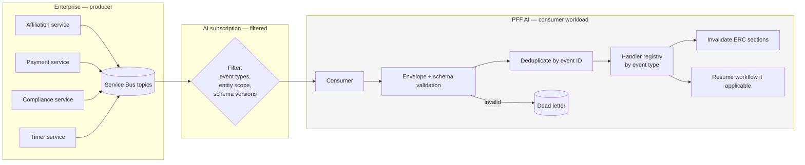

# ADR-D2-16 — Asynchronous eventing platform: Azure Service Bus, consumed not produced

## 1. Summary

Azure Service Bus is confirmed as the eventing platform per `CLAUDE.md`. The decision that
needed making is the platform's **posture**: PFF AI is a pure consumer. It produces no business
events, owns no topic, and subscribes with filters that make its consumption surface a deliberate,
reviewable statement rather than everything the enterprise happens to publish.

## 2. Context and Problem Statement

`CLAUDE.md` lists Azure Service Bus under Confirmed Tech Stack. 11 PFF-FA-AI-SERVICE-BUS.md covers it across sixty-odd
sections: §2–§5 the principle and why it is required, §6–§10 event types, §27–§31 namespace,
topics, subscriptions and filtering, §32–§34 consumer architecture and what the consumer must not
do, §50–§51 ERC refresh triggering and scope. 3. PFF-FA-AI-RESPONSIBILITY-MATRIX.md §28 splits Service Bus responsibility:
enterprise produces, AI consumes.

The platform choice is settled. Three postural questions are not, and each has a security or
architectural consequence.

**Does the platform ever produce events?** 3. PFF-FA-AI-RESPONSIBILITY-MATRIX.md §28 assigns event production to the enterprise
and subscription to the AI. But the platform will have internal needs — a workflow suspended, an
evaluation triggered, a guardrail fired — and Service Bus is right there. Using it for internal
signalling would put platform-internal messages on enterprise infrastructure, blur the 3. PFF-FA-AI-RESPONSIBILITY-MATRIX.md §28
split, and create a channel through which the platform could appear to be asserting business
facts.

**What does the platform subscribe to?** 11 PFF-FA-AI-SERVICE-BUS.md §30 covers subscription filtering without saying
what the filter should express. A broad subscription is simpler and means the platform receives
events about clubs, applications and officials it has no interest in — receiving personal data it
never needed, and creating processing volume it must discard.

**Who owns the subscription's lifecycle?** 11 PFF-FA-AI-SERVICE-BUS.md §31 covers subscription responsibility. If the
enterprise owns it, the platform cannot change what it receives without an enterprise change. If
the platform owns it, it can subscribe to more than it should without anyone noticing.

The affiliation flow shows what actually arrives: CFA approval, rejection and cancellation;
payment confirmation, online and offline; the 31 May timer cancellation; WGS integration results;
refunds; team folds. All enterprise-produced, all notifications of decisions the platform did not
make.

## 3. Decision Drivers

### 3.1 Functional drivers

| ID | Driver | Source |
|---|---|---|
| DR-F-01 | Events must refresh ERC and resume workflows | 1 PFF-FA-AI-ARCHITECTURE.md §39 criterion 12; 11 PFF-FA-AI-SERVICE-BUS.md §50–§51 |
| DR-F-02 | The enterprise produces; the AI consumes | 3. PFF-FA-AI-RESPONSIBILITY-MATRIX.md §28; 11 PFF-FA-AI-SERVICE-BUS.md §2 |
| DR-F-03 | The consumer must not make business decisions | 11 PFF-FA-AI-SERVICE-BUS.md §34 |
| DR-F-04 | Subscriptions must be filtered | 11 PFF-FA-AI-SERVICE-BUS.md §30 |
| DR-F-05 | Four event types must be supported | 11 PFF-FA-AI-SERVICE-BUS.md §6–§10 |

### 3.2 Non-functional drivers

| ID | Driver | Target | Source |
|---|---|---|---|
| DR-N-01 | Event lag must be small enough that users are not told stale state | ≤60 s p95 end to end | ADR-D1-08 |
| DR-N-02 | Consumption must scale on queue depth | Independent of request rate | ADR-D2-02 §7.2 |
| DR-N-03 | Only events the platform needs should be received | 0 events discarded as irrelevant after delivery | UK GDPR Art. 5(1)(c) |

### 3.3 Constraints

| ID | Constraint | Type | Source |
|---|---|---|---|
| DR-C-01 | Azure Service Bus is the confirmed platform | Organisational | `CLAUDE.md` |
| DR-C-02 | The platform implements no enterprise scheduled processing | Platform | ADR-D1-01 §7.3 |
| DR-C-03 | An event is a notification, not data or instruction | Platform | ADR-D2-03 §7.4; 11 PFF-FA-AI-SERVICE-BUS.md §25, §58 |
| DR-C-04 | The enterprise owns event contracts | Organisational | 3. PFF-FA-AI-RESPONSIBILITY-MATRIX.md §28 |

### 3.4 Assumptions

| ID | Assumption | If false | Validation |
|---|---|---|---|
| DR-A-01 | The enterprise publishes the events the platform needs | Workflows cannot resume automatically; reconciliation carries more load | ADR-D2-14 gap process |
| DR-A-02 | Subscription filters can express the platform's interest precisely | Broader subscription with post-delivery filtering, and the minimisation cost that implies | Filter design at Phase 12 |
| DR-A-03 | The platform never needs to emit a business event | A production posture must be revisited as a tier 1 decision | Reviewed at each workflow onboarding |

## 4. Evaluation Criteria and Weights

| ID | Criterion | Weight | Rationale | Measurement |
|---|---|---|---|---|
| EC-01 | Clarity of the produce/consume boundary | 30 | A platform that produces events could appear to assert business facts, which is the Golden Rule's core prohibition | Can the platform emit something an enterprise consumer might treat as authoritative? |
| EC-02 | Minimisation of what is received | 25 | Received personal data is processed personal data, whether used or not | Are irrelevant events delivered? |
| EC-03 | Reliability of delivery to the platform | 20 | Missed events leave workflows suspended | Delivery guarantees and lag |
| EC-04 | Operational simplicity | 15 | Small team; messaging infrastructure is easy to over-build | Components to operate |
| EC-05 | Flexibility to adjust what is consumed | 10 | New workflows need new events | Effort to change subscription |
| | **Total** | **100** | | |

Scoring scale: **1** unacceptable · **2** poor · **3** adequate · **4** good · **5** excellent.

## 5. Alternatives Considered

Platform choice is fixed by DR-C-01. The alternatives are postures.

### 5.1 Option A — Bidirectional: the platform consumes and produces

**Description.** The platform subscribes to enterprise events and also publishes its own — workflow
lifecycle, AI outcomes, evaluation signals — onto Service Bus.

**Strengths.**
- Enterprise systems could react to AI activity, enabling richer integration.
- One messaging mechanism for everything the platform needs.
- Internal decoupling between platform components for free.
- Natural fit for an event-driven architecture.

**Weaknesses.**
- Contradicts 3. PFF-FA-AI-RESPONSIBILITY-MATRIX.md §28's split (DR-F-02).
- A platform-emitted event on enterprise infrastructure looks like an enterprise event to a
  consumer. An `AffiliationAssessed` event from the AI could be consumed by something that treats
  it as authoritative — the AI asserting a business fact, which is the Golden Rule's central
  prohibition (EC-01 fails).
- Platform-internal signalling does not need Service Bus; the runtime is a single process
  (ADR-D2-02).
- Expands the platform's footprint on shared enterprise infrastructure.

**Cost / effort.** Moderate, with a boundary violation.

### 5.2 Option B — Pure consumer with filtered subscriptions

**Description.** The platform subscribes only. It owns its subscriptions and their filters,
expressing precisely which event types and which entities it needs. It publishes nothing.

**Strengths.**
- The produce/consume boundary is unambiguous — the platform has no publish capability at all
  (EC-01).
- Filters bound what is received, so irrelevant events are never delivered (EC-02).
- Service Bus subscriptions give at-least-once delivery with dead-lettering (EC-03).
- Minimal footprint: one subscription per topic of interest, one consumer workload (EC-04).
- Filters are configuration, so consumption changes without an enterprise change (EC-05).

**Weaknesses.**
- Enterprise systems cannot react to AI activity, which forecloses some future integration.
- Filter maintenance as workflows are added.
- Depends on the enterprise publishing what the platform needs (DR-A-01).
- Platform-internal signalling needs a different mechanism — which is fine, since it needs none.

**Cost / effort.** Low.

### 5.3 Option C — Pure consumer with broad subscriptions and application-side filtering

**Description.** Subscribe broadly to enterprise topics; discard irrelevant events in the consumer.

**Strengths.**
- No filter maintenance; new event types arrive automatically (EC-05).
- Simplest subscription configuration.
- Nothing is missed because a filter was too narrow.
- Full visibility of enterprise activity, useful for diagnostics.

**Weaknesses.**
- The platform receives — and therefore processes — personal data about clubs, applications and
  officials it has no business with (EC-02 fails). Discarding after delivery is still processing.
- Wasted consumption capacity and cost proportional to enterprise event volume, not platform need.
- No reviewable statement of what the platform consumes; the answer is "everything".

**Cost / effort.** Lowest, with a minimisation failure.

### 5.4 Option D — Polling instead of eventing

**Description.** No subscription. The platform polls enterprise APIs for state changes on
suspended workflows.

**Strengths.**
- No messaging infrastructure to operate (EC-04 maximised).
- No dependency on enterprise event publication (DR-A-01 not needed).
- Complete control over when state is checked.
- Simple failure model.

**Weaknesses.**
- Fails 1 PFF-FA-AI-ARCHITECTURE.md §39 criterion 12, which requires event-driven refresh and resume.
- Polling every suspended workflow across a county during an affiliation window is substantial
  enterprise load for mostly-unchanged state.
- Latency is the polling interval; a CFA approval could sit unnoticed for the interval's duration
  (EC-03).
- Reconciliation (ADR-D2-18 §7.6) is exactly this, and is correctly a backstop rather than the
  primary mechanism.

**Cost / effort.** Low to build, expensive to run and poor for users.

## 6. Evaluation Method and Decision Matrix

**Method.** Weighted scoring against §4. EC-01 tested by asking what an enterprise consumer could
observe from the platform under each option. EC-02 assessed by what personal data reaches the
platform without being needed.

| Criterion | Weight | A: Bidirectional | B: Consumer + filters | C: Consumer + broad | D: Polling |
|---|---|---|---|---|---|
| EC-01 Boundary clarity | 30 | 1 | 5 | 5 | 5 |
| EC-02 Minimisation | 25 | 3 | 5 | 1 | 4 |
| EC-03 Delivery reliability | 20 | 5 | 5 | 5 | 2 |
| EC-04 Operational simplicity | 15 | 2 | 4 | 4 | 5 |
| EC-05 Flexibility | 10 | 4 | 4 | 5 | 4 |
| **Weighted total** | **100** | **285** | **470** | **395** | **410** |

- **Option B:** (30×5) + (25×5) + (20×5) + (15×4) + (10×4) = 150 + 125 + 100 + 60 + 40 = **470**

**Sensitivity.** B leads D by 60 points and C by 75. C differs from B only on minimisation and
flexibility, and loses decisively on the first — receiving a county's event stream to discard most
of it is processing personal data without need. D is excluded by 1 PFF-FA-AI-ARCHITECTURE.md §39 criterion 12 and by its
enterprise load. A fails EC-01 categorically: no reweighting makes it acceptable for the AI
platform to emit something an enterprise consumer might treat as authoritative.

## 7. Decision

### 7.1 The platform is a pure consumer

PFF AI **subscribes only**. It has no publish capability: the Service Bus client is configured
without a sender, and no code path constructs an outbound message.

This is stronger than a policy. 3. PFF-FA-AI-RESPONSIBILITY-MATRIX.md §28's split is realised by the platform being structurally
incapable of publishing, which means the failure mode Option A creates — an AI-emitted event
consumed as authoritative — cannot occur.

### 7.2 Platform-internal signalling does not use Service Bus

The internal needs that would tempt Option A are met without it:

| Need | Mechanism |
|---|---|
| Workflow suspended | Durable workflow state (ADR-D2-10), read on resume |
| Workflow resumed | Same |
| Evaluation triggered | In-process hook in the harness (ADR-D2-09 §7.2) |
| Guardrail fired | Trace event to Langfuse (ADR-D7-02) |
| Cross-workload coordination | Shared state store (ADR-D4-10), not messages |

None needs a message broker, because the runtime is one process type (ADR-D2-02) and the state
store is shared. Adding Service Bus for internal signalling would be infrastructure without a
problem.

### 7.3 Subscriptions are filtered and platform-owned

The platform owns its subscriptions per 11 PFF-FA-AI-SERVICE-BUS.md §31. Filters express, as precisely as the broker
allows:

- **Event types** the platform handles — nothing outside the registered handler set (ADR-D2-03
  §7.4).
- **Entity scope** where expressible — for example, counties the platform is live in during a
  phased rollout.
- **Schema versions** the platform supports, so an unsupported version is not delivered rather
  than being delivered and rejected (11 PFF-FA-AI-SERVICE-BUS.md §38).

The filter is the platform's statement of what it consumes, and it is versioned configuration
subject to review. A widened filter is a change to what personal data the platform receives, which
is exactly the kind of change that should require review rather than happening incidentally.

DR-A-02 flags that filters may not express everything. Where an event must be delivered and then
found irrelevant, it is discarded before any content is read beyond its type and entity
identifiers, and QM-03 tracks the volume as a minimisation signal.

### 7.4 The four event types

11 PFF-FA-AI-SERVICE-BUS.md §6–§10 define four, each with a distinct handling:

| Type | 11 PFF-FA-AI-SERVICE-BUS.md | Affiliation examples | Handling |
|---|---|---|---|
| **Workflow events** | §7 | Application status transitions | Invalidate ERC section; refresh; resume workflow |
| **HIL events** | §8 | CFA approval, rejection, cancellation, override | Same, plus HIL evidence recording (20.PFF-FA-AI-GOVERNANCE.md §71) |
| **Enterprise data events** | §9 | Team folded, official's DBS updated, debt cleared | Invalidate the affected ERC section; refresh on next use |
| **External events** | §10 | Payment confirmation, WGS integration result | Invalidate; refresh; may resume |

All four are notifications. None carries authoritative values into ERC (ADR-D2-03 §7.4); each
triggers an invalidate-and-refresh. The differences are in which sections are invalidated and
whether a workflow resumes.

### 7.5 The consumer makes no business decision

11 PFF-FA-AI-SERVICE-BUS.md §34 constrains the consumer. Restated as what it may and may not do:

| May | May not |
|---|---|
| Validate the envelope and schema | Interpret payload content as instruction |
| Deduplicate by event ID | Decide whether a business outcome is correct |
| Resolve the workflow instance | Infer a status the event does not state |
| Invalidate ERC sections | Write payload values into ERC as facts |
| Trigger refresh and resume | Act beyond the captured authorization context |
| Dead-letter what it cannot handle | Discard an event it does not understand silently |

The last row on each side pair up: an event the consumer cannot handle is dead-lettered and
visible (ADR-D2-18), never dropped. A silently dropped event is a suspended workflow nobody will
notice.

### 7.6 Enterprise timers arrive as events

Affiliation Scenario 12's 31 May auto-cancellation is an enterprise timer. Per DR-C-02, the
platform schedules nothing business-facing; the cancellation arrives as a workflow event and is
handled like any other. The platform has no scheduler for business outcomes, and ADR-D1-01 AC-07
asserts its absence.

**Status rationale.** Accepted. Tier 1 under ADR-D0-03 §7.1 — eventing is a named 2. PFF-FA-AI-ARCHITECTURE-DETAILED.md §52
category — ratified by the external ADF/ADR governance forum.

## 8. Architecture Detail

### 8.1 Consumption topology

There is no arrow from `AI` back to `T`. That absence is §7.1.

### 8.2 Namespace, topic and subscription

Per 11 PFF-FA-AI-SERVICE-BUS.md §27–§29:

| Element | Owner | Notes |
|---|---|---|
| Namespace | Enterprise / Platform-DevOps | Shared enterprise infrastructure |
| Topics | Enterprise | Producers own their topics (3. PFF-FA-AI-RESPONSIBILITY-MATRIX.md §28) |
| **AI subscription** | **PFF AI platform** | One per topic of interest; filters are platform configuration (11 PFF-FA-AI-SERVICE-BUS.md §29, §31) |
| Dead-letter queue | PFF AI platform | Per subscription; monitored per ADR-D2-18 |

Platform ownership of the subscription is what gives EC-05: adding an event type to consume is a
filter change and a handler, not an enterprise change request.

### 8.3 Access and network posture

| Aspect | Decision |
|---|---|
| Authentication | Azure Managed Identity (25.PFF-FA-AI-INFRASTRUCTURE-OPERATIONS.md §28), never connection strings with embedded keys |
| Authorisation | Listen-only on the subscription. **No Send claim is granted**, which enforces §7.1 at the infrastructure level as well as in code. |
| Network | Private connectivity per 25.PFF-FA-AI-INFRASTRUCTURE-OPERATIONS.md §24; no public endpoint traversal |
| Secrets | No Service Bus key in configuration; identity-based access only (ADR-D5-07) |

The listen-only grant is worth noting: even if a future code change added a sender, it would fail
at the broker. That is defence in depth for the boundary in §7.1.

## 9. Consequences

### 9.1 Positive

- The platform cannot emit an event an enterprise consumer might treat as authoritative — enforced
  in code and by the absence of a Send claim.
- Filters bound what personal data reaches the platform, so minimisation applies before delivery.
- Subscription ownership means consumption changes are platform changes, reviewable and versioned.
- At-least-once delivery with dead-lettering gives a reliable substrate for workflow resumption.
- Enterprise timers are handled without the platform owning a scheduler.

### 9.2 Negative

- Enterprise systems cannot react to AI activity, foreclosing integrations that might later be
  wanted.
- Filter maintenance grows with workflows and with rollout scope.
- Dependent on the enterprise publishing the events the platform needs (DR-A-01); a missing event
  type is an integration gap.
- Filters may not express everything, leaving some post-delivery discarding (DR-A-02).

### 9.3 Neutral

- Platform-internal signalling uses state and traces rather than messages, which suits a
  single-runtime architecture.
- Service Bus is confirmed by `CLAUDE.md`; this decision sets posture, not platform.

### 9.4 Trade-offs explicitly accepted

| Given up | In exchange for | Accepted by |
|---|---|---|
| Ability to publish AI events | No possibility of the AI appearing to assert a business fact | External ADF/ADR forum |
| Automatic receipt of new enterprise event types | Receiving only what the platform needs | Data Owner |
| Simplicity of a broad subscription | Minimisation applied before delivery | Compliance/Legal |

## 10. Golden-Rule and Precedence Conformance

| Constraint | Conformance |
|---|---|
| Enterprise decides; AI orchestrates | §7.1 is this rule as an infrastructure posture: the enterprise publishes what it decided; the platform listens. §7.6 keeps enterprise timers enterprise-owned. |
| Authoritative-truth precedence | §7.4: every event invalidates and triggers refresh rather than writing values, so authoritative values always come from an API read (ADR-D2-03 §7.4). |
| Four-state separation | Events update Workflow State and invalidate ERC projections; they never write Enterprise Business State, which the enterprise owns. |
| Versioned artefacts, never mutated in place | Event contracts are versioned (ADR-D2-17); subscription filters are versioned configuration. |
| Adam persona governs how, never what | Events produce no immediate user output; the persona applies on the user's next entry, over refreshed authoritative state. |

## 11. Risks and Mitigations

| ID | Risk | Likelihood | Impact | Exposure | Mitigation | Owner | Residual |
|---|---|---|---|---|---|---|---|
| RSK-01 | A future need drives adding event production | Medium | High | High | §7.2's alternatives for every internal need; listen-only grant (§8.3); a production posture is a tier 1 supersession | AI Solution Architect | Low |
| RSK-02 | The enterprise does not publish a needed event (DR-A-01) | Medium | High | High | Integration gap process (ADR-D2-14 §7.4); reconciliation backstop (ADR-D2-18 §7.6) meanwhile | AI Platform Owner | Medium |
| RSK-03 | Filters too narrow, missing needed events | Medium | High | High | Filter changes reviewed against handler registry; reconciliation detects missed resumptions; QM-04 | AI Engineering Lead | Medium |
| RSK-04 | Filters too broad, receiving unnecessary personal data | Medium | Medium | Medium | QM-03 tracks post-delivery discards; filters reviewed quarterly | Data Owner | Low |
| RSK-05 | Event lag leaves users told stale state | Medium | Medium | Medium | Queue-depth scaling (ADR-D2-02 §7.2); lag alerting; DR-N-01 target | Operations/SRE | Low |
| RSK-06 | An unhandled event type is silently dropped | Low | High | Medium | §7.5: dead-letter, never drop; ADR-D2-18 monitoring; QM-05 | AI Engineering Lead | Low |

## 12. Quantitative Targets and Measures

| ID | Measure | Target | Threshold (alert) | Source | Review cadence |
|---|---|---|---|---|---|
| QM-01 | Messages published by the platform | 0 | ≥1 | Service Bus metrics; code audit | Daily |
| QM-02 | End-to-end event lag, p95 | ≤60 s | >300 s | Event timestamps vs. processing | Daily |
| QM-03 | Delivered events discarded as irrelevant | ≤2% | >10% | Consumer metrics | Weekly |
| QM-04 | Workflow resumptions triggered by reconciliation rather than event | ≤5% | >20% | ADR-D2-10 QM-04 | Weekly |
| QM-05 | Events dropped without dead-lettering | 0 | ≥1 | Consumer audit | Daily |
| QM-06 | Send claims granted on any subscription identity | 0 | ≥1 | Infrastructure audit | Per release |

QM-01 and QM-06 are the two checks on §7.1, at the code and infrastructure levels respectively.

## 13. Security, Privacy and Compliance Impact

| Dimension | Impact |
|---|---|
| Attack surface change | The subscription is an ingress point. Listen-only access, private connectivity and managed identity bound it; envelope and schema validation bound what can be processed; ADR-D2-03 §7.4's structural prohibition closes the payload-to-prompt path. |
| Data classification touched | Event payloads carry identifiers by design (11 PFF-FA-AI-SERVICE-BUS.md §24), not personal data; refreshed API responses carry the personal data. |
| Personal data / PII | Filters implement minimisation before delivery, which is stronger than filtering after. An event about a club outside the platform's scope is never received. |
| Children's data and safeguarding | Compliance events — a DBS completing, a suspension lifting — invalidate the safeguarding section and trigger a refresh. The event never carries the clearance status into ERC, so a safeguarding status shown to a user always came from an authoritative read. |
| UK GDPR lawful basis and rights impact | Filtering supports minimisation (Art. 5(1)(c)). Receiving fewer events reduces the processing footprint for the records of processing. |
| Audit and evidential requirements | Correlation and causation IDs (11 PFF-FA-AI-SERVICE-BUS.md §19–§20) link enterprise decision to platform action to user notification, giving an unbroken chain for HIL evidence (20.PFF-FA-AI-GOVERNANCE.md §71). |
| Standards touched | ISO/IEC 27001 A.5.15, A.8.16 (monitoring), A.8.21 (security of network services); ISO/IEC 42001; UK GDPR Art. 5(1)(c), 30. |

## 14. Implementation Impact

| Aspect | Detail |
|---|---|
| Build phases | 12 (Service Bus and event-driven resume) |
| Repository paths | `src/pff_fa_ai/messaging/service_bus/` — client, consumer, message, lock, configuration. **No `producer.py`.** |
| Configuration | Subscription names and filters per environment; managed identity configuration |
| Contracts / schemas | Event envelope per ADR-D2-17 |
| Migration | None |
| Dependencies on other ADRs | ADR-D2-03 (event path), ADR-D2-10 (resume), ADR-D2-17 (contracts), ADR-D2-18 (reliability), ADR-D5-08 (Azure) |
| Effort estimate | Moderate |

Note the `DEVELOPMENT-GUIDE.md` §3 tree lists `producer.py` under `messaging/service_bus/`. This
decision determines it is not built; §7.1 makes the platform a pure consumer.

## 15. Validation and Verification

| ID | Acceptance criterion | Verification method |
|---|---|---|
| AC-01 | No code path constructs or sends a Service Bus message | Code audit; QM-01 |
| AC-02 | The subscription identity holds Listen but not Send | Infrastructure audit; QM-06 |
| AC-03 | An event outside the filter is not delivered | Filter test against a non-matching event |
| AC-04 | An unhandled event type is dead-lettered, not dropped | Consumer test; QM-05 |
| AC-05 | Each of the four event types invalidates the correct ERC sections | Handler tests per type |
| AC-06 | The 31 May timer cancellation is handled as an event with no platform scheduler | ADR-D1-01 AC-07 |
| AC-07 | Event payload values never enter ERC as facts | ADR-D2-03 AC-04 |

## 16. Operational Impact

| Aspect | Detail |
|---|---|
| Monitoring | Queue depth, lag, dead-letter depth, discard rate, per-type volume |
| Alerting | QM-01, QM-05 and QM-06 on any occurrence; lag and dead-letter thresholds |
| Runbook | `docs/runbooks/service-bus-dlq.md` |
| Failure mode and degradation | Consumer outage leaves workflows suspended; the request path continues serving, and a user entering sees refreshed state. Reconciliation (ADR-D2-18) recovers missed resumptions. |
| Rollback | The consumer workload can be scaled to zero independently, pausing consumption while the request path serves — messages accumulate rather than being lost |
| Support model impact | Support needs event lag and dead-letter visibility to answer "the county approved it, why hasn't it moved?" |

## 17. Cost Impact

| Cost element | One-off | Recurring | Basis |
|---|---|---|---|
| Consumer implementation | Phase 12 | — | `DEVELOPMENT-GUIDE.md` §4 |
| Service Bus operations | — | Per message received | Filters reduce this proportionally to their precision |
| Consumer workload compute | — | Scales on queue depth | ADR-D2-02 §7.2 |
| Avoided cost | — | Ongoing | Option D's polling would query every suspended workflow across a county during an affiliation window |

## 18. Revisit Triggers and Causal Analysis Hooks

| ID | Trigger | Detected by | Action on trigger |
|---|---|---|---|
| RT-01 | QM-01 or QM-06 records any publish capability | Daily audit | Governance incident; §7.1 breached |
| RT-02 | QM-04 shows reconciliation above 20% of resumptions | Weekly review | Events are being missed; check filters (RSK-03) before assuming delivery failure |
| RT-03 | QM-03 shows discards above 10% | Weekly review | Filters too broad; tighten to restore minimisation |
| RT-04 | A needed event type is not published (DR-A-01) | Integration mapping | Gap per ADR-D2-14 §7.4; reconciliation carries the workflow meanwhile |
| RT-05 | A genuine need for platform event production arises (DR-A-03) | Architecture review | Tier 1 supersession required; §7.2's alternatives must be shown inadequate first |
| RT-06 | Event lag exceeds its threshold during an affiliation window | Daily | Scale the consumer workload; confirm queue-depth scaling is configured |

**Scheduled review:** 2027-08-21.

## 19. Traceability

| Dimension | Reference |
|---|---|
| Workshop sheet | WS-11 Event Notification & Real-Time Synchronization |
| Specification sections | 11 PFF-FA-AI-SERVICE-BUS.md §2 (Core Principle), §3–§5 (Position, Why Required, Event-Driven Workflow Principle), §6–§10 (Event Types, Workflow, HIL, Enterprise Data, External), §19–§20 (Correlation, Causation), §24–§25 (Payload, Event as Notification), §27–§31 (Namespace, Topics, AI Subscription, Filtering, Subscription Responsibility), §32–§34 (Consumer Architecture, Responsibilities, Must Not), §38 (Unknown Event Version), §50–§51 (ERC Refresh Trigger, Scope), §58 (Event Should Not Become Prompt Instruction); 1 PFF-FA-AI-ARCHITECTURE.md §24, §39 criterion 12; 3. PFF-FA-AI-RESPONSIBILITY-MATRIX.md §28 (Service Bus Responsibility); 25.PFF-FA-AI-INFRASTRUCTURE-OPERATIONS.md §24, §28; 20.PFF-FA-AI-GOVERNANCE.md §71 |
| Requirement IDs | `FR-A39-12`, `NFR-A38-REL` |
| Build phases | 12 |
| Code paths | `src/pff_fa_ai/messaging/service_bus/` |
| Configuration | Subscription filters per environment |
| Tests | AC-01 to AC-07 |
| Upstream ADRs | ADR-D2-03, ADR-D2-10 |
| Downstream ADRs | ADR-D2-17, ADR-D2-18, ADR-D4-06, ADR-D6-04 |

## 20. Change Log

| Version | Date | Author | Change |
|---|---|---|---|
| 1.0.0 | 2026-08-21 | AI Solution Architect | Initial decision recorded. Pure-consumer posture with no publish capability in code and no Send claim at the broker, so the AI cannot emit anything an enterprise consumer might treat as authoritative; subscriptions platform-owned and filtered so minimisation applies before delivery; `producer.py` from the guide's tree is deliberately not built. Tier 1 — ratified by the external ADF/ADR forum. |
