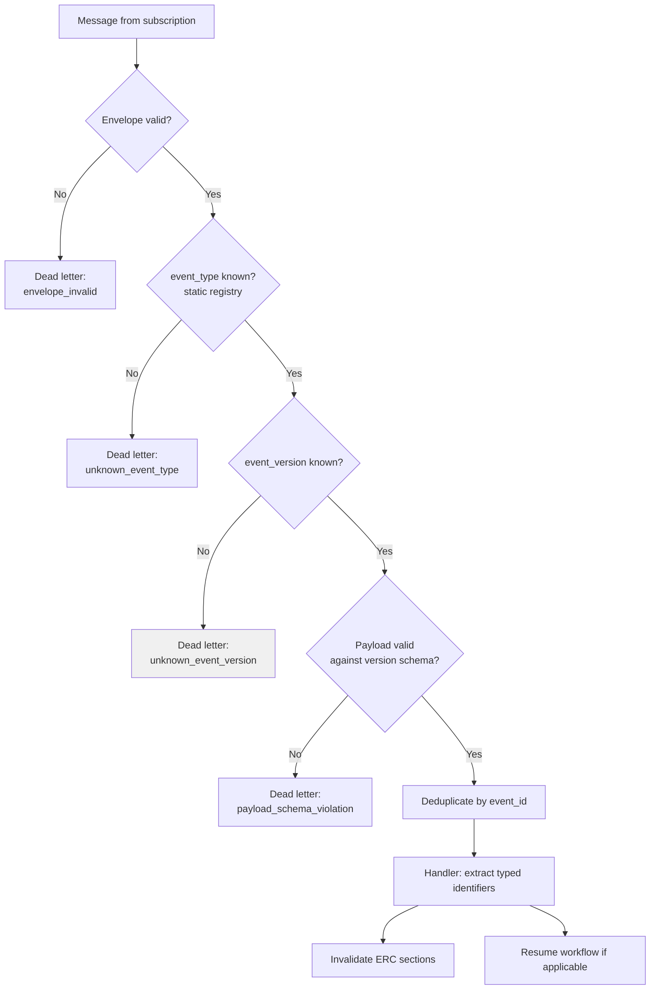

# ADR-D2-17 — Event envelope, schema registry and event contract versioning

## 1. Summary

Event contracts live in the repository as versioned schema files under `contracts/events/`, and
every event is validated against the envelope and its typed payload schema before any handler
sees it. An **unknown event version is rejected, not tolerated** — the same reasoning as
ADR-D2-15's no-defaulting rule, because a partially-understood event triggers a partially-correct
refresh, which is worse than a visible failure.

## 2. Context and Problem Statement

11 PF-FT-AI-SERVICE-BUS.md §11–§24 specify the event contract in detail: contract principles, envelope, event ID,
type, version, source, timestamp, correlation ID, causation ID, workflow instance ID, entity
identity, tenant and organisation context, and payload. 11 PF-FT-AI-SERVICE-BUS.md §36–§37 cover event and schema
validation. 11 PF-FT-AI-SERVICE-BUS.md §38 covers unknown event version and §39 unknown event type. 20.PF-FT-AI-GOVERNANCE.md §73–§74
cover version governance and compatibility.

The envelope is well specified. Three questions are not.

**Where do event schemas live?** `DEVELOPMENT-GUIDE.md` §3 places them at
`contracts/events/{common,affiliation,hil,organization}/*.v1.yaml`, but the specification set does
not say whether they are the platform's copy of enterprise contracts, a shared artefact, or served
from a registry service. That determines what happens when the enterprise changes a contract, and
whether the platform can detect it.

**What does "unknown version" mean in practice?** 11 PF-FT-AI-SERVICE-BUS.md §38 requires handling but not what the
handling is. Three postures are available — reject, best-effort process, or forward-compatible
process — and they differ materially. An event at `v2` when the platform knows `v1` may be
additively compatible, or may have changed the meaning of a field. From outside, they look
identical.

**How much does the platform depend on envelope fields it does not control?** 11 PF-FT-AI-SERVICE-BUS.md §21's
`workflow_instance_id` is the resumption key. If the enterprise does not populate it — or
populates it differently than expected — resumption breaks in a way that looks like missing
events. The platform's dependency on enterprise-populated correlation is worth stating.

The affiliation flow makes the stakes concrete. An `AffiliationApproved` event at an unknown
version arriving for a suspended workflow: reject it and the workflow stays suspended until
reconciliation; process it best-effort and the platform may invalidate the wrong ERC section, or
resume a workflow on a misread event.

## 3. Decision Drivers

### 3.1 Functional drivers

| ID | Driver | Source |
|---|---|---|
| DR-F-01 | Events must carry a defined envelope | 11 PF-FT-AI-SERVICE-BUS.md §13–§24 |
| DR-F-02 | Events must be schema-validated | 11 PF-FT-AI-SERVICE-BUS.md §36–§37 |
| DR-F-03 | Unknown versions and types must be handled explicitly | 11 PF-FT-AI-SERVICE-BUS.md §38–§39 |
| DR-F-04 | Correlation and causation must propagate | 11 PF-FT-AI-SERVICE-BUS.md §19–§20; ADR-D7-03 |
| DR-F-05 | Workflow instance identity must resolve a suspended workflow | 11 PF-FT-AI-SERVICE-BUS.md §21; ADR-D2-10 |
| DR-F-06 | Tenant and organisation context must be present | 11 PF-FT-AI-SERVICE-BUS.md §23 |

### 3.2 Non-functional drivers

| ID | Driver | Target | Source |
|---|---|---|---|
| DR-N-01 | Validation must be fast enough for high event volume | ≤5 ms per event | ADR-D2-16 |
| DR-N-02 | A contract change must be detectable | 0 undetected breaking changes | 20.PF-FT-AI-GOVERNANCE.md §74 |
| DR-N-03 | Schemas must be versioned as artefacts | Immutable per version | 20.PF-FT-AI-GOVERNANCE.md §73 |

### 3.3 Constraints

| ID | Constraint | Type | Source |
|---|---|---|---|
| DR-C-01 | The enterprise owns event contracts | Organisational | 3. PF-FT-AI-RESPONSIBILITY-MATRIX.md §28 |
| DR-C-02 | An event is a notification, not data | Platform | ADR-D2-03 §7.4 |
| DR-C-03 | Payload content must never become prompt instruction | Platform | 11 PF-FT-AI-SERVICE-BUS.md §58 |
| DR-C-04 | Versioned artefacts are immutable | Platform | 20.PF-FT-AI-GOVERNANCE.md §73; ADR-D0-02 §7.3 |

### 3.4 Assumptions

| ID | Assumption | If false | Validation |
|---|---|---|---|
| DR-A-01 | The enterprise populates `workflow_instance_id` for events relating to platform-initiated workflows | Resumption cannot be keyed on it; an alternative correlation is required | Phase 12 integration testing |
| DR-A-02 | The enterprise communicates event contract changes | Changes are discovered by rejection; QM-03 becomes the detection mechanism | QM-03 |
| DR-A-03 | Event versions change infrequently | Rejection-on-unknown creates frequent operational load | QM-03 |

## 4. Evaluation Criteria and Weights

| ID | Criterion | Weight | Rationale | Measurement |
|---|---|---|---|---|
| EC-01 | Correctness of handling under version change | 30 | A misread event triggers a wrong refresh or a wrong resumption, which is silent and consequential | Can a partially-understood event be acted on? |
| EC-02 | Detection of contract change | 25 | Undetected drift means the platform mishandles events while appearing healthy | Is a change detected, and how quickly? |
| EC-03 | Operational impact of strictness | 20 | Rejecting everything unknown could suspend workflows en masse | Workflows stalled per contract change |
| EC-04 | Schema artefact governance | 15 | 20.PF-FT-AI-GOVERNANCE.md §73 requires versioned immutable artefacts | Are schemas versioned and immutable? |
| EC-05 | Implementation and maintenance cost | 10 | Real but subordinate | Effort per event type |
| | **Total** | **100** | | |

Scoring scale: **1** unacceptable · **2** poor · **3** adequate · **4** good · **5** excellent.

## 5. Alternatives Considered

### 5.1 Option A — Envelope validation only; payload treated as opaque

**Description.** Validate the envelope; pass the payload to handlers without schema validation,
letting each handler extract what it needs.

**Strengths.**
- Version-agnostic: a payload change never causes rejection (EC-03 maximised).
- Minimal schema maintenance (EC-05).
- Handlers evolve independently.
- Robust to enterprise variation.

**Weaknesses.**
- No detection of contract change at all — a renamed field silently yields nothing, and the
  handler proceeds with a missing identifier (EC-02 fails).
- Each handler implements its own extraction, so validation quality varies and errors are
  handler-specific.
- A payload whose meaning changed is processed as though unchanged (EC-01 fails).

**Cost / effort.** Lowest, with no change detection.

### 5.2 Option B — Repository-held versioned schemas; strict envelope and payload validation; reject unknown versions

**Description.** Schemas live under `contracts/events/` as versioned immutable files. Every event
is validated against the envelope and its typed payload schema for its declared version. An
unknown version or type is rejected to the dead-letter queue with a distinct reason.

**Strengths.**
- A partially-understood event is never acted on (EC-01).
- An unknown version is immediately visible as a dead-letter with a specific reason, detected in
  minutes (EC-02).
- Schemas are versioned, immutable, diffable and reviewable, satisfying 20.PF-FT-AI-GOVERNANCE.md §73 (EC-04).
- Handlers receive typed payloads, so extraction is uniform.
- Consistent with ADR-D2-15's posture for API contracts.

**Weaknesses.**
- An enterprise version bump stalls affected workflows until the platform adds the schema (EC-03).
- Schemas must be authored per event type per version (EC-05).
- The platform holds a copy of contracts the enterprise owns, which can drift.

**Cost / effort.** Moderate.

### 5.3 Option C — Forward-compatible processing of unknown versions

**Description.** Validate against the highest known schema, ignore unknown fields, and process if
all required fields are present. Log the version gap.

**Strengths.**
- Additive enterprise changes flow through without platform work (EC-03).
- No workflow stalls on a minor version bump.
- Still detects a missing required field.
- Logging provides a signal.

**Weaknesses.**
- Cannot distinguish additive from semantic change. If `v2` redefined a field's meaning, all
  required fields are present and the event is processed wrongly (EC-01 fails).
- A log is not a control; the version gap is detected only if read, while events process
  incorrectly meanwhile (EC-02 weakened).
- The failure is silent and affects workflow resumption — the platform advances a workflow on a
  misread event.

**Cost / effort.** Moderate, with a silent failure mode.

### 5.4 Option D — External schema registry service

**Description.** Schemas are served from a shared registry (Azure Schema Registry or equivalent);
the platform resolves them at runtime.

**Strengths.**
- Single shared source of truth with the enterprise; no platform copy to drift (EC-02, EC-04).
- New versions available immediately without a platform release.
- Standard pattern for event-driven estates.
- Producer and consumer verified against the same artefact.

**Weaknesses.**
- Introduces a runtime dependency on the registry; its unavailability halts event processing.
- Requires the enterprise to operate and populate a registry — unvalidated, and a substantial
  organisational dependency.
- Schemas resolved at runtime are not reviewable in the platform's change process; a schema could
  change without any platform review.
- Contradicts the repository-based approach `DEVELOPMENT-GUIDE.md` §3 already anticipates.

**Cost / effort.** Moderate, on an unvalidated organisational dependency.

## 6. Evaluation Method and Decision Matrix

**Method.** Weighted scoring against §4, tested against a specific case: `AffiliationApproved`
arrives at `v2` where the platform knows `v1`, and `v2` changed the meaning of a status field.

| Criterion | Weight | A: Envelope only | B: Repo schemas + reject | C: Forward-compatible | D: Registry service |
|---|---|---|---|---|---|
| EC-01 Correctness under change | 30 | 1 | 5 | 2 | 4 |
| EC-02 Change detection | 25 | 1 | 5 | 3 | 4 |
| EC-03 Operational impact | 20 | 5 | 3 | 5 | 4 |
| EC-04 Schema governance | 15 | 1 | 5 | 3 | 4 |
| EC-05 Cost | 10 | 5 | 3 | 4 | 3 |
| **Weighted total** | **100** | **215** | **445** | **330** | **400** |

- **Option B:** (30×5) + (25×5) + (20×3) + (15×5) + (10×3) = 150 + 125 + 60 + 75 + 30 = **445**

**Sensitivity.** B leads D by 45 points and C by 115. B's weakness is operational impact, worth
20 points, and §7.4 addresses it directly by distinguishing what stalls from what does not. D is
the better long-term answer if the enterprise operates a registry, and is recorded as RT-05 rather
than adopted on an unvalidated premise. C's failure is the one that matters: it cannot tell an
additive change from a semantic one, and processes both.

## 7. Decision

### 7.1 Schemas live in the repository, versioned and immutable

Event schemas are files under `contracts/events/`, organised as `DEVELOPMENT-GUIDE.md` §3
anticipates:

```
contracts/events/
├── common/          envelope schema, shared types
├── affiliation/     affiliation.approved.v1.yaml, affiliation.cancelled.v1.yaml, …
├── hil/             review decision events
└── organization/    club, team, official change events
```

A schema file is **immutable once merged**, per 20.PF-FT-AI-GOVERNANCE.md §73 and ADR-D0-02's identity principle. A
contract change is a new file at a new version, never an edit — so the platform can always
interpret an event at the version it declares, including a version it has since superseded.

The schemas are the platform's declaration of what it understands. They are derived from the
enterprise's contracts and reviewed as part of integration mapping (ADR-D2-14), which is where
DR-C-01's enterprise ownership and the platform's need for a reviewable artefact are reconciled.

### 7.2 The envelope

Per 11 PF-FT-AI-SERVICE-BUS.md §13–§24, every event carries:

| Field | 11 PF-FT-AI-SERVICE-BUS.md | Platform use |
|---|---|---|
| `event_id` | §14 | Deduplication key (ADR-D2-18) |
| `event_type` | §15 | Handler resolution — a static registry lookup, never interpreted |
| `event_version` | §16 | Schema selection; rejection if unknown (§7.3) |
| `event_source` | §17 | Provenance and routing |
| `timestamp` | §18 | Staleness detection (11 PF-FT-AI-SERVICE-BUS.md §47) |
| `correlation_id` | §19 | Trace continuity (ADR-D7-03) |
| `causation_id` | §20 | Causal chain |
| `workflow_instance_id` | §21 | **Resumption key** (ADR-D2-10) |
| `entity_identity` | §22 | Which ERC sections to invalidate |
| `tenant` / `organization` | §23 | Isolation boundary |
| `payload` | §24 | Typed per event type and version |

`event_type` selects a handler by static registry lookup. It is never parsed, pattern-matched or
interpreted — which is part of what closes 11 PF-FT-AI-SERVICE-BUS.md §58's injection path (ADR-D2-03 §7.4).

### 7.3 Unknown version or type is a rejection

| Condition | Handling |
|---|---|
| Known type, known version | Validate payload against that version's schema; dispatch to handler |
| Known type, **unknown version** | **Reject to dead letter**, reason `unknown_event_version`. Do not process. |
| **Unknown type** | **Reject to dead letter**, reason `unknown_event_type`. Do not process. |
| Known type and version, payload fails schema | Reject to dead letter, reason `payload_schema_violation` |
| Envelope malformed | Reject to dead letter, reason `envelope_invalid` |

The reasoning for rejecting an unknown version mirrors ADR-D2-15 §7.3's no-defaulting rule.
Processing an event the platform does not fully understand means triggering a refresh or a
resumption on a partial reading. For affiliation, that could mean invalidating the wrong section,
or advancing a workflow on a status the platform misread. A dead-lettered event is visible,
diagnosable and replayable once the schema is added. A misprocessed event is none of those.

Rejection is **not** dropping. Every rejected event sits in the dead-letter queue with its reason,
monitored per ADR-D2-18, and can be replayed after the schema is added. 11 PF-FT-AI-SERVICE-BUS.md §39's requirement
that unknown types be handled explicitly is satisfied by the reason code, not by silence.

### 7.4 Rejection does not stall a workflow indefinitely

Option B's operational weakness is that a version bump could leave workflows suspended. Two
mitigations bound it:

- **Reconciliation is the backstop.** ADR-D2-10 §7.6's sweep detects workflows suspended past
  their expected window and refreshes state directly from the enterprise. A workflow whose
  resumption event was rejected still resumes, later and by a different route.
- **Dead-letter depth alerts immediately.** A version bump produces a sharp rise in
  `unknown_event_version` rejections, which is a specific, actionable signal — far better than the
  diffuse symptoms of Option C's silent misprocessing.

So a version bump degrades resumption latency rather than breaking it, and it does so visibly.

### 7.5 Correlation and the enterprise dependency

`workflow_instance_id` (11 PF-FT-AI-SERVICE-BUS.md §21) is the resumption key. It exists only if the enterprise
populates it, which requires the platform to have supplied it when initiating the operation, and
the enterprise to echo it on resulting events.

DR-A-01 flags this as an assumption. Where it does not hold, resumption falls back to
`entity_identity` plus workflow lookup — less precise, since a club may have several workflows —
and where neither resolves, the event invalidates ERC sections without resuming, leaving
reconciliation to complete the workflow.

Recording this matters because a missing correlation field presents as missing events. The
distinction is diagnosable only if the fallback is explicit and instrumented (QM-05).

### 7.6 Payload types are for extraction, not for prompts

The typed payload gives handlers structured access to identifiers. It does not make payload
content usable as prompt content. Per ADR-D2-03 §7.4 and 11 PF-FT-AI-SERVICE-BUS.md §58, handlers extract typed
identifiers and use them to invalidate and refresh; no payload field reaches a prompt as
instruction or as an ERC fact.

Typing strengthens this rather than weakening it: a handler reads `application_id: str` from a
validated schema, not free text from an untyped map.

**Status rationale.** Accepted. Tier 1 under ADR-D0-03 §7.1 — eventing is a named 2. PF-FT-AI-ARCHITECTURE-DETAILED.md §52
category — ratified by the external ADF/ADR governance forum.

## 8. Architecture Detail

### 8.1 Validation pipeline



Four distinct dead-letter reasons rather than one. Reason codes are what make dead-letter depth a
diagnostic signal instead of a number: a spike in `unknown_event_version` means a contract change,
while a spike in `envelope_invalid` means something quite different.

### 8.2 A version bump, worked

The enterprise releases `affiliation.approved.v2`:

| Time | Event |
|---|---|
| T+0 | First `v2` event arrives; rejected as `unknown_event_version`; dead-lettered |
| T+minutes | Dead-letter alert fires with the reason code; the version gap is unambiguous |
| T+hours | Platform reviews `v2` against `v1`, authors `affiliation.approved.v2.yaml`, updates the handler if the semantics changed, releases |
| T+release | Dead-lettered `v2` events are replayed and processed correctly |
| Meanwhile | Affected workflows resume via reconciliation (ADR-D2-10 §7.6), with degraded latency |

Under Option C, T+0 through T+release would have looked healthy while workflows advanced on a
possibly-misread status — and nobody would have known to look.

### 8.3 Schema authoring and review

| Step | Owner |
|---|---|
| Enterprise publishes or changes a contract | Enterprise |
| Platform derives the schema file at its version | AI Engineering |
| Schema reviewed against the enterprise contract during integration mapping | AI Engineering + owning team |
| Merged as an immutable versioned file | AI Engineering |
| Handler updated if semantics changed | AI Engineering |

The review step is where the platform's copy is reconciled with the enterprise's contract. It is
also where a semantic change is caught — a `v2` that renamed nothing but redefined a status is
exactly what Option C could not see and a human review can.

## 9. Consequences

### 9.1 Positive

- A partially-understood event is never acted on, so no workflow advances on a misread status.
- A contract change surfaces within minutes as a specific dead-letter reason.
- Schemas are versioned, immutable and reviewable in the platform's normal change process.
- Handlers receive typed payloads, so extraction is uniform and injection paths stay closed.
- Four distinct rejection reasons make dead-letter depth diagnostic.

### 9.2 Negative

- A version bump stalls affected resumptions until the schema is added, degrading latency until
  the release.
- Schemas must be authored per event type per version, and the platform holds a copy of contracts
  the enterprise owns.
- Copy drift is possible between platform schema and enterprise contract, mitigated by review but
  not eliminated.
- Depends on the enterprise populating `workflow_instance_id` (DR-A-01).

### 9.3 Neutral

- Schema location follows `DEVELOPMENT-GUIDE.md` §3's existing structure.
- A registry service remains the better long-term answer if the enterprise operates one.

### 9.4 Trade-offs explicitly accepted

| Given up | In exchange for | Accepted by |
|---|---|---|
| Automatic handling of new event versions | Never acting on a partially-understood event | External ADF/ADR forum |
| Resumption latency during a version gap | Visible, specific detection of contract change | AI Platform Owner |
| A single shared schema source | Schemas reviewable in the platform's change process | AI Solution Architect |

## 10. Golden-Rule and Precedence Conformance

| Constraint | Conformance |
|---|---|
| Enterprise decides; AI orchestrates | Schemas describe what the enterprise publishes; the platform reads them. It does not extend or reinterpret a contract to make an event processable. |
| Authoritative-truth precedence | §7.6: typed payloads give identifiers, not facts. Authoritative values come from the refresh, so no event field enters ERC at authority 5. |
| Four-state separation | Envelope identifiers link to Workflow State and Conversation State; payload identifiers address Enterprise Business State for refresh. None is conflated. |
| Versioned artefacts, never mutated in place | §7.1: schema files are immutable once merged; a change is a new version. This is 20.PF-FT-AI-GOVERNANCE.md §73 applied to event contracts. |
| Adam persona governs how, never what | Events produce no user-facing language directly. |

## 11. Risks and Mitigations

| ID | Risk | Likelihood | Impact | Exposure | Mitigation | Owner | Residual |
|---|---|---|---|---|---|---|---|
| RSK-01 | Enterprise version bump stalls resumptions (DR-A-03) | Medium | Medium | Medium | §7.4's reconciliation backstop and immediate alerting; rapid schema-addition path | AI Engineering Lead | Medium |
| RSK-02 | Platform schema drifts from the enterprise contract | Medium | High | High | Review at integration mapping (§8.3); rejections detect drift as `payload_schema_violation`; QM-03 | AI Engineering Lead | Medium |
| RSK-03 | `workflow_instance_id` not populated (DR-A-01) | Medium | High | High | §7.5's documented fallback; QM-05 makes it diagnosable rather than presenting as missing events | AI Engineering Lead | Medium |
| RSK-04 | A schema file is edited rather than versioned | Low | High | Medium | Immutability enforced by review; a modified merged schema file fails the check; QM-04 | AI Solution Architect | Low |
| RSK-05 | Dead-lettered events accumulate unreplayed after a schema is added | Medium | Medium | Medium | Replay is part of the schema-addition procedure; dead-letter depth monitored (ADR-D2-18) | Operations/SRE | Low |
| RSK-06 | Payload typing is used to justify passing content to prompts | Low | Very High | High | §7.6; ADR-D2-03 AC-05's static analysis for payload-to-prompt paths | Security Owner | Low |

## 12. Quantitative Targets and Measures

| ID | Measure | Target | Threshold (alert) | Source | Review cadence |
|---|---|---|---|---|---|
| QM-01 | Events processed without full envelope and payload validation | 0 | ≥1 | Consumer audit | Daily |
| QM-02 | Dead-letter volume by reason code | Tracked | Any spike >3× baseline | Dead-letter metrics | Daily |
| QM-03 | `unknown_event_version` or `payload_schema_violation` rejections | 0 in steady state | ≥1 | Dead-letter metrics | Daily |
| QM-04 | Merged schema files modified after merge | 0 | ≥1 | Git history audit | Per release |
| QM-05 | Events resolved by fallback rather than `workflow_instance_id` | ≤5% | >20% | Handler metrics | Weekly |
| QM-06 | Dead-lettered events unreplayed after their schema was added | 0 | ≥1 | Dead-letter reconciliation | Weekly |

QM-03's steady-state zero is the change-detection signal: any occurrence means the enterprise
contract moved and the platform has not caught up.

## 13. Security, Privacy and Compliance Impact

| Dimension | Impact |
|---|---|
| Attack surface change | Strict envelope and payload validation before any handler runs means malformed or unexpected messages cannot reach handler logic. Static `event_type` lookup means the type field cannot be used to reach unintended code. |
| Data classification touched | Envelopes carry identifiers and tenant context; payloads carry identifiers by design (11 PF-FT-AI-SERVICE-BUS.md §24). |
| Personal data / PII | Typed schemas make explicit what fields an event carries, so an event carrying unexpected personal data fails validation rather than being processed — a minimisation control at the boundary. |
| Children's data and safeguarding | Compliance-related events carry identifiers, and the safeguarding status comes from the refresh. A `v2` compliance event redefining a field is exactly what §7.3's rejection prevents being misread — a misread clearance status is a safeguarding failure. |
| UK GDPR lawful basis and rights impact | Tenant and organisation context (11 PF-FT-AI-SERVICE-BUS.md §23) enforces isolation; typed payloads support minimisation. |
| Audit and evidential requirements | `correlation_id` and `causation_id` give an unbroken chain from enterprise decision to platform action (20.PF-FT-AI-GOVERNANCE.md §71's HIL evidence). |
| Standards touched | ISO/IEC 27001 A.8.26 (application security requirements), A.8.28; ISO/IEC 42001 (data quality); UK GDPR Art. 5(1)(c), 32. |

## 14. Implementation Impact

| Aspect | Detail |
|---|---|
| Build phases | 12 |
| Repository paths | `src/pf_ft_ai/messaging/events/` — models, envelope, validator, registry, serializer; `contracts/events/` |
| Configuration | Handler registry mapping type and version to handler |
| Contracts / schemas | Envelope schema; per-type per-version payload schemas |
| Migration | None |
| Dependencies on other ADRs | ADR-D2-16 (consumption), ADR-D2-18 (dead-letter handling), ADR-D5-06 (versioned artefacts) |
| Effort estimate | Moderate, proportional to event type count |

## 15. Validation and Verification

| ID | Acceptance criterion | Verification method |
|---|---|---|
| AC-01 | No handler runs without envelope and payload validation | Consumer test; QM-01 |
| AC-02 | An unknown event version is dead-lettered with the specific reason | Version test |
| AC-03 | An unknown event type is dead-lettered with the specific reason | Type test |
| AC-04 | `event_type` resolves by static registry lookup, never by parsing | Code audit |
| AC-05 | A merged schema file is immutable | Git history check; QM-04 |
| AC-06 | Dead-lettered events replay correctly after a schema is added | Replay test |
| AC-07 | An event lacking `workflow_instance_id` resolves by fallback and is recorded as such | Fallback test; QM-05 |

## 16. Operational Impact

| Aspect | Detail |
|---|---|
| Monitoring | Dead-letter volume by reason; validation latency; fallback resolution rate |
| Alerting | QM-01 and QM-04 on any occurrence; QM-03 on any occurrence in steady state; dead-letter depth |
| Runbook | `docs/runbooks/service-bus-dlq.md` — includes the schema-addition and replay procedure |
| Failure mode and degradation | A version gap degrades resumption latency; reconciliation completes the workflows. Nothing is lost, and the cause is unambiguous from the reason code. |
| Rollback | Schemas are additive; adding one cannot break an older version, since files are immutable |
| Support model impact | Reason codes make dead-letter triage immediate |

## 17. Cost Impact

| Cost element | One-off | Recurring | Basis |
|---|---|---|---|
| Envelope and validation implementation | Phase 12 | — | `DEVELOPMENT-GUIDE.md` §4 |
| Schema authoring | — | Per event type per version | §8.3 |
| Validation overhead | — | ≤5 ms per event | DR-N-01 |
| Replay after version addition | — | Per version gap | Bounded by dead-letter volume |

## 18. Revisit Triggers and Causal Analysis Hooks

| ID | Trigger | Detected by | Action on trigger |
|---|---|---|---|
| RT-01 | QM-03 records rejections in steady state | Daily | Enterprise contract changed; add the schema and replay |
| RT-02 | QM-05 shows fallback resolution above 20% (DR-A-01) | Weekly | `workflow_instance_id` is not being populated reliably; raise with the enterprise |
| RT-03 | Version bumps become frequent (DR-A-03 false) | Quarterly review | Reconsider forward compatibility for *additive-only* versions, with enterprise confirmation that a version is additive |
| RT-04 | QM-04 records a modified schema file | Release review | Immutability breached; restore and version properly |
| RT-05 | The enterprise operates an event schema registry | Enterprise roadmap | Reconsider Option D; runtime resolution would still need review gating |
| RT-06 | Dead-letter depth grows faster than replay | Daily | Schema-addition throughput is the bottleneck, not the policy |

**Scheduled review:** 2027-08-21.

## 19. Traceability

| Dimension | Reference |
|---|---|
| Workshop sheet | WS-11 Event Notification & Real-Time Synchronization |
| Specification sections | 11 PF-FT-AI-SERVICE-BUS.md §11–§12 (Event Contract, Principles), §13 (Envelope), §14–§18 (ID, Type, Version, Source, Timestamp), §19–§20 (Correlation, Causation), §21 (Workflow Instance ID), §22–§23 (Entity Identity, Tenant Context), §24 (Payload), §36–§37 (Event and Schema Validation), §38 (Unknown Event Version), §39 (Unknown Event Type), §58; 20.PF-FT-AI-GOVERNANCE.md §73–§74 (Version Governance, Compatibility); `DEVELOPMENT-GUIDE.md` §3 |
| Requirement IDs | `NFR-A38-REL`, `NFR-A38-VER` |
| Build phases | 12 |
| Code paths | `src/pf_ft_ai/messaging/events/`, `contracts/events/` |
| Configuration | Handler registry |
| Tests | AC-01 to AC-07 |
| Upstream ADRs | ADR-D2-16 |
| Downstream ADRs | ADR-D2-18, ADR-D4-06, ADR-D7-03 |

## 20. Change Log

| Version | Date | Author | Change |
|---|---|---|---|
| 1.0.0 | 2026-08-21 | AI Solution Architect | Initial decision recorded. Repository-held immutable versioned schemas with strict envelope and payload validation; unknown version and type rejected to dead letter with distinct reason codes rather than processed forward-compatibly, since additive and semantic changes are indistinguishable from outside; reconciliation bounds the operational cost. Tier 1 — ratified by the external ADF/ADR forum. |
