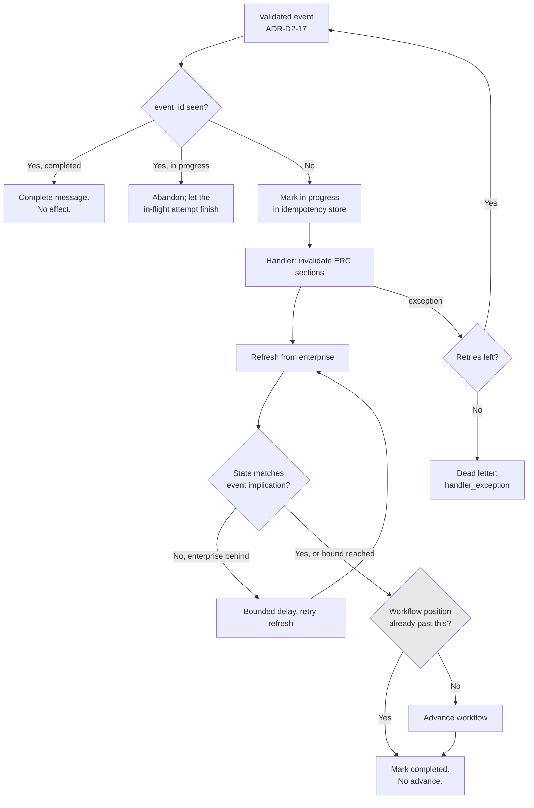

# ADR-D2-18 — Message reliability: deduplication, idempotency, dead-lettering and reconciliation

## 1. Summary

At-least-once delivery is handled by making event processing idempotent at two levels — event ID
deduplication and workflow position checking — rather than by trying to achieve exactly-once.
Ordering is not assumed: the platform reacts to **current enterprise state** rather than to
arrival order, which makes out-of-order events self-correcting. Reconciliation is a periodic
backstop, and it is deliberately kept a backstop.

## 2. Context and Problem Statement

11 PFF-FA-AI-SERVICE-BUS.md §40–§44 cover idempotency, keys, store, states and concurrent duplicates. §45–§47 cover
ordering, sequence and stale events. §48–§49 cover eventual consistency and event-to-enterprise
verification. §56 covers resume safety. 3. PFF-FA-AI-RESPONSIBILITY-MATRIX.md §37 assigns idempotency responsibility. 4. PFF-FA-AI-RUNTIME.md §47
covers the Service Bus runtime.

Service Bus gives at-least-once delivery. Duplicates are normal — a lock expiring during a slow
handler produces one, as does a consumer restart mid-processing. Out-of-order delivery is also
normal across partitions and after retries.

The affiliation flow shows what these mean in practice, and none of the failures is theoretical:

- A duplicate `AffiliationApproved` could advance a workflow twice, potentially producing two
  invoices from one approval.
- An `AffiliationCancelled` arriving *before* the `AffiliationApproved` it superseded — because
  the approval was retried after a transient failure — could leave the platform believing an
  application is approved when the county cancelled it.
- Scenario 12's 31 May timer cancellation arriving for a workflow that already completed.

Three questions are open.

**How far to pursue exactly-once?** Service Bus offers duplicate detection windows and sessions
for ordering. Both narrow the problem and neither eliminates it, and both add constraints — a
duplicate-detection window has a finite duration; sessions serialise processing per session key,
which limits throughput.

**What idempotency key?** 11 PFF-FA-AI-SERVICE-BUS.md §41 requires one. Event ID is the obvious choice and catches only
literal redelivery of the same message. Two distinct events describing the same enterprise
transition — an approval published twice with different event IDs after a producer retry — would
both process.

**When does reconciliation run and what does it do?** ADR-D2-10 §7.6 established it as a backstop.
The risk is that a backstop which works well quietly becomes the primary mechanism, hiding a
broken event path.

## 3. Decision Drivers

### 3.1 Functional drivers

| ID | Driver | Source |
|---|---|---|
| DR-F-01 | Event processing must be idempotent | 11 PFF-FA-AI-SERVICE-BUS.md §40–§44; 3. PFF-FA-AI-RESPONSIBILITY-MATRIX.md §37 |
| DR-F-02 | Concurrent duplicates must be handled | 11 PFF-FA-AI-SERVICE-BUS.md §44 |
| DR-F-03 | Ordering must not be assumed | 11 PFF-FA-AI-SERVICE-BUS.md §45–§46 |
| DR-F-04 | Stale events must be detected | 11 PFF-FA-AI-SERVICE-BUS.md §47 |
| DR-F-05 | Eventual consistency must be accommodated | 11 PFF-FA-AI-SERVICE-BUS.md §48 |
| DR-F-06 | Resume must be safe against duplicate and stale triggers | 11 PFF-FA-AI-SERVICE-BUS.md §56; ADR-D2-10 §7.5 |

### 3.2 Non-functional drivers

| ID | Driver | Target | Source |
|---|---|---|---|
| DR-N-01 | No workflow advanced twice by a duplicate | 0 double advances | ADR-D2-10 QM-07 |
| DR-N-02 | Reconciliation must stay a backstop | ≤5% of resumptions | ADR-D2-10 QM-04 |
| DR-N-03 | Dead-lettered events must be visible and replayable | 0 silent losses | ADR-D2-17 §7.3 |

### 3.3 Constraints

| ID | Constraint | Type | Source |
|---|---|---|---|
| DR-C-01 | An event is a notification; authoritative values come from a refresh | Platform | ADR-D2-03 §7.4 |
| DR-C-02 | Blind retry of enterprise transactions is forbidden | Platform | 2. PFF-FA-AI-ARCHITECTURE-DETAILED.md §48; ADR-D2-11 |
| DR-C-03 | The platform is a pure consumer | Platform | ADR-D2-16 §7.1 |
| DR-C-04 | Idempotency state must be separated by key namespace | Platform | ADR-D4-12 |

### 3.4 Assumptions

| ID | Assumption | If false | Validation |
|---|---|---|---|
| DR-A-01 | Reacting to current enterprise state makes ordering largely irrelevant | Explicit sequencing is needed, requiring sessions | Phase 12 out-of-order testing |
| DR-A-02 | Duplicate rates are low enough that a bounded dedup window suffices | A longer window or a different key is needed | QM-02 |
| DR-A-03 | Reconciliation frequency can be low because events are reliable | Reconciliation load grows and DR-N-02 fails | QM-04 |

## 4. Evaluation Criteria and Weights

| ID | Criterion | Weight | Rationale | Measurement |
|---|---|---|---|---|
| EC-01 | Prevention of duplicate effects | 30 | A doubled advance could produce two invoices for one approval | Can a duplicate produce a second effect? |
| EC-02 | Correctness under out-of-order delivery | 25 | An approval processed after a cancellation would leave the platform wrong about the application | Does arrival order affect the outcome? |
| EC-03 | No silent loss | 20 | A lost event leaves a workflow suspended with no signal | Can an event be dropped without a trace? |
| EC-04 | Operational simplicity | 15 | Messaging reliability is easy to over-engineer | Mechanisms to operate and reason about |
| EC-05 | Throughput | 10 | Seasonal affiliation bursts | Events per second achievable |
| | **Total** | **100** | | |

Scoring scale: **1** unacceptable · **2** poor · **3** adequate · **4** good · **5** excellent.

## 5. Alternatives Considered

### 5.1 Option A — Rely on broker duplicate detection and sessions for ordering

**Description.** Use Service Bus duplicate detection with a configured window, and sessions keyed
by workflow instance to guarantee ordered processing.

**Strengths.**
- Broker-provided; little platform code (EC-04 for code, at least).
- Sessions give genuine per-key ordering (EC-02).
- Duplicate detection handles literal redelivery within the window (EC-01, partially).
- Well-understood Azure patterns.

**Weaknesses.**
- Duplicate detection is bounded by a window; a redelivery outside it is not caught, and an
  affiliation workflow suspended for days easily exceeds any practical window (EC-01 incomplete).
- Sessions serialise per session key, which limits throughput and creates head-of-line blocking:
  one slow event for a club blocks all subsequent events for that club (EC-05).
- Two distinct events describing the same transition have different IDs and both pass duplicate
  detection.
- Ordering guarantees do not help with the real problem, which is that the platform's *state*
  must be right, not its *processing order*.

**Cost / effort.** Low code, meaningful operational constraints.

### 5.2 Option B — Application-level idempotency with state-based reconciliation, no ordering assumption

**Description.** Deduplicate on event ID with a persisted idempotency store (11 PFF-FA-AI-SERVICE-BUS.md §42–§43).
Additionally check workflow position before advancing. Do not assume ordering; instead, every
event triggers a refresh and the workflow reacts to **current** enterprise state. Dead-letter
anything unprocessable. Reconcile periodically as a backstop.

**Strengths.**
- Two independent duplicate defences: event ID for literal redelivery, workflow position for
  distinct events describing the same transition (EC-01).
- Out-of-order delivery is self-correcting, because the outcome depends on current state rather
  than arrival order (EC-02) — an approval arriving after a cancellation refreshes and finds the
  application cancelled.
- Dead-lettering with reason codes gives full visibility (EC-03).
- No session constraint, so throughput scales with consumer replicas (EC-05).
- Consistent with ADR-D2-03 §7.4's notification model — the refresh is doing the work.

**Weaknesses.**
- Idempotency store to operate and expire (11 PFF-FA-AI-SERVICE-BUS.md §42).
- Every event costs a refresh call, even where the payload would have sufficed.
- Reconciliation is another moving part.
- Relies on DR-A-01: state-based reaction genuinely covering ordering.

**Cost / effort.** Moderate.

### 5.3 Option C — Sequence-number ordering with buffering

**Description.** Use 11 PFF-FA-AI-SERVICE-BUS.md §46's event sequence to detect gaps, buffering out-of-order events
until predecessors arrive.

**Strengths.**
- Strict ordering without session throughput limits.
- Gaps are explicitly detected rather than inferred.
- Events processed in the producer's intended order.

**Weaknesses.**
- Requires the enterprise to emit reliable per-entity sequence numbers — unvalidated, and a
  substantial producer-side requirement.
- Buffering introduces unbounded wait: a permanently missing predecessor stalls everything after
  it, converting a lost event into a blocked stream.
- Substantial complexity for a problem Option B dissolves rather than solves.
- Still needs deduplication and dead-lettering alongside.

**Cost / effort.** High, on an unvalidated producer dependency.

### 5.4 Option D — Reconciliation-first: poll enterprise state, treat events as hints

**Description.** Primary mechanism is periodic reconciliation of suspended workflows; events merely
trigger an earlier reconciliation.

**Strengths.**
- Extremely robust — a lost event delays nothing beyond the reconciliation interval.
- Ordering and duplicates become irrelevant.
- Simple mental model: state is checked, not tracked.
- No idempotency store.

**Weaknesses.**
- Enterprise load: reconciling every suspended workflow across a county during an affiliation
  window is exactly the polling cost ADR-D2-16 rejected.
- Latency is the reconciliation interval; DR-N-01's 60-second event target becomes unreachable.
- Makes reconciliation the primary path, which DR-N-02 explicitly resists — the platform would
  never learn that its event path was broken.

**Cost / effort.** Low to build, expensive to run.

## 6. Evaluation Method and Decision Matrix

**Method.** Weighted scoring against §4, tested against three cases: duplicate
`AffiliationApproved`; `AffiliationCancelled` arriving before the approval it supersedes; and a
lost `PaymentConfirmed`.

| Criterion | Weight | A: Broker features | B: App idempotency + state | C: Sequence buffering | D: Reconciliation-first |
|---|---|---|---|---|---|
| EC-01 Duplicate prevention | 30 | 3 | 5 | 4 | 5 |
| EC-02 Out-of-order correctness | 25 | 4 | 5 | 4 | 5 |
| EC-03 No silent loss | 20 | 3 | 5 | 3 | 5 |
| EC-04 Operational simplicity | 15 | 3 | 4 | 1 | 4 |
| EC-05 Throughput | 10 | 2 | 5 | 3 | 2 |
| **Weighted total** | **100** | **325** | **480** | **340** | **460** |

- **Option B:** (30×5) + (25×5) + (20×5) + (15×4) + (10×5) = 150 + 125 + 100 + 60 + 50 = **480**

**Sensitivity.** B leads D by 20 points — close on the matrix and not close in practice, because
D's weakness is enterprise load and latency, which the scoring under-weights relative to their
operational reality during a seasonal window. D is adopted *as the backstop* (§7.5), which is
where its robustness is valuable and its cost is bounded. C's dependency on enterprise sequence
numbers is unvalidated and its buffering converts a lost event into a blocked stream.

## 7. Decision

### 7.1 Two independent duplicate defences

| Level | Mechanism | Catches |
|---|---|---|
| **Event ID deduplication** | Persisted idempotency store keyed on `event_id` (11 PFF-FA-AI-SERVICE-BUS.md §41–§43), with states per 11 PFF-FA-AI-SERVICE-BUS.md §43 | Literal redelivery of the same message, including after a consumer restart |
| **Workflow position check** | Before advancing, compare the workflow's current position against what the event implies | Distinct events describing the same transition; late events for an already-advanced workflow |

Neither alone is sufficient. Event ID misses a producer retry that generated a new ID; position
checking misses a duplicate arriving before the first was processed. Together they cover both, and
11 PFF-FA-AI-SERVICE-BUS.md §44's concurrent-duplicate case is handled by the idempotency store's in-progress state
plus single-flight resume (ADR-D2-10 §7.5).

The idempotency store lives in its own key namespace (DR-C-04, ADR-D4-12), separate from cache and
memory, with entries retained long enough to cover realistic redelivery — which, given multi-day
suspensions, is longer than a broker duplicate-detection window would allow.

### 7.2 Ordering is not assumed; state decides

The platform does **not** attempt ordered processing. Instead, per ADR-D2-03 §7.4 and ADR-D2-10
§7.2, every event triggers invalidate-and-refresh, and the workflow reacts to what the refresh
returns.

This dissolves the ordering problem rather than solving it:

| Arrival order | What happens |
|---|---|
| Approval then cancellation | Approval refreshes → `INVOICED`; workflow advances. Cancellation refreshes → `CANCELLED`; workflow takes the cancellation branch. Correct. |
| **Cancellation then approval** | Cancellation refreshes → `CANCELLED`; workflow takes the cancellation branch. Approval refreshes → still `CANCELLED`; position check finds the workflow terminal; no advance. Correct. |
| Duplicate approval | First refreshes and advances. Second is caught by event ID, or by position check if the ID differs. Correct. |

The middle row is the important one and is why Option C's buffering is unnecessary: the platform
does not need the approval to be processed before the cancellation, because it never trusts either
event's content. It asks the enterprise, and the enterprise's answer is order-independent.

11 PFF-FA-AI-SERVICE-BUS.md §47's stale-event handling falls out of the same mechanism: an event describing a
transition the enterprise has already moved past produces a refresh showing current state, and the
workflow acts on that.

### 7.3 Dead-lettering, never dropping

Per ADR-D2-17 §7.3, anything unprocessable goes to the dead-letter queue with a reason code, never
dropped. Handler failures are added to that set:

| Reason | Source |
|---|---|
| `envelope_invalid`, `unknown_event_type`, `unknown_event_version`, `payload_schema_violation` | ADR-D2-17 §7.3 |
| `handler_exception` | Handler failed after retries |
| `workflow_not_found` | No workflow matched, and no fallback resolved it (ADR-D2-17 §7.5) |
| `authorization_revalidation_failed` | Captured context invalid (ADR-D2-03 §7.3) — state updated, event dead-lettered for visibility |

Delivery retries are bounded before dead-lettering: a handler exception retries with backoff, and
a persistently failing message is dead-lettered rather than blocking the subscription. Dead-letter
depth by reason is the platform's primary event-health signal (ADR-D2-17 §8.1).

### 7.4 Handler retry does not retry enterprise operations

An important distinction, given DR-C-02. When a handler fails and the message is redelivered, the
handler runs again — but the handler's work is invalidate-and-refresh, which is a **read**. It does
not re-attempt an enterprise write.

Where a handler's continuation would involve a write, that write goes through the tool executor
under ADR-D2-11's policy, with its own idempotency and unknown-outcome handling. Message
redelivery never becomes blind transaction retry, because the message handler does not hold write
semantics.

### 7.5 Reconciliation is a backstop, and is measured as one

Per ADR-D2-10 §7.6, a periodic sweep identifies workflows suspended past their expected window and
refreshes their state directly.

Three rules keep it a backstop:

1. **It refreshes; it does not re-attempt.** Like a handler, it reads current enterprise state. For
   an operation left UNKNOWN by ADR-D2-11 §7.4, it retries *verification*, never the operation.
2. **Its share is measured.** ADR-D2-10 QM-04 tracks resumptions triggered by reconciliation
   versus by event, with a 5% target and a 20% alert. Above that, the event path is broken and
   should be fixed rather than compensated for.
3. **Its frequency is bounded by expected windows, not by a fixed poll.** It sweeps workflows past
   their window, not all workflows, so its load is proportional to the failure rate rather than to
   the population.

Rule 2 is what prevents Option D by drift. A backstop that silently absorbs a broken event path is
worse than no backstop, because the breakage is never fixed.

### 7.6 Eventual consistency is accommodated, not fought

11 PFF-FA-AI-SERVICE-BUS.md §48 acknowledges eventual consistency. An event may arrive before the enterprise's own read
model reflects the change, so a refresh immediately after an event can return pre-change state.

Handling: the refresh compares the returned state against what the event implied. Where they
disagree in the direction of the enterprise being behind, the refresh is retried after a short
delay, bounded, before the event is treated as processed. Where they still disagree, the platform
acts on what the enterprise returned — DR-C-01 and ADR-D1-03 give the API authority, not the event.

This is a bounded read-your-writes accommodation, not a general retry loop, and it is bounded
precisely because the enterprise response is authoritative even when it looks stale.

**Status rationale.** Accepted. Tier 1 under ADR-D0-03 §7.1 — eventing is a named 2. PFF-FA-AI-ARCHITECTURE-DETAILED.md §52
category — ratified by the external ADF/ADR governance forum.

## 8. Architecture Detail

### 8.1 Processing pipeline

The `POS` check is the second duplicate defence and the ordering safeguard in one: a workflow
already past the point an event implies does not advance, whether the event is a duplicate or an
out-of-order straggler.

### 8.2 Idempotency store

| Property | Decision |
|---|---|
| Key | `event_id` from the envelope (11 PFF-FA-AI-SERVICE-BUS.md §41) |
| States | `in_progress`, `completed`, `failed` (11 PFF-FA-AI-SERVICE-BUS.md §43) |
| Backing store | Azure Managed Redis (ADR-D4-10), own key namespace (ADR-D4-12) |
| Retention | Longer than the maximum realistic redelivery interval, exceeding a broker window |
| Concurrency | Atomic set-if-absent for the in-progress transition (11 PFF-FA-AI-SERVICE-BUS.md §44) |

The atomic transition is what makes 11 PFF-FA-AI-SERVICE-BUS.md §44's concurrent-duplicate case safe: two consumer
replicas receiving the same message race on the store, one proceeds, the other abandons.

### 8.3 Worked: the cancellation-before-approval case

An `AffiliationApproved` is published, its delivery fails transiently and is retried. Meanwhile the
county cancels, and `AffiliationCancelled` is published and delivered first.

| Step | Event | Action | Outcome |
|---|---|---|---|
| 1 | Cancelled | New event ID; marked in progress | — |
| 2 | | Invalidate application section; refresh | Enterprise returns `CANCELLED` |
| 3 | | Position check: workflow is at `PENDING CFA`, not past cancellation | Advance to the cancellation branch; workflow terminal |
| 4 | Approved (delayed) | New event ID; marked in progress | — |
| 5 | | Invalidate; refresh | Enterprise returns `CANCELLED` — still |
| 6 | | Position check: workflow terminal | **No advance.** Marked completed. |

The user is told their application was cancelled, which is true. Under a payload-trusting design,
step 5 would have written `APPROVED` from the event and the user would have been told the opposite
of the truth.

## 9. Consequences

### 9.1 Positive

- Two independent duplicate defences cover both literal redelivery and distinct events for one
  transition.
- Out-of-order delivery is self-correcting, with no sessions, no buffering and no throughput
  penalty.
- Nothing is dropped; every unprocessable event is dead-lettered with a reason.
- Handler redelivery cannot become blind transaction retry, because handlers do reads.
- Reconciliation's share is measured, so a broken event path cannot hide behind it.

### 9.2 Negative

- An idempotency store to operate, size and expire.
- Every event costs a refresh call, including duplicates that will be discarded.
- Reconciliation is another moving part with its own failure modes.
- Eventual-consistency retries add latency on events that arrive ahead of the enterprise read
  model.

### 9.3 Neutral

- Broker duplicate detection and sessions are deliberately unused; the platform's own mechanisms
  are stronger for multi-day suspensions.
- 11 PFF-FA-AI-SERVICE-BUS.md §46's sequence numbers are not relied upon.

### 9.4 Trade-offs explicitly accepted

| Given up | In exchange for | Accepted by |
|---|---|---|
| Broker-provided ordering guarantees | Throughput without head-of-line blocking, and correctness that does not depend on order | AI Platform Owner |
| Cheap processing of duplicate events | Two independent duplicate defences | AI Solution Architect |
| A reconciliation-first design's robustness | An event path whose breakage is visible rather than absorbed | Operations/SRE |

## 10. Golden-Rule and Precedence Conformance

| Constraint | Conformance |
|---|---|
| Enterprise decides; AI orchestrates | §7.2 and §7.6: the platform asks the enterprise rather than trusting event content or arrival order. §8.3 shows the difference this makes to what a user is told. |
| Authoritative-truth precedence | The refresh is authority 5 and settles every case, including where it contradicts the event that triggered it. |
| Four-state separation | Idempotency and position state are Workflow State; the refreshed values are ERC projections of Enterprise Business State. |
| Versioned artefacts, never mutated in place | Idempotency entries are immutable state transitions, not overwrites. |
| Adam persona governs how, never what | §8.3's outcome — cancelled, not approved — reaches the user through the persona under ADR-D1-09's X-6 exclusion for adverse outcomes. |

## 11. Risks and Mitigations

| ID | Risk | Likelihood | Impact | Exposure | Mitigation | Owner | Residual |
|---|---|---|---|---|---|---|---|
| RSK-01 | A duplicate advances a workflow twice | Low | Very High | High | Two independent defences (§7.1); atomic in-progress transition; ADR-D2-10 QM-07 | AI Engineering Lead | Low |
| RSK-02 | Reconciliation quietly becomes the primary path (DR-A-03) | Medium | High | High | §7.5 rule 2 measures its share with a 20% alert; ADR-D2-10 QM-04 | Operations/SRE | Low |
| RSK-03 | Idempotency store retention too short, admitting late duplicates (DR-A-02) | Medium | High | High | Retention set beyond realistic redelivery; QM-02 tracks late-duplicate detections | AI Engineering Lead | Medium |
| RSK-04 | Eventual-consistency retries loop or add unacceptable latency | Medium | Medium | Medium | Bounded retries in §7.6; enterprise response is authoritative at the bound | AI Engineering Lead | Low |
| RSK-05 | Dead-lettered events accumulate unaddressed | Medium | Medium | Medium | Depth by reason alerted; replay procedure in the runbook; QM-05 | Operations/SRE | Low |
| RSK-06 | State-based reaction proves insufficient for a workflow needing true ordering (DR-A-01) | Low | Medium | Low | Phase 12 out-of-order testing; a genuine need would require sessions for that event type only | AI Solution Architect | Low |

## 12. Quantitative Targets and Measures

| ID | Measure | Target | Threshold (alert) | Source | Review cadence |
|---|---|---|---|---|---|
| QM-01 | Workflows advanced twice by duplicate events | 0 | ≥1 | Workflow position audit | Daily |
| QM-02 | Duplicates caught by position check rather than event ID | Tracked | >20% of duplicates | Reliability metrics | Weekly |
| QM-03 | Events dropped without dead-lettering | 0 | ≥1 | Consumer audit | Daily |
| QM-04 | Resumptions triggered by reconciliation | ≤5% | >20% | ADR-D2-10 QM-04 | Weekly |
| QM-05 | Dead-letter depth by reason | Tracked | Any reason >3× baseline | Dead-letter metrics | Daily |
| QM-06 | Eventual-consistency retry occurrences | Tracked | >10% of events | Handler metrics | Weekly |
| QM-07 | Enterprise writes triggered by message redelivery | 0 | ≥1 | Tool call audit correlated with redelivery | Daily |

QM-02 is a diagnostic: a high share means event IDs are not catching duplicates, which points at
producer-side retries generating new IDs — useful to know and to raise.

## 13. Security, Privacy and Compliance Impact

| Dimension | Impact |
|---|---|
| Attack surface change | The idempotency store holds event IDs and states, no personal data. Dead-lettered messages retain their payloads and are subject to the same retention and access controls as the subscription. |
| Data classification touched | Event IDs and workflow positions — Internal. |
| Personal data / PII | Idempotency entries hold identifiers only. Dead-lettered events hold whatever the event held, which is identifiers by design (11 PFF-FA-AI-SERVICE-BUS.md §24). |
| Children's data and safeguarding | A duplicate or out-of-order compliance event could otherwise cause a stale safeguarding status to be applied. §7.2's state-based reaction means the status always comes from a current refresh, regardless of what arrived when. |
| UK GDPR lawful basis and rights impact | Idempotency retention is bounded and holds no personal data; dead-letter retention follows the subscription's policy. |
| Audit and evidential requirements | Every event's processing outcome — completed, duplicate, dead-lettered with reason — is recorded, giving a complete account of what the platform did with each notification. |
| Standards touched | ISO/IEC 27001 A.8.16 (monitoring), A.8.14 (redundancy of information processing facilities); ISO/IEC 42001; NIST AI RMF MEASURE 2.7. |

## 14. Implementation Impact

| Aspect | Detail |
|---|---|
| Build phases | 12 |
| Repository paths | `src/pff_fa_ai/messaging/reliability/` — retry, idempotency, deduplication, dead_letter, reconciliation |
| Configuration | Idempotency retention; handler retry limits; reconciliation interval and expected windows |
| Contracts / schemas | Idempotency entry model; dead-letter reason codes |
| Migration | None |
| Dependencies on other ADRs | ADR-D2-16 (consumption), ADR-D2-17 (validation), ADR-D2-10 (resume and reconciliation), ADR-D4-10 (store) |
| Effort estimate | Moderate |

## 15. Validation and Verification

| ID | Acceptance criterion | Verification method |
|---|---|---|
| AC-01 | A duplicate event produces no second effect | Duplicate delivery test; QM-01 |
| AC-02 | Two concurrent deliveries of one event result in one processing | Concurrency test per 11 PFF-FA-AI-SERVICE-BUS.md §44 |
| AC-03 | A cancellation followed by a superseded approval leaves the workflow cancelled | §8.3 out-of-order test |
| AC-04 | A handler exception dead-letters after bounded retries, without blocking the subscription | Failure injection test |
| AC-05 | Message redelivery triggers no enterprise write | Redelivery test with a write-bearing workflow; QM-07 |
| AC-06 | Reconciliation refreshes but never re-attempts an operation | Reconciliation test with an UNKNOWN outcome |
| AC-07 | A late duplicate beyond a broker window is still caught | Long-interval duplicate test |

AC-07 is the specific check on why broker duplicate detection was not relied upon.

## 16. Operational Impact

| Aspect | Detail |
|---|---|
| Monitoring | Duplicate rate by defence, dead-letter depth by reason, reconciliation share, eventual-consistency retries |
| Alerting | QM-01, QM-03 and QM-07 on any occurrence; QM-04 and QM-05 on thresholds |
| Runbook | `docs/runbooks/service-bus-dlq.md` |
| Failure mode and degradation | A broken event path degrades resumption latency and is caught by reconciliation, with QM-04 making the breakage visible. Nothing is lost. |
| Rollback | Reconciliation interval and retry limits are configuration |
| Support model impact | Dead-letter reason codes and reconciliation share give support a clear picture of event health |

## 17. Cost Impact

| Cost element | One-off | Recurring | Basis |
|---|---|---|---|
| Reliability implementation | Phase 12 | — | `DEVELOPMENT-GUIDE.md` §4 |
| Idempotency store | — | Small Redis footprint, bounded retention | ADR-D4-10 |
| Refresh per event | — | One enterprise read per event, including duplicates | The cost of §7.2's correctness |
| Reconciliation sweeps | — | Proportional to overdue workflows, not to all workflows | §7.5 rule 3 |

## 18. Revisit Triggers and Causal Analysis Hooks

| ID | Trigger | Detected by | Action on trigger |
|---|---|---|---|
| RT-01 | QM-04 shows reconciliation above 20% | Weekly review | The event path is broken; fix delivery rather than accepting the backstop |
| RT-02 | QM-01 records a double advance | Daily audit | Governance incident; both defences failed |
| RT-03 | QM-02 shows position check catching most duplicates | Weekly review | Producer-side retries generating new event IDs; raise with the enterprise |
| RT-04 | QM-06 shows eventual-consistency retries above 10% | Weekly review | Enterprise read-model lag is material; adjust bounds or raise with the enterprise |
| RT-05 | A workflow proves to need genuine ordering (DR-A-01 false) | Phase 12 or production | Consider sessions for that event type only; do not adopt them globally |
| RT-06 | QM-07 records an enterprise write from redelivery | Daily audit | Governance incident; DR-C-02 breached |

**Scheduled review:** 2027-08-21.

## 19. Traceability

| Dimension | Reference |
|---|---|
| Workshop sheet | WS-11 Event Notification & Real-Time Synchronization |
| Specification sections | 11 PFF-FA-AI-SERVICE-BUS.md §40 (Idempotency), §41 (Idempotency Key), §42 (Idempotency Store), §43 (Idempotency States), §44 (Concurrent Duplicate Events), §45–§46 (Event Ordering, Sequence), §47 (Stale Event), §48 (Eventual Consistency), §49 (Event-to-Enterprise Verification), §56 (Workflow Resume Safety); 4. PFF-FA-AI-RUNTIME.md §47; 3. PFF-FA-AI-RESPONSIBILITY-MATRIX.md §37 (Idempotency Responsibility); 2. PFF-FA-AI-ARCHITECTURE-DETAILED.md §48 |
| Requirement IDs | `NFR-A38-REL`, `NFR-A38-RECOV` |
| Build phases | 12 |
| Code paths | `src/pff_fa_ai/messaging/reliability/` |
| Configuration | Idempotency retention; reconciliation interval |
| Tests | AC-01 to AC-07 |
| Upstream ADRs | ADR-D2-16, ADR-D2-17, ADR-D2-10 |
| Downstream ADRs | ADR-D4-06, ADR-D4-12, ADR-D7-06 |

## 20. Change Log

| Version | Date | Author | Change |
|---|---|---|---|
| 1.0.0 | 2026-08-21 | AI Solution Architect | Initial decision recorded. Two independent duplicate defences; ordering dissolved rather than solved by reacting to current enterprise state, so out-of-order delivery is self-correcting without sessions or buffering; reconciliation kept a backstop by measuring its share with an alert threshold. Tier 1 — ratified by the external ADF/ADR forum. |
