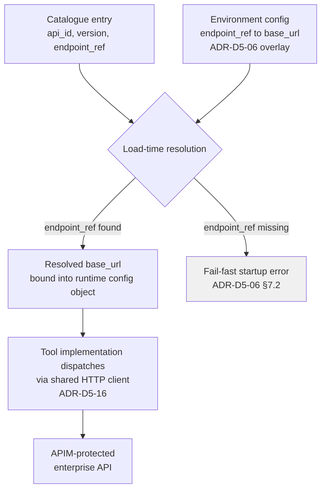

# ADR-D2-20 — Enterprise API endpoint declaration and per-environment resolution

## 1. Summary

The API catalogue declares each enterprise operation's **business contract** — `api_id`,
version, operation, purpose — against a logical `endpoint_ref`, never a physical URL. The
physical `base_url` each `endpoint_ref` resolves to is layered, environment-scoped
configuration (doc 17 §33), owned by ADR-D5-06's config model and never hard-coded in
the catalogue, a tool implementation, or agent code. This is the same treatment
ADR-D2-19 already gives portal URLs, extended here to the enterprise API surface, which
had no equivalent decision.

## 2. Context and Problem Statement

Doc 17 §31–§32 define enterprise API catalogue configuration and API versioning
tracking (API ID, API version, contract version, transformation version, auth scheme,
timeout, retry, idempotency). §33, titled **API Endpoint Environment Configuration**,
states the rule directly: "keep endpoint location separate from business contract,"
showing a catalogue entry that carries only an `endpoint_ref: CLUB_DETAILS_API` and a
separate `endpoints:` block, keyed by that ref, holding `base_url` per environment. §34
distinguishes endpoint version from contract version — a URL changing does not mean the
contract changed. §35 covers the transformation version separately again.

This is a complete, specific mechanism. It is also **never cited by any ADR in this
library** — not ADR-D2-13 (integration pattern), not ADR-D2-15 (API contract and
versioning), not ADR-D5-14 (environment model), not ADR-D5-06 (configuration
architecture). Doc 10's own catalogue metadata example (§10) shows `endpoint: {method,
path}` with a relative path and no host, which is consistent with doc 17 §33's
indirection but never says so — a reader of doc 10 alone would not know where the host
comes from, and could reasonably assume it belongs in the catalogue entry itself.

That ambiguity matters for a reason specific to this platform: **the API catalogue is a
versioned, release-manifest-pinned artefact** (ADR-D5-06 §7 — every registered API
version is pinned by the release manifest). If a catalogue entry embedded a physical
URL, that URL would be baked into the immutable release bundle, and promoting the exact
same release from UAT to STAGE to PROD would either require re-pinning the manifest
per environment (defeating "the same tested artefact reaches production," ADR-D5-14's
whole point) or the catalogue would need per-environment variants, multiplying
maintenance and inviting drift.

Doc 2 §48 lists hard-coded URLs among the platform's anti-patterns; ADR-D2-19 already
enforces that discipline for portal links, with its own environment-resolution decision
(doc 12 §7–§10). Enterprise API endpoints carry the identical risk — a DEV base URL
reaching a PROD deployment, or vice versa, is at least as damaging as a cross-environment
portal link, because it is a machine calling the wrong enterprise system rather than a
user following a bad link — and yet no ADR states the enterprise-API equivalent.

## 3. Decision Drivers

### 3.1 Functional drivers

| ID | Driver | Source |
|---|---|---|
| DR-F-01 | Endpoint location must be declared separately from the business contract | doc 17 §33 |
| DR-F-02 | The catalogue entry (`api_id`, version, operation) must be environment-agnostic | doc 17 §31–§32; ADR-D5-06 |
| DR-F-03 | The physical `base_url` per `endpoint_ref` must resolve per environment | doc 17 §33 |
| DR-F-04 | Endpoint (URL) version and API contract version must be tracked independently | doc 17 §34 |
| DR-F-05 | No API host/URL is hard-coded in agent, tool or catalogue code | doc 2 §48; ADR-D2-19 (parallel) |

### 3.2 Non-functional drivers

| ID | Driver | Target | Source |
|---|---|---|---|
| DR-N-01 | No cross-environment enterprise call | 0 occurrences | doc 25 §39 |
| DR-N-02 | A release manifest promotes unchanged across environments | Same catalogue version DEV→PROD | ADR-D5-06 §7; ADR-D5-14 |
| DR-N-03 | Endpoint resolution adds no material latency | ≤2 ms | ADR-D5-18 |

### 3.3 Constraints

| ID | Constraint | Type | Source |
|---|---|---|---|
| DR-C-01 | Configuration is layered base+environment, fail-fast, immutable at runtime | Platform | ADR-D5-06 |
| DR-C-02 | Five-stage environment model with strict isolation | Platform | ADR-D5-14 |
| DR-C-03 | Secrets (including any endpoint credentials) are `*_secret_ref` only | Platform | ADR-D5-07 |

### 3.4 Assumptions

| ID | Assumption | If false | Validation |
|---|---|---|---|
| DR-A-01 | Every cataloged operation has exactly one physical endpoint per environment | A small number of multi-region or sharded services need a resolution rule beyond simple per-env lookup | Per-service review at integration onboarding |

## 4. Evaluation Criteria and Weights

| ID | Criterion | Weight | Rationale | Measurement |
|---|---|---|---|---|
| EC-01 | Impossibility of a cross-environment call | 30 | Highest-consequence failure — wrong system, not just wrong data | Can any deployment reach the wrong host? |
| EC-02 | Catalogue stays environment-agnostic (release-manifest safe) | 25 | Directly protects ADR-D5-06's promotion model | Same catalogue version usable in every environment |
| EC-03 | No hard-coded host in code | 20 | doc 2 §48 anti-pattern | Static analysis for literal hosts |
| EC-04 | Operational flexibility (rotate/repoint without redeploy) | 15 | Endpoint moves happen without a contract change (§7) | Change requires config change only |
| EC-05 | Simplicity / maintenance cost | 10 | Fewer moving parts | Concepts an integrator must learn |
| | **Total** | **100** | | |

Scoring scale: **1** unacceptable · **2** poor · **3** adequate · **4** good · **5** excellent.

## 5. Alternatives Considered

### 5.1 Option A — Physical URL embedded directly in the catalogue entry

**Description.** Each catalogue entry carries its own `base_url` (or a full URL) inline,
alongside `api_id` and version.

**Strengths.** Nothing to look up; one file holds everything about an operation.

**Weaknesses.** Bakes an environment-specific value into a release-manifest-pinned
artefact (DR-F-02 fails outright); promoting a tested release to the next environment
either changes the pinned artefact or requires per-environment catalogue forks; a typo'd
host in the catalogue is a code change requiring a full release rather than a config
change.

**Cost / effort.** Lowest to write, highest to operate.

### 5.2 Option B — `endpoint_ref` indirection; environment config resolves `base_url` (doc 17 §33)

**Description.** The catalogue entry names a logical `endpoint_ref`. A separate,
environment-layered configuration file (ADR-D5-06's base+overlay model) maps each
`endpoint_ref` to a `base_url` for that environment. The catalogue is identical across
every environment; only the resolution table changes.

**Strengths.** Catalogue is genuinely environment-agnostic (EC-02); no host ever appears
in code (EC-03); an endpoint move is a config change, not a release (EC-04); this is
exactly what doc 17 §33 already specifies — adopting it is recognising an existing
design, not inventing one; symmetric with ADR-D2-19's portal-URL treatment.

**Weaknesses.** One extra lookup per call (bounded by DR-N-03); the catalogue and the
environment config must stay consistent — an `endpoint_ref` with no matching environment
entry is a startup-time failure to catch (handled in §8).

**Cost / effort.** Low.

### 5.3 Option C — Runtime service discovery (registry or DNS-based resolution)

**Description.** No static mapping; the platform queries a service registry or relies on
environment-scoped DNS to resolve the operation to a live instance at call time.

**Strengths.** Adapts automatically to endpoint changes; no configuration to update.

**Weaknesses.** Introduces a live dependency and failure mode (the registry itself) that
doc 17's static model does not have; a misconfigured DNS zone silently crosses
environments, which is precisely EC-01's worst case, with no config diff to catch it;
disproportionate for an integration surface doc 10 §7 already catalogues explicitly and
statically; no evidence the enterprise side exposes such a registry.

**Cost / effort.** High, and it fails the criterion it would need to win on.

### 5.4 Option D — Single shared hostname; environment routing at APIM

**Description.** All environments call the same logical hostname; APIM (ADR-D5-15)
inspects caller identity/environment and internally routes to the correct backend.

**Strengths.** The AI platform's own configuration never varies by environment for this
concern; centralises routing in the gateway that already owns authZ.

**Weaknesses.** Moves an AI-platform decision into APIM's configuration, owned by a
different team, for a concern (which backend an AI-platform deployment should reach)
that the AI platform's own environment model (ADR-D5-14) already exists to answer;
a routing misconfiguration in a shared gateway is a cross-environment failure affecting
every caller, not just this platform, which is a larger blast radius than DR-N-01 needs
to accept; no evidence in doc 10/17/25 that APIM is meant to carry this responsibility.

**Cost / effort.** Moderate, with an availability/ownership trade-off not asked for.

### 5.5 Option E — Per-environment conditional in code (`if env == "prod": ...`)

**Description.** Tool/integration code branches on an environment flag to select the
host inline.

**Strengths.** Immediately understandable; no external file to maintain.

**Weaknesses.** This is a hard-coded host by another name — it fails DR-F-05 and EC-03
exactly as Option A does, just distributed across call sites instead of centralised in
one catalogue; every new environment or endpoint change is a code change and a release;
doc 2 §48's anti-pattern applies directly.

**Cost / effort.** Low to write, and explicitly the pattern the specification forbids.

### 5.6 Options considered and eliminated before scoring

| Option | Eliminated by |
|---|---|
| Option E (code conditionals) | DR-F-05 — hard-coded environment logic is the anti-pattern doc 2 §48 names |

## 6. Evaluation Method and Decision Matrix

**Method.** Weighted scoring against §4, cross-checked against ADR-D2-19's identical
decision for portal URLs (§6, where the equivalent option scored 470/100 for the same
reasons).

| Criterion | Weight | A: Embedded URL | B: `endpoint_ref` indirection | C: Service discovery | D: APIM routing |
|---|---|---|---|---|---|
| EC-01 Cross-env impossibility | 30 | 1 | 5 | 2 | 3 |
| EC-02 Catalogue env-agnostic | 25 | 1 | 5 | 4 | 5 |
| EC-03 No hard-coded host | 20 | 2 | 5 | 5 | 5 |
| EC-04 Operational flexibility | 15 | 1 | 4 | 5 | 3 |
| EC-05 Simplicity | 10 | 5 | 4 | 2 | 3 |
| **Weighted total** | **100** | **150** | **455** | **335** | **395** |

- **Option B:** (30×5) + (25×5) + (20×5) + (15×4) + (10×4) = 150 + 125 + 100 + 60 + 40 = **455**
- **Option D:** (30×3) + (25×5) + (20×5) + (15×3) + (10×3) = 90 + 125 + 100 + 45 + 30 = **395**

**Sensitivity.** B leads D by 60 points, on the two highest-weighted criteria (EC-01,
EC-02) where B is unambiguously the direct implementation of a mechanism the
specification already states (doc 17 §33), and D is a plausible but undocumented
alternative that relocates the decision outside the AI platform's own configuration.
No plausible reweighting closes the gap, because A and E fail DR-F-05/DR-F-02 as hard
constraints rather than on scoring.

## 7. Decision

### 7.1 Two layers, two owners

```
API catalogue entry              Environment endpoint config
(business contract)         →    (physical location)
  api_id, version,                endpoint_ref → base_url,
  operation, purpose,             per environment
  endpoint_ref
  owned by: integration           owned by: platform/ops,
  team (ADR-D2-13 §7)             layered under ADR-D5-06
```

The catalogue never contains a host. It contains an `endpoint_ref` — a stable, logical
name (`CLUB_DETAILS_API`) — that is resolved, at load time, against the active
environment's configuration overlay.

### 7.2 Resolution is load-time, fail-fast

Per ADR-D5-06 §7.2's fail-fast loading, an `endpoint_ref` with no matching entry in the
active environment's configuration is a **startup failure**, not a runtime 404. The
platform never discovers a missing endpoint mapping from a live call.

### 7.3 Endpoint version and contract version move independently

Per doc 17 §34, a `base_url` change (a service relocating) does not imply the request/
response contract changed, and a contract version bump (ADR-D2-15) does not imply the
host changed. Both are tracked, and either can change without the other.

### 7.4 No exceptions for "just this once"

No tool implementation, agent, or catalogue entry constructs or contains a host string.
Where doc 17 §33's example shows `base_url: https://...` sourced from environment
configuration, that is the only place a host is permitted to appear outside a secret
reference (ADR-D5-07) for any authentication component of it.

**Status rationale.** Accepted. This closes a gap identified in a post-completion
review of the ADR library: doc 17 §33 already specifies this mechanism, and ADR-D2-19
already applies the identical pattern to portal URLs, but no ADR extended it to
enterprise API endpoints. Recording it as Accepted, not Proposed, because it states an
existing specification mechanism rather than opening a new choice — consistent with how
ADR-D3-26/D3-27 treated the equivalent RAG gaps.

## 8. Architecture Detail

### 8.1 Resolution flow



Resolution happens once, at process start, into the **immutable runtime configuration
object** (ADR-D5-06 §7.2) — not per call. A call never performs its own environment
lookup; it uses the already-resolved value, which is what keeps DR-N-03's overhead at
effectively zero.

### 8.2 Worked example — `CLUB_DETAILS_API`

| Layer | Content |
|---|---|
| Catalogue (`api_id: club-details`, versioned, release-manifest pinned) | `endpoint_ref: CLUB_DETAILS_API`, method `GET`, path `/clubs/{clubId}` |
| DEV environment config | `CLUB_DETAILS_API.base_url: https://dev-clubs.internal.example` |
| PROD environment config | `CLUB_DETAILS_API.base_url: https://clubs.thefa.internal` |
| Runtime (either environment) | Same catalogue version; different resolved `base_url`; tool code references only `endpoint_ref` |

The same release-manifest-pinned catalogue version reaches every environment unchanged,
satisfying ADR-D5-14's "progressively production-like stages" without a catalogue fork.

### 8.3 Interaction with contract versioning (ADR-D2-15)

An enterprise service relocating (endpoint version bump, doc 17 §34) triggers only an
environment-config change. An enterprise service changing its response shape (contract
version bump) triggers ADR-D2-15's full validate/map/fail path. The two are
independent, and conflating them — for example, treating a URL change as if it might
also be a contract change — would trigger unnecessary contract re-validation on a purely
operational move.

## 9. Consequences

### 9.1 Positive

- A release-manifest-pinned catalogue is genuinely portable across all five environments.
- A cross-environment call requires two independent failures (a wrong overlay *and* a
  missing fail-fast check), not one typo in a shared file.
- An endpoint relocation is a configuration change, verifiable and revertible without a
  deployment.
- No static-analysis sweep for literal hosts in integration code is needed as the
  primary control — the pattern structurally prevents it.

### 9.2 Negative

- Two files (catalogue entry, environment config) must be kept consistent per operation;
  an `endpoint_ref` typo in either is a real failure mode, caught only at load time.
- One additional layer of indirection for an engineer tracing a call for the first time.

### 9.3 Neutral

- The mechanism is not new — it recognises doc 17 §33 as already specifying it. This ADR
  is what makes it a decision the library actually records and enforces.

### 9.4 Trade-offs explicitly accepted

| Given up | In exchange for | Accepted by |
|---|---|---|
| Single-file simplicity of an embedded URL | A catalogue that survives promotion across five environments unchanged | AI Solution Architect |
| Automatic, registry-driven endpoint discovery | A static, auditable, fail-fast mapping with no live discovery dependency | Platform Engineer |

## 10. Golden-Rule and Precedence Conformance

| Constraint | Conformance |
|---|---|
| Enterprise decides; AI orchestrates | The platform resolves *where* to call an enterprise operation the enterprise owns; it never decides what the operation does. |
| Authoritative-truth precedence | Not applicable — this ADR governs endpoint location, not fact ranking. |
| Four-state separation | Not applicable — configuration and catalogue metadata, not conversation/session/workflow/enterprise state. |
| Versioned artefacts, never mutated in place | The catalogue is release-manifest pinned (ADR-D5-06); the environment endpoint map is a separate, environment-scoped overlay, both versioned. |
| Adam persona governs how, never what | Not applicable — no user-facing communication in this ADR's scope. |

## 11. Risks and Mitigations

| ID | Risk | Likelihood | Impact | Exposure | Mitigation | Owner | Residual |
|---|---|---|---|---|---|---|---|
| RSK-01 | An `endpoint_ref` exists in the catalogue with no matching environment entry | Medium | Medium | Medium | Fail-fast startup validation (§7.2); AC-01 | Platform Engineer | Low |
| RSK-02 | An environment overlay is misconfigured with another environment's `base_url` | Low | Very High | High | Overlay review at release; environment isolation checks (ADR-D5-14); QM-02 | Platform Engineer | Low |
| RSK-03 | A tool implementation bypasses the resolved config and constructs a URL inline | Low | High | Medium | Static analysis for literal hosts as defence-in-depth; code review gate | AI Engineering Lead | Low |
| RSK-04 | An endpoint moves without a corresponding environment-config update, breaking calls | Medium | Medium | Medium | Scheduled contract tests (ADR-D2-15 §8.3) also exercise resolved hosts | Operations/SRE | Low |

## 12. Quantitative Targets and Measures

| ID | Measure | Target | Threshold (alert) | Source | Review cadence |
|---|---|---|---|---|---|
| QM-01 | Startup failures from unresolved `endpoint_ref` | 0 in steady state | ≥1 | Startup logs | Per deploy |
| QM-02 | Calls whose resolved host does not match the active environment's expected domain suffix | 0 | ≥1 | Config audit / canary check | Daily |
| QM-03 | Literal host strings found in integration code | 0 | ≥1 | Static analysis (CI) | Per commit |

## 13. Security, Privacy and Compliance Impact

| Dimension | Impact |
|---|---|
| Attack surface change | Reduces it — removes the class of failure where a build artefact carries a wrong-environment host. |
| Data classification touched | None directly; governs routing, not payload content. |
| Personal data / PII | Not applicable. |
| Children's data and safeguarding | Not applicable — this ADR governs where a call goes, not what it carries. |
| UK GDPR lawful basis and rights impact | Not applicable. |
| Audit and evidential requirements | Resolved `base_url` per environment is part of the immutable runtime configuration object and its startup audit (ADR-D5-06 §7.4). |
| Standards touched | ISO/IEC 27001 A.8.9 (configuration management); ISO/IEC 42001. |

## 14. Implementation Impact

| Aspect | Detail |
|---|---|
| Build phases | 1 (environment/config scaffolding), 6 (integration layer) |
| Repository paths | `src/pf_ft_ai/integration/api/` (catalogue loader, `endpoint_ref` resolver); `config/` (per-environment endpoint maps) |
| Configuration | `endpoints.<ENDPOINT_REF>.base_url` per environment overlay (doc 17 §33) |
| Contracts / schemas | Catalogue entry schema gains a mandatory `endpoint_ref` field; drops any `base_url`/host field |
| Migration | None — no prior catalogue schema existed with embedded hosts |
| Dependencies on other ADRs | ADR-D5-06 (config layering), ADR-D5-14 (environment model), ADR-D2-13 (catalogue ownership) |
| Effort estimate | Small |

## 15. Validation and Verification

| ID | Acceptance criterion | Verification method |
|---|---|---|
| AC-01 | Every catalogued `endpoint_ref` resolves in every environment's configuration | Startup fail-fast check; CI config-completeness test |
| AC-02 | No literal host string appears in `src/pf_ft_ai/integration/` | Static analysis (QM-03) |
| AC-03 | The same catalogue version, promoted DEV→PROD, resolves to a different host per environment without a catalogue change | Promotion test across environments |
| AC-04 | A call in environment X never reaches environment Y's resolved host | Environment isolation / canary test (QM-02) |

## 16. Operational Impact

| Aspect | Detail |
|---|---|
| Monitoring | Resolved-host-per-call logged; startup resolution failures |
| Alerting | QM-01, QM-02, QM-03 on any occurrence |
| Runbook | Endpoint relocation runbook — update environment overlay, verify via scheduled contract test (ADR-D2-15 §8.3) |
| Failure mode and degradation | An unresolved `endpoint_ref` fails the process at startup, never partially — no code path can run with a missing host |
| Rollback | Revert the environment overlay; no deployment required |
| Support model impact | An endpoint-move request is a config change ticket, not a release |

## 17. Cost Impact

| Cost element | One-off | Recurring | Basis |
|---|---|---|---|
| Catalogue schema + resolver | Phase 6 | — | `DEVELOPMENT-GUIDE.md` §4 |
| Per-environment endpoint config authoring | Small, per operation | Per new operation or relocation | doc 17 §33 |
| Avoided cost | — | Ongoing | Avoids a wrong-environment enterprise call incident and the manifest-repinning cost of Option A |

## 18. Revisit Triggers and Causal Analysis Hooks

| ID | Trigger | Detected by | Action on trigger |
|---|---|---|---|
| RT-01 | QM-01 or QM-02 fires | Startup logs / canary | Investigate the specific overlay; treat as a release blocker |
| RT-02 | A service genuinely needs multi-region/sharded resolution beyond simple per-environment lookup (DR-A-01) | Integration onboarding review | Extend the resolution model with a documented amendment, not an ad hoc exception |
| RT-03 | APIM begins offering environment-aware routing as a platform-wide capability | Platform roadmap | Re-evaluate Option D against the then-current ownership model |

**Scheduled review:** 2027-08-23.

## 19. Traceability

| Dimension | Reference |
|---|---|
| Workshop sheet | WS-10 Integration & 18-Microservice Matrix |
| Specification sections | doc 17 §31 (Enterprise API Configuration), §32 (Enterprise API Versioning), §33 (API Endpoint Environment Configuration), §34 (API Contract Version), §35 (API Transformation Version); doc 10 §7–§10 (API Catalog, Purpose, Metadata, Extended Metadata), §15–§16 (API Versioning, Contract); doc 25 §33–§39 (environment definitions and isolation) |
| Requirement IDs | `FR-P-04` |
| Build phases | 1, 6 |
| Code paths | `src/pf_ft_ai/integration/api/`, `config/` |
| Configuration | Per-environment `endpoints.<ENDPOINT_REF>.base_url` |
| Tests | AC-01 to AC-04 |
| Upstream ADRs | ADR-D5-06, ADR-D5-14, ADR-D2-13 |
| Downstream ADRs | ADR-D2-15, ADR-D2-21 |

## 20. Change Log

| Version | Date | Author | Change |
|---|---|---|---|
| 1.0.0 | 2026-08-23 | AI Solution Architect | Initial decision recorded, closing a gap found in a post-completion review: doc 17 §33 already specifies `endpoint_ref` indirection for enterprise API endpoints, and ADR-D2-19 already applies the identical pattern to portal URLs, but no ADR had extended environment-based resolution to enterprise API endpoints themselves. |
