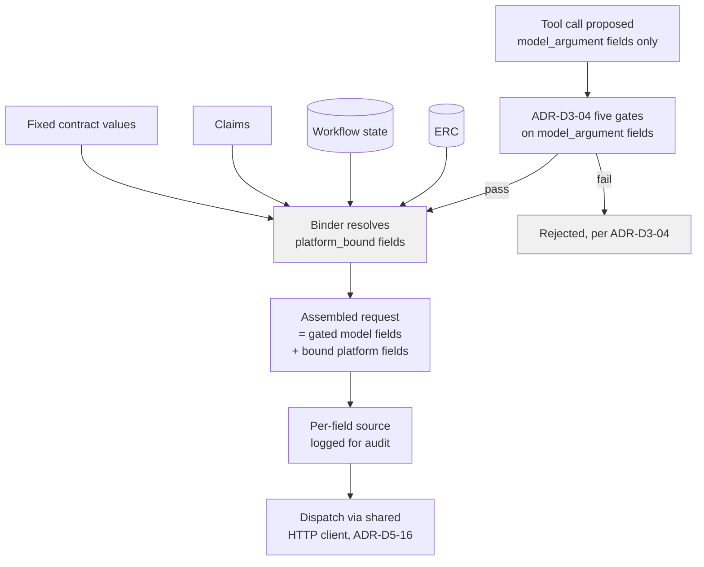

# ADR-D2-21 — Request payload parameter sourcing and binding

## 1. Summary

Every field in an enterprise API request contract is declared with an explicit
**source**: `model_argument` (proposed by the model, subject to ADR-D3-04's full gate
sequence), or `platform_bound` — resolved deterministically by the tool implementation
from ERC, workflow state, or the caller's claims, and never exposed to the model at all.
This is the request-side counterpart of ADR-D2-15's deterministic response-to-ERC
mapping: doc 10 §17's `source: request_context` example implies exactly this mechanism,
but no ADR had made it a decision.

## 2. Context and Problem Statement

Doc 10 §16 defines the API contract's fields (method, endpoint, parameters, headers,
body, auth, and more); §17's request-contract example is specific in one place and
silent everywhere else — the `Authorization` header carries `source: request_context`,
but the `clubId` path parameter carries only a type and `required: true`, with no
statement of where its value comes from. §18's "Request Payload" gives a bare JSON
example with no sourcing information at all.

Doc 8 §22–§25 show the other half of the picture from the ERC side: a workflow declares
its context requirements (§22–§23), and a dependency graph (§25) states that some APIs
"require `club_id` before they can be called" — i.e., an identifier obtained from one
call, or from ERC, must feed a later call's request. What §25 does not say is **how**
that identifier moves from ERC into the next request's payload. It documents that a
dependency exists, not the binding mechanism that satisfies it.

Three existing ADRs sit close to this question without answering it:

- **ADR-D3-04** governs the five-gate validation of parameters **the model proposes** —
  allowlist, schema, semantic validation, authorization, idempotency. It says nothing
  about a field the model never proposes at all.
- **ADR-D2-13** §8.2's worked `submit_affiliation` example lists request-contract fields
  (`application_id`, `team_ids`, `insurance_selections`, `product_selections`) without
  stating which are model-supplied and which are platform-supplied, or where the
  platform-supplied ones come from.
- **ADR-D2-15** governs the response side — enterprise payload into ERC, deterministic
  and provenance-stamped. It has no request-side counterpart.

The gap has a concrete consequence. Without a declared source per field, the path of
least resistance for an implementer is to let the tool implementation read whatever
context looks convenient at the call site — sometimes ERC, sometimes a value the model
happened to mention in its argument, inconsistently across tools. That reopens, one
layer earlier, the exact risk ADR-D3-04 §2 identifies at the tool boundary: a
well-formed value that is not authoritatively the caller's to use. If an `Authorization`
claim or a `club_id` that must be the caller's own can be quietly filled from
conversational text instead of from a declared, authoritative source, the semantic
validation ADR-D3-04 performs on model arguments is bypassed rather than defeated —
because the field was never a "model argument" that the gate sequence examined in the
first place.

## 3. Decision Drivers

### 3.1 Functional drivers

| ID | Driver | Source |
|---|---|---|
| DR-F-01 | Every request field must have a declared source | doc 10 §17 (implied by the `source:` attribute shown) |
| DR-F-02 | Fields not supplied by the model must be resolved from an authoritative platform source (ERC, workflow state, claims) | doc 8 §22–§25; ADR-D2-12 |
| DR-F-03 | Fields supplied by the model remain subject to ADR-D3-04's full gate sequence | ADR-D3-04 |
| DR-F-04 | An identifier a dependency graph requires (doc 8 §25) must bind deterministically into the dependent request | doc 8 §25 |
| DR-F-05 | Every platform-bound value must be attributable for audit | doc 3 §67 (transformation must preserve authoritative meaning, applied symmetrically) |

### 3.2 Non-functional drivers

| ID | Driver | Target | Source |
|---|---|---|---|
| DR-N-01 | Binding adds no material latency | ≤2 ms per field | ADR-D5-18 |
| DR-N-02 | No security-sensitive field (claims, authorization) is ever model-suppliable | 0 occurrences | doc 10 §17 example |

### 3.3 Constraints

| ID | Constraint | Type | Source |
|---|---|---|---|
| DR-C-01 | ERC is the exclusive path for enterprise operational data | Platform | ADR-D2-12 |
| DR-C-02 | Authorization claims must not be modified downstream | Platform | doc 10 §74 |
| DR-C-03 | A tool call the model proposes still passes all five ADR-D3-04 gates | Platform | ADR-D3-04 |

### 3.4 Assumptions

| ID | Assumption | If false | Validation |
|---|---|---|---|
| DR-A-01 | Every request field is classifiable at design time as model-argument or platform-bound | A field needs a runtime choice between sources | Per-operation catalogue review at Phase 6 |

## 4. Evaluation Criteria and Weights

| ID | Criterion | Weight | Rationale | Measurement |
|---|---|---|---|---|
| EC-01 | Security — model cannot influence a platform-bound field | 30 | Direct extension of ADR-D3-04's threat model one layer earlier | Can any model output change a platform-bound value? |
| EC-02 | Determinism / auditability of every field's origin | 25 | Symmetry with ADR-D2-15's response mapping | Is every field's source declared and logged? |
| EC-03 | Consistency across tools (no per-tool ad hoc sourcing) | 20 | Maintainability and review-ability | One binding mechanism vs one per tool |
| EC-04 | Maintenance cost | 15 | Declarative beats hand-written per tool | Effort to add a field or a tool |
| EC-05 | Expressiveness for new operations | 10 | New tools should not require new plumbing | Effort to onboard an operation |
| | **Total** | **100** | | |

Scoring scale: **1** unacceptable · **2** poor · **3** adequate · **4** good · **5** excellent.

## 5. Alternatives Considered

### 5.1 Option A — All fields as model arguments; ADR-D3-04 gates are the only control

**Description.** Every request field, including claims and identifiers that must be the
caller's own, is defined as a tool argument the model supplies, validated entirely by
ADR-D3-04's five gates.

**Strengths.** One mechanism, already built; nothing new to design.

**Weaknesses.** ADR-D3-04's semantic validation gate checks that a *model-supplied*
identifier is within the caller's scope — it was never designed to be the sole control
for a field like `Authorization` that should never be model-influenced at all; putting
claims in the model's argument schema invites exactly the injection ADR-D3-04 §2
describes, applied to the platform's own auth context rather than a business identifier
(EC-01 fails badly).

**Cost / effort.** Lowest, at unacceptable risk.

### 5.2 Option B — Declarative per-field `source` binding: `model_argument` | `erc` | `workflow_state` | `claims` | `fixed`

**Description.** The request contract declares, per field, which of a small closed set
of sources fills it. `model_argument` fields go through ADR-D3-04 unchanged.
`erc`/`workflow_state`/`claims`/`fixed` fields are resolved by the tool implementation
from the named source before dispatch, never appear in the model's tool schema, and are
logged with their resolved source for audit.

**Strengths.** Security-sensitive fields are structurally unreachable by the model
(EC-01); every field's provenance is declared, not inferred (EC-02); one binder used by
every tool (EC-03); adding a field is a contract declaration, not new code (EC-04, EC-05);
directly implements doc 10 §17's `source:` example and doc 8 §25's dependency-graph need.

**Weaknesses.** A small, fixed vocabulary of sources must be agreed and may need
extension over time; a field genuinely needing a source outside the initial set (DR-A-01)
requires an amendment.

**Cost / effort.** Low-moderate.

### 5.3 Option C — Ad hoc context access: tool implementation code reads whatever it needs at execution time

**Description.** No declared sourcing; each tool implementation function pulls context
fields directly (`erc.club.id`, `claims.sub`, and so on) as ordinary code.

**Strengths.** Fastest to write for a single tool; no schema to design.

**Weaknesses.** Nothing declares which fields are platform-bound versus model-suppliable,
so a reviewer cannot audit sourcing from the contract alone (EC-02 fails); each tool
re-implements the same lookups with no shared enforcement, so one tool omitting a claims
check is a silent, tool-specific gap rather than a caught contract violation (EC-01,
EC-03 fail); this is exactly the "convenience" implementation §2 warns produces
inconsistent sourcing across tools.

**Cost / effort.** Low per tool, compounding badly across the catalogue.

### 5.4 Option D — Dedicated request-assembly/mapping service, decoupled from tool implementations

**Description.** A separate service, symmetric to a hypothetical response-transformation
service, assembles every request payload centrally before handing it to the tool
executor.

**Strengths.** Strong separation of concerns; a single place to audit all request
construction.

**Weaknesses.** ADR-D2-15's response mapping is a stage in the integration layer, not a
separate service, for the same reason ADR-D2-02 rejects one-microservice-per-agent — an
extra deployable for a concern the tool executor (ADR-D2-13 §8.1) already sits directly
in the path of; doubles the components to operate and version for marginal gain over
Option B's declarative binding living in the same layer.

**Cost / effort.** Moderate-high, disproportionate to the problem.

### 5.5 Option E — Hand-written per-tool sourcing code, reviewed by a fixed checklist

**Description.** Like Option C, but with a mandatory code-review checklist requiring
every platform-bound field to be justified in the PR description.

**Strengths.** Some process control over Option C's inconsistency, without new
machinery.

**Weaknesses.** A checklist is a process control, not a structural one — it catches what
a reviewer remembers to check, not what the system enforces; still no machine-checkable
contract stating each field's source, so EC-02's auditability still fails at the
contract level even if individual reviews catch problems; every new tool repeats the
same hand-written logic (EC-04 fails).

**Cost / effort.** Low-moderate, with weak guarantees.

### 5.6 Options considered and eliminated before scoring

| Option | Eliminated by |
|---|---|
| Option A (all fields as model arguments) | DR-N-02 — a security-sensitive field must never be model-suppliable |

## 6. Evaluation Method and Decision Matrix

**Method.** Weighted scoring against §4, tested adversarially for EC-01: if a prompt
injection instructs the model to supply a specific value for a claims-sourced or
identifier field, does it reach the request under each option?

| Criterion | Weight | A: All model args | B: Declarative source binding | C: Ad hoc access | D: Assembly service | E: Checklist |
|---|---|---|---|---|---|---|
| EC-01 Security | 30 | 1 | 5 | 2 | 5 | 2 |
| EC-02 Determinism/audit | 25 | 2 | 5 | 1 | 5 | 2 |
| EC-03 Cross-tool consistency | 20 | 3 | 5 | 1 | 4 | 2 |
| EC-04 Maintenance | 15 | 4 | 4 | 2 | 3 | 2 |
| EC-05 Expressiveness | 10 | 4 | 4 | 4 | 3 | 4 |
| **Weighted total** | **100** | **235** | **475** | **165** | **445** | **210** |

- **Option B:** (30×5) + (25×5) + (20×5) + (15×4) + (10×4) = 150 + 125 + 100 + 60 + 40 = **475**
- **Option D:** (30×5) + (25×5) + (20×4) + (15×3) + (10×3) = 150 + 125 + 80 + 45 + 30 = **445**

**Sensitivity.** B leads D by 30 points, entirely on EC-03 and EC-04 — B's binder lives
in the layer that already sits between the model and the enterprise call (ADR-D2-13
§8.1), while D adds a service boundary for the same guarantee. Both score identically on
the two security-weighted criteria (EC-01, EC-02) that dominate the total, so the
decision does not turn on risk tolerance; it turns on not paying for a second component
when the first already has room for the mechanism.

## 7. Decision

### 7.1 Every request field declares its source

The request contract (doc 10 §17) is extended so every field carries a `source`:

```yaml
request:
  path:
    clubId:
      type: string
      required: true
      source: claims          # the caller's own club, never model-suppliable

  headers:
    Authorization:
      source: request_context  # doc 10 §17's existing example

  body:
    team_ids:
      type: array
      source: model_argument   # the model proposes this; ADR-D3-04 gates apply
    application_id:
      type: string
      source: workflow_state   # the workflow instance's own state
```

The closed source vocabulary is: `model_argument`, `erc`, `workflow_state`, `claims`,
`fixed` (a literal declared in the contract itself, e.g. an API version string).

### 7.2 `model_argument` fields: unchanged, still fully gated

A field sourced as `model_argument` is exposed in the tool's schema to the model exactly
as today, and passes ADR-D3-04's five gates — allowlist, schema, semantic validation,
authorization, idempotency — unchanged. This ADR adds nothing to that path; it only
makes explicit, in the contract, which fields are on it.

### 7.3 `platform_bound` fields: resolved by the binder, never model-visible

Fields sourced as `erc`, `workflow_state`, `claims`, or `fixed` are never included in the
schema the model sees. The tool implementation's binder resolves each from its declared
source immediately before dispatch:

- `erc` — read from the named ERC section/field (ADR-D2-12's exclusive path).
- `workflow_state` — read from the current workflow instance's state (ADR-D2-07).
- `claims` — read from the caller's validated claims (doc 10 §73–§74; never modified,
  per DR-C-02).
- `fixed` — the literal value declared in the contract.

Because none of these four sources is model output, ADR-D3-04's semantic-validation
gate (built to catch a well-formed-but-wrong-scope value the model proposed) is not
needed for them — there is no model proposal to check. They are authoritative by
construction, in the same sense ADR-D2-15 §7 treats a validated enterprise response as
authoritative.

### 7.4 Every bound field is logged with its source

Per DR-F-05, the binder logs, for every dispatched request, which fields were
`model_argument` (with the model's value) versus `platform_bound` (with the resolved
source, not necessarily the value where it is sensitive) — giving the same evidential
trail ADR-D2-15 §13 gives the response side.

### 7.5 The dependency graph identifies the need; the binder satisfies it

Doc 8 §25's dependency graph (an API needing `club_id` before it can run) is unchanged —
ADR-D4-04 still owns collection ordering. What this ADR adds is the mechanism by which,
once that identifier exists (in ERC or workflow state), it is bound into the dependent
request's `source: erc` or `source: workflow_state` field, deterministically, rather
than left to per-tool code to fetch however it likes.

**Status rationale.** Accepted. Closes a gap identified in a post-completion review: the
mechanism doc 10 §17 gestures at (a `source:` attribute) was never generalised into a
decision, and no ADR stated how a request field not supplied by the model gets filled.

## 8. Architecture Detail

### 8.1 Binding flow



The model's fields and the platform's fields are assembled into one request only after
the model's fields have separately cleared ADR-D3-04's gates — binding never happens
before gating, so a platform-bound field can never be mistaken for, or substituted by,
a model-influenced one.

### 8.2 `submit_affiliation` revisited (ADR-D2-13 §8.2)

| Field | Source | Rationale |
|---|---|---|
| `application_id` | `workflow_state` | The workflow instance already knows which application it is progressing; the model does not need to, and should not be able to, redirect it to another. |
| `team_ids` | `model_argument` | The user's selection, expressed through the conversation; ADR-D3-04 validates it against the caller's own teams. |
| `insurance_selections` | `model_argument` | Same — a user choice, gated. |
| `product_selections` | `model_argument` | Same. |
| `clubId` (implicit, used by the validate/submit/get sequence) | `claims` | The caller's own club, from validated claims — never something the model states, matching doc 10 §17's `Authorization` treatment. |

This resolves ADR-D2-13 §8.2's original silence on field origin: three of five fields
are model-supplied and gated; two are platform-bound and structurally unreachable by the
model.

## 9. Consequences

### 9.1 Positive

- A field that must not be model-influenced (claims, workflow identity) is structurally
  unreachable by the model, not merely validated after the fact.
- Every request's field provenance is declared in the contract and logged per call,
  symmetric with ADR-D2-15's response-side audit trail.
- One binder implementation serves every tool, rather than each tool re-deriving
  platform context.
- Adding a new operation is a contract declaration plus, at most, a new source binding
  — not new per-tool sourcing code.

### 9.2 Negative

- The request-contract schema grows a mandatory `source` field per parameter, which is
  authoring overhead for every cataloged operation.
- The closed source vocabulary may need a documented extension if a field genuinely
  needs a source outside the initial four (DR-A-01).

### 9.3 Neutral

- `model_argument` fields and ADR-D3-04's gate sequence are unchanged; this ADR is
  additive to the fields that were previously unaddressed.

### 9.4 Trade-offs explicitly accepted

| Given up | In exchange for | Accepted by |
|---|---|---|
| Implicit, per-tool freedom in how context is fetched | One declared, auditable binding mechanism used everywhere | AI Solution Architect |
| A slightly larger request-contract schema | Structural impossibility of a security-sensitive field being model-influenced | Security Owner |

## 10. Golden-Rule and Precedence Conformance

| Constraint | Conformance |
|---|---|
| Enterprise decides; AI orchestrates | Platform-bound fields carry the caller's own authoritative context into the enterprise call; the model never determines them. |
| Authoritative-truth precedence | `erc`-sourced fields come only from ERC, itself populated only from Enterprise API/Event data (ADR-D2-12, ADR-D1-03) — precedence is preserved on the request side exactly as ADR-D2-15 preserves it on the response side. |
| Four-state separation | `workflow_state` and `claims` sources are read from their own state categories, never conflated with conversation state. |
| Versioned artefacts, never mutated in place | The request contract (with its `source` declarations) is part of the versioned API catalogue (ADR-D5-06). |
| Adam persona governs how, never what | Not applicable — no user-facing communication in this ADR's scope. |

## 11. Risks and Mitigations

| ID | Risk | Likelihood | Impact | Exposure | Mitigation | Owner | Residual |
|---|---|---|---|---|---|---|---|
| RSK-01 | A field is miscategorised as `model_argument` when it should be `claims`/`erc` | Low | High | Medium | Contract review checklist at catalogue authoring; security review for any field touching identity or authorization | Security Owner | Low |
| RSK-02 | A `platform_bound` field's declared source is missing at resolution time (e.g. ERC section not collected) | Medium | Medium | Medium | Binder failure is explicit and blocks dispatch — never silently omits the field; ties to ADR-D4-05's mandatory/optional context handling | AI Engineering Lead | Low |
| RSK-03 | The source vocabulary proves insufficient for a real operation (DR-A-01) | Low | Low | Low | Documented amendment path via RT-01 | AI Solution Architect | Low |

## 12. Quantitative Targets and Measures

| ID | Measure | Target | Threshold (alert) | Source | Review cadence |
|---|---|---|---|---|---|
| QM-01 | Request-contract fields with no declared `source` | 0 | ≥1 | Catalogue schema validation (CI) | Per commit |
| QM-02 | `claims`-sourced fields present in a tool's model-facing schema | 0 | ≥1 | Schema/contract consistency check | Per commit |
| QM-03 | Dispatch failures due to an unresolved `platform_bound` field | Tracked | Sustained rise | Binder logs | Weekly |

## 13. Security, Privacy and Compliance Impact

| Dimension | Impact |
|---|---|
| Attack surface change | Removes a specific injection path: a security-sensitive field quietly filled from model output because it was never classified as platform-bound. |
| Data classification touched | Claims and identifiers used in request construction. |
| Personal data / PII | `claims`-sourced fields may carry identifying information; never exposed to the model's schema, limiting incidental exposure. |
| Children's data and safeguarding | Where an operation concerns an official or player identifier, `erc`/`claims` sourcing keeps it within the caller's validated scope rather than model-stated text. |
| UK GDPR lawful basis and rights impact | Binding from authoritative sources supports data minimisation — only declared fields are read, nothing ad hoc. |
| Audit and evidential requirements | §7.4's per-field source logging reconstructs exactly how each dispatched request was assembled. |
| Standards touched | ISO/IEC 27001 A.8.28 (secure coding); OWASP LLM01 (prompt injection) — this closes the request-construction variant of the vector ADR-D3-04 addresses at the tool-call boundary. |

## 14. Implementation Impact

| Aspect | Detail |
|---|---|
| Build phases | 6 (integration layer) |
| Repository paths | `src/pf_ft_ai/integration/api/` (request contract schema, binder); `src/pf_ft_ai/integration/tools/` (tool schema generation excludes platform-bound fields) |
| Configuration | None beyond the extended request-contract schema, itself part of the catalogue (ADR-D5-06) |
| Contracts / schemas | Request-contract Pydantic model gains a mandatory `source` enum per field |
| Migration | Existing request-contract entries backfilled with `source` declarations at Phase 6 |
| Dependencies on other ADRs | ADR-D3-04 (model-argument gating), ADR-D2-12 (ERC as source), ADR-D2-15 (response-side symmetry) |
| Effort estimate | Small-moderate |

## 15. Validation and Verification

| ID | Acceptance criterion | Verification method |
|---|---|---|
| AC-01 | Every request-contract field declares a `source` | Schema validation (QM-01) |
| AC-02 | No `claims`- or `erc`-sourced field appears in a tool's model-facing schema | Contract/schema consistency test (QM-02) |
| AC-03 | A prompt injection attempting to set a `claims`-sourced field has no effect on the dispatched request | Adversarial test, per §8.1's flow |
| AC-04 | Every dispatched request's field provenance is reconstructable from logs | Log inspection test (§7.4) |

## 16. Operational Impact

| Aspect | Detail |
|---|---|
| Monitoring | Per-field source distribution; binder resolution failures |
| Alerting | QM-01, QM-02 on any occurrence; QM-03 on sustained rise |
| Runbook | Extends the existing tool-boundary incident runbook (ADR-D3-04) to cover binder failures |
| Failure mode and degradation | An unresolved platform-bound field blocks dispatch entirely — never dispatches with a missing or defaulted authoritative field |
| Rollback | Contract `source` declarations are versioned catalogue content; revertible without a code deploy |
| Support model impact | A binder-resolution alert routes to integration on-call, not security, unless QM-02 fires |

## 17. Cost Impact

| Cost element | One-off | Recurring | Basis |
|---|---|---|---|
| Request-contract schema extension + binder | Phase 6 | — | `DEVELOPMENT-GUIDE.md` §4 |
| Backfilling `source` on existing contract entries | Small, per operation | — | Migration, §14 |
| Avoided cost | — | Ongoing | Avoids a claims/identity field becoming reachable by model-influenced input |

## 18. Revisit Triggers and Causal Analysis Hooks

| ID | Trigger | Detected by | Action on trigger |
|---|---|---|---|
| RT-01 | A field needs a source outside the four-value vocabulary (DR-A-01) | Catalogue authoring review | Extend the vocabulary via a documented amendment, not an ad hoc exception |
| RT-02 | QM-02 fires — a claims/erc field appears in a model-facing schema | CI | Treat as a security defect; block merge |
| RT-03 | QM-03 shows a sustained rise in binder resolution failures | Weekly review | Investigate whether ERC/workflow-state collection (ADR-D4-04, ADR-D4-05) is failing upstream |

**Scheduled review:** 2027-08-23.

## 19. Traceability

| Dimension | Reference |
|---|---|
| Workshop sheet | WS-10 Integration & 18-Microservice Matrix |
| Specification sections | doc 10 §16 (API Contract), §17 (Request Contract), §18 (Request Payload); doc 8 §22 (Context Requirement Identification), §23 (Context Requirement Model), §24 (Mandatory vs Optional Context), §25 (Context Dependency Graph); doc 3 §67 (Responsibility for API Payload Transformation) |
| Requirement IDs | `FR-P-05` |
| Build phases | 6 |
| Code paths | `src/pf_ft_ai/integration/api/`, `src/pf_ft_ai/integration/tools/` |
| Configuration | Request-contract `source` declarations (catalogue) |
| Tests | AC-01 to AC-04 |
| Upstream ADRs | ADR-D3-04, ADR-D2-12, ADR-D2-13 |
| Downstream ADRs | ADR-D2-15 (response-side symmetry), ADR-D2-20 (endpoint resolution) |

## 20. Change Log

| Version | Date | Author | Change |
|---|---|---|---|
| 1.0.0 | 2026-08-23 | AI Solution Architect | Initial decision recorded, closing a gap found in a post-completion review: doc 10 §17's `source:` attribute was never generalised into a decision governing how non-model-supplied request fields are sourced, leaving claims/ERC/workflow-state fields with no declared, auditable binding mechanism distinct from ADR-D3-04's model-argument gates. |
