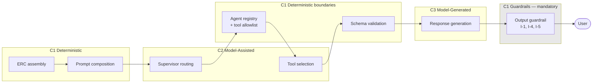

# ADR-D3-01 — AI capability taxonomy and capability-to-component mapping

## 1. Summary

AI capabilities are classified by **where the intelligence sits and what it is trusted with**,
not by which technology provides them. Four classes — Deterministic, Model-Assisted,
Model-Generated and Model-Terminal — with the rule that no Model-Terminal capability exists in
this platform, because a capability whose output reaches a user or an enterprise system without an
intervening deterministic check is exactly what 2. PF-FT-AI-ARCHITECTURE-DETAILED.md §3.3 forbids.

## 2. Context and Problem Statement

1 PF-FT-AI-ARCHITECTURE.md §2.2 lists what the AI platform owns — nineteen items from conversation management to
AI observability. 4. PF-FT-AI-RUNTIME.md §4 lists runtime responsibilities per component. 7 PF-FT-AI-AGENTIC-ORCHESTRATION.md §4 names four core
components. 3. PF-FT-AI-RESPONSIBILITY-MATRIX.md §4's matrix marks capabilities as AI-owned. 7 PF-FT-AI-AGENTIC-ORCHESTRATION.md §67 and §69 draw a reasoning
boundary.

These are all **component** inventories: which module does what. WS-12 asks for a **capability**
map, which is a different cut — and the useful distinction is not "which component provides this"
but "how much is the model trusted here, and what catches it when it is wrong".

That distinction is not made anywhere in the specification set, and its absence has practical
consequences. "Intent classification", "context assembly", "response generation" and "guardrail
evaluation" are all described as AI platform capabilities. They differ enormously in risk profile:

- Context assembly involves no model at all and is fully reproducible.
- Intent classification uses a model but its output is a routing choice bounded by an allowlist,
  and a wrong answer produces a clarification rather than a wrong enterprise operation.
- Response generation uses a model and its output goes to a user — but only after passing the
  output guardrail.
- Guardrail evaluation must never use a model as its sole mechanism (2. PF-FT-AI-ARCHITECTURE-DETAILED.md §3.3).

Treating these as one class of thing produces two failures. It leads to uniform controls, which
are either too heavy for the deterministic cases or too light for the generative ones. And it makes
evaluation strategy incoherent: 21.PF-FT-AI-EVALUATION.md requires AI quality evaluation, but unit-testing a
deterministic capability and evaluating a generative one are different activities, and a taxonomy
that does not distinguish them cannot say which applies where.

There is a third use. When a new capability is proposed, the question "what class is this?"
determines its controls, its testing and its review path. Without a taxonomy, that is decided
case by case, inconsistently.

## 3. Decision Drivers

### 3.1 Functional drivers

| ID | Driver | Source |
|---|---|---|
| DR-F-01 | The nineteen AI-owned capabilities of 1 PF-FT-AI-ARCHITECTURE.md §2.2 must be classifiable | 1 PF-FT-AI-ARCHITECTURE.md §2.2 |
| DR-F-02 | The reasoning boundary must be expressible per capability | 7 PF-FT-AI-AGENTIC-ORCHESTRATION.md §67, §69 |
| DR-F-03 | Critical controls must be deterministic | 2. PF-FT-AI-ARCHITECTURE-DETAILED.md §3.3 |
| DR-F-04 | Evaluation strategy must follow from capability class | 21.PF-FT-AI-EVALUATION.md §1 |
| DR-F-05 | A new capability must be classifiable on proposal | Programme practice |

### 3.2 Non-functional drivers

| ID | Driver | Target | Source |
|---|---|---|---|
| DR-N-01 | The taxonomy must be small enough to apply consistently | ≤5 classes | Programme practice |
| DR-N-02 | Classification must be unambiguous | Two reviewers agree on class | DR-F-05 |
| DR-N-03 | Class must determine controls, not merely describe | Each class names its required controls | 2. PF-FT-AI-ARCHITECTURE-DETAILED.md §3.3 |

### 3.3 Constraints

| ID | Constraint | Type | Source |
|---|---|---|---|
| DR-C-01 | The SLM must not be the only enforcement mechanism for a critical control | Platform | 2. PF-FT-AI-ARCHITECTURE-DETAILED.md §3.3 |
| DR-C-02 | Model output is never authoritative | Platform | 3. PF-FT-AI-RESPONSIBILITY-MATRIX.md §63; ADR-D1-03 |
| DR-C-03 | Every model interaction passes the harness | Platform | ADR-D2-09 §7.1 |
| DR-C-04 | The AI decides workflow and agent selection, context needs and communication | Organisational | 3. PF-FT-AI-RESPONSIBILITY-MATRIX.md §46 |

### 3.4 Assumptions

| ID | Assumption | If false | Validation |
|---|---|---|---|
| DR-A-01 | Every capability falls into exactly one class | Hybrid capabilities need decomposition | Classification exercise at Phase 0 |
| DR-A-02 | Class determines adequate controls without per-capability judgement | Controls need per-capability design anyway, weakening the taxonomy's value | Reviewed at Phase 16 |

## 4. Evaluation Criteria and Weights

| ID | Criterion | Weight | Rationale | Measurement |
|---|---|---|---|---|
| EC-01 | Control adequacy follows from class | 35 | The taxonomy's purpose is ensuring each capability gets controls proportionate to its risk | Does class determine required controls? |
| EC-02 | Classification unambiguity | 25 | An ambiguous taxonomy is applied inconsistently and is worse than none | Do independent reviewers agree? |
| EC-03 | Evaluation strategy follows from class | 20 | 21.PF-FT-AI-EVALUATION.md requires evaluation; class should say what kind | Does class determine test versus evaluate? |
| EC-04 | Coverage of 1 PF-FT-AI-ARCHITECTURE.md §2.2's capabilities | 12 | All nineteen must classify | Unclassifiable capabilities |
| EC-05 | Simplicity | 8 | A taxonomy nobody remembers is unused | Number of classes |
| | **Total** | **100** | | |

Scoring scale: **1** unacceptable · **2** poor · **3** adequate · **4** good · **5** excellent.

## 5. Alternatives Considered

### 5.1 Option A — Classify by technology

**Description.** Group capabilities by what implements them: SLM-based, RAG-based, vector-based,
rule-based, integration-based.

**Strengths.**
- Immediately obvious from an implementation; no judgement needed (EC-02).
- Maps directly to the package structure and to 1 PF-FT-AI-ARCHITECTURE.md §2.2's list.
- Familiar organising principle.
- Complete coverage trivially (EC-04).

**Weaknesses.**
- Technology does not determine risk. Intent classification and response generation are both
  SLM-based and carry very different consequences for being wrong (EC-01 fails).
- Says nothing about what controls apply — a guardrail that used a model and a response generator
  would classify identically, which is precisely the conflation 2. PF-FT-AI-ARCHITECTURE-DETAILED.md §3.3 warns against.
- Evaluation strategy does not follow: two SLM-based capabilities may need unit tests and an
  evaluation suite respectively (EC-03).

**Cost / effort.** Nil.

### 5.2 Option B — Classify by model trust and downstream check

**Description.** Four classes by how far model output travels before something deterministic
intervenes: Deterministic (no model), Model-Assisted (model output constrained by a deterministic
boundary), Model-Generated (model output reaches a user after deterministic validation), and
Model-Terminal (model output acts without an intervening check).

**Strengths.**
- Class directly determines required controls, because class *is* a statement about controls
  (EC-01).
- Evaluation follows: Deterministic gets unit tests, Model-Assisted gets accuracy measurement
  against a golden set, Model-Generated gets quality evaluation (EC-03).
- Makes 2. PF-FT-AI-ARCHITECTURE-DETAILED.md §3.3 operational: Model-Terminal is the class that must not exist, and naming it
  makes its absence checkable.
- The classification question — "what catches this if the model is wrong?" — is concrete (EC-02).

**Weaknesses.**
- Requires understanding the downstream path, not just the implementation.
- A capability could shift class if its downstream checks change, which is correct but means
  classification is not a one-time exercise.
- Four classes where one is empty by design may look odd.

**Cost / effort.** Low.

### 5.3 Option C — Classify by business risk

**Description.** Group by consequence of failure: safety-critical, compliance-relevant,
experience-affecting, internal.

**Strengths.**
- Directly aligned with what matters to the organisation.
- Naturally prioritises effort toward high-consequence capabilities.
- Familiar to governance and risk functions.
- Maps onto 20.PF-FT-AI-GOVERNANCE.md §15's AI risk classification.

**Weaknesses.**
- Risk is a property of a capability's *use*, not the capability. Response generation is
  safety-critical when reporting a DBS outcome and experience-affecting when greeting a user
  (EC-02 weakened).
- Does not determine controls: two safety-critical capabilities, one deterministic and one
  generative, need entirely different controls (EC-01).
- Duplicates 20.PF-FT-AI-GOVERNANCE.md §15–§17's risk classification, which already exists for a different purpose.

**Cost / effort.** Low, and it duplicates existing governance machinery.

### 5.4 Option D — No taxonomy; controls designed per capability

**Description.** Each capability's controls, testing and review are designed individually.

**Strengths.**
- Controls fit each capability exactly, with no taxonomy forcing a poor fit.
- No classification disputes.
- Maximum flexibility.

**Weaknesses.**
- Inconsistent by construction: two similar capabilities get different treatment depending on who
  designed them (EC-01, EC-02 fail).
- No answer for a newly proposed capability beyond "design it".
- Nothing makes 2. PF-FT-AI-ARCHITECTURE-DETAILED.md §3.3's prohibition checkable — the absence of a Model-Terminal class cannot
  be asserted if there are no classes.
- Review has no reference point.

**Cost / effort.** Higher per capability, and it produces no reusable structure.

## 6. Evaluation Method and Decision Matrix

**Method.** Weighted scoring against §4. EC-01 and EC-03 tested by classifying four capabilities —
context assembly, intent classification, response generation, guardrail evaluation — under each
option and asking whether the class implies the right controls and the right testing.

| Criterion | Weight | A: By technology | B: By trust and check | C: By business risk | D: None |
|---|---|---|---|---|---|
| EC-01 Controls follow from class | 35 | 1 | 5 | 2 | 1 |
| EC-02 Unambiguity | 25 | 5 | 4 | 2 | 1 |
| EC-03 Evaluation follows | 20 | 2 | 5 | 2 | 2 |
| EC-04 Coverage | 12 | 5 | 5 | 4 | 3 |
| EC-05 Simplicity | 8 | 5 | 4 | 4 | 5 |
| **Weighted total** | **100** | **290** | **462** | **228** | **156** |

- **Option B:** (35×5) + (25×4) + (20×5) + (12×5) + (8×4) = 175 + 100 + 100 + 60 + 32 = **462**

**Sensitivity.** B leads A by 172 points, losing only on unambiguity where A's mechanical
classification wins by one point. B's slight ambiguity is the price of classifying by something
that matters. C's problem is that risk attaches to use rather than to capability, and 20.PF-FT-AI-GOVERNANCE.md §15
already handles risk classification for governance — this taxonomy answers a different question and
should not duplicate it.

## 7. Decision

### 7.1 Four classes

| Class | Definition | Required controls | Evaluation |
|---|---|---|---|
| **C1 Deterministic** | No model involved. Fully reproducible. | Standard engineering controls. Schema validation at boundaries. | Unit and integration tests |
| **C2 Model-Assisted** | A model produces output that is **constrained by a deterministic boundary** before it can have effect — an allowlist, an enum, a schema, a registry lookup. | The constraining boundary is mandatory and deterministic. Model output selects among permitted options; it does not define them. | Accuracy against a labelled golden set |
| **C3 Model-Generated** | A model produces content that reaches a user, after passing deterministic output validation. | Output guardrail with provenance, transaction-state and URL checks (ADR-D1-02 I-1, I-4, I-5). Content class drives persona composition (ADR-D1-09 §7.5). | Quality evaluation, LLM-as-judge, persona rubric |
| **C4 Model-Terminal** | A model's output acts — on an enterprise system, on an authorization decision, or on a user — with **no intervening deterministic check**. | — | — |

**No C4 capability exists in this platform.** That is the taxonomy's most important content.
2. PF-FT-AI-ARCHITECTURE-DETAILED.md §3.3's requirement that the SLM never be the sole enforcement mechanism, and 2. PF-FT-AI-ARCHITECTURE-DETAILED.md §48's
prohibitions on SLM-controlled authorization and SLM-generated URLs, are all statements that
particular capabilities must not be C4. Naming the class makes its emptiness assertable and
testable (AC-01) rather than merely intended.

### 7.2 The classification question

To classify a capability, ask:

> **If the model is confidently wrong here, what catches it before anything irreversible happens?**

| Answer | Class |
|---|---|
| No model is involved | C1 |
| The model can only choose among options something else defined | C2 |
| A deterministic check validates the output before the user sees it | C3 |
| Nothing | **C4 — not permitted; redesign** |

This is a question about the downstream path, which is why Option A's technology-based
classification cannot answer it.

### 7.3 1 PF-FT-AI-ARCHITECTURE.md §2.2's capabilities, classified

| Capability (1 PF-FT-AI-ARCHITECTURE.md §2.2) | Class | What constrains the model |
|---|---|---|
| FastAPI AI API boundary | C1 | — |
| Conversation and session management | C1 | — |
| Supervisor / routing | **C2** | Agent registry allowlist; schema-validated decision object (ADR-D2-05 §7.1) |
| Workflow-level agents | C2 | Graph structure; harness capability surface |
| Agent Harness | C1 | — |
| LangGraph AI execution | C1 | — |
| ERC construction and context engineering | C1 | Declared context requirements (ADR-D2-12 §7.4) |
| Controlled tools | **C2** | Per-agent allowlist; parameter schema (ADR-D6-10) |
| Selective MCP integration | C2 | Same, plus MCP trust assessment (ADR-D6-11) |
| RAG integration | C2 | Retrieval filters and ACL applied before retrieval (13.FP-FT-AI-RAG.md §62) |
| Embedding / vector integration | C1 | — |
| SLM abstraction | C1 | The abstraction itself is deterministic |
| Prompt management / versioning | C1 | Deterministic composition (16.PF-FT-AI-PROMPT-ENGINEERING.md §22) |
| Memory / session / cache | C1 | — |
| Input / output guardrails | **C1 — mandatory** | Must be deterministic per 2. PF-FT-AI-ARCHITECTURE-DETAILED.md §3.3 |
| AI evaluation | C1 with C3 components | LLM-as-judge is C3; its output informs, never gates alone |
| AI observability / Langfuse | C1 | — |
| Service Bus event consumption | C1 | Static handler registry (ADR-D2-03 §7.4) |
| Event-driven ERC refresh and resume | C1 | — |

Two things stand out. Most AI-platform capabilities are **C1** — the platform is mostly
deterministic machinery around a small number of model interactions. And the guardrails are C1 by
requirement, which is 2. PF-FT-AI-ARCHITECTURE-DETAILED.md §3.3 expressed as a classification.

Response generation is not in 1 PF-FT-AI-ARCHITECTURE.md §2.2's list because it is part of agent execution; it is the
platform's principal **C3** capability and carries C3's full control set.

### 7.4 Class determines evaluation, not just controls

21.PF-FT-AI-EVALUATION.md requires AI quality evaluation, and the class says what kind:

| Class | Testing approach | Failure signal |
|---|---|---|
| C1 | Unit and integration tests; deterministic assertions | Test failure |
| C2 | Accuracy measured against a labelled golden set; thresholds derived from measurement (ADR-D2-05 §7.3) | Accuracy below threshold |
| C3 | Quality evaluation, LLM-as-judge, persona rubric, adversarial cases | Score below threshold; guardrail rejection rate |

A C2 capability with only unit tests is under-evaluated; a C1 capability with an evaluation suite
is over-engineered. This is the taxonomy earning its keep at Phase 16.

### 7.5 A capability can change class

If a downstream check is removed, a C2 or C3 capability becomes C4 — which is not permitted. Class
is therefore re-asserted whenever a capability's downstream path changes, and a change that would
produce C4 is rejected.

This is why classification is not a one-time exercise, and it is the mechanism by which
2. PF-FT-AI-ARCHITECTURE-DETAILED.md §3.3's prohibition is maintained rather than merely established.

**Status rationale.** Accepted. Tier 3 under ADR-D0-03 §7.1 — a classification framework rather
than a 2. PF-FT-AI-ARCHITECTURE-DETAILED.md §52 architecture change — ratified by the AI Solution Architect, with the Security
Owner consulted on §7.1's C4 prohibition.

## 8. Architecture Detail

### 8.1 The classes as a pipeline view

Every model-involving box is immediately followed by a deterministic one. That pattern is what
"no C4" looks like structurally.

### 8.2 Worked classification: two capabilities that look alike

| | Supervisor routing | Response generation |
|---|---|---|
| Uses a model? | Yes | Yes |
| Under Option A | SLM-based | SLM-based — same class |
| What constrains it | The agent registry: the model can only select an agent that exists and is allowlisted | The output guardrail: content is validated for provenance, transaction state and URLs |
| If the model is wrong | A wrong agent within the allowlist, producing a clarification or an out-of-scope response — recoverable | Wrong content, blocked by the guardrail if it asserts something unsourced |
| **Class** | **C2** | **C3** |
| Evaluation | Routing accuracy on a labelled set | Quality evaluation and persona rubric |
| Threshold | Derived from measured accuracy (ADR-D2-05 §7.3) | Rubric score (ADR-D8-05) |

Same technology, different class, different controls, different evaluation. That is the
distinction Option A cannot make.

### 8.3 Detecting a C4 capability

C4 is defined by absence, so detecting it means looking for a model output with no downstream
deterministic check. Three checks:

| Check | Mechanism |
|---|---|
| Every model call is harness-mediated | ADR-D2-09 AC-01; the harness applies output validation per call |
| No authorization input derives from model output | ADR-D1-02 AC-02; `claims` read-only (ADR-D2-07 §7.4) |
| No URL survives that the resolver did not build | ADR-D2-19 AC-01 |

Each of these already exists for its own reasons. The taxonomy's contribution is naming what they
collectively guarantee: that no capability is C4.

## 9. Consequences

### 9.1 Positive

- Class determines controls and evaluation, so a new capability's treatment follows from a single
  question rather than case-by-case judgement.
- 2. PF-FT-AI-ARCHITECTURE-DETAILED.md §3.3's prohibition becomes an assertable property — "no C4 capability exists" — rather
  than a principle.
- Makes visible that most AI-platform capabilities are deterministic, which is useful context for
  reviewers who assume an AI platform is mostly model.
- Evaluation effort goes where model behaviour actually matters.

### 9.2 Negative

- Classification requires understanding the downstream path, so it is less mechanical than
  technology-based grouping.
- Class is not permanent: a change to downstream checks can reclassify a capability, so
  classification must be revisited.
- A four-class taxonomy with one class deliberately empty needs explaining.

### 9.3 Neutral

- Does not replace 20.PF-FT-AI-GOVERNANCE.md §15's risk classification, which answers a governance question.
- Component inventories in 1 PF-FT-AI-ARCHITECTURE.md §2.2 and 4. PF-FT-AI-RUNTIME.md §4 remain; this is an orthogonal cut.

### 9.4 Trade-offs explicitly accepted

| Given up | In exchange for | Accepted by |
|---|---|---|
| Mechanical classification from implementation | A class that says what controls are needed | AI Solution Architect |
| A one-time classification exercise | Classification that tracks changes to downstream checks | AI Engineering Lead |

## 10. Golden-Rule and Precedence Conformance

| Constraint | Conformance |
|---|---|
| Enterprise decides; AI orchestrates | The taxonomy makes explicit that no capability lets model output act unchecked — the mechanism by which the AI stays an orchestrator. |
| Authoritative-truth precedence | C3's output validation includes I-1's provenance check, so generated content cannot assert an unranked fact. |
| Four-state separation | Not directly; the taxonomy classifies capabilities, not state. |
| Versioned artefacts, never mutated in place | Capability classifications are recorded here and change by amendment. |
| Adam persona governs how, never what | The persona is part of C3's prompt composition and is subject to C3's output validation, so it can shape expression and not content. |

## 11. Risks and Mitigations

| ID | Risk | Likelihood | Impact | Exposure | Mitigation | Owner | Residual |
|---|---|---|---|---|---|---|---|
| RSK-01 | A capability drifts to C4 when a downstream check is removed | Low | Very High | High | §8.3's three existing checks; §7.5's re-assertion on change; AC-01 | Security Owner | Low |
| RSK-02 | Classification applied inconsistently (DR-N-02) | Medium | Medium | Medium | §7.2's single question; dual classification of new capabilities; QM-02 | AI Solution Architect | Low |
| RSK-03 | A capability genuinely spans classes (DR-A-01) | Medium | Low | Low | Decompose it; a capability that is partly C2 and partly C3 is two capabilities | AI Solution Architect | Low |
| RSK-04 | Class-implied controls prove inadequate for a specific capability (DR-A-02) | Medium | Medium | Medium | Class sets the minimum, not the maximum; additional controls are always permitted | AI Engineering Lead | Low |
| RSK-05 | Taxonomy is treated as documentation and not applied | Medium | Medium | Medium | Class recorded per capability; evaluation strategy derived from it at Phase 16; QM-01 | AI Evaluation Owner | Medium |

## 12. Quantitative Targets and Measures

| ID | Measure | Target | Threshold (alert) | Source | Review cadence |
|---|---|---|---|---|---|
| QM-01 | Capabilities without a recorded class | 0 | ≥1 | Capability audit | Quarterly |
| QM-02 | Classifications changed on dual review | ≤10% | >25% | Dual classification of new capabilities | Quarterly |
| QM-03 | C4 capabilities | 0 | ≥1 | §8.3's three checks | Per build |
| QM-04 | C2 capabilities without golden-set accuracy measurement | 0 | ≥1 | Evaluation coverage audit | Per release |
| QM-05 | C3 capabilities without quality evaluation | 0 | ≥1 | Evaluation coverage audit | Per release |

QM-03's zero target is the taxonomy's central assertion, and it is measured by mechanisms that
exist anyway (§8.3) rather than by a new check.

## 13. Security, Privacy and Compliance Impact

| Dimension | Impact |
|---|---|
| Attack surface change | None directly. Makes the platform's model-trust surface enumerable, which is an input to threat modelling: every C2 and C3 capability is a place where model behaviour could be influenced. |
| Data classification touched | Varies by capability. |
| Personal data / PII | C3 capabilities generate content about personal data and carry the corresponding output controls. |
| Children's data and safeguarding | Response generation reporting a safeguarding outcome is C3, so it carries I-1's provenance requirement and ADR-D1-09's X-1 exclusion. Classifying it as C3 rather than leaving it undifferentiated is what attaches those controls. |
| UK GDPR lawful basis and rights impact | The absence of C4 capabilities is the platform's evidence that no automated decision about a person is made by a model alone (Art. 22). |
| Audit and evidential requirements | Class per capability, with its controls and evaluation, is a compact statement of the platform's AI risk posture. |
| Standards touched | ISO/IEC 42001 (AI system components and controls); NIST AI RMF MAP 2.1, MEASURE 2.1; EU AI Act Art. 14 — the C4 prohibition is what makes human oversight meaningful. |

## 14. Implementation Impact

| Aspect | Detail |
|---|---|
| Build phases | 0 (taxonomy), 16 (evaluation strategy derived from it) |
| Repository paths | Recorded here; referenced by evaluation configuration |
| Configuration | Class per capability informs `config/evaluation/` coverage |
| Contracts / schemas | None |
| Migration | None |
| Dependencies on other ADRs | ADR-D1-02 (invariants), ADR-D2-09 (harness mediation) |
| Effort estimate | Small — classification and its application to evaluation planning |

## 15. Validation and Verification

| ID | Acceptance criterion | Verification method |
|---|---|---|
| AC-01 | No capability's model output acts without a downstream deterministic check | §8.3's three checks; QM-03 |
| AC-02 | Every capability in 1 PF-FT-AI-ARCHITECTURE.md §2.2 has a recorded class | Audit against §7.3 |
| AC-03 | Guardrails are C1 and contain no model-only enforcement | ADR-D1-02 AC-07's prompt-ablation test |
| AC-04 | Every C2 capability has golden-set accuracy measurement | Evaluation coverage; QM-04 |
| AC-05 | Every C3 capability has quality evaluation | Evaluation coverage; QM-05 |
| AC-06 | A newly proposed capability is classified before implementation | Design review record |

## 16. Operational Impact

| Aspect | Detail |
|---|---|
| Monitoring | Not runtime. Class informs which metrics matter per capability. |
| Alerting | None directly |
| Runbook | None |
| Failure mode and degradation | The failure is silent reclassification — a capability becoming C4 through a change to its downstream checks. §8.3's checks are the detection. |
| Rollback | Not applicable |
| Support model impact | None |

## 17. Cost Impact

| Cost element | One-off | Recurring | Basis |
|---|---|---|---|
| Classification exercise | ~1 day | Per new capability, minutes | §7.2's single question |
| Evaluation strategy derivation | Part of Phase 16 | — | §7.4 |
| Avoided cost | — | Ongoing | Uniform controls would over-engineer C1 capabilities and under-protect C3 ones |

## 18. Revisit Triggers and Causal Analysis Hooks

| ID | Trigger | Detected by | Action on trigger |
|---|---|---|---|
| RT-01 | QM-03 finds a C4 capability | Per build | Governance incident; redesign to add a downstream check |
| RT-02 | A capability's downstream checks change | Design review | Re-assert its class per §7.5 |
| RT-03 | QM-02 shows classification disagreement above 25% | Quarterly | §7.2's question is not discriminating; refine it |
| RT-04 | A capability spans classes repeatedly (DR-A-01) | Classification exercise | Consider a fifth class, or decompose consistently |
| RT-05 | Class-implied controls prove inadequate (DR-A-02) | Incident analysis | Strengthen the class's control set for all its members |

**Scheduled review:** 2027-08-21.

## 19. Traceability

| Dimension | Reference |
|---|---|
| Workshop sheet | WS-12 AI Capability Mapping |
| Specification sections | 1 PF-FT-AI-ARCHITECTURE.md §2.2 (AI-platform-owned); 3. PF-FT-AI-RESPONSIBILITY-MATRIX.md §4 (Executive Responsibility Matrix), §64 (Ownership of AI Reasoning); 4. PF-FT-AI-RUNTIME.md §4 (Runtime Responsibilities); 7 PF-FT-AI-AGENTIC-ORCHESTRATION.md §4 (Four Core Components), §67 (Reasoning Boundary), §69 (AI Reasoning Boundary); 2. PF-FT-AI-ARCHITECTURE-DETAILED.md §3.3 (Deterministic Control), §48; 21.PF-FT-AI-EVALUATION.md §1 |
| Requirement IDs | `NFR-A38-SEC`, `NFR-A38-TEST` |
| Build phases | 0, 16 |
| Code paths | All of `src/pf_ft_ai/` |
| Configuration | `config/evaluation/` coverage |
| Tests | AC-01 to AC-06 |
| Upstream ADRs | ADR-D1-01, ADR-D1-02, ADR-D1-06 |
| Downstream ADRs | ADR-D3-02, ADR-D8-05, ADR-D7-13, ADR-D7-14 |

## 20. Change Log

| Version | Date | Author | Change |
|---|---|---|---|
| 1.0.0 | 2026-08-21 | AI Solution Architect | Initial decision recorded. Four classes by model trust and downstream check rather than by technology; C4 (Model-Terminal) named specifically so its absence is assertable, making 2. PF-FT-AI-ARCHITECTURE-DETAILED.md §3.3's prohibition testable; class determines both controls and evaluation strategy. |
