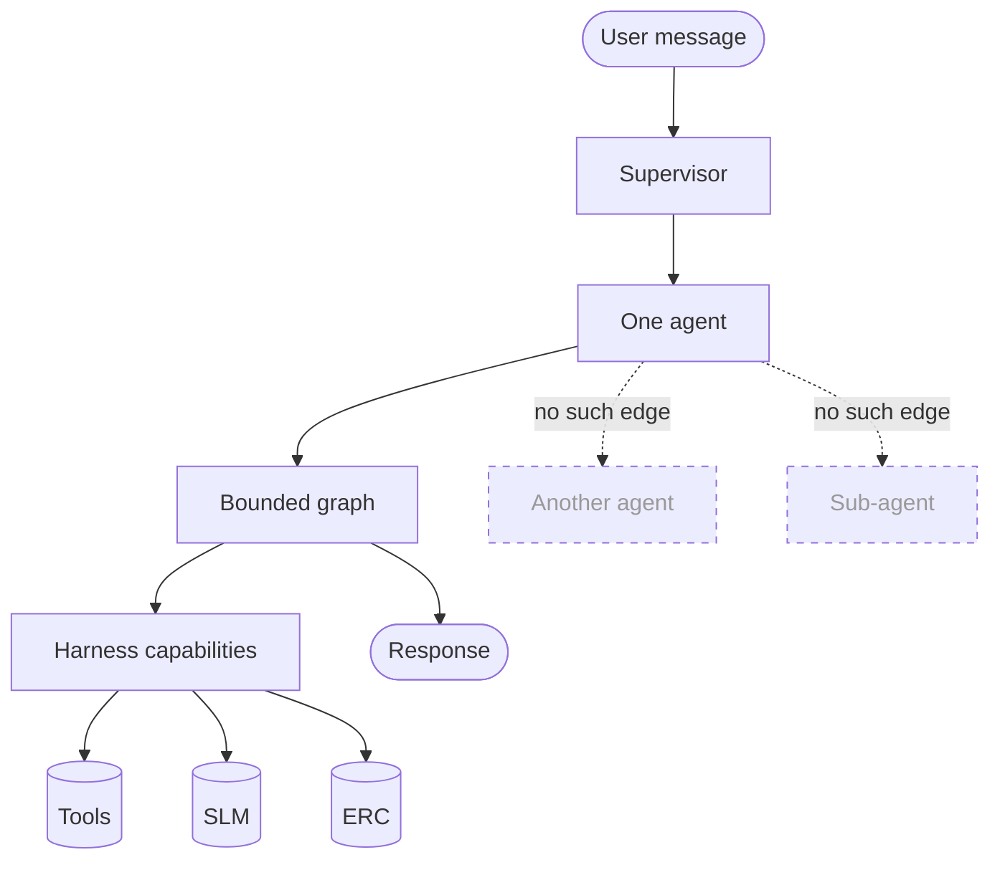

# ADR-D3-02 — Agentic architecture style: supervisor with workflow agents, no autonomous delegation

## 1. Summary

A single supervisor routes to one workflow agent per turn. Agents do not delegate to each other,
do not spawn sub-agents, and do not plan across workflows. "Agentic" here means an agent executes
a bounded graph with tool access under a harness — not that agents negotiate, decompose goals
autonomously, or decide their own scope.

## 2. Context and Problem Statement

Doc 7 §3 gives the agentic orchestration model, §4 names four core components, §5 the supervisor's
responsibility, §6–§7 workflow-level agents and why. Doc 7 §11 gives the supervisor-to-agent flow.
Doc 7 §67–§69 draw reasoning and deterministic control boundaries; §72–§73 cover the agent loop
and its protection. Doc 1 §9–§11 place supervisor, agents and harness. Doc 2 §3.7 requires
workflow-level agents.

The term "agentic" carries a great deal of unstated variation, and the specification set uses it
without pinning down which variant. The plausible readings differ enormously in risk:

- **Supervisor-routed.** One supervisor selects one agent; that agent executes a bounded graph.
  This is what doc 7 §11's flow diagram shows.
- **Hierarchical delegation.** An agent decomposes its task and delegates sub-tasks to other
  agents, which may delegate further.
- **Peer collaboration.** Agents communicate directly, negotiating who handles what.
- **Autonomous planning.** An agent forms a multi-step plan across capabilities and executes it,
  revising as it goes.

Doc 7 §11's diagram implies the first. Nothing explicitly forecloses the others, and each is
something a competent engineer might build when asked for an "agentic AI platform" — the industry
term is used for all four.

The distinction matters for a specific reason that doc 7 §73's loop protection hints at without
naming. In a supervisor-routed model, the bound on a turn's work is a property of one graph, and
it is enforceable: node count, tool calls, tokens, wall-clock. In a delegating model, an agent's
sub-agent has its own budget, and the composition of budgets across an unbounded delegation depth
is unbounded. Loop protection on one agent does not bound a tree of agents.

There is a second and sharper reason. ADR-D2-09 established the harness as the single controlled
execution boundary, and ADR-D1-02 mapped five of six Golden Rule invariants to it. If an agent can
invoke another agent, the question of whether that invocation passes the harness — with its
allowlist, claims check and output validation — becomes a design detail rather than a structural
guarantee. The safest agent-to-agent call is the one that cannot be made.

Third, ADR-D1-11 builds exactly one agent. Delegation machinery would be built for a topology that
does not exist and cannot be tested.

## 3. Decision Drivers

### 3.1 Functional drivers

| ID | Driver | Source |
|---|---|---|
| DR-F-01 | The supervisor routes to a workflow agent | doc 7 §5, §11; doc 1 §39 criterion 2 |
| DR-F-02 | An agent owns one end-to-end workflow capability | doc 7 §6–§7; doc 2 §3.7 |
| DR-F-03 | Agent execution must be bounded and loop-protected | doc 7 §72–§73; doc 4 §54 |
| DR-F-04 | The reasoning boundary must be enforceable | doc 7 §67–§69 |
| DR-F-05 | Agents must not bypass tools or override authorization | doc 7 §5 |

### 3.2 Non-functional drivers

| ID | Driver | Target | Source |
|---|---|---|---|
| DR-N-01 | A turn's total work must be bounded | Deterministic ceiling per turn | ADR-D2-09 §7.3 |
| DR-N-02 | Execution must be traceable end to end | One trace per turn, no orphan spans | ADR-D7-03 |
| DR-N-03 | Behaviour must be reproducible for evaluation | Same input, same execution path at temperature 0 | ADR-D3-01 §7.4 |

### 3.3 Constraints

| ID | Constraint | Type | Source |
|---|---|---|---|
| DR-C-01 | One agent exists in the first pass | Organisational | ADR-D1-11 |
| DR-C-02 | Every model and tool interaction passes the harness | Platform | ADR-D2-09 §7.1 |
| DR-C-03 | Agents are logical capabilities in one runtime | Platform | ADR-D2-02 |
| DR-C-04 | Critical controls are deterministic | Platform | doc 2 §3.3 |

### 3.4 Assumptions

| ID | Assumption | If false | Validation |
|---|---|---|---|
| DR-A-01 | One agent per turn is sufficient for real user requests | Multi-workflow requests need a composition mechanism | Phase 23 affiliation experience |
| DR-A-02 | Workflow-level granularity avoids the need for decomposition | Agents become too coarse and need sub-agents | Reviewed at workflow two |
| DR-A-03 | Bounded graphs express the workflows the platform needs | Some workflow needs open-ended planning | Phase 4 spike against the affiliation graph |

## 4. Evaluation Criteria and Weights

| ID | Criterion | Weight | Rationale | Measurement |
|---|---|---|---|---|
| EC-01 | Boundedness of a turn's work | 30 | An unbounded turn is unbounded cost, latency and enterprise load; doc 7 §73 requires protection | Is there a deterministic ceiling? |
| EC-02 | Enforceability of the harness boundary | 30 | Five of six Golden Rule invariants depend on it (ADR-D1-02 §7.1) | Can any execution path avoid the harness? |
| EC-03 | Traceability and reproducibility | 20 | Evaluation and audit both need a determinate execution path | One trace per turn; same path per input? |
| EC-04 | Expressiveness for real requests | 15 | A style too restrictive cannot serve users | Can a real user request be served? |
| EC-05 | Implementation cost | 5 | Real but small relative to the others | Machinery to build |
| | **Total** | **100** | | |

Scoring scale: **1** unacceptable · **2** poor · **3** adequate · **4** good · **5** excellent.

EC-01 and EC-02 share the top weight at 30 each, which is unusual and deliberate: they are the two
properties that separate a controllable platform from an uncontrollable one, and both are stated
requirements rather than preferences.

## 5. Alternatives Considered

### 5.1 Option A — Supervisor-routed, one agent per turn, bounded graph

**Description.** The supervisor selects one agent. That agent executes a bounded LangGraph with
harness-mediated capabilities. No agent-to-agent invocation exists.

**Strengths.**
- A turn's ceiling is one graph's limits — node count, tool calls, tokens, wall-clock — all
  enforceable in one place (EC-01).
- Every capability call is harness-mediated because there is no other call type (EC-02).
- One trace per turn with a determinate path (EC-03).
- Matches doc 7 §11's flow exactly.
- Nothing built for a topology that does not exist (EC-05).

**Weaknesses.**
- A request spanning two workflows needs clarification or sequential turns rather than composition
  (EC-04).
- Coarse agents may need internal complexity that delegation would externalise.
- Cannot exploit parallel agent execution for genuinely independent sub-tasks.

**Cost / effort.** Lowest.

### 5.2 Option B — Hierarchical delegation with depth limits

**Description.** As A, but an agent may invoke a sub-agent through the harness, with a maximum
delegation depth.

**Strengths.**
- Complex workflows decompose naturally.
- Sub-agents are reusable across parent workflows.
- Depth limit bounds the tree.
- Harness mediation can be preserved if delegation goes through it.

**Weaknesses.**
- Bounding is composite and fragile: depth × branching × per-agent limits, and the worst case is
  the product. A depth of 3 with 3 sub-agents each is 27 leaf executions, each with its own tool
  budget (EC-01 materially weakened).
- Whether delegation passes the harness becomes a design detail rather than a structural fact —
  the safest agent-to-agent call is one that cannot be made (EC-02).
- Trace becomes a tree, and attributing cost, latency and failure to a turn is harder (EC-03).
- Built for a topology that does not exist under DR-C-01 and cannot be tested with one agent.

**Cost / effort.** Moderate, for speculative benefit.

### 5.3 Option C — Autonomous planning agent

**Description.** A single agent forms a multi-step plan across all available capabilities and
executes it, revising as results arrive.

**Strengths.**
- Maximum flexibility; handles requests no fixed graph anticipated (EC-04).
- Adapts to intermediate results.
- Fewer components — no supervisor routing needed.
- Closest to what "agentic AI" popularly means.

**Weaknesses.**
- The plan is model output, so execution path is non-deterministic and unreproducible (EC-03
  fails). Evaluation against a golden set becomes impossible in the ADR-D3-01 §7.4 sense.
- Bounding requires cutting off mid-plan, which leaves work half-done — the affiliation submission
  case where an application is created but products are not attached.
- Planning across capabilities means the model sequences enterprise operations, which ADR-D2-08
  §5.2 rejected and doc 2 §3.3 forbids for critical controls.
- Under ADR-D3-01's taxonomy this is close to C4: the plan acts with the harness checking
  individual calls but nothing checking the plan.

**Cost / effort.** Moderate to build, high to assure.

### 5.4 Option D — Peer collaboration between agents

**Description.** Agents communicate directly, negotiating responsibility and exchanging results.

**Strengths.**
- Natural for genuinely collaborative tasks.
- No single point of routing.
- Agents can be developed and reasoned about independently.

**Weaknesses.**
- No bound on a conversation between agents; termination is emergent rather than enforced (EC-01
  fails).
- Direct agent-to-agent communication is by definition outside the harness (EC-02 fails).
- Non-deterministic and untraceable as a single turn (EC-03 fails).
- Solves a problem the platform does not have: workflows are independent, not collaborative.

**Cost / effort.** High, for no identified need.

## 6. Evaluation Method and Decision Matrix

**Method.** Weighted scoring against §4. EC-01 assessed by asking what the worst-case work in one
turn is under each option. EC-02 assessed by asking whether any execution path could avoid the
harness.

| Criterion | Weight | A: Supervisor-routed | B: Hierarchical | C: Autonomous planning | D: Peer |
|---|---|---|---|---|---|
| EC-01 Boundedness | 30 | 5 | 3 | 2 | 1 |
| EC-02 Harness enforceability | 30 | 5 | 3 | 3 | 1 |
| EC-03 Traceability | 20 | 5 | 3 | 1 | 1 |
| EC-04 Expressiveness | 15 | 3 | 5 | 5 | 4 |
| EC-05 Cost | 5 | 5 | 3 | 3 | 1 |
| **Weighted total** | **100** | **470** | **330** | **260** | **155** |

- **Option A:** (30×5) + (30×5) + (20×5) + (15×3) + (5×5) = 150 + 150 + 100 + 45 + 25 = **470**

**Sensitivity.** A leads B by 140 points, losing only on expressiveness. EC-04's weight would have
to exceed about 75 — half the total, and more than boundedness and harness enforceability combined
— before B overtakes A. That would amount to asserting that serving any conceivable request
matters more than bounding what the platform can do in a turn. C and D fail on traceability and
harness enforceability respectively, and both would make ADR-D3-01's C4 prohibition difficult to
assert.

## 7. Decision

### 7.1 One supervisor, one agent per turn

```
User message → Supervisor → exactly one agent → bounded graph → response
```

The supervisor selects one agent (ADR-D2-05). That agent executes its graph (ADR-D2-06) with
capabilities injected by the harness (ADR-D2-09). The turn ends.

**No agent invokes another agent.** There is no delegation, no sub-agent spawning, no peer
messaging. The `AgentCapabilities` protocol (ADR-D2-09 §7.1) exposes no method that invokes an
agent, which makes this structural rather than a rule.

### 7.2 What "agentic" means here

The term is used in the specifications and is worth pinning down, because it does not mean what it
often means elsewhere:

| Agentic here means | Agentic here does not mean |
|---|---|
| An agent executes a graph with conditional branching based on results | An agent forms its own plan |
| An agent decides which tool to call next, within its allowlist | An agent decides what it is allowed to do |
| An agent loops — gather, reason, act, check — under a bound | An agent loops until it judges itself finished |
| An agent handles a workflow end to end across turns and suspensions | An agent decomposes work and delegates it |
| An agent reasons about how to explain an outcome | An agent reasons about whether an outcome is correct |

Doc 7 §67–§69's reasoning boundary is the same distinction: the agent reasons about *interpretation
and communication*, and does not reason about *business correctness or its own authority*.

### 7.3 Multi-workflow requests

DR-A-01's case: a user asks something spanning two workflows — "sort my affiliation and enter the
county cup". Option A cannot compose them in one turn. The handling:

1. The supervisor detects multiple candidate workflows and **clarifies** (ADR-D2-05 §7.4, doc 7
   §14) rather than guessing or attempting both.
2. The user's answer selects one; that workflow proceeds.
3. The second remains available; the conversation may reach it in a later turn, with its own
   workflow instance associated to the same conversation (doc 6 §23).

This is sequential rather than composed, and it is the honest handling: doc 7 §14 is explicit that
the supervisor should not guess when the wrong workflow could trigger an incorrect enterprise
operation, and attempting two workflows to satisfy an ambiguous request is a compound version of
exactly that.

With one agent (DR-C-01) this case does not yet arise. It is decided now because the routing
design must accommodate it from the start (ADR-D1-10 §7.5).

### 7.4 The agent loop and its bound

Doc 7 §72's agent loop — gather context, reason, select a tool, execute, validate, check
completion — is bounded by the harness's cumulative limits (ADR-D2-09 §7.3). Under Option A those
limits are complete: there is no execution outside the graph, so the ceiling on a turn is the
ceiling on one graph.

The completion check is the agent's, but "am I finished?" is bounded by the limits rather than
being the sole termination condition. An agent that never concludes it is finished is terminated
by the loop limit with state preserved, which is a controlled outcome rather than a runaway.

### 7.5 If a workflow proves too coarse

DR-A-02's risk: an agent grows until it needs internal decomposition. The response is **graph
structure**, not sub-agents:

- Sub-graphs within the agent's own graph, sharing its budget and its harness capabilities.
- Node-level composition, where a complex step is several nodes rather than a delegated agent.

Both keep the turn's ceiling as one graph's limits and keep every capability call harness-mediated.
Neither introduces an agent-to-agent boundary.

If a capability is genuinely reusable across workflows, it becomes a **tool** (ADR-D2-13 §7.2) or a
shared node, not an agent. The distinction: an agent owns a user-facing workflow; a tool or node
performs a step within one.

**Status rationale.** Accepted. Tier 1 under ADR-D0-03 §7.1 — agent architecture is a named doc 2
§52 category — ratified by the external ADF/ADR governance forum.

## 8. Architecture Detail

### 8.1 The topology, and what is absent



The dashed edges are the decision. They are absent from the code, not merely discouraged: no
method on `AgentCapabilities` returns or invokes an agent.

### 8.2 Worst-case work in a turn

| Under Option A | Under Option B (depth 3, branching 3) |
|---|---|
| One graph | Up to 27 leaf agent executions |
| Node limit: N | 27 × N nodes |
| Tool call limit: T | 27 × T tool calls |
| Token limit: K | 27 × K tokens |
| Wall-clock: W | Bounded by W only if propagated correctly through every level |

The right-hand column is why EC-01 separates the options so decisively. A depth limit bounds the
tree's height, not its work, and the work is what costs money, latency and enterprise load.

### 8.3 Reasoning boundary in practice

Doc 7 §67–§69's boundary, applied to the affiliation agent:

| The agent reasons about | The agent does not reason about |
|---|---|
| Which context to gather next | Whether the club is eligible |
| Which tool serves the user's stated need | Whether the enterprise's answer is right |
| How to explain a pre-check failure | Whether a DBS requirement should apply |
| Whether it has enough information to proceed | Whether it may proceed without authorization |
| How to phrase a rejection | Whether the rejection was justified |

The right column is not a matter of prompting. Eligibility comes from an enterprise response
(ADR-D1-01 §7.3); authorization comes from claims (ADR-D1-02 I-2); the agent has no capability
that would let it form a view. The boundary is architectural, and §7.1's absence of delegation is
part of what keeps it so — a sub-agent asked to "assess eligibility" would be reasoning where it
must not.

## 9. Consequences

### 9.1 Positive

- A turn's work has a deterministic ceiling enforced in one place.
- Every capability call is harness-mediated because no other call type exists.
- One trace per turn with a determinate execution path, so evaluation and audit both work.
- Nothing built for a topology that does not exist under ADR-D1-11.
- The reasoning boundary is architectural rather than prompted.

### 9.2 Negative

- A request spanning workflows requires clarification and sequential turns rather than
  composition, which is a worse experience for that case.
- Genuinely independent sub-tasks cannot execute in parallel across agents; parallelism is
  available only within a graph (ADR-D2-08).
- An agent that grows complex must handle it internally through graph structure.
- Forecloses architectures the industry increasingly assumes, which will need explaining.

### 9.3 Neutral

- Matches doc 7 §11's flow, which is the specification's own diagram.
- With one agent (DR-C-01) most of this decision constrains what will be built later rather than
  what is built now.

### 9.4 Trade-offs explicitly accepted

| Given up | In exchange for | Accepted by |
|---|---|---|
| Composition of multiple workflows in one turn | A deterministic ceiling on a turn's work | External ADF/ADR forum |
| Agent reusability through delegation | Every capability call structurally harness-mediated | Security Owner |
| Autonomous planning flexibility | Reproducible execution paths that can be evaluated | AI Evaluation Owner |

## 10. Golden-Rule and Precedence Conformance

| Constraint | Conformance |
|---|---|
| Enterprise decides; AI orchestrates | §8.3's boundary is this rule at the agent level. The agent has no capability that would let it form a business view, and §7.1's absence of delegation prevents creating one indirectly. |
| Authoritative-truth precedence | Agents receive resolved context from the harness; they do not select among sources. |
| Four-state separation | One agent per turn means one workflow state per execution; no cross-agent state sharing exists to conflate. |
| Versioned artefacts, never mutated in place | Agent definitions and graphs are versioned (doc 7 §21; ADR-D5-06). |
| Adam persona governs how, never what | §7.2's table distinguishes reasoning about explanation from reasoning about correctness — the persona operates entirely in the former. |

## 11. Risks and Mitigations

| ID | Risk | Likelihood | Impact | Exposure | Mitigation | Owner | Residual |
|---|---|---|---|---|---|---|---|
| RSK-01 | Delegation is added later as a convenience | Medium | High | High | No capability method invokes an agent (§7.1); adding one is a tier 1 supersession; QM-02 | AI Solution Architect | Low |
| RSK-02 | Multi-workflow requests frustrate users (DR-A-01) | Medium | Medium | Medium | §7.3's clarification path; measured once a second workflow exists; QM-04 | AI Product Owner | Medium |
| RSK-03 | An agent grows too complex without decomposition (DR-A-02) | Medium | Medium | Medium | §7.5's sub-graphs and shared nodes; a reusable capability becomes a tool | AI Engineering Lead | Medium |
| RSK-04 | A workflow needs open-ended planning (DR-A-03) | Low | High | Medium | Phase 4 spike against the affiliation graph; a genuine need would be a tier 1 reconsideration | AI Solution Architect | Low |
| RSK-05 | The agent loop's completion check becomes the effective bound | Medium | Medium | Medium | §7.4: limits terminate regardless; QM-03 tracks limit terminations | AI Engineering Lead | Low |
| RSK-06 | External pressure to adopt a popular agentic framework pattern | Medium | Medium | Medium | This ADR's rationale; EC-01 and EC-02 are stated requirements, not preferences | AI Platform Owner | Low |

## 12. Quantitative Targets and Measures

| ID | Measure | Target | Threshold (alert) | Source | Review cadence |
|---|---|---|---|---|---|
| QM-01 | Agents invoked per turn | 1 | ≥2 | Trace audit | Daily |
| QM-02 | Code paths invoking an agent from within an agent | 0 | ≥1 | Static analysis | Per build |
| QM-03 | Turns terminated by loop or budget limit | ≤2% | >5% | Harness metrics | Weekly |
| QM-04 | Requests requiring clarification due to multiple candidate workflows | Tracked | >15% once a second agent exists | Supervisor metrics | Monthly |
| QM-05 | Turns with more than one trace root | 0 | ≥1 | Trace audit | Daily |

QM-05 is a proxy for the whole decision: a turn producing more than one trace root would mean an
execution path outside the single graph.

## 13. Security, Privacy and Compliance Impact

| Dimension | Impact |
|---|---|
| Attack surface change | Substantially bounded. Every model and tool interaction passes the harness because no other path exists, so a compromised or manipulated agent reaches only its own allowlist. Delegation would create a path whose mediation depended on implementation care. |
| Data classification touched | Per workflow; one agent per turn means one workflow's data scope per execution. |
| Personal data / PII | No cross-agent data sharing exists, so personal data assembled for one workflow cannot flow to another through delegation. |
| Children's data and safeguarding | Safeguarding context is assembled for the affiliation agent's declared requirements and reaches no other agent, because there is no other agent to reach. Under delegation, a sub-agent's scope would need explicit constraint. |
| UK GDPR lawful basis and rights impact | One agent per turn under one archetype scope keeps processing purpose-bounded (Art. 5(1)(b)). |
| Audit and evidential requirements | One trace per turn with a determinate path gives complete, attributable execution evidence. |
| Standards touched | ISO/IEC 42001 (AI system autonomy and oversight); NIST AI RMF GOVERN 1.3, MANAGE 2.2; EU AI Act Art. 14 — bounded, non-autonomous execution is central to the oversight case. |

## 14. Implementation Impact

| Aspect | Detail |
|---|---|
| Build phases | 4 (supervisor, agent contract, harness, graph) |
| Repository paths | `src/pf_ft_ai/orchestration/`, `src/pf_ft_ai/agents/` |
| Configuration | Per-agent limits in `config/base/agents.yaml` |
| Contracts / schemas | `AgentCapabilities` protocol — no agent-invoking method |
| Migration | None |
| Dependencies on other ADRs | ADR-D2-05 (routing), ADR-D2-06 (graph), ADR-D2-09 (harness), ADR-D1-11 (one agent) |
| Effort estimate | Small — the decision mostly constrains what is not built |

## 15. Validation and Verification

| ID | Acceptance criterion | Verification method |
|---|---|---|
| AC-01 | Exactly one agent executes per turn | Trace audit; QM-01 |
| AC-02 | `AgentCapabilities` exposes no agent-invoking method | Interface audit; QM-02 |
| AC-03 | A turn's total work is bounded by one graph's limits | Limit test with an adversarial graph |
| AC-04 | An ambiguous multi-workflow request produces clarification, not attempted composition | Supervisor test with the synthetic second agent |
| AC-05 | An agent that never self-terminates is stopped by the loop limit with state preserved | Loop protection test |
| AC-06 | Each turn produces exactly one trace root | Trace audit; QM-05 |

## 16. Operational Impact

| Aspect | Detail |
|---|---|
| Monitoring | Agent per turn; graph node count; limit consumption; termination causes |
| Alerting | QM-01, QM-02 and QM-05 on any occurrence; QM-03 on elevated terminations |
| Runbook | None specific |
| Failure mode and degradation | A turn hitting its limit terminates with a clear statement and preserved state. There is no partially-completed delegation tree to reconcile. |
| Rollback | Limits are configuration |
| Support model impact | One trace per turn makes "what did it do?" answerable directly |

## 17. Cost Impact

| Cost element | One-off | Recurring | Basis |
|---|---|---|---|
| Supervisor and agent contract | Phase 4 | — | `DEVELOPMENT-GUIDE.md` §4 |
| Per-turn inference and tool calls | — | Bounded by one graph's limits | §8.2 |
| Avoided cost | — | Substantial | §8.2's right-hand column: a delegating topology's worst case is the product of its budgets |

## 18. Revisit Triggers and Causal Analysis Hooks

| ID | Trigger | Detected by | Action on trigger |
|---|---|---|---|
| RT-01 | QM-02 finds an agent-invoking code path | CI | Build failure; a tier 1 supersession would be required to permit it |
| RT-02 | QM-04 shows multi-workflow clarification above 15% | Monthly, once a second agent exists | Users are asking across workflows; consider whether the workflow boundary is drawn wrongly, not whether to add delegation |
| RT-03 | An agent requires internal decomposition (DR-A-02) | Design review | Apply §7.5's graph structure; escalate only if graph composition is inadequate |
| RT-04 | A workflow genuinely needs open-ended planning (DR-A-03) | Phase 4 spike or workflow design | Tier 1 reconsideration; EC-03's reproducibility loss must be accepted explicitly |
| RT-05 | QM-03 shows limit terminations above 5% | Weekly | Distinguish runaway loops from limits set too tight before adjusting |

**Scheduled review:** 2027-08-21.

## 19. Traceability

| Dimension | Reference |
|---|---|
| Workshop sheet | WS-13 Agentic AI Architecture |
| Specification sections | doc 7 §2–§4 (Core Principle, Orchestration Model, Four Core Components), §5 (Supervisor Responsibility), §6–§7 (Workflow-Level Agents, Why), §10 (Enterprise Workflow Boundary), §11 (Supervisor-to-Agent Flow), §14 (Clarification), §67–§69 (Reasoning Boundary, Deterministic Control Boundary, AI Reasoning Boundary), §72–§73 (Agent Loop, Loop Protection); doc 1 §9–§11, §39 criterion 2; doc 2 §3.3, §3.7, §48; doc 6 §23 |
| Requirement IDs | `FR-A39-02`, `FR-A39-03`, `NFR-A38-SEC` |
| Build phases | 4 |
| Code paths | `src/pf_ft_ai/orchestration/`, `src/pf_ft_ai/agents/` |
| Configuration | `config/base/agents.yaml` |
| Tests | AC-01 to AC-06 |
| Upstream ADRs | ADR-D1-11, ADR-D2-05, ADR-D2-09, ADR-D3-01 |
| Downstream ADRs | ADR-D3-03, ADR-D3-04, ADR-D3-05 |

## 20. Change Log

| Version | Date | Author | Change |
|---|---|---|---|
| 1.0.0 | 2026-08-21 | AI Solution Architect | Initial decision recorded. Supervisor-routed with one agent per turn; no delegation, sub-agents or peer messaging, enforced by the capability protocol exposing no agent-invoking method. Boundedness and harness enforceability weighted jointly highest, since a delegating topology's worst-case work is the product of its budgets rather than the sum. Tier 1 — ratified by the external ADF/ADR forum. |
