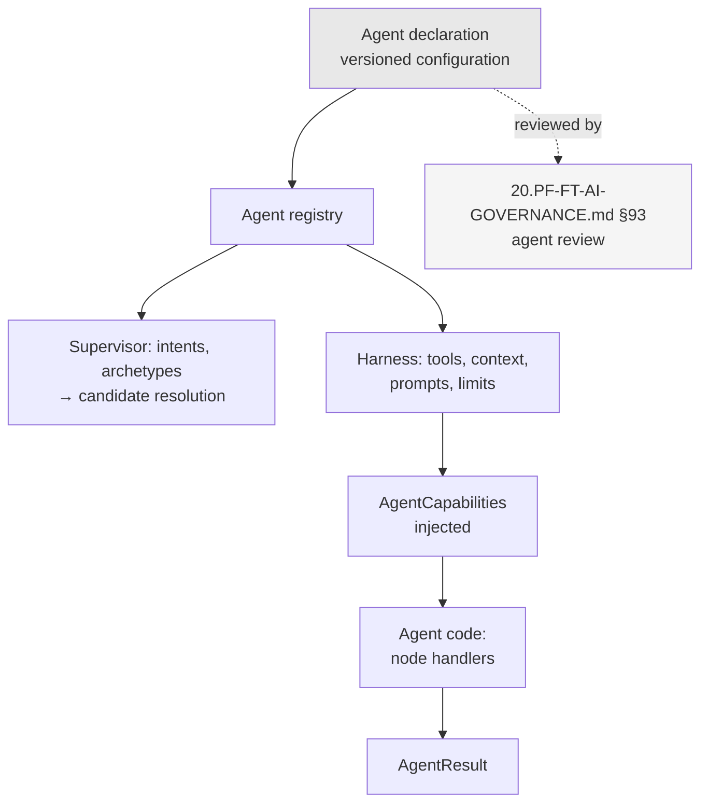

# ADR-D3-03 — Agent contract, capability registration and lifecycle

## 1. Summary

An agent declares its capabilities, context requirements and tool needs **as configuration**, and
implements a narrow execution contract in code. The declaration is what the supervisor routes on,
what the harness enforces, and what governance reviews — so an agent's permitted reach is
reviewable without reading its implementation.

## 2. Context and Problem Statement

7 PF-FT-AI-AGENTIC-ORCHESTRATION.md §16 gives the agent lifecycle, §17 the execution contract, §18 the execution context, §19
the agent result, §20 agent configuration, §21 versioning, §22–§23 the capability registry and an
example, §24 agent selection. 20.PF-FT-AI-GOVERNANCE.md §45–§46 cover agent governance and capability boundaries;
§93 covers agent review.

The material describes an agent from several angles and leaves one question underdetermined: **what
is declared versus what is coded?**

Two coherent positions exist.

- **Code-first.** The agent's implementation determines what it does; the registry entry is
  metadata for routing. Capability boundaries are whatever the code does.
- **Declaration-first.** The agent's configuration declares what it may do — intents, context
  requirements, tools — and the harness enforces the declaration. The code implements behaviour
  *within* the declaration.

20.PF-FT-AI-GOVERNANCE.md §46 requires agent capability boundaries, and 20.PF-FT-AI-GOVERNANCE.md §93 requires agent review. Both are
hard to satisfy under a code-first model: reviewing an agent's capability boundary means reading
its implementation and reasoning about what it *could* do, which is neither reliable nor
repeatable. Under declaration-first, the review reads a configuration file.

There is a second question. 7 PF-FT-AI-AGENTIC-ORCHESTRATION.md §16's lifecycle and §21's versioning imply agents have states
and versions, but the interaction between them and the platform's release model (ADR-D5-06) is not
stated. An agent in "draft" that can be routed to in production would be a governance hole; an
agent whose version is independent of the release bundle would break the immutable-bundle rule.

Third: ADR-D1-11 built multi-agent interfaces for one agent, with the requirement (its §7.3) that
the contract be satisfiable by an implementation that is not affiliation. The contract's shape
determines whether that holds, and its §15 AC-04 requires a paper-design review against a second
candidate workflow before Phase 23 exit.

## 3. Decision Drivers

### 3.1 Functional drivers

| ID | Driver | Source |
|---|---|---|
| DR-F-01 | An agent must declare its capabilities for registry-based selection | 7 PF-FT-AI-AGENTIC-ORCHESTRATION.md §22–§24 |
| DR-F-02 | Agent capability boundaries must be defined and reviewable | 20.PF-FT-AI-GOVERNANCE.md §46, §93 |
| DR-F-03 | The execution contract must be uniform across agents | 7 PF-FT-AI-AGENTIC-ORCHESTRATION.md §17 |
| DR-F-04 | Agents must be versioned | 7 PF-FT-AI-AGENTIC-ORCHESTRATION.md §21 |
| DR-F-05 | The contract must generalise beyond affiliation | ADR-D1-11 §7.3, AC-04 |
| DR-F-06 | Agent result must be a defined shape | 7 PF-FT-AI-AGENTIC-ORCHESTRATION.md §19 |

### 3.2 Non-functional drivers

| ID | Driver | Target | Source |
|---|---|---|---|
| DR-N-01 | Adding an agent must not change orchestration code | 0 orchestration changes | ADR-D1-11 §8.2 |
| DR-N-02 | An agent's permitted reach must be determinable without reading its code | Reviewable from configuration | 20.PF-FT-AI-GOVERNANCE.md §93 |
| DR-N-03 | Agent versions must compose with release bundles | Agent version is part of the bundle | ADR-D5-06 |

### 3.3 Constraints

| ID | Constraint | Type | Source |
|---|---|---|---|
| DR-C-01 | Agents receive capabilities by injection, importing nothing | Platform | ADR-D2-09 §7.1 |
| DR-C-02 | Agents may not execute business rules, bypass tools or override authorization | Platform | 7 PF-FT-AI-AGENTIC-ORCHESTRATION.md §5 |
| DR-C-03 | One agent per turn; no delegation | Platform | ADR-D3-02 §7.1 |
| DR-C-04 | Configuration is versioned and released as an immutable bundle | Platform | ADR-D5-06 |

### 3.4 Assumptions

| ID | Assumption | If false | Validation |
|---|---|---|---|
| DR-A-01 | An agent's context and tool needs are declarable in advance | Declaration is incomplete and the harness blocks legitimate work | Phase 4 against the affiliation graph |
| DR-A-02 | The contract derived from affiliation generalises | Amendment at agent two, breaching DR-N-01 | ADR-D1-11 AC-04's paper-design review |
| DR-A-03 | Declaration granularity is right — neither too coarse to constrain nor too fine to maintain | Rebalancing needed | Reviewed at agent two |

## 4. Evaluation Criteria and Weights

| ID | Criterion | Weight | Rationale | Measurement |
|---|---|---|---|---|
| EC-01 | Reviewability of capability boundary | 30 | 20.PF-FT-AI-GOVERNANCE.md §46 and §93 require it; a boundary that needs code reading is not reviewable in practice | Can reach be determined from configuration alone? |
| EC-02 | Enforceability of the declaration | 25 | A declaration nothing enforces is documentation | Does the harness constrain the agent to its declaration? |
| EC-03 | Generality across workflows | 20 | ADR-D1-11's extensibility claim depends on it | Would a second workflow fit unchanged? |
| EC-04 | Implementation ergonomics | 15 | A contract that fights the developer gets worked around | Effort to build an agent |
| EC-05 | Version and release composition | 10 | Agent versions must fit the bundle model | Does agent version compose with release? |
| | **Total** | **100** | | |

Scoring scale: **1** unacceptable · **2** poor · **3** adequate · **4** good · **5** excellent.

## 5. Alternatives Considered

### 5.1 Option A — Code-first: the implementation defines the agent

**Description.** An agent is a class implementing an execution method. Its registry entry carries
a name and description for routing. Capabilities are whatever the code exercises.

**Strengths.**
- Most natural to write; no declaration to keep in step with behaviour (EC-04).
- No possibility of declaration and implementation diverging.
- Flexible — an agent can do whatever the harness permits.
- Least configuration.

**Weaknesses.**
- Capability boundary is not reviewable without reading the implementation and reasoning about
  reachability, which 20.PF-FT-AI-GOVERNANCE.md §93's review cannot do reliably (EC-01 fails).
- Nothing constrains an agent to a declared scope, so the harness's per-agent allowlist would have
  to be maintained separately from the agent, and drift is invisible (EC-02).
- Context requirements discovered at runtime prevent ADR-D2-08's execution planning, which needs
  the full requirement set up front.

**Cost / effort.** Lowest, with governance and planning consequences.

### 5.2 Option B — Declaration-first: configuration declares, harness enforces, code implements within

**Description.** An agent declares in versioned configuration: the intents it serves, its context
requirements per workflow step, its tool allowlist, its prompt layers, its limits. The harness
enforces the declaration. Code implements node handlers within it.

**Strengths.**
- Capability boundary is one configuration file, reviewable by governance without reading code
  (EC-01).
- The harness enforces the declaration, so it is a constraint rather than documentation (EC-02).
- Declared context requirements enable ADR-D2-08's planning.
- Adding an agent is a declaration plus handlers; orchestration is untouched (DR-N-01).
- Declaration is versioned configuration and composes with release bundles (EC-05).

**Weaknesses.**
- Declaration and implementation can diverge — an agent needing something undeclared is blocked
  (DR-A-01).
- More configuration to author and maintain.
- Getting granularity right is a judgement (DR-A-03).
- A developer meeting a block must edit configuration, which is friction (EC-04).

**Cost / effort.** Moderate.

### 5.3 Option C — Declaration derived from code by introspection

**Description.** The agent is written in code; a build step introspects it to derive its
declaration, which the harness then enforces.

**Strengths.**
- No divergence possible — the declaration is generated (EC-02, partially).
- Natural to write, like Option A (EC-04).
- Declaration exists for review (EC-01, partially).
- No dual maintenance.

**Weaknesses.**
- The derived declaration describes what the code *does*, not what it is *permitted* to do. A
  review would be reading a description of current behaviour, and any behaviour the code adds
  automatically becomes permitted (EC-01 fails in substance).
- Introspection over dynamic Python is unreliable; a conditional tool call may not be derivable.
- Governance would approve a declaration that changes whenever the code changes, which is not
  approval.

**Cost / effort.** Moderate, with a governance flaw.

### 5.4 Option D — Declaration-first with runtime capability negotiation

**Description.** The agent declares a baseline and may request additional capabilities at runtime,
which the harness grants or refuses by policy.

**Strengths.**
- Handles DR-A-01's case: an agent needing something undeclared can ask.
- Baseline declaration still reviewable.
- Flexible without abandoning the declaration model.
- Refusals are visible.

**Weaknesses.**
- The reviewable boundary becomes baseline-plus-whatever-policy-permits, which is materially less
  clear than a fixed declaration (EC-01 weakened).
- Runtime negotiation is a decision path the model could influence if the request derives from
  reasoning — the ADR-D1-02 I-2 concern.
- Adds machinery for a case that §7.5's alternative handles without it.

**Cost / effort.** Moderate, for a case better solved another way.

## 6. Evaluation Method and Decision Matrix

**Method.** Weighted scoring against §4. EC-01 tested by asking: given only what governance would
review, can a reviewer state which enterprise data and operations the agent can reach?

| Criterion | Weight | A: Code-first | B: Declaration-first | C: Derived | D: Negotiated |
|---|---|---|---|---|---|
| EC-01 Reviewability | 30 | 1 | 5 | 2 | 3 |
| EC-02 Enforceability | 25 | 2 | 5 | 4 | 4 |
| EC-03 Generality | 20 | 3 | 5 | 3 | 4 |
| EC-04 Ergonomics | 15 | 5 | 3 | 5 | 4 |
| EC-05 Version composition | 10 | 2 | 5 | 3 | 4 |
| **Weighted total** | **100** | **235** | **470** | **320** | **375** |

- **Option B:** (30×5) + (25×5) + (20×5) + (15×3) + (10×5) = 150 + 125 + 100 + 45 + 50 = **470**

**Sensitivity.** B leads D by 95 points and loses only on ergonomics, worth 15 points. C's score
overstates it: its reviewability failure is qualitative rather than a matter of degree, since
reviewing a generated description of current behaviour is not reviewing a boundary. A is excluded
by 20.PF-FT-AI-GOVERNANCE.md §46 and §93 in substance.

## 7. Decision

### 7.1 The declaration

An agent declares, in versioned configuration:

```yaml
agent:
  id: affiliation_agent
  version: 1.0.0
  status: active                      # 7 PF-FT-AI-AGENTIC-ORCHESTRATION.md §16 lifecycle
  capability:
    intents: [club_affiliation, affiliation_status, affiliation_payment]
    description: >
      Guides a club administrator through affiliating their club and teams
      for a season, from pre-checks to completion.
  graph: affiliation_graph@1.0.0
  context_requirements:               # per workflow step, ADR-D2-12 §7.4
    pre_check:
      mandatory: [club, club_officials, teams, team_officials,
                  official_compliance, grounds, league_memberships, debt]
      optional: [insurance_history]
    submission:
      mandatory: [application, selected_teams, product_selections]
  tools:                              # allowlist, ADR-D6-10
    - get_club
    - get_club_debt
    - list_teams
    - submit_affiliation
  prompts:
    system: affiliation.system@1.2.0
    persona: adam.guiding@1.1.0
  limits:
    max_model_calls: 12
    max_tool_calls: 20
    max_tokens: 60000
    max_wall_clock_s: 90
  archetypes: [club_administrator, county_administrator]
```

This is the agent's **permitted reach**, and it is what governance reviews under 20.PF-FT-AI-GOVERNANCE.md §93. A
reviewer can answer "what enterprise data can this agent see, and what can it do?" from this file
alone, which is EC-01 satisfied concretely.

### 7.2 The harness enforces the declaration

Per DR-C-01 and ADR-D2-09 §7.1, the harness injects capabilities. It resolves them **from the
declaration**:

| Declaration | Enforcement |
|---|---|
| `tools` | The allowlist checked before every tool call (ADR-D2-09 §8.2 step 2) |
| `context_requirements` | Collection satisfies the declaration and nothing more (ADR-D2-12 §7.4) |
| `prompts` | Composition resolves exactly these versioned layers |
| `limits` | Cumulative limits enforced per run (ADR-D2-09 §7.3) |
| `archetypes` | The agent is routable only for these access archetypes (ADR-D1-07 §7.2) |
| `intents` | The supervisor considers this agent only for these intents (ADR-D2-05 §7.1) |

A capability not declared is not injected. An agent attempting undeclared work does not fail a
check — it has no means to attempt it, which is the ADR-D2-09 §7.1 property applied per agent.

### 7.3 The execution contract in code

7 PF-FT-AI-AGENTIC-ORCHESTRATION.md §17–§19's contract, kept deliberately narrow:

```python
class Agent(Protocol):
    async def handle(
        self,
        context: AgentExecutionContext,   # 7 PF-FT-AI-AGENTIC-ORCHESTRATION.md §18
        capabilities: AgentCapabilities,  # ADR-D2-09 §7.1
    ) -> AgentResult: ...                 # 7 PF-FT-AI-AGENTIC-ORCHESTRATION.md §19
```

- `AgentExecutionContext` carries the graph state reference, workflow associations, claims
  (read-only, ADR-D2-07 §7.4) and the resolved declaration.
- `AgentCapabilities` is the injected surface — no imports, no clients.
- `AgentResult` carries the outcome: completed, suspended with a wait type (ADR-D1-08 §7.2), or
  failed with a reason.

Node handlers within the agent are plain async functions (ADR-D2-06 §7.3), so they are testable
against a stub capability object.

The contract's narrowness is what makes DR-A-02 plausible: there is little in it that could be
affiliation-specific.

### 7.4 Lifecycle and versioning

7 PF-FT-AI-AGENTIC-ORCHESTRATION.md §16's lifecycle and §21's versioning, composed with the release model:

| Status | Routable? | Meaning |
|---|---|---|
| `draft` | No | Under development; present in configuration for non-production environments only |
| `evaluating` | No in production | Passing evaluation gates (ADR-D7-13); routable in test |
| `active` | Yes | Approved and in service |
| `deprecated` | Yes, with a replacement preferred | Superseded; still serves in-flight workflows |
| `retired` | No | Withdrawn; in-flight workflows terminate or migrate |

The supervisor's candidate resolution (ADR-D2-05 §7.1) considers only `active` and `deprecated`
agents, so a `draft` agent cannot be reached in production even if present in configuration. That
closes the governance hole §2 identified.

Agent version composes with the release bundle: the agent declaration, its graph version and its
prompt versions are all part of one immutable release (ADR-D5-06). An agent version change is a
release, and 20.PF-FT-AI-GOVERNANCE.md §49's workflow-change governance applies.

### 7.5 When an agent needs something undeclared

DR-A-01's case, and the reason Option D was rejected. If an agent needs a tool or a context section
its declaration does not include:

1. The need is a **design change**, not a runtime event.
2. The declaration is amended, reviewed under 20.PF-FT-AI-GOVERNANCE.md §93, and released.
3. Until then, the agent cannot do it — and the workflow step that needs it is blocked, visibly.

This is friction by design. A runtime path to acquiring capability would make the reviewed
declaration a floor rather than a boundary, and 20.PF-FT-AI-GOVERNANCE.md §46's capability boundary would mean
something weaker than it says.

### 7.6 Generality: the contract against a second workflow

ADR-D1-11 AC-04 requires the contract reviewed against a paper design of a second candidate
workflow before Phase 23 exit. The elements that must generalise:

| Element | Affiliation | Would a discipline workflow fit? |
|---|---|---|
| `intents` | Affiliation-specific strings | Yes — different strings |
| `context_requirements` per step | ERC sections | Yes — different sections, same shape |
| `tools` allowlist | Affiliation tools | Yes — different tools |
| `prompts` layers | System + persona | Yes; persona variant may differ (ADR-D1-07 §7.4) |
| `limits` | Numeric | Yes |
| `archetypes` | Club and county administrator | Yes — possibly different archetypes |
| `graph` | Affiliation graph | Yes — different graph, same builder |

Nothing in the declaration's *shape* is affiliation-specific. That is the design intent, and AC-04
tests it rather than asserting it.

**Status rationale.** Accepted. Tier 3 under ADR-D0-03 §7.1 — an internal contract design.
Individual agent declarations are separately subject to 20.PF-FT-AI-GOVERNANCE.md §93's agent review, which is where
the capability boundary is approved.

## 8. Architecture Detail

### 8.1 Declaration flowing into enforcement



The declaration is a single artefact serving three consumers — supervisor, harness, governance —
which is why it is the right place to put the boundary.

### 8.2 What a reviewer sees

20.PF-FT-AI-GOVERNANCE.md §93's agent review, under this decision, reads one file and can state:

| Question | Answered by |
|---|---|
| What can this agent do for a user? | `capability.intents` and `description` |
| What enterprise data can it see? | `context_requirements` across all steps |
| What enterprise operations can it perform? | `tools` allowlist |
| Who can reach it? | `archetypes` |
| How much can it consume in one turn? | `limits` |
| What language does it use? | `prompts` |
| Is it in service? | `status` |

Under Option A, every one of these would require reading the implementation and reasoning about
reachability. That difference is the 30-point EC-01 gap.

### 8.3 Interaction with evaluation

The declaration also scopes evaluation (ADR-D3-01 §7.4). An agent's golden cases cover its declared
intents; its tool-selection accuracy is measured against its declared allowlist; its persona is
evaluated against its declared persona layer. Evaluation coverage is therefore derivable from the
declaration rather than curated separately, which is how ADR-D7-13's coverage checks are made
mechanical.

## 9. Consequences

### 9.1 Positive

- An agent's permitted reach is one reviewable configuration file, satisfying 20.PF-FT-AI-GOVERNANCE.md §46 and §93.
- The declaration is enforced by the harness, so it constrains rather than describes.
- Declared context requirements enable ADR-D2-08's execution planning.
- Adding an agent changes no orchestration code (ADR-D1-11 §8.2).
- Evaluation coverage derives from the declaration.
- `draft` agents cannot be routed in production.

### 9.2 Negative

- Declaration and implementation can diverge, and an agent needing something undeclared is blocked
  until the declaration is amended and released.
- More configuration to author and maintain than a code-first agent.
- Declaration granularity is a judgement that may need rebalancing (DR-A-03).
- The friction in §7.5 is deliberate and will be experienced as friction.

### 9.3 Neutral

- The code contract is narrow, which is what makes generality plausible.
- Agent versions compose with release bundles rather than being independent.

### 9.4 Trade-offs explicitly accepted

| Given up | In exchange for | Accepted by |
|---|---|---|
| Implementation flexibility | A capability boundary reviewable without reading code | AI Solution Architect |
| Runtime capability acquisition | A declaration that is a boundary, not a floor | Security Owner |
| Lower configuration overhead | Enforcement derived from what governance approved | AI Platform Owner |

## 10. Golden-Rule and Precedence Conformance

| Constraint | Conformance |
|---|---|
| Enterprise decides; AI orchestrates | The declaration bounds what an agent may reach; 7 PF-FT-AI-AGENTIC-ORCHESTRATION.md §5's prohibitions are enforced by the harness resolving only declared capabilities. |
| Authoritative-truth precedence | Declared context requirements resolve to ERC sections carrying provenance (ADR-D2-12). |
| Four-state separation | The declaration is configuration; execution context carries references to the four state kinds without conflating them. |
| Versioned artefacts, never mutated in place | §7.4: agent declaration, graph and prompts are versioned and released as an immutable bundle (ADR-D5-06). |
| Adam persona governs how, never what | The persona layer is a declared prompt reference, applied after content is determined. |

## 11. Risks and Mitigations

| ID | Risk | Likelihood | Impact | Exposure | Mitigation | Owner | Residual |
|---|---|---|---|---|---|---|---|
| RSK-01 | Declaration drifts from what the agent needs, blocking legitimate work | Medium | Medium | Medium | §7.5's amendment path; blocks are visible rather than silent; QM-03 | AI Engineering Lead | Medium |
| RSK-02 | Declarations become permissive to avoid friction | Medium | High | High | Governance review of the declaration (20.PF-FT-AI-GOVERNANCE.md §93) is where over-permission is caught; QM-02 tracks allowlist size | Security Owner | Medium |
| RSK-03 | Contract proves affiliation-specific (DR-A-02) | Medium | High | High | ADR-D1-11 AC-04's paper-design review before Phase 23 exit; §7.6's element-by-element check | AI Solution Architect | Medium |
| RSK-04 | A `draft` agent is routable in production | Low | High | Medium | §7.4: supervisor considers only `active` and `deprecated`; AC-04 | AI Engineering Lead | Low |
| RSK-05 | Declaration granularity wrong (DR-A-03) | Medium | Low | Low | Reviewed at agent two; granularity is a configuration schema change, not a redesign | AI Solution Architect | Low |
| RSK-06 | Agent version diverges from its release bundle | Low | Medium | Low | §7.4's composition; release manifest includes agent version (ADR-D5-06) | AI Engineering Lead | Low |

## 12. Quantitative Targets and Measures

| ID | Measure | Target | Threshold (alert) | Source | Review cadence |
|---|---|---|---|---|---|
| QM-01 | Capabilities injected that the agent did not declare | 0 | ≥1 | Harness audit | Per build |
| QM-02 | Tools in an agent's allowlist not exercised in evaluation or production | Tracked | >30% | Tool usage against declaration | Quarterly |
| QM-03 | Workflow steps blocked by an undeclared requirement | Tracked | >2 per quarter | Harness rejections | Quarterly |
| QM-04 | Non-`active` agents routable in production | 0 | ≥1 | Registry audit | Per release |
| QM-05 | Orchestration files changed when adding an agent | 0 | ≥1 | Change review at agent two | At agent two |
| QM-06 | Agent declarations without a governance review record | 0 | ≥1 | Governance audit | Quarterly |

QM-02 is the over-permission signal: tools declared but never used suggest an allowlist wider than
the agent needs, which is RSK-02 showing up in data rather than in review.

## 13. Security, Privacy and Compliance Impact

| Dimension | Impact |
|---|---|
| Attack surface change | The declaration is the agent's attack surface, and it is enumerable and reviewable. An agent cannot reach beyond it, so a manipulated agent is bounded by what governance approved. |
| Data classification touched | Determined by `context_requirements`, which is where data reach is declared. |
| Personal data / PII | Declared context requirements are the minimisation control at agent level: the agent sees what its steps declared and nothing else. |
| Children's data and safeguarding | The affiliation agent's `official_compliance` requirement is declared, reviewed and enforced. A reviewer can see, from configuration alone, that this agent reads safeguarding data — and no other agent can, because no other agent declares it. |
| UK GDPR lawful basis and rights impact | Declaration supports purpose limitation (Art. 5(1)(b)) and minimisation (Art. 5(1)(c)) at the agent boundary, with a reviewable record. |
| Audit and evidential requirements | Agent version, declaration version and governance review record together evidence what was approved and what ran. |
| Standards touched | ISO/IEC 27001 A.8.3 (information access restriction), A.5.15; ISO/IEC 42001 (AI system components, change control); NIST AI RMF GOVERN 1.5, MANAGE 2.2. |

## 14. Implementation Impact

| Aspect | Detail |
|---|---|
| Build phases | 4 (contract, registry, harness resolution) |
| Repository paths | `src/pf_ft_ai/orchestration/harness/`, `src/pf_ft_ai/agents/affiliation/` |
| Configuration | `config/base/agents.yaml` — the declaration |
| Contracts / schemas | Agent declaration schema; `Agent` protocol; `AgentExecutionContext`, `AgentResult` |
| Migration | None |
| Dependencies on other ADRs | ADR-D2-09 (harness), ADR-D2-05 (supervisor), ADR-D5-06 (release bundles) |
| Effort estimate | Moderate |

## 15. Validation and Verification

| ID | Acceptance criterion | Verification method |
|---|---|---|
| AC-01 | An agent cannot call a tool outside its declared allowlist | Harness test; ADR-D2-09 AC-03 |
| AC-02 | Context collection satisfies declared requirements and no more | Collection audit; ADR-D2-12 AC-03 |
| AC-03 | Capabilities injected match the declaration exactly | Harness audit; QM-01 |
| AC-04 | A `draft` agent is not resolvable as a supervisor candidate in production | Registry test; QM-04 |
| AC-05 | The synthetic test agent satisfies the contract without amendment | ADR-D1-11 AC-02 |
| AC-06 | Agent version appears in the release manifest | Release audit |
| AC-07 | A reviewer can answer all seven §8.2 questions from the declaration alone | Governance review dry run |

AC-07 is the direct test of EC-01, and it is a review exercise rather than a code test — which is
appropriate, since reviewability is a property of what a human can do with the artefact.

## 16. Operational Impact

| Aspect | Detail |
|---|---|
| Monitoring | Agent version per turn; declared-versus-used tool coverage; blocked steps |
| Alerting | QM-01 and QM-04 on any occurrence |
| Runbook | None specific |
| Failure mode and degradation | An agent blocked by an undeclared requirement fails the step with a stated reason. It does not proceed without the capability, which would be worse. |
| Rollback | Agent declaration rolls back with its release bundle; `status` can withdraw an agent without a code deployment |
| Support model impact | The declaration answers "should this agent have been able to do that?" directly |

## 17. Cost Impact

| Cost element | One-off | Recurring | Basis |
|---|---|---|---|
| Contract and registry | Phase 4 | — | `DEVELOPMENT-GUIDE.md` §4 |
| Declaration authoring | — | Per agent, plus governance review | §7.1 |
| Declaration amendment | — | Per capability change, with review | §7.5 |
| Avoided cost | — | Ongoing | Option A's capability review would require reading implementations, per agent, per review cycle |

## 18. Revisit Triggers and Causal Analysis Hooks

| ID | Trigger | Detected by | Action on trigger |
|---|---|---|---|
| RT-01 | ADR-D1-11 AC-04's paper-design review finds the contract does not generalise | Design review | Amend before Phase 23 exit, while one implementation exists |
| RT-02 | QM-02 shows over 30% of declared tools unused | Quarterly | Allowlists are wider than needed; tighten at review |
| RT-03 | QM-03 shows blocked steps above 2 per quarter | Quarterly | Declaration granularity or amendment latency is wrong (DR-A-01) |
| RT-04 | QM-01 records undeclared capability injection | Per build | Build failure; the harness resolved something the declaration did not permit |
| RT-05 | 20.PF-FT-AI-GOVERNANCE.md §46 or §93 amended | Change notice | Re-derive what the declaration must carry |
| RT-06 | Agent two requires contract amendment (DR-A-02) | Agent onboarding | Causal analysis; DR-N-01 has been breached |

**Scheduled review:** 2027-08-21, or at Phase 23 exit.

## 19. Traceability

| Dimension | Reference |
|---|---|
| Workshop sheet | WS-13 Agentic AI Architecture |
| Specification sections | 7 PF-FT-AI-AGENTIC-ORCHESTRATION.md §16 (Agent Lifecycle), §17 (Agent Execution Contract), §18 (Agent Execution Context), §19 (Agent Result), §20 (Agent Configuration), §21 (Agent Versioning), §22–§23 (Agent Capability Registry, Example), §24 (Agent Selection), §5 (agent prohibitions); 20.PF-FT-AI-GOVERNANCE.md §45 (Agent Governance), §46 (Agent Capability Boundaries), §49 (Workflow Change), §93 (Agent Review) |
| Requirement IDs | `FR-A39-03`, `FR-A39-20`, `NFR-A38-SEC` |
| Build phases | 4 |
| Code paths | `src/pf_ft_ai/orchestration/harness/`, `src/pf_ft_ai/agents/` |
| Configuration | `config/base/agents.yaml` |
| Tests | AC-01 to AC-07 |
| Upstream ADRs | ADR-D1-11, ADR-D2-09, ADR-D3-02 |
| Downstream ADRs | ADR-D3-04, ADR-D6-15, ADR-D7-13 |

## 20. Change Log

| Version | Date | Author | Change |
|---|---|---|---|
| 1.0.0 | 2026-08-21 | AI Solution Architect | Initial decision recorded. Declaration-first: capability, context requirements, tools, prompts and limits declared in versioned configuration and enforced by the harness, so 20.PF-FT-AI-GOVERNANCE.md §93's agent review reads one file rather than an implementation. Runtime capability negotiation rejected because it would make the reviewed declaration a floor rather than a boundary. |
