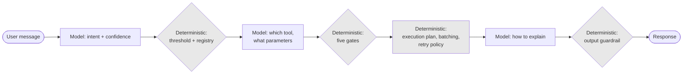

# ADR-D3-05 — Deterministic versus model-decided routing: where each governs

## 1. Summary

Model decisions are confined to **interpretation** — what the user means, how to say something,
which permitted option best fits. Every decision with a consequence outside the conversation is
deterministic: execution order, tool eligibility, authorization, retry, batching, precedence.
7 PFF-FA-AI-AGENTIC-ORCHESTRATION.md §29's deterministic/AI node classification is generalised into a test that can be applied to
any new decision point.

## 2. Context and Problem Statement

7 PFF-FA-AI-AGENTIC-ORCHESTRATION.md §29 classifies graph nodes as deterministic or AI and gives examples of each. 7 PFF-FA-AI-AGENTIC-ORCHESTRATION.md §30
covers edge types. 7 PFF-FA-AI-AGENTIC-ORCHESTRATION.md §68 gives a deterministic control boundary and §69 an AI reasoning
boundary. 2. PFF-FA-AI-ARCHITECTURE-DETAILED.md §3.3 requires critical controls to be deterministic and states the SLM must not be
the only enforcement mechanism. 3. PFF-FA-AI-RESPONSIBILITY-MATRIX.md §46 marks certain decisions as authoritative AI decisions.

Between them these establish that some decisions are the model's and some are not. What they do
not provide is a **test** — a way to decide, for a decision point that none of them anticipated,
which side it falls on.

That gap matters because the boundary is not self-evident at the margins, and the cases where it
is unclear are exactly the ones where getting it wrong is expensive:

- **Should the model decide whether to refresh ERC?** It has context the refresh policy does not —
  it knows the user just asked about payment status. But freshness is a correctness property
  (ADR-D1-03 §7.3), and a model deciding not to refresh produces a stale answer.
- **Should the model decide how many teams to batch?** Batch size is fixed at 20 (8 PFF-FA-AI-ERC-CONTEXT.md §36), but
  a model might reasonably propose fewer for a slow service.
- **Should the model decide whether to clarify?** 7 PFF-FA-AI-AGENTIC-ORCHESTRATION.md §13's confidence bands are computed, but
  the model could be asked directly.
- **Should the model decide which persona variant applies?** ADR-D1-07 §7.4 derives it from the
  archetype, but a model could judge tone from the conversation.

Each has a plausible argument for model involvement, and in each case the argument is "the model
has more context". That argument is always available and is not sufficient, because it says
nothing about what happens when the model is wrong.

2. PFF-FA-AI-ARCHITECTURE-DETAILED.md §3.3's list — security, authorization enforcement, batching, retry, timeout, idempotency,
schema validation, transaction protection — is a list of instances, not a principle. A new decision
point not on that list has no guidance.

## 3. Decision Drivers

### 3.1 Functional drivers

| ID | Driver | Source |
|---|---|---|
| DR-F-01 | Critical controls must be deterministic | 2. PFF-FA-AI-ARCHITECTURE-DETAILED.md §3.3 |
| DR-F-02 | Nodes must be classified deterministic or AI | 7 PFF-FA-AI-AGENTIC-ORCHESTRATION.md §29 |
| DR-F-03 | 3. PFF-FA-AI-RESPONSIBILITY-MATRIX.md §46's authoritative AI decisions must remain the model's | 3. PFF-FA-AI-RESPONSIBILITY-MATRIX.md §46 |
| DR-F-04 | The reasoning boundary must be enforceable, not advisory | 7 PFF-FA-AI-AGENTIC-ORCHESTRATION.md §68–§69 |
| DR-F-05 | A new decision point must be classifiable | Programme practice |

### 3.2 Non-functional drivers

| ID | Driver | Target | Source |
|---|---|---|---|
| DR-N-01 | Deterministic decisions must be reproducible | Same inputs, same decision | ADR-D3-01 §7.4 |
| DR-N-02 | The test must be applicable without deep analysis | Answerable in one review discussion | DR-F-05 |
| DR-N-03 | Model decisions must be evaluable | Each has a golden-set measure | ADR-D3-01 §7.4 |

### 3.3 Constraints

| ID | Constraint | Type | Source |
|---|---|---|---|
| DR-C-01 | The SLM must not be the only enforcement mechanism for a critical control | Platform | 2. PFF-FA-AI-ARCHITECTURE-DETAILED.md §3.3 |
| DR-C-02 | Model output is never authoritative for business truth | Platform | ADR-D1-03 |
| DR-C-03 | No C4 (Model-Terminal) capability exists | Platform | ADR-D3-01 §7.1 |
| DR-C-04 | Workflow and agent selection are authoritative AI decisions | Organisational | 3. PFF-FA-AI-RESPONSIBILITY-MATRIX.md §46 |

### 3.4 Assumptions

| ID | Assumption | If false | Validation |
|---|---|---|---|
| DR-A-01 | Every decision point is classifiable by the §7.2 test | Some decisions genuinely sit between; a tie-break is needed | Applied across the affiliation graph at Phase 4 |
| DR-A-02 | Deterministic decisions have enough information without the model's context | Determinism produces worse decisions than the model would | Measured per decision point |

## 4. Evaluation Criteria and Weights

| ID | Criterion | Weight | Rationale | Measurement |
|---|---|---|---|---|
| EC-01 | Containment of model influence over consequential decisions | 35 | 2. PFF-FA-AI-ARCHITECTURE-DETAILED.md §3.3 makes this categorical; the whole platform's controllability depends on it | Can a model decision cause an irreversible or incorrect outcome? |
| EC-02 | Applicability of the test to new decision points | 25 | The gap this ADR fills; a rule covering only known cases leaves the same gap | Can a novel decision be classified in one discussion? |
| EC-03 | Preservation of genuine AI value | 20 | Over-restriction produces a platform that cannot interpret, which is its purpose | Are 3. PFF-FA-AI-RESPONSIBILITY-MATRIX.md §46's AI decisions preserved? |
| EC-04 | Reproducibility | 12 | Evaluation and audit both require it | Are deterministic paths reproducible? |
| EC-05 | Implementation simplicity | 8 | Real but subordinate | Complexity of the classification |
| | **Total** | **100** | | |

Scoring scale: **1** unacceptable · **2** poor · **3** adequate · **4** good · **5** excellent.

## 5. Alternatives Considered

### 5.1 Option A — Enumerate deterministic decisions; everything else is the model's

**Description.** Adopt 2. PFF-FA-AI-ARCHITECTURE-DETAILED.md §3.3's list and 7 PFF-FA-AI-AGENTIC-ORCHESTRATION.md §29's node examples as the definitive set of
deterministic decisions. Any decision not listed defaults to the model.

**Strengths.**
- Directly reflects the specifications; nothing invented.
- Simple to apply for known cases (EC-05).
- Preserves maximum AI flexibility (EC-03).
- No judgement needed where the list covers.

**Weaknesses.**
- Defaults novel decisions to the model, which is the wrong default: a decision nobody has
  considered is exactly the one whose consequences are unexamined (EC-01, EC-02 fail).
- The list is instances, not a principle, so it cannot be extended by reasoning.
- Every new decision point becomes an argument rather than a classification.

**Cost / effort.** Nil, with the gap unaddressed.

### 5.2 Option B — A consequence test: deterministic unless the decision is purely interpretive

**Description.** A decision is deterministic **unless** its only effect is on interpretation or
expression. The test asks what happens outside the conversation when the model is wrong; if
anything does, the decision is deterministic.

**Strengths.**
- Applies to decisions nobody anticipated, because it reasons from consequence rather than from a
  list (EC-02).
- Defaults toward deterministic, which is the safe default for an unexamined decision (EC-01).
- Preserves 3. PFF-FA-AI-RESPONSIBILITY-MATRIX.md §46's AI decisions, all of which are interpretive — what the user means, which
  workflow applies, how to explain (EC-03).
- Deterministic paths are reproducible by construction (EC-04).

**Weaknesses.**
- Requires judgement about what counts as "purely interpretive", and the boundary can be argued.
- Defaulting to deterministic may over-restrict where the model would genuinely do better.
- Some decisions have both interpretive and consequential aspects and need decomposition.

**Cost / effort.** Low.

### 5.3 Option C — Risk-weighted: model decides where the cost of error is low

**Description.** Classify by expected cost of a wrong decision. Low-cost decisions go to the model;
high-cost ones are deterministic.

**Strengths.**
- Proportionate: effort and restriction follow risk.
- Intuitive to stakeholders and to governance.
- Allows model involvement where it genuinely helps and costs little.
- Aligns with 20.PFF-FA-AI-GOVERNANCE.md §15's risk classification.

**Weaknesses.**
- Cost of error is a judgement made before the error is understood, and it is systematically
  underestimated for novel failure modes (EC-01 weakened).
- Two decisions with similar apparent cost can have very different reversibility — the relevant
  property is whether the error can be undone, not how much it costs.
- Produces a gradient rather than a boundary, and gradients erode: each individual relaxation is
  defensible.

**Cost / effort.** Low, with a boundary that is not a boundary.

### 5.4 Option D — Model proposes, deterministic layer disposes, everywhere

**Description.** Let the model propose any decision; a deterministic layer validates or overrides
every proposal.

**Strengths.**
- Model context is available everywhere it might help.
- The deterministic layer is the guarantee, so safety is preserved (EC-01, partially).
- Uniform pattern — one mechanism for all decisions.
- Matches the tool-call pattern (ADR-D3-04) generalised.

**Weaknesses.**
- Requires a validating layer for every decision, including ones where the deterministic answer is
  simply correct and the proposal adds nothing — batch size is 20, and asking the model first is
  latency and cost for no benefit (EC-05).
- Where the deterministic layer would override every proposal, the proposal is theatre.
- Blurs the boundary: a validator that mostly accepts becomes a rubber stamp, and 2. PFF-FA-AI-ARCHITECTURE-DETAILED.md §3.3's
  "not the only mechanism" degrades toward "nominally not the only mechanism".

**Cost / effort.** Moderate, with cost where no benefit exists.

## 6. Evaluation Method and Decision Matrix

**Method.** Weighted scoring against §4. EC-02 tested by applying each option to the four §2
questions and asking whether it gives a clear answer.

| Criterion | Weight | A: Enumerate | B: Consequence test | C: Risk-weighted | D: Propose/dispose |
|---|---|---|---|---|---|
| EC-01 Containment | 35 | 2 | 5 | 3 | 4 |
| EC-02 Applicability to novel points | 25 | 1 | 5 | 3 | 4 |
| EC-03 Preserves AI value | 20 | 5 | 4 | 5 | 5 |
| EC-04 Reproducibility | 12 | 3 | 5 | 3 | 3 |
| EC-05 Simplicity | 8 | 5 | 4 | 4 | 2 |
| **Weighted total** | **100** | **271** | **470** | **355** | **396** |

- **Option B:** (35×5) + (25×5) + (20×4) + (12×5) + (8×4) = 175 + 125 + 80 + 60 + 32 = **470**

**Sensitivity.** B leads D by 74 points and loses only on preserving AI value, by one point on a
20-weight criterion. D's flaw is not its score: applying propose-and-dispose where the
deterministic answer is simply correct produces a validator that always overrides, which is worse
than not asking — it creates the appearance of model involvement without the substance, and
gradually normalises a validator that mostly accepts.

## 7. Decision

### 7.1 The consequence test

> **A decision is deterministic unless its only effect is on interpretation or expression.**
>
> To classify a decision, ask: *if the model gets this wrong, does anything happen outside the
> conversation?* If yes — an enterprise call, a state change, an authorization outcome, a
> retrieved dataset, a cost — the decision is deterministic. If the only consequence is that the
> conversation goes somewhere slightly different, it may be the model's.

The default is deterministic. A decision nobody has classified is one whose consequences nobody
has examined, and defaulting an unexamined decision to the model is how 2. PFF-FA-AI-ARCHITECTURE-DETAILED.md §3.3's boundary
erodes without anyone deciding to move it.

### 7.2 Applying the test to the §2 cases

| Decision | Consequence if wrong | Class |
|---|---|---|
| Whether to refresh ERC | A stale answer about a user's application — a correctness failure outside the conversation | **Deterministic** — freshness policy (ADR-D1-03 §7.3) |
| How many records to batch | Enterprise load, latency, partial-failure behaviour | **Deterministic** — fixed at 20 (8 PFF-FA-AI-ERC-CONTEXT.md §36) |
| Whether to clarify | Only that the conversation asks a question — but a wrong *routing* decision has enterprise consequences | **Deterministic threshold** on a model-produced confidence (ADR-D2-05 §7.3) |
| Which persona variant | Tone only; no consequence outside the conversation | **Deterministic anyway** — derived from archetype (ADR-D1-07 §7.4), because access-adjacent inputs must not be model-influenced |

The third row shows the test doing real work. "Whether to clarify" looks interpretive, and the
decision it gates — which workflow runs — is not. So the *threshold* is deterministic and computed
from measured accuracy, while the *confidence signal* it operates on is the model's. That
decomposition is §7.4's pattern.

The fourth row shows the test being overridden by a stronger constraint: persona variant has no
external consequence, so the test alone would permit model choice, but ADR-D1-07 §7.1 forbids
persona deriving from anything that could couple to access. The consequence test sets the default;
a specific constraint can be stricter.

### 7.3 The two sides, enumerated

**Model-decided** — all interpretive, all reversible within the conversation:

| Decision | Bounded by |
|---|---|
| What the user means (intent) | The registered intent set (ADR-D3-06) |
| Which workflow applies | The agent registry allowlist (3. PFF-FA-AI-RESPONSIBILITY-MATRIX.md §46; ADR-D2-05) |
| Which tool best serves the stated need | The per-agent allowlist (ADR-D3-04 gate 1) |
| What to ask when clarifying | The clarification pattern (ADR-D3-07) |
| How to explain an outcome | The persona layer and output guardrail (ADR-D1-09) |
| Whether more context is needed *within declared requirements* | The declaration (ADR-D3-03 §7.1) |

**Deterministic** — everything with an external consequence:

| Decision | Mechanism |
|---|---|
| Execution order of enterprise calls | Dependency graph (ADR-D2-08 §7.1) |
| Concurrency limits | Per-service bounds (ADR-D2-08 §7.3) |
| Batch size | Fixed at 20 (8 PFF-FA-AI-ERC-CONTEXT.md §36) |
| Whether a tool may be called | Allowlist, claims, scope (ADR-D3-04) |
| Whether to retry | Declared per operation (ADR-D2-11 §7.1) |
| Whether an outcome is confirmed | Transaction state classification (ADR-D2-11 §7.4) |
| Which source wins a conflict | Precedence chain (ADR-D1-03 §7.1) |
| Whether context is stale | Freshness policy (ADR-D1-03 §7.3) |
| Routing thresholds | Derived from measured accuracy (ADR-D2-05 §7.3) |
| Whether a response may be sent | Output guardrail (ADR-D1-02 §7.1) |

Every entry in the left column of the first table is bounded by something in the second. That is
the pattern: the model chooses among options something deterministic defined.

### 7.4 The decomposition pattern

Where a decision has both an interpretive and a consequential aspect, decompose it rather than
classifying the whole:

```
Model produces a signal  →  Deterministic rule acts on the signal
```

| Composite decision | Model's part | Deterministic part |
|---|---|---|
| Routing | Intent classification and confidence | Threshold comparison, candidate resolution, selection |
| Tool use | Which tool, what parameters | Five gates (ADR-D3-04 §7.1) |
| Clarification | What to ask | Whether to ask (threshold), and that asking is permitted |
| Context sufficiency | Whether more is needed | What may be fetched (declaration) |

This is 2. PFF-FA-AI-ARCHITECTURE-DETAILED.md §3.3's "not the only enforcement mechanism" as a design pattern rather than a
prohibition: the model's signal is an input, and the rule that acts on it is the control.

Note the difference from Option D. Here the deterministic part is a *rule*, and it applies where
there is a genuine choice among permitted options. Under Option D the deterministic part would be a
*validator* applied everywhere, including where no choice exists — asking the model for a batch
size and then always using 20.

### 7.5 Node classification follows

7 PFF-FA-AI-AGENTIC-ORCHESTRATION.md §29's deterministic/AI node classification is derived from §7.1 rather than being a separate
judgement. A node is an AI node if it calls the model to produce a signal; otherwise it is
deterministic. ADR-D2-06 §7.4 requires every node to declare its class, and this decision is the
rule that determines it.

The practical consequence at Phase 4: the affiliation graph's twenty-odd nodes are classified by
applying §7.1 to each, and the classification determines test strategy (ADR-D3-01 §7.4) as well as
whether output validation applies (ADR-D3-17).

**Status rationale.** Accepted. Tier 3 under ADR-D0-03 §7.1 — a design rule within the AI platform
that implements 2. PFF-FA-AI-ARCHITECTURE-DETAILED.md §3.3 rather than changing a boundary — ratified by the AI Solution Architect
with the Security Owner consulted on §7.1's default.

## 8. Architecture Detail

### 8.1 The pattern in the request path



Model steps alternate with deterministic ones, and every model step is followed by a deterministic
one before anything external happens. That alternation is ADR-D3-01's "no C4 capability" seen from
the routing perspective.

### 8.2 Applying the test to a novel decision

A proposal arises: *"the model should decide whether to summarise a long ERC section before
including it in the prompt, since it knows what the user is asking about."*

Applying §7.1:

| Question | Answer |
|---|---|
| If the model is wrong, does anything happen outside the conversation? | Yes — a summarised section may omit a fact the response then asserts without it, or the unsummarised section may exceed the context budget and truncate silently |
| Is the only effect on interpretation or expression? | No — it affects what facts are available to reason over |
| **Class** | **Deterministic** — context budget and summarisation policy (ADR-D3-25) |

But §7.4's decomposition applies: *which* sections matter most for this turn is interpretive, and
the model may signal relevance. The budget rule then decides what fits and what is summarised,
deterministically. The model's signal informs; the policy decides.

That is the test producing a better answer than either "yes, let the model do it" or "no,
never" — and doing so in one discussion, which is EC-02.

### 8.3 What the test does not do

The test classifies decisions, not capabilities. ADR-D3-01's taxonomy classifies capabilities by
what constrains their output. The two compose:

| | ADR-D3-01 taxonomy | This test |
|---|---|---|
| Question | What catches this capability if the model is wrong? | Should this decision involve the model at all? |
| Applied to | A capability | A decision point |
| Output | C1–C4 class | Deterministic or model-decided |

A C2 capability contains a model-decided step bounded by a deterministic one — which is exactly
§7.4's pattern. The taxonomy describes the resulting shape; this test decides where the shape
applies.

## 9. Consequences

### 9.1 Positive

- A novel decision point can be classified in one discussion, rather than argued case by case.
- The default is deterministic, so an unexamined decision does not silently become the model's.
- 3. PFF-FA-AI-RESPONSIBILITY-MATRIX.md §46's authoritative AI decisions are preserved, all being interpretive.
- 7 PFF-FA-AI-AGENTIC-ORCHESTRATION.md §29's node classification follows from the rule rather than being independent judgement.
- The decomposition pattern gives a constructive answer where a decision has both aspects.

### 9.2 Negative

- "Purely interpretive" requires judgement and will be argued at the margins.
- Defaulting to deterministic may over-restrict where the model would genuinely do better, and the
  cost of that is invisible — nobody sees the better decision that was not made.
- Composite decisions need decomposition, which is more design work than classifying the whole.

### 9.3 Neutral

- 2. PFF-FA-AI-ARCHITECTURE-DETAILED.md §3.3's list becomes instances of the rule rather than the rule itself.
- The test sets a default that a stronger constraint can override (§7.2's fourth row).

### 9.4 Trade-offs explicitly accepted

| Given up | In exchange for | Accepted by |
|---|---|---|
| Model involvement where it might improve a consequential decision | A default that fails safe for decisions nobody has examined | Security Owner |
| A mechanical list | A test that extends to decisions the specifications did not anticipate | AI Solution Architect |
| Uniform propose-and-dispose | Not asking the model where the deterministic answer is simply correct | AI Engineering Lead |

## 10. Golden-Rule and Precedence Conformance

| Constraint | Conformance |
|---|---|
| Enterprise decides; AI orchestrates | The test's boundary is close to the Golden Rule's: interpretation and communication are the model's, and anything with an external consequence is not. |
| Authoritative-truth precedence | Which source wins is deterministic (§7.3), so the model never adjudicates between sources. |
| Four-state separation | Not directly; the test classifies decisions. |
| Versioned artefacts, never mutated in place | Deterministic rules — thresholds, policies, bounds — are versioned configuration. |
| Adam persona governs how, never what | The persona operates entirely in the interpretive column, which is the same distinction stated for communication. |

## 11. Risks and Mitigations

| ID | Risk | Likelihood | Impact | Exposure | Mitigation | Owner | Residual |
|---|---|---|---|---|---|---|---|
| RSK-01 | "Purely interpretive" argued expansively to admit model decisions | Medium | High | High | §7.1's question is about consequence, not about how interpretive it feels; classification recorded per decision point; QM-02 | AI Solution Architect | Medium |
| RSK-02 | Over-restriction produces worse decisions than the model would make (DR-A-02) | Medium | Low | Low | Decomposition pattern (§7.4) admits the model's signal where it helps | AI Engineering Lead | Low |
| RSK-03 | Composite decisions classified whole rather than decomposed | Medium | Medium | Medium | §7.4's pattern applied at design review; QM-03 | AI Engineering Lead | Low |
| RSK-04 | A deterministic rule becomes a rubber-stamp validator (Option D's failure mode) | Low | High | Medium | Rules apply where a genuine choice exists; a rule that always overrides means the model step should be removed; QM-04 | AI Solution Architect | Low |
| RSK-05 | A decision genuinely resists classification (DR-A-01) | Low | Low | Low | Tie-break is deterministic, per §7.1's default | AI Solution Architect | Low |

## 12. Quantitative Targets and Measures

| ID | Measure | Target | Threshold (alert) | Source | Review cadence |
|---|---|---|---|---|---|
| QM-01 | Graph nodes without a declared class | 0 | ≥1 | ADR-D2-06 QM-05 | Per build |
| QM-02 | Decision points classified model-decided that have an external consequence | 0 | ≥1 | Design review audit | Quarterly |
| QM-03 | Composite decisions classified whole rather than decomposed | 0 | ≥1 | Design review | Quarterly |
| QM-04 | Deterministic rules that override the model's signal in over 95% of cases | 0 | ≥1 | Rule outcome metrics | Quarterly |
| QM-05 | Model-decided points without golden-set evaluation | 0 | ≥1 | Evaluation coverage; ADR-D3-01 QM-04 | Per release |

QM-04 detects Option D's failure mode: a rule that almost always overrides means the model step is
theatre and should be removed, which is a different fix from tuning the rule.

## 13. Security, Privacy and Compliance Impact

| Dimension | Impact |
|---|---|
| Attack surface change | The model-decided column is the surface an injection can influence. Keeping it to interpretive decisions bounds what a successful injection can achieve: it can change what the platform says, not what it does externally. |
| Data classification touched | Not directly. |
| Personal data / PII | What data is fetched is deterministic (declared requirements), so an injection cannot widen retrieval. |
| Children's data and safeguarding | Whether a safeguarding fact is fresh, whether it may be retrieved, and whether it may be asserted are all deterministic. The model decides only how to explain it — and ADR-D1-09's X-1 constrains even that. |
| UK GDPR lawful basis and rights impact | No decision about a person is model-decided; all are enterprise-made and deterministically relayed (Art. 22). |
| Audit and evidential requirements | Deterministic decisions are reproducible, so an audit can re-derive why a path was taken. |
| Standards touched | ISO/IEC 42001 (AI system autonomy); NIST AI RMF GOVERN 1.3, MANAGE 2.2; EU AI Act Art. 14 — the interpretive/consequential split is the oversight argument. |

## 14. Implementation Impact

| Aspect | Detail |
|---|---|
| Build phases | 4 |
| Repository paths | `src/pff_fa_ai/orchestration/` — node classification and rules |
| Configuration | Thresholds, policies and bounds as versioned configuration |
| Contracts / schemas | Node class declaration (ADR-D2-06 §7.4) |
| Migration | None |
| Dependencies on other ADRs | ADR-D2-05, ADR-D2-06, ADR-D2-08, ADR-D3-01 |
| Effort estimate | Small — a rule applied during design rather than machinery |

## 15. Validation and Verification

| ID | Acceptance criterion | Verification method |
|---|---|---|
| AC-01 | Every graph node declares deterministic or AI, derived from §7.1 | ADR-D2-06 AC-05; QM-01 |
| AC-02 | No model-decided point has an external consequence without an intervening deterministic rule | Design audit; QM-02 |
| AC-03 | Execution order, batching, retry and precedence are reproducible for identical inputs | Determinism tests |
| AC-04 | 3. PFF-FA-AI-RESPONSIBILITY-MATRIX.md §46's authoritative AI decisions remain model-decided | Classification audit |
| AC-05 | Every model-decided point has a golden-set measure | Evaluation coverage; QM-05 |
| AC-06 | A novel decision point can be classified using §7.1 in a design review | Applied to at least one new decision at Phase 4 |

## 16. Operational Impact

| Aspect | Detail |
|---|---|
| Monitoring | Node class as a trace dimension; rule outcomes versus model signals |
| Alerting | QM-02 and QM-04 at quarterly review rather than operationally |
| Runbook | None |
| Failure mode and degradation | The failure is classification drift — decisions moving to the model one reasonable argument at a time. QM-02 is the detection, and it is a review rather than a runtime check. |
| Rollback | Not applicable |
| Support model impact | Deterministic decisions are reproducible, so support can re-derive a path exactly |

## 17. Cost Impact

| Cost element | One-off | Recurring | Basis |
|---|---|---|---|
| Classification of the affiliation graph | ~0.5 day | — | Phase 4 |
| Per-decision classification | — | Minutes at design review | §7.1's single question |
| Avoided cost | — | Ongoing | Model involvement in consequential decisions would require validation machinery per decision and would add inference cost where a rule suffices |

## 18. Revisit Triggers and Causal Analysis Hooks

| ID | Trigger | Detected by | Action on trigger |
|---|---|---|---|
| RT-01 | QM-02 finds a model-decided point with an external consequence | Quarterly | Reclassify; add the intervening rule |
| RT-02 | QM-04 shows a rule overriding above 95% | Quarterly | Remove the model step; it is theatre (Option D's failure) |
| RT-03 | A decision genuinely resists the test (DR-A-01) | Design review | Default deterministic; record the case for a possible tie-break rule |
| RT-04 | Determinism demonstrably produces worse outcomes at a point (DR-A-02) | Evaluation | Apply §7.4's decomposition to admit a model signal, not to move the decision |
| RT-05 | 2. PFF-FA-AI-ARCHITECTURE-DETAILED.md §3.3 or 3. PFF-FA-AI-RESPONSIBILITY-MATRIX.md §46 amended | Change notice | Re-derive §7.3's tables |

**Scheduled review:** 2027-08-21.

## 19. Traceability

| Dimension | Reference |
|---|---|
| Workshop sheet | WS-14 Conversation Decision Architecture |
| Specification sections | 7 PFF-FA-AI-AGENTIC-ORCHESTRATION.md §12–§13 (Supervisor Decision Model, Confidence), §29 (Deterministic vs AI Nodes), §30 (Graph Edge Types), §68 (Deterministic Control Boundary), §69 (AI Reasoning Boundary); 2. PFF-FA-AI-ARCHITECTURE-DETAILED.md §3.3 (Deterministic Control); 3. PFF-FA-AI-RESPONSIBILITY-MATRIX.md §46 (Decision Authority Matrix); 8 PFF-FA-AI-ERC-CONTEXT.md §36 |
| Requirement IDs | `NFR-A38-SEC`, `NFR-A38-REL` |
| Build phases | 4 |
| Code paths | `src/pff_fa_ai/orchestration/` |
| Configuration | Thresholds, policies, bounds |
| Tests | AC-01 to AC-06 |
| Upstream ADRs | ADR-D2-05, ADR-D3-01, ADR-D3-02 |
| Downstream ADRs | ADR-D3-06, ADR-D3-07, ADR-D3-25, ADR-D2-06 |

## 20. Change Log

| Version | Date | Author | Change |
|---|---|---|---|
| 1.0.0 | 2026-08-21 | AI Solution Architect | Initial decision recorded. A consequence test replacing 2. PFF-FA-AI-ARCHITECTURE-DETAILED.md §3.3's list of instances: deterministic unless the only effect is interpretive, defaulting to deterministic for unexamined decisions. Adds the decomposition pattern for composite decisions, and distinguishes it from uniform propose-and-dispose, which produces rubber-stamp validators where no genuine choice exists. |
