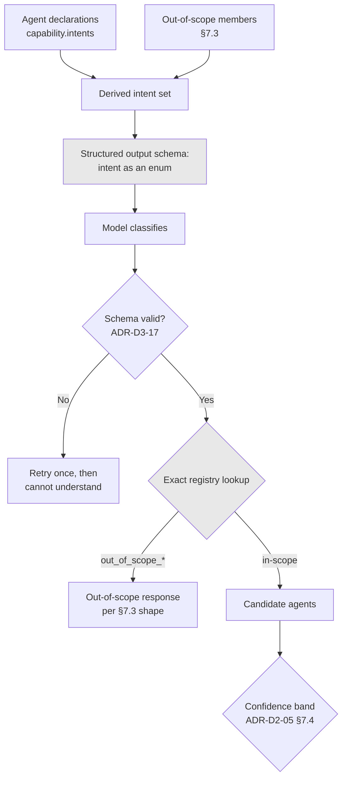

# ADR-D3-06 — Intent classification approach and the registered intent set

## 1. Summary

Intent is classified by the SLM into a **closed, registered set** declared by agents, with
out-of-scope as a first-class member of that set. A closed set makes classification evaluable,
makes an unregistered intent impossible to route on, and turns the out-of-scope distribution into
product evidence for choosing workflow two.

## 2. Context and Problem Statement

7 PFF-FA-AI-AGENTIC-ORCHESTRATION.md §12 shows the supervisor's decision object with an `intent` field. 7 PFF-FA-AI-AGENTIC-ORCHESTRATION.md §13 gives confidence
bands, §14 clarification, §22 the agent capability registry, §24 agent selection. 4. PFF-FA-AI-RUNTIME.md §13–§14
place supervisor execution and the clarification path in the runtime. 16.PFF-FA-AI-PROMPT-ENGINEERING.md §42–§43 cover
structured output and output schema.

7 PFF-FA-AI-AGENTIC-ORCHESTRATION.md §12's example shows `"intent": "club_affiliation"` — a string. Whether that string comes from
a fixed set or is free-form is not stated, and the difference is substantial.

**Open-set classification** lets the model name any intent it perceives. It handles novelty
gracefully and produces rich data about what users ask. It also makes evaluation nearly impossible
— there is no ground truth to measure against when the label space is unbounded — and it means the
routing layer must map arbitrary strings onto agents, which is a second classification problem.

**Closed-set classification** constrains the model to a declared vocabulary. It is evaluable
against a labelled set, and an intent outside the set cannot be produced. It handles novelty by
mapping it to a designated bucket, which loses the specificity open-set would have captured.

There is a second question, sharper in this platform than in most. ADR-D1-11 builds one agent, and
ADR-D2-05 §7.5 established that out-of-scope is the majority classification outcome. So the
question "how is out-of-scope represented?" is not an edge case — it is the main case. If it is
represented as an *absence* (no intent matched), then the platform's most common outcome is a
negative with no structure, and nothing can be learned from it.

Third, there is a subtle coupling risk. Intent strings appear in the supervisor's decision object,
which is model output. If agents declared intents freely and the supervisor matched on string
similarity, the match would be an inference — a second model-like judgement in a place 3. PFF-FA-AI-RESPONSIBILITY-MATRIX.md §46
marks as an authoritative AI decision but ADR-D3-05 §7.3 requires to be bounded by a deterministic
registry lookup.

## 3. Decision Drivers

### 3.1 Functional drivers

| ID | Driver | Source |
|---|---|---|
| DR-F-01 | Intent must be produced as part of a schema-validated decision object | 7 PFF-FA-AI-AGENTIC-ORCHESTRATION.md §12; 16.PFF-FA-AI-PROMPT-ENGINEERING.md §42–§43 |
| DR-F-02 | Intent must resolve to candidate agents via the registry | 7 PFF-FA-AI-AGENTIC-ORCHESTRATION.md §22, §24 |
| DR-F-03 | Out-of-scope must be handled explicitly | ADR-D2-05 §7.5 |
| DR-F-04 | Classification accuracy must be measurable | ADR-D2-05 §7.3 |
| DR-F-05 | Ambiguity must reach clarification rather than a guess | 7 PFF-FA-AI-AGENTIC-ORCHESTRATION.md §14 |

### 3.2 Non-functional drivers

| ID | Driver | Target | Source |
|---|---|---|---|
| DR-N-01 | Classification must fit the routing latency budget | ≤400 ms p95 with the decision object | ADR-D2-05 |
| DR-N-02 | Classification must be reproducible at temperature 0 | Same input, same intent | ADR-D3-01 §7.4 |
| DR-N-03 | Adding an intent must not require orchestration changes | Declaration only | ADR-D1-11 §8.2 |

### 3.3 Constraints

| ID | Constraint | Type | Source |
|---|---|---|---|
| DR-C-01 | Intent selects among registered options; it does not define them | Platform | ADR-D3-05 §7.3 |
| DR-C-02 | Agents declare their intents in configuration | Platform | ADR-D3-03 §7.1 |
| DR-C-03 | Structured output is schema-validated before use | Platform | ADR-D3-17 |
| DR-C-04 | Routing thresholds are derived from measurement | Platform | ADR-D2-05 §7.3 |

### 3.4 Assumptions

| ID | Assumption | If false | Validation |
|---|---|---|---|
| DR-A-01 | User requests map onto a manageable set of intents | The set grows unmanageably or fails to cover | Out-of-scope distribution analysis; QM-04 |
| DR-A-02 | A single-label classification is adequate | Multi-intent requests are common and need decomposition | ADR-D3-02 §7.3; QM-05 |
| DR-A-03 | Out-of-scope reasons are distinguishable enough to be useful | The bucket is undifferentiated and yields no product signal | QM-03 |

## 4. Evaluation Criteria and Weights

| ID | Criterion | Weight | Rationale | Measurement |
|---|---|---|---|---|
| EC-01 | Evaluability of classification | 30 | ADR-D2-05 §7.3's thresholds are derived from measured accuracy, which requires ground truth | Can accuracy be measured against a labelled set? |
| EC-02 | Impossibility of routing on an unregistered intent | 25 | DR-C-01; an intent the registry does not know must not reach agent selection | Can an unknown intent reach routing? |
| EC-03 | Quality of out-of-scope handling | 20 | The majority outcome with one agent | Is out-of-scope structured and informative? |
| EC-04 | Handling of novelty | 15 | Users ask unanticipated things | Does a novel request produce something useful? |
| EC-05 | Maintenance as workflows grow | 10 | The intent set grows with agents | Effort to add an intent |
| | **Total** | **100** | | |

Scoring scale: **1** unacceptable · **2** poor · **3** adequate · **4** good · **5** excellent.

## 5. Alternatives Considered

### 5.1 Option A — Open-set: the model names the intent freely

**Description.** The model produces any intent string it judges appropriate. The supervisor matches
it to agents by similarity.

**Strengths.**
- Captures novelty precisely — a request no agent serves still gets a descriptive label (EC-04).
- Rich data about what users actually ask.
- No intent set to maintain (EC-05).
- Never fails to classify.

**Weaknesses.**
- Unbounded label space means no ground truth, so accuracy is not measurable and ADR-D2-05 §7.3's
  threshold derivation is impossible (EC-01 fails).
- Matching a free-form string to agents is a second inference, in a place DR-C-01 requires a
  deterministic lookup (EC-02 fails).
- Two models' worth of judgement between a user message and an agent selection.

**Cost / effort.** Low, and it breaks the routing design.

### 5.2 Option B — Closed set with out-of-scope as a member

**Description.** The intent set is the union of all registered agents' declared intents, plus
`out_of_scope` with a reason sub-classification. The model selects one member. Registry lookup is
exact-match and deterministic.

**Strengths.**
- Bounded label space gives ground truth, so accuracy is measurable and thresholds derivable
  (EC-01).
- Registry lookup is exact-match, so an unregistered intent cannot exist to route on (EC-02).
- Out-of-scope is a positive classification with a reason, so the majority outcome carries
  structure (EC-03).
- Adding an intent is an agent declaration change (DR-N-03, EC-05).

**Weaknesses.**
- Novelty collapses into `out_of_scope`, losing the specificity Option A would capture — mitigated
  but not solved by reason sub-classification (EC-04).
- The set must be curated as agents are added.
- A genuinely new intent needs a declaration change before it can be recognised.

**Cost / effort.** Low.

### 5.3 Option C — Hierarchical: coarse domain then fine intent

**Description.** Classify first into a domain (affiliation, registration, discipline), then into a
specific intent within it.

**Strengths.**
- Scales better as the intent set grows; each classification has fewer options.
- Domain-level accuracy is higher than fine-grained.
- A domain match with an unclear intent is a natural clarification trigger.
- Structure mirrors the workflow catalogue (ADR-D1-10 §7.2).

**Weaknesses.**
- Two model calls per turn, doubling routing latency and cost (DR-N-01).
- An error at the domain level cannot be recovered at the intent level — a wrong domain excludes
  the right intent entirely.
- With one agent (ADR-D1-11) the domain classification is trivial and the second call is pure
  overhead.
- Adds complexity ahead of the scale that would justify it.

**Cost / effort.** Moderate, with cost before benefit.

### 5.4 Option D — Deterministic classification: keywords and patterns

**Description.** Rules map phrases and entities to intents; no model involved.

**Strengths.**
- Fully deterministic and reproducible (DR-N-02).
- Zero inference cost and minimal latency (DR-N-01).
- Trivially evaluable.
- No model variance.

**Weaknesses.**
- Users do not phrase requests in anticipated ways. "My club can't get through" is an affiliation
  pre-check problem and matches no keyword rule.
- Rule maintenance grows combinatorially with intents and phrasings (EC-05).
- Handles novelty by failing to match, with no graceful degradation (EC-04).
- 7 PFF-FA-AI-AGENTIC-ORCHESTRATION.md §12's decision object presumes a model-produced intent with a confidence.

**Cost / effort.** Low initially, high and growing to maintain.

## 6. Evaluation Method and Decision Matrix

**Method.** Weighted scoring against §4. EC-01 assessed by asking whether ADR-D2-05 §7.3's
threshold derivation is possible. EC-03 assessed against the single-agent case where out-of-scope
dominates.

| Criterion | Weight | A: Open set | B: Closed + out-of-scope | C: Hierarchical | D: Deterministic |
|---|---|---|---|---|---|
| EC-01 Evaluability | 30 | 1 | 5 | 4 | 5 |
| EC-02 No unregistered routing | 25 | 1 | 5 | 4 | 5 |
| EC-03 Out-of-scope quality | 20 | 3 | 5 | 4 | 2 |
| EC-04 Novelty handling | 15 | 5 | 3 | 3 | 1 |
| EC-05 Maintenance | 10 | 5 | 4 | 3 | 1 |
| **Weighted total** | **100** | **220** | **460** | **385** | **355** |

- **Option B:** (30×5) + (25×5) + (20×5) + (15×3) + (10×4) = 150 + 125 + 100 + 45 + 40 = **460**

**Sensitivity.** B leads C by 75 points, mostly on the cost of C's second inference at current
scale. C becomes worth reconsidering once the intent set is large enough that single-stage accuracy
degrades — recorded as RT-03. B loses to A only on novelty, worth 15 points, and §7.3's reason
sub-classification recovers much of that. D fails on the reality that users do not phrase requests
in anticipated ways.

## 7. Decision

### 7.1 A closed, registry-derived intent set

The intent set is **derived**, not separately maintained: it is the union of `capability.intents`
across all registered agents (ADR-D3-03 §7.1), plus the out-of-scope members in §7.3.

Two consequences follow, and both matter:

- Adding an intent is an agent declaration change, so DR-N-03 holds and the intent set cannot
  drift from what agents actually serve.
- An intent no agent declares cannot exist in the set, so it cannot be produced by the model
  (schema-constrained) and cannot reach registry lookup.

The model receives the current intent set as an enumerated constraint in its structured output
schema (ADR-D3-17). It selects a member; it does not produce a string.

### 7.2 Registry lookup is exact-match

The supervisor resolves candidates by exact intent match against agent declarations. No similarity
matching, no fuzzy resolution, no embedding comparison.

This is DR-C-01 realised: the model's contribution is selecting which registered intent applies —
a bounded choice among options the registry defined — and the resolution from intent to agent is a
dictionary lookup. Under Option A this would have been a second inference, and ADR-D3-05 §7.3
places agent resolution firmly in the deterministic column.

### 7.3 Out-of-scope is structured, not an absence

Out-of-scope is not one member but a small set, because ADR-D2-05 §7.5 makes it the majority
outcome and an undifferentiated majority outcome teaches nothing:

| Member | Meaning | Response shape |
|---|---|---|
| `out_of_scope_other_workflow` | A county-football task the platform does not yet serve — discipline, cup entry, registration | Name what the platform does serve; point to the portal |
| `out_of_scope_informational` | A question about football administration, not a task | Answer from knowledge if RAG covers it (ADR-D3-20); otherwise point to guidance |
| `out_of_scope_account` | Access, credentials, or account administration | Route to the enterprise's own support path |
| `out_of_scope_unclear` | The message does not express a recognisable request | Ask what the user is trying to do |
| `out_of_scope_unsupported` | Something the platform will not do — a request to bypass a check, alter a record directly | Explain the boundary plainly |

The first member is the product signal. Its distribution answers ADR-D1-10 §7.3's user-struggle
criterion for choosing workflow two: if a third of conversations are `out_of_scope_other_workflow`
about discipline, that is evidence about demand no survey would produce.

The last member is a safety-relevant classification. A request to bypass a safeguarding check is
out of scope in a different way from a question about cup entry, and conflating them would produce
the wrong response.

### 7.4 Multi-intent requests

DR-A-02's case, and ADR-D3-02 §7.3's constraint that one agent runs per turn. Classification
produces a **single** primary intent plus an optional `secondary_intents` list.

The primary drives routing. The secondary list drives clarification: where a secondary intent maps
to a different agent, the supervisor clarifies rather than proceeding (7 PFF-FA-AI-AGENTIC-ORCHESTRATION.md §14). Where secondary
intents map to the same agent, they are context for the agent, not additional routing.

Single-label routing with a multi-label signal keeps ADR-D3-02's one-agent-per-turn constraint
while not discarding what the model observed.

### 7.5 Classification is evaluated, and its threshold derived

Per ADR-D2-05 §7.3, the routing threshold is derived from measured accuracy on a labelled golden
set. That set covers:

- Each in-scope intent, with varied phrasings including indirect ones ("my club can't get
  through").
- Each out-of-scope member, weighted to the expected production distribution — which with one
  agent means out-of-scope cases outnumber in-scope ones.
- Ambiguous cases where the correct outcome is clarification rather than any intent.
- Adversarial cases where injected text attempts to influence classification.

The last category matters because intent classification is the first place user-influenced content
meets a model. A successful injection here selects a different agent — bounded by the allowlist,
but still a wrong route.

### 7.6 What happens when the set is wrong

DR-A-01's risk: the set fails to cover what users ask. The signal is a rising
`out_of_scope_unclear` rate, which means messages are not resolving to any member including the
out-of-scope ones.

The response is **not** to add intents speculatively. It is to analyse the unclear cases and
determine whether they represent an unserved workflow (feeding ADR-D1-10 §7.3), a phrasing gap in
an existing intent (a prompt or golden-set issue), or genuinely unclear user messages (a
clarification-design issue). Each has a different fix, and adding an intent for a workflow no agent
serves would create a route to nothing.

**Status rationale.** Accepted. Tier 3 under ADR-D0-03 §7.1 — a component design within the AI
platform — ratified by the AI Solution Architect.

## 8. Architecture Detail

### 8.1 Intent set derivation and use

The enum constraint at `SCH` is what makes an unregistered intent unproducible; the exact lookup at
`L` is what makes routing deterministic. Both are deterministic boxes around a model step, which is
ADR-D3-05 §7.4's pattern.

### 8.2 The affiliation intent set today

With one agent (ADR-D1-11), the full set is:

| Intent | Source | Expected share |
|---|---|---|
| `club_affiliation` | `affiliation_agent` | In-scope |
| `affiliation_status` | `affiliation_agent` | In-scope |
| `affiliation_payment` | `affiliation_agent` | In-scope |
| `out_of_scope_other_workflow` | §7.3 | **Expected largest** |
| `out_of_scope_informational` | §7.3 | Significant |
| `out_of_scope_account` | §7.3 | Small |
| `out_of_scope_unclear` | §7.3 | Small |
| `out_of_scope_unsupported` | §7.3 | Small |

Eight members, five of them out-of-scope. That ratio is the honest picture of a single-agent
platform serving a domain with nine business capabilities (ADR-D1-06 §7.3), and it is why the
golden set is weighted toward out-of-scope cases.

### 8.3 An indirect phrasing, worked

*"We've been trying to get the Under-12s sorted for the new season but it keeps stopping us."*

| Stage | Outcome |
|---|---|
| Classification | `club_affiliation`, confidence moderate. No keyword matches; the model infers from "new season", "Under-12s" and "stopping us" that this is affiliation blocked at a pre-check |
| Band | Gather (ADR-D2-05 §7.4) — re-classify with workflow associations and conversation summary |
| Re-classification | `club_affiliation`, higher confidence with the association present |
| Routing | `affiliation_agent` |

Option D would have failed this: no rule matches "keeps stopping us". This phrasing is exactly the
kind of thing a club secretary writes, and handling it is a substantial part of the platform's
value per ADR-D1-04 §7.1.

## 9. Consequences

### 9.1 Positive

- Classification is measurable against ground truth, which is what makes ADR-D2-05 §7.3's derived
  thresholds possible.
- An unregistered intent cannot be produced or routed on.
- Out-of-scope carries structure, so the majority outcome produces product evidence rather than a
  shrug.
- The intent set cannot drift from what agents serve, because it is derived from their
  declarations.
- Indirect phrasings are handled, which rules-based classification could not do.

### 9.2 Negative

- Novelty collapses into out-of-scope, losing the specificity Option A would have captured.
- The set must be curated as agents are added, and a genuinely new intent needs a declaration
  change before it can be recognised.
- Single-label routing discards secondary intents from the routing decision, though §7.4 keeps
  them as a clarification signal.
- Five out-of-scope members is more classification surface than one, and their boundaries can blur.

### 9.3 Neutral

- Hierarchical classification is not rejected permanently; RT-03 revisits it at scale.
- With one agent the set is small and the out-of-scope share is large, which is expected rather
  than a problem.

### 9.4 Trade-offs explicitly accepted

| Given up | In exchange for | Accepted by |
|---|---|---|
| Precise labels for novel requests | Measurable accuracy and deterministic routing | AI Evaluation Owner |
| A single simple out-of-scope bucket | Product evidence from the majority outcome | AI Product Owner |
| Multi-intent routing | ADR-D3-02's one-agent-per-turn bound | AI Solution Architect |

## 10. Golden-Rule and Precedence Conformance

| Constraint | Conformance |
|---|---|
| Enterprise decides; AI orchestrates | 3. PFF-FA-AI-RESPONSIBILITY-MATRIX.md §46 marks workflow selection an authoritative AI decision; §7.2 keeps it bounded by a deterministic registry so it selects among options rather than defining them. |
| Authoritative-truth precedence | Intent is model output at authority 1 and decides only which code path runs; it never becomes a business fact. |
| Four-state separation | Classification reads Conversation State (message, summary) and Workflow State (associations); it writes neither. |
| Versioned artefacts, never mutated in place | The intent set derives from versioned agent declarations; the classifier prompt is a versioned artefact (ADR-D3-11). |
| Adam persona governs how, never what | Out-of-scope responses are shaped by the persona under ADR-D1-09; the classification itself is persona-independent. |

## 11. Risks and Mitigations

| ID | Risk | Likelihood | Impact | Exposure | Mitigation | Owner | Residual |
|---|---|---|---|---|---|---|---|
| RSK-01 | Injection influences classification to select a different agent | Medium | Medium | Medium | Adversarial cases in the golden set (§7.5); agent allowlist bounds the damage; QM-06 | Security Owner | Low |
| RSK-02 | Out-of-scope members blur, producing inconsistent responses | Medium | Medium | Medium | Distinct response shapes per member (§7.3); golden cases per member; QM-03 | AI Product Owner | Medium |
| RSK-03 | The set fails to cover what users ask (DR-A-01) | Medium | Medium | Medium | §7.6's analysis path; QM-04 on `out_of_scope_unclear` | AI Product Owner | Medium |
| RSK-04 | Intents added speculatively for unserved workflows | Low | Medium | Low | §7.1's derivation from declarations makes this impossible — an intent requires an agent | AI Solution Architect | Low |
| RSK-05 | Multi-intent requests frustrate users (DR-A-02) | Medium | Low | Low | §7.4's clarification path; QM-05 tracks frequency | AI Product Owner | Low |
| RSK-06 | Single-stage accuracy degrades as the set grows | Low | Medium | Low | RT-03 revisits hierarchical classification at scale | AI Evaluation Owner | Low |

## 12. Quantitative Targets and Measures

| ID | Measure | Target | Threshold (alert) | Source | Review cadence |
|---|---|---|---|---|---|
| QM-01 | Intent classification accuracy on the golden set | ≥95% | <90% | Evaluation suite | Per release |
| QM-02 | Intents produced outside the registered set | 0 | ≥1 | Schema validation; ADR-D3-17 | Daily |
| QM-03 | Out-of-scope responses matching their member's shape | 100% | <95% | Evaluation suite | Per release |
| QM-04 | Share classified `out_of_scope_unclear` | ≤5% | >15% | Supervisor metrics | Weekly |
| QM-05 | Turns with secondary intents mapping to a different agent | Tracked | >10% once a second agent exists | Supervisor metrics | Monthly |
| QM-06 | Classification changed by adversarial input in evaluation | 0 | ≥1 | Adversarial golden cases | Per release |
| QM-07 | Distribution of `out_of_scope_other_workflow` by inferred domain | Tracked | — | Supervisor metrics | Quarterly |

QM-07 has no target — it is the product signal feeding ADR-D1-10 §7.3, and its value is the
distribution rather than any particular level.

## 13. Security, Privacy and Compliance Impact

| Dimension | Impact |
|---|---|
| Attack surface change | Classification is the first place user content meets a model, so it is an injection target. The enum-constrained output bounds what a successful injection can produce: a different registered intent, not an arbitrary one, and the agent allowlist bounds it further. |
| Data classification touched | User message content, which may contain personal data. |
| Personal data / PII | The classifier sees message content; `reasoning` in the decision object is traced and redacted per ADR-D7-04. |
| Children's data and safeguarding | A user may describe a safeguarding concern. `out_of_scope_unsupported` and `out_of_scope_account` must route such a message to a human path rather than attempting it — a case Compliance/Legal reviews in the golden set, per ADR-D2-05 §13. |
| UK GDPR lawful basis and rights impact | Classification selects a capability; it makes no decision about a person. |
| Audit and evidential requirements | Intent, confidence and reasoning are traced per turn, so routing is fully reconstructable. |
| Standards touched | ISO/IEC 42001; NIST AI RMF MEASURE 2.3; OWASP LLM01 — the enum constraint is a mitigation for injection at the classification boundary. |

## 14. Implementation Impact

| Aspect | Detail |
|---|---|
| Build phases | 4 (classification), 16 (golden set and threshold derivation) |
| Repository paths | `src/pff_fa_ai/orchestration/supervisor/` |
| Configuration | Intent set derived from `config/base/agents.yaml`; classifier prompt in `prompts/system/` |
| Contracts / schemas | Decision object with intent as an enum (ADR-D2-05 §7.1) |
| Migration | None |
| Dependencies on other ADRs | ADR-D2-05 (decision object and thresholds), ADR-D3-03 (agent declarations), ADR-D3-17 (structured output) |
| Effort estimate | Small for classification; the golden set is the substantial part |

## 15. Validation and Verification

| ID | Acceptance criterion | Verification method |
|---|---|---|
| AC-01 | The intent set equals the union of agent declarations plus §7.3's members | Derivation test |
| AC-02 | An intent outside the set fails schema validation | Structured output test; QM-02 |
| AC-03 | Registry lookup is exact-match with no similarity fallback | Code audit |
| AC-04 | Each out-of-scope member produces its designated response shape | Evaluation suite; QM-03 |
| AC-05 | An indirect phrasing classifies correctly | §8.3 golden case |
| AC-06 | Adversarial input does not change classification | Adversarial cases; QM-06 |
| AC-07 | Adding an intent to an agent declaration extends the set without orchestration changes | Extensibility test |

## 16. Operational Impact

| Aspect | Detail |
|---|---|
| Monitoring | Intent distribution, confidence distribution, out-of-scope breakdown |
| Alerting | QM-02 and QM-06 on any occurrence; QM-04 on threshold |
| Runbook | `docs/runbooks/slm.md` for classifier failures |
| Failure mode and degradation | A classification that fails schema validation retries once, then the platform says it cannot determine what is needed (ADR-D2-05 §16). It does not default to the single available agent. |
| Rollback | Classifier prompt and thresholds are versioned and roll back independently |
| Support model impact | Intent and confidence in traces answer "why did it route there?" |

## 17. Cost Impact

| Cost element | One-off | Recurring | Basis |
|---|---|---|---|
| Classification implementation | Phase 4 | — | Part of the supervisor |
| Golden set authoring | ~3 days | ~0.5 day per release | Shared with ADR-D2-05 |
| Classification inference | — | One per turn, plus Gather-band re-classification | ADR-D8-01 |
| Avoided cost | — | Ongoing | Option C's second inference per turn, before the scale that justifies it |

## 18. Revisit Triggers and Causal Analysis Hooks

| ID | Trigger | Detected by | Action on trigger |
|---|---|---|---|
| RT-01 | QM-01 accuracy below 90% | Per release | Review phrasing coverage in the golden set before changing the approach |
| RT-02 | QM-04 unclear rate above 15% | Weekly | Apply §7.6's analysis; do not add intents speculatively |
| RT-03 | Intent set grows past the point single-stage accuracy holds | Quarterly, once several agents exist | Reconsider Option C's hierarchical classification |
| RT-04 | QM-06 records adversarial influence | Per release | Injection incident path; strengthen the classifier prompt's trust labelling (16.PFF-FA-AI-PROMPT-ENGINEERING.md §57) |
| RT-05 | QM-07 shows a dominant unserved domain | Quarterly | Feed to ADR-D1-10 §7.3's workflow-two prioritisation |
| RT-06 | QM-05 shows multi-agent secondary intents above 10% | Monthly, once a second agent exists | ADR-D3-02 §7.3's clarification load is high; review workflow boundaries |

**Scheduled review:** 2027-02-21.

## 19. Traceability

| Dimension | Reference |
|---|---|
| Workshop sheet | WS-14 Conversation Decision Architecture |
| Specification sections | 7 PFF-FA-AI-AGENTIC-ORCHESTRATION.md §12 (Supervisor Decision Model), §13 (Confidence), §14 (Clarification), §22 (Agent Capability Registry), §24 (Agent Selection); 4. PFF-FA-AI-RUNTIME.md §13–§14; 16.PFF-FA-AI-PROMPT-ENGINEERING.md §42–§43 (Structured Output, Output Schema), §57 (Prompt Trust Labels) |
| Requirement IDs | `FR-A39-02` |
| Build phases | 4, 16 |
| Code paths | `src/pff_fa_ai/orchestration/supervisor/` |
| Configuration | `config/base/agents.yaml`; `prompts/system/` |
| Tests | AC-01 to AC-07; routing golden set |
| Upstream ADRs | ADR-D2-05, ADR-D3-03, ADR-D3-05 |
| Downstream ADRs | ADR-D3-07, ADR-D3-17, ADR-D7-13, ADR-D1-10 |

## 20. Change Log

| Version | Date | Author | Change |
|---|---|---|---|
| 1.0.0 | 2026-08-21 | AI Solution Architect | Initial decision recorded. Closed intent set derived from agent declarations so it cannot drift from what agents serve; out-of-scope split into five structured members because it is the majority outcome with one agent, and an undifferentiated majority outcome teaches nothing; registry lookup exact-match so routing stays deterministic. |
