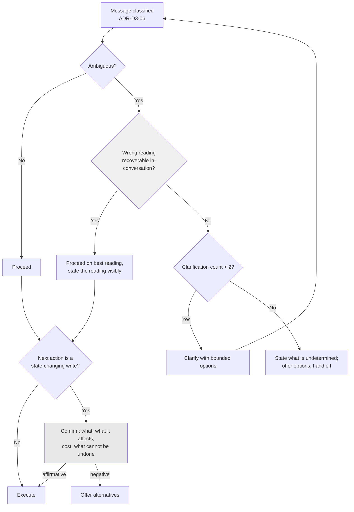

# ADR-D3-07 — Clarification, disambiguation and confirmation strategy

## 1. Summary

Clarification is triggered by **irreversibility**, not by uncertainty alone: the platform asks when
proceeding wrongly would cause something hard to undo, and proceeds when a wrong guess is
recoverable within the conversation. Confirmation before a state-changing enterprise operation is
mandatory and separate from clarification — one resolves ambiguity, the other establishes intent to
act.

## 2. Context and Problem Statement

7 PFF-FA-AI-AGENTIC-ORCHESTRATION.md §13 gives three confidence bands, with low and medium leading toward clarification. 7 PFF-FA-AI-AGENTIC-ORCHESTRATION.md §14
gives the rule — the supervisor should not guess when the wrong workflow could trigger an incorrect
enterprise operation — with a registration example. 4. PFF-FA-AI-RUNTIME.md §14 places the clarification path in the
runtime. 10 PFF-FA-AI-ENTERPRISE-INTEGRATION.md §45 and §48 cover idempotency and unknown transaction state, which bear on what
"incorrect enterprise operation" costs. `SampleWorkflowchat.md` shows Adam offering explicit
choices at decision points.

7 PFF-FA-AI-AGENTIC-ORCHESTRATION.md §14's rule is sound and incomplete. It says *when* not to guess. It does not say:

**What to do when the platform is uncertain but nothing irreversible follows.** A user asks
something the platform half-understands, and the worst case of guessing is an unhelpful answer the
user corrects. 7 PFF-FA-AI-AGENTIC-ORCHESTRATION.md §13's bands would push a medium-confidence case toward clarification, and
clarifying every uncertainty produces an assistant that interrogates rather than helps. ADR-D2-05
§7.4's Gather band addresses some of this, but the underlying question — is uncertainty alone
sufficient reason to ask? — is unresolved.

**Whether confirmation is distinct from clarification.** These are different acts. Clarification
resolves *what the user means*. Confirmation establishes *that the user wants this to happen*. A
user whose intent is perfectly clear should still be asked before an affiliation is submitted,
because submission is irreversible and consequential. Nothing in the specification set separates
them, and conflating them means either confirming things that need no confirmation or submitting
things that do.

**How many times to ask.** 7 PFF-FA-AI-AGENTIC-ORCHESTRATION.md §14 permits clarification without bounding it. An assistant that
clarifies a clarification is worse than one that guesses.

The affiliation flow makes the stakes concrete on both sides. Submitting an application creates
enterprise state, triggers routing under six decision flags, and cannot be withdrawn — only
cancelled by the county. Conversely, a user asking "what do I still need?" who gets a slightly
mistargeted answer simply says so.

## 3. Decision Drivers

### 3.1 Functional drivers

| ID | Driver | Source |
|---|---|---|
| DR-F-01 | Do not guess where a wrong workflow could trigger an incorrect enterprise operation | 7 PFF-FA-AI-AGENTIC-ORCHESTRATION.md §14 |
| DR-F-02 | Confidence bands drive routing behaviour | 7 PFF-FA-AI-AGENTIC-ORCHESTRATION.md §13; ADR-D2-05 §7.4 |
| DR-F-03 | The user must know what is being asked and why | `CLAUDE.md` persona rule 3 |
| DR-F-04 | State-changing operations must be intentional | 10 PFF-FA-AI-ENTERPRISE-INTEGRATION.md §45, §48 |
| DR-F-05 | Clarification must terminate | Programme practice |

### 3.2 Non-functional drivers

| ID | Driver | Target | Source |
|---|---|---|---|
| DR-N-01 | Clarification rate must not make the platform feel obstructive | ≤0.3 per conversation | ADR-D2-05 QM-04 |
| DR-N-02 | Confirmation must precede every irreversible operation | 100% | DR-F-04 |
| DR-N-03 | A clarification must be answerable in one turn | Bounded options | `SampleWorkflowchat.md` |

### 3.3 Constraints

| ID | Constraint | Type | Source |
|---|---|---|---|
| DR-C-01 | One agent per turn; no composition | Platform | ADR-D3-02 §7.1 |
| DR-C-02 | Non-idempotent writes are never retried | Platform | ADR-D2-11 §7.2 |
| DR-C-03 | The platform never predicts an enterprise decision | Platform | ADR-D1-08 §7.3 |
| DR-C-04 | Persona rules on clarity apply | Organisational | `CLAUDE.md` |

### 3.4 Assumptions

| ID | Assumption | If false | Validation |
|---|---|---|---|
| DR-A-01 | Irreversibility is determinable before acting | Some operations' reversibility is unclear; treat as irreversible | Tool contract review |
| DR-A-02 | Users answer clarifications rather than abandoning | Clarification causes abandonment and the threshold must rise | BM-02; QM-04 |
| DR-A-03 | Two clarifications is enough to resolve realistic ambiguity | The bound is too tight and users get handed off unnecessarily | QM-05 |

## 4. Evaluation Criteria and Weights

| ID | Criterion | Weight | Rationale | Measurement |
|---|---|---|---|---|
| EC-01 | Prevention of unintended irreversible operations | 35 | 7 PFF-FA-AI-AGENTIC-ORCHESTRATION.md §14's concern; a wrongly submitted affiliation needs county intervention to undo | Can an irreversible operation occur without explicit intent? |
| EC-02 | Conversational efficiency | 25 | Over-asking is the failure mode that makes an assistant worse than a form | Clarifications per conversation |
| EC-03 | Clarity of what is being asked | 20 | An ambiguous clarification compounds the ambiguity | Can the user answer in one turn? |
| EC-04 | Termination | 12 | Unbounded clarification is a trap | Is there a bound and an exit? |
| EC-05 | Implementation simplicity | 8 | Real but subordinate | Machinery required |
| | **Total** | **100** | | |

Scoring scale: **1** unacceptable · **2** poor · **3** adequate · **4** good · **5** excellent.

## 5. Alternatives Considered

### 5.1 Option A — Clarify whenever confidence is below threshold

**Description.** 7 PFF-FA-AI-AGENTIC-ORCHESTRATION.md §13's bands drive it: below the routing threshold, ask. No distinction
between reversible and irreversible consequences.

**Strengths.**
- Directly implements 7 PFF-FA-AI-AGENTIC-ORCHESTRATION.md §13 (EC-05).
- Never proceeds on a low-confidence reading, so unintended operations are unlikely (EC-01,
  partially).
- One rule, uniformly applied.
- Threshold is already derived from measurement (ADR-D2-05 §7.3).

**Weaknesses.**
- Asks about things where guessing costs nothing. A user asking an informational question gets
  interrogated because the classifier was uncertain (EC-02 fails).
- Confidence measures classification uncertainty, not consequence. A high-confidence intent
  leading to submission gets no confirmation, while a low-confidence informational question gets
  clarified — precisely inverted.
- No confirmation concept at all, so submission proceeds on a confident classification.

**Cost / effort.** Lowest, with the wrong trigger.

### 5.2 Option B — Irreversibility-triggered clarification plus mandatory confirmation

**Description.** Two distinct mechanisms. **Clarification** triggers when ambiguity exists *and*
proceeding wrongly would be hard to undo; where a wrong guess is recoverable in-conversation, the
platform proceeds and self-corrects. **Confirmation** is mandatory before any state-changing
enterprise operation, regardless of confidence.

**Strengths.**
- No irreversible operation without explicit user intent, because confirmation is unconditional
  (EC-01).
- Reversible uncertainty is handled by proceeding and correcting, so the platform does not
  interrogate (EC-02).
- The two acts are distinct and each is clear about what it asks (EC-03).
- Confidence is one input to clarification, not the trigger, which fixes Option A's inversion.

**Weaknesses.**
- Requires reversibility classification per operation (DR-A-01).
- Two mechanisms rather than one.
- Confirmation on every state-changing operation could feel heavy if such operations are frequent.
- Proceeding on uncertainty means some turns are wrong and need correcting.

**Cost / effort.** Moderate.

### 5.3 Option C — Always confirm, never clarify

**Description.** Proceed on best interpretation; confirm before every action, showing what will
happen. The confirmation surfaces any misinterpretation.

**Strengths.**
- One mechanism (EC-05).
- Nothing irreversible happens without confirmation (EC-01).
- Misinterpretation is caught at the confirmation rather than by asking upfront.
- Fewer interruptions than Option A.

**Weaknesses.**
- Confirming a wrong interpretation wastes the whole intervening interaction. A user who wanted
  cup entry and got walked through affiliation pre-checks before being asked to confirm has had
  their time wasted (EC-02, EC-03).
- 7 PFF-FA-AI-AGENTIC-ORCHESTRATION.md §14 is explicit that the supervisor should not guess where the wrong workflow could
  trigger an incorrect operation — proceeding and confirming later still means the wrong context
  was assembled and the wrong reads were made.
- Reads are not confirmed, so an out-of-scope read could occur before anyone asks.

**Cost / effort.** Low, with wasted interaction.

### 5.4 Option D — Model decides when to ask

**Description.** The model judges, per turn, whether it has enough to proceed.

**Strengths.**
- Uses conversational context a threshold cannot see.
- Naturally varies with situation.
- No reversibility classification needed.
- Feels most natural.

**Weaknesses.**
- Whether to proceed with an irreversible operation is a decision with an external consequence,
  which ADR-D3-05 §7.1's test places firmly in the deterministic column (EC-01 fails).
- Non-deterministic and unevaluable — the same ambiguity resolves differently across turns.
- A model that is confidently wrong is exactly the case where it will not ask.

**Cost / effort.** Low, and it fails the consequence test.

## 6. Evaluation Method and Decision Matrix

**Method.** Weighted scoring against §4, tested against two cases: an ambiguous informational
question, and an ambiguous request that could lead to submission.

| Criterion | Weight | A: Confidence-triggered | B: Irreversibility + confirmation | C: Always confirm | D: Model decides |
|---|---|---|---|---|---|
| EC-01 Prevents unintended operations | 35 | 3 | 5 | 4 | 1 |
| EC-02 Conversational efficiency | 25 | 1 | 5 | 3 | 4 |
| EC-03 Clarity | 20 | 3 | 5 | 3 | 3 |
| EC-04 Termination | 12 | 3 | 5 | 5 | 2 |
| EC-05 Simplicity | 8 | 5 | 3 | 5 | 4 |
| **Weighted total** | **100** | **266** | **481** | **371** | **270** |

- **Option B:** (35×5) + (25×5) + (20×5) + (12×5) + (8×3) = 175 + 125 + 100 + 60 + 24 = **481**

**Sensitivity.** B leads C by 110 points and A by 215. B's only sub-maximum is simplicity, worth 8
points. A's failure is instructive: it inverts the trigger, clarifying where consequences are small
and not confirming where they are large, because confidence measures the wrong thing. D fails
ADR-D3-05 §7.1's consequence test outright.

## 7. Decision

### 7.1 Two distinct mechanisms

| | **Clarification** | **Confirmation** |
|---|---|---|
| Resolves | What the user means | That the user wants this to happen |
| Triggered by | Ambiguity **and** irreversible consequence | Any state-changing enterprise operation |
| Conditional on confidence? | Yes, as one input | **No** — always |
| Typical form | "Which of these did you mean?" | "Here's what I'll submit — shall I?" |
| Skippable | Yes, when consequences are reversible | **Never** |

Conflating them produces one of two failures: confirming things that need no confirmation, or
submitting things that do.

### 7.2 The clarification trigger

> **Clarify when ambiguity exists *and* proceeding on the wrong reading would be hard to undo.**
> Where a wrong reading is recoverable within the conversation, proceed on the best reading and
> correct if wrong.

| Situation | Ambiguous? | Wrong reading recoverable? | Action |
|---|---|---|---|
| "What do I still need?" — could mean pre-checks or outstanding products | Yes | Yes — an unhelpful answer the user corrects | **Proceed**, offer the more likely reading, invite correction |
| "Sort out the Under-12s" — could mean affiliate or register | Yes | **No** — different workflows, different enterprise operations | **Clarify** |
| "Yes" after two questions | Yes | Depends on what follows | Clarify if the next step is irreversible |
| "Add another team" with a suspended application | Yes | **No** — amend an existing application or start a new one (ADR-D2-04 §8.2) | **Clarify** |

The first row is where Option A goes wrong: a genuinely ambiguous question with a recoverable
wrong reading should be answered, not interrogated. `SampleWorkflowchat.md`'s register supports
this — Adam offers a reading and moves, rather than stopping to ask.

Where the platform proceeds on a reading, it makes the reading **visible**: "Looking at your
outstanding pre-checks —" so the user can redirect in one word. That is what makes proceeding safe
where the consequence is recoverable.

### 7.3 Confirmation is unconditional before state change

Any tool call classified as a **write** (ADR-D2-13 §7.3) that changes enterprise state requires
explicit confirmation in the immediately preceding turn. No confidence level exempts it.

The confirmation shows, in Adam's voice but with ADR-D1-09's X-5 exclusion applying to the
specifics:

- exactly what will happen — the operation in business terms;
- what it affects — which teams, which application, which amount;
- what it costs, if anything, stated exactly;
- what cannot be undone afterwards.

For affiliation submission that means the teams, the total fee and its composition, the insurance
selections, and that the application will go to the county for review or be auto-approved. The
user's affirmative answer is what authorises the call.

Two properties matter:

- **Confirmation is per operation, not per session.** A user who confirmed a submission has not
  confirmed a subsequent payment.
- **Confirmation is not an authorization.** It establishes intent; entitlement still comes from
  claims (ADR-D3-04 gate 4). A confirmed operation the user is not entitled to perform is still
  refused.

### 7.4 Reversibility classification

DR-A-01's requirement. Each tool declares its reversibility class, alongside its operation class
(ADR-D2-13 §7.3):

| Class | Meaning | Confirmation | Examples |
|---|---|---|---|
| `read` | No state change | No | `get_club_debt`, `list_teams` |
| `reversible_write` | Changes state; the user can undo it in the platform or portal | Yes, lightweight | Saving a draft selection |
| `irreversible_write` | Cannot be undone by the user; requires enterprise intervention | Yes, full per §7.3 | `submit_affiliation`, payment initiation |

Where reversibility is unclear, the tool is classified `irreversible_write`. Under-confirming is
worse than over-confirming, and DR-A-01's uncertainty resolves conservatively.

### 7.5 Clarification terminates

7 PFF-FA-AI-AGENTIC-ORCHESTRATION.md §14 permits clarification without bounding it. The bound:

- **At most two clarification turns** for a single ambiguity.
- After the second, the platform states plainly what it can and cannot determine, offers the
  options it identified as explicit choices, and — if still unresolved — hands off to the portal or
  to county support (ADR-D1-08 §7.5's deliberate handoff, not a failure).
- A clarification that produces another clarification on the *same* ambiguity counts toward the
  bound. A new ambiguity arising later in the conversation starts fresh.

DR-A-03 assumes two is enough. QM-05 measures it.

### 7.6 Clarification form

Per DR-N-03 and `SampleWorkflowchat.md`, a clarification presents **bounded explicit options**, not
an open question:

> *Not:* "What would you like to do?"
> *But:* "Two things this could be — affiliating the Under-12s for the new season, or registering
> new players into them. Which are we doing?"

Bounded options make the clarification answerable in one turn, keep the answer classifiable
(ADR-D3-06 §7.1's closed set), and make the platform's understanding visible even when it is
uncertain. Where the ambiguity is between registered intents, the options are those intents
expressed in user terms.

**Status rationale.** Accepted. Tier 2d under ADR-D0-03 §7.1 — it shapes user-facing interaction —
ratified by the AI Product Owner, with the Security Owner consulted on §7.3's confirmation
requirement.

## 8. Architecture Detail

### 8.1 The two paths

The `CF` box has no bypass. That is §7.3's unconditionality made structural.

### 8.2 Affiliation submission, worked

The platform has walked the user through pre-checks, team selection, insurance and products. Intent
is unambiguous — no clarification is warranted. Confirmation is still mandatory:

> Right — here's the team sheet before we submit.
>
> **Teams:** Under-12s, Under-14s, Under-16s, Open Age
> **Club fee:** £120.00
> **Team fees:** £180.00 (4 × £45.00)
> **Personal Accident cover:** £64.00
> **Total:** £364.00
>
> Once this goes in, it's with Hampshire FA for review — you can't withdraw it yourself, though
> they can cancel it if something's wrong.
>
> Shall I submit?

The amounts, the total and the irreversibility statement are exact and unembellished — ADR-D1-09's
X-5 exclusion. The framing around them is Adam's. No confidence level would have exempted this
step, because §7.3 makes it unconditional.

### 8.3 A recoverable ambiguity, worked

*"What's left to do?"* — could mean outstanding pre-checks, or outstanding products, or the whole
remaining journey.

The platform proceeds on the most likely reading given workflow state (pre-checks, since two are
outstanding) and makes the reading visible:

> Two things still to sort before we can get the application in —
> [the two outstanding pre-checks]
>
> After that it's insurance and products, then we're ready to submit.

If the user meant something else they say so in one turn, and nothing was lost. Under Option A this
would have been a clarification, costing a turn to establish something the platform could have
offered and corrected.

## 9. Consequences

### 9.1 Positive

- No irreversible enterprise operation occurs without explicit user intent, unconditionally.
- Recoverable ambiguity is handled by proceeding visibly rather than interrogating.
- Clarification and confirmation are distinct, so neither is applied where the other belongs.
- Clarification terminates, with a deliberate handoff rather than a loop.
- Bounded options keep clarifications answerable in one turn and their answers classifiable.

### 9.2 Negative

- Reversibility classification per tool is design work, and unclear cases resolve conservatively
  toward more confirmation.
- Proceeding on a best reading means some turns are wrong and cost a correction.
- Confirmation before every state-changing operation may feel heavy where such operations cluster.
- Two mechanisms are more to explain than one.

### 9.3 Neutral

- 7 PFF-FA-AI-AGENTIC-ORCHESTRATION.md §13's bands remain, as an input to clarification rather than its trigger.
- ADR-D2-05 §7.4's Gather band still resolves some ambiguity without asking.

### 9.4 Trade-offs explicitly accepted

| Given up | In exchange for | Accepted by |
|---|---|---|
| Certainty before every action | Not interrogating users about recoverable ambiguity | AI Product Owner |
| Frictionless submission | No irreversible operation without explicit intent | Security Owner |
| A single uniform mechanism | Each act asking what it actually needs to ask | AI Solution Architect |

## 10. Golden-Rule and Precedence Conformance

| Constraint | Conformance |
|---|---|
| Enterprise decides; AI orchestrates | Confirmation establishes user intent to *request* an operation; the enterprise still decides its outcome. §8.2's wording says the application goes for review, not that it will be approved (ADR-D1-08 §7.3). |
| Authoritative-truth precedence | Confirmation content — teams, fees, totals — comes from ERC at authority 5 and is stated exactly (ADR-D1-02 I-1, ADR-D1-09 X-5). |
| Four-state separation | Clarification state is Conversation State; confirmation gates a Workflow State transition that triggers an Enterprise Business State change. |
| Versioned artefacts, never mutated in place | Reversibility classifications live in versioned tool contracts. |
| Adam persona governs how, never what | §8.2 shows the split: framing is Adam's, amounts and the irreversibility statement are exact. |

## 11. Risks and Mitigations

| ID | Risk | Likelihood | Impact | Exposure | Mitigation | Owner | Residual |
|---|---|---|---|---|---|---|---|
| RSK-01 | A state-changing operation executes without confirmation | Low | Very High | High | §8.1's structural gate; AC-01; QM-01 | Security Owner | Low |
| RSK-02 | A tool is misclassified as `reversible_write` | Medium | High | High | §7.4's conservative default; classification reviewed per tool; QM-06 | AI Solution Architect | Medium |
| RSK-03 | Proceeding on a wrong reading wastes user effort | Medium | Low | Low | Reading stated visibly (§7.2); correction costs one turn | AI Product Owner | Low |
| RSK-04 | Clarification rate makes the platform obstructive (DR-A-02) | Medium | Medium | Medium | Irreversibility trigger rather than confidence; QM-02 against ADR-D2-05 QM-04 | AI Product Owner | Medium |
| RSK-05 | Two clarifications insufficient (DR-A-03) | Low | Low | Low | QM-05; handoff is a designed outcome, not a failure | AI Product Owner | Low |
| RSK-06 | Confirmation becomes routine and users stop reading it | Medium | High | High | Confirmation content is specific to the operation, not boilerplate; QM-04 tracks negative responses as a health signal | AI Product Owner | Medium |

RSK-06 is worth noting: a confirmation nobody reads is not a control. A non-zero rate of users
declining at confirmation is evidence it is being read.

## 12. Quantitative Targets and Measures

| ID | Measure | Target | Threshold (alert) | Source | Review cadence |
|---|---|---|---|---|---|
| QM-01 | State-changing operations executed without a preceding confirmation | 0 | ≥1 | Tool executor audit against turn history | Daily |
| QM-02 | Clarifications per conversation | ≤0.3 | >0.8 | Conversation traces; ADR-D2-05 QM-04 | Weekly |
| QM-03 | Clarifications where the wrong reading would have been recoverable | 0 | ≥5% of clarifications | Evaluation suite | Per release |
| QM-04 | Confirmations declined by the user | >0 | 0 for a sustained period | Turn analysis | Monthly |
| QM-05 | Ambiguities requiring a second clarification | ≤15% | >35% | Supervisor metrics | Monthly |
| QM-06 | Tools classified `reversible_write` that require enterprise intervention to undo | 0 | ≥1 | Tool contract audit | Per release |
| QM-07 | Corrections following a proceed-on-best-reading turn | Tracked | >20% | Conversation traces | Monthly |

QM-04's inverted target is deliberate: zero declines over a sustained period suggests confirmations
are not being read, which is RSK-06 showing up in data.

## 13. Security, Privacy and Compliance Impact

| Dimension | Impact |
|---|---|
| Attack surface change | Confirmation is a control against an injection that reaches tool selection: even if a manipulated agent proposes a state-changing call, the user is shown what will happen and must assent. It is the last human checkpoint before enterprise state changes. |
| Data classification touched | Confirmation content includes personal data — team and official details, amounts. |
| Personal data / PII | Confirmations show only what the operation affects, within the user's archetype scope. |
| Children's data and safeguarding | A confirmation for an application including youth teams states which teams. It does not restate officials' clearance status — that was surfaced at the pre-check under ADR-D1-09's X-1, and repeating it in a confirmation would be gratuitous. |
| UK GDPR lawful basis and rights impact | Confirmation supports transparency and, for operations affecting the user's own records, evidences intent. It is not consent in the Art. 6(1)(a) sense — processing rests on the enterprise's basis. |
| Audit and evidential requirements | The confirmation turn and its response are recorded, evidencing user intent before each state change — useful where an application's submission is later queried. |
| Standards touched | ISO/IEC 42001 (human oversight); NIST AI RMF GOVERN 5.2, MANAGE 4.1; EU AI Act Art. 14 — confirmation is a concrete oversight mechanism at the point of consequence. |

## 14. Implementation Impact

| Aspect | Detail |
|---|---|
| Build phases | 4 (clarification path), 23 (affiliation confirmations) |
| Repository paths | `src/pff_fa_ai/orchestration/supervisor/`, `src/pff_fa_ai/agents/affiliation/` |
| Configuration | Reversibility class in tool contracts; clarification bound in `config/base/agents.yaml` |
| Contracts / schemas | Confirmation record on turn state; reversibility class on tool definitions |
| Migration | None |
| Dependencies on other ADRs | ADR-D2-05 (bands), ADR-D3-06 (intent set for bounded options), ADR-D2-13 (tool classes), ADR-D1-09 (persona exclusions) |
| Effort estimate | Moderate |

## 15. Validation and Verification

| ID | Acceptance criterion | Verification method |
|---|---|---|
| AC-01 | No `irreversible_write` or `reversible_write` executes without a confirmation in the preceding turn | Executor test against turn history; QM-01 |
| AC-02 | Confirmation states operation, scope, cost and irreversibility exactly | Evaluation suite against §8.2's shape |
| AC-03 | An ambiguity with a recoverable wrong reading proceeds rather than clarifying | §8.3 golden case; QM-03 |
| AC-04 | An ambiguity between workflows clarifies rather than proceeding | Golden case per 7 PFF-FA-AI-AGENTIC-ORCHESTRATION.md §14 |
| AC-05 | A third clarification on one ambiguity does not occur | Clarification bound test |
| AC-06 | Clarifications present bounded options, not open questions | Evaluation suite |
| AC-07 | A confirmed operation the user is not entitled to perform is still refused | ADR-D3-04 gate 4 test |

AC-07 is the check on §7.3's second property: confirmation is intent, not authorization.

## 16. Operational Impact

| Aspect | Detail |
|---|---|
| Monitoring | Clarification rate and outcome; confirmation rate and decline rate; corrections after proceed-on-reading |
| Alerting | QM-01 on any occurrence; QM-02 and QM-04 on thresholds |
| Runbook | None specific |
| Failure mode and degradation | Where clarification exhausts, the platform hands off deliberately (ADR-D1-08 §7.5) rather than guessing or looping. |
| Rollback | Clarification bound and reversibility classes are configuration |
| Support model impact | The confirmation record answers "did the user actually ask for this?" directly |

## 17. Cost Impact

| Cost element | One-off | Recurring | Basis |
|---|---|---|---|
| Clarification and confirmation paths | Phases 4 and 23 | — | `DEVELOPMENT-GUIDE.md` §4 |
| Additional turns from clarification | — | ≤0.3 per conversation | QM-02 |
| Additional turns from confirmation | — | One per state-changing operation | Unavoidable and intended |
| Avoided cost | — | Ongoing | A wrongly submitted affiliation requires county intervention to cancel and a resubmission |

## 18. Revisit Triggers and Causal Analysis Hooks

| ID | Trigger | Detected by | Action on trigger |
|---|---|---|---|
| RT-01 | QM-01 records an unconfirmed state change | Daily | Governance incident; §7.3's gate failed |
| RT-02 | QM-03 shows clarification where the reading was recoverable | Per release | The trigger is drifting toward confidence; recalibrate against §7.2 |
| RT-03 | QM-04 shows zero declines over a sustained period | Monthly | Confirmations may not be read (RSK-06); review their specificity |
| RT-04 | QM-05 exceeds 35% second clarifications | Monthly | Clarification options are unclear; review §7.6's form |
| RT-05 | QM-07 shows corrections above 20% | Monthly | Proceed-on-best-reading is guessing too often; tighten §7.2's recoverability judgement |
| RT-06 | QM-06 finds a misclassified tool | Per release | Reclassify; check whether any operation ran under light confirmation |

**Scheduled review:** 2027-02-21.

## 19. Traceability

| Dimension | Reference |
|---|---|
| Workshop sheet | WS-14 Conversation Decision Architecture |
| Specification sections | 7 PFF-FA-AI-AGENTIC-ORCHESTRATION.md §13 (Supervisor Confidence), §14 (Supervisor Clarification); 4. PFF-FA-AI-RUNTIME.md §14 (Clarification Path); 10 PFF-FA-AI-ENTERPRISE-INTEGRATION.md §45 (Idempotency), §48 (Unknown Transaction State); `Examples/SampleWorkflowchat.md`; `CLAUDE.md` persona rules 3, 6 |
| Requirement IDs | `NFR-A38-REL`, `NFR-A38-SEC` |
| Build phases | 4, 23 |
| Code paths | `src/pff_fa_ai/orchestration/supervisor/`, `src/pff_fa_ai/agents/affiliation/` |
| Configuration | Tool reversibility classes; clarification bound |
| Tests | AC-01 to AC-07 |
| Upstream ADRs | ADR-D2-05, ADR-D3-05, ADR-D3-06 |
| Downstream ADRs | ADR-D3-08, ADR-D6-14, ADR-D1-08 |

## 20. Change Log

| Version | Date | Author | Change |
|---|---|---|---|
| 1.0.0 | 2026-08-21 | AI Product Owner | Initial decision recorded. Clarification triggered by irreversibility rather than confidence, correcting an inversion where low-confidence trivia gets interrogated and high-confidence submissions do not; confirmation made unconditional and distinct from clarification; clarification bounded at two turns with a deliberate handoff. |
