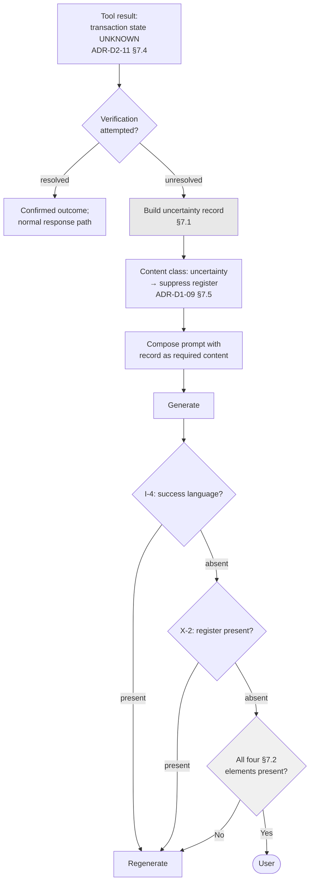

# ADR-D3-08 — Transaction-uncertainty and ambiguous-outcome conversational policy

## 1. Summary

When an enterprise outcome is genuinely unknown, the platform says so — naming what **is** known,
what **is not**, why it cannot tell, and what the user should do. Uncertainty is never resolved
optimistically, never softened into ambiguity, and never expressed through the football register.
The response is generated from a **structured uncertainty record**, not left to the model to phrase
from a failed tool result.

## 2. Context and Problem Statement

8 PFF-FA-AI-ERC-CONTEXT.md §65 covers ERC and transaction state; §66 covers transaction uncertainty. 10 PFF-FA-AI-ENTERPRISE-INTEGRATION.md §48 covers
unknown transaction state and §49 transaction verification. 3. PFF-FA-AI-RESPONSIBILITY-MATRIX.md §36 assigns transaction
responsibility and §50 responsibility during API failure. The affiliation flow's Scenarios 21
through 27 are seven distinct payment and submission failure modes, several of which leave the
outcome genuinely indeterminate.

ADR-D2-11 §7.4 established the mechanism: UNKNOWN is a first-class state, resolved by verification
rather than re-attempt, and where verification is impossible the state remains UNKNOWN.
ADR-D1-02's invariant I-4 blocks success language for an unconfirmed transaction. Both are about
what the platform *does*.

What neither addresses is what the platform **says**, and this is where the platform is most
likely to fail a user badly. An UNKNOWN outcome is the hardest thing a conversational assistant has
to communicate, for three reasons:

- **The model's instinct is to resolve it.** A language model given a failed tool result and asked
  to respond will produce something fluent, and fluent renderings of uncertainty drift toward
  reassurance. "It looks like that didn't go through" asserts a failure the platform does not know
  occurred.
- **The persona pulls the same way.** `CLAUDE.md` mandates an encouraging football register.
  Applied to uncertainty it produces "we'll get that sorted" — warm, and a claim about the future
  the platform cannot make.
- **Users want resolution.** A club secretary asking "did my payment go through?" wants yes or no.
  "I can't tell" is unsatisfying, and the temptation to give the likely answer is strongest exactly
  when the platform should not.

Affiliation Scenario 23 is the sharpest case: *paid offline but the invoice is still unpaid in
Xero*. The application is COMPLETE. The teams are affiliated. Whether the money is reconciled is
unclear. A user asking "is it all sorted?" is asking a question with a genuinely mixed answer, and
both "yes" and "no" are wrong.

I-4 blocks success language. It does not, on its own, produce a good response — a blocked response
regenerated without the offending phrase can still be vague, and vagueness about a payment is its
own failure.

## 3. Decision Drivers

### 3.1 Functional drivers

| ID | Driver | Source |
|---|---|---|
| DR-F-01 | Transaction uncertainty must be handled explicitly | 8 PFF-FA-AI-ERC-CONTEXT.md §66; 10 PFF-FA-AI-ENTERPRISE-INTEGRATION.md §48 |
| DR-F-02 | The platform must not silently guess at failed or ambiguous outcomes | `CLAUDE.md`; 3. PFF-FA-AI-RESPONSIBILITY-MATRIX.md §50 |
| DR-F-03 | Errors and failures must remain factual, with impact and next action explicit | `CLAUDE.md` persona rule 7 |
| DR-F-04 | No transaction may be celebrated before confirmation | `CLAUDE.md` persona rule 6; ADR-D1-02 I-4 |
| DR-F-05 | The user must know what to do next | ADR-D1-08 §7.2 |

### 3.2 Non-functional drivers

| ID | Driver | Target | Source |
|---|---|---|---|
| DR-N-01 | Uncertainty responses must be evaluable against a fixed standard | Golden cases per scenario class | ADR-D7-13 |
| DR-N-02 | The response must not vary in substance across generations | Same uncertainty, same facts stated | ADR-D3-01 §7.4 |
| DR-N-03 | The user must be able to act on the response | A named next step in every case | DR-F-05 |

### 3.3 Constraints

| ID | Constraint | Type | Source |
|---|---|---|---|
| DR-C-01 | Success language is blocked for unconfirmed transactions | Platform | ADR-D1-02 I-4 |
| DR-C-02 | The football register is excluded for unconfirmed transactions | Organisational | ADR-D1-09 §7.2 X-2 |
| DR-C-03 | Amounts, dates, statuses and required actions are stated exactly | Organisational | ADR-D1-09 §7.2 X-5 |
| DR-C-04 | The platform never predicts an enterprise decision or outcome | Platform | ADR-D1-08 §7.3 |

### 3.4 Assumptions

| ID | Assumption | If false | Validation |
|---|---|---|---|
| DR-A-01 | What is known and unknown can be separated cleanly | Some cases resist decomposition and must be stated as wholly uncertain | Scenario analysis at Phase 23 |
| DR-A-02 | Users prefer honest uncertainty to confident error | Honest uncertainty drives abandonment or escalation | BM-02, BM-03; QM-05 |
| DR-A-03 | A next action exists in every uncertainty case | Some cases have no user action, and the response must say so plainly | Scenario analysis |

## 4. Evaluation Criteria and Weights

| ID | Criterion | Weight | Rationale | Measurement |
|---|---|---|---|---|
| EC-01 | Never asserting an unknown outcome | 35 | Telling a club their payment succeeded when it may not have is the platform's most damaging possible statement | Can an unconfirmed outcome be stated as fact? |
| EC-02 | Usefulness to the user | 25 | "I don't know" without structure is a failure of a different kind | Does the user learn what is known and what to do? |
| EC-03 | Consistency across generations | 20 | The same uncertainty must produce the same facts | Do repeated generations state the same things? |
| EC-04 | Tonal appropriateness | 12 | The register must not undercut the seriousness | Does it comply with X-2 and X-5? |
| EC-05 | Implementation cost | 8 | Real but subordinate | Machinery required |
| | **Total** | **100** | | |

Scoring scale: **1** unacceptable · **2** poor · **3** adequate · **4** good · **5** excellent.

## 5. Alternatives Considered

### 5.1 Option A — Model generates from the failed tool result, guardrail blocks success language

**Description.** Pass the UNKNOWN tool result into the prompt; the model phrases a response; I-4
blocks success language.

**Strengths.**
- No additional machinery; I-4 already exists (EC-05).
- Model produces natural, contextually-fitted language.
- Adapts to each situation's specifics.
- Satisfies DR-C-01 literally.

**Weaknesses.**
- I-4 blocks success language; it does not require any particular content. A response that says
  "something went wrong with that" passes I-4 and tells the user nothing (EC-02 fails).
- Blocked-and-regenerated responses drift toward vagueness, because vagueness is the safest thing
  that passes.
- No consistency guarantee — two generations from the same UNKNOWN state can state different
  things (EC-03).
- The model must infer what is known from a failure result, which is the wrong input for that
  question.

**Cost / effort.** Nil beyond what exists.

### 5.2 Option B — Structured uncertainty record drives a constrained generation

**Description.** When a transaction resolves UNKNOWN, the platform builds a structured record —
what is confirmed, what is unknown, why verification could not settle it, what the user should do,
who to contact. The record is composed into the prompt as required content, and I-4 plus X-2 apply
on output.

**Strengths.**
- The response's substance comes from a record the platform built from known facts, not from the
  model's inference about a failure (EC-01, EC-02).
- The same UNKNOWN state produces the same record and therefore the same facts stated (EC-03).
- The record's fields make evaluation concrete: a golden case checks that each field appears
  (DR-N-01).
- X-2's register suppression is driven by the record's presence, deterministically (EC-04).

**Weaknesses.**
- Requires the record to be constructible, which needs the known/unknown separation (DR-A-01).
- More machinery than Option A.
- A rigid record could produce stilted responses if the model is over-constrained.
- Cases with no next action need explicit handling (DR-A-03).

**Cost / effort.** Moderate.

### 5.3 Option C — Fixed templates per uncertainty class

**Description.** Each uncertainty class has a written template; the platform selects and fills it.

**Strengths.**
- Maximum consistency — identical wording every time (EC-03).
- Content is guaranteed because it is authored (EC-01, EC-02).
- Trivially evaluable.
- No generation variance to manage.

**Weaknesses.**
- Templates cannot adapt to conversational context. A user who has been walked through a
  submission gets the same words as one who arrived asking about it cold.
- Breaks the persona entirely at exactly the moment continuity matters — ADR-D1-09 AC-07 requires
  a suppressed-register turn to still be recognisably Adam.
- Template proliferation: seven affiliation scenarios × conversational contexts.
- Brittle to new cases; an unanticipated uncertainty has no template.

**Cost / effort.** Moderate, with a poor experience.

### 5.4 Option D — Escalate to a human on any uncertainty

**Description.** An UNKNOWN outcome hands off immediately: "I can't determine this — contact your
county association."

**Strengths.**
- Zero risk of asserting an unknown outcome (EC-01 trivially).
- Simple and unambiguous.
- A human can actually resolve it.
- No generation concerns.

**Weaknesses.**
- Discards what the platform does know. In Scenario 23 the platform knows the application is
  complete and the teams are affiliated — telling the user only "contact the county" wastes that
  (EC-02).
- Escalates cases that resolve themselves. ADR-D2-18 §7.6's reconciliation often settles the
  matter within minutes.
- Loads county associations with contacts the platform could have handled, which is the opposite
  of ADR-D1-04's BM-03.

**Cost / effort.** Low, at real cost to users and counties.

## 6. Evaluation Method and Decision Matrix

**Method.** Weighted scoring against §4, tested against affiliation Scenario 23 — what does each
option tell a user asking "is it all sorted?"

| Criterion | Weight | A: Model + guardrail | B: Structured record | C: Templates | D: Escalate |
|---|---|---|---|---|---|
| EC-01 Never asserts unknown | 35 | 4 | 5 | 5 | 5 |
| EC-02 Usefulness | 25 | 2 | 5 | 4 | 2 |
| EC-03 Consistency | 20 | 2 | 5 | 5 | 5 |
| EC-04 Tonal appropriateness | 12 | 3 | 5 | 2 | 3 |
| EC-05 Cost | 8 | 5 | 3 | 3 | 5 |
| **Weighted total** | **100** | **306** | **480** | **431** | **406** |

- **Option B:** (35×5) + (25×5) + (20×5) + (12×5) + (8×3) = 175 + 125 + 100 + 60 + 24 = **480**

**Sensitivity.** B leads C by 49 points, on usefulness and tone. C's consistency is equal to B's and
its cost similar; what separates them is that templates cannot carry conversational context and
break persona continuity, which ADR-D1-09 AC-07 requires. A's 306 reflects that a guardrail which
blocks bad content does not produce good content. D is safe and wasteful.

## 7. Decision

### 7.1 The uncertainty record

When a transaction resolves UNKNOWN (ADR-D2-11 §7.4), the platform constructs:

```yaml
uncertainty:
  operation: submit_affiliation
  confirmed:                        # what IS known, from authoritative sources
    - "Application PFF-2026-4417 exists with status PENDING CFA"
    - "Four teams are attached to the application"
  unknown:                          # what is NOT known, stated specifically
    - "Whether the insurance product selection was recorded"
  reason: >                         # why verification could not settle it
    The submission returned an error after the request was accepted, and the
    verification read does not report product selections.
  user_action:                      # what the user should do, or that there is nothing
    text: "Check the Products step in the Club Portal before the county reviews it."
    link_route: club_portal.affiliation.products   # resolved per ADR-D2-19
  platform_action: >                # what the platform will do
    Reconciliation will re-check within the hour and the status will update.
  escalation:                       # who to contact if it does not resolve
    contact: county_association
    when: "if the status has not changed by tomorrow"
```

Every field is derived from known state: `confirmed` from ERC facts at authority 5, `unknown` from
what the verification read did not cover, `reason` from the tool result's classification,
`platform_action` from whether reconciliation applies (ADR-D2-18 §7.6).

The record is the response's **substance**. The model's job is to express it, not to determine it.

### 7.2 Four things the response must always contain

Derived from `CLAUDE.md` persona rule 7 and DR-N-03:

| # | Element | Why |
|---|---|---|
| **1** | What is confirmed | The user learns what they do not need to worry about — and it is often most of it |
| **2** | What is not known, specifically | "Something went wrong" is not this. Naming the specific unknown is what makes the response actionable |
| **3** | Why the platform cannot tell | Without this, uncertainty reads as incompetence rather than as an honest limit |
| **4** | What happens next — user action, platform action, or both | DR-N-03; a user who cannot act is entitled to know that too |

Element 1 is the one Option D discards and the one that most often carries the useful content.
Element 2 is the one Option A's vagueness loses.

### 7.3 What the response must never do

| Prohibited | Why |
|---|---|
| Assert the outcome either way | I-4; and "it failed" is as much an assertion as "it succeeded" |
| Estimate likelihood — "it probably went through" | ADR-D1-08 §7.3 and DR-C-04; the platform has no basis |
| Use the football register | ADR-D1-09 §7.2 X-2 — the register carries emotional valence that resolves uncertainty in the reader's mind |
| Soften the unknown into vagueness | Persona rule 7; the failure must be explicit |
| Promise resolution | "We'll get this sorted" is a claim about an enterprise process the platform does not control |
| Suggest the user retry a non-idempotent operation | ADR-D2-11 §7.2; a user-initiated duplicate is the same harm as a platform one |

The last row deserves emphasis. The natural helpful instinct — "try submitting again" — is the
single most damaging thing the platform could say after an UNKNOWN submission, because it converts
the platform's careful no-blind-retry policy into a user-executed duplicate.

### 7.4 Composition-time register suppression

Per ADR-D1-09 §7.5, the presence of an uncertainty record is a content-class signal that suppresses
the football register for that turn — deterministically, at composition, before generation. The
model is not asked to judge whether the register is appropriate; it is composed without it.

The response remains Adam's: warm, direct, on the user's side. What it loses is the framing that
would make an unresolved payment sound like a match in progress.

### 7.5 Scenario 23, worked

*Paid offline but the invoice is still unpaid in Xero. User asks: "Is it all sorted?"*

**Record:**

| Field | Content |
|---|---|
| `confirmed` | Application COMPLETE; four teams affiliated; affiliation date stamped; payment recorded as offline by the county |
| `unknown` | Whether the invoice has been reconciled in the finance system |
| `reason` | The finance record shows the invoice still open, while the county has marked payment received offline |
| `user_action` | None required |
| `platform_action` | None — this is a finance reconciliation between the county and the finance system |
| `escalation` | County association, if a payment query arrives |

**Response:**

> Mostly, yes — and the important part is done.
>
> Your four teams are affiliated and the application is complete. Hampshire FA have recorded your
> payment as received offline.
>
> One thing I can't confirm: the invoice is still showing as open in the finance system, which
> doesn't match the county having marked it paid. That's a reconciliation between them and finance
> rather than anything you need to do.
>
> If you get a payment reminder for this, that's why — send it to Hampshire FA and they'll clear
> it.

All four §7.2 elements present. No register. Amounts and statuses exact. No estimate of whether it
will resolve. A named next step for the one case where the user might need to act.

Compare Option A's likely output: *"Your affiliation is complete. There may be an issue with the
payment record."* — which passes I-4, states less, and leaves the user unsure whether they owe
money.

### 7.6 Uncertainty is not an error

An UNKNOWN outcome is not a platform failure and is not framed as one. The platform did what it
should: it did not retry a non-idempotent write, it attempted verification, and it reported
honestly. The response's framing reflects that — it is a limit of what can be known right now, not
an apology.

This matters for user trust. A platform that apologises for uncertainty teaches users that
uncertainty is abnormal; a platform that reports it matter-of-factly teaches them it is
occasionally the true state of affairs, which it is.

**Status rationale.** Accepted. Tier 1 under ADR-D0-03 §7.1 — this governs what the platform
asserts about enterprise transactions, a system-boundary concern — ratified by the external ADF/ADR
governance forum, with Compliance/Legal consulted on payment-related wording.

## 8. Architecture Detail

### 8.1 From UNKNOWN to response



The `E` check is what Option A lacks: a guardrail that verifies the response *contains* what it
must, not only that it lacks what it must not.

### 8.2 The seven affiliation scenarios classified

| Scenario | Outcome class | Record shape |
|---|---|---|
| 21 — Invoice not created in PAAS | Confirmed failure | Not uncertainty; a definite blocked state |
| 22 — Invoice created, not mapped to application | **UNKNOWN** | Confirmed: invoice exists. Unknown: whether payment will attach |
| 23 — Paid offline, unpaid in Xero | **UNKNOWN** | §7.5 |
| 24 — Cancelled, invoice not voided | **UNKNOWN** | Confirmed: cancelled. Unknown: invoice disposition |
| 25 — Invoice not posted to Xero | **UNKNOWN** | Confirmed: complete. Unknown: finance record |
| 26 — 500 on submission | **UNKNOWN** until verified | Resolved by verification in most cases (ADR-D2-11 §8.1) |
| 27 — Product validation 404 | Confirmed failure | Definite; user can correct and retry |

Five of seven are genuine uncertainty. That density is why this ADR exists as a first-class
decision rather than an edge case in error handling, and it is a substantial part of what ADR-D1-05
§7.2 meant by affiliation forcing transaction-uncertainty handling into existence.

### 8.3 Evaluation

Per DR-N-01, each uncertainty class has golden cases checking:

| Check | Method |
|---|---|
| All four §7.2 elements present | Structural check against the record's fields |
| No success or failure assertion | I-4 plus a failure-assertion check |
| No football register | X-2 check |
| No likelihood estimate | Pattern check for hedging-toward-resolution language |
| No suggestion to retry a non-idempotent operation | Pattern check against the operation's class |
| Amounts and statuses match the record exactly | I-1 provenance check |
| Response is recognisably Adam | Persona rubric (ADR-D1-09 AC-07) |

The last is what distinguishes this from Option C: a suppressed-register response must still pass
the persona rubric.

## 9. Consequences

### 9.1 Positive

- The response's substance comes from a record built from known facts, so it cannot be vague.
- The same UNKNOWN state produces the same stated facts across generations.
- What is confirmed is stated, so the user learns what they need not worry about — often most of it.
- Register suppression is deterministic at composition rather than judged by the model.
- Uncertainty is framed as a limit, not an apology, which sets the right expectation.

### 9.2 Negative

- The record must be constructible, requiring known/unknown separation per operation (DR-A-01).
- More machinery than relying on the guardrail alone.
- Over-constraining generation could produce stilted responses; the persona rubric is the guard.
- Users wanting a yes or no still do not get one, and some will find that unsatisfying (DR-A-02).

### 9.3 Neutral

- I-4 and X-2 remain and are unchanged; this decision adds the positive-content requirement.
- Cases with no user action are handled explicitly rather than being awkward.

### 9.4 Trade-offs explicitly accepted

| Given up | In exchange for | Accepted by |
|---|---|---|
| A definite answer where the user wants one | Never asserting an outcome the platform does not know | External ADF/ADR forum |
| Generation freedom | The same uncertainty stating the same facts every time | AI Evaluation Owner |
| The persona's warmth at these moments | A payment ambiguity that reads as serious | AI Product Owner |

## 10. Golden-Rule and Precedence Conformance

| Constraint | Conformance |
|---|---|
| Enterprise decides; AI orchestrates | The platform reports what the enterprise's records show and what they do not. It forms no view on the transaction's outcome, which is 3. PFF-FA-AI-RESPONSIBILITY-MATRIX.md §36's transaction authority respected at the point it is most tempting to breach. |
| Authoritative-truth precedence | `confirmed` items are authority-5 ERC facts stated exactly; `unknown` items are the absence of such facts. Nothing lower in the chain fills the gap. |
| Four-state separation | The record is built from Enterprise Business State projections and Workflow State; it asserts nothing about either beyond what is held. |
| Versioned artefacts, never mutated in place | Response requirements and golden cases are versioned. |
| Adam persona governs how, never what | This ADR is the clearest case of the rule: the record determines what is said; the persona shapes how, minus the register that X-2 excludes. |

## 11. Risks and Mitigations

| ID | Risk | Likelihood | Impact | Exposure | Mitigation | Owner | Residual |
|---|---|---|---|---|---|---|---|
| RSK-01 | A response asserts an outcome despite I-4 | Low | Very High | High | §8.1's positive-content check plus I-4; golden cases per scenario; QM-01 | Security Owner | Low |
| RSK-02 | The response suggests retrying a non-idempotent operation | Medium | Very High | High | §7.3's explicit prohibition; pattern check in §8.3; QM-02 | Security Owner | Low |
| RSK-03 | Known/unknown separation not constructible for a case (DR-A-01) | Medium | Medium | Medium | Fall back to stating the whole outcome as unverified, with §7.2's elements 3 and 4 still present | AI Engineering Lead | Medium |
| RSK-04 | Honest uncertainty drives abandonment (DR-A-02) | Medium | Medium | Medium | Element 1 gives the user the confirmed part; QM-05 tracks abandonment after uncertainty turns | AI Product Owner | Medium |
| RSK-05 | Suppressed-register responses read as a different assistant | Medium | Low | Low | ADR-D1-09 AC-07's rubric applies to these turns; §8.3's last check | AI Product Owner | Low |
| RSK-06 | Uncertainty framed as a platform failure, eroding trust | Medium | Medium | Medium | §7.6; golden cases check framing | AI Product Owner | Low |

## 12. Quantitative Targets and Measures

| ID | Measure | Target | Threshold (alert) | Source | Review cadence |
|---|---|---|---|---|---|
| QM-01 | Uncertainty responses asserting an outcome | 0 | ≥1 | Evaluation suite plus trace audit | Weekly |
| QM-02 | Uncertainty responses suggesting retry of a non-idempotent operation | 0 | ≥1 | Pattern check; evaluation suite | Per release |
| QM-03 | Uncertainty responses containing all four §7.2 elements | 100% | <100% | Structural check | Per release |
| QM-04 | Football register present in an uncertainty response | 0 | ≥1 | X-2 check; ADR-D1-09 QM-02 | Weekly |
| QM-05 | Conversations abandoned within two turns of an uncertainty response | Tracked | >30% | Conversation traces | Monthly |
| QM-06 | Uncertainty responses passing the persona rubric | ≥ threshold | Below threshold | ADR-D1-09 QM-01 | Per release |
| QM-07 | UNKNOWN outcomes reaching a user without verification having been attempted | 0 | ≥1 | Tool result audit | Daily |

QM-05 validates DR-A-02. A high rate would mean honest uncertainty is driving users away, which
would be a communication problem to fix — not a reason to start asserting outcomes.

## 13. Security, Privacy and Compliance Impact

| Dimension | Impact |
|---|---|
| Attack surface change | None directly. The record's construction from authoritative facts means an injection cannot introduce a false `confirmed` item — those come from ERC, not from generation. |
| Data classification touched | Financial and application data; amounts and payment states. |
| Personal data / PII | The record contains club and application data within the user's scope. |
| Children's data and safeguarding | Uncertainty about a safeguarding check result is possible — a compliance read that fails verification. Element 2 must name it specifically ("I can't confirm whether the DBS check for [name] has updated"), and X-1 applies alongside X-2: no register, and no characterisation of the person. |
| UK GDPR lawful basis and rights impact | Supports accuracy (Art. 5(1)(d)) directly: the platform does not state personal or financial data it cannot substantiate. |
| Audit and evidential requirements | The uncertainty record is traced with the response, so what the platform knew and told the user is reconstructable — important where a payment dispute follows. |
| Standards touched | ISO/IEC 42001 (transparency, communication of limitations); NIST AI RMF MEASURE 2.9 (explainability), GOVERN 5.1; EU AI Act Art. 50 (transparency). |

## 14. Implementation Impact

| Aspect | Detail |
|---|---|
| Build phases | 11 (guardrail content check), 23 (affiliation scenarios) |
| Repository paths | `src/pff_fa_ai/guardrails/`, `src/pff_fa_ai/agents/affiliation/` |
| Configuration | Uncertainty record schema; response element requirements |
| Contracts / schemas | Uncertainty record model; content-class signal for register suppression |
| Migration | None |
| Dependencies on other ADRs | ADR-D2-11 (UNKNOWN state), ADR-D1-02 (I-4), ADR-D1-09 (X-2, X-5), ADR-D2-18 (reconciliation) |
| Effort estimate | Moderate |

## 15. Validation and Verification

| ID | Acceptance criterion | Verification method |
|---|---|---|
| AC-01 | An UNKNOWN outcome produces a response with all four §7.2 elements | Structural check; QM-03 |
| AC-02 | No uncertainty response asserts success or failure | I-4 plus failure-assertion check; QM-01 |
| AC-03 | No uncertainty response suggests retrying a non-idempotent operation | Pattern check; QM-02 |
| AC-04 | No football register appears in an uncertainty response | X-2 check; QM-04 |
| AC-05 | Amounts and statuses match the record exactly | I-1 provenance check |
| AC-06 | Each of §8.2's five UNKNOWN scenarios has a golden case that passes | Evaluation suite |
| AC-07 | Uncertainty responses pass the persona rubric | ADR-D1-09 AC-07; QM-06 |
| AC-08 | An UNKNOWN outcome reaches a user only after verification was attempted | ADR-D2-11 AC-03; QM-07 |

## 16. Operational Impact

| Aspect | Detail |
|---|---|
| Monitoring | UNKNOWN rate by operation; uncertainty response volume; abandonment after uncertainty |
| Alerting | QM-01, QM-02, QM-04 and QM-07 on any occurrence |
| Runbook | `docs/runbooks/enterprise-api.md` — UNKNOWN escalation |
| Failure mode and degradation | Where the record cannot be constructed (RSK-03), the response states the whole outcome as unverified with elements 3 and 4 present. Less useful, still honest. |
| Rollback | Response requirements are configuration; the record schema is versioned |
| Support model impact | Support sees the uncertainty record alongside the response, so they know exactly what the user was told and what was actually known |

## 17. Cost Impact

| Cost element | One-off | Recurring | Basis |
|---|---|---|---|
| Record construction and content check | Phase 11 | — | `DEVELOPMENT-GUIDE.md` §4 |
| Golden cases for five UNKNOWN scenarios | ~2 days | Maintained with the golden set | §8.2 |
| Regeneration on content-check failure | — | Small share of uncertainty turns | §8.1 |
| Avoided cost | — | Substantial | A user told their payment succeeded when it did not, or told to resubmit an application that already exists, generates county intervention and a trust cost |

## 18. Revisit Triggers and Causal Analysis Hooks

| ID | Trigger | Detected by | Action on trigger |
|---|---|---|---|
| RT-01 | QM-01 records an outcome assertion | Weekly | Governance incident; the content check and I-4 both failed |
| RT-02 | QM-02 records a retry suggestion | Per release | Governance incident; this is the most damaging single failure mode |
| RT-03 | QM-05 shows abandonment above 30% after uncertainty turns (DR-A-02) | Monthly | Communication problem; review element 1's prominence, not the honesty policy |
| RT-04 | RSK-03 recurs for a scenario class | Phase 23 or production | Extend the record model, or accept the degraded form for that class explicitly |
| RT-05 | UNKNOWN rate rises materially | Weekly | Enterprise instability or verification gaps; ADR-D2-11 RT-02 |
| RT-06 | A new uncertainty class appears with no golden case | Scenario review | Add before release; an unevaluated uncertainty response is the riskiest kind |

**Scheduled review:** 2027-02-21.

## 19. Traceability

| Dimension | Reference |
|---|---|
| Workshop sheet | WS-14 Conversation Decision Architecture |
| Specification sections | 8 PFF-FA-AI-ERC-CONTEXT.md §65 (ERC and Transaction State), §66 (Transaction Uncertainty); 10 PFF-FA-AI-ENTERPRISE-INTEGRATION.md §48 (Unknown Transaction State), §49 (Transaction Verification); 3. PFF-FA-AI-RESPONSIBILITY-MATRIX.md §36 (Transaction Responsibility), §50 (Responsibility During API Failure); affiliation flow Scenarios 21–27; `CLAUDE.md` persona rules 6, 7 |
| Requirement IDs | `NFR-A38-REL`, `FR-AFF-21` to `FR-AFF-27` |
| Build phases | 11, 23 |
| Code paths | `src/pff_fa_ai/guardrails/`, `src/pff_fa_ai/agents/affiliation/` |
| Configuration | Uncertainty record schema; response element requirements |
| Tests | AC-01 to AC-08; golden cases per §8.2 |
| Upstream ADRs | ADR-D1-02, ADR-D2-11, ADR-D1-09 |
| Downstream ADRs | ADR-D6-09, ADR-D7-13 |

## 20. Change Log

| Version | Date | Author | Change |
|---|---|---|---|
| 1.0.0 | 2026-08-21 | AI Product Owner | Initial decision recorded. Structured uncertainty record drives the response's substance, since I-4 blocks bad content without producing good content and blocked-and-regenerated responses drift toward vagueness. Four mandatory elements including what *is* confirmed; explicit prohibition on suggesting retry of a non-idempotent operation, which would convert the platform's no-blind-retry policy into a user-executed duplicate. Tier 1 — ratified by the external ADF/ADR forum. |
