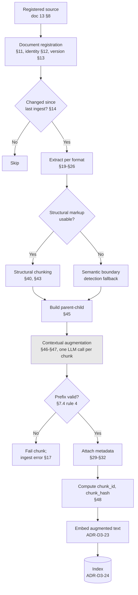

# ADR-D3-21 — Document ingestion and chunking strategy for a low-churn policy corpus

## 1. Summary

Structure-aware chunking (heading and section boundaries), augmented with **LLM-generated
contextual prefixes** per chunk, retrieved via a parent-child scheme. The augmentation step is
normally rejected as too expensive; it is affordable here because the corpus turns over at only
**5–20 documents per year**, so the one-off cost is paid once and then only on the handful of
documents that change.

## 2. Context and Problem Statement

Doc 13 §40 requires semantic rather than blind N-character chunking. §41 states there is no
universal correct chunk size and that values must be determined through evaluation. §42 gives a
baseline of 400 target tokens with 50 overlap, explicitly "not fixed platform requirements". §43
requires different strategies per document type. §44 defines chunk quality. §45 covers
parent-child retrieval, §46 contextual chunking, §47 contextual retrieval, §48 chunk hashing.

The specification is unusually open here — deliberately, since chunking quality is empirical. What
it cannot know, and what changes the answer materially, is the **corpus profile**.

That profile has now been established with the business:

| Property | Value | Source |
|---|---|---|
| Update frequency | **5–20 documents per year** | Business input, 2026-08-21 |
| Corpus size | Low hundreds of documents (FA and county policy, safeguarding guidance, affiliation handbooks, insurance product documentation) | Doc 13 §9 source types; affiliation flow Phase 0 |
| Estimated chunk count | ~4,000–20,000 | Derived: 200–500 documents × 20–40 chunks |
| Annual churn | **2–10% of the corpus** | 5–20 of a few hundred |
| Document character | Long-form, heavily structured, authoritative policy | Doc 13 §10 `CONTROLLED_REFERENCE` and above |

This profile inverts the usual chunking calculus. The standard argument against expensive
preprocessing — contextual augmentation, LLM-assisted boundary detection, multi-representation
indexing — is that it costs an inference per chunk and must be repeated on every ingest. At
high churn that is prohibitive. At **5–20 documents per year** it is a rounding error: augmenting
20,000 chunks once costs a few pounds and a few hours; the annual maintenance cost is 2–10% of
that.

So the real question is not "what is the cheapest adequate chunking?" but "what is the best
chunking we can afford, given that ingest cost is nearly irrelevant and retrieval quality is
not?" Those give different answers, and the specification's baseline (§42's 400/50) is the answer
to the first question.

Three sub-problems follow.

**Policy documents lose meaning when split.** A safeguarding clause reading "this requirement does
not apply to teams in the categories listed in section 4.2" is actively misleading in isolation.
Doc 13 §44 requires a chunk to "retain sufficient context", and for cross-referencing policy text
that is not achievable by overlap alone.

**Retrieval and generation want different chunk sizes.** Small chunks retrieve precisely; large
chunks give the model enough to reason over. Doc 13 §45's parent-child addresses this and needs
a decision on how it composes with the chunking strategy.

**Heterogeneous formats need different treatment.** Doc 13 §43 lists five format families with
different structural signals; doc 13 §19–§26 cover extraction per format including OCR (§20–§21)
and table extraction (§22).

## 3. Decision Drivers

### 3.1 Functional drivers

| ID | Driver | Source |
|---|---|---|
| DR-F-01 | Chunking must be semantic/structural, not blind splitting | doc 13 §40 |
| DR-F-02 | Chunk size must be evaluation-determined, not asserted | doc 13 §41 |
| DR-F-03 | Strategy must vary by document type | doc 13 §43 |
| DR-F-04 | Chunks must retain sufficient context and preserve identifiers | doc 13 §44 |
| DR-F-05 | Parent-child retrieval must be supported | doc 13 §45 |
| DR-F-06 | Chunk hashing must support change detection | doc 13 §14, §48 |
| DR-F-07 | Chunk metadata must carry source, security and business fields | doc 13 §30, §31, §32 |

### 3.2 Non-functional drivers

| ID | Driver | Target | Source |
|---|---|---|---|
| DR-N-01 | Retrieval quality must meet the evaluation threshold | Set at Phase 8 by measurement | doc 13 §41 |
| DR-N-02 | Re-ingest of a changed document must complete quickly | ≤10 minutes per document | Operational |
| DR-N-03 | Full corpus re-ingest must be feasible | ≤8 hours | Enables model changes (ADR-D3-23) |
| DR-N-04 | Ingest cost must be proportionate | ≤£500/year at the §2 churn rate | ADR-D8-01 |

### 3.3 Constraints

| ID | Constraint | Type | Source |
|---|---|---|---|
| DR-C-01 | RAG carries knowledge only, never operational truth | Platform | ADR-D3-20; doc 13 §2 |
| DR-C-02 | Chunk metadata must support ACL filtering before retrieval | Platform | doc 13 §33–§38, §62 |
| DR-C-03 | Embedding dimension is an architecture constraint | Platform | doc 14 §18 |
| DR-C-04 | Corpus turns over at 5–20 documents per year | Organisational | Business input |

### 3.4 Assumptions

| ID | Assumption | If false | Validation |
|---|---|---|---|
| DR-A-01 | Corpus churn remains at 5–20 documents/year (DR-C-04) | Contextual augmentation's economics change; §7.6's fallback applies | Reviewed annually; QM-05 |
| DR-A-02 | Source documents carry usable structural markup (headings, sections) | Structural chunking degrades to semantic boundary detection for those documents | Corpus survey at Phase 8 |
| DR-A-03 | Contextual augmentation materially improves retrieval on this corpus | The augmentation step is cost without benefit and is dropped | A/B evaluation at Phase 8; QM-01 |

## 4. Evaluation Criteria and Weights

| ID | Criterion | Weight | Rationale | Measurement |
|---|---|---|---|---|
| EC-01 | Retrieval quality on policy text | 35 | The purpose; a chunk that retrieves well but misleads is worse than no answer | Recall@k and answer correctness on the golden set |
| EC-02 | Context preservation across boundaries | 25 | Doc 13 §44; cross-referencing policy text is the corpus's defining characteristic | Does a retrieved chunk carry enough to be understood alone? |
| EC-03 | Format coverage | 15 | Doc 13 §43's five families | Formats handled without a separate pipeline |
| EC-04 | Ingest cost and time | 15 | Bounded by DR-N-02 to DR-N-04 — **and deliberately down-weighted given DR-C-04** | Cost per full ingest; time per document |
| EC-05 | Implementation and maintenance complexity | 10 | Real but subordinate | Components to build and operate |
| | **Total** | **100** | | |

Scoring scale: **1** unacceptable · **2** poor · **3** adequate · **4** good · **5** excellent.

**EC-04 is weighted 15 rather than the 30–35 it would carry for a high-churn corpus.** That
reweighting is the decisive consequence of DR-C-04 and is stated explicitly so a future reviewer
can see it was a choice, not an oversight. If churn rises materially, EC-04's weight rises with it
and the recommendation may change — RT-01.

## 5. Alternatives Considered

### 5.1 Option A — Fixed-size token splitting with overlap

**Description.** Split every document into fixed windows of N tokens with a fixed overlap,
ignoring structure. Doc 13 §42's baseline (400/50) applied uniformly.

**Strengths.**
- Trivial to implement and to reason about; one code path for every format.
- Perfectly predictable chunk count and cost.
- No dependency on document structure being present or well-formed.
- Fastest possible ingest; a full corpus re-ingest is minutes.
- Widely used, so the failure modes are well documented.

**Weaknesses.**
- Splits mid-clause and mid-table routinely. A safeguarding requirement split across a boundary
  retrieves as two partial statements, neither correct.
- Directly contradicts doc 13 §40's requirement for semantic chunking.
- Overlap is a crude substitute for context: 50 tokens does not carry "section 4.2 exempts youth
  teams" to a chunk 300 tokens later.
- Fails doc 13 §44's context-retention criterion for cross-referencing text.

**Cost / effort.** Lowest. ~£5 per full corpus ingest; hours to build.

### 5.2 Option B — Recursive character splitting on separator hierarchy

**Description.** Split on a priority-ordered separator list — paragraph, then sentence, then word —
recursing until chunks fit the size target. The common library default.

**Strengths.**
- Respects paragraph and sentence boundaries, so mid-clause splits are rare.
- Still format-agnostic and cheap.
- Well-supported in tooling; low implementation effort.
- Predictable sizing with better boundaries than Option A.

**Weaknesses.**
- Respects *typographic* boundaries, not *semantic* ones. A section heading is just a short
  paragraph; the splitter has no notion that it governs what follows.
- No cross-reference resolution: the same isolated-clause problem as Option A, slightly less often.
- Tables and lists still fragment (doc 13 §22's table extraction requirement unmet).
- Doc 13 §40's "rather than blindly splitting" is only partially satisfied.

**Cost / effort.** Low. ~£5 per full ingest.

### 5.3 Option C — Structure-aware chunking on document hierarchy

**Description.** Parse each format's structural markup — PDF outline and heading styles, Word
heading levels, PowerPoint slides, Excel sheets and tables, HTML DOM — and chunk on section and
subsection boundaries per doc 13 §40's preferred hierarchy, splitting oversized sections at
paragraph boundaries.

**Strengths.**
- Chunks align with the author's own semantic units, which for policy documents is exactly right.
- Directly implements doc 13 §40 and §43.
- Preserves tables and lists intact (doc 13 §22).
- Section path is available as metadata, so a chunk knows where it sits.
- Deterministic and reproducible; no model in the ingest path.

**Weaknesses.**
- Depends on structural markup being present and correct (DR-A-02); scanned PDFs after OCR often
  have none.
- Section sizes vary wildly — a 3,000-token section and a 40-token one both become chunks.
- **Does not solve cross-referencing.** A chunk from section 7 still does not know section 4.2
  exempts youth teams.
- Per-format extractors to build and maintain (doc 13 §19–§26).

**Cost / effort.** Moderate to build; ~£5 per full ingest.

### 5.4 Option D — Semantic boundary detection by embedding similarity

**Description.** Embed sentences, measure similarity between adjacent sentences, and place chunk
boundaries where similarity drops below a threshold — detecting topic shifts empirically rather
than structurally.

**Strengths.**
- Finds genuine topic boundaries even where markup is absent or wrong, addressing DR-A-02.
- Format-agnostic once text is extracted.
- Adapts to documents whose structure does not reflect their semantics.
- No LLM required — embeddings only, which are cheap.

**Weaknesses.**
- Threshold tuning is empirical and corpus-specific, with no principled default.
- Policy documents are often *uniformly* on-topic within a section, so similarity signals are weak
  — the method works better on heterogeneous prose than on structured policy.
- Discards structural information the document actually provides, which for this corpus is the
  strongest available signal.
- Still does not solve cross-referencing.

**Cost / effort.** Moderate; embedding cost per sentence at ingest, ~£20 per full ingest.

### 5.5 Option E — Structure-aware chunking with LLM contextual augmentation and parent-child retrieval

**Description.** Option C's structural chunking, plus two additions. **Contextual augmentation**
(doc 13 §46–§47): for each chunk, an LLM call generates a short prefix situating it in its
document — what the document is, which section this is, what it depends on — which is prepended
before embedding. **Parent-child** (doc 13 §45): the small chunk is indexed and retrieved; its
parent section is what reaches the prompt.

**Strengths.**
- Solves cross-referencing directly: the augmented prefix carries "this section of the 2026
  Safeguarding Policy sets DBS requirements for youth teams; exemptions are in section 4.2".
- Retrieval precision from small chunks; generation context from parent sections (doc 13 §45).
- Retains Option C's structural alignment and its metadata.
- Published evidence puts contextual retrieval's improvement in the tens of percent on
  retrieval-failure reduction, which at EC-01's weight dominates.
- **Cost is a one-off**: at 5–20 documents/year (DR-C-04), annual augmentation cost is 2–10% of
  the initial run.

**Weaknesses.**
- An LLM call per chunk at ingest — the reason this is normally rejected.
- Augmentation quality depends on the model and prompt; a bad prefix actively harms retrieval.
- Adds a model dependency to the ingest pipeline, which must be versioned (ADR-D3-11) and whose
  output must be validated.
- Full corpus re-ingest is hours rather than minutes.

**Cost / effort.** Highest ingest cost: ~£40–£200 for a full corpus augmentation run, ~£5–£20/year
thereafter. Moderate to build.

### 5.6 Option F — Agentic chunking: LLM decides boundaries

**Description.** An LLM reads each document and proposes chunk boundaries and groupings directly.

**Strengths.**
- Potentially the best boundaries, using genuine comprehension.
- Handles unstructured and badly structured documents equally.
- Can produce chunk-level summaries as a by-product.

**Weaknesses.**
- Non-deterministic: the same document chunks differently across runs, so re-ingest changes chunk
  identity and breaks doc 13 §48's chunk hashing and change detection.
- Substantially more expensive than Option E — the model processes full documents, not per-chunk
  prefixes.
- No clear quality advantage over structural chunking for documents that *are* well structured,
  which this corpus largely is.
- Long documents exceed context windows, requiring their own chunking to be chunked.

**Cost / effort.** Highest overall; poor determinism.

### 5.7 Options considered and eliminated before scoring

| Option | Eliminated by |
|---|---|
| No chunking — index whole documents | DR-C-03 and context budget: a 40-page policy cannot enter a prompt; retrieval precision would be nil |
| Sentence-level chunking | Fragments policy clauses below the level at which they carry meaning; fails doc 13 §44 |
| Late chunking (embed full document, pool per span) | Requires an embedding model with a context window exceeding this corpus's document lengths; revisit if DR-C-03's model changes (RT-05) |

## 6. Evaluation Method and Decision Matrix

**Method.** Weighted scoring against §4. EC-01 and EC-02 assessed against a representative
retrieval task drawn from the corpus: *"Do under-14 team coaches need a DBS check?"* — a question
whose correct answer depends on a requirement in one section and an exemption in another.

| Criterion | Weight | A: Fixed | B: Recursive | C: Structural | D: Semantic | E: Structural+context+parent | F: Agentic |
|---|---|---|---|---|---|---|---|
| EC-01 Retrieval quality | 35 | 1 | 2 | 4 | 3 | **5** | 4 |
| EC-02 Context preservation | 25 | 1 | 2 | 3 | 3 | **5** | 4 |
| EC-03 Format coverage | 15 | 5 | 5 | 4 | 4 | 4 | 4 |
| EC-04 Ingest cost and time | 15 | 5 | 5 | 4 | 4 | **2** | 1 |
| EC-05 Complexity | 10 | 5 | 5 | 3 | 3 | **2** | 2 |
| **Weighted total** | **100** | **235** | **290** | **365** | **330** | **420** | **355** |

Working for the two leaders:

- **Option E:** (35×5) + (25×5) + (15×4) + (15×2) + (10×2) = 175 + 125 + 60 + 30 + 20 = **420**
- **Option C:** (35×4) + (25×3) + (15×4) + (15×4) + (10×3) = 140 + 75 + 60 + 60 + 30 = **365**

### 6.1 Sensitivity — and the churn dependency

E leads C by 55 points. E wins EC-01 and EC-02 (60 points of weight between them) and loses EC-04
and EC-05 (25 points).

The result depends directly on DR-C-04. Re-scoring with EC-04 weighted as it would be for a
**high-churn corpus** (35, with EC-01 reduced to 25 and EC-02 to 15 to keep the total at 100):

| Criterion | Weight (high-churn) | C: Structural | E: Structural+context+parent |
|---|---|---|---|
| EC-01 Retrieval quality | 25 | 4 | 5 |
| EC-02 Context preservation | 15 | 3 | 5 |
| EC-03 Format coverage | 15 | 4 | 4 |
| EC-04 Ingest cost and time | 35 | 4 | 2 |
| EC-05 Complexity | 10 | 3 | 2 |
| **Weighted total** | **100** | **375** | **355** |

**Under high churn, C wins.** The recommendation inverts. That is why DR-C-04 is recorded as a
constraint rather than background, why RT-01 watches it, and why §7.6 specifies the fallback.

## 7. Decision

### 7.1 Structure-aware chunking with contextual augmentation and parent-child retrieval

Option E. Three composed mechanisms:

| Mechanism | Doc 13 | What it does |
|---|---|---|
| **Structural chunking** | §40, §43 | Chunk on the document's own section and subsection boundaries |
| **Contextual augmentation** | §46–§47 | Prepend an LLM-generated context prefix to each chunk before embedding |
| **Parent-child retrieval** | §45 | Index and match on the child chunk; supply the parent section to the prompt |

### 7.2 Per-format extraction and structural signal

Per doc 13 §43 and §19–§26:

| Format | Structural signal | Doc 13 | Fallback when absent |
|---|---|---|---|
| PDF (digital) | Outline bookmarks, heading font hierarchy | §24 | Semantic boundary detection (Option D) |
| PDF (scanned) | OCR text, then layout analysis | §20, §21 | Semantic boundary detection; confidence recorded per §21 |
| Word | Heading levels | §25 | Paragraph grouping |
| Excel | Sheet, table, header row | §23 | Row grouping; tables kept intact per §22 |
| PowerPoint | Slide, title, notes | §26 | Slide as the unit |
| HTML | DOM heading hierarchy | §43 | Semantic boundary detection |

Option D is retained as the **fallback within** Option E rather than as a rejected alternative —
DR-A-02's risk is handled by degrading to semantic detection for documents lacking usable markup,
not by abandoning structure for those that have it.

### 7.3 Chunk sizing is set by evaluation, not by this ADR

Per doc 13 §41 and DR-F-02, no chunk size is fixed here. Doc 13 §42's 400/50 is the **starting
point for evaluation**, not the decision. Phase 8 evaluates:

| Parameter | Range to evaluate | Fixed by |
|---|---|---|
| Child chunk target tokens | 200–600 | Evaluation at Phase 8 |
| Child overlap tokens | 0–100 | Evaluation |
| Parent section max tokens | 1,500–4,000 | Evaluation, bounded by context budget (ADR-D3-25) |
| Contextual prefix max tokens | 50–150 | Evaluation |

Values are recorded in versioned configuration (ADR-D5-06), and changing them is a re-ingest —
which DR-C-04 makes affordable.

### 7.4 The contextual prefix

Generated once per chunk at ingest, from the chunk plus its document and section context:

```
Document: FA Safeguarding Policy 2026-27, section 7.1 "DBS requirements for youth teams".
This section states the clearance requirement; exemptions and the "CRC in progress"
override are in section 4.2. Applies to teams in age groups U5-U18.
---
<original chunk text>
```

Four rules:

1. **The prefix is generated from the document only.** No external knowledge, no inference beyond
   what the document states. A prefix asserting something the document does not say would inject a
   fabricated fact into the index.
2. **The prefix is embedded but flagged in metadata.** Retrieval matches on the augmented text;
   citation (ADR-D3-22) quotes the **original** chunk, never the generated prefix.
3. **Prefix generation is a versioned prompt** (ADR-D3-11), so a prefix change is a deliberate
   re-ingest rather than drift.
4. **Generated prefixes are validated** — length bounds, no URLs, no content absent from the source
   document — before indexing. An invalid prefix fails ingest for that chunk rather than being
   indexed.

Rule 2 matters for ADR-D3-20's knowledge/truth boundary: a citation must show what the source
actually says.

### 7.5 Chunk identity and change detection

Per doc 13 §14 and §48:

```
chunk_id   = hash(document_id, document_version, section_path, ordinal)
chunk_hash = sha256(original_chunk_text)
```

Chunk identity derives from the document's structure, not from the chunker's output ordering — so
re-ingesting an unchanged section produces the same `chunk_id`, and only genuinely changed chunks
are re-embedded and re-augmented. At DR-C-04's churn rate, an annual update touches a small
fraction of chunks even within the changed documents.

This is what makes Option F's non-determinism disqualifying: agentic chunking would produce
different boundaries per run, so every re-ingest would invalidate every chunk.

### 7.6 If churn rises

§6.1 shows the recommendation inverts under high churn. If DR-A-01 fails — churn rises materially
above 20 documents/year — the response is **not** to keep augmenting at higher cost. It is:

1. Re-run §6's matrix with EC-04 reweighted to the actual churn profile.
2. If C wins, drop contextual augmentation and retain structural chunking with parent-child.
3. Retrieval quality is re-measured; the loss is quantified rather than assumed.

The parent-child and structural mechanisms are unaffected by churn, so this fallback is a
subtraction rather than a redesign.

**Status rationale.** Accepted. Tier 3 under ADR-D0-03 §7.1 — a design decision within the RAG
capability. Chunk parameters remain open pending Phase 8 evaluation, per §7.3, which is
measurement rather than an unresolved decision.

## 8. Architecture Detail

### 8.1 Ingest pipeline



The shaded box is the step DR-C-04 makes affordable.

### 8.2 The cross-reference problem, worked

Query: *"Do under-14 team coaches need a DBS check?"* The answer requires section 7.1's
requirement and section 4.2's exemptions.

| Option | Retrieved for the requirement | Does the user get a correct answer? |
|---|---|---|
| A / B | A fragment of 7.1, possibly mid-clause | **No** — states the requirement without the exemption |
| C | Section 7.1 intact | **Partially** — correct requirement, exemption not retrieved because 4.2 does not match the query terms |
| **E** | Child chunk of 7.1, whose prefix names section 4.2 as holding exemptions; parent section 7.1 supplied | **Yes** — and the prefix's mention of 4.2 raises its retrieval likelihood on a follow-up |

This is EC-02's 25 points in one example, and it is the failure mode that matters most for a
safeguarding corpus: a confidently stated requirement without its exemption is wrong in a way that
affects real decisions about who may work with children.

### 8.3 Cost, quantified

| Item | Initial full ingest | Annual (5–20 docs) |
|---|---|---|
| Chunks processed | ~4,000–20,000 | ~100–1,200 |
| Augmentation LLM calls | one per chunk | one per changed chunk |
| Estimated augmentation cost | £40–£200 | £5–£20 |
| Embedding cost | £5–£25 | <£5 |
| Wall-clock | 2–8 hours | ≤1 hour |

Against DR-N-04's £500/year budget, annual cost is under 5% of it. Against a corpus turning over
monthly, the same figures would be £60–£240/year in augmentation alone plus continuous pipeline
load — still affordable, but the quality-per-pound argument weakens as §6.1 shows.

## 9. Consequences

### 9.1 Positive

- Chunks carry their own context, so cross-referencing policy text retrieves usefully — the
  corpus's defining difficulty.
- Retrieval precision from small chunks combined with generation context from parent sections.
- Structural alignment preserves tables, lists and section metadata.
- Deterministic chunk identity means re-ingest touches only what changed.
- Ingest cost is trivial at the established churn rate.

### 9.2 Negative

- An LLM in the ingest pipeline, with a versioned prompt and validation to maintain.
- Full re-ingest is hours rather than minutes, which slows the iteration loop when tuning §7.3's
  parameters.
- Augmentation quality is a new failure mode: a bad prefix harms retrieval and is not obvious.
- Per-format extractors are real work (doc 13 §19–§26), including OCR for scanned PDFs.
- The recommendation is churn-dependent and must be revisited if the corpus profile changes.

### 9.3 Neutral

- Doc 13 §42's 400/50 baseline is a starting point for evaluation, as §42 itself says.
- Semantic boundary detection is retained as an internal fallback rather than rejected.

### 9.4 Trade-offs explicitly accepted

| Given up | In exchange for | Accepted by |
|---|---|---|
| Cheap, fast ingest | Retrieval that handles cross-referencing policy text | AI Solution Architect |
| A model-free ingest pipeline | Chunks that carry their own context | RAG/Data Owner |
| A churn-independent recommendation | The best quality the established churn rate affords | AI Solution Architect |

## 10. Golden-Rule and Precedence Conformance

| Constraint | Conformance |
|---|---|
| Enterprise decides; AI orchestrates | Chunking organises knowledge documents. It touches no operational truth, and ADR-D3-20 keeps RAG out of business answers regardless of chunk quality. |
| Authoritative-truth precedence | RAG content is authority 2 and `truth_class: knowledge` (ADR-D1-03 §7.2). Better chunking improves knowledge answers; it never promotes RAG toward operational truth. |
| Four-state separation | Not applicable — the index is neither conversation, session, workflow nor enterprise state. |
| Versioned artefacts, never mutated in place | Chunking configuration, the augmentation prompt and the embedding model are all versioned; a change is a re-ingest producing a new index version (ADR-D3-24). |
| Adam persona governs how, never what | Retrieved content is data; the persona expresses it. §7.4 rule 2 keeps citations quoting the source rather than generated text. |

## 11. Risks and Mitigations

| ID | Risk | Likelihood | Impact | Exposure | Mitigation | Owner | Residual |
|---|---|---|---|---|---|---|---|
| RSK-01 | A generated prefix asserts something the document does not say | Medium | High | High | §7.4 rules 1 and 4: document-only generation plus validation against source content; QM-03 | RAG/Data Owner | Medium |
| RSK-02 | Churn rises and the economics invert (DR-A-01) | Low | Medium | Low | §7.6's subtraction fallback; RT-01 watches QM-05 | AI Solution Architect | Low |
| RSK-03 | Augmentation shows no measurable benefit (DR-A-03) | Medium | Medium | Medium | A/B evaluation at Phase 8 before committing; if no benefit, drop to Option C | AI Evaluation Owner | Low |
| RSK-04 | Documents lack usable structure (DR-A-02) | Medium | Medium | Medium | §7.2's per-format fallback to semantic detection; corpus survey at Phase 8 | RAG/Data Owner | Low |
| RSK-05 | A citation quotes generated rather than source text | Low | High | Medium | §7.4 rule 2; ADR-D3-22's citation test; QM-04 | AI Engineering Lead | Low |
| RSK-06 | OCR errors propagate into chunks and prefixes | Medium | Medium | Medium | Doc 13 §21's OCR confidence recorded; low-confidence documents flagged for review before indexing | RAG/Data Owner | Medium |

## 12. Quantitative Targets and Measures

| ID | Measure | Target | Threshold (alert) | Source | Review cadence |
|---|---|---|---|---|---|
| QM-01 | Retrieval recall@5 on the golden set, augmented vs. unaugmented | Augmented ≥10pp better | <5pp better | Phase 8 A/B evaluation | Per release |
| QM-02 | Chunks failing the §7.4 rule 4 validation at ingest | ≤2% | >10% | Ingest logs | Per ingest |
| QM-03 | Prefixes asserting content absent from the source document | 0 | ≥1 | Sampled manual review, 100 chunks per ingest | Per ingest |
| QM-04 | Citations quoting generated prefix text | 0 | ≥1 | ADR-D3-22 citation audit | Weekly |
| QM-05 | Documents ingested or re-ingested per year | 5–20 | >40 | Ingest records | Quarterly |
| QM-06 | Full corpus re-ingest wall-clock | ≤8 hours | >16 hours | Ingest timing | Per full re-ingest |
| QM-07 | Annual ingest cost | ≤£500 | >£1,000 | Cost telemetry (ADR-D8-01) | Quarterly |

QM-05 is the churn watch that RT-01 acts on — it is the measure that determines whether this ADR's
recommendation still holds.

## 13. Security, Privacy and Compliance Impact

| Dimension | Impact |
|---|---|
| Attack surface change | Documents entering the index are untrusted content (ADR-D3-09 T3). File security applies at ingest (doc 13 §18). Contextual augmentation adds an LLM call over document content, so a document containing injected instructions could influence its own prefix — §7.4 rule 4's validation is the mitigation. |
| Data classification touched | Policy and guidance documents, classified per doc 13 §39. Security metadata attaches per §32. |
| Personal data / PII | Policy documents should not contain personal data. Where a source does (a named contact in a handbook), doc 13 §32's security metadata and ACL filtering apply, and the RAG/Data Owner assesses at source registration (doc 13 §8). |
| Children's data and safeguarding | The corpus includes safeguarding policy — guidance *about* children's protection rather than data about children. §8.2's worked example is why chunking quality is a safeguarding concern here: a DBS requirement retrieved without its exemption produces a confidently wrong answer about who may work with under-18s. This is the single strongest argument for Option E. |
| UK GDPR lawful basis and rights impact | Minimal; the corpus is published guidance. Where personal data appears, source-level classification governs. |
| Audit and evidential requirements | Chunk identity, document version and augmentation prompt version are recorded, so any retrieved chunk is traceable to a document version and a processing configuration. |
| Standards touched | ISO/IEC 27001 A.5.12 (classification of information), A.8.12; ISO/IEC 42001 (data quality for AI); NIST AI RMF MAP 2.3, MEASURE 2.8. |

## 14. Implementation Impact

| Aspect | Detail |
|---|---|
| Build phases | 8 (RAG + embedding/vector) |
| Repository paths | `src/pf_ft_ai/rag/ingestion/`, `src/pf_ft_ai/rag/chunking/` |
| Configuration | Chunking parameters, augmentation prompt reference and per-format strategy in `config/base/` |
| Contracts / schemas | Chunk model with metadata per doc 13 §29–§32; parent-child linkage |
| Migration | None; first ingest |
| Dependencies on other ADRs | ADR-D3-20 (RAG scope), ADR-D3-23 (embedding), ADR-D3-24 (vector store), ADR-D3-11 (prompt versioning) |
| Effort estimate | Large — per-format extraction is the bulk |

## 15. Validation and Verification

| ID | Acceptance criterion | Verification method |
|---|---|---|
| AC-01 | Chunks align with document section boundaries where markup exists | Structural inspection against source documents |
| AC-02 | Documents without usable markup fall back to semantic detection | Fallback test with a scanned PDF |
| AC-03 | A generated prefix contains nothing absent from its source document | Sampled review; QM-03 |
| AC-04 | Citations quote original chunk text, never the generated prefix | ADR-D3-22 test; QM-04 |
| AC-05 | Re-ingesting an unchanged document produces identical `chunk_id` values | Idempotent ingest test |
| AC-06 | Augmented retrieval outperforms unaugmented on the golden set | A/B evaluation; QM-01 |
| AC-07 | §8.2's cross-reference query returns both requirement and exemption context | Golden case |
| AC-08 | Tables survive chunking intact | Excel and PDF table test |

AC-06 is the gate on DR-A-03: if augmentation does not measurably help, Option C is adopted
instead and this ADR is amended.

## 16. Operational Impact

| Aspect | Detail |
|---|---|
| Monitoring | Ingest success rate, chunks per document, prefix validation failures, ingest duration and cost |
| Alerting | QM-02 and QM-03 breaches; ingest failures |
| Runbook | `docs/runbooks/rag.md` — ingest failure and re-ingest procedure |
| Failure mode and degradation | A chunk failing prefix validation is not indexed and is reported (doc 13 §17's ingestion failure state). The document's other chunks index normally, so a partial failure degrades coverage rather than blocking ingest. |
| Rollback | Index versions are immutable (ADR-D3-24); rollback repoints at the prior index version |
| Support model impact | Retrieval quality complaints route to the RAG/Data Owner with chunk and document version |

## 17. Cost Impact

| Cost element | One-off | Recurring | Basis |
|---|---|---|---|
| Ingestion and chunking pipeline | Phase 8, large | — | Per-format extractors dominate |
| Initial full corpus augmentation | £40–£200 | — | §8.3 |
| Annual re-ingest | — | £5–£20 | §8.3 at DR-C-04's churn |
| Parameter-tuning re-ingests during Phase 8 | £200–£600 | — | Several full runs while evaluating §7.3 |
| Avoided cost | — | — | Option A would cost ~£5/run and produce the §8.2 failure |

## 18. Revisit Triggers and Causal Analysis Hooks

| ID | Trigger | Detected by | Action on trigger |
|---|---|---|---|
| RT-01 | QM-05 exceeds 40 documents/year (DR-A-01 false) | Quarterly | Re-run §6's matrix with EC-04 reweighted; apply §7.6's fallback if C wins |
| RT-02 | QM-01 shows augmentation benefit below 5pp (DR-A-03 false) | Per release | Drop augmentation; adopt Option C; record the quality delta |
| RT-03 | QM-03 finds a prefix asserting absent content | Per ingest | Strengthen §7.4 rule 4 validation; review the augmentation prompt |
| RT-04 | Corpus grows an order of magnitude | Quarterly | Re-evaluate; §8.3's costs scale linearly and EC-04 may bind |
| RT-05 | An embedding model with a very large context window is adopted | ADR-D3-23 change | Reconsider late chunking, eliminated in §5.7 on context-window grounds |
| RT-06 | Doc 13 §40–§48 amended | Change notice | Re-derive the strategy against the revised requirements |

**Scheduled review:** 2027-08-21, or on RT-01.

## 19. Traceability

| Dimension | Reference |
|---|---|
| Workshop sheet | WS-17 RAG Architecture — Knowledge & FAQ Only |
| Specification sections | doc 13 §8 (Source Registry), §9 (Supported Source Types), §10 (Source Authority), §11–§14 (Registration, Identity, Version, Change Detection), §15 (Ingestion Pipeline), §17 (Ingestion Failure), §18 (File Security), §19–§26 (Extraction, OCR, OCR Confidence, Table, Excel, PDF, Word, PowerPoint), §27 (Content Normalization), §28–§32 (Metadata Architecture, Required, Chunk, Business, Security), §39 (Document Classification), §40 (Chunking Strategy), §41 (Chunk Size), §42 (Chunk Overlap), §43 (Chunking by Document Type), §44 (Chunk Quality), §45 (Parent-Child Retrieval), §46 (Contextual Chunking), §47 (Contextual Retrieval), §48 (Chunk Hash); doc 14 §20–§21 (Chunk-to-Vector Mapping, Chunk Identity), §23–§24 (Chunk Content Storage, Recommended Separation) |
| Requirement IDs | `FR-A39-08`, `NFR-A38-PERF`, `NFR-A38-COST` |
| Build phases | 8 |
| Code paths | `src/pf_ft_ai/rag/ingestion/`, `src/pf_ft_ai/rag/chunking/` |
| Configuration | Chunking parameters; augmentation prompt reference |
| Tests | AC-01 to AC-08 |
| Upstream ADRs | ADR-D3-20 |
| Downstream ADRs | ADR-D3-22, ADR-D3-23, ADR-D3-24, ADR-D6-12 |

## 20. Change Log

| Version | Date | Author | Change |
|---|---|---|---|
| 1.0.0 | 2026-08-21 | AI Solution Architect | Initial decision recorded. Six options scored. Structure-aware chunking with LLM contextual augmentation and parent-child retrieval selected, on the basis that the established corpus churn of 5–20 documents/year makes normally-prohibitive augmentation cost negligible. §6.1 records that the recommendation inverts to plain structural chunking under high churn, with EC-04's weighting as the pivot. |
