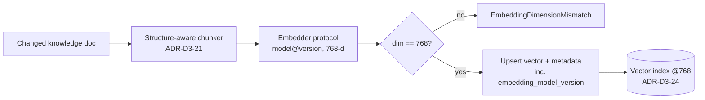

# ADR-D3-23 — Embedding model selection, versioning and re-embedding strategy

## 1. Summary

PFF AI will select its embedding model through a PF-FT-specific retrieval
evaluation rather than benchmark reputation, and will treat the chosen model as a
versioned artefact bound to a specific vector index. For the initial build we
**recommend a Hugging Face-hosted general-purpose 768-dimension English model
(`bge-base-en-v1.5` class)**, accessed through the provider-neutral embedding
abstraction of [ADR-D3-14](ADR-D3-14-slm-provider-abstraction.md), with a
documented migration path to a self-hosted equivalent. Because the knowledge
corpus changes only 5–20 documents per year, re-embedding cost is negligible and
the decision is dominated by retrieval quality, dimension economy and the ability
to change models later without corrupting the index. This ADR is `Proposed`
pending the retrieval-evaluation run that doc 14 §13 mandates.

## 2. Context and Problem Statement

Doc 14 §12 lists fifteen embedding-selection criteria and §13 states plainly that
"PF-FT-specific retrieval evaluation must determine the winner" — no model may be
chosen because its dimension is high, its public benchmark score is high, or it is
popular. Yet the platform cannot build the RAG ingestion pipeline
([ADR-D3-21](ADR-D3-21-document-ingestion-and-chunking-strategy.md)) or the vector
index ([ADR-D3-24](ADR-D3-24-vector-store-selection.md)) until an embedding model —
and therefore a **dimension** — is fixed, because doc 14 §18 makes dimension an
architecture constraint the index is created around.

What is blocked until this is decided:

- the vector index cannot be created (dimension unknown);
- the ingestion worker cannot emit vectors (no model contract);
- retrieval evaluation ([ADR-D3-22](ADR-D3-22-retrieval-reranking-and-citation.md))
  has nothing to score;
- cost modelling for the RAG subsystem is unquantified.

What goes wrong if left implicit: an engineer picks a model ad hoc (typically the
largest or most fashionable), the index is built at that dimension, and changing
it later forces a full index rebuild (doc 14 §80–§81). Choosing deliberately, and
recording that dimension migration is a rebuild not an edit, is the whole point of
this ADR.

The mitigating fact — established for the whole RAG cluster in ADR-D3-21 — is that
the corpus is small and static: **~4,000–20,000 chunks, 5–20 document updates per
year, 2–10% annual churn.** This removes throughput and re-embedding cost from the
list of things that could dominate the decision, and shifts weight decisively onto
retrieval quality and future changeability.

## 3. Decision Drivers

### 3.1 Functional drivers

| ID | Driver | Source |
|---|---|---|
| DR-F-01 | Model must serve both document-embedding and query-embedding with matched semantics | doc 14 §7 |
| DR-F-02 | Must retrieve accurately over FA/PFF domain knowledge (affiliation, insurance, discipline, safeguarding) | doc 14 §105 |
| DR-F-03 | Must be reachable through the provider-neutral embedding abstraction, not called directly | doc 14 §9; ADR-D3-14 |
| DR-F-04 | Must handle exact-identifier tokens (club IDs, WGS IDs) acceptably or defer them to hybrid/lexical search | doc 14 §103; ADR-D3-22 |

### 3.2 Non-functional drivers

| ID | Driver | Target | Source |
|---|---|---|---|
| DR-N-01 | Retrieval quality on PF-FT eval set | Recall@5 ≥ 0.90 on the golden set | doc 14 §100, §107 |
| DR-N-02 | Query-embedding latency | p95 ≤ 80 ms (single query) | doc 14 §88 (retrieval budget) |
| DR-N-03 | Dimension economy (storage + search cost) | ≤ 1024; prefer 768 | doc 14 §17, §91 |
| DR-N-04 | Data-boundary safety for what text leaves the tenancy | Only non-personal knowledge text embedded externally | doc 14 §121; ADR-D6-07 |
| DR-N-05 | Cost | Initial embed + annual re-embed within RAG budget | doc 14 §95, §96 |

### 3.3 Constraints

| ID | Constraint | Type | Source |
|---|---|---|---|
| DR-C-01 | Selection must be evaluation-driven, not reputation-driven | Organisational | doc 14 §13 |
| DR-C-02 | Dimension fixes the index; changing it requires a new index | Platform | doc 14 §18, §81 |
| DR-C-03 | Document and query embeddings must use the same model+version | Platform | doc 14 §7, §46 |
| DR-C-04 | Model is a versioned artefact with status lifecycle | Organisational | doc 14 §15, §16; ADR-D3-15 |
| DR-C-05 | RAG embeds knowledge/FAQ content only — never enterprise business truth | Regulatory/Arch | doc 13 §5; ADR-D3-20 |

### 3.4 Assumptions

| ID | Assumption | If false | Validation |
|---|---|---|---|
| DR-A-01 | Corpus is English-dominant | Multilingual model needed; re-score with DR under §6.1 | Corpus language audit at ingestion |
| DR-A-02 | 5–20 docs/year churn holds | Re-embedding cost rises; still low at this scale | Annual review (`review_due`) |
| DR-A-03 | A 768-dim general model clears Recall@5 ≥ 0.90 on the eval set | Escalate to a high-quality 1024-dim model | Retrieval eval gate, doc 14 §153 |

## 4. Evaluation Criteria and Weights

Criteria fixed before scoring, per CMMI DAR SP 1.1 and doc 14 §12.

| ID | Criterion | Weight | Rationale | Measurement |
|---|---|---|---|---|
| EC-01 | Retrieval quality on PF-FT eval set | 30 | doc 14 §13 makes this the deciding factor | Recall@5 / MRR on golden set |
| EC-02 | Domain & identifier robustness | 15 | FA domain terms + exact IDs must retrieve | Domain + exact-ID eval slices (§103, §105) |
| EC-03 | Dimension / storage economy | 10 | Sets index cost for the life of the corpus | Dimension; storage per §91 |
| EC-04 | Data-boundary & privacy safety | 15 | External embedding is a data egress; safeguarding context | Egress review vs ADR-D6-07 |
| EC-05 | Operability & self-host path | 12 | Must be movable to internal serving later | Deploy model; HF→self-host parity |
| EC-06 | Latency | 8 | Query embedding sits in the retrieval budget | p95 query-embed ms |
| EC-07 | Cost (initial + annual) | 5 | Small static corpus makes this minor | £ initial + £/yr |
| EC-08 | Licence & portability | 5 | Avoid lock-in; permit self-hosting | Licence class; export terms |
| | **Total** | **100** | | |

EC-01 carries 30 because doc 14 §13 explicitly subordinates every other signal to
PF-FT retrieval quality; the weight is the spec's instruction, not a thumb on the
scale. EC-07 is deliberately low (5): §6.1 shows the decision does not move even if
cost is trebled, which is the direct consequence of the small static corpus.

Scoring scale: **1** unacceptable · **2** poor · **3** adequate · **4** good · **5** excellent.

## 5. Alternatives Considered

Per doc 14 §14, the option space spans general-purpose, high-quality,
small/low-cost, multilingual, domain-specific, API-hosted and self-hosted models.
Five concrete, viable candidates are scored.

### 5.1 Option A — HF-hosted general-purpose 768-dim (`bge-base-en-v1.5` class)

**Description.** A widely-validated open general-purpose English embedding model at
768 dimensions, served initially via the Hugging Face Inference API through the
embedding abstraction, later self-hostable on the same weights.

**Strengths.**
- Strong retrieval quality per public MTEB, to be confirmed on the PF-FT set.
- 768 dims → economical index and search.
- Open licence; identical weights self-hostable, so HF→internal cutover is a
  provider swap, not a model change (no re-embed if version is pinned).
- Matches the "HF API first, self-host later" posture of ADR-D3-13.

**Weaknesses.**
- English-centric; weak on non-English content if the corpus grows multilingual.
- Mediocre on exact identifiers — mitigated by hybrid search (ADR-D3-22).

**Cost / effort.** Initial embed of ~20k chunks: a few £; annual re-embed of
churn: pennies. Low effort — reference integration exists.

### 5.2 Option B — HF-hosted high-quality 1024-dim (`bge-large` / `e5-large` class)

**Description.** A larger open model at 1024 dimensions for maximum retrieval
quality.

**Strengths.**
- Highest expected retrieval quality of the open options.
- Still self-hostable; open licence.

**Weaknesses.**
- 1024 dims → ~33% more storage and search cost than 768 for a quality gain that
  may be marginal on a small, well-structured corpus.
- Higher embedding latency; larger self-host GPU footprint later.

**Cost / effort.** Modestly higher than A on every axis; still small in absolute
terms at this corpus size.

### 5.3 Option C — Commercial API embedding (e.g. OpenAI/Cohere-class, 1536-dim)

**Description.** A managed commercial embedding endpoint.

**Strengths.**
- Strong out-of-the-box quality; zero model-hosting operations.

**Weaknesses.**
- **Not self-hostable** — violates the self-host target of ADR-D3-13 and creates
  lock-in (DR-C via EC-08).
- Every embedded chunk and every user query leaves the tenancy to a third party —
  a data-boundary concern (EC-04) even for knowledge text, and a hard stop for any
  query that might carry personal/safeguarding context.
- 1536 dims inflate index cost with no proportionate corpus benefit.

**Cost / effort.** Low ops effort, ongoing per-call cost, and a portability debt.

### 5.4 Option D — Small/low-cost model (`bge-small` / `MiniLM` class, 384-dim)

**Description.** A compact 384-dimension model optimised for speed and cost.

**Strengths.**
- Cheapest storage and fastest query embedding; trivially self-hostable on CPU.

**Weaknesses.**
- Lower retrieval quality — the one axis doc 14 §13 says must win.
- 384 dims risk under-separating near-duplicate FA policy passages.

**Cost / effort.** Lowest, but buys a saving the corpus size makes irrelevant while
risking the criterion that matters most.

### 5.5 Option E — Domain-fine-tuned embedding (fine-tune a base model on FA/PFF text)

**Description.** Take an open base model and fine-tune on FA/PFF domain pairs for
best-possible domain retrieval.

**Strengths.**
- Potentially highest domain (EC-02) performance.

**Weaknesses.**
- Requires a labelled domain training set that does not yet exist.
- Fine-tuned weights become a bespoke versioned artefact needing its own
  eval/regression pipeline — heavy for a 20k-chunk corpus.
- Premature: doc 14 §13 wants evaluation first; fine-tuning is a later optimisation
  if an off-the-shelf model fails the gate.

**Cost / effort.** High one-off (data + training + eval harness); ongoing model
ownership cost. Disproportionate at this stage.

### 5.6 Options considered and eliminated before scoring

| Option | Eliminated by |
|---|---|
| Multilingual-first model (e.g. `multilingual-e5`) | DR-A-01 — corpus is English-dominant; revisit if the language audit says otherwise |
| Instruction-tuned LLM used as an embedder | DR-N-02, DR-N-03 — latency and dimension far exceed budget for no retrieval gain |
| Bag-of-words / TF-IDF only (no dense embedding) | DR-F-02 — cannot capture paraphrase; lexical role is covered by hybrid search, not as the primary index |

## 6. Evaluation Method and Decision Matrix

**Method.** Weighted scoring against §4, informed by doc 14 §12–§13 criteria, the
corpus profile from ADR-D3-21, and public retrieval benchmarks used only as a prior
to be confirmed by the mandated PF-FT retrieval evaluation (doc 14 §153). Scores
below are the pre-evaluation expectation; the `Proposed` status is discharged when
the eval run confirms or revises Option A's EC-01/EC-02 rows.

| Criterion | Weight | A: HF 768 | B: HF 1024 | C: Commercial API | D: Small 384 | E: Domain fine-tune |
|---|---|---|---|---|---|---|
| EC-01 Retrieval quality | 30 | 4 | 5 | 5 | 3 | 5 |
| EC-02 Domain & ID robustness | 15 | 4 | 4 | 4 | 3 | 5 |
| EC-03 Dimension economy | 10 | 5 | 4 | 2 | 5 | 4 |
| EC-04 Data-boundary safety | 15 | 5 | 5 | 1 | 5 | 5 |
| EC-05 Operability & self-host path | 12 | 5 | 4 | 1 | 5 | 3 |
| EC-06 Latency | 8 | 4 | 3 | 4 | 5 | 4 |
| EC-07 Cost | 5 | 5 | 4 | 3 | 5 | 2 |
| EC-08 Licence & portability | 5 | 5 | 5 | 1 | 5 | 4 |
| **Weighted total** | **100** | **453** | **443** | **295** | **398** | **436** |

Weighted totals (×20 scale): **A = 453**, **B = 443**, **E = 436**, **D = 398**,
**C = 295**.

**Sensitivity.** A leads B by 10 points. If EC-01 were the only thing that
mattered, B or E would edge ahead — but A trails them on EC-01 by one point while
leading decisively on EC-03/EC-05/EC-07/EC-08, all of which the small static corpus
makes safe to weight. The result flips to B only if the retrieval evaluation shows
A **failing** the Recall@5 ≥ 0.90 gate (DR-A-03); that is exactly the contingency
the `Proposed` status protects. E overtakes only if a domain training set
materialises and A/B both miss the gate — a later CAR trigger (RT-02), not a
today decision.

## 7. Decision

**PFF AI will adopt a Hugging Face-hosted general-purpose 768-dimension English
embedding model (`bge-base-en-v1.5` class) as the initial embedding model**, served
through the provider-neutral embedding abstraction (ADR-D3-14), with the vector
index created at dimension 768 (ADR-D3-24). The identical open weights are the
target for self-hosted serving, so the eventual HF→internal move is a provider swap
with the model version pinned — no re-embedding required. Exact-identifier retrieval
is delegated to hybrid search (ADR-D3-22) rather than solved in the dense model.

Option B (1024-dim) is the designated fallback if the retrieval evaluation shows
Option A missing Recall@5 ≥ 0.90; Option E (domain fine-tune) is a future
optimisation gated on both a labelled dataset and an off-the-shelf failure. Option
C is rejected on data-boundary and portability grounds despite strong quality;
Option D is rejected because it trades away the one criterion the spec says must
win, to save costs the corpus size renders trivial.

**Status rationale.** `Proposed` because doc 14 §13/§153 require the PF-FT
retrieval evaluation to determine the winner. The ADR states the recommendation and
its fallback so the index and ingestion pipeline can be built against dimension 768
immediately; ARB sign-off follows the eval run, which either confirms A or promotes
B (still 768? no — B is 1024, so a promotion to B means creating the index at 1024,
which is why the choice must clear the gate *before* the index is built).

## 8. Architecture Detail

- **Embedding abstraction.** `src/pf_ft_ai/rag/embedding/embedder.py` exposes an
  `Embedder` protocol with `embed_documents()` / `embed_query()`; concrete
  `HuggingFaceEmbedder` and (later) `SelfHostedEmbedder` implement it. Callers
  never import a provider SDK (ADR-D3-14, layering rule ADR-D2-01).
- **Model registry entry** (doc 14 §15) records `model_id`, `provider`, `version`,
  `dimension: 768`, `max_tokens`, `languages`, `status` (ACTIVE/TESTING/…, §16),
  bound into the release manifest as a versioned artefact (ADR-D3-15, ADR-D5-06).
- **Dimension guard** (doc 14 §19): `embed_*` and index write/search assert
  `len(vector) == configured_dimension` and raise `EmbeddingDimensionMismatch`
  (a `RAGError` subclass) on mismatch — fail-closed.
- **Query/document parity** (doc 14 §7, §46): the same `model_id@version` embeds
  both sides; the index stores the embedding model version in its metadata so a
  query embedded with a different version is rejected before search.
- **Re-embedding** (doc 14 §80–§81): a model or dimension change is realised as a
  **new index + blue/green cutover** (doc 14 §77–§78), never an in-place edit.
  Given 5–20 docs/year, routine churn re-embeds only changed documents on upsert.

## 9. Consequences

### 9.1 Positive
- Dimension fixed at an economical 768 for the life of the small corpus.
- HF→self-host is a provider swap, not a re-embed, because weights are open and
  pinned.
- Exact-ID weakness is contained by design rather than forcing a heavier model.

### 9.2 Negative
- English-centric choice carries re-embedding risk if the corpus becomes
  multilingual (DR-A-01) — a full new index at that point.
- Recommendation is provisional until the eval run; the index cannot be finally
  built until the gate is cleared (A@768 or B@1024).

### 9.3 Neutral
- The embedding model becomes one more artefact in the model registry and release
  cadence, no different from prompts or SLM configs.

### 9.4 Trade-offs explicitly accepted

| Given up | In exchange for | Accepted by |
|---|---|---|
| Last few points of raw retrieval quality (vs B/E) | Storage/search economy, self-host portability, lower ops | AI Architecture Lead |
| Commercial API convenience | Data-boundary safety and no lock-in | Security Architect, DPO |

## 10. Golden-Rule and Precedence Conformance

| Constraint | Conformance |
|---|---|
| Enterprise decides & executes; AI interprets/orchestrates | Embeddings power retrieval of *knowledge*, never business truth; no decision authority (doc 13 §5). |
| Precedence: Enterprise API/Event > ERC > Cache > RAG > SLM | RAG (and thus embeddings) sit below ERC/enterprise; retrieved knowledge never overrides authoritative state (ADR-D3-20). |
| Four-state separation | Embedding artefacts belong to the knowledge/RAG plane; no conversation/session/enterprise state is embedded. |
| Versioned artefacts, never mutated in place | Model is registry-versioned; changes ship as a new index via blue/green (doc 14 §77, §80). |
| Adam persona governs *how*, never *what* | Not applicable — embedding selection is upstream of language generation. |

## 11. Risks and Mitigations

| ID | Risk | Likelihood | Impact | Exposure | Mitigation | Owner | Residual |
|---|---|---|---|---|---|---|---|
| RSK-01 | Chosen model misses Recall@5 gate | Med | High | H | Fallback to Option B; gate blocks index build until passed | AI Arch Lead | Low |
| RSK-02 | Corpus becomes multilingual, English model degrades | Low | Med | M | Language audit at ingest; new index + multilingual model if triggered | ML Engineer | Low |
| RSK-03 | Exact-ID queries retrieve poorly on dense model | Med | Med | M | Hybrid lexical+dense search (ADR-D3-22) | AI Arch Lead | Low |
| RSK-04 | Query text carrying PII sent to external HF endpoint | Low | High | M | Query redaction + data-boundary policy (ADR-D6-07); self-host path | Security Architect | Low |

## 12. Quantitative Targets and Measures

| ID | Measure | Target | Threshold (alert) | Source | Review cadence |
|---|---|---|---|---|---|
| QM-01 | Recall@5 on golden set | ≥ 0.90 | < 0.85 | Eval pipeline (doc 14 §100, §107) | Every index build |
| QM-02 | Query-embed p95 latency | ≤ 80 ms | > 150 ms | Langfuse / App Insights | Continuous |
| QM-03 | Exact-ID retrieval accuracy | ≥ 0.95 (via hybrid) | < 0.90 | Eval slice (§103) | Every index build |
| QM-04 | Annual re-embed cost | ≤ £20 | > £50 | FinOps | Annual |

## 13. Security, Privacy and Compliance Impact

| Dimension | Impact |
|---|---|
| Attack surface change | Adds an embedding endpoint (external initially); egress-controlled |
| Data classification touched | Internal knowledge text; **no** personal/business records embedded |
| Personal data / PII | Documents: none. Queries: possible — redaction + boundary policy applies |
| Children's data and safeguarding | Safeguarding *knowledge* may be embedded; safeguarding *records* never are (ADR-D3-20) |
| UK GDPR lawful basis and rights impact | No personal data in the index → minimal; query handling covered by ADR-D6-06/07 |
| Audit and evidential requirements | Model id+version stamped on every vector; index build audited (doc 14 §174) |
| Standards touched | ISO/IEC 42001 (model lifecycle), 27001 (egress/secrets), NIST AI RMF |

## 14. Implementation Impact

| Aspect | Detail |
|---|---|
| Build phases | 8 (RAG subsystem) |
| Repository paths | `src/pf_ft_ai/rag/embedding/` |
| Configuration | Embedding config example (doc 14 §128); `dimension`, `model_id@version` in release manifest |
| Contracts / schemas | `Embedder` protocol; vector record schema incl. `embedding_model_version` (doc 14 §22) |
| Migration | Model/dimension change ⇒ new index + blue/green (doc 14 §77, §80–§81) |
| Dependencies on other ADRs | ADR-D3-14 (abstraction), ADR-D3-24 (index dimension), ADR-D3-21 (chunks) |
| Effort estimate | S — reference embedding integration; the cost is the eval harness, shared with ADR-D3-22 |

## 15. Validation and Verification

| ID | Acceptance criterion | Verification method |
|---|---|---|
| AC-01 | No caller imports a provider embedding SDK directly | CI import-linter check (ADR-D2-01) |
| AC-02 | Index build blocked unless Recall@5 ≥ 0.90 | CI eval gate (doc 14 §153) |
| AC-03 | Dimension mismatch raises `EmbeddingDimensionMismatch` | Unit test (doc 14 §19) |
| AC-04 | Query embedded with wrong model version is rejected pre-search | Integration test (doc 14 §7) |
| AC-05 | Model id+version present on every stored vector | Index audit (doc 14 §174) |

## 16. Operational Impact

| Aspect | Detail |
|---|---|
| Monitoring | Embedding latency/error metrics; Langfuse embedding spans (doc 14 §109, §111) |
| Alerting | Recall regression, embed error-rate, dimension-mismatch count |
| Runbook | `docs/runbooks/rag-embedding.md` — model promotion, re-embed, cutover |
| Failure mode and degradation | Embed failure ⇒ ingestion queued/retried (doc 14 §159); query-embed failure ⇒ RAG degraded, retrieval skipped, answer falls back (doc 14 §157–§158) |
| Rollback | Model rollback = point index alias back to previous index (doc 14 §175–§176) |
| Support model impact | Adds embedding-model ownership to the AI platform team |

## 17. Cost Impact

| Cost element | One-off | Recurring | Basis |
|---|---|---|---|
| Initial embedding of corpus | £5–40 | — | ~4k–20k chunks × HF API rate (doc 14 §95) |
| Annual re-embedding (churn) | — | £5–20/yr | 2–10% churn (ADR-D3-21 corpus profile) |
| Self-hosted embedding (later) | GPU share | Folded into ADR-D5-11 | Deferred until self-host cutover |

## 18. Revisit Triggers and Causal Analysis Hooks

| ID | Trigger | Detected by | Action on trigger |
|---|---|---|---|
| RT-01 | Recall@5 < 0.85 sustained | QM-01 | Re-run selection; promote Option B; new index |
| RT-02 | Domain retrieval consistently weak AND labelled set available | Eval slices §105 | Evaluate Option E (fine-tune) |
| RT-03 | Corpus becomes materially multilingual | Language audit | New index with multilingual model |
| RT-04 | Corpus scale grows > 10× (e.g. > 200k chunks) | Index metrics | Re-open dimension/quantisation trade-off |

**Scheduled review:** `review_due`. **Causal analysis:** a retrieval incident
traced to the embedding model is recorded here and resolved via a superseding ADR
plus a new index, never an in-place model swap on the live index.

## 19. Traceability

| Dimension | Reference |
|---|---|
| Workshop sheet | WS-17 RAG & Retrieval |
| Specification sections | doc 14 §5, §7, §12–§19, §79–§81, §99–§107, §153; doc 13 §5, §8 |
| Requirement IDs | RAG-EMB-* (per ADR-D1-12 scheme) |
| Build phases | 8 |
| Code paths | `src/pf_ft_ai/rag/embedding/` |
| Configuration | Embedding config (doc 14 §128); release manifest model entry |
| Tests | embedding unit/integration/eval suites (doc 14 §143–§153) |
| Upstream ADRs | ADR-D3-14, ADR-D3-20, ADR-D3-21 |
| Downstream ADRs | ADR-D3-22, ADR-D3-24 |

## 20. Change Log

| Version | Date | Author | Change |
|---|---|---|---|
| 1.0.0 | 2026-08-22 | AI Architecture Lead | Initial decision recorded (Proposed, pending retrieval eval). |
