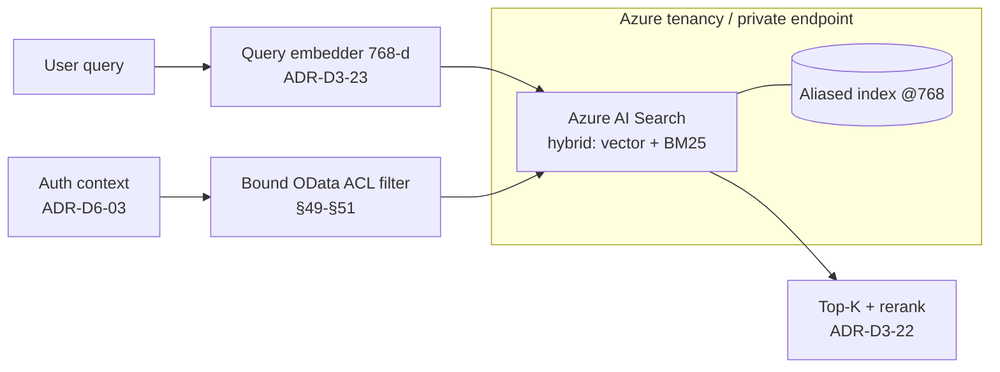

# ADR-D3-24 — Vector store selection

> **OPEN DECISION.** This ADR carries `status: Proposed` per
> [ADR-D0-04](../00-decision-programme/ADR-D0-04-open-decision-register-and-escalation.md).
> The vector store is listed as unresolved in `CLAUDE.md` §Tech Stack. A full
> evaluation and a stated recommendation are given below; it awaits ARB sign-off
> and is gated at build Phase 8.

## 1. Summary

PFF AI will store and search knowledge/FAQ embeddings in a managed, Azure-native
vector store with private networking, Entra ID RBAC and built-in hybrid search.
The recommendation is **Azure AI Search (vector + hybrid)**, because at this
corpus's scale (~4,000–20,000 vectors, 5–20 document updates per year) raw vector
throughput and horizontal scale — where specialist vector databases win — are
irrelevant, while Azure-native integration, private endpoints, managed operations,
metadata ACL filtering and native hybrid (lexical + vector) search dominate the
decision. This ADR is `Proposed`, awaiting ARB sign-off, and must not be treated
as Accepted.

## 2. Context and Problem Statement

14.PF-FT-AI-EMBEDDING-VECTOR.md §31 defines the vector database boundary and §32 lists ten candidate
technologies, then states explicitly that **"the final selection should be an ADR
decision outside this document."** `CLAUDE.md` reinforces that the vector store is
still open and must be resolved via ADR, not silently picked. This is that ADR.

Blocked until resolved: the RAG index cannot be provisioned, so ingestion
(ADR-D3-21), embedding (ADR-D3-23) and retrieval (ADR-D3-22) have nowhere to write
or read; IaC for the RAG subsystem cannot be authored; security review of the
retrieval-time ACL path (14.PF-FT-AI-EMBEDDING-VECTOR.md §49, ADR-D6-12) has no concrete target.

What goes wrong if left implicit: a team stands up whatever vector DB is nearest to
hand (often a self-hosted open-source engine on a VM), inheriting operational
ownership, patching, backup, DR and private-networking work that a managed
Azure-native service would absorb — and does so for a corpus so small that none of
the scale advantages that justify a specialist engine ever materialise.

**Decisive scale fact (from ADR-D3-21 corpus profile).** ~4k–20k chunks → ~4k–20k
vectors; 5–20 doc updates/year; 2–10% annual churn; single-digit concurrent RAG
queries expected. 14.PF-FT-AI-EMBEDDING-VECTOR.md §36 notes ANN (HNSW/IVF/PQ) is "normally used for large
vector collections" — at 20k vectors even exact/flat search is sub-millisecond, so
ANN sophistication, sharding, quantisation (§92, §97) and throughput (§89) — the
axes on which Milvus/Qdrant/Weaviate differentiate — carry almost no weight here.
The decision is therefore an **enterprise-integration and operations** decision,
not a vector-performance one.

## 3. Decision Drivers

### 3.1 Functional drivers

| ID | Driver | Source |
|---|---|---|
| DR-F-01 | Vector similarity search over 768-dim embeddings | 14.PF-FT-AI-EMBEDDING-VECTOR.md §35, §52; ADR-D3-23 |
| DR-F-02 | Metadata filtering incl. ACL/security metadata at query time | 14.PF-FT-AI-EMBEDDING-VECTOR.md §27, §49, §50 |
| DR-F-03 | Hybrid (lexical + vector) search for exact identifiers | 14.PF-FT-AI-EMBEDDING-VECTOR.md §57, §58; ADR-D3-22 |
| DR-F-04 | Filter-injection-safe filter construction | 14.PF-FT-AI-EMBEDDING-VECTOR.md §51 |
| DR-F-05 | Blue/green index + alias cutover for re-embedding | 14.PF-FT-AI-EMBEDDING-VECTOR.md §77, §78, §84 |

### 3.2 Non-functional drivers

| ID | Driver | Target | Source |
|---|---|---|---|
| DR-N-01 | Retrieval latency | p95 vector search ≤ 120 ms | 14.PF-FT-AI-EMBEDDING-VECTOR.md §88 |
| DR-N-02 | Availability | ≥ 99.9% (managed SLA) | 14.PF-FT-AI-EMBEDDING-VECTOR.md §33 |
| DR-N-03 | Private networking / no public data-plane | Private endpoint only | 14.PF-FT-AI-EMBEDDING-VECTOR.md §34, §122 |
| DR-N-04 | Identity-based access, no shared keys | Entra ID RBAC | 14.PF-FT-AI-EMBEDDING-VECTOR.md §34, §124 |
| DR-N-05 | Backup / DR | Managed backup + rebuild path | 14.PF-FT-AI-EMBEDDING-VECTOR.md §33, §160; §86 |

### 3.3 Constraints

| ID | Constraint | Type | Source |
|---|---|---|---|
| DR-C-01 | Azure is the platform; prefer Azure-native, private-endpoint-capable services | Platform | CLAUDE.md; ADR-D5-08 |
| DR-C-02 | Index holds knowledge/FAQ only — never enterprise business truth | Regulatory/Arch | 13.FP-FT-AI-RAG.md §5; ADR-D3-20 |
| DR-C-03 | Vectors are sensitive (invertible to text) — must be encrypted & access-controlled | Security | 14.PF-FT-AI-EMBEDDING-VECTOR.md §121, §122, §124 |
| DR-C-04 | Selection is an ADR decision, ship as Proposed until signed off | Organisational | 14.PF-FT-AI-EMBEDDING-VECTOR.md §32; ADR-D0-04 |
| DR-C-05 | Cache/memory store is a *separate* concern from the vector store | Architecture | 9 PF-FT-AI-MEMORY-CACHE.md; ADR-D4-10, ADR-D4-12 |

### 3.4 Assumptions

| ID | Assumption | If false | Validation |
|---|---|---|---|
| DR-A-01 | Corpus stays ≤ ~20k vectors for the foreseeable horizon | Scale criteria regain weight; re-score (§6.1) | Index size metric, annual |
| DR-A-02 | Azure AI Search hybrid quality meets Recall@5 gate | Add external reranker or reconsider engine | Retrieval eval, ADR-D3-22 |
| DR-A-03 | 768-dim is fixed by ADR-D3-23 | Index dimension changes ⇒ new index | Dimension guard, 14.PF-FT-AI-EMBEDDING-VECTOR.md §18 |

## 4. Evaluation Criteria and Weights

Criteria fixed before scoring (CMMI DAR SP 1.1), drawn from 14.PF-FT-AI-EMBEDDING-VECTOR.md §33 and §34 and
**re-weighted for the actual corpus scale** — the central analytical move of this
ADR.

| ID | Criterion | Weight | Rationale | Measurement |
|---|---|---|---|---|
| EC-01 | Azure-native integration & private networking | 22 | Platform is Azure; private endpoints & Entra ID are mandatory (§34) | Private endpoint + Entra RBAC support |
| EC-02 | Operational ownership (managed vs self-run) | 20 | Small team; avoid running/patching a DB for 20k vectors | Managed SLA vs self-host burden |
| EC-03 | Security: encryption, RBAC, ACL filtering, auditability | 18 | Vectors are sensitive; safeguarding context (§121–§124) | Feature audit vs §34 |
| EC-04 | Hybrid + metadata-filtered search quality | 15 | Exact IDs + ACL filtering are functional must-haves (§49, §57) | Eval Recall@5; native hybrid? |
| EC-05 | Cost at this scale | 10 | Small corpus → cost is minor but not zero | £/month all-in |
| EC-06 | Vector scale & throughput | 6 | Deliberately low — 20k vectors need none of it (§36, §89) | Max vectors / QPS headroom |
| EC-07 | Portability / exit | 5 | Avoid lock-in; standard export | Export format; migration path (§84) |
| EC-08 | DR / backup maturity | 4 | Rebuildable from canonical docs (§85–§86) anyway | Managed backup + rebuild |
| | **Total** | **100** | | |

**Weight justification (EC-01 = 22, EC-02 = 20).** Both exceed 20/near-20 and both
are defensible: DR-C-01 makes Azure-native private networking effectively
mandatory, and DR-C-02+team-size make managed operations the difference between a
few config lines and standing up a patched, backed-up, privately-networked database
cluster. **EC-06 is pinned at 6 on purpose** — §6.1 shows that if this were
weighted like a large-corpus system (30+), a specialist engine would win; the low
weight is the direct, stated consequence of the 20k-vector ceiling, not an
oversight.

Scoring scale: **1** unacceptable · **2** poor · **3** adequate · **4** good · **5** excellent.

## 5. Alternatives Considered

Five candidates scored from the 14.PF-FT-AI-EMBEDDING-VECTOR.md §32 list, spanning managed-Azure-native,
managed-SaaS, self-hosted-specialist, in-database and reuse-existing postures.

### 5.1 Option A — Azure AI Search (vector + hybrid)

**Description.** Azure's managed search service with native vector, lexical (BM25)
and hybrid search, metadata filters, private endpoints, Entra ID RBAC,
customer-managed keys and managed backup/HA.

**Strengths.**
- Azure-native: private endpoint, Entra RBAC, Key Vault, Monitor/App Insights,
  data residency — satisfies every 14.PF-FT-AI-EMBEDDING-VECTOR.md §34 enterprise consideration out of the
  box.
- **Native hybrid search** (lexical + vector + semantic ranker) directly serves the
  exact-identifier requirement (ADR-D3-22) with no second system.
- Fully managed: no cluster to run, patch, back up or scale — the biggest operational
  win at this corpus size.
- Metadata filtering with OData filters supports ACL filtering (§49–§50); filter
  construction can be parameterised to resist injection (§51).

**Weaknesses.**
- Azure lock-in (mitigated: index is rebuildable from canonical docs, §86).
- Less raw ANN tunability than specialist engines — immaterial at 20k vectors.
- Cost per index tier can exceed a tiny self-host at rest — but see §17.

**Cost / effort.** Basic/Standard tier ≈ £60–250/month; near-zero ops effort.

### 5.2 Option B — Managed SaaS specialist (Pinecone / Qdrant Cloud)

**Description.** A best-in-class managed vector database as an external SaaS.

**Strengths.**
- Excellent vector performance and developer ergonomics; managed.

**Weaknesses.**
- **Off-Azure data plane** — vectors (sensitive, §121) leave the Azure tenancy to a
  third party; private connectivity to Azure is limited/complex, failing DR-N-03
  and EC-01.
- Separate identity/billing/DPA surface; no Entra-native RBAC.
- No integrated lexical search → still need a second system for hybrid.

**Cost / effort.** Low ops, but a data-residency and boundary cost that is hard to
accept for FA data.

### 5.3 Option C — Self-hosted specialist on AKS (Qdrant / Weaviate / Milvus)

**Description.** Deploy an open-source vector engine into the platform's AKS
cluster.

**Strengths.**
- Best-in-class ANN, quantisation, sharding; fully inside the tenancy; open licence.
- Maximum control and portability.

**Weaknesses.**
- **The platform now operates a stateful database**: HA, persistent volumes,
  backup/restore, upgrades, security patching, private networking, capacity — all
  owned by a small team, for a 20k-vector index that needs none of the scale this
  engine provides.
- Hybrid search often needs an added lexical component or plugin.
- Highest total operational cost despite lowest licence cost.

**Cost / effort.** Low licence, **high** ops; disproportionate to the workload.

### 5.4 Option D — pgvector on Azure Database for PostgreSQL (Flexible Server)

**Description.** Vector search as an extension inside a managed Azure Postgres.

**Strengths.**
- Azure-native, private endpoint, Entra auth, managed backup/HA.
- Co-locates vectors with relational metadata; SQL filtering; one familiar engine.
- Very economical at small scale.

**Weaknesses.**
- Hybrid search (BM25 + vector) is do-it-yourself (`tsvector` + pgvector) rather
  than a first-class feature → more retrieval engineering (EC-04).
- HNSW in pgvector is capable but less turnkey than a search service; index tuning
  is manual.
- Risks blurring the 9 PF-FT-AI-MEMORY-CACHE.md separation if the same Postgres is reused for other state
  (kept distinct by DR-C-05).

**Cost / effort.** Low cost, moderate build effort for hybrid; low ops (managed).

### 5.5 Option E — Reuse Azure Managed Redis vector search (from ADR-D4-10)

**Description.** ADR-D4-10 already selects Azure Managed Redis for session/cache;
Redis supports vector similarity — reuse it for the RAG index too.

**Strengths.**
- No new datastore; Azure-native; low latency.

**Weaknesses.**
- **Conflates two architectural concerns** 9 PF-FT-AI-MEMORY-CACHE.md keeps separate — the ephemeral
  cache/memory plane and the durable knowledge index (DR-C-05). A cache eviction or
  memory-pressure event must never risk the knowledge index.
- Redis vector search lacks first-class lexical/hybrid and rich metadata-filter
  tooling (EC-04).
- Durability/backup posture is tuned for cache, not a system-of-reference index.

**Cost / effort.** Marginal infra cost, but an architectural coupling cost that
violates a stated separation.

### 5.6 Options considered and eliminated before scoring

| Option | Eliminated by |
|---|---|
| Elasticsearch / OpenSearch self-managed | EC-01/EC-02 — heavy self-run cluster; same objections as Option C with more operational surface |
| Chroma | DR-N-02/DR-N-03 — dev/prototype-grade; no enterprise HA/private-endpoint story |
| Managed Elastic Cloud (off-Azure) | EC-01/DR-N-03 — off-tenancy data plane like Option B |

## 6. Evaluation Method and Decision Matrix

**Method.** Weighted scoring against §4, informed by 14.PF-FT-AI-EMBEDDING-VECTOR.md §33–§34 criteria, the
corpus scale from ADR-D3-21, Azure service documentation for networking/identity,
and the ADR-D3-22 hybrid-retrieval requirement.

| Criterion | Weight | A: Azure AI Search | B: SaaS specialist | C: Self-host AKS | D: pgvector | E: Redis reuse |
|---|---|---|---|---|---|---|
| EC-01 Azure-native & private net | 22 | 5 | 2 | 4 | 5 | 5 |
| EC-02 Operational ownership | 20 | 5 | 4 | 2 | 4 | 4 |
| EC-03 Security/RBAC/ACL/audit | 18 | 5 | 3 | 3 | 4 | 3 |
| EC-04 Hybrid + filtered search | 15 | 5 | 3 | 3 | 3 | 2 |
| EC-05 Cost at this scale | 10 | 3 | 3 | 3 | 5 | 5 |
| EC-06 Scale & throughput | 6 | 4 | 5 | 5 | 3 | 4 |
| EC-07 Portability / exit | 5 | 3 | 3 | 5 | 4 | 3 |
| EC-08 DR / backup | 4 | 5 | 4 | 3 | 5 | 3 |
| **Weighted total** | **100** | **463** | **312** | **314** | **414** | **381** |

Weighted totals (×20 scale): **A = 463**, **D = 414**, **E = 381**, **C = 314**,
**B = 312**.

**Sensitivity.** A leads D by 49 points — a wide margin. D is the natural runner-up
and the strongest fallback: it wins EC-05 outright and ties EC-01, losing mainly on
EC-04 (DIY hybrid) and EC-03. **The one weight that would change the winner is
EC-06 (scale/throughput):** if the corpus were large and EC-06 were weighted ~30
with EC-02/EC-05 reduced accordingly, Option C (self-host specialist) would
overtake — which is exactly why §6.1 records that inverted matrix. At the actual
20k-vector scale, the winner is stable.

### 6.1 Re-scored matrix for a hypothetical large corpus (> 5M vectors)

To show the recommendation is scale-dependent and not vendor bias, the same options
are re-scored with weights a large, high-throughput corpus would justify — EC-06
raised to 30, EC-04 to 20, EC-02 cut to 10, EC-05 to 5, EC-01 to 15, EC-03 to 12,
EC-07 to 5, EC-08 to 3.

| Criterion | Weight | A | B | C | D | E |
|---|---|---|---|---|---|---|
| EC-01 Azure-native | 15 | 5 | 2 | 4 | 5 | 5 |
| EC-02 Ops ownership | 10 | 5 | 4 | 2 | 4 | 4 |
| EC-03 Security | 12 | 5 | 3 | 3 | 4 | 3 |
| EC-04 Hybrid/filter | 20 | 5 | 3 | 4 | 3 | 2 |
| EC-05 Cost | 5 | 3 | 3 | 4 | 5 | 5 |
| EC-06 Scale/throughput | 30 | 3 | 5 | 5 | 3 | 4 |
| EC-07 Portability | 5 | 3 | 3 | 5 | 4 | 3 |
| EC-08 DR/backup | 3 | 5 | 4 | 3 | 5 | 3 |
| **Weighted total** | **100** | **415** | **355** | **388** | **362** | **345** |

At large scale A (415) and C (388) converge and C's specialist ANN/throughput makes
it genuinely competitive — the decision would warrant a benchmark bake-off. The
present recommendation holds **only while DR-A-01 (≤ ~20k vectors) holds**; RT-01
reopens it if the corpus grows > 10×.

## 7. Decision

**PFF AI will use Azure AI Search (vector + hybrid) as the knowledge/FAQ vector
store**, provisioned with a private endpoint, Entra ID RBAC, customer-managed
encryption keys and managed backup, holding 768-dimension embeddings (ADR-D3-23) in
a blue/green-aliased index (14.PF-FT-AI-EMBEDDING-VECTOR.md §77–§78). Hybrid lexical+vector search serves
exact-identifier retrieval (ADR-D3-22); OData metadata filters enforce ACLs at
query time (ADR-D6-12), constructed parametrically to resist filter injection (14.PF-FT-AI-EMBEDDING-VECTOR.md §51).

Option D (pgvector on Azure Postgres) is the designated fallback if Azure AI Search
cost or hybrid quality proves unsatisfactory — it shares the Azure-native and
managed strengths and loses mainly on turnkey hybrid. Options B and E are rejected
on data-boundary/coupling grounds; Option C is rejected because it imposes
database-operations cost that the corpus scale cannot justify (revisit only if the
corpus grows > 10×, per §6.1 and RT-01).

**Status rationale.** `Proposed` per ADR-D0-04 and `CLAUDE.md`: the vector store is
an explicitly open decision. The evaluation and recommendation are complete; ARB
sign-off is the only outstanding step, gated at build Phase 8 before the index is
provisioned. It is **not** Accepted and must appear in
`_register/open-decisions.md`.

## 8. Architecture Detail

- **Boundary.** `src/pf_ft_ai/rag/vector_store/` exposes a `VectorStore` protocol
  (`upsert`, `search`, `delete`, `swap_alias`); an `AzureAISearchStore` implements
  it. Domain/orchestration code never imports the Azure SDK directly (ADR-D2-01).
- **Index shape** (14.PF-FT-AI-EMBEDDING-VECTOR.md §35): dimension 768, cosine metric (matched to embedding,
  §44/§46), HNSW profile (default; irrelevant tuning at this scale), metadata fields
  for `chunk_id`, `document_id`, `document_version`, `source_id` (§21) plus security
  metadata for ACL (§27, §49) and business metadata (§28).
- **Hybrid search** (14.PF-FT-AI-EMBEDDING-VECTOR.md §57–§58): vector query + BM25 over the chunk text, fused
  by the service's ranker; the vector layer contributes semantic recall, lexical
  contributes exact-ID precision.
- **ACL at query time** (14.PF-FT-AI-EMBEDDING-VECTOR.md §49–§51; ADR-D6-12): the caller's authorisation
  context (ADR-D6-03) is translated into an OData `$filter`; filter values are bound,
  never string-concatenated, to prevent filter injection.
- **Re-embedding / model change**: build a new index, embed into it, evaluate, then
  atomically repoint the alias (14.PF-FT-AI-EMBEDDING-VECTOR.md §78, §84) — no in-place mutation.
- **Networking/identity** (14.PF-FT-AI-EMBEDDING-VECTOR.md §34, §122, §124): private endpoint only; Entra ID
  RBAC; secrets/keys via Key Vault (ADR-D5-07).

## 9. Consequences

### 9.1 Positive
- One managed Azure-native service covers vector + lexical + hybrid + filtering with
  private networking and Entra RBAC — no cluster to operate.
- Clean separation from the cache/memory plane (9 PF-FT-AI-MEMORY-CACHE.md) preserved.
- Blue/green alias makes re-embedding safe and reversible.

### 9.2 Negative
- Azure lock-in for the index (mitigated: rebuildable from canonical docs, §86).
- At-rest cost floor higher than a tiny self-host — accepted for the ops saving.
- Less ANN tunability than a specialist engine — irrelevant now, a revisit trigger
  later.

### 9.3 Neutral
- Retrieval quality now depends partly on the service's ranker; validated by the
  ADR-D3-22 eval gate regardless of engine.

### 9.4 Trade-offs explicitly accepted

| Given up | In exchange for | Accepted by |
|---|---|---|
| Specialist ANN performance & max portability (Option C) | Zero database operations, Azure-native security | AI Arch Lead, Platform Eng |
| Lowest possible at-rest cost (Option D/E) | First-class hybrid search + managed HA/backup | AI Arch Lead |
| Multi-cloud neutrality | Private-endpoint, Entra-native data plane | Security Architect |

## 10. Golden-Rule and Precedence Conformance

| Constraint | Conformance |
|---|---|
| Enterprise decides & executes; AI interprets/orchestrates | Vector store serves *knowledge* retrieval only; it holds no business truth and makes no decision (13.FP-FT-AI-RAG.md §5, ADR-D3-20). |
| Precedence: Enterprise API/Event > ERC > Cache > RAG > SLM | The store sits at the RAG tier — below ERC/Cache; retrieved content never overrides authoritative state. |
| Four-state separation | Knowledge index is distinct from Conversation/Session/Enterprise state; explicitly *not* co-located with the cache/memory store (DR-C-05). |
| Versioned artefacts, never mutated in place | Index changes ship via blue/green alias swap (§77–§78, §84), never in-place edits. |
| Adam persona governs *how*, never *what* | Not applicable — retrieval is upstream of persona-layer generation. |

## 11. Risks and Mitigations

| ID | Risk | Likelihood | Impact | Exposure | Mitigation | Owner | Residual |
|---|---|---|---|---|---|---|---|
| RSK-01 | Hybrid quality below Recall@5 gate | Low | High | M | Fallback Option D; add reranker (ADR-D3-22) | AI Arch Lead | Low |
| RSK-02 | Service cost higher than budget at rest | Med | Low | L | Right-size tier; fallback pgvector | FinOps | Low |
| RSK-03 | Filter-injection bypasses ACL | Low | High | M | Bound OData filters; ACL tests (§51, ADR-D6-12) | Security Architect | Low |
| RSK-04 | Corpus grows beyond scale assumption | Low | Med | M | RT-01 reopens with §6.1 large-corpus matrix | AI Arch Lead | Low |
| RSK-05 | Sensitive vectors exposed via public data plane | Low | High | M | Private endpoint only; Entra RBAC; CMK (§122, §124) | Security Architect | Low |

## 12. Quantitative Targets and Measures

| ID | Measure | Target | Threshold (alert) | Source | Review cadence |
|---|---|---|---|---|---|
| QM-01 | Vector/hybrid search p95 latency | ≤ 120 ms | > 250 ms | App Insights / Langfuse | Continuous |
| QM-02 | Search availability | ≥ 99.9% | < 99.5% | Azure Monitor | Monthly |
| QM-03 | Recall@5 (with hybrid) | ≥ 0.90 | < 0.85 | Eval pipeline (ADR-D3-22) | Every index build |
| QM-04 | ACL-filter correctness | 100% (no cross-ACL leak) | any leak | Security test suite | Every release |
| QM-05 | All-in monthly cost | ≤ £250 | > £400 | FinOps | Monthly |

## 13. Security, Privacy and Compliance Impact

| Dimension | Impact |
|---|---|
| Attack surface change | Adds a managed search service; private endpoint only, no public data plane |
| Data classification touched | Confidential (embeddings are invertible to knowledge text, §121) |
| Personal data / PII | Index holds knowledge only; queries governed by ADR-D6-06/07 |
| Children's data and safeguarding | Safeguarding *knowledge* may be indexed; safeguarding *records* never (ADR-D3-20); ACL filtering restricts sensitive knowledge (ADR-D6-12) |
| UK GDPR lawful basis and rights impact | Minimal — no personal records; index rebuildable, so erasure is at the canonical source |
| Audit and evidential requirements | Index build/upsert/delete audited (§173–§174); access via Entra RBAC logged |
| Standards touched | ISO/IEC 27001 (network/identity/crypto), 42001 (AI asset lifecycle), NIST AI RMF |

## 14. Implementation Impact

| Aspect | Detail |
|---|---|
| Build phases | 8 |
| Repository paths | `src/pf_ft_ai/rag/vector_store/` |
| Configuration | Vector store + index config (14.PF-FT-AI-EMBEDDING-VECTOR.md §129, §130); private-endpoint & RBAC in IaC (ADR-D5-12) |
| Contracts / schemas | `VectorStore` protocol; vector record + metadata schema (§22, §26–§28) |
| Migration | Blue/green index + alias (§77–§78, §84); rebuild from canonical docs (§86) |
| Dependencies on other ADRs | ADR-D3-23 (dimension), ADR-D3-22 (hybrid/rerank), ADR-D6-12 (ACL), ADR-D5-08/D5-15 (Azure/APIM) |
| Effort estimate | M — service provisioning + store adapter + hybrid/ACL wiring; low ongoing ops |

## 15. Validation and Verification

| ID | Acceptance criterion | Verification method |
|---|---|---|
| AC-01 | No domain/orchestration code imports the Azure Search SDK | CI import-linter (ADR-D2-01) |
| AC-02 | Data plane reachable only via private endpoint | Network policy test / config review (§122) |
| AC-03 | Access is Entra-RBAC, no shared admin keys in app path | Config + secret-scan (§124, ADR-D5-07) |
| AC-04 | ACL filter prevents cross-authorisation retrieval | Security test with adversarial filters (§51, ADR-D6-12) |
| AC-05 | Model/index change performed via alias swap, not in-place | Integration test (§78) |
| AC-06 | Recall@5 ≥ 0.90 on golden set with hybrid | Eval gate (ADR-D3-22) |

## 16. Operational Impact

| Aspect | Detail |
|---|---|
| Monitoring | Search latency/availability (Azure Monitor); retrieval spans (Langfuse, §110–§111) |
| Alerting | Latency breach, availability, ACL-leak (sev-1), cost overrun |
| Runbook | `docs/runbooks/rag-vector-store.md` — index build, alias swap, DR rebuild (§161) |
| Failure mode and degradation | Store unavailable ⇒ RAG degraded, retrieval skipped, answer falls back gracefully (§157, §160) |
| Rollback | Repoint alias to previous index (§78, §176) |
| Support model impact | Managed service ⇒ minimal on-call; ownership is config + index lifecycle |

## 17. Cost Impact

| Cost element | One-off | Recurring | Basis |
|---|---|---|---|
| Azure AI Search tier | setup only | £60–250/mo | Basic/Standard tier for ~20k vectors (§95) |
| Storage (20k × 768-d) | negligible | included | ~60 MB of vectors (§91) |
| Private endpoint / networking | small | small | Standard Azure PE charges |
| Fallback (pgvector) — if chosen | — | £30–120/mo | Managed Postgres Flexible Server |

## 18. Revisit Triggers and Causal Analysis Hooks

| ID | Trigger | Detected by | Action on trigger |
|---|---|---|---|
| RT-01 | Corpus grows > 10× (> ~200k vectors) or QPS rises materially | Index size / QPS metrics | Re-open with §6.1 large-corpus matrix; benchmark Option C |
| RT-02 | Hybrid Recall@5 < 0.85 sustained | QM-03 | Add reranker or switch to fallback D |
| RT-03 | All-in cost > £400/mo | QM-05 | Re-evaluate tier or move to Option D |
| RT-04 | Any cross-ACL retrieval leak | QM-04 / security test | Sev-1 incident; CAR; block release |

**Scheduled review:** `review_due`. **Causal analysis:** a retrieval-security or
availability incident traced to this choice is recorded here and resolved by a
superseding ADR, not an in-place edit of §7.

## 19. Traceability

| Dimension | Reference |
|---|---|
| Workshop sheet | WS-17 RAG & Retrieval |
| Specification sections | 14.PF-FT-AI-EMBEDDING-VECTOR.md §31–§37, §47–§51, §57–§58, §84–§86, §88, §91, §95, §122, §124, §160; 13.FP-FT-AI-RAG.md §5 |
| Requirement IDs | RAG-VDB-* (per ADR-D1-12 scheme) |
| Build phases | 8 |
| Code paths | `src/pf_ft_ai/rag/vector_store/` |
| Configuration | Vector store & index config (14.PF-FT-AI-EMBEDDING-VECTOR.md §129–§130) |
| Tests | vector store integration + security + eval suites (14.PF-FT-AI-EMBEDDING-VECTOR.md §144–§153) |
| Upstream ADRs | ADR-D3-20, ADR-D3-21, ADR-D3-23, ADR-D0-04 |
| Downstream ADRs | ADR-D3-22, ADR-D6-12 |

## 20. Change Log

| Version | Date | Author | Change |
|---|---|---|---|
| 1.0.0 | 2026-08-22 | AI Architecture Lead | Initial decision recorded — OPEN (Proposed), recommendation Azure AI Search, fallback pgvector. |
