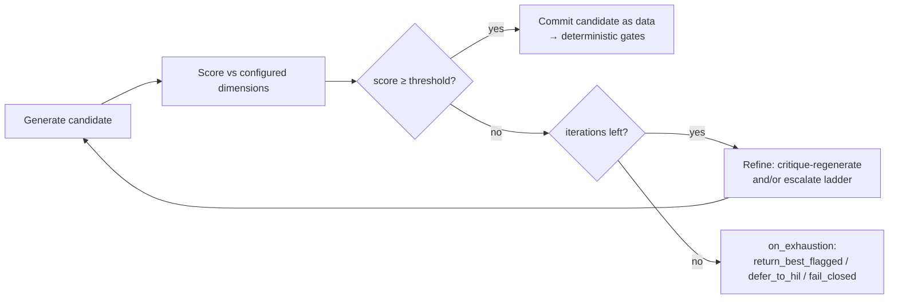

# ADR-D3-28 — Quality-gated runtime refinement loop, model-escalation ladder and strict mode

## 1. Summary

For quality-sensitive generation tasks, PFF AI will add a **runtime quality-gated
refinement loop**: after a candidate output is produced, a deterministic controller
scores it against configured quality dimensions (reusing the evaluation scorers of
ADR-D7-13 / ADR-D8-05); if the score is below the configured threshold the controller
performs a **bounded** refinement — regenerate with critique feedback and/or **escalate
to the next model on a configured escalation ladder** (ADR-D3-15) — up to a configured
`max_refinement_iterations`; on exhaustion it never silently accepts, but returns the
best-scored candidate explicitly flagged, defers to human-in-the-loop, or fails
honestly, per configuration. The loop is configurable per task class and has a **strict
mode** — a higher bar with mandatory escalation and no below-bar acceptance — for
governance-critical task classes. The loop refines *language and pre-commit decision
candidates only*; it never re-runs an enterprise action and never lets a model output
become a business or authorization decision.

## 2. Context and Problem Statement

4. PFF-FA-AI-RUNTIME.md §41 lists "Regenerate where configured" as an output-validation option, but
defines no threshold, no iteration bound, no escalation target and no configuration
schema — it is a stub. 7 PFF-FA-AI-AGENTIC-ORCHESTRATION.md §72–§73 define a ReAct-style tool loop bounded by
`max_loops`, and §161 lists "Evaluation thresholds" as a configuration-driven item, but
those thresholds trace to release gates, not to a live turn. 15.PFF-FA-AI-SLM.md §151 defines a
`quality threshold` — but only as an **offline** model-promotion gate. 21.PFF-FA-AI-EVALUATION.md §9
"Online Evaluation" is passive production monitoring that does not feed back into the
turn that produced the output.

The result is a gap. Today the platform has three adjacent but distinct mechanisms, none
of which is a runtime quality gate:

- **Schema-validity repair** (ADR-D3-17): a one-shot repair when output fails its Pydantic
  schema. This checks *validity*, not *quality* — a schema-valid answer can still be a
  poor, ungrounded or off-persona one.
- **Failure-driven fallback** (ADR-D3-18): ordered fallback across *capability-compatible*
  models when a call fails or times out. This is triggered by *failure*, not by a low
  quality score, and it explicitly targets peers, never a stronger model.
- **Offline evaluation and regression gates** (ADR-D7-13): golden-dataset evaluation that
  blocks a *release* in CI. This never runs inside a user turn.

What is missing is a mechanism that, *during a live turn*, recognises that a produced
output is not good enough and does something about it — tries again, or moves to a
more capable model — before committing to the workflow step, with a tighter bar where
governance demands it. Left implicit, each call site would improvise its own retry
behaviour (or none), quality would vary by code path, and the platform would have no
governed, configurable way to say "for this class of decision, do not proceed on a
mediocre answer." An orchestration layer whose entire value is completing a correct
process correctly (ADR-D1-04) cannot leave output quality to chance at runtime.

## 3. Decision Drivers

### 3.1 Functional drivers

| ID | Driver | Source |
|---|---|---|
| DR-F-01 | A runtime path must be able to reject a below-quality output and retry | 4. PFF-FA-AI-RUNTIME.md §41 ("Regenerate where configured") |
| DR-F-02 | The platform must be able to use a stronger/"right" model when quality demands it | 15.PFF-FA-AI-SLM.md §151; ADR-D3-15 |
| DR-F-03 | Behaviour (threshold, iterations, model ladder, exhaustion action) must be configurable | 7 PFF-FA-AI-AGENTIC-ORCHESTRATION.md §161 |
| DR-F-04 | A stricter bar must be available for governance-critical task classes | 7 PFF-FA-AI-AGENTIC-ORCHESTRATION.md §162 ("strict guardrails"); ADR-D6-14 |

### 3.2 Non-functional drivers

| ID | Driver | Target | Source |
|---|---|---|---|
| DR-N-01 | The loop must be bounded — no unbounded regeneration | Hard iteration cap per task class | ADR-D2-11; ADR-D3-26 |
| DR-N-02 | Refinement latency must stay within the turn budget | Loop cost accounted in the latency budget | ADR-D5-18 |
| DR-N-03 | Extra model calls must be cost-attributed and observable | Per-iteration Langfuse spans | ADR-D7-02; ADR-D8-01 |

### 3.3 Constraints

| ID | Constraint | Type | Source |
|---|---|---|---|
| DR-C-01 | The loop *controller* decision (regenerate/escalate/stop) must be deterministic, acting on a model-produced quality signal — not model-decided | Platform | ADR-D3-05 §7.4 |
| DR-C-02 | The loop must never re-run a non-idempotent enterprise write | Platform | ADR-D2-11 §7.2, §7.6 |
| DR-C-03 | A model output must never become a business/authorization decision | Platform (Golden Rule) | ADR-D1-02 |
| DR-C-04 | Refinement must not raise temperature to mask a quality miss | Platform | ADR-D3-16 §8 |
| DR-C-05 | On exhaustion the platform must degrade honestly, never silently ship a below-bar answer as if it passed | Platform | ADR-D3-08; ADR-D3-26 |

### 3.4 Assumptions

| ID | Assumption | If false | Validation |
|---|---|---|---|
| DR-A-01 | A quality signal can be computed at runtime cheaply enough to stay in budget | Loop restricted to a deterministic-scorer subset; judge reserved for strict mode only | Latency benchmark (Phase 20) |
| DR-A-02 | A more capable model on the ladder measurably improves low-scoring outputs | Escalation disabled; loop degrades to regenerate-only | Escalation A/B on golden set |

## 4. Evaluation Criteria and Weights

| ID | Criterion | Weight | Rationale | Measurement |
|---|---|---|---|---|
| EC-01 | Output-quality uplift on hard cases | 30 | The whole point is a better committed answer | Score delta pre/post loop on golden set |
| EC-02 | Governance control (strict bar, no silent below-bar ship) | 24 | Governance-critical classes must not proceed on mediocre output | Strict-mode conformance tests |
| EC-03 | Boundedness & safety (never loops, never re-runs writes) | 20 | An unbounded or write-replaying loop is worse than none | Cap + idempotency tests |
| EC-04 | Configurability across task classes | 14 | One size does not fit routing vs. narration vs. HIL forms | Config coverage |
| EC-05 | Latency / cost | 12 | Extra calls cost time and money | Added calls, p95 delta |
| | **Total** | **100** | | |

Scoring scale: **1** unacceptable · **2** poor · **3** adequate · **4** good · **5** excellent.

## 5. Alternatives Considered

### 5.1 Option A — No runtime quality loop (status quo)

**Description.** Keep single-shot generation with schema-validity repair (ADR-D3-17) and
failure-driven fallback (ADR-D3-18); rely on offline evaluation (ADR-D7-13) to keep
quality acceptable at release time.
**Strengths.** Simplest; lowest per-turn latency and cost; no new mechanism.
**Weaknesses.** No recovery from a below-quality-but-valid output at runtime; no way to
apply a stricter bar to governance-critical classes; the §41 stub stays undefined.
**Cost / effort.** None.

### 5.2 Option B — Regenerate-only loop (same model, critique feedback, capped)

**Description.** On a low quality score, re-prompt the *same* model with a critique of the
prior attempt, up to a cap; no model change.
**Strengths.** Simple; provider-portable; catches transient poor generations.
**Weaknesses.** A model at its ceiling will not clear the bar by retrying; no "right
model" escalation; limited uplift on genuinely hard cases.
**Cost / effort.** Low.

### 5.3 Option C — Quality-gated loop with a model-escalation ladder and a configurable strict mode

**Description.** A deterministic controller scores each candidate; below threshold it
regenerates with critique and/or escalates to the next model on a configured ladder
(ADR-D3-15), bounded by `max_refinement_iterations`; on exhaustion it takes a configured
action (return-best-flagged / HIL / fail). Per-task-class configuration, with a **strict
mode** raising the bar, mandating at least one escalation, and forbidding below-bar
acceptance for governance-critical classes.
**Strengths.** Real uplift on hard cases via the "right model"; governed, testable strict
bar; bounded and honest on exhaustion; configurable per task class; reuses existing
scorers and registry.
**Weaknesses.** Added latency/cost on low-scoring turns; a runtime scorer must be cheap
enough; more moving parts to configure and monitor.
**Cost / effort.** Medium.

### 5.4 Option D — In-line LLM-as-judge on every turn with unbounded retry

**Description.** Run a judge model on every output and retry until it passes.
**Strengths.** Highest nominal quality bar.
**Weaknesses.** Judge on every turn doubles latency/cost even when unnecessary; unbounded
retry violates DR-N-01 and ADR-D2-11; judge is itself fallible and can loop. Fails EC-03
and EC-05.
**Cost / effort.** High run cost.

### 5.5 Option E — Escalate-to-human only (no automated refinement)

**Description.** On low confidence/quality, stop and route to a human; no regenerate, no
escalate.
**Strengths.** Very safe; simple; strong governance posture.
**Weaknesses.** Wastes an automatable recovery; drives avoidable escalation, which
ADR-D1-04 counts against the platform (BM-03); poor UX for cases a stronger model would
have solved.
**Cost / effort.** Low build; high operational (human) cost.

### 5.6 Options considered and eliminated before scoring

| Option | Eliminated by |
|---|---|
| Raise temperature and retry to "vary" output | DR-C-04 (ADR-D3-16 §8 forbids temperature as a quality fix) |
| Re-run the enterprise tool/workflow to get a better result | DR-C-02 (ADR-D2-11 §7.2 — non-idempotent writes are never re-run) |

## 6. Evaluation Method and Decision Matrix

**Method.** Weighted scoring against §4, informed by the runtime/orchestration specs
(4. PFF-FA-AI-RUNTIME.md §41, §64; 7 PFF-FA-AI-AGENTIC-ORCHESTRATION.md §72, §161–§162), the offline-eval boundary
(21.PFF-FA-AI-EVALUATION.md §9), and the constraint ADRs (ADR-D3-05, ADR-D2-11, ADR-D3-16).

| Criterion | Weight | A: None | B: Regenerate-only | C: Loop + escalation + strict | D: Judge-every-turn | E: Human-only |
|---|---|---|---|---|---|---|
| EC-01 Quality uplift | 30 | 1 | 3 | 5 | 5 | 2 |
| EC-02 Governance control | 24 | 2 | 3 | 5 | 4 | 5 |
| EC-03 Boundedness & safety | 20 | 5 | 5 | 5 | 1 | 5 |
| EC-04 Configurability | 14 | 1 | 3 | 5 | 3 | 2 |
| EC-05 Latency/cost | 12 | 5 | 4 | 3 | 1 | 4 |
| **Weighted total** | **100** | **252** | **352** | **476** | **320** | **356** |

- **Option C:** (30×5)+(24×5)+(20×5)+(14×5)+(12×3) = 150+120+100+70+36 = **476**.

Totals: **C = 476**, **E = 356**, **B = 352**, **D = 320**, **A = 252**.

**Sensitivity.** C leads by 120 points. Its only weak criterion is EC-05 (latency/cost),
and that is bounded by construction — the loop only engages on a below-threshold score,
so the common (already-good) case pays nothing beyond one scorer pass. D's unbounded
retry sinks it on EC-03 regardless of its quality ceiling, and A (status quo) scores
lowest. E and B sit close together as the two degraded fallbacks: if DR-A-02 proves false
(escalation does not help), C degrades to B (regenerate-only); if the runtime scorer
proves too costly (DR-A-01), strict-mode classes fall back to E (human-only).

## 7. Decision

**PFF AI will implement a runtime quality-gated refinement loop with a configurable
model-escalation ladder and a strict mode (Option C).** After a candidate output for a
quality-sensitive task class, a deterministic controller computes a quality score; if it
is below the configured threshold, the controller runs a bounded refinement —
critique-and-regenerate on the same model and/or escalate to the next model on the
configured ladder (read from the model registry, ADR-D3-15) — up to
`max_refinement_iterations`. On exhaustion the controller performs the configured
`on_exhaustion` action: `return_best_flagged`, `defer_to_hil`, or `fail_closed`; it never
silently ships a below-bar output as if it had passed. Regenerate-only (B) is the
degraded configuration when escalation is disabled; judge-every-turn (D) is rejected on
boundedness and cost; human-only (E) is retained as the strict-mode exhaustion action,
not as the whole mechanism.

The loop is subordinate to every existing constraint. Its controller decision is
deterministic and acts only on a model-produced quality *signal* (ADR-D3-05 §7.4); it
operates on **language and pre-commit decision candidates only** and never re-runs a
committed or non-idempotent enterprise action (ADR-D2-11 §7.2); a refined output remains
*data for deterministic code to act on* and never itself becomes a business or
authorization decision (ADR-D1-02); it never raises temperature to mask a miss
(ADR-D3-16); and enterprise/ERC truth always outranks any refined SLM output
(ADR-D1-03). It is distinct from — and composes after — schema-validity repair
(ADR-D3-17) and before any workflow commit, and it is orthogonal to failure-driven
fallback (ADR-D3-18) and offline release gates (ADR-D7-13).

**Status rationale.** `Proposed`. This introduces a new runtime control surface with
latency, cost and governance implications; it awaits **Architecture Review Board**
sign-off (with the AI Governance Lead consulted on the strict-mode task-class list and
the AI Evaluation Owner on the runtime scorer choice), and a Phase 20 latency/cost
benchmark validating DR-A-01/DR-A-02. Ratification moves it to `Accepted` per ADR-D0-04.

## 8. Architecture Detail

- **Controller.** A `QualityRefinementController` in `src/pff_fa_ai/orchestration/`
  wraps quality-sensitive generation. Flow: `generate → score → gate → (refine ↺ | commit)`.
  The gate is a deterministic threshold comparison — the model produces the score
  signal, deterministic code decides the action (ADR-D3-05 §7.4).
- **Scoring.** Reuses the evaluation scorers (ADR-D7-13 / ADR-D8-05): deterministic
  checks (groundedness against ERC, citation presence, schema, persona-lint) by default;
  a validated LLM-as-judge dimension is enabled **only** where a task class opts in
  (typically strict mode), to keep the common path cheap.
- **Escalation ladder.** An ordered list of model `id@version` references per task class,
  resolved from the model registry (ADR-D3-15). Escalation moves *up* the ladder toward a
  more capable model — explicitly the opposite of ADR-D3-18's sideways fallback to a
  compatible peer on failure. A task class may declare an empty ladder (regenerate-only).
- **Bounds.** `max_refinement_iterations` (per task class) caps total attempts; the loop
  also respects the turn's latency budget (ADR-D5-18) and the runtime loop limits
  (ADR-D2-11, 4. PFF-FA-AI-RUNTIME.md §54). A hard counter enforces termination exactly as the RAG
  agentic loop does (ADR-D3-26).
- **Strict mode.** A per-task-class flag that: raises `quality_threshold`; sets
  `min_escalations ≥ 1` (at least one attempt on a stronger model before acceptance);
  forces `on_exhaustion: defer_to_hil` (or `fail_closed`), forbidding
  `return_best_flagged`. Applied to governance-critical classes — e.g. transaction-outcome
  communication (ADR-D3-08), eligibility/decision explanations, safeguarding-adjacent
  narration, and HIL form construction (ADR-D6-14).
- **Configuration.** New `config/base/refinement.yaml`, a versioned artefact (ADR-D5-06),
  keyed by task class:

  ```yaml
  refinement:
    default:
      enabled: false            # opt-in per task class
      quality_threshold: 0.80
      dimensions: [groundedness, persona, schema]
      max_refinement_iterations: 2
      escalation_ladder: []     # empty → regenerate-only
      on_exhaustion: return_best_flagged
      strict: false
    task_classes:
      transaction_outcome_comms:
        enabled: true
        strict: true
        quality_threshold: 0.92
        dimensions: [groundedness, persona, safety]
        max_refinement_iterations: 3
        escalation_ladder: ["slm-base@1", "slm-strong@1"]
        min_escalations: 1
        on_exhaustion: defer_to_hil
  ```

  Per-environment overrides may only *tighten* the bar (Production ≥ lower environments),
  consistent with 7 PFF-FA-AI-AGENTIC-ORCHESTRATION.md §162.
- **Observability.** Each iteration is a Langfuse span (ADR-D7-02) recording the score,
  the action taken, the model used and the token/cost delta (ADR-D8-01); the committed
  output records how many iterations and which ladder rung produced it.
- **Interaction with writes.** The loop sits entirely on the generation/decision-candidate
  path *before* the Agent Harness executes any enterprise tool (ADR-D2-09). A refined
  decision candidate is still validated by the same deterministic gates and tool-validation
  boundary (ADR-D3-04); the loop never re-invokes a tool that has already run.



## 9. Consequences

### 9.1 Positive

- A below-quality-but-valid output can be recovered at runtime, not just caught at release.
- Governance-critical classes get a tighter, testable bar and never proceed on a mediocre
  answer.
- "Right model" escalation gives real uplift on hard cases without making it the default
  cost.
- The §41 "Regenerate where configured" stub becomes a defined, configurable mechanism.

### 9.2 Negative

- Added latency and cost on low-scoring turns; a runtime scorer adds a per-turn step even
  when it passes.
- More configuration surface and more to monitor; a mis-set threshold can over- or
  under-trigger.

### 9.3 Neutral

- Reinforces the SLM-as-data-source posture; the loop improves the candidate, deterministic
  code still decides and executes.
- Composes with, rather than replaces, ADR-D3-17/D3-18/D7-13.

### 9.4 Trade-offs explicitly accepted

| Given up | In exchange for | Accepted by |
|---|---|---|
| Some extra latency/cost on low-scoring turns | Recoverable runtime quality and a governed strict bar | AI Architecture Lead |
| A single global behaviour | Per-task-class configurability | AI Architecture Lead |

## 10. Golden-Rule and Precedence Conformance

| Constraint | Conformance |
|---|---|
| Enterprise systems decide and execute; the AI platform interprets, orchestrates, contextualises, explains, communicates | The loop improves the AI's *language and decision candidate*; deterministic code and the enterprise still decide and execute. A model output never becomes the decision (DR-C-03). |
| Authoritative-truth precedence: Enterprise API/Event > ERC > Cache > RAG > SLM output | Upheld — a refined output is still lowest authority; groundedness scoring checks it *against* ERC, and enterprise truth overrides it (ADR-D1-03). |
| Four-state separation | The loop reads Workflow/Agent State to score and refine a candidate; it does not write Enterprise Business State — that remains the Harness/enterprise path (DR-C-02). |
| Versioned artefacts, never mutated in place | `refinement.yaml` and the escalation ladders are versioned config released in the bundle (ADR-D5-06, ADR-D6-15). |
| Adam persona governs *how*, never *what* | Persona is one scored dimension governing expression; the loop never lets persona change an authoritative value, and never celebrates an unconfirmed transaction (ADR-D1-09, ADR-D3-08). |

## 11. Risks and Mitigations

| ID | Risk | Likelihood | Impact | Exposure | Mitigation | Owner | Residual |
|---|---|---|---|---|---|---|---|
| RSK-01 | Loop inflates latency beyond the turn budget | Med | Med | M | Cheap deterministic scorer on the common path; judge only in strict mode; hard cap; latency-budget guard (ADR-D5-18) | AI Arch Lead | Low |
| RSK-02 | Runtime scorer is itself inaccurate, gating good output or passing bad | Med | Med | M | Validate scorer against golden set (ADR-D7-13); deterministic dimensions preferred; monitor gate rates | AI Evaluation Owner | Med |
| RSK-03 | Escalation to a stronger model raises cost silently | Med | Med | M | Per-iteration cost spans (ADR-D8-01); ladder + iteration caps; cost alert | FinOps | Low |
| RSK-04 | Loop tempts a "re-run the action for a better result" anti-pattern | Low | High | M | Hard architectural boundary — loop is pre-commit only; idempotency tests (ADR-D2-11) | AI Arch Lead | Low |
| RSK-05 | Below-bar output shipped as if it passed | Low | High | M | `on_exhaustion` never silently accepts; strict mode forbids `return_best_flagged`; flagged-output tests | AI Governance Lead | Low |

## 12. Quantitative Targets and Measures

| ID | Measure | Target | Threshold (alert) | Source | Review cadence |
|---|---|---|---|---|---|
| QM-01 | Quality-score uplift on triggered turns (post − pre) | > 0, materially | ≤ 0 (loop not helping) | Langfuse loop spans | Per release |
| QM-02 | Added p95 latency from the loop | within latency budget | budget breach | App Insights / Langfuse | Continuous |
| QM-03 | Below-bar outputs committed without flag/HIL | 0 | > 0 | Conformance tests | Continuous |
| QM-04 | Strict-class turns escalated ≥ once before acceptance | 100% of below-bar | < 100% | Loop spans | Per release |
| QM-05 | Extra model spend attributable to escalation | within budget | budget breach | Cost model (ADR-D8-01) | Monthly |

## 13. Security, Privacy and Compliance Impact

| Dimension | Impact |
|---|---|
| Attack surface change | None new — the loop calls the same SLM abstraction through the same guardrails and boundary (ADR-D6-07 / ADR-D6-19); each iteration re-passes them. |
| Data classification touched | Internal — the loop handles the same content as the underlying generation. |
| Personal data / PII | No new exposure; masking/boundary policy applies to every iteration equally (ADR-D6-19). |
| Children's data and safeguarding | Strict mode is applied to safeguarding-adjacent narration, raising the bar rather than lowering it. |
| UK GDPR lawful basis and rights impact | No new processing basis; refinement does not create new personal data. |
| Audit and evidential requirements | Each iteration and the committing rung are recorded (ADR-D7-02, ADR-D6-17). |
| Standards touched | ISO/IEC 42001 (quality objectives, performance evaluation), ISO 9001 §9.1, NIST AI RMF MEASURE/MANAGE. |

## 14. Implementation Impact

| Aspect | Detail |
|---|---|
| Build phases | 16 (scorers available), 20 (latency/cost benchmark and tuning) |
| Repository paths | `src/pff_fa_ai/orchestration/` (controller), `src/pff_fa_ai/slm/` (escalation call), `config/base/refinement.yaml` (new) |
| Configuration | `refinement.yaml` per-task-class blocks; escalation ladders reference the model registry |
| Contracts / schemas | A `QualityScore` boundary model; loop-decision enum (`refine`/`escalate`/`commit`/`exhaust`) |
| Migration | Additive and opt-in — `enabled: false` by default, so existing single-shot behaviour is unchanged until a task class opts in |
| Dependencies on other ADRs | ADR-D3-15 (registry ladder), ADR-D3-17 (composes after repair), ADR-D7-13/D8-05 (scorers), ADR-D2-11 (bounds) |
| Effort estimate | M — controller + config + scorer wiring; reuses existing scorers and registry |

## 15. Validation and Verification

| ID | Acceptance criterion | Verification method |
|---|---|---|
| AC-01 | A below-threshold output triggers refinement and a passing output does not | Unit test on the gate |
| AC-02 | The loop terminates at `max_refinement_iterations` in all paths | Bound test with a forced-low scorer |
| AC-03 | Escalation moves up the configured ladder and is recorded | Integration test + span assertion |
| AC-04 | Strict mode enforces `min_escalations` and forbids silent below-bar acceptance | Strict-mode conformance test |
| AC-05 | The loop never re-invokes an already-executed tool/write | Idempotency test (ADR-D2-11) |
| AC-06 | Temperature is not raised across iterations | Config/param assertion (ADR-D3-16) |
| AC-07 | Behaviour is fully driven by `refinement.yaml`, with no hard-coded thresholds | Config-override test |

## 16. Operational Impact

| Aspect | Detail |
|---|---|
| Monitoring | Loop trigger rate, iteration count distribution, uplift, escalation rate, added latency/cost (Langfuse dashboards) |
| Alerting | QM-02/QM-05 budget breach; QM-03 any below-bar commit; trigger-rate spike (scorer or model regression) |
| Runbook | `docs/runbooks/refinement-loop.md` (new) — how to read loop spans, tune thresholds, disable per class |
| Failure mode and degradation | Scorer unavailable → loop disabled for that turn, single-shot output with a flag; strict class → defer to HIL |
| Rollback | Set `enabled: false` for the class (config revert); loop is opt-in so rollback is immediate |
| Support model impact | ML platform tunes thresholds/ladders; Governance owns the strict-class list |

## 17. Cost Impact

| Cost element | One-off | Recurring | Basis |
|---|---|---|---|
| Controller + config + scorer wiring | M | — | Build; reuses scorers/registry |
| Runtime scoring | — | small | One scorer pass per quality-sensitive turn |
| Refinement/escalation calls | — | variable | Only on below-bar turns; bounded by caps; monitored (QM-05) |

## 18. Revisit Triggers and Causal Analysis Hooks

| ID | Trigger | Detected by | Action on trigger |
|---|---|---|---|
| RT-01 | Escalation shows no measurable uplift (DR-A-02 false) | QM-01 | Disable ladders; degrade to regenerate-only (Option B) |
| RT-02 | Loop latency repeatedly breaches budget | QM-02 | Restrict to deterministic scorers; narrow enabled classes |
| RT-03 | Self-hosted SLM lands with constrained decoding (ADR-D3-17 RT-01) | ADR-D5-10 | Re-tune thresholds; higher first-try quality may reduce loop engagement |
| RT-04 | Any below-bar commit without flag/HIL | QM-03 | CAR; strengthen `on_exhaustion` handling; supersede if design flaw |

**Scheduled review:** `review_due` in the front matter. **Causal analysis:** if an
incident is traced to this decision, record it here and raise a superseding ADR rather
than editing §7 in place.

## 19. Traceability

| Dimension | Reference |
|---|---|
| Workshop sheet | WS-16 SLM & model strategy |
| Specification sections | 4. PFF-FA-AI-RUNTIME.md §41, §64; 7 PFF-FA-AI-AGENTIC-ORCHESTRATION.md §72–§73, §161–§162; 15.PFF-FA-AI-SLM.md §151; 21.PFF-FA-AI-EVALUATION.md §9, §67–§68 |
| Requirement IDs | AI-QUAL-LOOP-* (per ADR-D1-12) |
| Build phases | 16, 20 |
| Code paths | `src/pff_fa_ai/orchestration/`, `src/pff_fa_ai/slm/` |
| Configuration | `config/base/refinement.yaml` |
| Tests | refinement-loop unit + conformance + idempotency suites |
| Upstream ADRs | ADR-D3-15, ADR-D3-16, ADR-D3-17, ADR-D3-05, ADR-D2-11 |
| Downstream ADRs | ADR-D8-05, ADR-D7-13 (share scorers) |

## 20. Change Log

| Version | Date | Author | Change |
|---|---|---|---|
| 1.0.0 | 2026-09-04 | AI Architecture Lead | Initial decision recorded (Proposed). Introduces the runtime quality-gated refinement loop, the model-escalation ladder and strict mode; awaits ARB sign-off and a Phase 20 latency/cost benchmark. |
