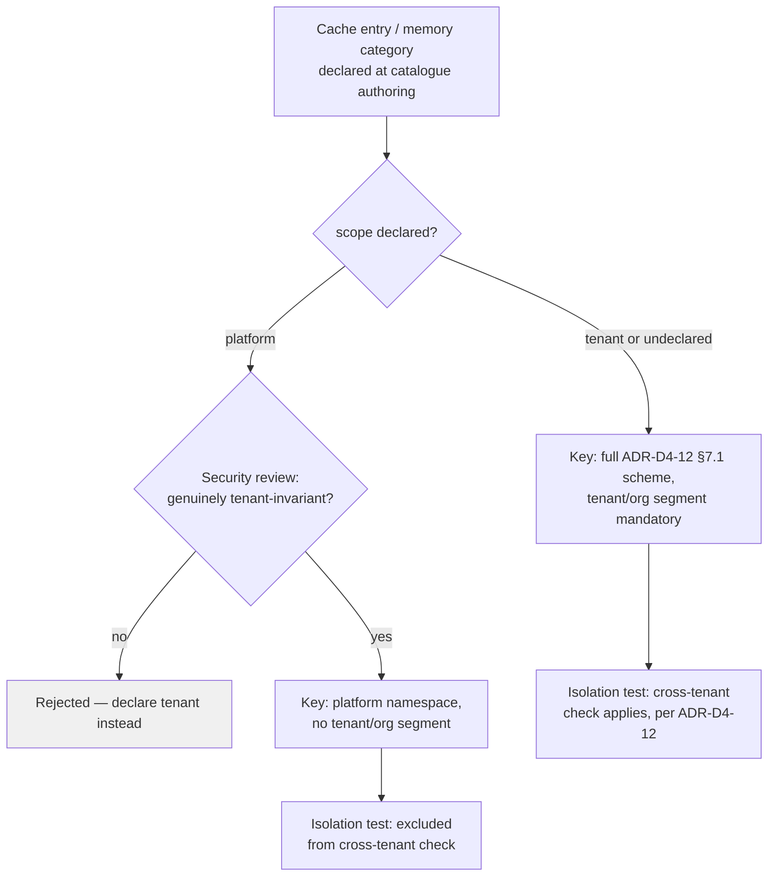

# ADR-D4-13 — Cache and memory key scoping for platform-global (non-tenant) entries

## 1. Summary

Every cache and memory entry declares an explicit **scope** — `tenant` (the default,
namespaced by tenant/organization/user as ADR-D4-12 already requires) or `platform`
(a small, reviewed set of genuinely tenant-invariant reference data, keyed once with
no tenant/org segment and exempt from per-tenant isolation checks by design, not by
omission). This closes a gap between doc 9 §37's key scheme — written as if every
entry is tenant-scoped — and ADR-D4-12's own example of caching "stable reference
data (leagues)," which is national, not club-specific.

## 2. Context and Problem Statement

Doc 9 §36–§37 define cache key design and key isolation: every key is built from
`tenant + organization + resource + operation + parameters + version` (§37), with an
explicit warning against using a bare identifier like `club:123` that "could exist
across tenants/environments." §5–§19 enumerate ten memory categories — conversation,
session, working, workflow, agent-run, user-preference, **organizational**,
ERC-reference, decision, summary — of which "organizational" (§15) is club/county-
scoped ("club preferred terminology," "known organizational identifiers"), not
platform-wide.

Neither the key scheme nor the category list has a genuinely tenant-invariant tier.
Yet ADR-D4-12 §8's own worked architecture example names one directly: "stable
reference data (leagues), longer TTL" — and per ADR-D4-08, league and season
identifiers are enterprise-owned, WGS-aligned, **national** reference data, identical
for every club and county that reads it. Literally applying §37's scheme to a leagues
cache entry means keying it per tenant/organization even though the value is the same
for all of them.

That has two concrete consequences, not just an inefficiency:

1. **Needless duplication.** The same leagues payload is cached once per club/county
   instead of once platform-wide, wasting cache capacity in proportion to the number of
   tenants, and every tenant's first request is a cold miss for data that was already
   warm for every other tenant.
2. **An untestable isolation boundary.** ADR-D4-12's AC-04/QM-04 require "cross-tenant
   isolation tests" to pass 100%. A test suite built against §37's literal scheme has
   no way to distinguish a legitimate platform-global entry from an isolation defect —
   it either wrongly flags the global entry as a violation, or (worse) a developer
   silences the failure by forcing a placeholder tenant value onto genuinely global
   data, which reintroduces the duplication problem *and* hides a real isolation bug
   inside the same undocumented workaround the next time one occurs.

ADR-D4-01's four-state separation and ADR-D4-07's data/knowledge classification both
assign ownership and lifecycle per state class and per data domain, but neither
addresses this specific axis — tenant-varying versus tenant-invariant — within the
cache and memory layer itself.

## 3. Decision Drivers

### 3.1 Functional drivers

| ID | Driver | Source |
|---|---|---|
| DR-F-01 | Every cache/memory entry must declare its scope explicitly | doc 9 §36–§37 (implied by the unaddressed gap) |
| DR-F-02 | Tenant-invariant reference data must not be duplicated per tenant | ADR-D4-12 §8's own example |
| DR-F-03 | Cross-tenant isolation tests must be able to tell a legitimate global entry from a violation | ADR-D4-12 AC-04/QM-04 |
| DR-F-04 | Platform-global data eligibility is a reviewed decision, not an implementer's ad hoc choice | Security posture — a `platform` scope is a control that can be misused |

### 3.2 Non-functional drivers

| ID | Driver | Target | Source |
|---|---|---|---|
| DR-N-01 | No functional change to tenant-scoped entries | 0 regressions | ADR-D4-12 unchanged for the default path |
| DR-N-02 | Scoping adds no material latency | ≤1 ms per lookup | ADR-D5-18 |

### 3.3 Constraints

| ID | Constraint | Type | Source |
|---|---|---|---|
| DR-C-01 | Cache/memory still sit below ERC/enterprise in precedence, regardless of scope | Platform | ADR-D1-03 |
| DR-C-02 | Namespaced, isolation-safe keys remain the default for tenant-scoped entries | Platform | ADR-D4-12 §7.1 |
| DR-C-03 | A `platform`-scoped entry must be reviewed, not self-declared by any tool implementation at will | Platform | Security posture |

### 3.4 Assumptions

| ID | Assumption | If false | Validation |
|---|---|---|---|
| DR-A-01 | Genuinely tenant-invariant data is a small, enumerable set (leagues, seasons, competition structures, canonical reference data) | Scope creep — most data claims global status | Catalogue review at Phase 7; RT-01 |

## 4. Evaluation Criteria and Weights

| ID | Criterion | Weight | Rationale | Measurement |
|---|---|---|---|---|
| EC-01 | Isolation-test correctness (no false positive/negative on global entries) | 28 | Directly closes the untestable-boundary problem | Can a test tell global from a violation? |
| EC-02 | No needless per-tenant duplication | 24 | Cache efficiency at the root cause | Cache entries per genuinely global datum |
| EC-03 | Misuse resistance (a tool cannot mis-declare tenant data as global) | 22 | A `platform` scope is a control surface | Can scope be set without review? |
| EC-04 | Simplicity / no new store or namespace | 16 | Reuse ADR-D4-10's store | New infrastructure required? |
| EC-05 | Consistency with existing key design (ADR-D4-12) | 10 | Minimal disruption | Delta from §7.1 |
| | **Total** | **100** | | |

Scoring scale: **1** unacceptable · **2** poor · **3** adequate · **4** good · **5** excellent.

## 5. Alternatives Considered

### 5.1 Option A — Explicit `scope: tenant | platform` field, reviewed catalogue, platform entries keyed without tenant/org segments

**Description.** Every cache/memory category and every cacheable operation in the API
catalogue (ADR-D2-13) declares `scope: tenant` (default) or `scope: platform`. A
`platform`-scoped entry's key omits the tenant/organization segments entirely
(`pf-ft:<env>:cache:platform:<resource>:<operation>:<parameters>:<version>`) and is
excluded from per-tenant isolation tests by construction — there is no tenant segment
to leak. Declaring `scope: platform` on a new operation requires the same review gate
as any catalogue change (ADR-D2-13 §7); it is not a per-call-site decision left to a
tool implementation.

**Strengths.** Isolation tests become precise — a `tenant`-scoped key with a missing
or wrong tenant segment is unambiguously a defect, and a `platform`-scoped key is
unambiguously not subject to that check (EC-01); genuinely global data is cached once
(EC-02); the review gate prevents a tool implementation from unilaterally deciding
tenant data is global (EC-03); reuses ADR-D4-10's store, no new infrastructure (EC-04);
additive to ADR-D4-12's existing key scheme rather than replacing it (EC-05).

**Weaknesses.** A small catalogue review step for each new global-candidate operation;
the scope vocabulary (just two values) is a new concept to teach.

**Cost / effort.** Low.

### 5.2 Option B — Status quo: force every entry through the tenant/org key scheme

**Description.** Leave doc 9 §37 as literally written; leagues and similar reference
data are cached per tenant/organization like everything else.

**Strengths.** Nothing to design; §37 as written needs no amendment.

**Weaknesses.** This is the problem, not a solution — needless duplication (EC-02
fails) and an isolation-test boundary that cannot distinguish a legitimate case from a
defect (EC-01 fails), exactly as §2 describes.

**Cost / effort.** Lowest, and it is the status quo failure mode.

### 5.3 Option C — Two entirely separate stores: a global store and a tenant store

**Description.** Provision a second Redis namespace, or a second instance, dedicated
to platform-global data, physically separate from the tenant-scoped store.

**Strengths.** Physical separation makes the isolation boundary trivially obvious;
no risk of a scope field being ignored by a careless implementation.

**Weaknesses.** A second store (or a hard namespace split) to provision, secure and
operate for what doc 9's own examples suggest is a small dataset (leagues, seasons,
canonical reference data) — disproportionate infrastructure for the problem's actual
size; ADR-D4-10 already chose one namespaced instance deliberately over a split-store
model for exactly this kind of proportionality reason (ADR-D4-10 §6, Option E scored
close but was deferred as premature).

**Cost / effort.** Moderate-high, disproportionate.

### 5.4 Option D — No declared scope; leave sourcing judgement to each tool implementation, backed by code review

**Description.** Like ADR-D2-21's rejected Option E for request-payload sourcing: no
schema field, just a reviewer checklist asking "is this data tenant-specific?" at PR
time.

**Strengths.** No schema change.

**Weaknesses.** A checklist is a process control, not a structural one — it catches
what a reviewer remembers to check, not what the system enforces (EC-03 fails); no
machine-checkable declaration for the isolation test to consult, so EC-01 still fails
at the automated-test level even where a human reviewer would have caught a specific
case; the same failure mode ADR-D2-21 already rejected for the analogous request-side
problem.

**Cost / effort.** Low, weak guarantees.

### 5.5 Option E — Treat all platform-global data as RAG/knowledge content instead of cache

**Description.** Rather than caching leagues/reference data as structured key-value
entries, ingest it into the RAG knowledge index (ADR-D3-20/21) and retrieve it like any
other knowledge passage.

**Strengths.** No cache-scoping problem at all — RAG already has no tenant-key concept
for genuinely shared content.

**Weaknesses.** RAG is scoped to knowledge/FAQ content, never operational or business
data (ADR-D3-20 — "RAG never replaces business truth"); leagues/season reference data
is structured, versioned, canonically-identified enterprise data (ADR-D4-08), not
prose knowledge — forcing it through embedding/retrieval discards its structure and
adds retrieval latency/uncertainty for what should be an exact, deterministic lookup.

**Cost / effort.** Low to attempt, wrong model for the data.

### 5.6 Options considered and eliminated before scoring

| Option | Eliminated by |
|---|---|
| Option E (route through RAG) | ADR-D3-20 — RAG is knowledge-only, never a substitute for structured operational/reference data |

## 6. Evaluation Method and Decision Matrix

**Method.** Weighted scoring against §4, tested against the two concrete failures §2
describes: does the isolation test correctly classify a leagues-cache entry, and is a
genuinely tenant-scoped entry ever exempted by mistake?

| Criterion | Weight | A: Declared scope field | B: Status quo | C: Separate stores | D: Checklist only |
|---|---|---|---|---|---|
| EC-01 Isolation-test correctness | 28 | 5 | 1 | 5 | 2 |
| EC-02 No needless duplication | 24 | 5 | 1 | 5 | 3 |
| EC-03 Misuse resistance | 22 | 4 | 3 | 5 | 2 |
| EC-04 Simplicity / no new infra | 16 | 4 | 5 | 2 | 5 |
| EC-05 Consistency with ADR-D4-12 | 10 | 5 | 5 | 2 | 4 |
| **Weighted total** | **100** | **454** | **222** | **410** | **282** |

- **Option A:** (28×5) + (24×5) + (22×4) + (16×4) + (10×5) = 140 + 120 + 88 + 64 + 50 = **454**
- **Option C:** (28×5) + (24×5) + (22×5) + (16×2) + (10×2) = 140 + 120 + 110 + 32 + 20 = **410**

**Sensitivity.** A leads C by 44 points, entirely on EC-04/EC-05 — C matches or exceeds
A on the three security/correctness criteria but pays for it with a second store this
platform's own prior decision (ADR-D4-10) already weighed and deferred as
disproportionate at current scale. If the platform-global dataset grows materially
(RT-01), C's physical separation becomes more attractive and is the documented fallback.

## 7. Decision

### 7.1 Scope is a declared, reviewed field — not an inference

```yaml
cache_entry:
  resource: leagues
  scope: platform        # no tenant/org segment in the key
  ttl: long               # stable reference data

cache_entry:
  resource: club_details
  scope: tenant            # default; full ADR-D4-12 §7.1 key scheme applies
```

`scope: platform` is declared at the same place — and reviewed by the same gate — as
the API catalogue entry or memory category it applies to (ADR-D2-13 §7 for cache
entries backed by an enterprise operation; this ADR's own small catalogue for anything
else). It is never set by a tool implementation at call time.

### 7.2 Platform-scoped keys omit tenant/org segments entirely

```
pf-ft:<env>:cache:platform:<resource>:<operation>:<parameters>:<version>
pf-ft:<env>:cache:tenant:<tenant>:<organization>:<resource>:<operation>:<parameters>:<version>
```

There is no tenant placeholder, sentinel, or wildcard in a platform-scoped key — the
segment is structurally absent, which is what makes a platform entry unambiguous to
both a human reviewer and an automated isolation test.

### 7.3 Isolation tests are scope-aware by construction

ADR-D4-12's AC-04/QM-04 cross-tenant isolation tests are extended to:

- **`tenant`-scoped keys**: unchanged — must carry the correct tenant/org segment;
  cross-tenant leakage remains a failure exactly as ADR-D4-12 already requires.
- **`platform`-scoped keys**: verified to contain **no tenant-varying content** at
  declaration-review time (§7.4), and are excluded from the per-tenant leakage check
  because there is no tenant boundary to cross.

A key with no declared scope is treated as `tenant`-scoped by default — the safe
failure direction, per ADR-D4-12's existing precedence-safety posture.

### 7.4 Eligibility for `platform` scope is reviewed, not assumed

A resource may be declared `scope: platform` only where the Security Architect (or
delegate) confirms, per DR-A-01, that its value is genuinely identical across every
tenant — not merely identical *today*. Doc 9 §15's "organizational context memory"
(club preferred terminology, known organizational identifiers) is explicitly **not**
eligible — it is tenant-varying by definition and stays `tenant`-scoped. Canonical
reference data governed by ADR-D4-08 (leagues, seasons, competition structures) is the
expected initial catalogue.

**Status rationale.** Accepted. Closes a gap found in a post-completion audit: doc 9
§37's key scheme and the ten memory categories (§5–§19) are both written as
tenant-scoped by default, but ADR-D4-12's own worked example (stable reference data
such as leagues) is not tenant-scoped data, and no ADR reconciled the two.

## 8. Architecture Detail

### 8.1 Key and category resolution



### 8.2 Worked example — leagues reference data

| Aspect | Treatment |
|---|---|
| Category | Reference data (ADR-D4-08), cached under ADR-D4-12's enterprise-API-response cache |
| Scope | `platform` — reviewed and confirmed identical for every club/county |
| Key | `pf-ft:<env>:cache:platform:leagues:list:v2` — one entry, platform-wide |
| Before this ADR | Would key as `pf-ft:<env>:cache:<tenant>:<org>:leagues:list:v2` — one cold entry per tenant for identical data |
| Isolation test | Excluded from cross-tenant leakage check; included in a scope-eligibility audit (§7.4) at catalogue review time |

### 8.3 Memory categories unaffected in kind, clarified in scope

Doc 9 §15's "Organizational Context Memory" remains `tenant`-scoped — it is, by its
own definition, per-club/county content and was never a candidate for `platform` scope.
This ADR does not add a new memory category; it clarifies that none of the existing
ten (ADR-D4-11 §1) qualify as platform-global, and that any future category proposing
to hold tenant-invariant content must go through §7.4's review before being declared
`platform`-scoped.

## 9. Consequences

### 9.1 Positive

- Genuinely global reference data is cached once, not once per tenant.
- The cross-tenant isolation test can no longer produce a false positive against
  legitimate global data, or a false negative from a workaround built to silence one.
- A `platform` scope declaration is a reviewed, auditable decision, not an implicit
  judgement call at a tool's call site.

### 9.2 Negative

- A new field and a small review step for any operation proposing global scope.
- The vocabulary (`tenant`/`platform`) is one more thing to teach at catalogue
  authoring time.

### 9.3 Neutral

- ADR-D4-12's key scheme for `tenant`-scoped entries — the large majority of cache
  content — is entirely unchanged.

### 9.4 Trade-offs explicitly accepted

| Given up | In exchange for | Accepted by |
|---|---|---|
| Implicit "everything is tenant-scoped" simplicity | A cache/memory model that matches the data's actual shape, with a testable isolation boundary | AI Architecture Lead |
| Zero-review caching of any resource | A small review gate on the rare resource claiming platform-wide status | Security Architect |

## 10. Golden-Rule and Precedence Conformance

| Constraint | Conformance |
|---|---|
| Enterprise decides; AI orchestrates | Platform-scoped entries still hold only enterprise-sourced reference data (ADR-D4-08); the platform decides nothing about their content, only how they are keyed. |
| Authoritative-truth precedence | Cache — of either scope — remains ranked below ERC/enterprise per ADR-D1-03; scope affects keying, not authority. |
| Four-state separation | Not applicable — this ADR governs a keying dimension within the existing cache/memory state classes (ADR-D4-01), not a new state class. |
| Versioned artefacts, never mutated in place | Scope declarations are catalogue content, versioned with the resource they apply to. |
| Adam persona governs how, never what | Not applicable — no user-facing communication in this ADR's scope. |

## 11. Risks and Mitigations

| ID | Risk | Likelihood | Impact | Exposure | Mitigation | Owner | Residual |
|---|---|---|---|---|---|---|---|
| RSK-01 | A resource is wrongly declared `platform`-scoped and later found to vary by tenant | Low | High | Medium | §7.4 review gate; RT-02 revisit on any discovered variance | Security Architect | Low |
| RSK-02 | A `platform`-scoped entry is used as a side channel to leak tenant-specific derived data | Low | High | Medium | Review confirms the *value*, not just the resource name, is tenant-invariant | Security Architect | Low |
| RSK-03 | Scope creep — resources claim global status to avoid duplication cost, not because they are genuinely invariant | Medium | Medium | Medium | Review gate requires positive confirmation, not absence of objection; RT-01 | AI Architecture Lead | Low |

## 12. Quantitative Targets and Measures

| ID | Measure | Target | Threshold (alert) | Source | Review cadence |
|---|---|---|---|---|---|
| QM-01 | Platform-scoped resources with tenant-varying content found in production | 0 | ≥1 | Isolation/scope audit | Quarterly |
| QM-02 | Cache entries for a platform-scoped resource | 1 per resource per version | >1 | Cache key audit | Weekly |
| QM-03 | Cross-tenant isolation test pass rate (tenant-scoped entries) | 100% | <100% | CI (extends ADR-D4-12 QM-04) | Per release |

## 13. Security, Privacy and Compliance Impact

| Dimension | Impact |
|---|---|
| Attack surface change | Reduces ambiguity at the isolation boundary; a reviewed scope declaration is a smaller surface than an ungoverned per-call-site judgement. |
| Data classification touched | Platform-scoped entries are restricted, by review, to non-tenant-varying reference data — no Personal/Confidential data is eligible. |
| Personal data / PII | Not applicable to platform scope by construction (§7.4); tenant-scoped entries follow ADR-D4-12 unchanged. |
| Children's data and safeguarding | Never eligible for `platform` scope — safeguarding data is inherently tenant/individual-specific. |
| UK GDPR lawful basis and rights impact | No change to tenant-scoped entries' retention/erasure model (ADR-D4-12 §13). |
| Audit and evidential requirements | Scope declarations and their review sign-off are recorded catalogue content. |
| Standards touched | ISO/IEC 27001 A.8.3 (access control), A.5.15 (data leakage prevention). |

## 14. Implementation Impact

| Aspect | Detail |
|---|---|
| Build phases | 7 (memory/cache) |
| Repository paths | `src/pf_ft_ai/cache/` (key builder, scope-aware); `src/pf_ft_ai/memory/` (category scope clarification) |
| Configuration | Scope declared per cache-backed resource / memory category |
| Contracts / schemas | `CacheStore`/`MemoryStore` key-building extended with a `scope` field |
| Migration | Existing tenant-scoped keys unaffected; leagues/reference-data keys re-keyed to `platform` scope on rollout |
| Dependencies on other ADRs | ADR-D4-10 (store), ADR-D4-12 (key scheme baseline), ADR-D4-08 (what counts as canonical reference data) |
| Effort estimate | Small |

## 15. Validation and Verification

| ID | Acceptance criterion | Verification method |
|---|---|---|
| AC-01 | Every cache entry and memory category declares a scope (default `tenant`) | Schema validation |
| AC-02 | A `platform`-scoped key contains no tenant/org segment | Key-format test |
| AC-03 | Cross-tenant isolation tests pass 100% for `tenant`-scoped entries, and do not fire false positives on `platform`-scoped entries | CI (QM-03) |
| AC-04 | A resource cannot be declared `platform`-scoped without the §7.4 review sign-off recorded | Catalogue/config audit |

## 16. Operational Impact

| Aspect | Detail |
|---|---|
| Monitoring | Cache-entry count per platform-scoped resource (QM-02); isolation test results |
| Alerting | QM-01, QM-02, QM-03 on any occurrence |
| Runbook | Extends `docs/runbooks/cache.md` with the scope-declaration review process |
| Failure mode and degradation | An undeclared or misclassified scope defaults to `tenant` — the safe direction; never defaults to `platform` |
| Rollback | Revert a resource's scope declaration; existing platform-scoped cache entries are simply invalidated and rebuilt as tenant-scoped |
| Support model impact | Scope-eligibility review is a one-time catalogue review step, not an ongoing operational burden |

## 17. Cost Impact

| Cost element | One-off | Recurring | Basis |
|---|---|---|---|
| Scope field + key builder change | Phase 7 | — | `DEVELOPMENT-GUIDE.md` §4 |
| Per-resource scope review | Small, per candidate resource | — | §7.4 |
| Avoided cost | — | Ongoing | Avoids N-per-tenant duplication of genuinely global reference data (cache capacity and cold-miss cost) |

## 18. Revisit Triggers and Causal Analysis Hooks

| ID | Trigger | Detected by | Action on trigger |
|---|---|---|---|
| RT-01 | The platform-global dataset grows materially beyond a handful of reference-data resources | Catalogue review | Re-evaluate Option C (separate store) against the then-current scale |
| RT-02 | A `platform`-scoped resource is found to vary by tenant | QM-01 / incident | Re-scope to `tenant` immediately; causal review of how it was approved |

**Scheduled review:** 2027-08-23.

## 19. Traceability

| Dimension | Reference |
|---|---|
| Workshop sheet | WS-22 Memory/Cache/Store |
| Specification sections | doc 9 §5 (Memory Categories), §15 (Organizational Context Memory), §33–§34 (Cache Categories, Enterprise API Response Cache), §36–§39 (Cache Key Design, Key Isolation, TTL, TTL vs Volatility) |
| Requirement IDs | `FR-P-06` |
| Build phases | 7 |
| Code paths | `src/pf_ft_ai/cache/`, `src/pf_ft_ai/memory/` |
| Configuration | Per-resource `scope` declaration |
| Tests | AC-01 to AC-04 |
| Upstream ADRs | ADR-D4-10, ADR-D4-12, ADR-D4-08 |
| Downstream ADRs | ADR-D4-11 |

## 20. Change Log

| Version | Date | Author | Change |
|---|---|---|---|
| 1.0.0 | 2026-08-23 | AI Architecture Lead | Initial decision recorded, closing a gap found in a post-completion audit: doc 9 §37's tenant-scoped key scheme and ADR-D4-12's own "stable reference data (leagues)" example were never reconciled, leaving no declared way to key or isolation-test genuinely platform-global cache/memory content. |
