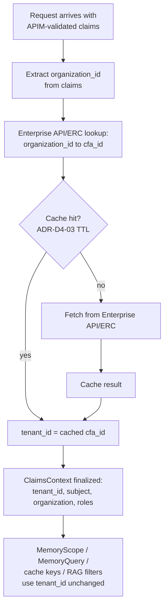

# ADR-D4-14 — Tenant identity resolution — CFA as the concrete tenant boundary

## 1. Summary

`ADR-D8-09` decided **what** a tenant is — a CFA (County Football Association) — but
left unspecified **where its value comes from** and **how an actor spanning several
CFAs is resolved per request**. This ADR closes both gaps: `tenant_id` is the CFA
identifier, resolved via an **Enterprise API/ERC lookup keyed by `organization_id`**
(the club), never a direct APIM claim and never client input; a cross-CFA actor
(e.g. a national administrator) always resolves `tenant_id` to the specific CFA of the
resource being acted on for that request — never optional, never a wildcard.

## 2. Context and Problem Statement

While wiring `MemoryService` into the affiliation agent's HIL suspend/resume path, a
`tenant_id` field was added to `ClaimsContext`, `MemoryScope` and `MemoryQuery` as a
flat placeholder — an `x-tenant` header read verbatim, with no ADR behind what
"tenant" means for this system or where the value should actually come from.

`ADR-D8-09` had already decided the strategy, five months earlier: "PFF AI will serve
multiple CFAs as logical tenants on shared infrastructure with strict enforced
isolation" (§7, Option E). Its §8 Architecture Detail even anticipated the exact field:
"Tenant id derived from validated claims (ADR-D6-03), never user input." But §8 stops
there — it does not say which claim, which lookup, or which enterprise call produces
the CFA identifier, and it does not address how a cross-CFA actor (national
administrator, per `ADR-D1-07` §7.2) resolves a single-valued `tenant_id` per request.

In the meantime, the codebase's actual enforced isolation boundary throughout memory
scope, cache keys, the ERC cross-org guardrail, RAG ACL filters and portal-link
entity-scope gating is `organization_id` (the club, ~40k of them) — never `tenant_id`,
which existed nowhere in code until the placeholder above was added. A club's CFA
affiliation is itself enterprise business fact, not something the AI platform may
invent, infer, or derive from a composite of unrelated identifiers (a proposal
considered and rejected in §5.3 below) — the Golden Rule's precedence chain
(Enterprise API/Event > ERC > Cache > RAG > SLM output) applies here exactly as
everywhere else.

## 3. Decision Drivers

### 3.1 Functional drivers

| ID | Driver | Source |
|---|---|---|
| DR-F-01 | `tenant_id` must resolve to the CFA that already governs `ADR-D8-09`'s isolation model | ADR-D8-09 §7 |
| DR-F-02 | The CFA identifier is enterprise business fact and must be fetched authoritatively, never invented or inferred | Golden Rule precedence chain; `CLAUDE.md` |
| DR-F-03 | A cross-CFA actor must resolve to exactly one CFA per request, matching how access archetypes already resolve per-resource | ADR-D1-07 §7.3 |

### 3.2 Non-functional drivers

| ID | Driver | Target | Source |
|---|---|---|---|
| DR-N-01 | The lookup must not force a fresh enterprise call on every single request | Cached with an ERC-appropriate TTL | ADR-D4-03 |
| DR-N-02 | `ClaimsContext`/`MemoryScope`/`MemoryQuery`'s existing 5-independent-field shape is unchanged | 0 schema shape changes | ADR-D4-13's "five independently filterable scope dimensions" precedent |

### 3.3 Constraints

| ID | Constraint | Type | Source |
|---|---|---|---|
| DR-C-01 | `tenant_id` must be server-owned, immutable authorization context — never re-derived from user input | Platform | ADR-D6-03 |
| DR-C-02 | `organization_id` remains the enforced isolation boundary already implemented in code; this ADR does not change that | Platform | Existing code: cache keys, memory scope, ERC guardrail, RAG ACL, portal links |

### 3.4 Assumptions

| ID | Assumption | If false | Validation |
|---|---|---|---|
| DR-A-01 | Every club (`organization_id`) has exactly one governing CFA, resolvable via an enterprise lookup | A club spans multiple CFAs; the lookup must return a set, not a scalar | Confirm with PFF enterprise data model at Phase 7 |

## 4. Evaluation Criteria and Weights

| ID | Criterion | Weight | Rationale | Measurement |
|---|---|---|---|---|
| EC-01 | Conformance to the Golden Rule's precedence chain | 35 | The CFA identifier is enterprise fact; the platform must fetch it, never guess it | Is the value ever derived from anything but an enterprise source? |
| EC-02 | Preserves independent scope-dimension filterability | 25 | `MemoryScope`/`MemoryQuery` deliberately keep tenant/user/org/conversation/workflow separate so each stays independently queryable | Does the option composite fields that must stay independent? |
| EC-03 | Consistency with the already-Accepted `ADR-D8-09` CFA model | 20 | Re-litigating tenant=CFA is out of scope for this ADR | Does the option contradict D8-09 §7? |
| EC-04 | Operational cost of the lookup | 20 | An uncached per-request enterprise call would add latency to every request | Calls per request; cache hit rate |
| | **Total** | **100** | | |

Scoring scale: **1** unacceptable · **2** poor · **3** adequate · **4** good · **5** excellent.

## 5. Alternatives Considered

### 5.1 Option A (adopted) — Enterprise API/ERC lookup keyed by `organization_id`, cached

**Description.** `tenant_id` = the CFA identifier returned by an Enterprise API/ERC
lookup (`organization_id → cfa_id`), performed in the claims-resolution/composition
layer before `ClaimsContext` is finalized, and cached with an ERC-appropriate TTL per
`ADR-D4-03`'s freshness rules — not re-fetched on every call, not stale indefinitely.

**Strengths.** The CFA identifier is fetched from the authoritative enterprise source,
never invented (EC-01); no field becomes a composite, so `MemoryScope`/`MemoryQuery`'s
five independent dimensions are untouched (EC-02); directly realizes `ADR-D8-09`'s
already-Accepted model rather than reopening it (EC-03); caching keeps the lookup cost
bounded (EC-04).

**Weaknesses.** Adds one enterprise-lookup dependency to claims resolution (mitigated
by caching); requires cache invalidation if a club's CFA affiliation changes (rare,
handled by `ADR-D4-06`'s event-driven refresh).

**Cost / effort.** Low-medium.

### 5.2 Option B — Direct APIM/JWT claim carrying the CFA identifier

**Description.** APIM enriches the validated token with a `cfa_id` claim directly, so
no separate lookup is needed.

**Strengths.** Removes a lookup hop entirely; the value arrives already validated
alongside `subject`/`organization` (EC-04 strongest of all options).

**Weaknesses.** No confirmed enterprise identity support for a CFA claim today —
adopting this now would mean designing against a capability that does not exist
(EC-01 fails on feasibility, not principle).

**Cost / effort.** Not assessable until APIM confirms the claim exists; named as the
revisit target in §18.

### 5.3 Option C — Compose `tenant_id` from user + workflow + club

**Description.** The originally proposed design: make `tenant_id` "real" by combining
`user_id` + `workflow_instance_id` + `organization_id` into one composite value.

**Strengths.** Superficially "unique per request," touching every dimension the user
was concerned about.

**Weaknesses.** Conflates scope dimensions that `MemoryScope`/`MemoryQuery`/the cache
key schema deliberately keep separate specifically so each remains independently
filterable — e.g. "everything for this CFA regardless of club" and "everything for
this club regardless of workflow" both need to stay queryable, and a composite key
destroys both queries (EC-02 fails outright). It also does not answer the actual
question `ADR-D8-09` already answered — what a tenant *is* — it just makes the field
harder to query while leaving the isolation boundary exactly where it already is
(`organization_id`) (EC-03 fails: contradicts the already-Accepted CFA model instead of
realizing it).

**Cost / effort.** Low to build, but solves the wrong problem.

### 5.4 Option D — `tenant_id` = a single FA-wide constant (status quo)

**Description.** Leave the current placeholder as-is: one fixed value (or an
unvalidated `x-tenant` header) for the entire FA.

**Strengths.** Nothing to build; already in place.

**Weaknesses.** Provides no real isolation whatsoever — every CFA would share one
tenant partition, directly contradicting `ADR-D8-09`'s Accepted decision that tenant
isolation exists precisely to keep CFAs apart (EC-01, EC-03 both fail). This is the
status quo failure this ADR exists to correct.

**Cost / effort.** Lowest, and it is the problem, not a solution.

## 6. Evaluation Method and Decision Matrix

**Method.** Weighted scoring against §4, informed directly by the two open points
`ADR-D8-09` §8 left unspecified.

| Criterion | Weight | A: Enterprise lookup | B: Direct claim | C: Composite key | D: FA-wide constant |
|---|---|---|---|---|---|
| EC-01 Golden-Rule conformance | 35 | 5 | 5 | 2 | 1 |
| EC-02 Independent scope filterability | 25 | 5 | 5 | 1 | 3 |
| EC-03 Consistency with ADR-D8-09 | 20 | 5 | 4 | 1 | 1 |
| EC-04 Operational cost | 20 | 4 | 5 | 4 | 5 |
| **Weighted total** | **100** | **475** | **465** | **160** | **220** |

- **Option A:** (35×5) + (25×5) + (20×5) + (20×4) = 175 + 125 + 100 + 80 = **475**
- **Option B:** (35×5) + (25×5) + (20×4) + (20×5) = 175 + 125 + 80 + 100 = **465**

**Sensitivity.** A and B are close, separated only by B's unconfirmed feasibility today
— if APIM is later confirmed to carry a CFA claim, B overtakes A on operational cost
alone and this ADR's own revisit trigger (§18) fires. C and D both fail categorically
on Golden-Rule conformance and consistency with the already-Accepted `ADR-D8-09` model;
neither is a close call.

## 7. Decision

**`tenant_id` is the CFA identifier, resolved via an Enterprise API/ERC lookup keyed by
`organization_id`, cached per `ADR-D4-03`'s freshness rules (Option A).** Direct APIM
claim (B) is rejected for now and named as the revisit target if APIM is confirmed to
carry a CFA claim; composing `tenant_id` from user + workflow + club (C) and a single
FA-wide constant (D) are both rejected outright.

**Cross-CFA actor resolution rule:** `tenant_id` is always resolved to the specific CFA
of the resource/club actually being acted on for that request — never optional, never
a wildcard — matching how `ADR-D1-07` §7.3 already resolves access-archetype scope
per-resource rather than per-user. A national administrator acting across CFAs still
gets exactly one `tenant_id` per request, resolved from the club that request concerns.

## 8. Architecture Detail

### 8.1 Where the lookup sits

The lookup happens in the claims-resolution/composition layer, **before**
`ClaimsContext` is finalized — the same place that today reads the placeholder
`x-tenant` header. Only the *source* of the value changes; `ClaimsContext.tenant_id`,
`MemoryScope.tenant_id` and `MemoryQuery.tenant_id` keep their current shape and every
downstream consumer (cache key builder, `RedisMemoryStore`/`InMemoryMemoryStore` scope
matching, ERC cross-org guardrail, RAG ACL filters) is unaffected — they already treat
`tenant_id` as an opaque string.

### 8.2 Caching

The `organization_id → cfa_id` mapping changes rarely (a club does not change its
governing CFA in the ordinary course of business) and is cached with an ERC-appropriate
TTL per `ADR-D4-03`, invalidated on the relevant enterprise event per `ADR-D4-06` rather
than on a short polling interval. This keeps DR-N-01 satisfied — the lookup is not a
per-request enterprise call in the common case.

### 8.3 No change to isolation enforcement

`organization_id` remains the isolation boundary enforced throughout the codebase today
(cache keys, `MemoryStore` scope segments, the ERC cross-org guardrail's
`GR-ERC-CROSS-ORG` reason code, RAG/vector ACL filters, portal-link entity-scope
gating). This ADR populates `tenant_id` correctly for the isolation layers `ADR-D8-09`
already specified (tenant-scoped keys/namespaces, tenant-filtered RAG) — it does not
relocate or duplicate the `organization_id` boundary.

## 9. Consequences

### 9.1 Positive

- `tenant_id` finally carries the value `ADR-D8-09` always intended, sourced
  authoritatively rather than left as a dead placeholder.
- No schema or key-shape changes anywhere — `MemoryScope`/`MemoryQuery`'s five
  independent dimensions, and every consumer of `tenant_id`, are unaffected.
- Cross-CFA actors (national administrators) get an unambiguous, per-resource
  `tenant_id` resolution rule, consistent with how access archetypes already resolve.

### 9.2 Negative

- Adds one enterprise-lookup dependency to claims resolution, mitigated by caching.
- Requires event-driven cache invalidation for the rare case a club's CFA affiliation
  changes.

### 9.3 Neutral

- The code-level implementation (replacing the current placeholder `x-tenant` header
  read with the real lookup) is a distinct, larger follow-up — this ADR records the
  decision, not the build.

### 9.4 Trade-offs explicitly accepted

| Given up | In exchange for | Accepted by |
|---|---|---|
| A zero-lookup, purely claim-based `tenant_id` (Option B) | An authoritative value available today, without waiting on an APIM claim that does not yet exist | AI Architecture Lead |
| The user's original "composite key" simplicity | Preserving independent scope-dimension filterability across tenant/user/org/conversation/workflow | Principal Architect |

## 10. Golden-Rule and Precedence Conformance

| Constraint | Conformance |
|---|---|
| Enterprise decides; AI orchestrates | `tenant_id` is fetched from an Enterprise API/ERC lookup, never invented or inferred by the platform. |
| Authoritative-truth precedence | The CFA identifier is Enterprise API/ERC-sourced data, ranked accordingly; cache is a TTL-bounded copy of that authoritative value, never a substitute for it. |
| Four-state separation | `tenant_id` remains part of Session State (claims-derived), never Enterprise Business State itself — it is a pointer into enterprise data, not a copy of business logic. |
| Versioned artefacts, never mutated in place | The lookup's cache entry is versioned/invalidated per `ADR-D4-03`/`ADR-D4-06`, not mutated ad hoc. |
| Adam persona governs how, never what | Not applicable — no user-facing communication in this ADR's scope. |

## 11. Risks and Mitigations

| ID | Risk | Likelihood | Impact | Exposure | Mitigation | Owner | Residual |
|---|---|---|---|---|---|---|---|
| RSK-01 | A club's CFA affiliation changes and the cached `tenant_id` goes stale | Low | Medium | Low | Event-driven invalidation per ADR-D4-06 | AI Architecture Lead | Low |
| RSK-02 | The lookup is implemented as a per-request call, adding latency to every request | Medium | Medium | Medium | DR-N-01/QM-01 below; caching required, not optional | AI Engineering Lead | Low |
| RSK-03 | A future implementer re-derives `tenant_id` from user input instead of the enterprise lookup | Low | High | Medium | ADR-D6-03's authorization-context guardrail verifies provenance | Security Architect | Low |

## 12. Quantitative Targets and Measures

| ID | Measure | Target | Threshold (alert) | Source | Review cadence |
|---|---|---|---|---|---|
| QM-01 | Enterprise lookup calls per request (cache hit path) | 0 | >0 sustained | Lookup cache hit-rate metric | Weekly |
| QM-02 | Requests where `tenant_id` was resolved from anything other than the enterprise lookup or its cache | 0 | ≥1 | Authorization-context guardrail (ADR-D6-03) audit | Daily |
| QM-03 | Cross-CFA requests where `tenant_id` was left unresolved or wildcarded | 0 | ≥1 | Harness audit log | Daily |

## 13. Security, Privacy and Compliance Impact

| Dimension | Impact |
|---|---|
| Attack surface change | Closes the placeholder `x-tenant` header path — `tenant_id` is no longer client-suppliable in effect once the lookup replaces it. |
| Data classification touched | None beyond the existing `organization_id`/CFA relationship, which is enterprise reference data. |
| Personal data / PII | Not applicable — CFA identifiers are organizational, not personal, data. |
| Children's data and safeguarding | No change; safeguarding-grade isolation remains governed by `ADR-D8-09` §8/`ADR-D6-16`. |
| UK GDPR lawful basis and rights impact | No change to lawful basis; this ADR only corrects the sourcing of an existing isolation dimension. |
| Audit and evidential requirements | `tenant_id` provenance (enterprise lookup vs. cache) is auditable via QM-02. |
| Standards touched | ISO/IEC 27001 A.8.3 (access control); carries forward `ADR-D8-09`'s standards coverage. |

## 14. Implementation Impact

| Aspect | Detail |
|---|---|
| Build phases | 7 (memory/cache), 23 (multi-tenant rollout, per ADR-D8-09) |
| Repository paths | `src/pff_fa_ai/common/claims.py` (claims composition — replace placeholder header read with the lookup), `src/pff_fa_ai/memory/models.py`, `src/pff_fa_ai/memory/store.py` (unchanged shape, confirmed compatible) |
| Configuration | Enterprise API/ERC catalogue entry for the `organization_id → cfa_id` lookup; cache TTL per ADR-D4-03 |
| Contracts / schemas | No change — `ClaimsContext`/`MemoryScope`/`MemoryQuery` already carry `tenant_id` |
| Migration | None — the placeholder is replaced, not migrated |
| Dependencies on other ADRs | ADR-D8-09 (realizes), ADR-D6-03 (server-owned claims), ADR-D4-03 (cache freshness), ADR-D4-06 (event-driven invalidation) |
| Effort estimate | Small-medium — one lookup + cache, no schema change |

## 15. Validation and Verification

| ID | Acceptance criterion | Verification method |
|---|---|---|
| AC-01 | `tenant_id` is always sourced from the Enterprise API/ERC lookup or its cache, never a client header | Authorization-context guardrail test; QM-02 |
| AC-02 | A cross-CFA actor's request resolves `tenant_id` to the specific CFA of the resource acted on | Multi-CFA scenario test |
| AC-03 | The lookup does not add a per-request enterprise call under normal cache operation | Latency/hit-rate test; QM-01 |
| AC-04 | `MemoryScope`/`MemoryQuery`/cache-key shapes are unchanged by this ADR | Regression test suite |

## 16. Operational Impact

| Aspect | Detail |
|---|---|
| Monitoring | Lookup cache hit rate; `tenant_id` provenance per request |
| Alerting | QM-02, QM-03 alert on any occurrence |
| Runbook | Extends `docs/runbooks/multi-tenant.md` with the lookup's cache-invalidation procedure |
| Failure mode and degradation | If the enterprise lookup fails and no cached value exists, the platform refuses the operation rather than defaulting to a wildcard or guessed `tenant_id` — consistent with ADR-D1-07's "refuse rather than silently narrow/widen" posture |
| Rollback | Revert claims composition to the placeholder header read (not recommended — reintroduces the status-quo failure Option D describes) |
| Support model impact | CFA-affiliation discrepancies route to enterprise support, since the mapping is enterprise-owned |

## 17. Cost Impact

| Cost element | One-off | Recurring | Basis |
|---|---|---|---|
| Enterprise lookup + cache wiring | Small-medium | — | Phase 7 |
| Cache storage for the lookup | — | Negligible (≈50 CFAs × 40k clubs, small mapping) | Azure Managed Redis, existing store |

## 18. Revisit Triggers and Causal Analysis Hooks

| ID | Trigger | Detected by | Action on trigger |
|---|---|---|---|
| RT-01 | APIM is confirmed to carry a CFA claim directly | Enterprise identity change notice | Revisit toward Option B; removes the lookup hop |
| RT-02 | A club is found to span more than one CFA (DR-A-01 false) | Enterprise data model review | Re-evaluate `tenant_id` as potentially multi-valued; may require ADR-D8-09 revisit |
| RT-03 | QM-02 or QM-03 records any occurrence | Daily audit | Governance incident; the resolution rule has failed |

**Scheduled review:** 2027-09-06.

## 19. Traceability

| Dimension | Reference |
|---|---|
| Workshop sheet | WS-22 Memory/Cache/Store; WS-37 Multi-tenant extensibility |
| Specification sections | 9 PFF-FA-AI-MEMORY-CACHE.md §77–§78; 13.PFF-FA-AI-RAG.md §36–§37, §152–§153 |
| Requirement IDs | MT-* (per ADR-D8-09) |
| Build phases | 7, 23 |
| Code paths | `src/pff_fa_ai/common/claims.py`, `src/pff_fa_ai/memory/models.py`, `src/pff_fa_ai/memory/store.py` |
| Configuration | Enterprise API/ERC catalogue entry; cache TTL |
| Tests | AC-01 to AC-04 |
| Upstream ADRs | ADR-D8-09, ADR-D6-03, ADR-D1-07 |
| Downstream ADRs | None yet |

## 20. Change Log

| Version | Date | Author | Change |
|---|---|---|---|
| 1.0.0 | 2026-09-06 | AI Architecture Lead | Initial decision recorded. Realizes `ADR-D8-09`'s CFA-as-tenant strategy with a concrete source (Enterprise API/ERC lookup keyed by `organization_id`, cached) and a per-resource cross-CFA resolution rule; rejects composing `tenant_id` from user+workflow+club and rejects the FA-wide-constant status quo. |
