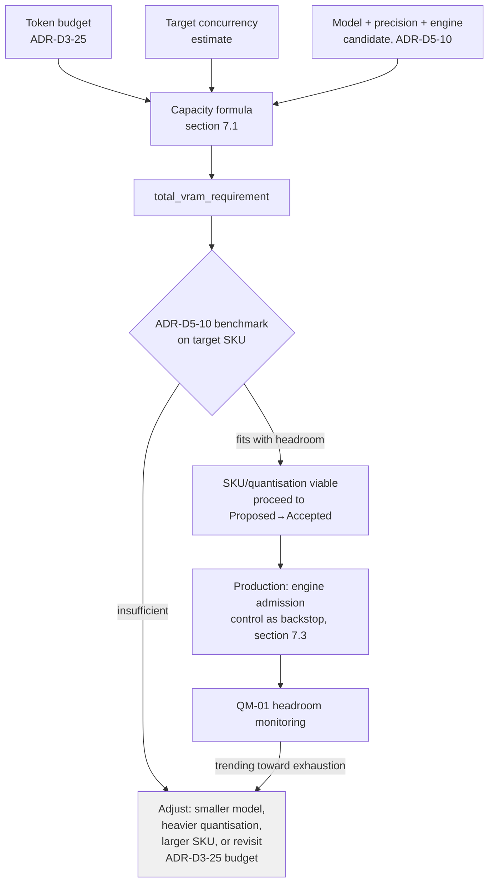

# ADR-D5-19 — Inference KV-cache and VRAM capacity planning for the self-hosted SLM

## 1. Summary

The self-hosted GPU pool's VRAM/KV-cache headroom is sized by an explicit formula
connecting **ADR-D3-25's declared token budget** (the maximum prompt size the platform
allows, including protected ERC content) and a **target concurrency** to the KV-cache
memory the chosen model, precision and serving engine (ADR-D5-10) actually require —
verified on the target Azure GPU SKU (ADR-D5-11) by the same benchmark that already
gates ADR-D5-10's `Proposed` status. This closes a gap where 15.PF-FT-AI-SLM.md §70–§77 name KV
cache, VRAM, context length and concurrency as capacity-planning factors three times
over, but no ADR ever turned them into a target.

## 2. Context and Problem Statement

15.PF-FT-AI-SLM.md §70 ("GPU Architecture") lists VRAM, GPU utilization, model loading time, KV
cache, batch size and concurrency as things to "plan for." §72 ("VRAM") repeats the
same list as what VRAM capacity "must account for": model weights, activations, KV
cache, runtime overhead, batch size, concurrency. §77 ("KV Cache") is the most
specific: "capacity planning should consider context length, number of layers,
attention heads, precision, concurrency." Three consecutive, converging statements of
the same need, and none of them states a method.

**ADR-D5-10** (serving stack selection) cites §77 exactly once, in its Architecture
Detail section, as a bare parenthetical — "GPU node pool + VRAM planning (ADR-D5-11;
15.PF-FT-AI-SLM.md §70–§77); KV cache (§77)" — with no criterion in its own weighted evaluation
matrix, no quantitative target, and no elaboration. **ADR-D5-11** (GPU node pool and
CPU/GPU workload separation) governs *topology* — separate node pools, independent
autoscaling — and its scaling signals (request rate, queue depth, GPU utilization,
latency, VRAM) are reactive: they describe how the pool *responds* to load, not how it
is *sized* to begin with. **ADR-D3-25** (context engineering) is the one ADR that
actually fixes a number relevant to this — a token budget allocated per context
source, protecting ERC and instructions first — but it stops at the prompt-assembly
boundary and never states what that budget implies for the infrastructure serving it.

The result is a chain with a missing link:

```
ADR-D3-25              ???                  ADR-D5-10 / ADR-D5-11
token budget      -->  capacity plan   -->  engine + GPU pool
(input side)           (missing)            (infrastructure side)
```

This is not a cosmetic gap. KV-cache memory scales with **context length × batch
size (concurrency) × number of layers × attention heads × precision** — 15.PF-FT-AI-SLM.md §77's
own list, restated as the actual formula. The platform's own design choice
(ADR-D3-25) protects ERC content as the highest-priority, hardest-to-trim part of the
prompt — which means the platform's realistic prompt sizes are pushed toward the
larger end of whatever budget is declared, precisely where KV-cache pressure is
worst. Without a stated capacity target, undersized VRAM under concurrent load
produces one of two outcomes the platform never decided to accept: request queuing/
latency spikes, or the serving engine silently rejecting or truncating context —
which would quietly override ADR-D3-25's protected-content decision from underneath
it, at the infrastructure layer, with no ADR having chosen that trade-off.

## 3. Decision Drivers

### 3.1 Functional drivers

| ID | Driver | Source |
|---|---|---|
| DR-F-01 | VRAM capacity planning must account for weights, activations, KV cache, runtime overhead, batch size, concurrency | 15.PF-FT-AI-SLM.md §72 |
| DR-F-02 | KV-cache capacity planning must consider context length, layers, attention heads, precision, concurrency | 15.PF-FT-AI-SLM.md §77 |
| DR-F-03 | The capacity plan must be derived from the platform's own declared token budget, not assumed independently | ADR-D3-25 |
| DR-F-04 | Capacity is verified by benchmark on the target model/SKU, consistent with ADR-D5-10's existing gate | ADR-D5-10 §7 |
| DR-F-05 | The platform must never let an infrastructure limit silently override ADR-D3-25's protected-content decision | ADR-D3-25 §7 |

### 3.2 Non-functional drivers

| ID | Driver | Target | Source |
|---|---|---|---|
| DR-N-01 | p95 generation latency within the platform's latency budget under target concurrency | Per ADR-D5-18's allocation | ADR-D5-18 |
| DR-N-02 | GPU cost proportionate to actual demand, not blanket over-provisioning | Tracked via FinOps (ADR-D5-10 QM-04) | FinOps |

### 3.3 Constraints

| ID | Constraint | Type | Source |
|---|---|---|---|
| DR-C-01 | Runs on AKS GPU nodes, separately pooled from CPU workloads | Platform | ADR-D5-11 |
| DR-C-02 | The serving engine and quantisation are ADR-D5-10's decision, still `Proposed` pending benchmark | Platform | ADR-D5-10 |
| DR-C-03 | ERC and instructions remain the protected, highest-priority context (never silently dropped for capacity reasons) | Platform | ADR-D3-25 §7 |

### 3.4 Assumptions

| ID | Assumption | If false | Validation |
|---|---|---|---|
| DR-A-01 | ADR-D3-25's declared token budget is a stable input to size against | A budget change re-triggers capacity re-planning | RT-01 |
| DR-A-02 | Target concurrency can be reasonably estimated from expected peak conversations | Capacity plan is revised once real traffic data exists | RT-02 |

## 4. Evaluation Criteria and Weights

| ID | Criterion | Weight | Rationale | Measurement |
|---|---|---|---|---|
| EC-01 | Correctness — no silent truncation or rejection of protected context under load | 28 | Directly protects ADR-D3-25's decision from being overridden at the infrastructure layer | Does capacity match the declared budget × concurrency? |
| EC-02 | Cost efficiency (no blanket over-provisioning) | 24 | GPU spend is the platform's largest infra cost line | £ per unit of actual capacity needed |
| EC-03 | Operability — a concrete target ops can plan and alert against | 22 | Reactive scaling alone is not a plan | Is there a named target, not just a reactive signal? |
| EC-04 | Ties to the existing benchmark gate (no new process) | 16 | Reuse ADR-D5-10's `Proposed` gate rather than inventing a parallel one | Delta from ADR-D5-10 §7 |
| EC-05 | Simplicity | 10 | Avoid a capacity model heavier than the platform needs | Concepts introduced |
| | **Total** | **100** | | |

Scoring scale: **1** unacceptable · **2** poor · **3** adequate · **4** good · **5** excellent.

## 5. Alternatives Considered

### 5.1 Option A — Explicit capacity formula, derived from the token budget, verified by benchmark

**Description.** Required KV-cache VRAM is computed as
`max_context_tokens (ADR-D3-25) × target_concurrency × per-token-KV-cache-bytes(model,
precision, layers, attention heads)`, added to weights + activation + runtime-overhead
headroom (15.PF-FT-AI-SLM.md §72), and checked against the candidate GPU SKU's VRAM at the
benchmark ADR-D5-10 already runs before its `Proposed` status can close. A named
measure tracks headroom in production and alerts before exhaustion.

**Strengths.** Directly answers 15.PF-FT-AI-SLM.md §77's list with a formula, not a citation
(EC-01, EC-03); sized to actual declared demand, not guesswork (EC-02); reuses
ADR-D5-10's existing benchmark gate rather than adding a second process (EC-04);
protects ADR-D3-25's decision by making capacity a function of it, not an independent
guess that could fall short of it.

**Weaknesses.** Requires per-model/precision KV-cache-bytes-per-token figures, which
vary by architecture and must be obtained from the engine/model documentation or
measured directly — real but bounded work, done once per candidate model.

**Cost / effort.** Low-moderate.

### 5.2 Option B — No explicit formula; rely purely on autoscaling to react to load

**Description.** Provision a baseline pool and let ADR-D5-11's autoscaling signals
(queue depth, GPU utilization, latency) add replicas as load rises.

**Strengths.** Nothing new to compute; ADR-D5-11 already exists.

**Weaknesses.** Autoscaling reacts *after* pressure is observed — a burst of
concurrent, ERC-heavy prompts can exhaust KV-cache VRAM before a new replica is
warmed (ADR-D5-10 §8's warm-up sequence is not instant), producing exactly the
latency spikes or forced truncation §2 describes; answers "how do we grow the pool"
but never "how big should it be to begin with" (EC-03 fails).

**Cost / effort.** Lowest, and it is the status quo gap.

### 5.3 Option C — Fix a conservative, static max-context-length ceiling to whatever VRAM the chosen SKU happens to have

**Description.** Pick a GPU SKU first, measure its VRAM, and set the platform's
effective context-length ceiling to whatever fits comfortably — independent of
ADR-D3-25's declared budget.

**Strengths.** Simple; no formula to maintain.

**Weaknesses.** Inverts the correct dependency — infrastructure should be sized to the
platform's declared needs, not the platform's needs quietly capped to whatever
infrastructure was already bought; risks silently truncating ERC-protected content
below what ADR-D3-25 intended, with no ADR having chosen that trade-off (DR-F-05
fails directly).

**Cost / effort.** Low, and it is the exact silent-override risk §2 warns against.

### 5.4 Option D — Over-provision GPU capacity generously as a blanket safety buffer

**Description.** Add a large fixed margin (for example, double the naively-estimated
requirement) to VRAM/replica count, without computing a specific target.

**Strengths.** Tolerant of estimation error; simple to state.

**Weaknesses.** "Generous" is not a number — it gives ops nothing to plan or alert
against (EC-03 fails) and no way to know, after the fact, whether the margin was right,
too small, or wildly excessive; GPU cost is the platform's largest infrastructure line
item, and an unexamined blanket buffer is the most expensive way to buy safety (EC-02
fails).

**Cost / effort.** High recurring cost for an untargeted guarantee.

### 5.5 Option E — Delegate entirely to the serving engine's built-in admission control

**Description.** Rely on the chosen engine's own KV-cache pressure handling (for
example, vLLM's request queuing and OOM-prevention admission control) with no
platform-level capacity target at all.

**Strengths.** The engine's admission control is real and should run regardless, as
defence in depth; no additional platform-level computation.

**Weaknesses.** Admission control decides what happens *when capacity runs out* — reject,
queue, or degrade a live request — it does not decide *how much capacity to provision
in the first place*; used alone, this means the platform's actual behaviour under
load is whatever the engine's defaults produce, not a decision the platform made
(EC-01, EC-03 fail as a sole mechanism, though the mechanism itself is worth keeping
as a backstop under Option A).

**Cost / effort.** Low to enable, insufficient alone.

### 5.6 Options considered and eliminated before scoring

| Option | Eliminated by |
|---|---|
| Option C (cap the platform's needs to whatever SKU was already chosen) | DR-F-05 — must never silently override ADR-D3-25's protected-content decision |

## 6. Evaluation Method and Decision Matrix

**Method.** Weighted scoring against §4, cross-checked against the concrete failure
§2 describes: a burst of concurrent, ERC-heavy prompts at the declared token-budget
ceiling — does each option provision for it, react to it, or silently truncate it?

| Criterion | Weight | A: Explicit formula | B: Autoscale-only | C: Static SKU-capped ceiling | D: Blanket over-provision | E: Engine admission control only |
|---|---|---|---|---|---|---|
| EC-01 Correctness / no silent truncation | 28 | 5 | 2 | 1 | 4 | 2 |
| EC-02 Cost efficiency | 24 | 5 | 3 | 4 | 1 | 4 |
| EC-03 Operability (concrete target) | 22 | 5 | 2 | 3 | 2 | 1 |
| EC-04 Reuses existing benchmark gate | 16 | 5 | 3 | 2 | 3 | 3 |
| EC-05 Simplicity | 10 | 3 | 5 | 5 | 4 | 4 |
| **Weighted total** | **100** | **480** | **262** | **255** | **282** | **238** |

- **Option A:** (28×5) + (24×5) + (22×5) + (16×5) + (10×3) = 140 + 120 + 110 + 80 + 30 = **480**
- **Option D:** (28×4) + (24×1) + (22×2) + (16×3) + (10×4) = 112 + 24 + 44 + 48 + 40 = **282**

**Sensitivity.** A leads every alternative by more than 190 points and wins outright
on the three highest-weighted criteria (EC-01, EC-02, EC-03). No plausible reweighting
changes the outcome. Option E's admission control is retained *within* A as a
defence-in-depth backstop (§7.3) — it is eliminated only as a sole mechanism, not as a
technique.

## 7. Decision

### 7.1 Capacity is derived, not assumed

```
required_kv_cache_vram
  = max_context_tokens (ADR-D3-25 declared budget)
    × target_concurrency (estimated peak concurrent conversations)
    × per_token_kv_cache_bytes(model, precision, num_layers, num_attention_heads)

total_vram_requirement
  = model_weights_vram(model, quantisation)
  + activations_vram (headroom, 15.PF-FT-AI-SLM.md §72)
  + required_kv_cache_vram
  + runtime_overhead (engine-specific, 15.PF-FT-AI-SLM.md §72)
```

`per_token_kv_cache_bytes` is obtained from the candidate model/engine's own
documentation or measured directly during ADR-D5-10's benchmark — it is not estimated
from first principles alone, because engine-level optimisations (for example vLLM's
PagedAttention block allocation) change the effective figure.

### 7.2 Verified by the same benchmark that gates ADR-D5-10

This ADR adds no new process. ADR-D5-10's `Proposed` status already requires a
throughput/latency/quality benchmark on the selected model and Azure GPU SKU before
it can close (ADR-D5-10 §7, §15 AC-01). That benchmark now explicitly includes: run at
`max_context_tokens` (ADR-D3-25) and `target_concurrency`, and confirm the SKU's VRAM
covers `total_vram_requirement` with the headroom margin in §7.4. A candidate SKU or
quantisation that fails this check is not viable regardless of its throughput score.

### 7.3 Engine admission control is kept as a backstop, not the plan

Per Option E's retained technique: the serving engine's own admission control
(queuing, backpressure, OOM prevention) still runs in production, as defence in depth
against estimation error or a genuine traffic spike beyond `target_concurrency`. It is
explicitly not the capacity plan itself — §7.1's formula is.

### 7.4 Headroom margin and re-planning

Capacity is planned with a stated headroom margin above the computed
`total_vram_requirement` (the margin percentage is fixed at the same benchmark that
confirms the base requirement, per §7.2, and recorded in QM-01). The plan is
re-derived, not just re-scaled, whenever `max_context_tokens` (ADR-D3-25) or
`target_concurrency` (DR-A-02) changes materially — it is not a one-time calculation
frozen at Phase 20.

**Status rationale.** Accepted. This ADR fixes the *method and formula* for capacity
planning, which is independent of which engine or GPU SKU ultimately wins. It does not
resolve ADR-D5-10's own open engine/SKU selection — the concrete VRAM numbers this
formula produces are filled in as part of ADR-D5-10's existing benchmark gate, and
ADR-D5-10 remains `Proposed` until that benchmark completes.

## 8. Architecture Detail

### 8.1 Capacity-planning flow



### 8.2 Interaction with ADR-D5-11's autoscaling

ADR-D5-11's autoscaling signals (queue depth, GPU utilization, latency, VRAM) govern
**how many replicas** run at a given moment, reacting to real-time load. This ADR
governs **how much VRAM headroom each replica must have** to serve the platform's
declared token budget at the target per-replica concurrency without truncation. The
two are complementary: §7.1's formula sizes a single replica correctly; ADR-D5-11
decides how many correctly-sized replicas are running.

### 8.3 What changes if ADR-D3-25's budget changes

Per DR-A-01 and RT-01: a future increase to the token budget (for example, a larger
ERC section becoming protected content) is not merely a prompt-engineering change — it
is also a capacity-planning input. §7.1's formula makes that dependency explicit and
mechanical, rather than something discovered only when production latency degrades.

## 9. Consequences

### 9.1 Positive

- KV-cache/VRAM capacity is sized to what the platform actually declared it needs
  (ADR-D3-25), not guessed independently of it.
- A concrete, benchmark-verified target exists for ops to plan and alert against.
- ADR-D3-25's protected-content decision cannot be silently overridden by an
  under-provisioned GPU pool.
- No new process — the existing ADR-D5-10 benchmark gate absorbs this work.

### 9.2 Negative

- Requires obtaining or measuring per-token KV-cache-bytes figures per candidate
  model/precision — real, if bounded, benchmark work.
- A token-budget change now has a capacity-planning consequence to track, not just a
  prompt-engineering one.

### 9.3 Neutral

- Engine-level admission control continues to run as defence in depth, unchanged in
  behaviour, just no longer relied on as the sole capacity strategy.

### 9.4 Trade-offs explicitly accepted

| Given up | In exchange for | Accepted by |
|---|---|---|
| The simplicity of an unexamined blanket VRAM buffer | A specific, benchmark-verified target the platform can actually defend the cost of | AI Architecture Lead |
| Treating capacity as independent of the token-budget decision | Capacity planning that mechanically tracks ADR-D3-25 whenever it changes | Principal Architect |

## 10. Golden-Rule and Precedence Conformance

| Constraint | Conformance |
|---|---|
| Enterprise decides; AI orchestrates | This ADR governs inference infrastructure sizing only; it makes no business decision. |
| Authoritative-truth precedence | By preventing silent context truncation under capacity pressure, this ADR protects ADR-D3-25's precedence-ordered context assembly from being overridden at the infrastructure layer. |
| Four-state separation | Not applicable — capacity planning, not application state. |
| Versioned artefacts, never mutated in place | The capacity formula's inputs (model, precision, engine) are the same versioned artefacts ADR-D5-10/ADR-D3-15 already govern. |
| Adam persona governs how, never what | Not applicable. |

## 11. Risks and Mitigations

| ID | Risk | Likelihood | Impact | Exposure | Mitigation | Owner | Residual |
|---|---|---|---|---|---|---|---|
| RSK-01 | Per-token KV-cache-bytes estimate is wrong for the actual engine/model combination | Medium | Medium | Medium | Measured directly during ADR-D5-10's benchmark, not assumed from generic figures | ML Engineer | Low |
| RSK-02 | Target concurrency estimate proves too low once real traffic arrives | Medium | Medium | Medium | RT-02 re-plans capacity from observed concurrency; ADR-D5-11 autoscaling absorbs short-term variance | Platform Engineer | Low |
| RSK-03 | ADR-D3-25's token budget changes without triggering capacity re-planning | Low | High | Medium | §7.4 ties re-planning explicitly to budget changes; RT-01 | AI Architecture Lead | Low |
| RSK-04 | Headroom margin proves insufficient under a genuine traffic spike | Low | Medium | Medium | Engine admission control backstop (§7.3); ADR-D5-11 autoscaling | SRE | Low |

## 12. Quantitative Targets and Measures

| ID | Measure | Target | Threshold (alert) | Source | Review cadence |
|---|---|---|---|---|---|
| QM-01 | KV-cache VRAM headroom (production) | ≥ margin set at benchmark (§7.4) | Below margin | GPU/engine metrics | Continuous |
| QM-02 | Requests queued or rejected due to KV-cache pressure | ≈0 in steady state | Sustained rise | Engine admission-control metrics | Daily |
| QM-03 | Context truncated below ADR-D3-25's budget due to capacity limits | 0 | ≥1 | Prompt-assembly logs | Continuous |
| QM-04 | Capacity plan re-derived within N days of a token-budget or concurrency-estimate change | 100% | Missed | Change log / RT-01 audit | Per change |

## 13. Security, Privacy and Compliance Impact

| Dimension | Impact |
|---|---|
| Attack surface change | Not applicable — capacity planning, no new external surface. |
| Data classification touched | None directly. |
| Personal data / PII | Not applicable. |
| Children's data and safeguarding | Indirect — prevents capacity pressure from truncating ERC-protected context, which can include safeguarding-relevant information the platform decided must not be silently dropped (ADR-D3-25). |
| UK GDPR lawful basis and rights impact | Not applicable. |
| Audit and evidential requirements | Capacity-planning inputs and benchmark results are recorded as part of ADR-D5-10's evidence trail. |
| Standards touched | ISO/IEC 42001 (AI management — capacity as a component of reliable operation). |

## 14. Implementation Impact

| Aspect | Detail |
|---|---|
| Build phases | 20 (self-host cutover, same as ADR-D5-10) |
| Repository paths | `src/pf_ft_ai/slm/` (capacity-planning utility); `infra/` (GPU pool sizing) |
| Configuration | `max_context_tokens`, `target_concurrency`, per-model KV-cache-bytes figures |
| Contracts / schemas | None new — extends ADR-D5-10's benchmark harness and ADR-D5-11's node-pool config |
| Migration | None — applies at the self-host cutover, before which the HF-hosted API path (ADR-D3-13) is unaffected |
| Dependencies on other ADRs | ADR-D3-25 (token budget), ADR-D5-10 (benchmark gate), ADR-D5-11 (node pool) |
| Effort estimate | Small — extends existing benchmark work |

## 15. Validation and Verification

| ID | Acceptance criterion | Verification method |
|---|---|---|
| AC-01 | The capacity formula (§7.1) is computed for every candidate model/engine/SKU combination in ADR-D5-10's benchmark | Benchmark harness output |
| AC-02 | No candidate is accepted where `total_vram_requirement` (with headroom) exceeds the SKU's VRAM | Benchmark gate check |
| AC-03 | Production KV-cache headroom stays at or above the set margin under target concurrency | Load test at `target_concurrency`; QM-01 |
| AC-04 | A token-budget or concurrency-estimate change triggers a recorded capacity re-derivation | Change-log audit; QM-04 |

## 16. Operational Impact

| Aspect | Detail |
|---|---|
| Monitoring | KV-cache/VRAM headroom, queued/rejected requests, context-truncation events |
| Alerting | QM-01 (headroom), QM-02 (queuing/rejection), QM-03 (truncation) on any occurrence |
| Runbook | Extends `docs/runbooks/slm-serving.md` (ADR-D5-10) with the capacity-planning formula and re-derivation procedure |
| Failure mode and degradation | Headroom exhaustion triggers engine admission control (§7.3) before any silent truncation; queuing/latency is the visible, monitored degradation |
| Rollback | Reduce `target_concurrency` or `max_context_tokens` temporarily while re-planning; no code rollback required |
| Support model impact | ML platform + SRE, same on-call model as ADR-D5-10 |

## 17. Cost Impact

| Cost element | One-off | Recurring | Basis |
|---|---|---|---|
| Capacity-formula implementation | Small, folded into Phase 20 benchmark work | — | `DEVELOPMENT-GUIDE.md` §4 |
| Right-sized GPU provisioning | — | Ongoing, but targeted rather than blanket | Avoids Option D's unexamined over-provisioning cost |
| Avoided cost | — | Ongoing | Avoids both under-provisioning incidents (latency/truncation) and over-provisioning waste |

## 18. Revisit Triggers and Causal Analysis Hooks

| ID | Trigger | Detected by | Action on trigger |
|---|---|---|---|
| RT-01 | ADR-D3-25's token budget changes materially | Change to ADR-D3-25 | Re-derive `total_vram_requirement`; re-run benchmark if the change is large |
| RT-02 | Observed production concurrency diverges materially from the estimate used at planning | Traffic metrics | Re-derive capacity plan with observed concurrency |
| RT-03 | QM-02/QM-03 fire in production | Continuous monitoring | Treat as a capacity-planning incident; re-derive and re-provision |

**Scheduled review:** 2027-08-23.

## 19. Traceability

| Dimension | Reference |
|---|---|
| Workshop sheet | WS-24 Technology — Compute |
| Specification sections | 15.PF-FT-AI-SLM.md §70 (GPU Architecture), §71 (CPU Architecture), §72 (VRAM), §73–§74 (Quantization, Trade-Off), §77 (KV Cache), §78 (Self-Hosted Scaling), §79 (Autoscaling) |
| Requirement IDs | `FR-P-07` |
| Build phases | 20 |
| Code paths | `src/pf_ft_ai/slm/`, `infra/` |
| Configuration | `max_context_tokens`, `target_concurrency`, per-model KV-cache-bytes |
| Tests | AC-01 to AC-04 |
| Upstream ADRs | ADR-D3-25, ADR-D5-10, ADR-D5-11 |
| Downstream ADRs | ADR-D5-17 (autoscaling), ADR-D5-18 (latency budget) |

## 20. Change Log

| Version | Date | Author | Change |
|---|---|---|---|
| 1.0.0 | 2026-08-23 | AI Architecture Lead | Initial decision recorded, closing a gap found in a post-completion audit: 15.PF-FT-AI-SLM.md §70/§72/§77 name KV-cache and VRAM capacity planning as necessary three times over, and ADR-D5-10 cites §77 once with no elaboration, but no ADR connected ADR-D3-25's token-budget decision to a concrete GPU capacity target. |
