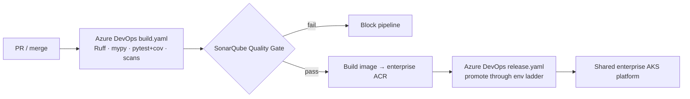

# ADR-D5-20 — Adopt the Enterprise Application delivery model — Azure DevOps CI/CD on AKS with SonarQube

> **ACCEPTED (v1.0.0).** Binding cross-cutting decision. PFF AI is built, quality-gated,
> released and operated **on the enterprise's existing application delivery model** — it
> does not stand up a new or parallel infrastructure, CI, CD or deployment toolchain. This
> ADR realizes the infrastructure/deployment decisions **ADR-D5-12** (IaC) and
> **ADR-D5-13** (Kubernetes) into the enterprise standard, and refines the CI/CD decisions
> **ADR-D7-09**, **ADR-D7-10** and **ADR-D7-11** onto the enterprise toolchain — their
> policy intent (mandatory gates, green-to-merge, rolling deploys, release train) is
> unchanged; only the realizing toolchain is named here.

## 1. Summary

The enterprise already operates a proven application delivery platform: **Azure DevOps
build (`build.yaml`) and release (`release.yaml`) pipelines that deploy to a shared Azure
Kubernetes Service (AKS) platform**, provisioned and maintained by an established platform
team with shared infrastructure and a **SonarQube** code-quality gate. PFF AI **conforms
to that model as a strict standard**: it is onboarded as another workload of the same
platform, using the same pipelines, AKS clusters, IaC approach, team, resources, promotion
gates and quality gate — extended only with a **Python build/test pipeline** (Ruff, mypy,
pytest, coverage) whose results feed the **same SonarQube quality gate** as every other
enterprise application. PFF AI does **not** introduce a separate infrastructure stack, a
separate CI/CD system, or a separate deployment mechanism. Any future infra, CI, CD or
deployment tooling proposal **defers to and conforms with the enterprise standard** rather
than adding new tooling.

## 2. Context and Problem Statement

The infrastructure ADRs (ADR-D5-12 IaC, ADR-D5-13 Kubernetes) were recorded `Proposed`,
each carrying a standalone tool recommendation (Terraform, Kustomize) pending
"platform-team confirmation of house standard". The CI/CD ADRs (ADR-D7-09/D7-10/D7-11)
were `Accepted` but written against a repo-local GitHub Actions realization. Meanwhile the
enterprise **already** runs the platform PFF AI will live on: Azure DevOps `build.yaml`/
`release.yaml` pipelines deploying to AKS, with SonarQube quality gates, one platform team,
and shared resources.

Standing up a second, PFF-AI-specific stack (a separate IaC toolchain, a separate CI/CD
system, a separate deployment mechanism) would fragment ownership, duplicate operational
burden, diverge from enterprise security/compliance baselines, and split the team's skills
— for no benefit, since PFF AI is a workload on the *same* Azure/AKS platform. The
platform team has therefore confirmed the house standard: **PFF AI conforms to the existing
enterprise application delivery model.** This ADR records that as the binding decision and
threads it through the affected infrastructure and CI/CD ADRs.

## 3. Decision Drivers

### 3.1 Functional drivers

| ID | Driver | Source |
|---|---|---|
| DR-F-01 | Provision and deploy on the shared enterprise AKS platform | 25.PFF-FA-AI-INFRASTRUCTURE-OPERATIONS.md §42-§50; ADR-D5-08 |
| DR-F-02 | Use the enterprise Azure DevOps `build.yaml`/`release.yaml` pipelines | 25.PFF-FA-AI-INFRASTRUCTURE-OPERATIONS.md §65-§68 |
| DR-F-03 | Onboard the Python service into the same CI/CD with equivalent gates | 27.PFF-FA-AI-DEVELOPMENT-STANDARDS.md §12-§13; ADR-D7-09 |
| DR-F-04 | Gate code quality through the enterprise SonarQube instance | 27.PFF-FA-AI-DEVELOPMENT-STANDARDS.md §4, §12; ADR-D6-15 |

### 3.2 Non-functional drivers

| ID | Driver | Target | Source |
|---|---|---|---|
| DR-N-01 | Operational consistency with enterprise applications | Same team, tooling, runbooks | 25.PFF-FA-AI-INFRASTRUCTURE-OPERATIONS.md §33-§38 |
| DR-N-02 | No net-new infra/CI/CD stack to build, secure and maintain | Zero parallel toolchains | organisational |
| DR-N-03 | Reuse enterprise security/compliance baselines | Inherit hardening, approvals | ADR-D6-15 |

### 3.3 Constraints

| ID | Constraint | Type | Source |
|---|---|---|---|
| DR-C-01 | The mandatory quality gates (ADR-D7-09) still apply, realized on the enterprise toolchain | Platform | ADR-D7-09 |
| DR-C-02 | Deployment strategy (ADR-D7-10) and release train (ADR-D7-11) intent is unchanged | Platform | ADR-D7-10, ADR-D7-11 |
| DR-C-03 | Secrets remain Key Vault-backed by reference; no secrets in pipelines or manifests | Security | ADR-D5-07 |
| DR-C-04 | Images are immutable, versioned, pushed to the enterprise ACR; never `latest` | Platform | ADR-D5-09 |

### 3.4 Assumptions

| ID | Assumption | If false | Validation |
|---|---|---|---|
| DR-A-01 | The enterprise AKS platform and pipelines can host a Python/GPU AI workload | Negotiate a dedicated node pool within the same platform (ADR-D5-11), still on the enterprise model | Platform-team onboarding review |
| DR-A-02 | SonarQube supports the Python analysers PFF AI needs | Use the enterprise-approved equivalent gate; policy unchanged | Onboarding check |

## 4. Evaluation Criteria and Weights

| ID | Criterion | Weight | Rationale | Measurement |
|---|---|---|---|---|
| EC-01 | Consistency with the enterprise platform | 30 | The whole point — one model, one team | Divergence count |
| EC-02 | Operational burden / maintainability | 24 | No parallel stack to run | Toolchains operated |
| EC-03 | Security/compliance baseline reuse | 18 | Inherit hardening & approvals | Baseline coverage |
| EC-04 | Preserves the mandated quality gates | 16 | ADR-D7-09 intent must hold | Gates enforced |
| EC-05 | Onboarding effort | 12 | Time-to-first-deploy | Effort |
| | **Total** | **100** | | |

Scoring scale: **1** unacceptable · **2** poor · **3** adequate · **4** good · **5** excellent.

## 5. Alternatives Considered

### 5.1 Option A — Conform to the Enterprise Application delivery model (Azure DevOps + AKS + SonarQube)

**Description.** Onboard PFF AI as a workload of the existing enterprise platform: same
`build.yaml`/`release.yaml` pipelines, AKS, IaC approach, platform team, shared resources,
SonarQube gate; add a Python build/test stage feeding the same gate.
**Strengths.** One model and one team; inherits security/compliance baselines and runbooks;
no parallel stack; fastest path to a supportable production footprint.
**Weaknesses.** PFF AI is bound to enterprise-platform conventions and change cadence.
**Cost / effort.** Low–medium (onboarding, not building).

### 5.2 Option B — PFF-AI-specific stack (independent Terraform + Kustomize + GitHub Actions)

**Description.** Build and run a separate IaC toolchain, a separate CI/CD system and a
separate deployment mechanism just for PFF AI (the standalone recommendations of ADR-D5-12/
D5-13 taken literally and in isolation).
**Strengths.** Maximum autonomy; tool choices optimised for PFF AI alone.
**Weaknesses.** Duplicates infra/CI/CD ownership and operational burden; diverges from
enterprise security/compliance baselines; fragments team skills; two of everything to
secure and patch — all for a workload on the *same* Azure/AKS platform.
**Cost / effort.** High (build + run in perpetuity).

### 5.3 Option C — Hybrid (enterprise deploy, PFF-AI-specific CI)

**Description.** Deploy via the enterprise release pipeline but keep a separate CI system.
**Strengths.** Some reuse.
**Weaknesses.** Two CI toolchains and two quality-gate configurations to keep aligned;
inconsistent developer experience; still a parallel system to run.
**Cost / effort.** Medium; ongoing alignment tax.

### 5.4 Options considered and eliminated before scoring

| Option | Eliminated by |
|---|---|
| Manual/portal deploys | 25.PFF-FA-AI-INFRASTRUCTURE-OPERATIONS.md §42/§45 — must be pipeline-driven |
| A second cloud/K8s platform | ADR-D5-08 (Azure/AKS) — no second platform |

## 6. Evaluation Method and Decision Matrix

**Method.** Weighted scoring against §4, informed by the enterprise platform reality and
25.PFF-FA-AI-INFRASTRUCTURE-OPERATIONS.md §42-§68.

| Criterion | Weight | A: Enterprise model | B: Separate stack | C: Hybrid |
|---|---|---|---|---|
| EC-01 Consistency | 30 | 5 | 1 | 3 |
| EC-02 Op burden | 24 | 5 | 1 | 3 |
| EC-03 Baseline reuse | 18 | 5 | 2 | 4 |
| EC-04 Gates preserved | 16 | 5 | 4 | 4 |
| EC-05 Onboarding effort | 12 | 4 | 2 | 3 |
| **Weighted total** | **100** | **488** | **166** | **332** |

- **Option A:** (30×5)+(24×5)+(18×5)+(16×5)+(12×4) = 150+120+90+80+48 = **488**.

Totals: **A = 488**, **C = 332**, **B = 166**.

**Sensitivity.** A leads by 156 points. Even re-weighting hard toward autonomy (EC-01/EC-02
down), A stays ahead because PFF AI runs on the same Azure/AKS platform the enterprise
already operates — a separate stack duplicates cost without a platform difference to justify
it. B is decisively last.

## 7. Decision

**PFF AI adopts the Enterprise Application delivery model as a binding, strict standard.**
Concretely:

1. **Infrastructure & platform.** PFF AI is provisioned and hosted on the **shared
   enterprise AKS platform** using the enterprise platform team's **existing IaC approach**
   — no separate IaC toolchain (realizing ADR-D5-12). GPU serving, when it lands
   (ADR-D5-11), is a node pool *within* that platform.
2. **Build & CI.** PFF AI builds through the enterprise **Azure DevOps `build.yaml`**
   pipeline. A **Python build/test stage** runs the mandated gates — Ruff lint/format
   (ADR-D5-05), mypy strict (ADR-D5-02), pytest unit/component with coverage (ADR-D7-14),
   security/dependency scans (ADR-D6-18) — realizing ADR-D7-09 on the enterprise toolchain
   instead of a standalone GitHub Actions system.
3. **Quality gate.** Code quality is gated through the **enterprise SonarQube instance**:
   the Python analysis (coverage, code smells, bugs, vulnerabilities, duplication) must
   pass the enterprise SonarQube **Quality Gate** for the pipeline to proceed — the same
   gate every enterprise application uses (ADR-D6-15, 27.PFF-FA-AI-DEVELOPMENT-STANDARDS.md §4/§12).
4. **Release & CD.** PFF AI deploys to AKS through the enterprise **`release.yaml`**
   pipeline and its promotion/approval stages, using the enterprise Kubernetes deployment
   model — no separate manifest toolchain (realizing ADR-D5-13). The deployment strategy
   (rolling default, canary/blue-green where specified) and the branching/versioning/
   release-train model are unchanged in intent (ADR-D7-10, ADR-D7-11); they are executed by
   the enterprise pipeline.
5. **Team & resources.** PFF AI uses the **same platform team, shared resources, ACR
   (ADR-D5-09), Key Vault (ADR-D5-07), monitoring and runbooks** as the enterprise
   applications — for consistency and supportability.
6. **No net-new tooling.** PFF AI does **not** stand up a parallel infrastructure, CI, CD or
   deployment stack. **Any future infra/CI/CD/deployment tooling proposal defers to and
   conforms with the current enterprise application standard** rather than introducing new
   tooling; a divergence would require its own superseding ADR with an explicit,
   platform-team-approved justification.

Option B (separate stack) and Option C (hybrid CI) are rejected on consistency and
operational burden.

**Status rationale.** `Accepted`. This records the platform team's confirmed house standard
(the condition ADR-D5-12/D5-13 were `Proposed` pending) and the enterprise-toolchain
realization of ADR-D7-09/D7-10/D7-11. Ratified per ADR-D0-04.

## 8. Architecture Detail

- **Pipelines.** `build.yaml` (CI: restore → lint/type/test → SonarQube analysis → Quality
  Gate → container build & push to enterprise ACR) and `release.yaml` (CD: promote the
  immutable image/manifest through the environment ladder to AKS with the enterprise
  approval gates). Both are enterprise-owned; PFF AI contributes the Python stage
  definitions and its `sonar-project.properties`.
- **SonarQube.** A PFF-AI project key registered on the enterprise SonarQube; the pipeline
  runs the scanner over `src/pff_fa_ai/`, uploads pytest coverage (Cobertura/`coverage.xml`),
  and blocks on the Quality Gate. New-code conditions match the enterprise default profile
  unless the platform team sets a stricter one.
- **Repo scaffolding.** `.azuredevops/` (or the enterprise-designated location) holds the
  pipeline YAML and `sonar-project.properties`; `infra/` and `deploy/` hold any
  PFF-AI-specific IaC/manifests that live *within* the enterprise model (ADR-D5-12/D5-13),
  not a separate stack. Enterprise-specific values (service connections, SonarQube host/
  token, AKS namespace, ACR name, environment names) are **placeholders/TODOs** filled in by
  the platform team at onboarding — never fabricated or committed as secrets.
- **Interim repo-local CI.** Any repo-local GitHub Actions workflow retained during
  transition mirrors the *same* gates for fast PR feedback but is **not** the authoritative
  pipeline; the enterprise Azure DevOps pipeline + SonarQube gate is authoritative.

## 9. Consequences

### 9.1 Positive
- One delivery model, one platform team, one quality gate — consistency and supportability.
- Inherits enterprise security/compliance baselines, approvals and runbooks.
- No parallel infra/CI/CD stack to build, secure, patch and pay for.

### 9.2 Negative
- PFF AI is bound to enterprise-platform conventions, cadence and change control.
- The Python toolchain must fit the enterprise Azure DevOps/SonarQube setup (a fit exercise
  at onboarding).

### 9.3 Neutral
- Realizes ADR-D5-12/D5-13 and refines ADR-D7-09/D7-10/D7-11 without changing their intent.

### 9.4 Trade-offs explicitly accepted

| Given up | In exchange for | Accepted by |
|---|---|---|
| Autonomy over infra/CI/CD tool choice | Enterprise consistency, shared ownership, no parallel stack | Platform Engineer |
| A PFF-AI-specific pipeline | The enterprise's proven, compliant delivery model | Principal Architect |

## 10. Golden-Rule and Precedence Conformance

| Constraint | Conformance |
|---|---|
| Enterprise systems decide and execute; the AI platform interprets, orchestrates, contextualises, explains, communicates | Delivery/operations tooling only — no business authority; reinforces the enterprise-first posture by reusing the enterprise platform. |
| Authoritative-truth precedence | Unaffected — a delivery decision, not a runtime data path. |
| Four-state separation | Unaffected. |
| Versioned artefacts, never mutated in place | Pipelines, manifests and images are versioned in Git/ACR; releases are immutable (ADR-D5-09, ADR-D6-15). |
| Adam persona governs *how*, never *what* | N/A. |

## 11. Risks and Mitigations

| ID | Risk | Likelihood | Impact | Exposure | Mitigation | Owner | Residual |
|---|---|---|---|---|---|---|---|
| RSK-01 | Python/GPU workload doesn't fit the enterprise pipeline as-is | Med | Med | M | Onboarding fit exercise; dedicated AKS node pool within the same platform (ADR-D5-11) | Platform Eng | Low |
| RSK-02 | SonarQube Python coverage/analysis gaps | Low | Med | M | Configure Python analysers; enterprise-approved equivalent if needed; gate policy unchanged | Backend Lead | Low |
| RSK-03 | Enterprise-specific placeholders committed wrong / secrets leaked | Low | High | M | Placeholders + TODOs only; secrets Key Vault-backed by reference (ADR-D5-07); detect-secrets gate | Security Architect | Low |
| RSK-04 | Divergence creeps back in via ad-hoc tooling | Med | Med | M | This ADR makes conformance strict; any divergence needs a superseding, platform-approved ADR | Principal Architect | Low |

## 12. Quantitative Targets and Measures

| ID | Measure | Target | Threshold (alert) | Source | Review cadence |
|---|---|---|---|---|---|
| QM-01 | Parallel infra/CI/CD stacks operated for PFF AI | 0 | > 0 | Platform audit | Per release |
| QM-02 | Releases through the enterprise `release.yaml` pipeline | 100% | < 100% | Azure DevOps | Per release |
| QM-03 | Builds passing the enterprise SonarQube Quality Gate before release | 100% | < 100% | SonarQube | Per build |
| QM-04 | Secrets committed to pipelines/manifests | 0 | > 0 | detect-secrets / scan | Continuous |

## 13. Security, Privacy and Compliance Impact

| Dimension | Impact |
|---|---|
| Attack surface change | Reduced — one hardened platform and toolchain instead of two; inherits enterprise baselines. |
| Data classification touched | Internal (pipelines/manifests); secrets by reference only. |
| Personal data / PII | None in pipelines/manifests. |
| Children's data and safeguarding | N/A. |
| UK GDPR lawful basis and rights impact | N/A (delivery tooling). |
| Audit and evidential requirements | Enterprise Azure DevOps + SonarQube retain build/release/quality evidence (ADR-D6-15/D6-17). |
| Standards touched | ISO 9001, ISO/IEC 27001, NIST SSDF. |

## 14. Implementation Impact

| Aspect | Detail |
|---|---|
| Build phases | 0 (CI onboarding), 1 (infra/platform onboarding), 19 (CD to AKS) |
| Repository paths | `.azuredevops/` (pipelines, `sonar-project.properties`), `infra/`, `deploy/` |
| Configuration | Enterprise service connections, SonarQube project key, AKS namespace, ACR — placeholders filled at onboarding |
| Contracts / schemas | Pipeline YAML; SonarQube Quality Gate policy |
| Migration | Repo-local GitHub Actions (if any) becomes an interim mirror; enterprise Azure DevOps + SonarQube becomes authoritative |
| Dependencies on other ADRs | ADR-D5-08/09/11/12/13/14, ADR-D7-09/10/11, ADR-D6-15 |
| Effort estimate | M (onboarding, not building) |

## 15. Validation and Verification

| ID | Acceptance criterion | Verification method |
|---|---|---|
| AC-01 | PFF AI builds via the enterprise `build.yaml` with the Python gate set | Pipeline run |
| AC-02 | The build blocks on the enterprise SonarQube Quality Gate | Force a gate failure |
| AC-03 | PFF AI deploys to AKS via the enterprise `release.yaml` | Release run |
| AC-04 | No separate PFF-AI infra/CI/CD stack exists | Platform audit |
| AC-05 | No enterprise secrets are committed; all are Key Vault-backed by reference | Secret scan |

## 16. Operational Impact

| Aspect | Detail |
|---|---|
| Monitoring | Enterprise Azure DevOps pipeline dashboards; SonarQube project; AKS monitoring (ADR-D7-01) |
| Alerting | Pipeline failure; Quality Gate failure; release failure — via enterprise channels |
| Runbook | Enterprise delivery runbooks; `docs/runbooks/deploy.md` cross-references them |
| Failure mode and degradation | Gate/pipeline failure blocks release; rollback per the enterprise `release.yaml` (ADR-D7-10) |
| Rollback | Enterprise release rollback to the previous immutable image/manifest |
| Support model impact | Shared with the enterprise platform team — no PFF-AI-only delivery on-call |

## 17. Cost Impact

| Cost element | One-off | Recurring | Basis |
|---|---|---|---|
| Onboarding to enterprise pipelines/SonarQube | S–M | — | Config, not build |
| Parallel stack avoided | — | saving | No second infra/CI/CD to run |

## 18. Revisit Triggers and Causal Analysis Hooks

| ID | Trigger | Detected by | Action on trigger |
|---|---|---|---|
| RT-01 | Enterprise changes its delivery toolchain | Platform team | PFF AI follows the change; update the realizing references, decision unchanged |
| RT-02 | A genuine PFF-AI need cannot be met on the enterprise model | Onboarding/ops | Raise a superseding ADR with platform-team-approved justification — never diverge ad hoc |
| RT-03 | GPU serving cannot run on the shared platform | ADR-D5-11 | Dedicated node pool within the same platform, still enterprise-managed |

**Scheduled review:** `review_due`. **Causal analysis:** record any delivery incident traced
to this decision here and raise a superseding ADR rather than editing §7 in place.

## 19. Traceability

| Dimension | Reference |
|---|---|
| Workshop sheet | WS-24 Infrastructure & Operations, WS-32 CI/CD |
| Specification sections | 25.PFF-FA-AI-INFRASTRUCTURE-OPERATIONS.md §42-§50, §65-§68; 27.PFF-FA-AI-DEVELOPMENT-STANDARDS.md §4, §12-§13 |
| Requirement IDs | INFRA-DELIVERY-*, CI-*, CD-* (per ADR-D1-12) |
| Build phases | 0, 1, 19 |
| Code paths | `.azuredevops/`, `infra/`, `deploy/` |
| Configuration | Pipeline YAML; `sonar-project.properties` |
| Tests | Pipeline dry-run; Quality Gate enforcement test |
| Upstream ADRs | ADR-D5-08, ADR-D5-12, ADR-D5-13, ADR-D0-04 |
| Downstream ADRs | ADR-D7-09, ADR-D7-10, ADR-D7-11 (refined onto this model) |

## 20. Change Log

| Version | Date | Author | Change |
|---|---|---|---|
| 1.0.0 | 2026-09-05 | Platform Engineer | Initial decision recorded (Accepted). PFF AI conforms to the Enterprise Application delivery model — Azure DevOps `build.yaml`/`release.yaml` on the shared AKS platform, same team and resources, Python CI/CD onboarded with the enterprise SonarQube quality gate. Realizes ADR-D5-12/D5-13; refines ADR-D7-09/D7-10/D7-11 (intent unchanged). No net-new infra/CI/CD/deployment stack. |
