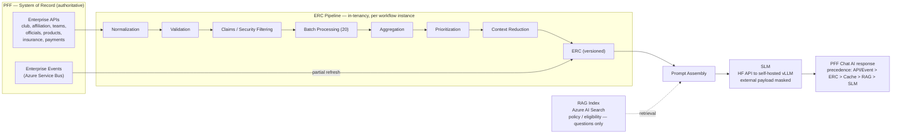
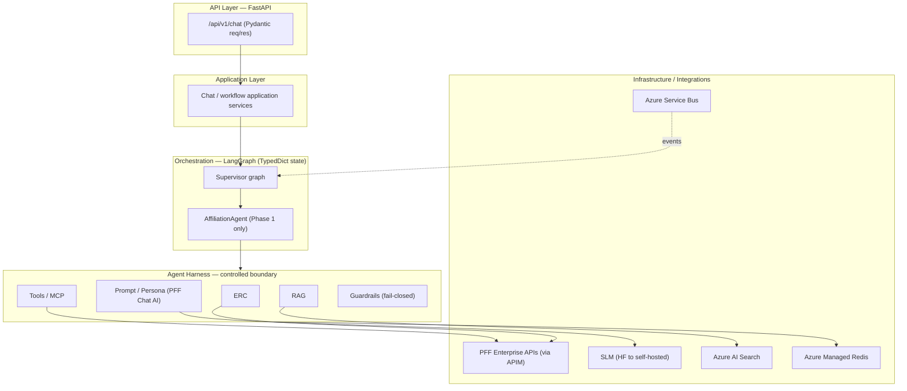
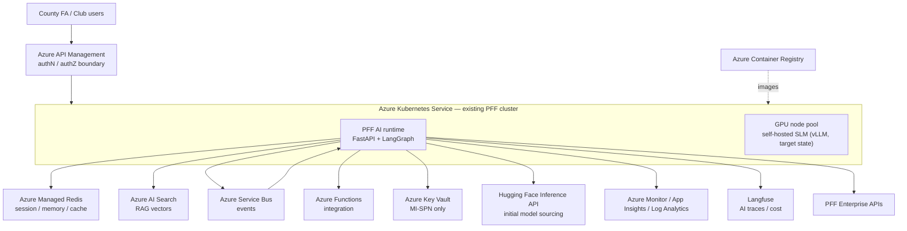

# Solution Architecture Definition
## PFF AI — Conversational Orchestration Platform (PFF Chat AI)
### Phase 1 — Club Affiliation Workflow

**Version:** 0.1 (Draft for review)
**Author:** AI Solution Architect — _TBD (name)_
**Date:** September 2026

> **Review note (delete before DOCX):** This Markdown is the review draft. It mirrors the company
> *Solution Architecture Definition Template v2* section-for-section and follows the style/depth of the
> approved *Referee Solution* SAD (v0.4). Content is grounded in `CLAUDE.md`, `DEVELOPMENT-GUIDE.md`, and the
> ADR register. Items marked _TBD_ need your input (names, dates, cost figures, confirmed diagram assets).
> Diagrams are drafted inline as **Mermaid** (Figures 1–4); they render on GitHub and are easy to edit. Refine
> them on review — recreate with more detail or swap for LeanIX assets before the DOCX is generated.

---

## Document History

| Version No | Revision Date | Author | Summary of Changes |
|---|---|---|---|
| 0.1 | 10-Sep-26 | _TBD_ | Initial draft — PFF AI (PFF Chat AI) Phase 1, Club Affiliation |

## Document Review

| Name | Role | Responsibility | Issue Date | Review Date |
|---|---|---|---|---|
| _TBD_ | AI Solution Architect | Responsible | | |
| _TBD_ | Data Architect | Responsible | | |
| _TBD_ | Product Manager | Accountable | | |
| _TBD_ | Delivery Manager | Accountable | | |
| _TBD_ | Enterprise Architect | Consult | | |
| _TBD_ | Application Architect | Consult | | |
| _TBD_ | Integration Architect | Consult | | |
| _TBD_ | InfoSec Manager | Consult | | |
| _TBD_ | Platform Engineer Manager | Consult | | |
| _TBD_ | Tech Lead | Consult | | |
| _TBD_ | QA Lead | Consult | | |
| _TBD_ | UX Designer | Inform | | |
| _TBD_ | DevOps Manager | Inform | | |

## Approvals

| Name | Role | Approval | Approval Date |
|---|---|---|---|
| Data Understanding & Modelling Working Group | Data modelling approval | _Pending_ | |
| Data Architecture Working Group | Data architecture approval | _Pending_ | |
| Architecture Control Board | Delivery framework approval | _Pending_ | |
| AI / Responsible-AI Review (ARB) | AI guardrail & model-governance approval | _Pending_ | |

## Reference Documents

| # | Document | Link |
|---|---|---|
| R1 | PFF Platform Architecture | PFF Platform Architecture.docx |
| R2 | PFF Non-Functional Requirements | PFF Non-Functional Requirements.xlsx |
| R3 | PFF Solution Architecture | PFF Solution Architecture |
| R4 | PFF AI — Working Rules | `CLAUDE.md` |
| R5 | PFF AI — Development Guide (24-phase build, repo map, doc index) | `DEVELOPMENT-GUIDE.md` |
| R6 | Club Affiliation E2E Flow | `MD files/0 Workflow/pff_affiliation_e2e_flow.md` |
| R7 | PFF Chat AI Persona — Golden Reference | `SampleWorkflowchat.md` |
| R8 | ADR Register / Open Decisions | `docs/architecture/adr/_register/open-decisions.md` |

## Guidance

Solution Architecture Definition Document Guidance — Confluence.

Reference the Solution Architecture Definition document guidance notes which define the purpose of each
section and suggest:
- the type of information to include
- possible questions to answer
- types of diagrams to include

For any sections or sub-sections which are not relevant, the heading is retained and marked
**"Not applicable"** or **"Not required"** with reasoning.

## Table of Contents

1. Introduction
   - 1.1 Objectives
   - 1.2 Functionality
   - 1.3 Constraints
   - 1.4 Assumptions
   - 1.5 Dependencies
   - 1.6 Legacy
2. Data
   - 2.1 GDPR
   - 2.2 Sources
   - 2.3 Integration
   - 2.4 Migration
   - 2.5 Audit
   - 2.6 Backups
   - 2.7 Reporting
3. Non-functional Requirements
   - 3.1 Security
   - 3.2 Capacity
   - 3.3 Performance
   - 3.4 Scalability
   - 3.5 Availability
   - 3.6 Disaster Recovery
   - 3.7 Monitoring
4. Solution Architecture
   - 4.1 Application Architecture
   - 4.2 Infrastructure Architecture
   - 4.3 Environments
   - 4.4 DevOps
   - 4.5 ADR Logs
5. Technology Stack
   - 5.1 Infrastructure
   - 5.2 Data
   - 5.3 Development
6. Costs
   - 6.1 Infrastructure
   - 6.2 Software
7. Maintenance
   - 7.1 Support
   - 7.2 Roadmap
   - 7.3 Life Expectancy
   - 7.4 Decommission
8. Appendix
   - 8.1 References

---

# 1 Introduction

This Solution Architecture Definition (SAD) covers Phase 1 of the **PFF AI** initiative. PFF AI is a
conversational orchestration layer — presented to users through the **PFF Chat AI** persona — built on top of the
existing PFF platform (The FA's county/club administration platform). PFF AI does not replace PFF's business
logic, databases, or authority. It interprets user requests, gathers enterprise context, reasons, calls
controlled tools, and communicates results in natural language.

The scope of Phase 1 is the **Club Affiliation** end-to-end workflow [R6], delivered through a single
`AffiliationAgent` capability. This first workflow establishes the reusable AI runtime — orchestration,
enterprise runtime context (ERC), retrieval (RAG), guardrails, tools, and observability — that later workflows
(player registration, discipline, officials, insurance, county cups, payments) will reuse.

- County FA and club administrators currently complete affiliation through PFF portal screens and manual
  guidance. PFF AI adds a conversational assistant that guides a user through affiliation, explains current
  status, and initiates authorised operations via controlled tools — without becoming the system of record.

- The governing design principle (**the Golden Rule**, [R4]) is enforced throughout: *enterprise systems
  decide and execute; the AI platform interprets, orchestrates, contextualises, explains and communicates.*
  Authoritative-truth precedence is always
  **Enterprise API / Enterprise Event > ERC > Cache > RAG > SLM output**.

- The solution is delivered on the existing PFF Azure/AKS platform and conforms to the Enterprise Application
  delivery model. PFF AI stands up **no** separate infrastructure, CI/CD, or deployment stack (`ADR-D5-20`).

## 1.1 Objectives

The objectives of Phase 1 are to establish a governed, reusable AI orchestration capability and prove it
end-to-end on the Club Affiliation workflow.

- Deliver a conversational assistant (PFF Chat AI) that helps users complete the **Club Affiliation** workflow and
  reach the correct next action or outcome.
- Establish the reusable AI runtime — LangGraph orchestration, Agent Harness, ERC, RAG, prompt/persona layer,
  guardrails, tools/MCP, and AI-specific observability — as versioned software artifacts.
- Enforce the Golden Rule and authoritative-truth precedence so the AI never authenticates/authorises,
  re-implements business rules, writes directly to the enterprise database, or lets a model output become an
  authorisation decision.
- Integrate with PFF enterprise APIs and the Azure Service Bus event stream to build enterprise runtime
  context and stay synchronised with authoritative business state.
- Provide a foundation that generalises to future workflows (player registration, discipline, officials,
  insurance, league management, approval/reviewer workflows) without re-architecture.

## 1.2 Functionality

Phase 1 functionality is organised around the conversational assistant and the Club Affiliation workflow.
Detailed conversational behaviour is defined by the PFF Chat AI persona rules [R4] and the golden reference [R7].

### 1.2.1 Conversational Assistant (PFF Chat AI)

- Natural-language chat entrypoint (`/api/v1/chat`) that interprets user requests and maintains conversation,
  session, and workflow state as strictly separate concerns.
- Workflow-first, football-commentary persona applied as a dedicated, versioned prompt layer — persona
  controls *how* PFF Chat AI communicates, never *what* the enterprise result is.
- Clear communication of amounts, statuses, dates, errors, and required user actions; celebratory language
  used **only** after an authoritative enterprise response confirms success.

### 1.2.2 Club Affiliation Workflow (AffiliationAgent)

- Understand request → identify club → load affiliation application → determine required context.
- Retrieve teams, officials, products, and insurance in enterprise-context batches (20-record batches).
- Build the ERC, run RAG for policy/eligibility *questions* (never for business decisions), and explain
  current affiliation status.
- Initiate authorised operations only via registered, controlled tools; wait for human-in-the-loop (HIL) or
  enterprise events where required; consume events, refresh ERC, resume, and respond with resolved portal
  links.

**Figure 1 — Club Affiliation conversational flow.** _Draft (Mermaid); refine with real tool/step names on review._

```mermaid
sequenceDiagram
    actor User as County / Club Admin
    participant Chat as PFF Chat AI (FastAPI /chat)
    participant Agent as AffiliationAgent (LangGraph)
    participant Harness as Agent Harness
    participant ERC as ERC Pipeline
    participant PFF as PFF Enterprise APIs (via APIM)
    participant SB as Azure Service Bus
    participant SLM as SLM (HF API to self-hosted)

    User->>Chat: Affiliation request (natural language)
    Chat->>Agent: Route to AffiliationAgent
    Agent->>Harness: Run inside controlled boundary
    Harness->>ERC: Build context (identify club, load application)
    ERC->>PFF: Fetch teams / officials / products / insurance (20-record batches)
    PFF-->>ERC: Validated claims + records
    ERC-->>Harness: ERC (versioned)
    Harness->>SLM: Prompt (persona + ERC); external payload masked, fail-closed
    SLM-->>Harness: Draft language (not authority)
    Harness->>PFF: Authorised operation via controlled tool
    PFF-->>Harness: Authoritative result
    Note over Agent,SB: If HIL / pending, wait for enterprise event
    SB-->>Agent: Enterprise event (e.g. payment confirmed)
    Agent->>ERC: Partial ERC refresh (new version)
    Agent-->>Chat: Explain status + resolved portal link
    Chat-->>User: Response (celebrate only after confirmed success)
```

## 1.3 Constraints

- **AI never holds business authority:** the platform must not authenticate/authorise, re-implement business
  or compliance rules, write directly to the enterprise database, invent portal URLs, or let an SLM output
  become an authorisation decision (`ADR-D6-07`, [R4]).
- **External-SLM data protection:** raw enterprise/personal data must never be exposed to an external SLM.
  External-SLM payloads are masked/tokenised by default and fail-closed (`ADR-D6-19`, refining `ADR-D6-07`).
  A self-hosted SLM may use raw or masked data as it stays in-tenancy.
- **Delivery model:** the solution must conform to the Enterprise Application delivery model on the shared
  enterprise AKS platform, with the enterprise SonarQube quality gate; no separate infra/CI/CD (`ADR-D5-20`).
- **Secrets:** the Key Vault connection is established **only** via the enterprise service principal (MI-SPN:
  tenant id + client id + client secret) — no `DefaultAzureCredential`, CLI/interactive, or bare managed
  identity (`ADR-D5-07`, `ADR-D5-20`).
- **Agents are logical capabilities** inside one AI runtime, not one microservice per agent.

## 1.4 Assumptions

- **Single agent first:** Phase 1 delivers the `AffiliationAgent` only; the supervisor/multi-agent catalogue
  is deferred (DEVELOPMENT-GUIDE §2, "AffiliationAgent-only first").
- **PFF remains the system of record:** all business/compliance decisions and all writes to enterprise data
  remain owned by PFF; AI consumes validated claims and authoritative responses/events only.
- **Recommended-but-Proposed ADRs are the working default:** embedding model `bge-base-en-v1.5`-class 768-dim
  (`ADR-D3-23`), vector store Azure AI Search (`ADR-D3-24`), and self-hosted SLM serving via vLLM on AKS GPU
  (`ADR-D5-10`) are built against pending formal ratification; deviation requires a superseding ADR.
- **Initial model sourcing:** the SLM and embeddings start on the Hugging Face Inference API and transition to
  an internal self-hosted SLM; masking/fail-closed applies while any external SLM is in use.

## 1.5 Dependencies

Delivery of this phase depends on the availability and alignment of the PFF platform and its integration
surfaces.

- **PFF enterprise APIs:** the ERC pipeline depends on PFF enterprise APIs (club, affiliation, teams,
  officials, products, insurance, payments) being available and returning validated claims.
- **Azure Service Bus event stream:** workflow resume, ERC refresh, and HIL handling depend on the PFF Service
  Bus event contracts being available.
- **APIM authZ boundary:** authentication/authorisation is performed at APIM/enterprise auth; PFF AI depends
  on validated claims being passed through.
- **Model & embedding provider:** Hugging Face Inference API (initial) and, for the target state, AKS GPU
  capacity for the self-hosted SLM (vLLM).
- **Azure AI Search & Azure Managed Redis:** RAG retrieval depends on the vector store (`ADR-D3-24`); session/
  memory/cache depends on Azure Managed Redis (`ADR-D4-10`).
- **Langfuse:** AI-specific tracing/prompt/cost observability depends on Langfuse availability alongside Azure
  Monitor/Application Insights/Log Analytics.

## 1.6 Legacy

- **No legacy retirement in Phase 1:** PFF AI is an additive orchestration layer over the existing PFF
  platform. It does not replace or retire any existing PFF business service, database, or portal.
- **No system-of-record migration:** PFF business state remains entirely owned by PFF; there is no legacy
  data platform being decommissioned by this phase.

---

# 2 Data

**Data ownership.** PFF AI holds **no authoritative business data**. Enterprise business state is owned
entirely by PFF and reached through enterprise APIs/events. PFF AI persists only four strictly separate,
non-authoritative state concepts: **Conversation State**, **Session State**, **Workflow/Agent State**, and a
**reference** to enterprise state (ERC reference: `erc_id + version + workflow_instance_id` — never a copy of
the full ERC).

**Enterprise Runtime Context (ERC).** The ERC is a short-lived, versioned, in-tenancy aggregation of
enterprise data assembled per workflow instance:
Enterprise APIs → Normalization → Validation → Claims/Security Filtering → Batch Processing → Aggregation →
Prioritization → Context Reduction → ERC → Prompt Assembly.

**Figure 2 — Target data flow (ERC pipeline).** _Draft (Mermaid); refine with concrete source systems on review._



## 2.1 GDPR

There is no change to GDPR requirements for this phase; PFF standards are defined in the PFF Platform
Architecture [R1]. PFF AI adds the following AI-specific data-protection controls:

- **No new authoritative PII store:** PFF AI does not create a new system of record for personal data. PII is
  held transiently within the ERC for the life of a workflow instance and in short-lived conversation/session
  state (Azure Managed Redis) with defined TTLs.
- **External-SLM masking:** raw enterprise/personal data is never sent to an external SLM; payloads are
  masked/tokenised by default and fail-closed (`ADR-D6-19`).
- **PII categories processed (transiently):** club and individual records, official/safeguarding details,
  affiliation and registration details, insurance and payment references — reached from PFF, not mastered by
  PFF AI.

## 2.2 Sources

All authoritative sources are PFF enterprise APIs/events; PFF AI subscribes/consumes but does not master them.

- **PFF Club/Affiliation service** — club and affiliation application records and status.
- **PFF Teams service** — team registration records.
- **PFF Officials/Safeguarding service** — official and safeguarding/vetting records.
- **PFF Products & Insurance service** — affiliation products and insurance details.
- **PFF Payments service** — payment status and references.
- **RAG knowledge sources** — approved policy/eligibility documents indexed for retrieval (non-authoritative;
  used for *questions*, never for business decisions).

## 2.3 Integration

The integration architecture uses event-driven and request/response patterns to exchange context between PFF
AI and the PFF platform. PFF AI is a consumer/orchestrator, never a writer of authoritative data.

- **APIM boundary:** all inbound and enterprise-API traffic traverses APIM, which performs authN/authZ; PFF AI
  consumes validated claims.
- **Enterprise API integration (ERC build):** the ERC pipeline calls PFF enterprise APIs to gather context in
  20-record batches, then normalises, validates, filters by claims, aggregates, and reduces to context budget.
- **Azure Service Bus (events):** PFF AI subscribes to PFF domain events. Consumer flow:
  Service Bus → Envelope Validation → Idempotency Check (`event_id` + consumer_id) → Event Router →
  {Workflow Resume | ERC Refresh | HIL Handler | External Event Handler}.
- **Tool invocation (writes):** any operation that changes enterprise state is performed only through
  registered, controlled tools that call PFF enterprise APIs — the enterprise system executes and decides.

**Reference patterns**
- Request/response context aggregation (ERC pipeline)
- Publish/subscribe event consumption (Azure Service Bus)
- Idempotent event handling; partial ERC refresh on event (never full rebuild)

### 2.3.1 Inbound Context Integration

- **Affiliation, teams, officials, products, insurance, payments** context is read from the corresponding PFF
  enterprise APIs to build the ERC for the active workflow instance.
- **Events** (e.g., payment confirmed, application status changed) trigger a **partial** ERC refresh — a new
  ERC version recording `previous_version/new_version` — and, where relevant, workflow resume.

### 2.3.2 Outbound / Downstream Integration

- **Controlled tool calls** are the only outbound writes; they call PFF enterprise APIs and return
  authoritative results/events that PFF Chat AI then communicates. PFF AI publishes **no** authoritative business
  events of its own.

## 2.4 Migration

**Not applicable.** PFF AI introduces no authoritative data store and therefore requires no one-time business
data migration. Reference/knowledge content for RAG is loaded through a versioned index build, not a data
migration.

## 2.5 Audit

The solution follows the standard PFF audit logging approach [R1], extended with AI-specific traceability.

- **AI trace record:** every turn records prompt version, model/version, ERC id+version, retrieved-document
  references, tool calls, guardrail outcomes, tokens, and cost via Langfuse, correlated to the PFF audit
  trail.
- **Retention:** audit/trace retention aligns with the agreed PFF retention approach; conversation/session
  state has bounded TTLs and is not treated as an audit system of record.

## 2.6 Backups

**Backup approach.** Backups follow the existing PFF architecture defined in "PFF Solution Architecture" [R3].
PFF AI holds no authoritative data; conversation/session/memory state in Azure Managed Redis is transient with
defined TTLs, and versioned artifacts (prompts, RAG indexes, config, releases) are recoverable from source
control and the release bundle store.

## 2.7 Reporting

**Reporting approach.** AI-specific operational metrics (traces, token/cost, latency percentiles, guardrail
and refinement-loop outcomes) are captured in Langfuse and Azure Monitor/Log Analytics and surfaced through
the recommended platform dashboards. Business reporting remains owned by PFF and its established reporting
platform; PFF AI does not duplicate business reporting.

---

# 3 Non-functional Requirements

## 3.1 Security

**Security approach.** Security aligns with the existing PFF standard defined in "PFF Platform Architecture"
[R1], with AI-specific guardrails layered on top:

- **AuthZ at the boundary:** authN/authZ is performed by APIM/enterprise auth; the AI platform only consumes
  validated claims and never makes an authorisation decision.
- **Guardrails:** input/output guardrails (prompt-injection and jailbreak defence, PII handling, output
  validation) run inside the Agent Harness; violations raise `GuardrailError` and fail-closed.
- **External-SLM masking:** raw enterprise/personal data is masked/tokenised before any external SLM call and
  fails closed (`ADR-D6-19`).
- **Secrets:** Key Vault access via the enterprise MI-SPN only (`ADR-D5-07`, `ADR-D5-20`).
- **Layering enforced:** Domain code never imports FastAPI, Langfuse, Azure SDK, a provider SDK, or a DB
  driver directly.

## 3.2 Capacity

**Capacity approach.** Phase 1 uses the existing PFF AKS platform and adds AI-runtime capacity plus (for the
target state) GPU capacity for the self-hosted SLM.

- Session/memory/cache uses Azure Managed Redis (`ADR-D4-10`).
- ERC batching is bounded (`MAX_ERC_BATCH_SIZE = 20`); context reduction keeps prompts within budget.
- Expected concurrent conversational users for Phase 1: _TBD_ (to be confirmed with Product/Delivery).

## 3.3 Performance

Key performance requirements for Phase 1 (targets to be confirmed against PFF NFRs [R2]):

- Time-to-first-token (TTFT) is tracked separately from total completion time.
- Latency tracked by percentile (p50/p75/p90/p95/p99), not averages.
- Enterprise-API/tool calls inherit PFF API SLAs (e.g., ≤ 3s response-time SLA, subject to [R2] confirmation).
- ERC batching validated at 1, 20, 21, 40, 100, 100+ entity scale points.

## 3.4 Scalability

- The AI runtime is stateless at the request layer and scales horizontally on the existing PFF AKS cluster;
  session/workflow state is externalised to Azure Managed Redis.
- The self-hosted SLM (target state) scales on AKS GPU node pools (vLLM, `ADR-D5-10`); initial state uses the
  Hugging Face Inference API.
- The runtime quality-gated refinement loop with a model-escalation ladder (`ADR-D3-28`) bounds retries and
  escalation under strict mode.
- Recommended HPA settings and node pools: _TBD_ (to be aligned to the existing PFF AKS capacity in [R1]).

## 3.5 Availability

**Availability approach.** Availability aligns with the existing PFF standard defined in "PFF Platform
Architecture" [R1]. External dependencies (e.g., Hugging Face Inference API) are treated as degradable — the
runtime fails closed on guardrails and degrades gracefully where an authoritative source is unavailable rather
than guessing an outcome.

## 3.6 Disaster Recovery

**Disaster recovery approach.** DR aligns with the existing PFF architecture defined in "PFF Solution
Architecture" [R3]. As PFF AI holds no authoritative data, recovery focuses on redeploying versioned artifacts
(prompts, RAG indexes, config, release bundles) and re-establishing platform connectivity; enterprise state is
recovered by PFF.

## 3.7 Monitoring

**Monitoring approach.** Monitoring aligns with the existing PFF architecture defined in "PFF Solution
Architecture" [R3], plus AI-specific observability via Langfuse (traces, prompts, tokens, cost) and the
recommended platform dashboards (AI Runtime, LangGraph, Agents, SLM/Models, RAG, ERC, Tools/MCP, Guardrails,
Cost, SLO/SLA).

---

# 4 Solution Architecture

This section describes the target solution architecture for PFF AI and explains how the application,
infrastructure, environments, and DevOps capabilities work together to deliver the Phase 1 requirements. The
architecture aligns with existing PFF platform standards and reuses approved platform services wherever
possible (AKS, Azure SQL where relevant, Azure Service Bus, Azure Functions, API Management, Key Vault,
monitoring, and deployment tooling). Solution-specific components are introduced only where required to support
the new conversational AI capabilities.

## 4.1 Application Architecture

PFF AI is a single AI runtime (Python + FastAPI, LangGraph orchestration) organised into strict layers:
**API → Application → Orchestration → Domain → Infrastructure/Integrations.** Agents are logical capabilities
inside this one runtime, not separate deployables.

Key application components:

- **API layer (FastAPI):** versioned endpoints (`/api/v1/chat`), Pydantic request/response models.
- **Orchestration (LangGraph):** supervisor/agent graphs with `TypedDict` internal state; Phase 1 runs the
  single `AffiliationAgent`.
- **Agent Harness:** the controlled boundary every agent runs inside — enforces claims, prompt/persona, ERC,
  memory, tools, MCP, RAG, guardrails, retry, timeout, loop/token limits, HIL, validation, and observability.
- **ERC capability:** builds and versions enterprise runtime context from PFF enterprise APIs.
- **Prompt/Persona capability:** versioned prompt layers, including the reusable PFF Chat AI persona prompt.
- **RAG capability:** retrieval over the approved knowledge index (Azure AI Search) for policy/eligibility
  questions.
- **Tools/MCP capability:** registered controlled tools that call PFF enterprise APIs to execute authorised
  operations.
- **Guardrails capability:** input/output validation, injection/jailbreak defence, PII masking, fail-closed.

**Figure 3 — Application architecture (layered).** _Draft (Mermaid); refine component names on review._



### 4.1.1 Model Sourcing (phased)

- **Initial:** SLM and embeddings via the Hugging Face Inference API; external-SLM payloads masked/fail-closed.
- **Target:** internal self-hosted SLM (vLLM on AKS GPU, `ADR-D5-10`) able to use raw or masked in-tenancy
  data; embeddings `bge-base-en-v1.5`-class 768-dim (`ADR-D3-23`).

## 4.2 Infrastructure Architecture

The infrastructure reuses the existing PFF Azure platform and introduces only the components required for the
AI runtime. Key components:

- **Azure Kubernetes Service (AKS):** hosts the PFF AI runtime; GPU node pools (target state) host the
  self-hosted SLM.
- **Azure API Management:** existing gateway and authN/authZ boundary for chat and enterprise-API traffic.
- **Azure Service Bus:** event transport for workflow resume, ERC refresh, and HIL handling.
- **Azure Functions:** lightweight integration processing where required.
- **Azure Managed Redis:** conversation/session/workflow state, memory, and cache (`ADR-D4-10`).
- **Azure AI Search:** vector + hybrid retrieval for RAG (`ADR-D3-24`; fallback pgvector on Azure Postgres).
- **Azure Container Registry (ACR):** container images for the AI runtime.
- **Azure Key Vault:** secrets/certs/config, accessed via the enterprise MI-SPN only.
- **Observability:** Azure Monitor, Application Insights, Log Analytics (platform) + Langfuse (AI-specific).

**Figure 4 — Infrastructure architecture.** _Draft (Mermaid); refine with network/tenancy detail on review._



## 4.3 Environments

The solution uses the existing PFF environment landscape. Phase 1 adopts the **5-stage environment model**
(DEVELOPMENT-GUIDE §2): **DEV → TEST → UAT → STAGE → PROD**. No new environments are expected.

- Build, test, UAT, performance validation, and live operations run across the existing PFF AKS environments.
- GPU capacity for the self-hosted SLM is required only where/when the target-state model is enabled.

## 4.4 DevOps

The solution uses the existing PFF DevOps delivery model conforming to the Enterprise Application delivery
model (`ADR-D5-20`). No new DevOps tooling, pipelines, or release processes are introduced.

- **Build/deploy:** Azure DevOps `build.yaml` / `release.yaml` on the shared enterprise AKS platform.
- **Quality gate:** the enterprise SonarQube quality gate; Ruff lint/format; a single project type checker
  (mypy or pyright) selected in Phase 0.
- **Release:** prompts, models, agents, workflows, RAG indexes, and guardrails are released as immutable,
  compatible, versioned bundles — never mutated in place in production.

## 4.5 ADR Logs

| Reference | Outcome |
|---|---|
| `ADR-D4-10` | Memory/session/cache store — **Azure Managed Redis** (Accepted; supersedes `docs/adr/0004`). |
| `ADR-D5-20` | Delivery — conform to Enterprise Application delivery model; no separate infra/CI/CD (Accepted; ratifies `ADR-D5-12` IaC and `ADR-D5-13` Kubernetes). |
| `ADR-D5-07` | Key Vault access via enterprise MI-SPN only. |
| `ADR-D3-23` | Embedding model — HF-hosted `bge-base-en-v1.5`-class 768-dim (Proposed; working default). |
| `ADR-D3-24` | Vector store — Azure AI Search (Proposed; working default). |
| `ADR-D5-10` | Self-hosted SLM serving — vLLM on AKS GPU (Proposed; working default). |
| `ADR-D3-28` | Runtime quality-gated refinement loop + model-escalation ladder + strict mode (Proposed; awaiting ARB). |
| `ADR-D6-19` | SLM input masking regime; external-SLM payloads masked/fail-closed (Proposed; refines `ADR-D6-07`). |

Full evaluations and pending sign-offs: `docs/architecture/adr/_register/open-decisions.md` [R8].

---

# 5 Technology Stack

The technology stack for Phase 1 builds on the existing PFF platform and approved cloud, data, integration, and
development technologies. Solution-specific components are introduced only where required for the AI runtime.

## 5.1 Infrastructure

- Azure Kubernetes Service (AKS) — including GPU node pools for the target-state self-hosted SLM
- Azure API Management
- Azure Service Bus
- Azure Functions
- Azure Managed Redis
- Azure AI Search
- Azure Container Registry (ACR)
- Azure Key Vault
- Azure Monitor / Application Insights / Log Analytics

## 5.2 Data

- Azure Managed Redis (conversation/session/workflow state, memory, cache — `ADR-D4-10`)
- Azure AI Search (vector + hybrid retrieval for RAG — `ADR-D3-24`)
- Enterprise business data: reached via PFF enterprise APIs/events (owned by PFF; not stored by PFF AI)

## 5.3 Development

- Python + **FastAPI** (API framework)
- **LangGraph** (agent orchestration)
- SLM: Hugging Face Inference API (initial) → self-hosted vLLM/HF TGI on AKS GPU (target)
- Embeddings: Hugging Face API (`bge-base-en-v1.5`-class, 768-dim)
- **Pydantic** (all boundary models) + **TypedDict** (LangGraph internal state)
- **Ruff** (lint/format); mypy or pyright (one project primary)
- **Langfuse** (AI-specific traces/prompts/tokens/cost)
- Dependency management: `pyproject.toml` + lock file, pinned versions
- Azure SDK; Azure DevOps repositories, pipelines, and release tools

---

# 6 Costs

## 6.1 Infrastructure

| Cost Area | Approach / Usage | Cost Impact |
|---|---|---|
| AKS (runtime) | AI runtime hosted on the existing PFF AKS cluster | Low — incremental pods on existing cluster |
| AKS GPU node pool | Required only for the target-state self-hosted SLM | _TBD_ — new GPU capacity (medium/high) |
| API Management | Existing PFF APIM instance reused | No extra cost |
| Service Bus | Existing PFF Service Bus reused | No extra cost |
| Azure Managed Redis | Session/memory/cache store | _TBD_ — new/incremental |
| Azure AI Search | RAG vector store | _TBD_ — new/incremental |
| ACR | Existing registry reused | No extra cost |
| Key Vault | Existing PFF Key Vault reused | No extra cost |
| Monitoring/Log Analytics | Existing PFF monitoring + Langfuse | Low — incremental ingestion + Langfuse |
| Hugging Face Inference API | Initial model/embedding sourcing (usage-based) | _TBD_ — usage-based |

## 6.2 Software

**Software licensing approach.**
- Phase 1 uses existing approved platform services and open-source components (FastAPI, LangGraph, Pydantic,
  Ruff) wherever possible.
- Incremental costs are usage-based model/embedding inference (Hugging Face, initial) and Langfuse; a
  self-hosted SLM shifts cost from per-call inference to GPU compute (target state).
- Any third-party SaaS/licensing beyond the above: _TBD_ — none currently anticipated for Phase 1.

---

# 7 Maintenance

## 7.1 Support

**Support approach.** Support follows the standard PFF support model, using existing operational processes,
support channels, and escalation routes.
- Operational support managed through the established PFF support process.
- Incidents/service requests follow the agreed triage, prioritisation, and escalation procedures.
- Application and platform teams support in line with existing responsibilities; AI-specific incidents
  (guardrail, prompt-injection, SLM/RAG/ERC failures) use the component troubleshooting runbooks.

## 7.2 Roadmap

**Roadmap overview.** This document covers Phase 1 of a multi-phase PFF AI roadmap.
- **Phase 1:** Reusable AI runtime proven end-to-end on the **Club Affiliation** workflow (`AffiliationAgent`
  only).
- **Later phases:** extend to additional workflows and agents (player registration, discipline, officials,
  insurance, county cups, payments) and transition from the Hugging Face Inference API to the internal
  self-hosted SLM (vLLM on AKS GPU).

## 7.3 Life Expectancy

**Life expectancy approach.** PFF AI is a long-lived platform capability layered on the PFF platform. The
lifecycle is defined as _TBD (suggest five years from implementation)_ from the implementation date, to be
reviewed and revisited. Because prompts, models, agents, workflows, RAG indexes, and guardrails are versioned
software artifacts, the platform evolves through immutable, compatible releases rather than in-place mutation.

## 7.4 Decommission

**Not applicable for Phase 1.** PFF AI is additive and retires no existing PFF capability. Should any AI
capability be withdrawn in future, it will be removed in a controlled manner — the corresponding agent/workflow
disabled, versioned artifacts retired, and any transient state expired — with support teams and users informed
beforehand. Enterprise business data is unaffected as it is owned by PFF.

---

# 8 Appendix

## 8.1 References

| # | Name | Reference |
|---|---|---|
| R1 | PFF Platform Architecture | PFF Platform Architecture.docx |
| R2 | PFF Non-Functional Requirements | PFF Non-Functional Requirements.xlsx |
| R3 | PFF Solution Architecture | PFF Solution Architecture |
| R4 | PFF AI — Working Rules | `CLAUDE.md` |
| R5 | PFF AI — Development Guide | `DEVELOPMENT-GUIDE.md` |
| R6 | Club Affiliation E2E Flow | `MD files/0 Workflow/pff_affiliation_e2e_flow.md` |
| R7 | PFF Chat AI Persona — Golden Reference | `SampleWorkflowchat.md` |
| R8 | ADR Register / Open Decisions | `docs/architecture/adr/_register/open-decisions.md` |
