# PFF-FA Enterprise Agentic AI Platform — C4 Architecture Diagrams

**Document ID:** PFF-FA-AI-C4-DIAGRAMS
**Version:** 1.0.0
**Status:** Development Baseline
**Scope:** Full-stack C4 model — System Context (L1) → Containers (L2) → Components (L3) → Code (L4), plus Dynamic and Deployment views
**Audience:** Architects, engineers, reviewers onboarding to the PFF AI ("Adam AI") platform

> This document explains the platform **from scratch to advanced**. Read top to bottom the first time
> (each level zooms one step deeper); use the Table of Contents as a reference thereafter. Every
> diagram is rendered in [Mermaid](https://mermaid.js.org/) and renders natively on GitHub.
> Component diagrams are mapped to real modules under `src/pff_fa_ai/` so you can jump from a box
> straight to the code.

---

## Table of Contents

1. [How to read this document (C4 in 3 minutes)](#1-how-to-read-this-document-c4-in-3-minutes)
2. [The platform in one paragraph](#2-the-platform-in-one-paragraph)
3. [Level 1 — System Context](#3-level-1--system-context)
4. [Level 2 — Containers](#4-level-2--containers)
5. [Level 3 — Component diagrams (every corner)](#5-level-3--component-diagrams-every-corner)
   - 5.1 [API boundary](#51-api-boundary)
   - 5.2 [Application layer — Conversation & Session](#52-application-layer--conversation--session)
   - 5.3 [Orchestration — Supervisor & Workflow Orchestrator](#53-orchestration--supervisor--workflow-orchestrator)
   - 5.4 [Agent Harness](#54-agent-harness)
   - 5.5 [Affiliation Agent & LangGraph](#55-affiliation-agent--langgraph)
   - 5.6 [ERC & Context Engineering](#56-erc--context-engineering)
   - 5.7 [Integration — Tools, API client, MCP, resilience](#57-integration--tools-api-client-mcp-resilience)
   - 5.8 [RAG pipeline](#58-rag-pipeline)
   - 5.9 [Embedding & Vector platform](#59-embedding--vector-platform)
   - 5.10 [SLM provider abstraction & masking](#510-slm-provider-abstraction--masking)
   - 5.11 [Prompt Engineering](#511-prompt-engineering)
   - 5.12 [Guardrails pipeline](#512-guardrails-pipeline)
   - 5.13 [Memory & Cache](#513-memory--cache)
   - 5.14 [Messaging — Service Bus event consumer](#514-messaging--service-bus-event-consumer)
   - 5.15 [Refinement loop](#515-refinement-loop)
   - 5.16 [Cross-cutting — Observability, Evaluation, Governance, Portal Links, Config](#516-cross-cutting--observability-evaluation-governance-portal-links-config)
6. [Level 4 — Code (selected)](#6-level-4--code-selected)
7. [Dynamic diagrams (runtime flows)](#7-dynamic-diagrams-runtime-flows)
8. [Deployment diagram (Azure / AKS)](#8-deployment-diagram-azure--aks)
9. [Cross-cutting architectural invariants](#9-cross-cutting-architectural-invariants)
10. [C4 element → source code map](#10-c4-element--source-code-map)

---

## 1. How to read this document (C4 in 3 minutes)

The **C4 model** (Context, Containers, Components, Code) describes software with a set of nested maps,
each a zoom level of the previous one. You never draw everything at once — you draw the right altitude
for the question being asked.

| Level | Question it answers | Boxes are… | Audience |
|---|---|---|---|
| **L1 Context** | How does the system fit the world? | People & software systems | Everyone incl. non-technical |
| **L2 Container** | What are the separately-deployable/runnable parts? | Apps, services, data stores | Architects, ops |
| **L3 Component** | What are the major building blocks inside a container? | Modules/packages with a role | Developers |
| **L4 Code** | How is a component implemented? | Classes / key types | Developers (selectively) |
| **Dynamic** | How do parts collaborate for a scenario? | Numbered interactions | Everyone |
| **Deployment** | Where does it run? | Nodes / infra | Ops, SRE, security |

**Reading the notation used here:**

- 🟦 **Blue** boxes = things **the PFF AI platform owns and builds**.
- ⬜ **Grey** boxes (`_Ext`) = **enterprise-owned or third-party** systems the platform *consumes* but never
  re-implements. This grey/blue split is the single most important thing on every diagram — it is the
  **Golden Rule** made visual.
- Arrows are directed dependencies/calls; the label says *what* and *over what protocol/tech*.

> **The Golden Rule (governs every boundary below):**
> **Enterprise systems decide and execute; the AI platform interprets, orchestrates, contextualizes,
> explains and communicates.**
> Authoritative-truth precedence, always: **Enterprise API / Event > ERC > Cache > RAG > SLM output.**

---

## 2. The platform in one paragraph

**PFF** is The FA's county/club administration platform (affiliation, registration, insurance, discipline,
officials/safeguarding, county cups, payments) integrated with **WGS** (the FA's national football
database). **PFF AI / Adam AI** is a *conversational orchestration layer on top of PFF*. It interprets a
user's request, gathers **Enterprise Runtime Context (ERC)** from PFF's own APIs, reasons with a small
language model (**SLM**), calls a controlled, allow-listed set of **tools** to invoke PFF's authoritative
APIs, retrieves knowledge via **RAG**, enforces **guardrails**, and communicates results in a football-
commentary persona — **without ever re-implementing PFF's business rules, writing to its database, or
letting the model become an authority.** The first end-to-end workflow is **Club Affiliation**.

---

## 3. Level 1 — System Context

**Question:** Who uses Adam AI, and which systems must it talk to?

The AI platform is a *single system* at this altitude. Everything grey is enterprise-owned or third-party.
Note that **authentication/authorization is done by the enterprise (APIM)** — the AI platform only consumes
validated claims.

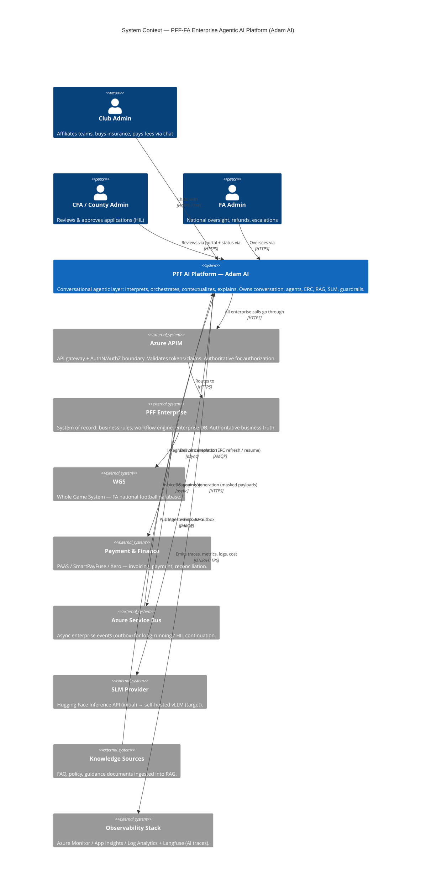

**Key takeaways**

- The AI platform has **exactly one path to enterprise truth: through APIM**. No direct DB access, ever.
- **Two runtimes touch the platform**: synchronous chat (request-driven) and asynchronous events
  (event-driven, via Service Bus) — this duality recurs at every level below.
- **CFA/FA humans are first-class** — approvals are Human-in-the-Loop (HIL) *inside the enterprise*, not
  inside the AI. The AI *waits* and *resumes*; it never decides.

---

## 4. Level 2 — Containers

**Question:** What are the separately-runnable parts of the AI platform, and what data stores back them?

The platform ships as **one logical AI runtime** (per `ADR-D2-02` — agents are logical capabilities, not
microservices) with a **second consumer surface** for events, plus managed Azure data/infra services.
The blue boundary is what this repo builds and deploys to AKS.

```mermaid
C4Container
    title Container Diagram — PFF AI Platform

    Person(club, "Club Admin", "")
    System_Ext(apim, "Azure APIM", "AuthN/Z boundary")
    System_Ext(pff, "PFF Enterprise APIs", "System of record")
    System_Ext(sbus, "Azure Service Bus", "Enterprise events")
    System_Ext(slmp, "SLM Provider", "HF API / self-hosted vLLM")
    System_Ext(langfuse, "Langfuse + Azure Monitor", "Observability")

    System_Boundary(ai, "PFF AI Platform") {
        Container(api, "FastAPI App", "Python / FastAPI", "REST + SSE boundary. /api/v1/chat, sessions, conversations, health. Request validation, correlation, claims propagation.")
        Container(runtime, "AI Runtime (Orchestration)", "Python / LangGraph", "Supervisor routing, Agent Harness, LangGraph execution, refinement loop. The reasoning core.")
        Container(consumer, "Event Consumer", "Python / azure-servicebus", "Consumes enterprise events, validates schema, idempotency, ERC refresh, durable workflow resume.")
        Container(agents, "Workflow Agents", "Python", "Logical capabilities (Affiliation first). Persona, ERC plan, steps, resume.")
        Container(context, "ERC & Context Engine", "Python", "Collection, batching (20-rec), normalization, provenance, projection/budget.")
        Container(integ, "Integration Layer", "Python / httpx", "Controlled tools, API catalog client, MCP, retry/circuit/idempotency/concurrency.")
        Container(rag, "RAG + Embedding/Vector", "Python", "Ingestion, chunking, hybrid retrieval, reranking, citation.")
        Container(slm, "SLM Abstraction", "Python", "Provider-agnostic gateway + input masking / token vault.")
        Container(guard, "Guardrails", "Python", "Input/output/tool guardrails, PII, injection, trust, ERC integrity.")
        Container(prompt, "Prompt Engineering", "Python + YAML", "Layered, versioned prompt composition.")

        ContainerDb(redis, "Azure Managed Redis", "Redis", "Conversation, session, workflow state, ERC/API/RAG/semantic cache, memory. (ADR-D4-10)")
        ContainerDb(vector, "Azure AI Search", "Vector store", "Knowledge chunk vectors + metadata/ACL. (ADR-D3-24)")
        ContainerDb(cfg, "Config + Key Vault", "YAML + Azure Key Vault", "Versioned config bundles; secrets via enterprise SPN. (ADR-D5-07)")
    }

    Rel(club, api, "Chat request", "HTTPS/SSE")
    Rel(apim, api, "Forwards validated claims", "HTTPS")
    Rel(api, runtime, "Invokes", "in-proc")
    Rel(runtime, agents, "Routes to", "in-proc")
    Rel(agents, context, "Requests ERC", "in-proc")
    Rel(agents, integ, "Calls tools", "in-proc")
    Rel(agents, rag, "Retrieves knowledge", "in-proc")
    Rel(runtime, slm, "Generates via", "in-proc")
    Rel(runtime, guard, "Enforces", "in-proc")
    Rel(runtime, prompt, "Composes prompt", "in-proc")
    Rel(integ, apim, "Enterprise API calls", "HTTPS")
    Rel(apim, pff, "Routes", "HTTPS")
    Rel(slm, slmp, "Inference (masked)", "HTTPS")
    Rel(rag, vector, "Vector/hybrid search", "HTTPS")
    Rel(runtime, redis, "State + cache", "RESP")
    Rel(consumer, sbus, "Receives events", "AMQP")
    Rel(consumer, context, "Refreshes ERC", "in-proc")
    Rel(consumer, runtime, "Resumes workflow", "in-proc")
    Rel(runtime, cfg, "Loads config/secrets", "in-proc")
    Rel(runtime, langfuse, "Traces/metrics/cost", "HTTPS")

    UpdateLayoutConfig($c4ShapeInRow="3", $c4BoundaryInRow="2")
```

**Key takeaways**

- **FastAPI is a thin boundary** — it validates and delegates. Orchestration lives in the *AI Runtime*,
  never in the API layer (`§7` of the architecture doc).
- **The Event Consumer shares the same domain/context code** as the request runtime but is a distinct
  entry surface so a long HTTP request never blocks on enterprise processing that takes hours/days.
- **All state is externalized to Redis** so any pod can resume a durable workflow after restart.
- Data-store choices are ADR-backed: **Redis** (`ADR-D4-10`), **Azure AI Search** (`ADR-D3-24`),
  **Key Vault via SPN** (`ADR-D5-07`).

---

## 5. Level 3 — Component diagrams (every corner)

Each subsection zooms **into one container** and shows the major components (Python packages/modules) and
how they collaborate. Boxes carry the real module path so you can open the code.

### 5.1 API boundary

**Container:** FastAPI App → **Package:** `src/pff_fa_ai/api/`

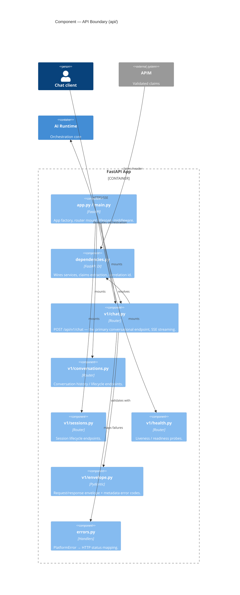

**Rule enforced:** FastAPI must **not** contain agent orchestration. It validates, propagates
`request_id / correlation_id / conversation_id / session_id / claims`, and calls the runtime.

### 5.2 Application layer — Conversation & Session

**Package:** `src/pff_fa_ai/application/` + `src/pff_fa_ai/domain/` + `src/pff_fa_ai/infrastructure/persistence/`

This is where the **four separate state concepts** begin to live. Conversation, Session and Workflow are
*distinct domains* (`ADR-D4-01`) — never conflated.

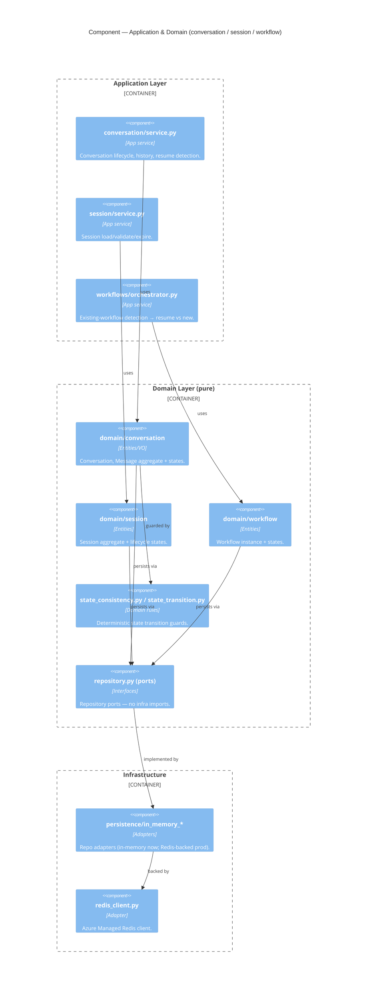

**Dependency rule (enforced, `ADR-D2-01`):** Domain imports *nothing* infrastructural — it depends on
**ports**; adapters in `infrastructure/` implement them. This is what keeps the reasoning core testable.

### 5.3 Orchestration — Supervisor & Workflow Orchestrator

**Package:** `src/pff_fa_ai/orchestration/supervisor/` + `orchestration/workflow_orchestrator.py`

The Supervisor answers *"which workflow capability handles this?"* — it routes, it does **not** decide
business outcomes.

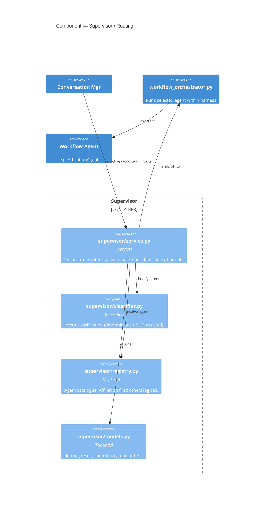

**Routing is deterministic-first** (`ADR-D3-05`): the classifier may use the SLM to *interpret*, but a
low-confidence/ambiguous result yields a **clarification response**, never a guessed transaction.

### 5.4 Agent Harness

**Package:** `src/pff_fa_ai/orchestration/harness/`

The Harness is the **deterministic safety boundary** wrapped around probabilistic model behavior. Every
capability the agent may use is *mediated* here.

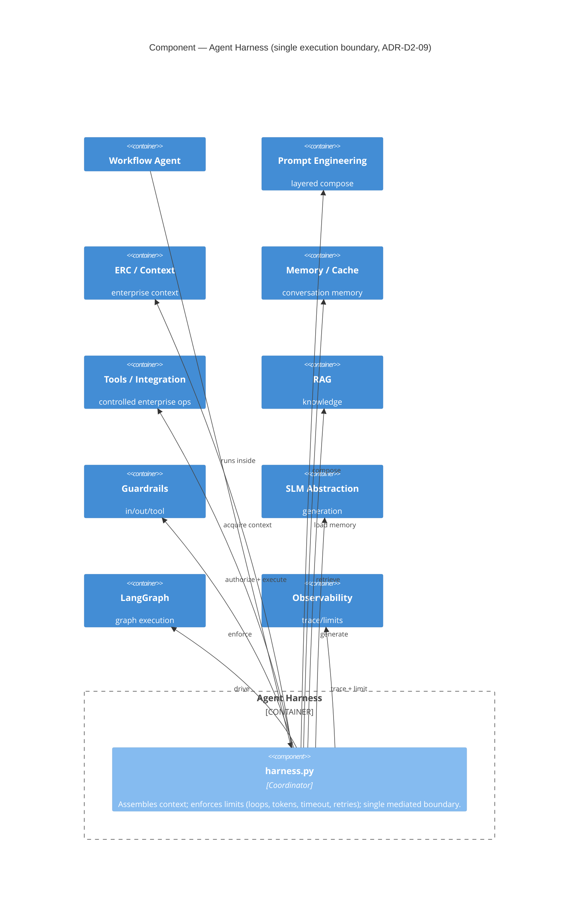

**Why it matters:** Guardrails and limits **cannot be bypassed** by an agent or a prompt because they sit
in the harness, not in the model's instructions. Retry/timeout/loop budgets are *coordinated* here to
avoid the `3×3×3 = 27` retry-multiplication trap (Runtime doc §56).

### 5.5 Affiliation Agent & LangGraph

**Package:** `src/pff_fa_ai/agents/affiliation/` + `src/pff_fa_ai/orchestration/langgraph/`

The first concrete workflow capability. The agent *declares* how the affiliation workflow is shaped;
LangGraph *executes* it as a stateful graph with durable checkpoints.

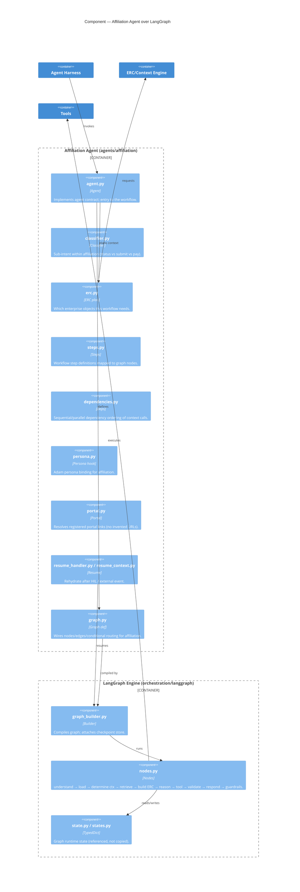

**Extension model (`Runtime §71`):** a *new* workflow = new agent + graph + prompts + tool defs + ERC
mapping + eval dataset. The **core runtime does not change** — that is the whole point of this shape.

### 5.6 ERC & Context Engineering

**Package:** `src/pff_fa_ai/context/` (collection, erc, normalization, projection)

**ERC (Enterprise Runtime Context)** is the controlled, provenance-tagged context layer *between* enterprise
APIs and the SLM. It is **derived** — never the system of record.

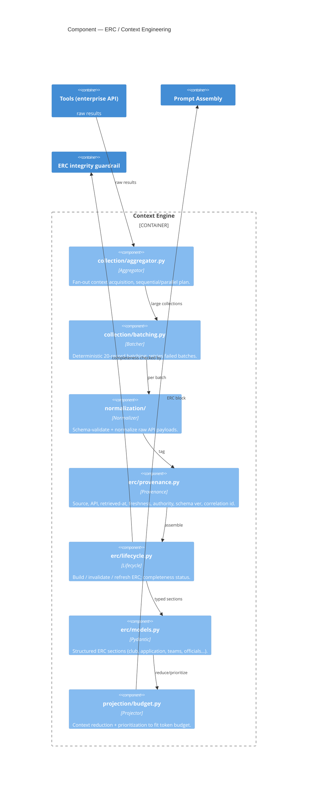

**Non-negotiables:** a **failed optional batch must never let the SLM invent** missing data
(`Architecture §15`); an ERC marked *incomplete* is never treated as complete; batching is deterministic
application logic — **the SLM does not control pagination**.

### 5.7 Integration — Tools, API client, MCP, resilience

**Package:** `src/pff_fa_ai/integration/` (tools, api, mcp, execution, errors)

This is the **only** place the platform reaches enterprise systems — always through APIM, always via an
allow-listed tool.

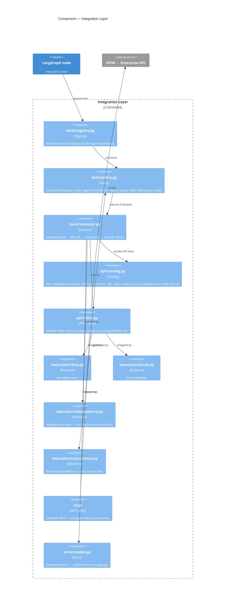

**Tool result taxonomy** (Runtime §35): `SUCCESS / BUSINESS_RESULT / PARTIAL / TIMEOUT /
RETRYABLE_ERROR / NON_RETRYABLE_ERROR / AUTHORIZATION_FAILURE / VALIDATION_FAILURE`. A **BUSINESS_RESULT
(e.g. "CFA review required") is not a technical exception** — the persona communicates it factually.

### 5.8 RAG pipeline

**Package:** `src/pff_fa_ai/rag/`

RAG serves **knowledge only** (FAQ, policy, guidance) — `ADR-D3-20`. It is **never** operational truth and
never overrides an enterprise API/ERC value.

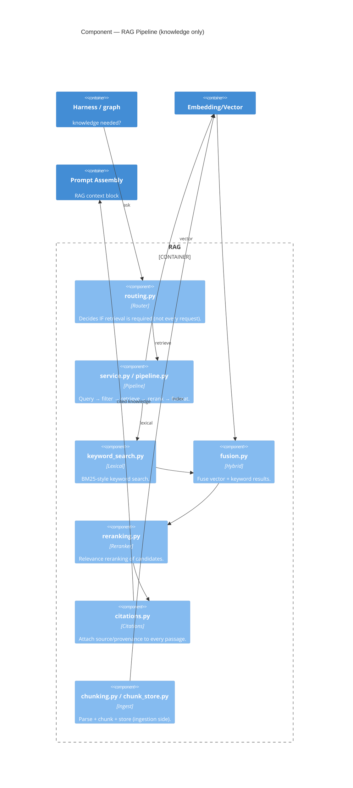

**ACL enforcement** (`ADR-D6-12`): retrieval filters on metadata/claims so a user only ever retrieves
knowledge they are entitled to — retrieval respects the same claims the enterprise validated.

### 5.9 Embedding & Vector platform

**Package:** `src/pff_fa_ai/embedding_vector/`

Logically separated from RAG so **embedding model, index, scaling and migration** can each have their own
lifecycle (`Architecture §18`). Default: HF-hosted 768-dim `bge-base-en-v1.5`-class (`ADR-D3-23`) into
Azure AI Search (`ADR-D3-24`).

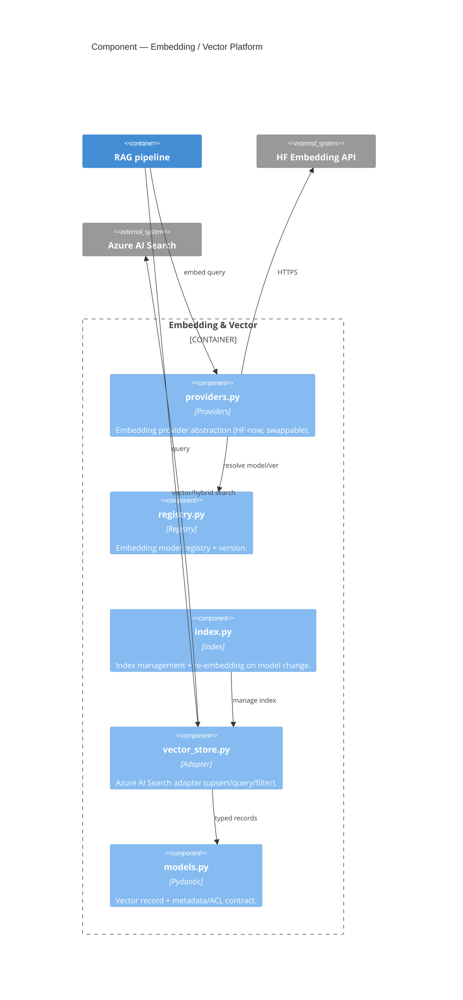

**Re-embedding discipline:** changing the embedding model is a *versioned migration*, not an in-place
edit — index and model versions travel together so retrieval stays consistent.

### 5.10 SLM provider abstraction & masking

**Package:** `src/pff_fa_ai/slm/` + `src/pff_fa_ai/guardrails/masking.py`, `token_vault.py`

Agents are **never** coupled to a provider. Crucially, **external-SLM payloads are masked/tokenised by
default and fail-closed** (`ADR-D6-19`, refining `ADR-D6-07`).

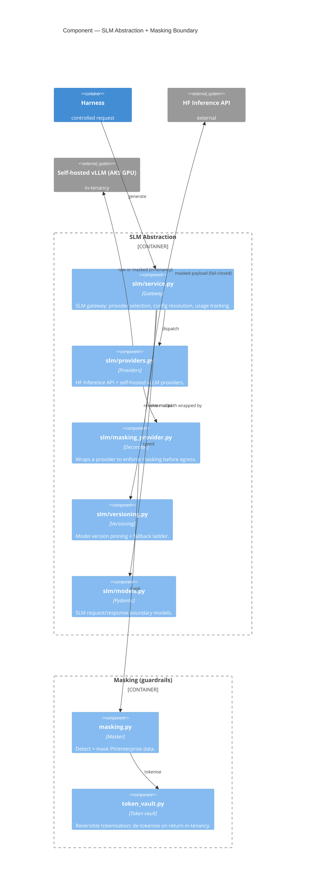

**The masking split is the trust boundary in one picture:** external HF → **must** be masked, fail-closed;
self-hosted vLLM stays *in-tenancy* → may use raw or masked data. The SLM output is always **data for
deterministic code, never an authorization or business decision.**

### 5.11 Prompt Engineering

**Package:** `src/pff_fa_ai/prompt_engineering/` + `prompts/` (YAML artifacts)

Prompts are **versioned software artifacts** composed in layers (`ADR-D3-09`). The Adam persona is its own
reusable layer (`ADR-D3-10`) — never the whole workflow baked into one prompt.

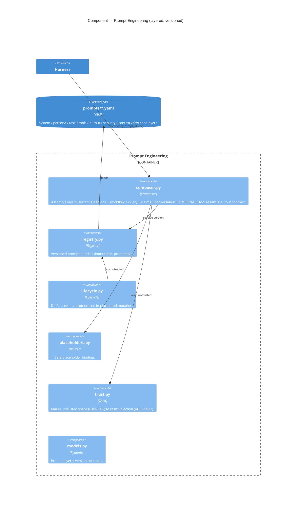

**Prompt-injection defence lives here** (`ADR-D3-12`): user text and retrieved RAG passages are wrapped as
*untrusted spans*, so instructions embedded in data cannot hijack the system layer.

### 5.12 Guardrails pipeline

**Package:** `src/pff_fa_ai/guardrails/`

Guardrails run at **three placements** — input, tool, output (`ADR-D6-09`) — and **cannot be bypassed** by
agents or prompts.

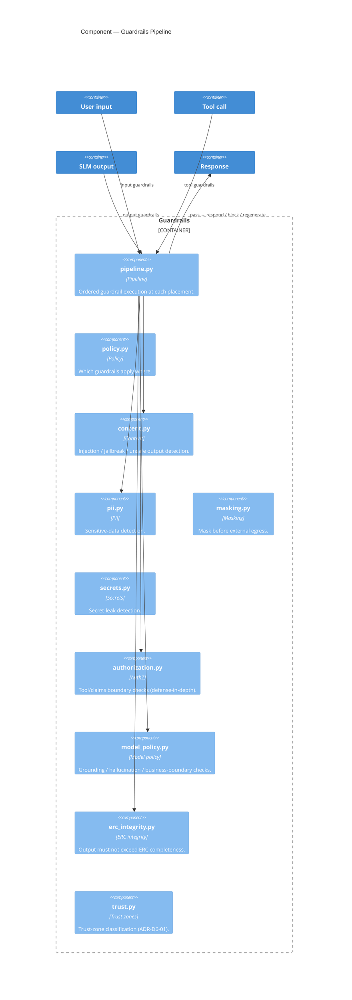

**Fail modes** (Runtime §64): guardrail failure → **block / regenerate**, never silently pass. The
`erc_integrity` guardrail is the anti-hallucination backstop: the response cannot assert more than the ERC
actually contains.

### 5.13 Memory & Cache

**Packages:** `src/pff_fa_ai/memory/` and `src/pff_fa_ai/cache/` (both Redis-backed)

Memory and cache are **distinct** and both separate from enterprise business state. Transaction-sensitive
values are **always** re-validated against authoritative APIs/events (`Architecture §21`).

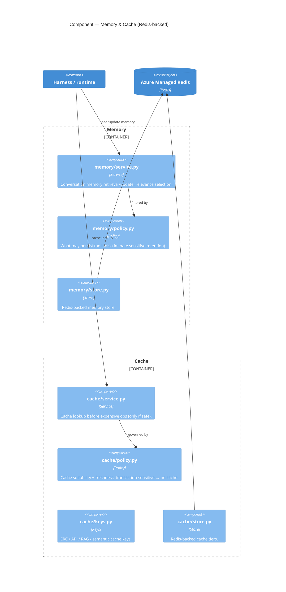

**Cache tiers:** ERC cache, API cache, RAG cache, semantic cache, (SLM KV cache at the serving layer).
Payment / approval / completion / official-assignment / team-status are **never** trusted from cache.

### 5.14 Messaging — Service Bus event consumer

**Package:** `src/pff_fa_ai/messaging/` (service_bus, events, handlers, reliability, routing)

This is the **event-driven runtime** that makes long-running and HIL workflows durable. Enterprise
completes an action hours/days later → event → ERC refresh → graph resume.

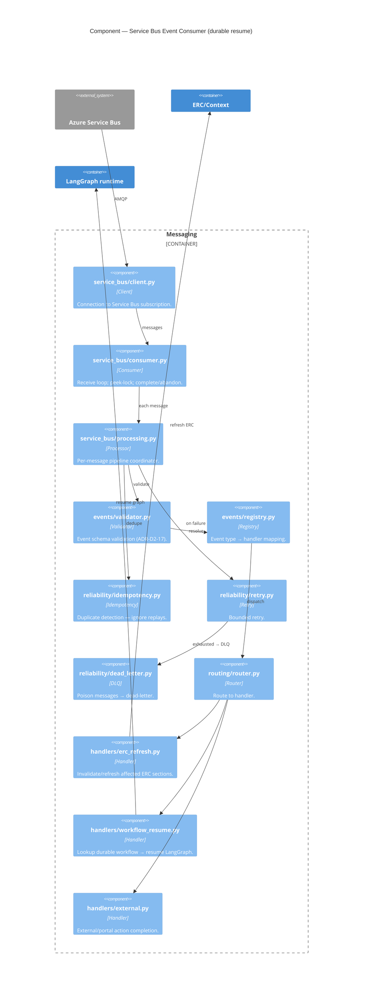

**Only events relevant to an active AI workflow cause resume** (Runtime §48). Idempotency guarantees an
event replay never re-fires a non-idempotent enterprise action.

### 5.15 Refinement loop

**Package:** `src/pff_fa_ai/orchestration/refinement/` (`ADR-D3-28`, Proposed → build to direction)

A **deterministic** quality gate applied *after* validity checks for quality-sensitive task classes. It
scores an output and, if below threshold, **bounded**-refines: regenerate with critique and/or escalate up
a model ladder — never silently accepting a below-bar output.

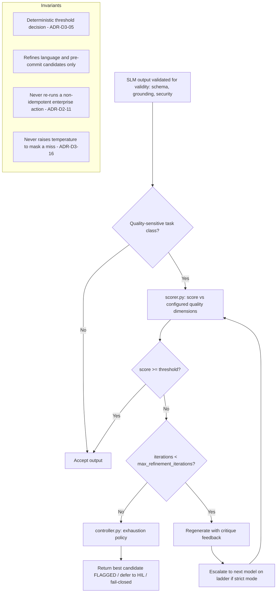

**Strict mode** raises the bar for governance-critical classes (transaction-outcome communication,
eligibility explanations, safeguarding-adjacent narration, HIL forms): higher threshold, ≥1 escalation
before acceptance, no below-bar acceptance (HIL or fail-closed on exhaustion).

### 5.16 Cross-cutting — Observability, Evaluation, Governance, Portal Links, Config

These containers wrap *every* runtime path. Shown together as a component collage.

```mermaid
C4Component
    title Component — Cross-cutting Capabilities

    Container_Boundary(obs, "Observability (observability/)") {
        Component(lf, "langfuse_client.py", "Tracing", "AI traces, prompts, tokens, cost (ADR-D7-02).")
        Component(res, "resilience.py", "Resilience", "Timeouts/retries/circuit hooks.")
        Component(errs, "errors.py", "Errors", "PlatformError hierarchy taxonomy (ADR-D7-05).")
    }
    Container_Boundary(ev, "Evaluation (evaluation/)") {
        Component(run, "runner.py", "Runner", "Offline eval + regression gate (ADR-D7-13).")
        Component(judge, "judge.py", "LLM-judge", "Quality scoring of responses.")
        Component(ds, "dataset.py", "Dataset", "Golden cases: intent/agent/tool/API/ERC/response.")
        Component(rm, "retrieval_metrics.py", "Metrics", "RAG retrieval quality.")
    }
    Container_Boundary(gov, "Governance (governance/)") {
        Component(gl, "lifecycle.py", "Lifecycle", "Artifact promotion gates (ADR-D6-15).")
        Component(gr, "registry.py", "Registry", "Versioned artifact registry.")
        Component(rr, "risk_register.py", "RAID", "Risk register (ADR-D8-06).")
    }
    Container_Boundary(pl, "Portal Links (portal_links/)") {
        Component(cat, "catalog.py", "Catalog", "Registered portal URLs — no invented URLs (ADR-D2-19).")
        Component(resv, "resolver.py", "Resolver", "Resolve link by key + claims.")
        Component(psec, "security.py", "Security", "Link exposure rules.")
    }
    Container_Boundary(cfg, "Configuration (configuration/)") {
        Component(load, "loader.py", "Loader", "5-stage env config bundles (base → env).")
        Component(rel, "release.py", "Release", "Immutable release manifest + hashing.")
        Component(sec, "secrets.py", "Secrets", "Key Vault via enterprise SPN only (ADR-D5-07).")
    }

    UpdateLayoutConfig($c4ShapeInRow="1", $c4BoundaryInRow="1")
```

**Traceability** (Observability §28): one correlation chain links Conversation ID → Workflow ID → Agent
Run ID → LangGraph Run → Tool Request ID → API Correlation ID → Service Bus Message ID → ERC Refresh —
so a single incident is followable end-to-end across both runtimes.

---

## 6. Level 4 — Code (selected)

L4 is drawn **only where the type structure carries a rule** — not for every module. Two views: the agent
contract, and the LangGraph state / ERC contract.

### 6.1 Agent contract & result (`agents/contract.py`, `agents/result.py`, `agents/context.py`)

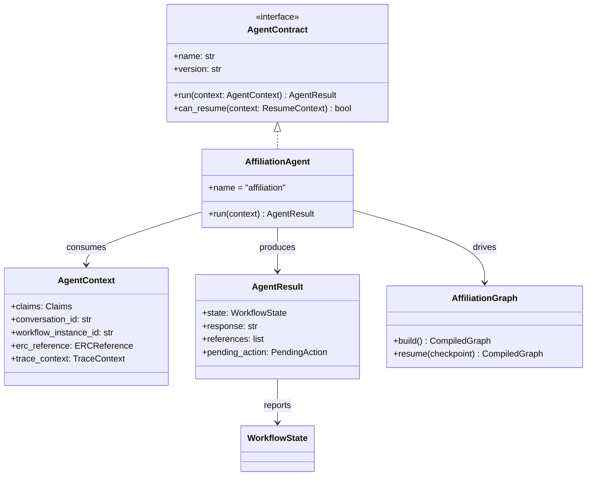

**Rule in the types:** an agent only ever *returns* an `AgentResult` carrying a **`WorkflowState`** —
it cannot itself commit enterprise truth. `pending_action` is how it signals "waiting for HIL / external
event" without owning the decision.

### 6.2 LangGraph state & ERC contract (`orchestration/langgraph/state.py`, `context/erc/models.py`)

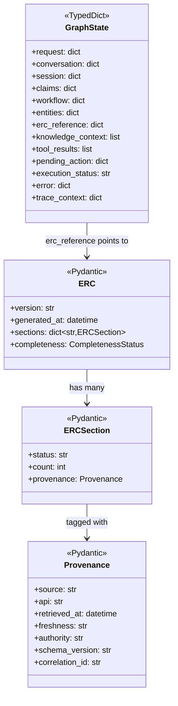

**Boundary discipline (`ADR-D2-07`):** LangGraph internal state is **`TypedDict`** (fast, mutable, graph-
local); everything that *crosses a boundary* — ERC, tool I/O, API/event contracts — is **Pydantic**
(validated). Large collections live behind an `erc_reference`, not copied into every state transition.

---

## 7. Dynamic diagrams (runtime flows)

Dynamic views number the interactions for a single scenario. These are where the architecture "moves."

### 7.1 Request-driven happy path — "What's the status of our affiliation?"

```mermaid
sequenceDiagram
    autonumber
    actor U as Club Admin
    participant API as FastAPI
    participant CM as Conversation Mgr
    participant SUP as Supervisor
    participant AG as Affiliation Agent
    participant H as Harness
    participant LG as LangGraph
    participant ERC as ERC/Context
    participant T as Tools
    participant APIM as APIM → PFF API
    participant RAG as RAG
    participant SLM as SLM (masked)
    participant G as Guardrails

    U->>API: POST /api/v1/chat (message, claims)
    API->>API: validate + input guardrails + correlation id
    API->>CM: load/create conversation + session
    CM->>CM: active workflow? (no)
    CM->>SUP: route intent
    SUP->>AG: intent=affiliation → AffiliationAgent
    AG->>H: enter harness (limits, context budget)
    H->>LG: execute graph
    LG->>ERC: determine + acquire required context
    ERC->>T: get_club / get_application / get_teams
    T->>APIM: HTTPS (allow-listed, idempotency-safe)
    APIM-->>T: enterprise results
    T-->>ERC: normalized + provenance
    ERC-->>LG: ERC (completeness=complete)
    LG->>RAG: policy knowledge needed? retrieve+cite
    RAG-->>LG: cited knowledge
    LG->>SLM: compose prompt (persona+ERC+RAG) → generate
    SLM-->>LG: draft response
    LG->>G: output guardrails (grounding, ERC integrity, PII)
    G-->>LG: pass
    LG-->>API: response + state=IN_PROGRESS
    API-->>U: SSE stream (Adam persona)
```

### 7.2 Event-driven durable resume — CFA approval arrives later (HIL)

```mermaid
sequenceDiagram
    autonumber
    participant PFF as PFF Enterprise
    participant OB as Outbox
    participant SB as Azure Service Bus
    participant EC as Event Consumer
    participant ID as Idempotency
    participant ERC as ERC/Context
    participant WF as Workflow Store (Redis)
    participant LG as LangGraph
    participant SLM as SLM
    actor U as Club Admin

    Note over PFF: CFA approves in County Portal (enterprise HIL decision)
    PFF->>OB: write ApplicationApproved event
    OB->>SB: publish (AMQP)
    SB->>EC: deliver (peek-lock)
    EC->>EC: validate event schema
    EC->>ID: duplicate?
    ID-->>EC: new
    EC->>ERC: invalidate + refresh affected sections
    EC->>WF: lookup durable workflow by entity id
    WF-->>EC: workflow instance @ WAITING_FOR_HUMAN
    EC->>LG: resume from checkpoint
    LG->>SLM: generate status update (persona: "VAR check cleared")
    SLM-->>LG: response
    LG->>WF: persist new state (INVOICED / COMPLETE)
    EC->>SB: complete message
    Note over U: On next poll/notification, Adam reports confirmed enterprise state
```

### 7.3 Affiliation E2E — business scenarios collapsed to states

The affiliation workflow the platform *narrates* (enterprise owns every decision). Statuses from
`pff_affiliation_e2e_flow.md`.

```mermaid
stateDiagram-v2
    [*] --> PRE_CHECK: Club Admin: "Affiliate teams"
    PRE_CHECK --> BLOCKED: officials / safeguarding / debt fail
    BLOCKED --> [*]: Adam explains fixes (factual)
    PRE_CHECK --> IN_PROGRESS: all checks pass (app created)
    IN_PROGRESS --> IN_PROGRESS: select teams, insurance (PL/PA), other products
    IN_PROGRESS --> SUBMITTED: Club Admin submits
    SUBMITTED --> COMPLETE: auto-approve (no CFA review, fee handled)
    SUBMITTED --> PENDING_CFA: isCfaReviewRequired / debt / welfare / doc
    PENDING_CFA --> INVOICED: CFA approves fee over 0 [WAITING_FOR_HUMAN]
    PENDING_CFA --> COMPLETE: CFA approves zero fee
    PENDING_CFA --> REJECTED: CFA rejects
    PENDING_CFA --> CANCELLED: CFA cancels
    INVOICED --> COMPLETE: payment confirmed [WAITING_FOR_EXTERNAL_EVENT]
    COMPLETE --> [*]: teams AFFILIATED, WGS integration, docs stored
    REJECTED --> [*]: Adam relays reason, offers resubmit
    CANCELLED --> [*]: Adam relays reason
    IN_PROGRESS --> CANCELLED: season-end timer (enterprise)
```

**Persona rule visible here:** Adam **never celebrates** `COMPLETE` until the authoritative event confirms
it — `INVOICED → COMPLETE` only on confirmed payment (`WAITING_FOR_EXTERNAL_EVENT`). "GOAL!" is earned only
after enterprise confirmation.

### 7.4 Large-collection batch failure (127 officials, batch 3 times out)

```mermaid
flowchart TD
    A["get_officials returns 127 records"] --> B[batching.py: split into 20-rec batches]
    B --> C1[Batch 1..7]
    C1 --> D{All batches OK?}
    D -->|Batch 3 TIMEOUT| E[retry.py: bounded retry batch 3]
    E --> F{Retry OK?}
    F -->|Yes| G[aggregator.py: merge all 127]
    F -->|No| H[Record partial + mark ERC section incomplete]
    H --> I{Is missing batch critical to the request?}
    I -->|No| G
    I -->|Yes| J[Pause / fail-safe - NO invented data]
    G --> K[ERC completeness = complete]
    J --> L[Adam: factual - cannot confirm officials right now]
    K --> M[Continue graph]
```

---

## 8. Deployment diagram (Azure / AKS)

**Question:** Where does everything run, and how is it networked?

Per `ADR-D5-20`, the platform **conforms to the Enterprise Application delivery model** — shared enterprise
AKS, Azure DevOps `build.yaml`/`release.yaml`, enterprise SonarQube gate. It stands up **no** separate
infra/CI/CD stack. CPU (runtime) and GPU (SLM) workloads scale independently (`ADR-D5-11`).

```mermaid
C4Deployment
    title Deployment — Azure / AKS

    Deployment_Node(devops, "Azure DevOps", "CI/CD") {
        Container(build, "build.yaml / release.yaml", "Pipeline", "SonarQube gate, eval regression gate, image build.")
        Container(vg, "Variable Group", "Secrets", "Enterprise SPN (tenant/client/secret) injected to workload.")
    }
    Deployment_Node(acr, "Azure Container Registry", "ACR") {
        Container(img, "pff-fa-ai image", "OCI", "Pinned deps (ADR-D5-09).")
    }

    Deployment_Node(azure, "Microsoft Azure (enterprise tenancy)", "") {
        Deployment_Node(aks, "Shared Enterprise AKS", "Kubernetes") {
            Deployment_Node(cpu, "CPU node pool", "") {
                Container(apipod, "FastAPI + AI Runtime pods", "Python", "HPA-scaled; stateless (state in Redis).")
                Container(ecpod, "Event Consumer pods", "Python", "Scales on Service Bus depth.")
            }
            Deployment_Node(gpu, "GPU node pool", "") {
                Container(vllm, "Self-hosted SLM (vLLM)", "GPU", "Target serving stack (ADR-D5-10); KV-cache/VRAM planned (ADR-D5-19).")
            }
        }
        Deployment_Node(mgd, "Managed Azure services", "") {
            ContainerDb(redis, "Azure Managed Redis", "Redis", "State + cache + memory.")
            ContainerDb(ais, "Azure AI Search", "Vector", "Knowledge index.")
            ContainerDb(kv, "Azure Key Vault", "Secrets", "Resolved via SPN only.")
            Container(sb, "Azure Service Bus", "Messaging", "Enterprise event subscription.")
            Container(apim, "Azure APIM", "Gateway", "AuthN/Z boundary to PFF.")
            Container(mon, "Azure Monitor / App Insights / Log Analytics", "Observability", "")
        }
    }

    Deployment_Node(ext, "External", "") {
        Container(hf, "Hugging Face Inference API", "SaaS", "Initial SLM + embeddings (masked egress).")
        Container(langfuse, "Langfuse", "SaaS/self-host", "AI traces/cost.")
        Deployment_Node(entzone, "Enterprise zone", "") {
            Container(pff, "PFF Enterprise + WGS + Payment", "", "System of record.")
        }
    }

    Rel(build, img, "pushes", "")
    Rel(img, apipod, "deploys", "")
    Rel(img, ecpod, "deploys", "")
    Rel(vg, apipod, "SPN env", "")
    Rel(apipod, redis, "RESP", "")
    Rel(apipod, ais, "HTTPS", "")
    Rel(apipod, kv, "SPN → secrets", "")
    Rel(apipod, vllm, "HTTPS (in-cluster)", "")
    Rel(apipod, hf, "HTTPS (masked)", "")
    Rel(apipod, apim, "HTTPS", "")
    Rel(apim, pff, "HTTPS", "")
    Rel(ecpod, sb, "AMQP", "")
    Rel(pff, sb, "events", "")
    Rel(apipod, mon, "OTLP", "")
    Rel(apipod, langfuse, "HTTPS", "")

    UpdateLayoutConfig($c4ShapeInRow="2", $c4BoundaryInRow="1")
```

**Environments** (`ADR-D5-14`): `LOCAL → DEV → TEST → QA → STAGING → PROD`, each with isolated resources
for enterprise APIs, Service Bus, SLM, Langfuse, vector, cache, prompts, feature flags and secrets.

---

## 9. Cross-cutting architectural invariants

These hold at **every** level above — they are the "why" behind the grey/blue split on each diagram.

### 9.1 Authoritative-truth precedence

```mermaid
flowchart LR
    A[Enterprise API / Event] --> B[ERC]
    B --> C[Cache]
    C --> D[RAG]
    D --> E[SLM output]
    style A fill:#1f6feb,color:#fff
    style E fill:#8b949e,color:#fff
    A -.->|higher wins on conflict| E
```
Implemented in `common/precedence.py`. If two sources conflict, the **higher one wins — no exceptions.**

### 9.2 Four separated state concepts (never conflated — `ADR-D4-01`)

| State | Owner | Store | Module |
|---|---|---|---|
| Conversation State | AI platform | Redis | `domain/conversation`, `application/conversation` |
| Session State | AI platform | Redis | `domain/session`, `application/session` |
| Workflow / Agent State | AI platform | Redis (checkpoint) | `domain/workflow`, `orchestration/langgraph` |
| Enterprise Business State | **PFF (enterprise)** | Enterprise DB | *never* stored here — read via ERC |

### 9.3 Zero-trust boundary chain (`ADR-D6-01`, Runtime §59)

```mermaid
flowchart TD
    C[Claims from APIM] --> W[Workflow access] --> A[Agent access] --> T[Tool access] --> X[Context access] --> S[SLM context] --> O[Output access]
```
Having access to the Chat API does **not** imply the SLM can reach every enterprise operation. Each hop is
an independent authorization narrowing.

### 9.4 The AI platform *never*

- authenticates/authorizes a request itself (APIM does) · re-implements business/compliance rules ·
  writes directly to the enterprise DB · invents portal URLs · silently guesses failed/ambiguous
  transaction outcomes · lets a model output become an authorization decision · exposes raw
  enterprise/personal data to an **external** SLM.

---

## 10. C4 element → source code map

Jump table from the diagrams to the code. (`src/pff_fa_ai/` root omitted.)

| C4 element | Level | Package / module |
|---|---|---|
| FastAPI App | L2/L3 | `api/`, `api/v1/chat.py` |
| Conversation & Session | L3 | `application/conversation`, `application/session`, `domain/conversation`, `domain/session` |
| Workflow orchestrator | L3 | `application/workflows/orchestrator.py`, `orchestration/workflow_orchestrator.py` |
| Supervisor / routing | L3 | `orchestration/supervisor/` |
| Agent Harness | L3 | `orchestration/harness/harness.py` |
| Affiliation Agent | L3/L4 | `agents/affiliation/`, `agents/contract.py`, `agents/result.py` |
| LangGraph engine | L3/L4 | `orchestration/langgraph/` |
| ERC & context | L3/L4 | `context/collection`, `context/erc`, `context/normalization`, `context/projection` |
| Integration / tools | L3 | `integration/tools`, `integration/api`, `integration/mcp`, `integration/execution` |
| RAG | L3 | `rag/` |
| Embedding / vector | L3 | `embedding_vector/` |
| SLM abstraction | L3 | `slm/`, `guardrails/masking.py`, `guardrails/token_vault.py` |
| Prompt engineering | L3 | `prompt_engineering/`, `prompts/*.yaml` |
| Guardrails | L3 | `guardrails/` |
| Memory & cache | L3 | `memory/`, `cache/` |
| Messaging / events | L3 | `messaging/` |
| Refinement loop | L3 | `orchestration/refinement/` |
| Observability | L3 | `observability/` |
| Evaluation | L3 | `evaluation/` |
| Governance | L3 | `governance/` |
| Portal links | L3 | `portal_links/` |
| Configuration & secrets | L3 | `configuration/`, `config/*.yaml` |
| Engineering agents (non-prod) | — | `engineering_agents/` |
| Precedence / claims / correlation | invariants | `common/precedence.py`, `common/claims.py`, `common/correlation.py` |

---

### Appendix — ADR cross-reference

The diagrams above are governed by the ADRs under `docs/architecture/adr/`. Notable anchors: `ADR-D1-02`
(Golden Rule), `ADR-D1-03` (precedence chain), `ADR-D2-01` (layering), `ADR-D2-02` (single runtime),
`ADR-D2-09` (harness boundary), `ADR-D3-09/10` (prompt/persona layers), `ADR-D3-28` (refinement loop),
`ADR-D4-01` (four-state separation), `ADR-D4-10` (Redis), `ADR-D3-24` (Azure AI Search), `ADR-D5-10`
(vLLM), `ADR-D5-20` (enterprise delivery), `ADR-D6-01` (zero-trust), `ADR-D6-19` (SLM masking).

*End of document.*

